# Claude Code安装

## 官方文档

[Claude Code overview - Claude Code Docs](https://code.claude.com/docs/en/overview)

## 安装``Claude Cli``

### macOS, Linux, WSL

```powershell
curl -fsSL https://claude.ai/install.sh | bash
```

### Windows PowerShell

```powershell
irm https://claude.ai/install.ps1 | iex
```

### windows CMD

```powershell
curl -fsSL https://claude.ai/install.cmd -o install.cmd && install.cmd && del install.cmd
```

> 如果出现如下报错：因为区域网络限制,推荐换用``Winget``

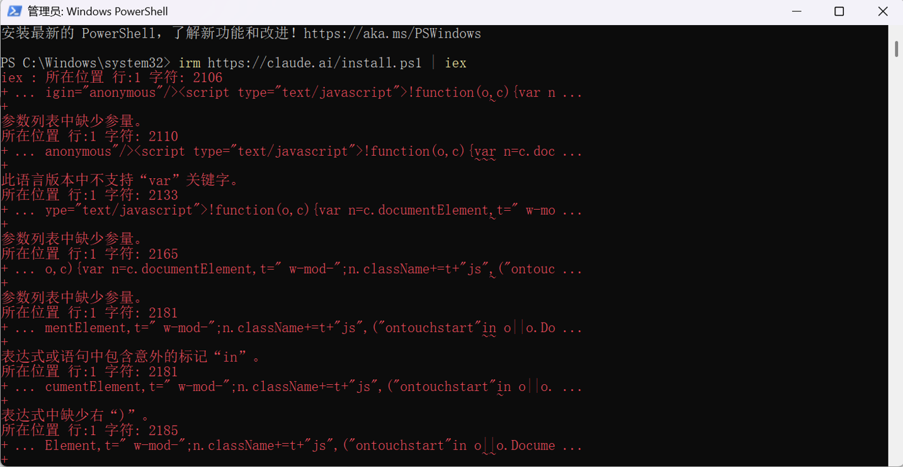

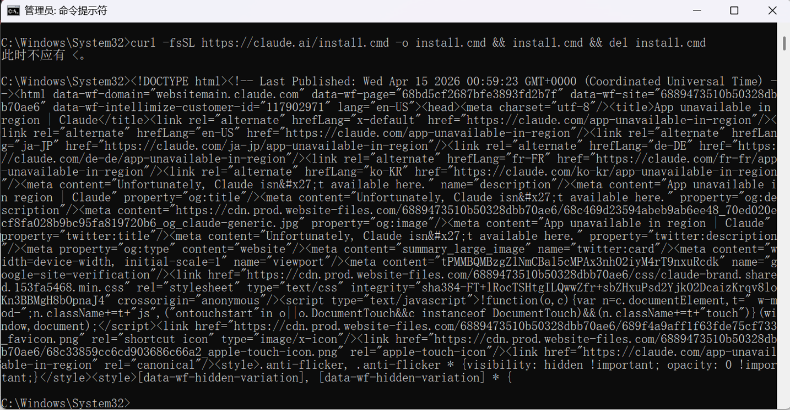

### ``Winget``(Windows推荐)

```powershell
#要挂梯子
#安装
winget install Anthropic.ClaudeCode

#更新 因为这种方式不会自动更新
winget upgrade Anthropic.ClaudeCode
```

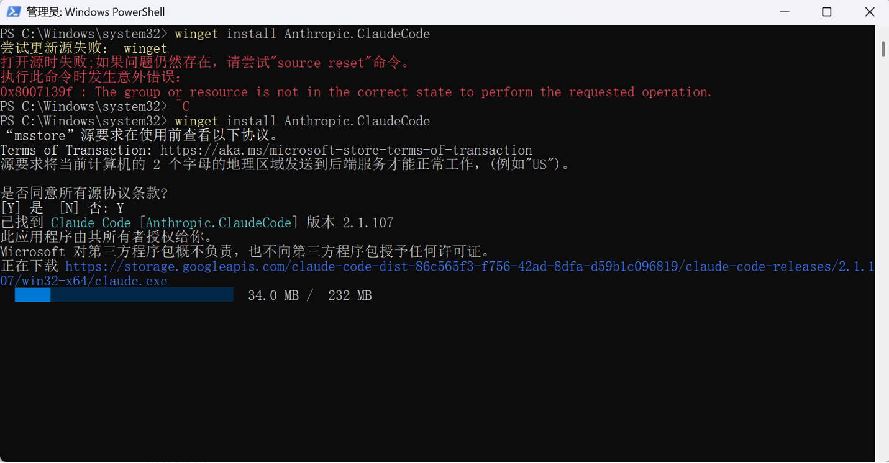

### ``npm``安装(推荐)

```powershell
npm install -g https://gaccode.com/claudecode/install --registry=https://registry.npmmirror.comCopy
```

### 验证安装

```powershell
claude --version
```

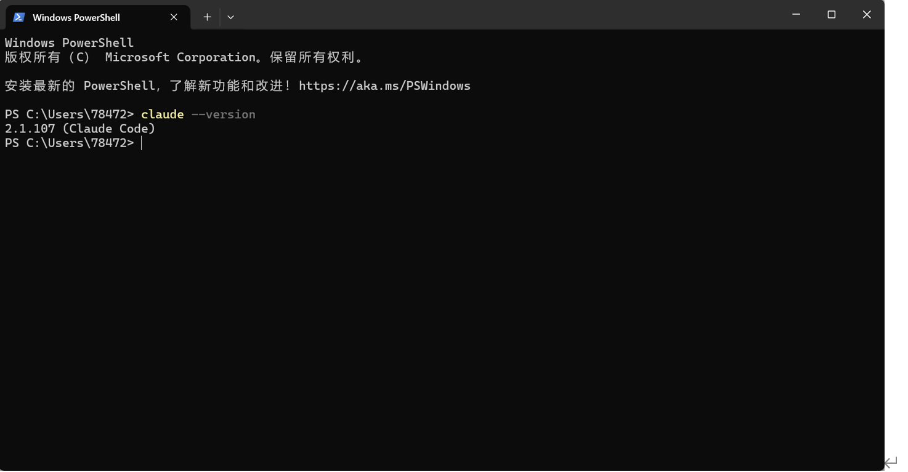

## 获取``API``

### 中转方案

| 名称           | 链接                                                         |
| -------------- | ------------------------------------------------------------ |
| ``hongmacc``   | <https://hongmacc.com/signup?ref=HONGMACC-4A20839E>          |
| 4api           | <https://4api.top/register?aff=pkS8>                         |
| ``AIcodewith`` | <https://aicodewith.com/zh/login?tab=register&invitation=Q71I6P> |
| Lion CC        | [https://codecodex.ai](https://codecodex.ai/)                |

### 国产大模型

| 名称         | 链接                                                         |
| ------------ | ------------------------------------------------------------ |
| ``DeepSeek`` | <https://api-docs.deepseek.com/zh-cn/guides/anthropic_api>   |
| 智谱 GLM     | <https://www.bigmodel.cn/claude-code?ic=U5NGPIMKRG>          |
| Kimi K2      | <https://zhuanlan.zhihu.com/p/1965040472201335898>           |
| ``MiniMax``  | <https://platform.minimaxi.com/docs/guides/text-ai-coding-tools> |

## 配置账号到 Claude Code

### 方案一：cc Switch（推荐，图形化操作）

下载安装 cc Switch：<https://github.com/farion1231/cc-switch/releases>


打开 cc Switch，点击新建配置：

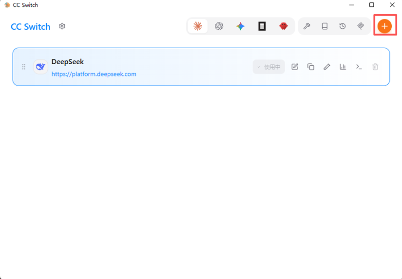

填写 API 配置信息：

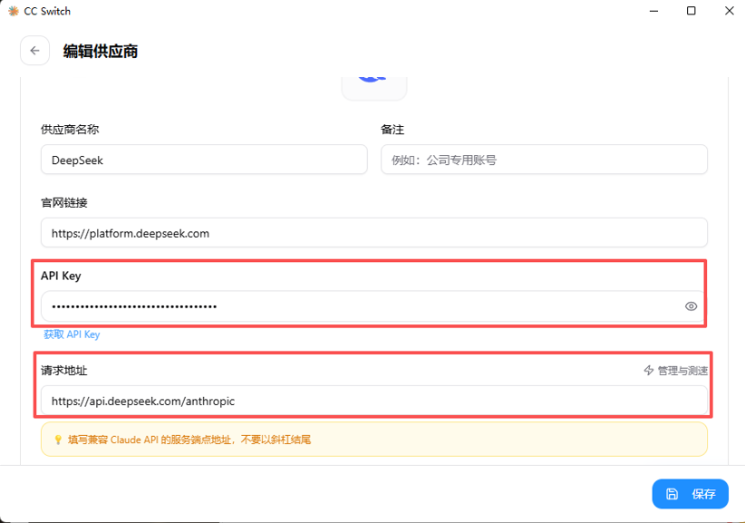

配置完成后，点击「应用到 Claude Code 插件」：

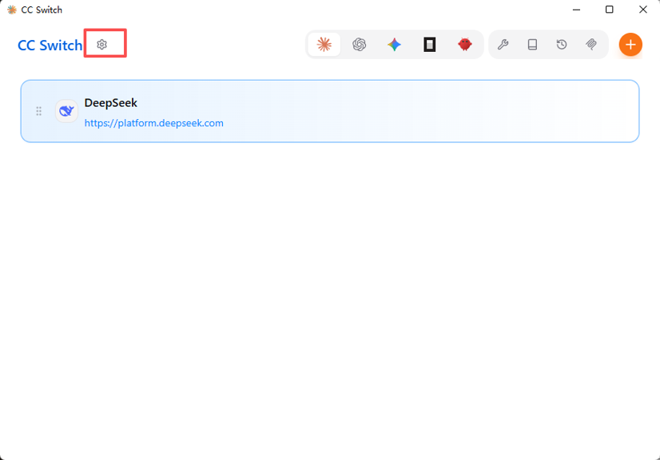

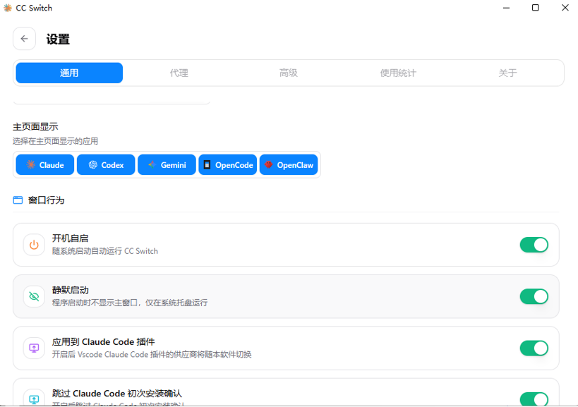

### 方案二：手动配置

在 `c:/用户/.claude/settings.json` 中添加：

```json
{
  "env": {
    "ANTHROPIC_AUTH_TOKEN": "sk-83ff106234194065b591227eead0d40c",
    "ANTHROPIC_BASE_URL": "https://api.deepseek.com/anthropic",
    "ANTHROPIC_DEFAULT_HAIKU_MODEL": "DeepSeek-V3.2",
    "ANTHROPIC_DEFAULT_OPUS_MODEL": "DeepSeek-V3.2",
    "ANTHROPIC_DEFAULT_SONNET_MODEL": "DeepSeek-V3.2",
    "ANTHROPIC_MODEL": "DeepSeek-V3.2"
  },
  "includeCoAuthoredBy": false
}
```

此时就可以待命令行使用

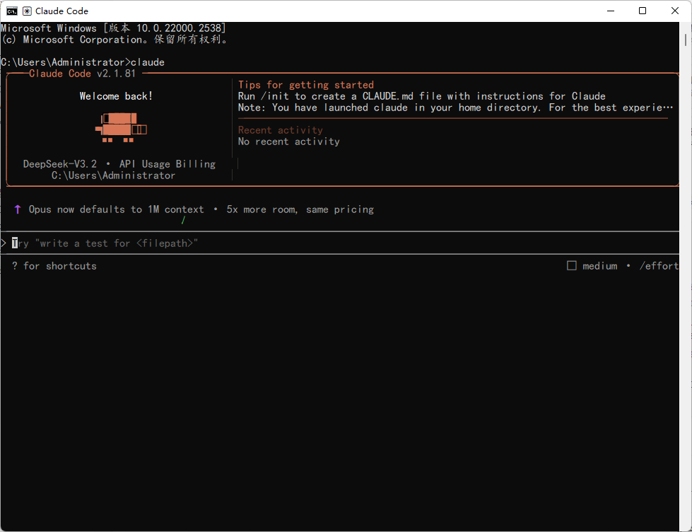

## 集成到``VsCode``

1. 安装扩展

   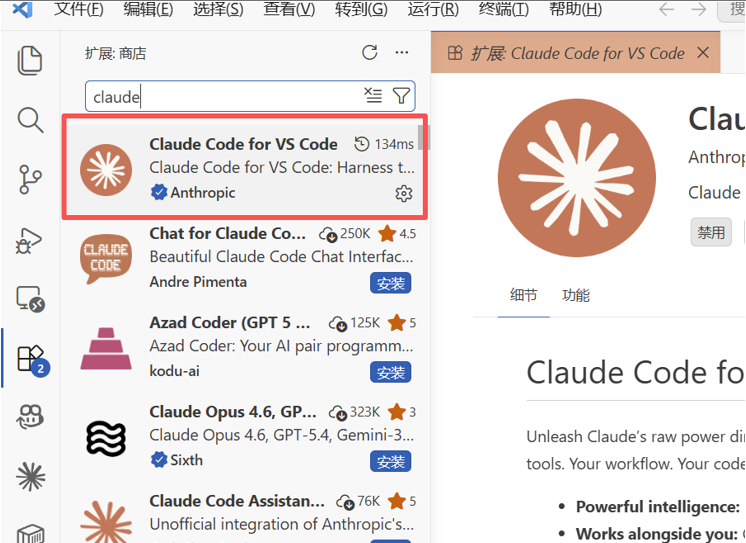

2. 重启 VS Code，如果出现以下界面说明配置成功：

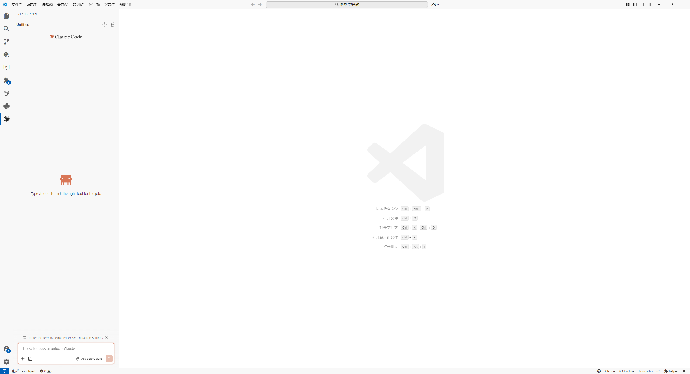


