# 机器学习

抖音：谦行``AIing``

## 机器学习概念

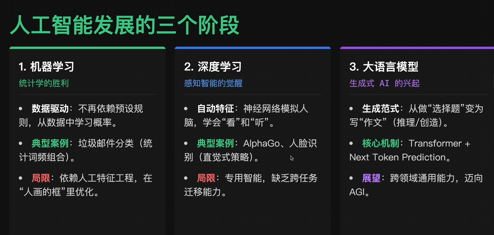

### 人工智能


### 机器学习


### 深度学习


### AI,ML和DL的包含关系

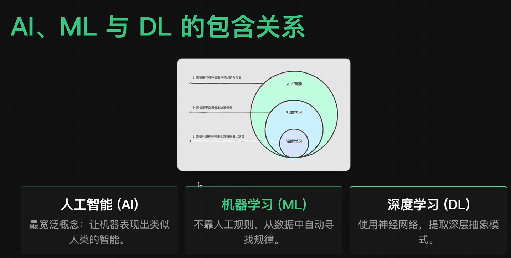

 ### 机器学习三要素

- 模型（model）：总结数据的内在规律，用数学语言描述的参数系统

- 策略（strategy）：选取最优模型的评价准则

- 算法（algorithm）：选取最优模型的具体方法

 #### 模型

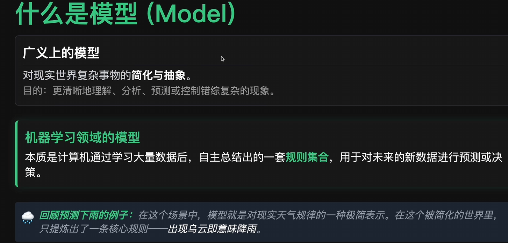

算法负责构建模型，模型负责预测未来

##### 专业术语-结合后面房子价格的案例

我们用来构建模型的数据，通常被称为**数据集 (Data set)**

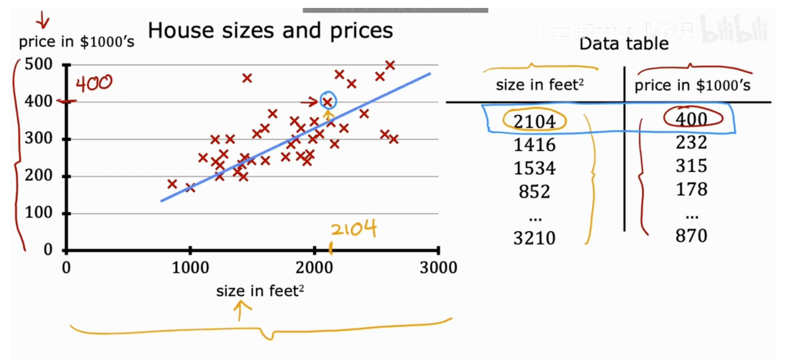

上面这张图非常直观地展示了数据点和数据表之间的关系。图上的每一个红叉，都对应着数据表中的一行。


- x: 表示输入变量 (input variable)，也常被称为特征 (feature)。在我们的例子中，x就是房屋的面积。
- y: 表示输出变量 (output variable)，也常被称为目标 (target)。在我们的例子中，y就是房屋的价格。
- m: 表示训练样本的数量 (number of training examples)。图中的例子里，我们有47个训练样本，所以 m=47。
- (x, y): 表示一个单个的训练样本 (single training example)。
- (x⁽ⁱ⁾, y⁽ⁱ⁾): 表示第 i 个训练样本。这里的上标 (i) 只是一个索引 (index)，代表第几行数据，它不是数学上的指数或次方。
  - 例如，(x⁽¹⁾, y⁽¹⁾) 就代表第一个训练样本，即 (2104, 400)。

#### 策略

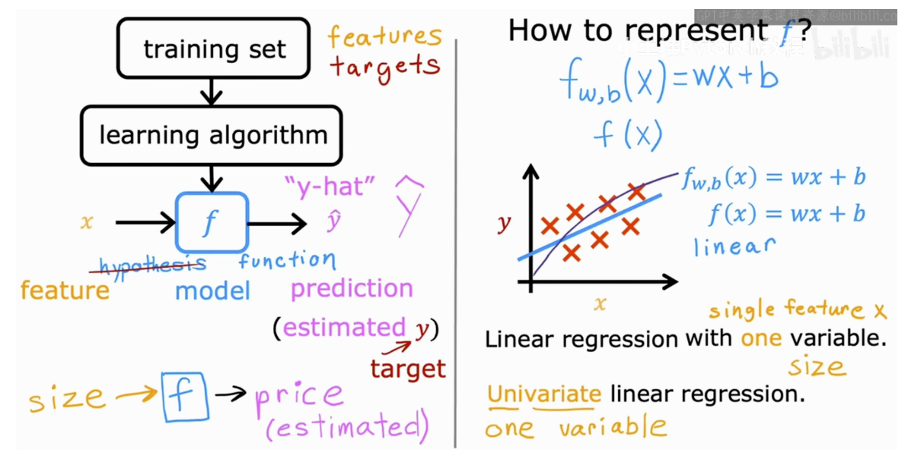

上图左侧清晰地展示了模型训练和预测的流程：

1. 我们将训练集 (training set)（包含了特征 x 和目标 y）喂给一个学习算法 (learning algorithm)。
2. 学习算法会输出一个函数 f。这个函数 f 就是我们最终得到的模型 (model)，在一些文献中它也被称为假设 (hypothesis)。
3. 当有新的输入 x（例如，一个全新的房屋面积）时，我们就可以用这个模型 f 来进行预测。模型输出的预测值，我们通常用 ŷ (读作 “y-hat”) 来表示。

#### 算法

那么，这个模型 f 的具体形式是什么呢？对于线性回归，我们希望找到一条直线来拟合我们的数据。初中数学告诉我们，一条直线的方程可以表示为 y = wx + b。在机器学习中，我们沿用这个形式，将模型写作：

f_w,b(x) = wx + b

这个模型只有一个输入特征 x（房屋面积），因此它被称为单变量线性回归 (Univariate linear regression)。“Univariate”中的“uni”就是“单一”的意思。

我们的核心任务，就是通过学习算法，找到最优的参数 w 和 b，使得这条直线能够最好地拟合我们的训练数据。

### 机器学习类型


#### 监督学习

##### 什么是监督学习

简单来说，监督学习就是我们给算法一个数据集，其中包含了“正确答案”。算法的任务就是学习输入与输出之间的映射关系，以便对新的、未知的数据进行预测。

就像下图展示的，我们有输入（X），通过某种学习算法，映射到输出标签（Y）。整个过程的核心思想是，我们通过提供一系列带有“正确答案”的样本来“监督”算法进行学习。


##### 应用实例


从上图中我们可以看到：

- 垃圾邮件过滤 (Spam filtering)：输入是邮件内容，输出是判断这封邮件是否为垃圾邮件（通常用0/1表示）。

- 语音识别 (Speech recognition)：输入是音频片段，输出是对应的文字记录。

- 机器翻译 (Machine translation)：输入是一种语言的文本（比如英语），输出是另一种语言的文本（比如西班牙语）。

- 在线广告 (Online advertising)：输入是广告信息和用户信息，输出是用户是否会点击这个广告（0/1）。

- 自动驾驶 (Self-driving car)：输入是汽车的图像、雷达信息等，输出是路面上其他车辆的位置。

- 视觉检测 (Visual inspection)：输入是产品的图片（比如手机），输出是判断产品是否存在缺陷（0/1）。

  

  这些例子都遵循着从输入X到输出Y的模式，并且都是通过学习大量已知答案的数据集来实现的。

##### 应用实例-房价预测

场景：根据房屋的面积预测房价，收集到一些数据并绘制出了如下图片（横轴是房屋的面积，纵轴是价格）


问题：根据以上数据，分析如果一个房子的面积是750平方英尺，那么价格是多少

方法：通过学习算法，将上面数据拟合成一条直线，根据这条直线找到750平方英尺房子所对应的价格差不多15万美元


也可能拟合成曲线，通过更复杂的函数，此时会更加精确的看到750平方英尺的房子价格差不多20万美元


##### 应用实例-乳腺癌检测

场景：构建一个机器学习系统，以便医生用这个诊断工具来检测乳腺癌

问题：如何区分良性和恶性肿瘤

方法：数据集中包含各种大小的肿瘤，这些肿瘤通过用0表示良性，1表示恶性的方法进行标记。然后将数据绘制成图表，图表的横轴表示肿瘤大小，纵轴只有两个值也就是0和1，取决于肿瘤是良性还是恶性

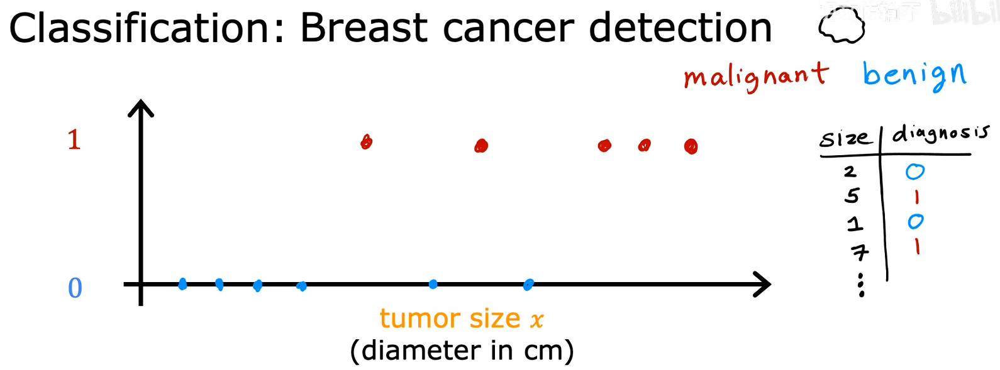

**或者这样绘制，⚪️代表良性，X代表恶性**


**分类算法也可以预测两种以上的类型**

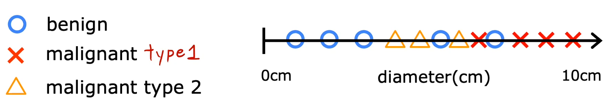

也可以考虑除了肿瘤大小之外，加上患者的年龄作为预测的输入(即多个两个和两个以上的数据集的输入)，用⚪️表示良性，X表示恶性。学习算法拟合出一条边界线，帮助医生进行诊断


##### 监督学习的类型

上面的房价实例对应使用的就是回归算法，乳腺癌监测是分类算法

回归算法无限多的可能输出中预测输出值

分类预测的是一个小的，有限的，限定范围内的可能输出类别，例如0,1和2；猫,狗；良性,恶性 


#### 无监督学习

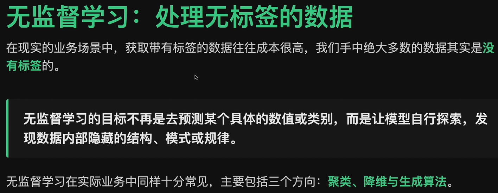

##### 无监督vs监督


- 监督学习 (Supervised learning)：处理的是有标签 (labeled) 的数据。就像左图所示，我们提前为数据点标记好了类别（紫色圆圈和红色叉），算法的目标是学习如何区分它们，并画出一条决策边界。
- 无监督学习 (Unsupervised learning)：处理的是无标签 (unlabeled) 的数据。如右图所示，我们只有一堆数据点，没有任何关于它们类别的信息。算法的目标是在这些数据中自主地发现有趣的结构或模式。最常见的任务之一就是将数据分成不同的簇（cluster），这个过程也叫做聚类 (Clustering)。

简单来说，无监督学习的数据只有输入X，没有输出标签Y。算法必须靠自己去数据中寻找内在的结构。

##### 聚类算法


###### 案例：谷歌新闻

每天浏览成千上万的文章，并将相关报道分组到一起。以下的样本中头条新闻是：大熊猫在日本最古老的动物园产下红色双胞胎幼崽，而下方的所有文章标题也都出现了熊猫，动物园，双胞胎这些字样。聚类算法找到这些存在相似词语的文章并将这些新闻分到一个组当中，而聚类算法自己就弄清楚了哪些词语表明这些文章可以属于同一组。


##### 降维算法

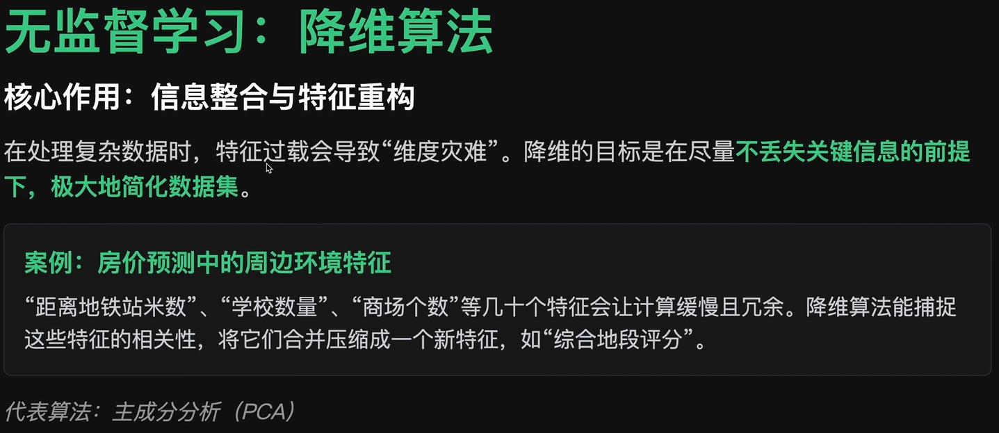

##### 生成算法


##### 异常检测

从数据中识别出那些与正常数据模式显著不同的“异常点”或“离群点”

#### 强化学习


- Q-Learning算法
- 蒙特卡洛树搜索
- 策略梯度算法
- 模仿学习
- 动态规划

#### 推荐系统

## 线性回归

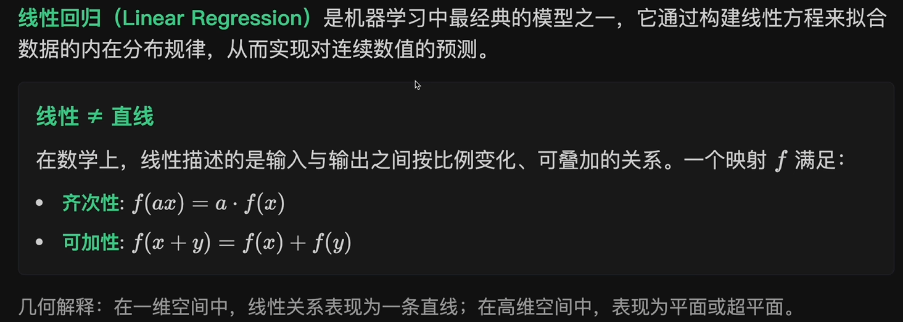

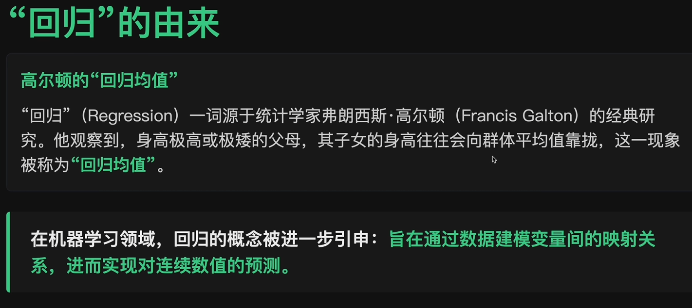

### 模型公式


### 损失(代价)函数

在线性回归中我们有一个像这样的训练集，m代表了训练样本的数量，比如m = 47   。而我们的假设函数，也就是用来进行预测的函数，是这样的线性函数形式： 

接下来我们会引入一些术语我们现在要做的便是为我们的模型选择合适的**参数**（**parameters**）和   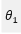，在房价问题这个例子中便是直线的斜率和在  轴上的截距。

我们选择的参数决定了我们得到的直线相对于我们的训练集的准确程度，模型所预测的值与训练集中实际值之间的差距（下图中蓝线所指）就是**建模误差**（**modeling error**）


我们的目标便是选择出可以使得建模误差的平方和能够最小的模型参数。

#### 均方误差（MSE）


##### 优点

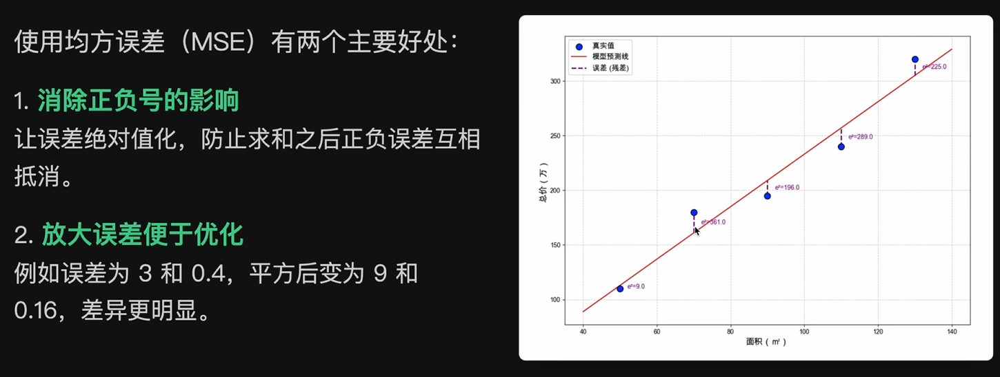

#### 平均绝对误差


平均绝对误差受异常值影响较小，但对小误差的惩罚较弱。适用与数据中存在显著异常值（如金融风险预测）的场景

### 寻找最优解

#### 梯度下降

1. 实际是求偏导过程，以拟合直线``f(x)=wx+b``来举例

2. 在线性回归中，使用样本数据对参数w , b 进行拟合时，需要定义一个损失函数用来衡量预测值与真实值

    的误差，而解决问题的方法就是使用梯度下降法来逐步缩小这个误差【均方误差】，损失函数如下：
   

3. 计算梯度，对于损失函数求偏导

   

4. 参数w , b 在梯度的反方向上更新，采用固定学习率α (alphaα)


##### 学习率

学习率的选择通常需要实验调整，常见的起始值有 0.01、0.001、0.0001 等

学习率（Learning Rate）控制参数更新的步长：
- **学习率太小**：收敛速度慢，需要更多迭代
- **学习率太大**：可能震荡甚至发散，无法收敛
- **合适的学习率**：快速稳定地收敛到最优解

### 示例1-房价

```python
import numpy as np
# scikit-learn
from sklearn.linear_model import LinearRegression

# 1.准备数据：4个特征(面积、楼层、距地铁、房龄)
X = np.array([
   [50,3,0.5,5],
   [70,15,1.2,10],
   [90,8,0.3,2],
   [110,20,2.0,15],
   [130,12,0.8,8],
])

y = np.array([180,210,320,280,380]) # 总价

# 2.训练模型
model = LinearRegression()
model.fit(X, y)

# 3.查看学到的权重
feature_names = ['面积','楼层','距地铁','房龄']
print("多特征权重：")
for name,w in zip(feature_names,model.coef_):
    print(f"{name}:{w:+.2f}")

print(f"  偏置 b: {model.intercept_:.2f}")

# 4.预测新数据：100m²、10楼、距地铁0.6km、房龄5年
new_house = np.array([[100,10,0.6,5]])
pred = model.predict(new_house)
print(f"\n预测房价: {pred[0]:+.2f} 万元")
```

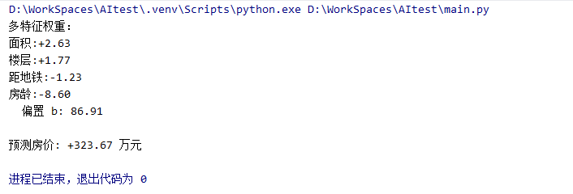

### 示例2-梯度下降

假设房价与面积呈线性关系：

房价 = w * 面积 + b

我们的目标是通过梯度下降算法，从数据中学习出参数 w 和 b。

#### 生成模拟数据

生成 100 套房屋的数据，面积范围 90-150 平米。为了使梯度下降更稳定，我们将面积单位转换为**百平米**，这样数据范围变为 0.9-1.5。

真实规律：房价 ≈ 250 * 面积(百平米) + 30 等价于 房价 ≈ 2.5 * 面积(平米) + 30

```python
import numpy as np
import matplotlib.pyplot as plt

plt.rcParams['font.sans-serif'] = ['SimHei', 'Arial Unicode MS', 'DejaVu Sans']
plt.rcParams['axes.unicode_minus'] = False

np.random.seed(42)
n_samples = 100
areas_m2 = np.random.uniform(90, 150, n_samples)
areas = areas_m2 / 100
prices = 250 * areas + 30 + np.random.randn(n_samples) * 15

print(f"房屋数量: {len(areas)} 套")
print(f"面积范围: {areas_m2.min():.1f} - {areas_m2.max():.1f} 平米 ({areas.min():.2f} - {areas.max():.2f} 百平米)")
print(f"价格范围: {prices.min():.1f} - {prices.max():.1f} 万")
print(f"真实规律: 房价 = 2.5 × 面积(平米) + 30")
```

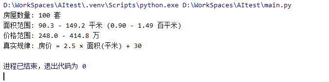

#### 梯度下降算法

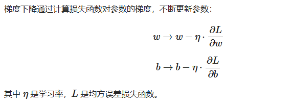

```python
def gradient_descent(X, y, lr=0.1, epochs=200):
    # 初始化参数
    w, b = 0.0, 0.0
    n = len(X)

    # 初始化历史记录，使用记录初始参数和损失
    history = {'w': [w], 'b': [b], 'loss': [np.mean((w * X + b - y) ** 2)]}

    # 进行迭代训练，更新参数
    for epoch in range(epochs):
        # 计算当前预测值
        y_pred = w * X + b

        # 计算参数 w 梯度
        dw = (2 / n) * np.sum((y_pred - y) * X)
        # 计算参数 b 梯度
        db = (2 / n) * np.sum(y_pred - y)

        # 使用学习率更新参数
        w -= lr * dw
        b -= lr * db

        # 记录参数和损失
        history['w'].append(w)
        history['b'].append(b)
        history['loss'].append(np.mean((y_pred - y) ** 2))

        # 每隔 1% 训练轮数，打印一次进度
        if epoch % (epochs / 100) == 0:
            print(f"迭代 {epoch:3d}: w={w:.2f}, b={b:.2f}, loss={history['loss'][-1]:.2f}")

    return history


history = gradient_descent(areas, prices, lr=0.01, epochs=100000)
print(f"\n最终结果: 房价 = {history['w'][-1] / 100:.3f} × 面积(平米) + {history['b'][-1]:.2f}")
```


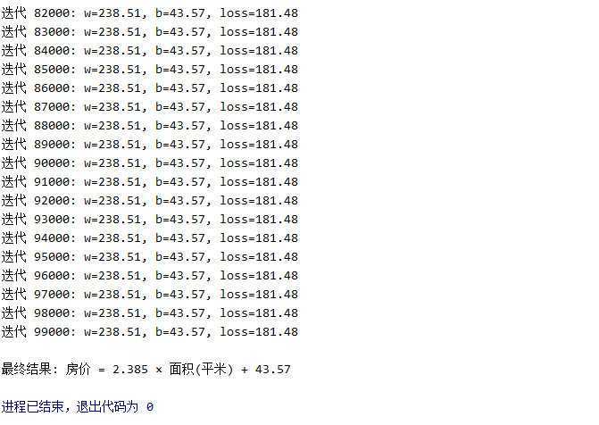

#### 使用``adam``优化器加速训练

```python
def adam_optimizer(X, y, lr=0.1, epochs=200, beta1=0.9, beta2=0.999, epsilon=1e-8):
    # 初始化参数
    w, b = 0.0, 0.0
    n = len(X)

    # ================= Adam 特有的状态变量初始化 =================
    m_w, v_w = 0.0, 0.0  # w 的一阶矩和二阶矩
    m_b, v_b = 0.0, 0.0  # b 的一阶矩和二阶矩
    # =============================================================

    # 初始化历史记录
    history = {'w': [w], 'b': [b], 'loss': [np.mean((w * X + b - y) ** 2)]}

    # 进行迭代训练
    for epoch in range(epochs):
        t = epoch + 1  # Adam 的时间步 t 从 1 开始，用于偏差校正

        # 1. 计算当前预测值
        y_pred = w * X + b

        # 2. 计算当前梯度 (这部分和普通梯度下降完全一样)
        dw = (2 / n) * np.sum((y_pred - y) * X)
        db = (2 / n) * np.sum(y_pred - y)

        # ================= Adam 核心参数更新逻辑 =================
        # 3. 更新一阶矩估计（动量：累积历史梯度方向）
        m_w = beta1 * m_w + (1 - beta1) * dw
        m_b = beta1 * m_b + (1 - beta1) * db

        # 4. 更新二阶矩估计（RMSProp：累积历史梯度平方）
        v_w = beta2 * v_w + (1 - beta2) * (dw ** 2)
        v_b = beta2 * v_b + (1 - beta2) * (db ** 2)

        # 5. 计算偏差校正后的一阶和二阶矩（解决初期向 0 偏移的问题）
        m_w_hat = m_w / (1 - beta1 ** t)
        m_b_hat = m_b / (1 - beta1 ** t)
        v_w_hat = v_w / (1 - beta2 ** t)
        v_b_hat = v_b / (1 - beta2 ** t)

        # 6. 使用 Adam 公式更新参数
        w -= lr * m_w_hat / (np.sqrt(v_w_hat) + epsilon)
        b -= lr * m_b_hat / (np.sqrt(v_b_hat) + epsilon)
        # =========================================================

        # 计算当前 loss
        current_loss = np.mean((w * X + b - y) ** 2)

        # 记录参数和损失
        history['w'].append(w)
        history['b'].append(b)
        history['loss'].append(current_loss)

        # 每隔 1% 训练轮数，打印一次进度 (防止epochs较小报错，加个max限制)
        print_step = max(1, int(epochs / 100))
        if epoch % print_step == 0:
            print(f"迭代 {epoch:5d}: w={w:.4f}, b={b:.4f}, loss={current_loss:.4f}")

    return history


# ================= 运行测试 =================
# 提示：Adam 的收敛速度通常比普通梯度下降快很多。
# 原来需要 100,000 次，现在可能 10,000 ~ 50,000 次就足够收敛了。
# 学习率对 Adam 来说通常设为 0.1, 0.01 或 0.001 都可以自适应调整。
history = adam_optimizer(areas, prices, lr=0.1, epochs=50000)

print(f"\n最终结果: 房价 = {history['w'][-1] / 100:.3f} × 面积(平米) + {history['b'][-1]:.2f}")
```


#### 可视化结果

```python
# 创建一个 1 行 3 列的子图布局
fig, axes = plt.subplots(1, 3, figsize=(15, 5))

# 绘制房屋数据散点图
axes[0].scatter(areas_m2, prices, c='steelblue', s=60, alpha=0.7, label='房屋数据')

# 绘制拟合曲线
x_line = np.linspace(85, 155, 100) # 在 (85,100) 区间，生成 100 个等间距的点
y_line = (history['w'][-1]/100) * x_line + history['b'][-1] # 计算拟合曲线的 y 值
axes[0].plot(x_line, y_line, 'coral', lw=2,
             label=f'拟合: y={history["w"][-1]/100:.3f}x+{history["b"][-1]:.1f}')
axes[0].set_xlabel('面积 (平米)', fontsize=12)
axes[0].set_ylabel('房价 (万)', fontsize=12)
axes[0].set_title('房价预测模型', fontsize=14)
axes[0].legend(fontsize=10)
axes[0].grid(True, alpha=0.3)

# 跳过前 100 个迭代，避免初始值对收敛过程演示的干扰
skip = 100

### 绘制参数收敛过程

# 绘制 w 目标值水平线
axes[1].axhline(250, color='steelblue', ls='--', alpha=0.5)
# 绘制 w 收敛过程
axes[1].plot(history['w'][skip:], 'steelblue', lw=2, label='w (目标: 250)')

# 绘制 b 目标值水平线
axes[1].axhline(30, color='darkorange', ls='--', alpha=0.5)
# 绘制 b 收敛过程
axes[1].plot(history['b'][skip:], 'darkorange', lw=2, label='b (目标: 30)')

axes[1].set_xlabel('迭代次数', fontsize=12)
axes[1].set_ylabel('参数值', fontsize=12)
axes[1].set_title('参数收敛过程', fontsize=14)
axes[1].legend(fontsize=10)
axes[1].grid(True, alpha=0.3)

# 绘制损失函数下降过程
axes[2].plot(history['loss'][skip:], 'orangered', lw=2)
axes[2].set_xlabel('迭代次数', fontsize=12)
axes[2].set_ylabel('损失 (MSE)', fontsize=12)
axes[2].set_title('损失函数下降', fontsize=14)
axes[2].grid(True, alpha=0.3)

plt.tight_layout()
plt.show()
```


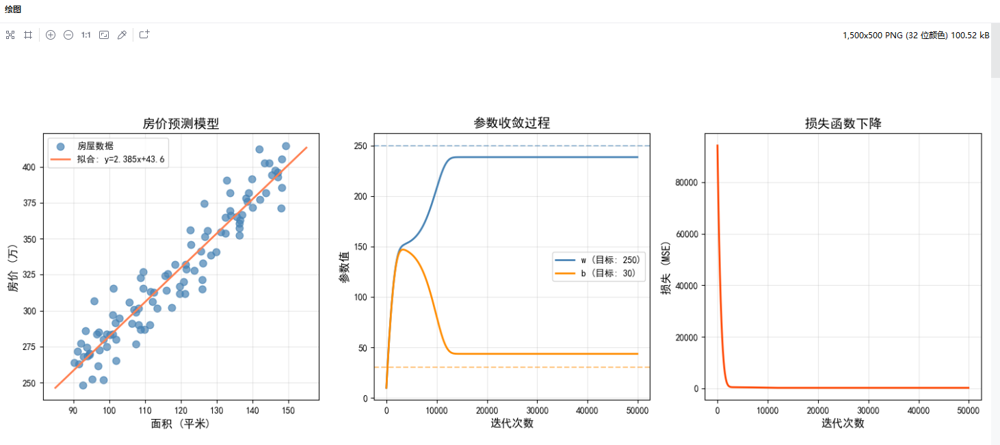

#### 对比不同学习率的效果

```python
import numpy as np
import matplotlib.pyplot as plt

plt.rcParams['font.sans-serif'] = ['SimHei', 'Arial Unicode MS', 'DejaVu Sans']
plt.rcParams['axes.unicode_minus'] = False

# ============ 核心逻辑 ============
def gradient_descent(start_x, lr, n_steps=15):
    """在 f(x)=x² 上做梯度下降，返回每步的 x 值"""
    trajectory = [start_x]
    x = start_x
    for _ in range(n_steps):
        grad = 2 * x                # f'(x) = 2x
        x = x - lr * grad           # 参数更新
        trajectory.append(x)
        if abs(x) > 500:            # 已经爆炸，提前停
            break
    return trajectory

# ============ 四种学习率对比 ============
x0 = 4.0
configs = [
    (0.05, '太小：蜗牛爬坡',     'steelblue'),
    (0.3,  '合适：稳步收敛',     'seagreen'),
    (0.9,  '偏大：剧烈震荡',     'orange'),
    (1.1,  '过大：梯度爆炸',  'crimson'),
]

# ---------- 图1：参数值随迭代变化 ----------
fig, axes = plt.subplots(2, 2, figsize=(12, 8))
for ax, (lr, title, color) in zip(axes.flatten(), configs):
    traj = gradient_descent(x0, lr)
    ax.plot(range(len(traj)), traj, 'o-', color=color, markersize=5)
    ax.axhline(y=0, color='gray', linestyle='--', alpha=0.5, label='最优点 x=0')
    ax.set_title(f'lr={lr} — {title}', fontsize=12)
    ax.set_xlabel('迭代次数')
    ax.set_ylabel('参数 x')
    ax.legend()
    ax.grid(True, alpha=0.3)

plt.suptitle('学习率对梯度下降的影响（参数变化）', fontsize=14, fontweight='bold')
plt.tight_layout()
plt.show()

# ---------- 图2：在损失曲线上可视化轨迹 ----------
fig, axes = plt.subplots(2, 2, figsize=(12, 8))
x_curve = np.linspace(-8, 8, 300)

for ax, (lr, title, color) in zip(axes.flatten(), configs):
    traj = gradient_descent(x0, lr, n_steps=10)
    # 只保留不越界的点，方便画图
    traj_plot = [x for x in traj if abs(x) <= 10]

    ax.plot(x_curve, x_curve**2, 'k-', alpha=0.2, linewidth=2)   # 损失曲线
    ax.plot(traj_plot, [x**2 for x in traj_plot], 'o', color=color, markersize=6)

    # 画箭头连接每一步
    for i in range(len(traj_plot) - 1):
        ax.annotate('', xy=(traj_plot[i+1], traj_plot[i+1]**2),
                    xytext=(traj_plot[i], traj_plot[i]**2),
                    arrowprops=dict(arrowstyle='->', color=color, lw=1.5))

    ax.set_title(f'lr={lr} — {title}', fontsize=12)
    ax.set_xlim(-9, 9)
    ax.set_ylim(-5, 70)
    ax.set_xlabel('x')
    ax.set_ylabel('f(x) = x²')
    ax.grid(True, alpha=0.3)

plt.suptitle('学习率对梯度下降的影响（损失曲面轨迹）', fontsize=14, fontweight='bold')
plt.tight_layout()
plt.show()
```

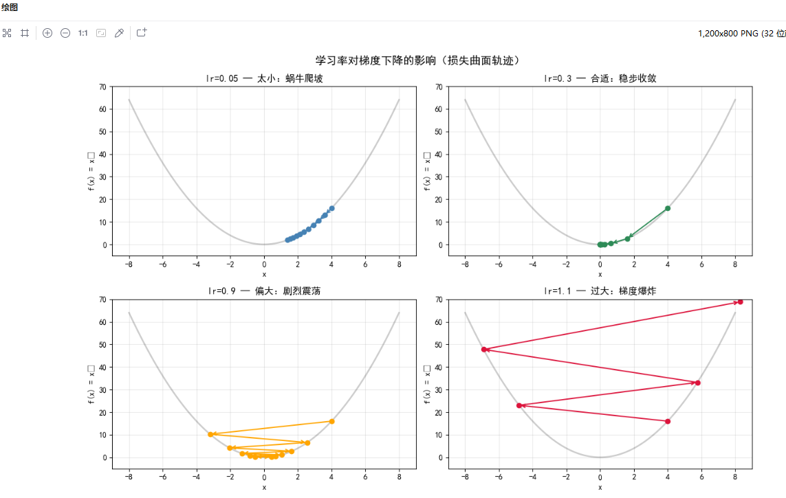

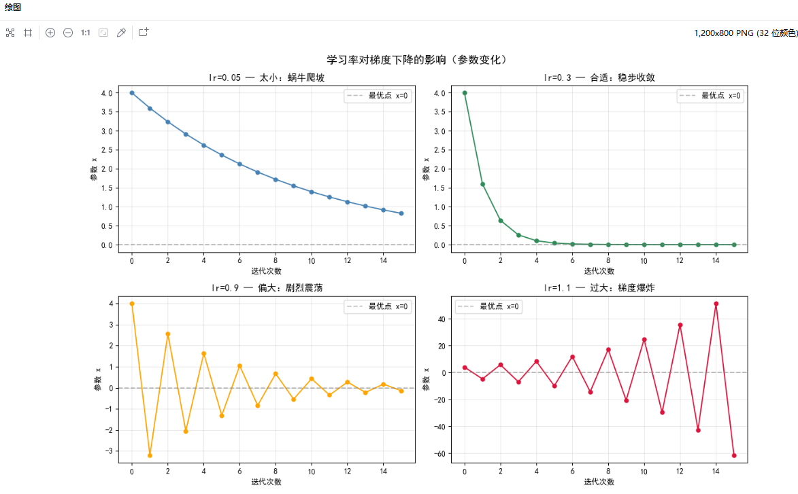

### 示例3-吴恩达版梯度下降实例

说明：左上角是模型和数据的图，右上角是代价函数的等高线图，下方是同一个代价函数的曲面图。这个例子中将w初始化为-0.1，b初始化为900

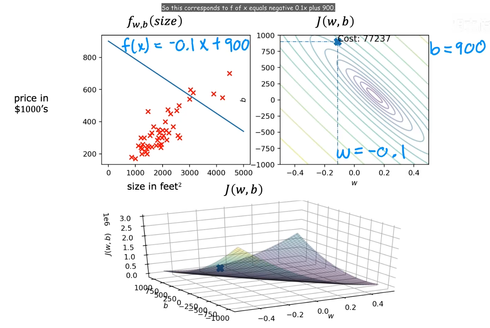

执行一次梯度下降之后，代价函数会从🔵移动到🟠，作图的拟合执行也发生变化

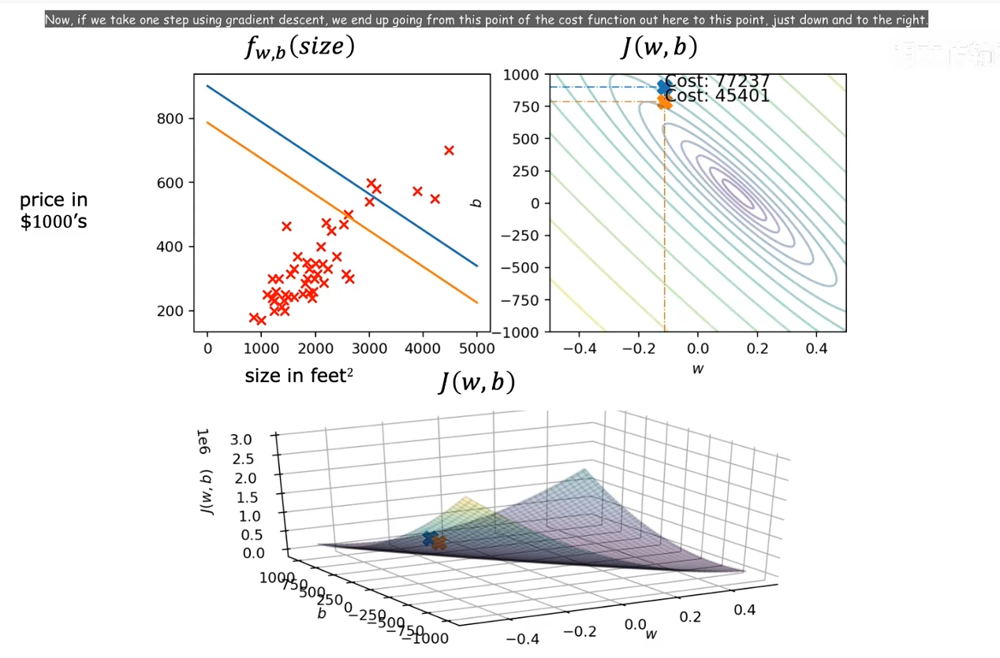

继续执行一次之后，代价函数移动到了🟢，左图函数f(x)同样发生变化


不断继续执行梯度下降更新w和b，代价每一次都在降低，左边拟合直线也越来越贴合数据，直到到达全局最小值


### 梯度下降的优化算法

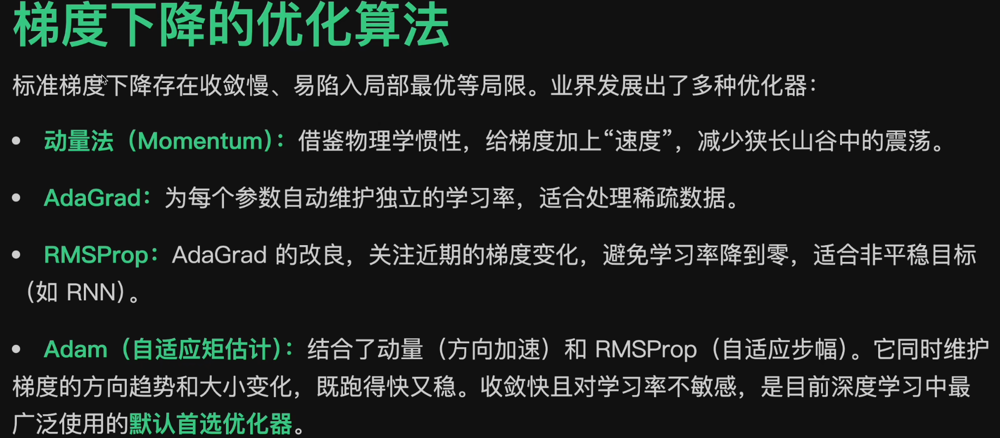

#### Adam 优化器

``Adam = Momentum + RMSProp``。同时维护梯度的方向趋势（一阶矩）和大小变化（二阶矩）

#### 梯度下降的变体


#### 正规方程法

1. 正规方程法（Normal Equation）是一种用于求解线性回归的解析解的方法。它基于最小二乘法，通过求解矩阵方程来直接获得参数值
2. 正规方程法适用于特征数量较少的情况。当特征数量较大时，计算逆矩阵的复杂度会显著增加，此时梯度下降法更为适用

```python
# fit_intercept: 是否计算偏置
model = sklearn.linear_model.LinearRegression(fit_intercept=True)
model.fit([[0, 3], [1, 2], [2, 1]], [0, 1, 2])
# coef_: 系数
print(model.coef_)
# intercept_: 偏置
print(model.intercept_)

```

### 多元线性回归

目前为止，我们探讨了单变量/特征的回归模型，现在我们对房价模型增加更多的特征，例如房间数、楼层、房龄等，构成一个含有多个变量的模型。下图使用x1...x4表示四个特征；代表特征的列表，j=1...4,；n是特征的总数，该例子中n=4；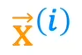表示第i个训练样本，这个例子中将是包含四个数字的列表，或者说是向量，它包含了第一个训练集的所有特征；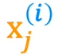表示第i个训练集的特定特征

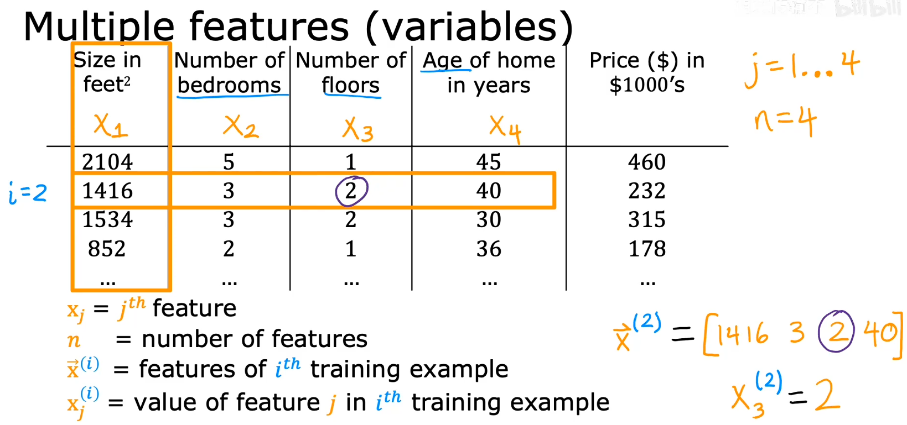

#### 多元线性回归模型


本例中也就是

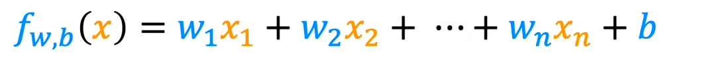

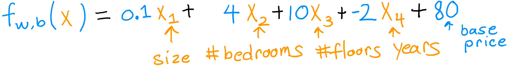

将所有的w用一个行向量表示，这个向量和数字b就是模型的参数


将所有的x用一个行向量表示

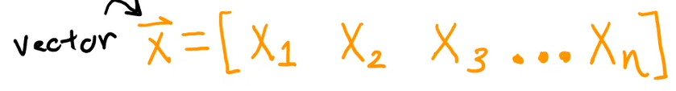

模型就可以简化为下方公式，其中就是W~1~X~1~+W~2~X~2~+...+W~n~X~n~


#### 向量化

##### 示例


以上的向量和变量在python中的定义

```python
import numpy as np
w = np.array([1.0,2.5,-3.3])
b = 4
x = np.array([10,20,30])
```

不使用向量化实现模型预测的实现

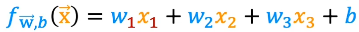

```python
f = w[0] * x[0] + w[1] * x[1] + w[2] * x[2] + b
```

如果特征非常多，则进化为使用循环


```python
n = 3
f = 0
for j in range(n):
    f = f + w[j] * x[j]
f = f + b
```

用向量化的方式实现，优势是**代码量少并且运行高效**


```python
f = np.dot(w,x) + b
```

##### 实现原理

np.dot是在计算机硬盘中以向量化方式实现，在单一步骤中将每一对w和x相乘


运用到线性回归梯度下降


#### 用向量化为多元线性回归实现梯度下降

将W~1~ ~ W~n~替换为向量W

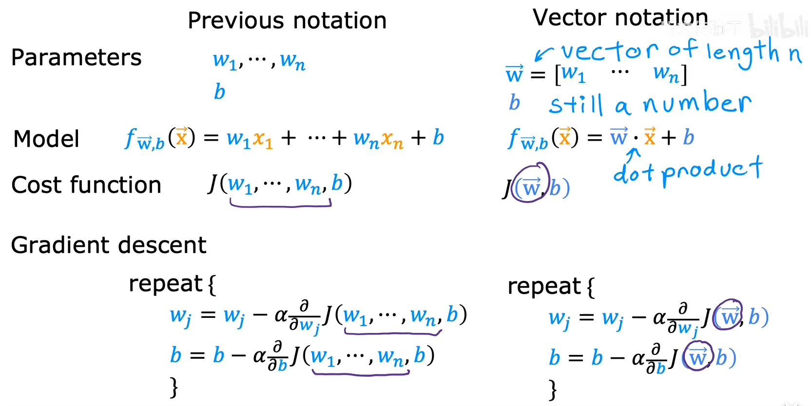

梯度下降的更新规则


### 正规方程法

仅适用于线性回归求解w和b，这种方法不需要迭代式的梯度下降算法，使用高级线性代数，仅在一次计算中直接解出w和b

##### 缺点

1. 不能泛华到其他学习算法上
2. 如果特征数量n的值很大，正规方程法也会相当慢

#### 在python中的视线

```python
import numpy as np
def normalEqn(X, y):
   theta = np.linalg.inv(X.T@X)@X.T@y #X.T@X等价于X.T.dot(X)
   return theta
```

#### 正规方程及不可逆性

有些矩阵可逆，而有些矩阵不可逆。我们称那些不可逆矩阵为奇异或退化矩阵

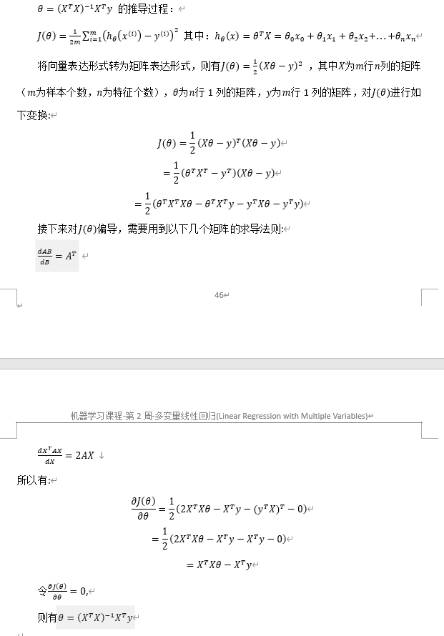

### 特征缩放技术

以房价问题为例，假设我们使用两个特征，房屋的尺寸和房间的数量，尺寸的值为 0-2000平方英尺，而房间数量的值则是0-5，以两个参数分别为横纵坐标，绘制代价函数的等高线图能，看出图像会显得很扁，梯度下降算法需要来回反弹很长时间，进行多次的迭代才能收敛


解决的方法是尝试将所有特征的尺度都尽量缩放到-1 ~ 1之间，也可以略微宽松，例如-3 ~ 3、-0.3 ~ 0.3、-2 ~ 0.5、0 ~ 3等范围。最简单的方法是令：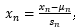，其中是平均值，是标准差，该方法称为z-分数归一化。


### 如何判断梯度下降正在收敛

代价函数的结果随执行次数的增加而逐渐趋于平稳


### 选择恰当的学习率

如果在一定迭代次数下的代价函数结果有时上升有时下降，则应该视为梯度下降没有正常工作，意味着代码有bug或者学习率太大

如果学习率过小，则达到收敛所需的迭代次数会非常高

可以先使用以下学习率进行尝试


### 特征工程-选择合适的特征

### 多项式回归

有时直线并不能很好的拟合所有数据，例如下方的数据集：横轴是房子的大小，纵轴是价格。使用二次函数的曲线也许可以更好的拟合数据，但二次函数最终会回落，看起来并不是真的合理，因为房子应该不会随着面积的增加而变得便宜，引入三次函数则可能会更好的拟合


在三次函数的情况下，第一个特征是面积，第二个特征是面积的平方，第三个特征是面积的三次方。

如果创建的特征是原始特征的幂次方，那么特征缩放会很重要

## 逻辑回归

逻辑回归算法是**分类算法**，实际用于解决二元分类问题

### sigmoid(逻辑)函数

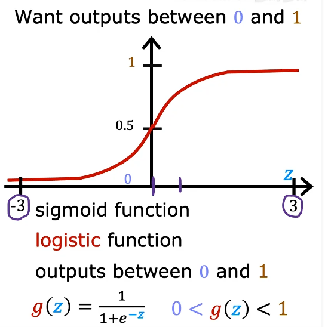

逻辑回归模型：输入一个特征或者一组特征X。并输出一个介于0和1之间的数字

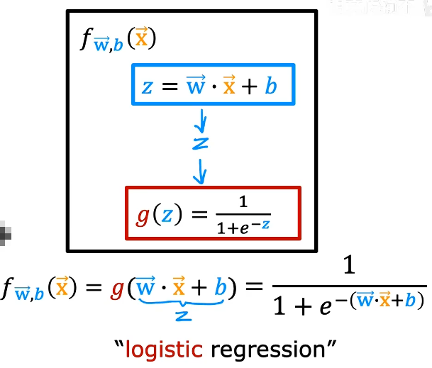

### 决策边界

在特征空间内，根据不同特征对样本进行分类，不同类型间的分界就是模型针对该数据集的决策边界。通过决策边界可以更好的可视化分类结果

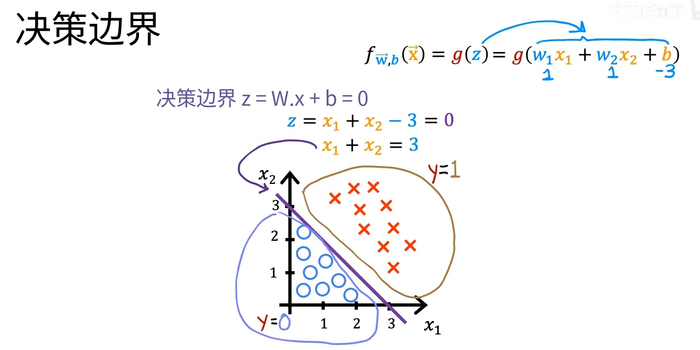

选择不同的参数，逻辑边界也将不同。

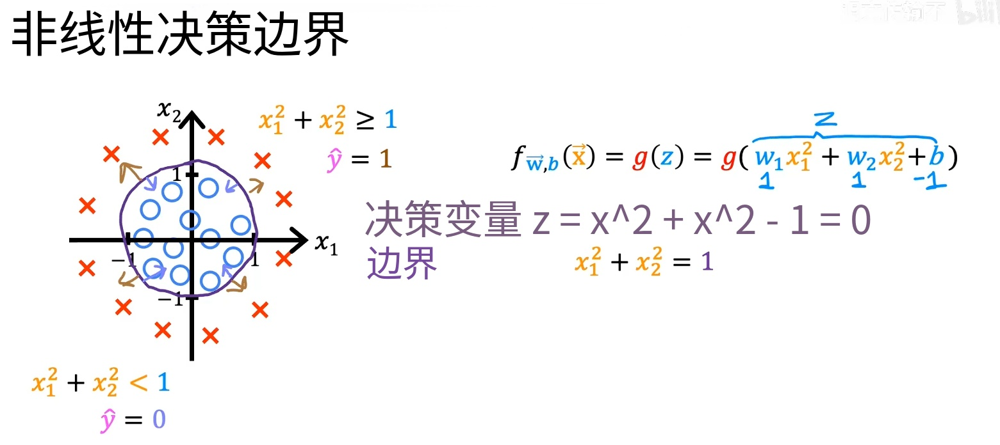

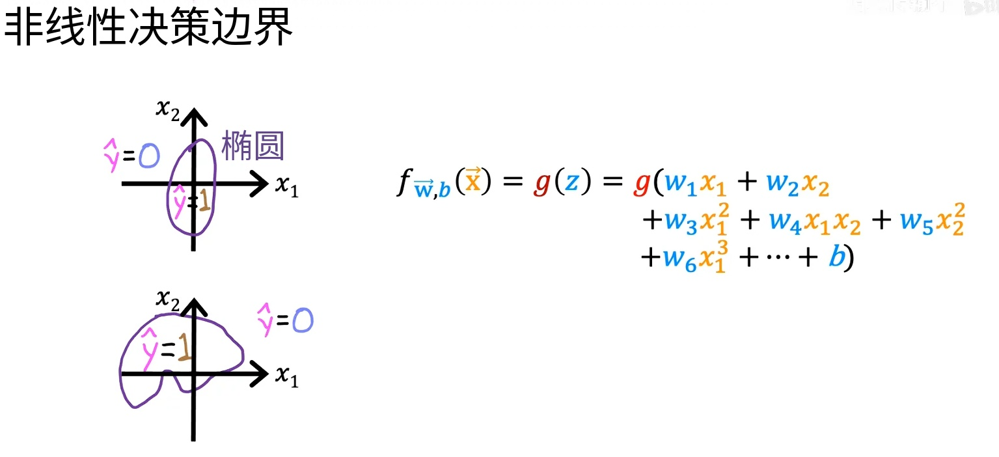

### 代价函数

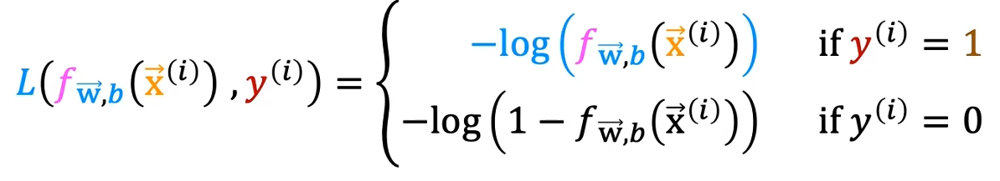

=>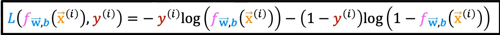

当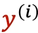为1：

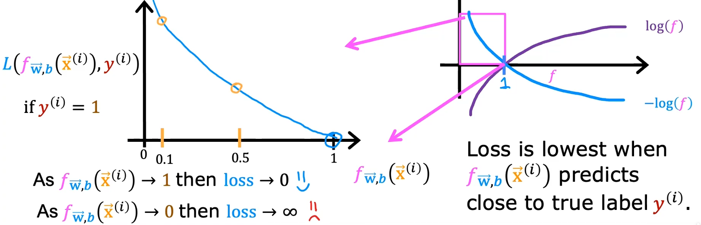

当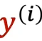为0：

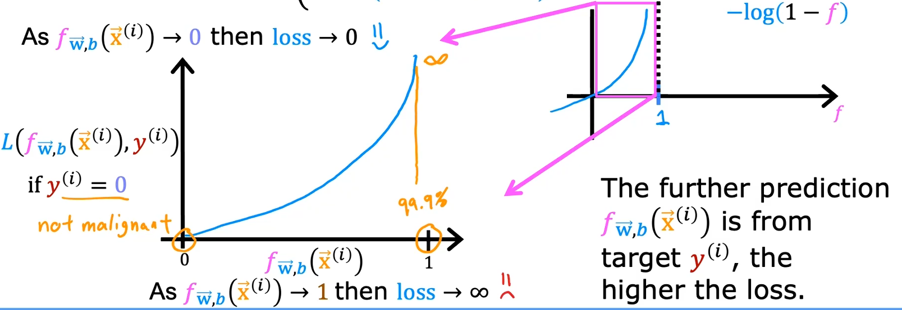

#### 代码实现

```python
import numpy as np
    
def cost(theta, X, y):
    
  theta = np.matrix(theta)
  X = np.matrix(X)
  y = np.matrix(y)
  first = np.multiply(-y, np.log(sigmoid(X* theta.T)))
  second = np.multiply((1 - y), np.log(1 - sigmoid(X* theta.T)))
  return np.sum(first - second) / (len(X))
```

### 梯度下降的实现

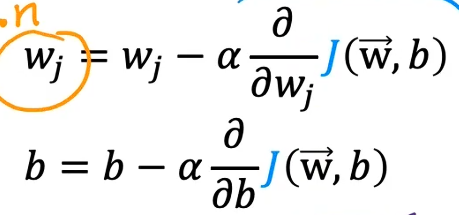

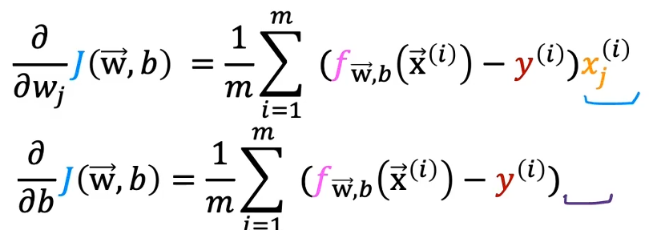

### 逻辑回归简单演示

```python
import numpy as np
from sklearn.linear_model import LogisticRegression
import matplotlib.pyplot as plt
# 1. 构造一组简单的肿瘤数据（肿瘤大小，是否恶性）
X = np.array([3.78, 2.44, 2.09, 0.14, 1.72, 1.65, 4.92, 4.37, 4.96, 4.52, 3.69, 5.88]).reshape(-1,1)
y = np.array([0, 0, 0, 0, 0, 0, 1, 1, 1, 1, 1, 1])  # 0:良性, 1:恶性
# 2. 训练逻辑回归模型
logr = LogisticRegression()
logr.fit(X, y)
# 3. 预测新肿瘤的恶性概率
X_test = np.linspace(0, 7, 100).reshape(-1,1)
prob = logr.predict_proba(X_test)[:,1]
plt.plot(X_test, prob, label='P(y=1|x)')
plt.scatter(X, y, c=y, cmap='bwr', edgecolor='k', label='Samples')
plt.xlabel('Tumor Size')
plt.ylabel('Probability of Malignant')
plt.title('Logistic Regression: Tumor Malignancy Prediction')
plt.legend()
plt.show()
# 4. 实际预测
predicted = logr.predict(np.array([[3.46]]))
print("肿瘤大小3.46mm预测为恶性(1)还是良性(0)：", predicted[0])
```

自定义LogisticRegression的方式：

```python
def sigmoid(x):
    if x>0:
        return 1.0/(1.0+np.exp(-x))
    else:
        return np.exp(x)/(1.0+np.exp(x))
    
    
class LogisticRegression:
    def __init__(self, learning_rate=0.01, num_iterations=1000):
        self.learning_rate = learning_rate
        self.num_iterations = num_iterations
        self.weights = None
        self.bias = None

    def fit(self, X, y):
        num_samples, num_features = X.shape

        # 初始化权重和偏置
        self.weights = np.zeros(num_features)
        self.bias = 0

        # 梯度下降
        for _ in range(self.num_iterations):
            linear_model = np.dot(X, self.weights) + self.bias
            y_pred = sigmoid(linear_model)

            dw = (1 / num_samples) * np.dot(X.T, (y_pred - y))
            db = (1 / num_samples) * np.sum(y_pred - y)

            self.weights -= self.learning_rate * dw
            self.bias -= self.learning_rate * db

    def predict_prob(self, X):
        linear_model = np.dot(X, self.weights) + self.bias
        y_pred = sigmoid(linear_model)
        return y_pred

    def predict(self, X, threshold=0.5):
        y_pred_prob = self.predict_prob(X)
        y_pred = np.zeros_like(y_pred_prob)
        y_pred[y_pred_prob >= threshold] = 1
        return y_pred
    
# 创建 Logistic 回归模型
logreg = LogisticRegression()
    
# 训练模型
logreg.fit(X, y)
    
# 预测样本
X_new = np.array([[2.5, 2.5], [-6.0, -4.0]])
y_pred_prob = logreg.predict_prob(X_new)
y_pred = logreg.predict(X_new)
print("Predicted Probabilities:", y_pred_prob)
print("Predicted Labels:", y_pred)
```

### 过拟合

模型**死记硬背训练数据**，把数据里的**噪声、特例、无关细节**也当成规律学会了，结果**训练时表现极好，遇到新数据就拉胯**

#### 直观特点

- 训练集：效果满分
- 测试集：效果明显下降
- 模型：参数过多、结构太复杂

#### 常见原因

1. **模型太复杂**（深层神经网络、高次多项式、特征太多）
2. **训练数据太少**，样本不足以支撑复杂模型
3. **训练时间过长**，反复迭代开始啃噪声
4. 数据里噪声、异常值多

#### 常用解决办法

1. **增加训练数据**（最有效）
2. **降低模型复杂度**（减少层数、减少特征）
3. **正则化**（L1、L2、Dropout）
4. **早停止**（看到测试集效果变差就终止训练）
5. **数据增强**（图像 / 文本场景扩充样本）

#### 正则化

核心思路：**在损失函数里额外加一项 “惩罚项”，限制模型参数不要变得过大**，避免模型过度复杂、死记噪声

##### 核心原理

###### 基础回顾

模型训练目标：最小化**原始损失函数**

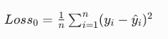

出现过拟合时，模型参数 w 会变得**绝对值极大**，对训练样本的微小波动（噪声）极度敏感

###### 正则化改造

在原损失函数基础上，增加**惩罚项**，得到**总损失函数**：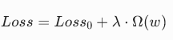

各部分含义：

- \(Loss~0~\)：原始损失，保证模型拟合数据；
- 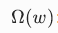：正则项（惩罚项)，约束参数大小；
- 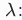正则系数（超参数），控制惩罚强度：
  - 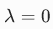：无正则，等价原始模型，容易过拟合；
  - 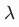越大：惩罚越强，参数被压得越小，易走向**欠拟合**；
  - 需手动调优，取中间最优值。

##### 主流两类正则化：L1、L2

###### L2 正则化（岭回归 / Weight Decay，最常用）

1. 公式

惩罚项为**参数平方和**：

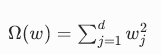

总损失：

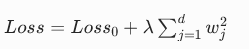

2. 作用特点
   - **缩小参数值**：不断把所有参数 w 往 0 方向压缩，但**不会彻底置零**；
   - 让参数分布更平滑，降低模型对单个特征、噪声的敏感度；
   - **泛化能力强**，是深度学习、传统机器学习里**默认首选**；
   - 不做特征筛选，所有特征都会保留。
3. 适用场景
   - 绝大多数回归、分类、神经网络；
   - 特征数量多、都有一定价值，不需要删减特征。

###### L1 正则化（Lasso）

1. 公式

惩罚项为**参数绝对值之和**：

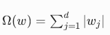

总损失：

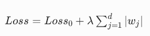

2. 作用特点

   - **产生稀疏性**：会把**大量不重要特征的参数直接压缩为 0**，等价于**自动特征选择**；

   - 只保留关键有效特征，简化模型；

   - 对异常值、噪声比 L2 更敏感；

   - 参数更新不稳定，大规模数据下收敛效果弱于 L2。

3. 适用场景

   - 特征维度极高、存在大量无用 / 冗余特征；

   - 需要**自动筛选特征**、做维度压缩

###### L1+L2 结合：弹性网络（Elastic Net）

同时加入 L1、L2 惩罚，弥补两者短板：

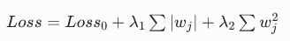

- 兼具 L1 特征筛选 + L2 稳定收敛的优点；

- 适合**特征高度相关**的场景。

###### 代码示例

```python
import numpy as np

def costReg(theta, X, y, learningRate):
    theta = np.matrix(theta)
    X = np.matrix(X)
    y = np.matrix(y)
    first = np.multiply(-y, np.log(sigmoid(X*theta.T)))
    second = np.multiply((1 - y), np.log(1 - sigmoid(X*theta.T)))
    reg = (learningRate / (2 * len(X))* np.sum(np.power(theta[:,1:theta.shape[1]],2))
    return np.sum(first - second) / (len(X)) + reg
```

##### L1 与 L2 核心对比

| 特性     | L2 正则            | L1 正则                  |
| -------- | ------------------ | ------------------------ |
| 惩罚形式 | 参数平方和         | 参数绝对值和             |
| 参数变化 | 全部缩小，不为 0   | 部分参数直接置 0（稀疏） |
| 功能     | 防过拟合、平滑参数 | 防过拟合 + 自动特征选择  |
| 稳定性   | 高，收敛平稳       | 较低，易震荡             |
| 常用场景 | 深度学习、常规建模 | 高维冗余特征、特征筛选   |

##### 深度学习专属正则化：Dropout

###### 1. 原理

训练阶段：**随机让一部分神经元临时失效（失活）**，不参与前向 / 反向传播。

- 设定概率 p（如 \(p=0.2\)，代表 20% 神经元随机关闭）；
- 每一轮迭代，随机挑选不同神经元失活。

###### 2. 核心作用

1. 避免神经元之间**过度协同、互相依赖**，防止网络死记训练数据；
2. 相当于同时训练多个 “子网络”，集成效果，提升泛化能力；

###### 3. 关键规则

- **训练时**：开启 Dropout，随机失活神经元；
- **预测 / 测试时**：关闭 Dropout，**所有神经元全部启用**。

###### 4. 使用位置

一般加在 **全连接层、卷积层之后**，很少用于输出层。

##### 其他常见正则化手段（补充）

1. **早停止（Early Stopping）**

   不属于数学惩罚，但属于广义正则化。

   做法：监控**验证集误差**，当验证集效果开始下降、训练集还在提升时，立刻停止训练，防止继续迭代学噪声。

   优点：简单、零额外计算开销，工业界高频使用。

2. **权重衰减（Weight Decay）**

   本质就是 **L2 正则**，只是深度学习框架里习惯叫权重衰减，叫法不同、公式一致。

3. **数据增强**

   从数据源正则：通过翻转、裁剪、加噪声、改写文本等方式**扩充训练数据**，数据越多，模型越难记噪声，天然抑制过拟合。

### 欠拟合

模型**能力不足**，连数据里**基础规律都没学到**，不管是见过的训练数据，还是没见过的新数据，表现都很差

#### 核心特征

- 训练集：误差大、准确率低
- 测试集：同样表现差
- 本质：**模型复杂度 < 数据真实规律**，拟合程度不够

#### 主要原因

1. 模型结构太简单（比如用线性模型拟合非线性数据）
2. 特征太少，有效信息不足
3. 训练轮次不够，模型还没收敛

#### 解决方法

1. **提升模型复杂度**（增加网络层数 / 神经元、换更复杂模型）
2. **增加有效特征**，补充关键信息
3. **延长训练时间**，保证充分迭代
4. 调整模型参数、优化学习率

## 其他监督学习算法

### 朴素贝叶斯法

朴素贝叶斯（naive Bayes）法是一种基于概率的机器学习算法。它基于贝叶斯定理，并假设特征之间相互独立（这就是“朴素”的来源）。朴素贝叶斯法实现简单，学习与预测的效率都很高，是一种常用方法，在许多场景下表现得非常好，如文本分类（垃圾邮件检测）、情感分析等。

朴素贝叶斯法的核心是贝叶斯定理:

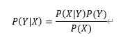

### 决策树

决策树（Decision Tree）是一种基于树形结构的算法，根据一系列条件判断逐步划分数据，缩小范围，最终得出预测结果。决策树由4部分组成：

- 根节点：树的节点，包含所有数据。

- 内部节点：表示特征上的判断条件。

- 分支：根据判断条件分出的路径。

- 叶节点：最终分类或回归的结果。

决策树适用于需要规则化、可解释性和快速决策的场景，尤其在数据特征明确、样本量适中的情况下表现良好。在复杂任务中，它常作为基础模型，与集成学习结合（如随机森林、梯度提升树）以提升性能

### 支持向量机

支持向量机（Support Vector Machines，SVM）是一种二分类模型。其核心目标是寻找一个“间隔最大”的超平面将不同类别的数据点分隔开。这个超平面在二维空间中是一条直线，在三维空间中是一个平面，在更高维空间中则是一个超平面。

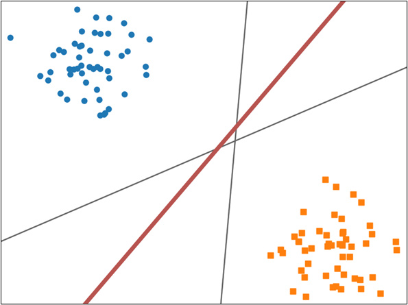

间隔最大代表该超平面与最近的数据点之间的距离最大，这使得支持向量机有较强的泛化能力。

支持向量机学习方法包括由简至繁的模型：线性可分支持向量机、线性支持向量机以及非线性支持向量机。

#### 优化目标

到目前为止,你已经见过一系列不同的学习算法。在监督学习中，许多学习算法的性能都非常类似，因此，重要的不是你该选择使用学习算法**A**还是学习算法**B**，而更重要的是，应用这些算法时，所创建的大量数据在应用这些算法时，表现情况通常依赖于你的水平。比如：你为学习算法所设计的特征量的选择，以及如何选择正则化参数，诸如此类的事。还有一个更加强大的算法广泛的应用于工业界和学术界，它被称为支持向量机(**Support Vector Machine**)。与逻辑回归和神经网络相比，支持向量机，或者简称**SVM**，在学习复杂的非线性方程时提供了一种更为清晰，更加强大的方式。因此，在接下来的视频中，我会探讨这一算法。在稍后的课程中，我也会对监督学习算法进行简要的总结。当然，仅仅是作简要描述。但对于支持向量机，鉴于该算法的强大和受欢迎度，在本课中，我会花许多时间来讲解它。它也是我们所介绍的最后一个监督学习算法。

正如我们之前开发的学习算法，我们从优化目标开始。那么，我们开始学习这个算法。为了描述支持向量机，事实上，我将会从逻辑回归开始展示我们如何一点一点修改来得到本质上的支持向量机。

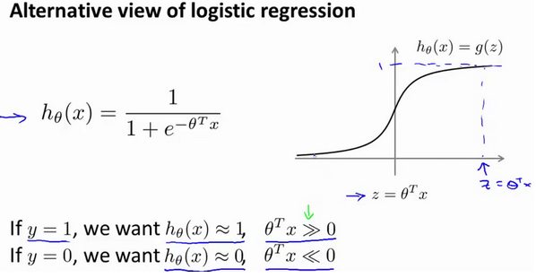

那么，在逻辑回归中我们已经熟悉了这里的假设函数形式，和右边的S型激励函数。然而，为了解释一些数学知识.我将用$z$ 表示$\theta^Tx$。

现在考虑下我们想要逻辑回归做什么：如果有一个 $y=1$的样本，我的意思是不管是在训练集中或是在测试集中，又或者在交叉验证集中，总之是 $y=1$，现在我们希望${{h}_{\theta }}\left( x \right)$ 趋近1。因为我们想要正确地将此样本分类，这就意味着当 ${{h}_{\theta }}\left( x \right)$趋近于1时，$\theta^Tx$ 应当远大于0，这里的$>>$意思是远远大于0。这是因为由于 $z$ 表示 $\theta^Tx$，当 $z$远大于0时，即到了该图的右边，你不难发现此时逻辑回归的输出将趋近于1。相反地，如果我们有另一个样本，即$y=0$。我们希望假设函数的输出值将趋近于0，这对应于$\theta^Tx$，或者就是 $z$ 会远小于0，因为对应的假设函数的输出值趋近0。

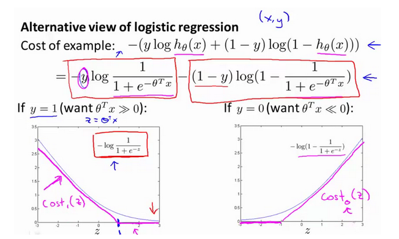

如果你进一步观察逻辑回归的代价函数，你会发现每个样本 $(x,y)$都会为总代价函数，增加这里的一项，因此，对于总代价函数通常会有对所有的训练样本求和，并且这里还有一个$1/m$项，但是，在逻辑回归中，这里的这一项就是表示一个训练样本所对应的表达式。现在，如果我将完整定义的假设函数代入这里。那么，我们就会得到每一个训练样本都影响这一项。

现在，先忽略 $1/m$ 这一项，但是这一项是影响整个总代价函数中的这一项的。

现在，一起来考虑两种情况：

一种是$y$等于1的情况；另一种是 $y$ 等于0的情况。

在第一种情况中，假设 $y=1$ ，此时在目标函数中只需有第一项起作用，因为$y=1$时，$(1-y)$项将等于0。因此，当在 $y=1$ 的样本中时，即在 $(x, y) $中 ，我们得到 $y=1$ $-\log(1-\frac{1}{1+e^{-z}})$这样一项，这里同上一张幻灯片一致。

我用 $z$ 表示$\theta^Tx$，即： $z= \theta^Tx$。当然，在代价函数中，$y$ 前面有负号。我们只是这样表示，如果 $y=1$ 代价函数中，这一项也等于1。这样做是为了简化此处的表达式。如果画出关于$z$ 的函数，你会看到左下角的这条曲线，我们同样可以看到，当$z$ 增大时，也就是相当于$\theta^Tx$增大时，$z$ 对应的值会变的非常小。对整个代价函数而言，影响也非常小。这也就解释了，为什么逻辑回归在观察到正样本$y=1$时，试图将$\theta^Tx$设置得非常大。因为，在代价函数中的这一项会变的非常小。

现在开始建立支持向量机，我们从这里开始：

我们会从这个代价函数开始，也就是$-\log(1-\frac{1}{1+e^{-z}})$一点一点修改，让我取这里的$z=1$ 点，我先画出将要用的代价函数。

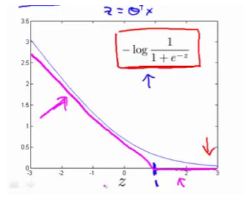

新的代价函数将会水平的从这里到右边(图外)，然后我再画一条同逻辑回归非常相似的直线，但是，在这里是一条直线，也就是我用紫红色画的曲线，就是这条紫红色的曲线。那么，到了这里已经非常接近逻辑回归中使用的代价函数了。只是这里是由两条线段组成，即位于右边的水平部分和位于左边的直线部分，先别过多的考虑左边直线部分的斜率，这并不是很重要。但是，这里我们将使用的新的代价函数，是在$y=1$的前提下的。你也许能想到，这应该能做同逻辑回归中类似的事情，但事实上，在之后的优化问题中，这会变得更坚定，并且为支持向量机，带来计算上的优势。例如，更容易计算股票交易的问题等等。

目前，我们只是讨论了$y=1$的情况，另外一种情况是当$y=0$时，此时如果你仔细观察代价函数只留下了第二项，因为第一项被消除了。如果当$y=0$时，那么这一项也就是0了。所以上述表达式只留下了第二项。因此，这个样本的代价或是代价函数的贡献。将会由这一项表示。并且，如果你将这一项作为$z$的函数，那么，这里就会得到横轴$z$。现在，你完成了支持向量机中的部分内容，同样地，我们要替代这一条蓝色的线，用相似的方法。

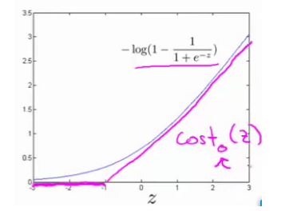

如果我们用一个新的代价函数来代替，即这条从0点开始的水平直线，然后是一条斜线，像上图。那么，现在让我给这两个方程命名，左边的函数，我称之为${\cos}t_1{(z)}$，同时，右边函数我称它为${\cos}t_0{(z)}$。这里的下标是指在代价函数中，对应的 $y=1$ 和 $y=0$ 的情况，拥有了这些定义后，现在，我们就开始构建支持向量机。

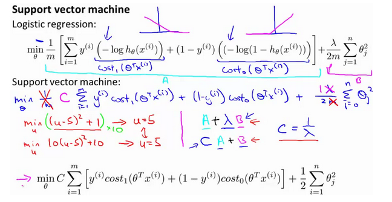

这是我们在逻辑回归中使用代价函数$J(\theta)$。也许这个方程看起来不是非常熟悉。这是因为之前有个负号在方程外面，但是，这里我所做的是，将负号移到了表达式的里面，这样做使得方程看起来有些不同。对于支持向量机而言，实质上我们要将这替换为${\cos}t_1{(z)}$，也就是${\cos}t_1{(\theta^Tx)}$，同样地，我也将这一项替换为${\cos}t_0{(z)}$，也就是代价${\cos}t_0{(\theta^Tx)}$。这里的代价函数${\cos}t_1$，就是之前所提到的那条线。此外，代价函数${\cos}t_0$，也是上面所介绍过的那条线。因此，对于支持向量机，我们得到了这里的最小化问题，即:

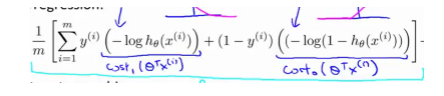

然后，再加上正则化参数。现在，按照支持向量机的惯例，事实上，我们的书写会稍微有些不同，代价函数的参数表示也会稍微有些不同。

首先，我们要除去$1/m$这一项，当然，这仅仅是由于人们使用支持向量机时，对比于逻辑回归而言，不同的习惯所致，但这里我所说的意思是：你知道，我将要做的是仅仅除去$1/m$这一项，但是，这也会得出同样的 ${{\theta }}$ 最优值，好的，因为$1/m$ 仅是个常量，因此，你知道在这个最小化问题中，无论前面是否有$1/m$ 这一项，最终我所得到的最优值${{\theta }}$都是一样的。这里我的意思是，先给你举一个样本，假定有一最小化问题：即要求当$(u-5)^2+1$取得最小值时的$u$值，这时最小值为：当$u=5$时取得最小值。

现在，如果我们想要将这个目标函数乘上常数10，这里我的最小化问题就变成了：求使得$10×(u-5)^2+10$最小的值$u$，然而，使得这里最小的$u$值仍为5。因此将一些常数乘以你的最小化项，这并不会改变最小化该方程时得到$u$值。因此，这里我所做的是删去常量$m$。也相同的，我将目标函数乘上一个常量$m$，并不会改变取得最小值时的${{\theta }}$值。

第二点概念上的变化，我们只是指在使用支持向量机时，一些如下的标准惯例，而不是逻辑回归。因此，对于逻辑回归，在目标函数中，我们有两项：第一个是训练样本的代价，第二个是我们的正则化项，我们不得不去用这一项来平衡。这就相当于我们想要最小化$A$加上正则化参数$\lambda$，然后乘以其他项$B$对吧？这里的$A$表示这里的第一项，同时我用**B**表示第二项，但不包括$\lambda$，我们不是优化这里的$A+\lambda\times B$。我们所做的是通过设置不同正则参数$\lambda$达到优化目的。这样，我们就能够权衡对应的项，是使得训练样本拟合的更好。即最小化$A$。还是保证正则参数足够小，也即是对于**B**项而言，但对于支持向量机，按照惯例，我们将使用一个不同的参数替换这里使用的$\lambda$来权衡这两项。你知道，就是第一项和第二项我们依照惯例使用一个不同的参数称为$C$，同时改为优化目标，$C×A+B$。
因此，在逻辑回归中，如果给定$\lambda$，一个非常大的值，意味着给予$B$更大的权重。而这里，就对应于将$C$ 设定为非常小的值，那么，相应的将会给$B$比给$A$更大的权重。因此，这只是一种不同的方式来控制这种权衡或者一种不同的方法，即用参数来决定是更关心第一项的优化，还是更关心第二项的优化。当然你也可以把这里的参数$C$ 考虑成$1/\lambda$，同 $1/\lambda$所扮演的角色相同，并且这两个方程或这两个表达式并不相同，因为$C=1/\lambda$，但是也并不全是这样，如果当$C=1/\lambda$时，这两个优化目标应当得到相同的值，相同的最优值 ${{\theta }}$。因此，就用它们来代替。那么，我现在删掉这里的$\lambda$，并且用常数$C$来代替。因此，这就得到了在支持向量机中我们的整个优化目标函数。然后最小化这个目标函数，得到**SVM** 学习到的参数$C$。

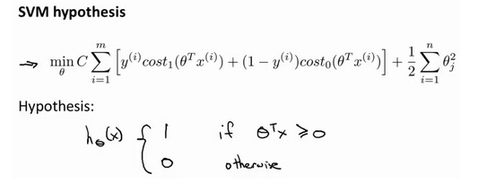

最后有别于逻辑回归输出的概率。在这里，我们的代价函数，当最小化代价函数，获得参数${{\theta }}$时，支持向量机所做的是它来直接预测$y$的值等于1，还是等于0。因此，这个假设函数会预测1。当$\theta^Tx$大于或者等于0时，或者等于0时，所以学习参数${{\theta }}$就是支持向量机假设函数的形式。那么，这就是支持向量机数学上的定义。

在接下来的视频中，让我们再回去从直观的角度看看优化目标，实际上是在做什么，以及SVM的假设函数将会学习什么，同时也会谈谈如何做些许修改，学习更加复杂、非线性的函数。

#### 大边界的直观理解

人们有时将支持向量机看作是大间距分类器。在这一部分，我将介绍其中的含义，这有助于我们直观理解**SVM**模型的假设是什么样的。

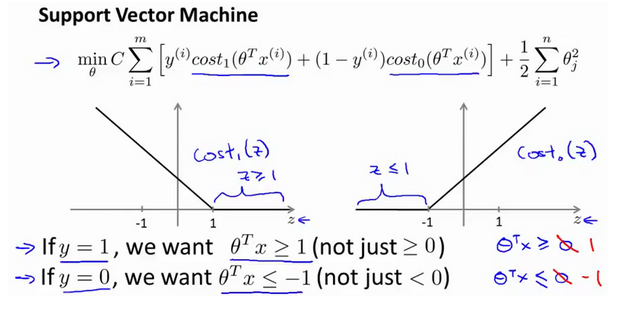

这是我的支持向量机模型的代价函数，在左边这里我画出了关于$z$的代价函数${\cos}t_1{(z)}$，此函数用于正样本，而在右边这里我画出了关于$z$的代价函数${\cos}t_0{(z)}$，横轴表示$z$，现在让我们考虑一下，最小化这些代价函数的必要条件是什么。如果你有一个正样本，$y=1$，则只有在$z>=1$时，代价函数${\cos}t_1{(z)}$才等于0。

换句话说，如果你有一个正样本，我们会希望$\theta^Tx>=1$，反之，如果$y=0$，我们观察一下，函数${\cos}t_0{(z)}$，它只有在$z<=-1$的区间里函数值为0。这是支持向量机的一个有趣性质。事实上，如果你有一个正样本$y=1$，则其实我们仅仅要求$\theta^Tx$大于等于0，就能将该样本恰当分出，这是因为如果$\theta^Tx$\>0大的话，我们的模型代价函数值为0，类似地，如果你有一个负样本，则仅需要$\theta^Tx$\<=0就会将负例正确分离，但是，支持向量机的要求更高，不仅仅要能正确分开输入的样本，即不仅仅要求$\theta^Tx$\>0，我们需要的是比0值大很多，比如大于等于1，我也想这个比0小很多，比如我希望它小于等于-1，这就相当于在支持向量机中嵌入了一个额外的安全因子，或者说安全的间距因子。

当然，逻辑回归做了类似的事情。但是让我们看一下，在支持向量机中，这个因子会导致什么结果。具体而言，我接下来会考虑一个特例。我们将这个常数$C$设置成一个非常大的值。比如我们假设$C$的值为100000或者其它非常大的数，然后来观察支持向量机会给出什么结果？

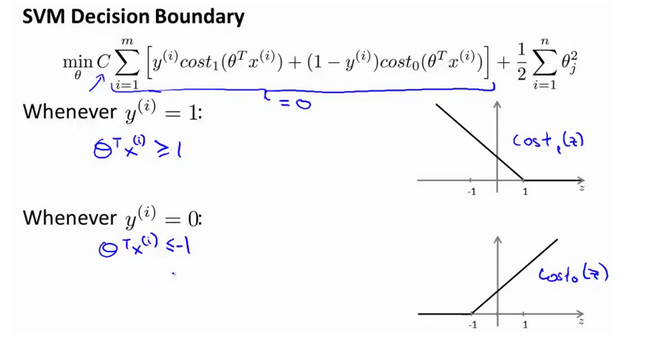

如果 $C$非常大，则最小化代价函数的时候，我们将会很希望找到一个使第一项为0的最优解。因此，让我们尝试在代价项的第一项为0的情形下理解该优化问题。比如我们可以把$C$设置成了非常大的常数，这将给我们一些关于支持向量机模型的直观感受。

$\min_\limits{\theta}C\sum_\limits{i=1}^{m}\left[y^{(i)}{\cos}t_{1}\left(\theta^{T}x^{(i)}\right)+\left(1-y^{(i)}\right){\cos}t\left(\theta^{T}x^{(i)}\right)\right]+\frac{1}{2}\sum_\limits{i=1}^{n}\theta^{2}_{j}$

我们已经看到输入一个训练样本标签为$y=1$，你想令第一项为0，你需要做的是找到一个${{\theta }}$，使得$\theta^Tx>=1$，类似地，对于一个训练样本，标签为$y=0$，为了使${\cos}t_0{(z)}$ 函数的值为0，我们需要$\theta^Tx<=-1$。因此，现在考虑我们的优化问题。选择参数，使得第一项等于0，就会导致下面的优化问题，因为我们将选择参数使第一项为0，因此这个函数的第一项为0，因此是$C$乘以0加上二分之一乘以第二项。这里第一项是$C$乘以0，因此可以将其删去，因为我知道它是0。

这将遵从以下的约束：$\theta^Tx^{(i)}>=1$，如果 $y^{(i)}$是等于1 的，$\theta^Tx^{(i)}<=-1$，如果样本$i$是一个负样本，这样当你求解这个优化问题的时候，当你最小化这个关于变量${{\theta }}$的函数的时候，你会得到一个非常有趣的决策边界。

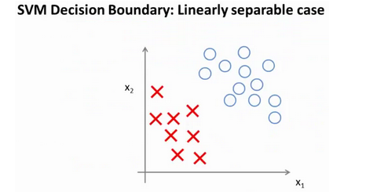

具体而言，如果你考察这样一个数据集，其中有正样本，也有负样本，可以看到这个数据集是线性可分的。我的意思是，存在一条直线把正负样本分开。当然有多条不同的直线，可以把正样本和负样本完全分开。

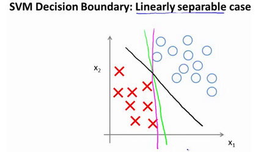

比如，这就是一个决策边界可以把正样本和负样本分开。但是多多少少这个看起来并不是非常自然是么?

或者我们可以画一条更差的决策界，这是另一条决策边界，可以将正样本和负样本分开，但仅仅是勉强分开，这些决策边界看起来都不是特别好的选择，支持向量机将会选择这个黑色的决策边界，相较于之前我用粉色或者绿色画的决策界。这条黑色的看起来好得多，黑线看起来是更稳健的决策界。在分离正样本和负样本上它显得的更好。数学上来讲，这是什么意思呢？这条黑线有更大的距离，这个距离叫做间距(**margin**)。

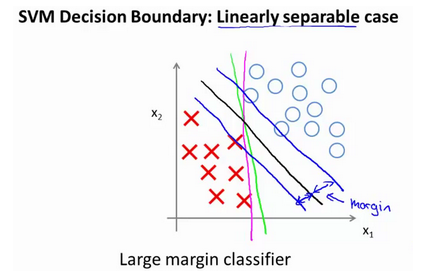

当画出这两条额外的蓝线，我们看到黑色的决策界和训练样本之间有更大的最短距离。然而粉线和蓝线离训练样本就非常近，在分离样本的时候就会比黑线表现差。因此，这个距离叫做支持向量机的间距，而这是支持向量机具有鲁棒性的原因，因为它努力用一个最大间距来分离样本。因此支持向量机有时被称为**大间距分类器**，而这其实是求解上一页幻灯片上优化问题的结果。

我知道你也许想知道求解上一页幻灯片中的优化问题为什么会产生这个结果？它是如何产生这个大间距分类器的呢？我知道我还没有解释这一点。

我将会从直观上略述为什么这个优化问题会产生大间距分类器。总之这个图示有助于你理解支持向量机模型的做法，即努力将正样本和负样本用最大的间距分开。

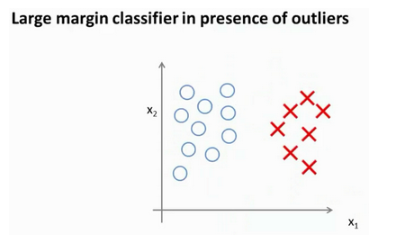

我们将这个大间距分类器中的正则化因子常数$C$设置的非常大，我记得我将其设置为了100000，因此对这样的一个数据集，也许我们将选择这样的决策界，从而最大间距地分离开正样本和负样本。那么在让代价函数最小化的过程中，我们希望找出在$y=1$和$y=0$两种情况下都使得代价函数中左边的这一项尽量为零的参数。如果我们找到了这样的参数，则我们的最小化问题便转变成：

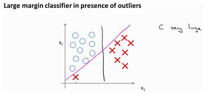

在这里，如果你加了这个样本，为了将样本用最大间距分开，也许我最终会得到一条类似这样的决策界，对么？就是这条粉色的线，仅仅基于一个异常值，仅仅基于一个样本，就将我的决策界从这条黑线变到这条粉线，这实在是不明智的。而如果正则化参数$C$，设置的非常大，这事实上正是支持向量机将会做的。它将决策界，从黑线变到了粉线，但是如果$C$ 设置的小一点，**如果你将C设置的不要太大，则你最终会得到这条黑线，**当然数据如果不是线性可分的，如果你在这里有一些正样本或者你在这里有一些负样本，则支持向量机也会将它们恰当分开。因此，大间距分类器的描述，仅仅是从直观上给出了正则化参数$C$非常大的情形，同时，要提醒你$C$的作用类似于$1/\lambda$，$\lambda$是我们之前使用过的正则化参数。这只是$C$非常大的情形，或者等价地 $\lambda$ 非常小的情形。你最终会得到类似粉线这样的决策界，但是实际上应用支持向量机的时候，**当$C$不是非常非常大的时候，它可以忽略掉一些异常点的影响，得到更好的决策界。**甚至当你的数据不是线性可分的时候，支持向量机也可以给出好的结果。

回顾 $C=1/\lambda$，因此：

$C$ 较大时，相当于 $\lambda$ 较小，可能会导致过拟合，高方差。

$C$ 较小时，相当于$\lambda$较大，可能会导致低拟合，高偏差。

我们稍后会介绍支持向量机的偏差和方差，希望在那时候关于如何处理参数的这种平衡会变得更加清晰。我希望，这节课给出了一些关于为什么支持向量机被看做大间距分类器的直观理解。它用最大间距将样本区分开，尽管从技术上讲，这只有当参数$C$是非常大的时候是真的，但是它对于理解支持向量机是有益的。

本节课中我们略去了一步，那就是我们在幻灯片中给出的优化问题。为什么会是这样的？它是如何得出大间距分类器的？我在本节中没有讲解，在下一节课中，我将略述这些问题背后的数学原理，来解释这个优化问题是如何得到一个大间距分类器的。

#### 大边界分类背后的数学（选修）

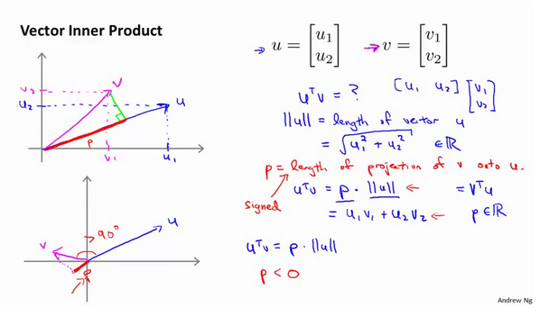

首先，让我来给大家复习一下关于向量内积的知识。假设我有两个向量，$u$和$v$，我将它们写在这里。两个都是二维向量，我们看一下，$u^T v$的结果。$u^T v$也叫做向量$u$和$v$之间的内积。由于是二维向量，我可以将它们画在这个图上。我们说，这就是向量$u$即在横轴上，取值为某个${{u}_{1}}$，而在纵轴上，高度是某个${{u}_{2}}$作为$u$的第二个分量。现在，很容易计算的一个量就是向量$u$的范数。$\left\| u \right\|$表示$u$的范数，即$u$的长度，即向量$u$的欧几里得长度。根据毕达哥拉斯定理，$\left\| u \right\|=\sqrt{u_{1}^{2}+u_{2}^{2}}$，这是向量$u$的长度，它是一个实数。现在你知道了这个的长度是多少了。我刚刚画的这个向量的长度就知道了。

现在让我们回头来看向量$v$ ，因为我们想计算内积。$v$是另一个向量，它的两个分量${{v}_{1}}$和${{v}_{2}}$是已知的。向量$v$可以画在这里，现在让我们来看看如何计算$u$和$v$之间的内积。这就是具体做法，我们将向量$v$投影到向量$u$上，我们做一个直角投影，或者说一个90度投影将其投影到$u$上，接下来我度量这条红线的长度。我称这条红线的长度为$p$，因此$p$就是长度，或者说是向量$v$投影到向量$u$上的量，我将它写下来，$p$是$v$投影到向量$u$上的长度，因此可以将${{u}^{T}}v=p\centerdot \left\| u \right\|$，或者说$u$的长度。这是计算内积的一种方法。如果你从几何上画出$p$的值，同时画出$u$的范数，你也会同样地计算出内积，答案是一样的。另一个计算公式是：$u^T v$就是$\left[ {{u}_{1}}\text{ }{{u}_{2}} \right]$ 这个一行两列的矩阵乘以$v$。因此可以得到${{u}_{1}}\times {{v}_{1}}+{{u}_{2}}\times {{v}_{2}}$。根据线性代数的知识，这两个公式会给出同样的结果。顺便说一句，$u^Tv=v^Tu$。因此如果你将$u$和$v$交换位置，将$u$投影到$v$上，而不是将$v$投影到$u$上，然后做同样地计算，只是把$u$和$v$的位置交换一下，你事实上可以得到同样的结果。申明一点，在这个等式中$u$的范数是一个实数，$p$也是一个实数，因此$u^T v$就是两个实数正常相乘。

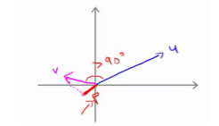

最后一点，需要注意的就是$p$值，$p$事实上是有符号的，即它可能是正值，也可能是负值。我的意思是说，如果$u$是一个类似这样的向量，$v$是一个类似这样的向量，$u$和$v$之间的夹角大于90度，则如果将$v$投影到$u$上，会得到这样的一个投影，这是$p$的长度，在这个情形下我们仍然有${{u}^{T}}v$是等于$p$乘以$u$的范数。唯一一点不同的是$p$在这里是负的。在内积计算中，如果$u$和$v$之间的夹角小于90度，那么那条红线的长度$p$是正值。然而如果这个夹角大于90度，则$p$将会是负的。就是这个小线段的长度是负的。如果它们之间的夹角大于90度，两个向量之间的内积也是负的。这就是关于向量内积的知识。我们接下来将会使用这些关于向量内积的性质试图来理解支持向量机中的目标函数。

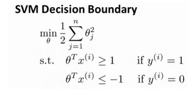

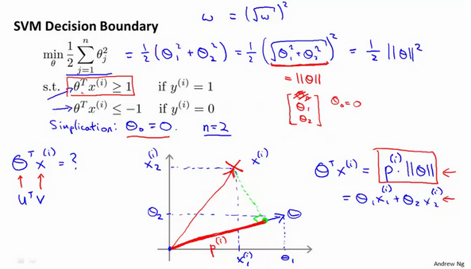

接下来忽略掉截距，令${{\theta }_{0}}=0$，这样更容易画示意图。我将特征数$n$置为2，因此我们仅有两个特征${{x}_{1}},{{x}_{2}}$，现在我们来看一下目标函数，支持向量机的优化目标函数。当我们仅有两个特征，即$n=2$时，这个式子可以写作：$\frac{1}{2}\left({\theta_1^2+\theta_2^2}\right)=\frac{1}{2}\left(\sqrt{\theta_1^2+\theta_2^2}\right)^2$，我们只有两个参数${{\theta }_{1}},{{\theta }_{2}}$。你可能注意到括号里面的这一项是向量${{\theta }}$的范数，或者说是向量${{\theta }}$的长度。我的意思是如果我们将向量${{\theta }}$写出来，那么我刚刚画红线的这一项就是向量${{\theta }}$的长度或范数。这里我们用的是之前学过的向量范数的定义，事实上这就等于向量${{\theta }}$的长度。

当然你可以将其写作${{\theta }_{0}}\text{,}{{\theta }_{1}},{{\theta }_{2}}$，如果${{\theta }_{0}}=0$，那就是${{\theta }_{1}},{{\theta }_{2}}$的长度。在这里我将忽略${{\theta }_{0}}$，这样来写$\theta$的范数，它仅仅和${{\theta }_{1}},{{\theta }_{2}}$有关。但是，数学上不管你是否包含，其实并没有差别，因此在我们接下来的推导中去掉${{\theta }_{0}}$不会有影响这意味着我们的目标函数是等于$\frac{1}{2}\left\| \theta \right\|^2$。因此支持向量机做的全部事情，就是**极小化参数向量**${{\theta }}$**范数的平方，或者说长度的平方**。

现在我将要看看这些项：$\theta^{T}x$更深入地理解它们的含义。给定参数向量$\theta $给定一个样本$x$，这等于什么呢?在前一页幻灯片上，我们画出了在不同情形下，$u^Tv$的示意图，我们将会使用这些概念，$\theta $和$x^{(i)}$就类似于$u$和$v$ 。

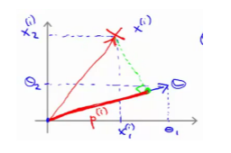

让我们看一下示意图：我们考察一个单一的训练样本，我有一个正样本在这里，用一个叉来表示这个样本$x^{(i)}$，意思是在水平轴上取值为$x_1^{(i)}$，在竖直轴上取值为$x_2^{(i)}$。这就是我画出的训练样本。尽管我没有将其真的看做向量。它事实上就是一个始于原点，终点位置在这个训练样本点的向量。现在，我们有一个参数向量我会将它也画成向量。我将$θ_1$画在横轴这里，将$θ_2$ 画在纵轴这里，那么内积$θ^T x^{(i)}$ 将会是什么呢？

使用我们之前的方法，我们计算的方式就是我将训练样本投影到参数向量${{\theta }}$，然后我来看一看这个线段的长度，我将它画成红色。我将它称为$p^{(i)}$用来表示这是第 $i$个训练样本在参数向量${{\theta }}$上的投影。根据我们之前幻灯片的内容，我们知道的是$θ^Tx^{(i)}$将会等于$p$ 乘以向量 $θ$ 的长度或范数。这就等于$\theta_1\cdot{x_1^{(i)}}+\theta_2\cdot{x_2^{(i)}}$。这两种方式是等价的，都可以用来计算$θ$和$x^{(i)}$之间的内积。

这告诉了我们什么呢？这里表达的意思是：这个$θ^Tx^{(i)}>=1$  或者$θ^Tx^{(i)}<-1$的,约束是可以被$p^{(i)}\cdot{x}>=1$这个约束所代替的。因为$θ^Tx^{(i)}=p^{(i)}\cdot{\left\| \theta \right\|}$ ，将其写入我们的优化目标。我们将会得到没有了约束，$θ^Tx^{(i)}$而变成了$p^{(i)}\cdot{\left\| \theta \right\|}$。

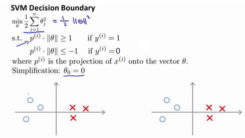

需要提醒一点，我们之前曾讲过这个优化目标函数可以被写成等于$\frac{1}{2}\left\| \theta \right\|^2$。

现在让我们考虑下面这里的训练样本。现在，继续使用之前的简化，即${{\theta }_{0}}=0$，我们来看一下支持向量机会选择什么样的决策界。这是一种选择，我们假设支持向量机会选择这个决策边界。这不是一个非常好的选择，因为它的间距很小。这个决策界离训练样本的距离很近。我们来看一下为什么支持向量机不会选择它。

对于这样选择的参数${{\theta }}$，可以看到参数向量${{\theta }}$事实上是和决策界是90度正交的，因此这个绿色的决策界对应着一个参数向量${{\theta }}$这个方向,顺便提一句${{\theta }_{0}}=0$的简化仅仅意味着决策界必须通过原点$(0,0)$。现在让我们看一下这对于优化目标函数意味着什么。

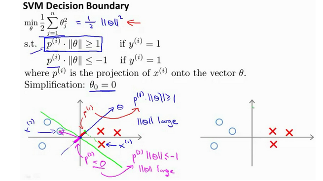

比如这个样本，我们假设它是我的第一个样本$x^{(1)}$，如果我考察这个样本到参数${{\theta }}$的投影，投影是这个短的红线段，就等于$p^{(1)}$，它非常短。类似地，这个样本如果它恰好是$x^{(2)}$，我的第二个训练样本，则它到${{\theta }}$的投影在这里。我将它画成粉色，这个短的粉色线段是$p^{(2)}$，即第二个样本到我的参数向量${{\theta }}$的投影。因此，这个投影非常短。$p^{(2)}$事实上是一个负值，$p^{(2)}$是在相反的方向，这个向量和参数向量${{\theta }}$的夹角大于90度，$p^{(2)}$的值小于0。

我们会发现这些$p^{(i)}$将会是非常小的数，因此当我们考察优化目标函数的时候，对于正样本而言，我们需要$p^{(i)}\cdot{\left\| \theta \right\|}>=1$,但是如果 $p^{(i)}$在这里非常小,那就意味着我们需要${{\theta }}$的范数非常大.因为如果 $p^{(1)}$ 很小,而我们希望$p^{(1)}\cdot{\left\| \theta \right\|}>=1$,令其实现的唯一的办法就是这两个数较大。如果 $p^{(1)}$ 小，我们就希望${{\theta }}$的范数大。类似地，对于负样本而言我们需要$p^{(2)}\cdot{\left\|\theta \right\|}<=-1$。我们已经在这个样本中看到$p^{(2)}$会是一个非常小的数，因此唯一的办法就是${{\theta }}$的范数变大。但是我们的目标函数是希望找到一个参数${{\theta }}$，它的范数是小的。因此，这看起来不像是一个好的参数向量${{\theta }}$的选择。

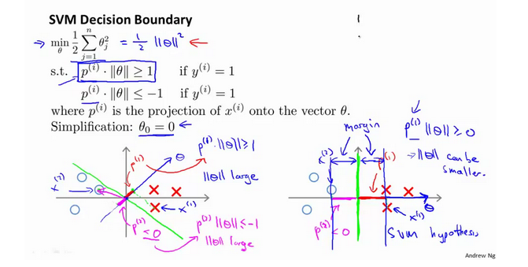

相反的，来看一个不同的决策边界。比如说，支持向量机选择了这个决策界，现在状况会有很大不同。如果这是决策界，这就是相对应的参数${{\theta }}$的方向，因此，在这个决策界之下，垂直线是决策界。使用线性代数的知识，可以说明，这个绿色的决策界有一个垂直于它的向量${{\theta }}$。现在如果你考察你的数据在横轴$x$上的投影，比如这个我之前提到的样本，我的样本$x^{(1)}$，当我将它投影到横轴$x$上，或说投影到${{\theta }}$上，就会得到这样$p^{(1)}$。它的长度是$p^{(1)}$，另一个样本，那个样本是$x^{(2)}$。我做同样的投影，我会发现，$p^{(2)}$的长度是负值。你会注意到现在$p^{(1)}$ 和$p^{(2)}$这些投影长度是长多了。如果我们仍然要满足这些约束，$P^{(i)}\cdot{\left\| \theta \right\|}$\>1，则因为$p^{(1)}$变大了，${{\theta }}$的范数就可以变小了。因此这意味着通过选择右边的决策界，而不是左边的那个，支持向量机可以使参数${{\theta }}$的范数变小很多。因此，如果我们想令${{\theta }}$的范数变小，从而令${{\theta }}$范数的平方变小，就能让支持向量机选择右边的决策界。这就是支持向量机如何能有效地产生大间距分类的原因。

看这条绿线，这个绿色的决策界。我们希望正样本和负样本投影到$\theta$的值大。要做到这一点的唯一方式就是选择这条绿线做决策界。这是大间距决策界来区分开正样本和负样本这个间距的值。这个间距的值就是$p^{(1)},p^{(2)},p^{(3)}$等等的值。通过让间距变大，即通过这些$p^{(1)},p^{(2)},p^{(3)}$等等的值，支持向量机最终可以找到一个较小的${{\theta }}$范数。这正是支持向量机中最小化目标函数的目的。

以上就是为什么支持向量机最终会找到大间距分类器的原因。因为它试图极大化这些$p^{(i)}$的范数，它们是训练样本到决策边界的距离。最后一点，我们的推导自始至终使用了这个简化假设，就是参数$θ_0=0$。

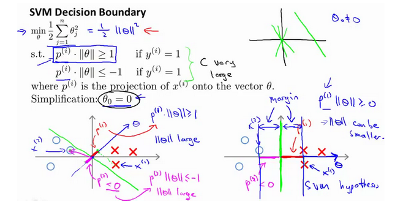

这个的作用是：$θ_0=0$的意思是我们让决策界通过原点。如果你令$θ_0$不是0的话，含义就是你希望决策界不通过原点。我将不会做全部的推导。实际上，支持向量机产生大间距分类器的结论，会被证明同样成立，证明方式是非常类似的，是我们刚刚做的证明的推广。

之前视频中说过，即便$θ_0$不等于0，支持向量机要做的事情都是优化这个目标函数对应着$C$值非常大的情况，但是可以说明的是，即便$θ_0$不等于0，支持向量机仍然会找到正样本和负样本之间的大间距分隔。

总之，我们解释了为什么支持向量机是一个大间距分类器。在下一节我们，将开始讨论如何利用支持向量机的原理，应用它们建立一个复杂的非线性分类器。

#### 核函数1

回顾之前讨论过可以使用高级数的多项式模型来解决无法用直线进行分隔的分类问题：

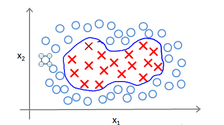

为了获得上图所示的判定边界，我们的模型可能是${{\theta }_{0}}+{{\theta }_{1}}{{x}_{1}}+{{\theta }_{2}}{{x}_{2}}+{{\theta }_{3}}{{x}_{1}}{{x}_{2}}+{{\theta }_{4}}x_{1}^{2}+{{\theta }_{5}}x_{2}^{2}+\cdots $的形式。

我们可以用一系列的新的特征$f$来替换模型中的每一项。例如令：
${{f}_{1}}={{x}_{1}},{{f}_{2}}={{x}_{2}},{{f}_{3}}={{x}_{1}}{{x}_{2}},{{f}_{4}}=x_{1}^{2},{{f}_{5}}=x_{2}^{2}$

...得到$h_θ(x)={{\theta }_{1}}f_1+{{\theta }_{2}}f_2+...+{{\theta }_{n}}f_n$。然而，除了对原有的特征进行组合以外，有没有更好的方法来构造$f_1,f_2,f_3$？我们可以利用核函数来计算出新的特征。

给定一个训练样本$x$，我们利用$x$的各个特征与我们预先选定的**地标**(**landmarks**)$l^{(1)},l^{(2)},l^{(3)}$的近似程度来选取新的特征$f_1,f_2,f_3$。

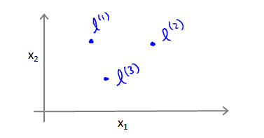

例如：${{f}_{1}}=similarity(x,{{l}^{(1)}})=e(-\frac{{{\left\| x-{{l}^{(1)}} \right\|}^{2}}}{2{{\sigma }^{2}}})$

其中：${{\left\| x-{{l}^{(1)}} \right\|}^{2}}=\sum{_{j=1}^{n}}{{({{x}_{j}}-l_{j}^{(1)})}^{2}}$，为实例$x$中所有特征与地标$l^{(1)}$之间的距离的和。上例中的$similarity(x,{{l}^{(1)}})$就是核函数，具体而言，这里是一个**高斯核函数**(**Gaussian Kernel**)。 **注：这个函数与正态分布没什么实际上的关系，只是看上去像而已。**

这些地标的作用是什么？如果一个训练样本$x$与地标$l$之间的距离近似于0，则新特征 $f$近似于$e^{-0}=1$，如果训练样本$x$与地标$l$之间距离较远，则$f$近似于$e^{-(一个较大的数)}=0$。

假设我们的训练样本含有两个特征[$x_{1}$ $x{_2}$]，给定地标$l^{(1)}$与不同的$\sigma$值，见下图：

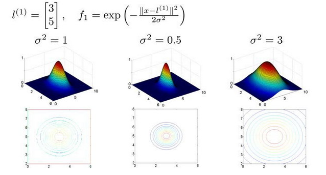

图中水平面的坐标为 $x_{1}$，$x_{2}$而垂直坐标轴代表$f$。可以看出，只有当$x$与$l^{(1)}$重合时$f$才具有最大值。随着$x$的改变$f$值改变的速率受到$\sigma^2$的控制。

在下图中，当样本处于洋红色的点位置处，因为其离$l^{(1)}$更近，但是离$l^{(2)}$和$l^{(3)}$较远，因此$f_1$接近1，而$f_2$,$f_3$接近0。因此$h_θ(x)=θ_0+θ_1f_1+θ_2f_2+θ_1f_3>0$，因此预测$y=1$。同理可以求出，对于离$l^{(2)}$较近的绿色点，也预测$y=1$，但是对于蓝绿色的点，因为其离三个地标都较远，预测$y=0$。

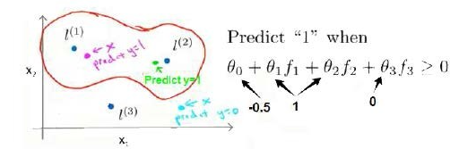

这样，图中红色的封闭曲线所表示的范围，便是我们依据一个单一的训练样本和我们选取的地标所得出的判定边界，在预测时，我们采用的特征不是训练样本本身的特征，而是通过核函数计算出的新特征$f_1,f_2,f_3$。

#### 核函数2

我们通常是根据训练集的数量选择地标的数量，即如果训练集中有$m$个样本，则我们选取$m$个地标，并且令:$l^{(1)}=x^{(1)},l^{(2)}=x^{(2)},.....,l^{(m)}=x^{(m)}$。这样做的好处在于：现在我们得到的新特征是建立在原有特征与训练集中所有其他特征之间距离的基础之上的，即：

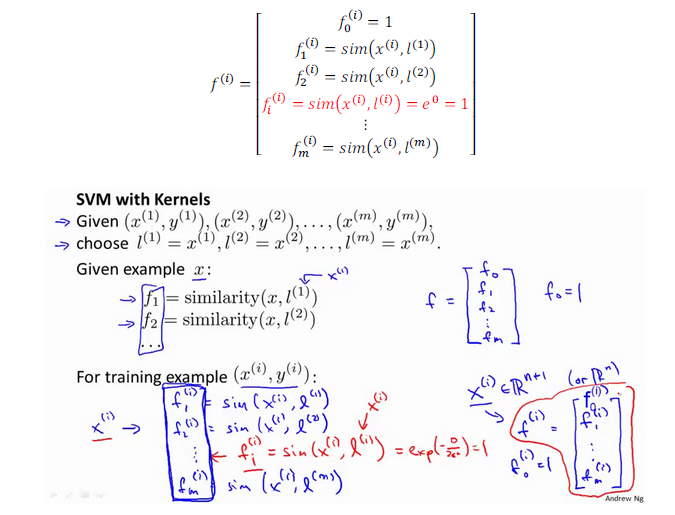

下面将核函数运用到支持向量机中，修改我们的支持向量机假设为：

给定$x$，计算新特征$f$，当$θ^Tf>=0$ 时，预测 $y=1$，否则反之。 

相应地修改代价函数为：$\sum{_{j=1}^{n=m}}\theta _{j}^{2}={{\theta}^{T}}\theta $，

$min C\sum\limits_{i=1}^{m}{[{{y}^{(i)}}cos {{t}_{1}}}( {{\theta }^{T}}{{f}^{(i)}})+(1-{{y}^{(i)}})cos {{t}_{0}}( {{\theta }^{T}}{{f}^{(i)}})]+\frac{1}{2}\sum\limits_{j=1}^{n=m}{\theta _{j}^{2}}$
在具体实施过程中，我们还需要对最后的正则化项进行些微调整，在计算$\sum{_{j=1}^{n=m}}\theta _{j}^{2}={{\theta}^{T}}\theta $时，我们用$θ^TMθ$代替$θ^Tθ$，其中$M$是根据我们选择的核函数而不同的一个矩阵。这样做的原因是为了简化计算。

理论上讲，我们也可以在逻辑回归中使用核函数，但是上面使用 $M$来简化计算的方法不适用与逻辑回归，因此计算将非常耗费时间。

在此，我们不介绍最小化支持向量机的代价函数的方法，你可以使用现有的软件包（如**liblinear**,**libsvm**等）。在使用这些软件包最小化我们的代价函数之前，我们通常需要编写核函数，并且如果我们使用高斯核函数，那么在使用之前进行特征缩放是非常必要的。

另外，支持向量机也可以不使用核函数，不使用核函数又称为**线性核函数**(**linear kernel**)，当我们不采用非常复杂的函数，或者我们的训练集特征非常多而样本非常少的时候，可以采用这种不带核函数的支持向量机。

下面是支持向量机的两个参数$C$和$\sigma$的影响：

$C=1/\lambda$

$C$ 较大时，相当于$\lambda$较小，可能会导致过拟合，高方差；

$C$ 较小时，相当于$\lambda$较大，可能会导致低拟合，高偏差；

$\sigma$较大时，可能会导致低方差，高偏差；

$\sigma$较小时，可能会导致低偏差，高方差。

如果你看了本周的编程作业，你就能亲自实现这些想法，并亲眼看到这些效果。这就是利用核函数的支持向量机算法，希望这些关于偏差和方差的讨论，能给你一些对于算法结果预期的直观印象。

#### 使用支持向量机

多类分类问题

假设我们利用之前介绍的一对多方法来解决一个多类分类问题。如果一共有$k$个类，则我们需要$k$个模型，以及$k$个参数向量${{\theta }}$。我们同样也可以训练$k$个支持向量机来解决多类分类问题。但是大多数支持向量机软件包都有内置的多类分类功能，我们只要直接使用即可。

尽管你不去写你自己的**SVM**的优化软件，但是你也需要做几件事：

1、是提出参数$C$的选择。我们在之前的视频中讨论过误差/方差在这方面的性质。

2、你也需要选择内核参数或你想要使用的相似函数，其中一个选择是：我们选择不需要任何内核参数，没有内核参数的理念，也叫线性核函数。因此，如果有人说他使用了线性核的**SVM**（支持向量机），这就意味这他使用了不带有核函数的**SVM**（支持向量机）。

从逻辑回归模型，我们得到了支持向量机模型，在两者之间，我们应该如何选择呢？

**下面是一些普遍使用的准则：**

$n$为特征数，$m$为训练样本数。

(1)如果相较于$m$而言，$n$要大许多，即训练集数据量不够支持我们训练一个复杂的非线性模型，我们选用逻辑回归模型或者不带核函数的支持向量机。

(2)如果$n$较小，而且$m$大小中等，例如$n$在 1-1000 之间，而$m$在10-10000之间，使用高斯核函数的支持向量机。

(3)如果$n$较小，而$m$较大，例如$n$在1-1000之间，而$m$大于50000，则使用支持向量机会非常慢，解决方案是创造、增加更多的特征，然后使用逻辑回归或不带核函数的支持向量机。

值得一提的是，神经网络在以上三种情况下都可能会有较好的表现，但是训练神经网络可能非常慢，选择支持向量机的原因主要在于它的代价函数是凸函数，不存在局部最小值。

### 集成学习

集成学习（Ensemble Learning）通过某种策略组合多个个体学习器的预测结果来提高整体的预测能力。只包含同种类型的个体学习器的集成称为同质集成，例如决策树集成中全是决策树，同质集成中的个体学习器亦称基学习器，相应的学习算法称为基学习算法。包含不同类型的个体学习器的集成称为异质集成，例如同时包含决策树和神经网络。

集成学习有三大经典方法：Boosting、Bagging和Stacking。

Boosting（提升方法）按顺序训练模型，每个模型关注前一个模型的错误，通过加权调整来优化整体预测。如AdaBoost通过给错分的样本更大的权重，逐步改进；梯度提升树用梯度下降法优化损失函数；XGBoost和LightGBM是高效的梯度提升树变种。Boosting主要关注于降低偏差。

Bagging（Bootstrap Aggregating，自助聚合）从原始数据集中通过有放回的对样本采样生成多个子数据集，分别训练多个独立模型，最后通过投票（分类）或平均（回归）得到结果。随机森林则是在Bagging基础上随机选择特征子集训练每棵树。Bagging主要关注于降低方差。

Stacking（堆叠）训练多个不同类型的个体学习器，之后使用一个元模型综合多个个体学习器的预测。灵活性强，能结合多种模型的优势。

## 无监督学习

### 聚类(Clustering)

#### K-均值算法

**K-均值**是最普及的聚类算法，算法接受一个未标记的数据集，然后将数据聚类成不同的组。

**K-均值**是一个迭代算法，假设我们想要将数据聚类成n个组，其方法为:

首先选择$K$个随机的点，称为**聚类中心**（**cluster centroids**）；

对于数据集中的每一个数据，按照距离$K$个中心点的距离，将其与距离最近的中心点关联起来，与同一个中心点关联的所有点聚成一类。

计算每一个组的平均值，将该组所关联的中心点移动到平均值的位置。

重复步骤2-4直至中心点不再变化。

下面是一个聚类示例：

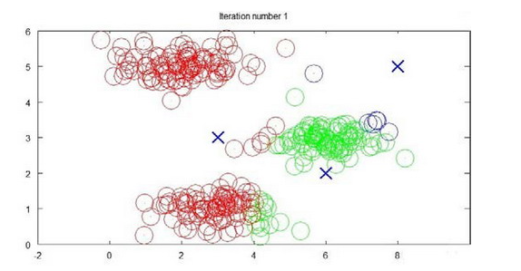

迭代 1 次

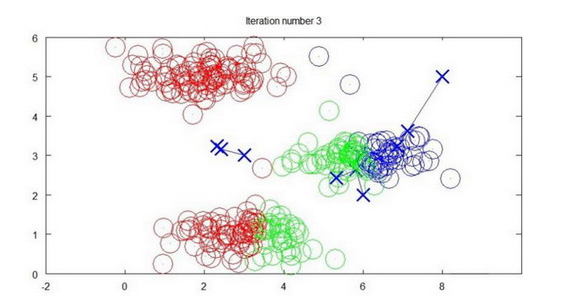

迭代 3 次

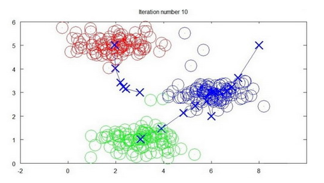

迭代 10 次

用$μ^1$,$μ^2$,...,$μ^k$ 来表示聚类中心，用$c^{(1)}$,$c^{(2)}$,...,$c^{(m)}$来存储与第$i$个实例数据最近的聚类中心的索引，**K-均值**算法的伪代码如下：

```
Repeat {

for i = 1 to m

c(i) := index (form 1 to K) of cluster centroid closest to x(i)

for k = 1 to K

μk := average (mean) of points assigned to cluster k

}
```

算法分为两个步骤，第一个**for**循环是赋值步骤，即：对于每一个样例$i$，计算其应该属于的类。第二个**for**循环是聚类中心的移动，即：对于每一个类$K$，重新计算该类的质心。

**K-均值**算法也可以很便利地用于将数据分为许多不同组，即使在没有非常明显区分的组群的情况下也可以。下图所示的数据集包含身高和体重两项特征构成的，利用**K-均值**算法将数据分为三类，用于帮助确定将要生产的T-恤衫的三种尺寸。

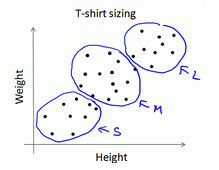

##### 优化目标

K-均值最小化问题，是要最小化所有的数据点与其所关联的聚类中心点之间的距离之和，因此
K-均值的代价函数（又称**畸变函数** **Distortion function**）为：

$$J(c^{(1)},...,c^{(m)},μ_1,...,μ_K)=\dfrac {1}{m}\sum^{m}_{i=1}\left\| X^{\left( i\right) }-\mu_{c^{(i)}}\right\| ^{2}$$

其中${{\mu }_{{{c}^{(i)}}}}$代表与${{x}^{(i)}}$最近的聚类中心点。
我们的的优化目标便是找出使得代价函数最小的 $c^{(1)}$,$c^{(2)}$,...,$c^{(m)}$和$μ^1$,$μ^2$,...,$μ^k$：
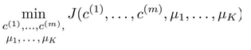

回顾刚才给出的:
**K-均值**迭代算法，我们知道，第一个循环是用于减小$c^{(i)}$引起的代价，而第二个循环则是用于减小${{\mu }_{i}}$引起的代价。迭代的过程一定会是每一次迭代都在减小代价函数，不然便是出现了错误。

##### 随机初始化

在运行K-均值算法的之前，我们首先要随机初始化所有的聚类中心点，下面介绍怎样做：

1. 我们应该选择$K<m$，即聚类中心点的个数要小于所有训练集实例的数量

2. 随机选择$K$个训练实例，然后令$K$个聚类中心分别与这$K$个训练实例相等

**K-均值**的一个问题在于，它有可能会停留在一个局部最小值处，而这取决于初始化的情况。

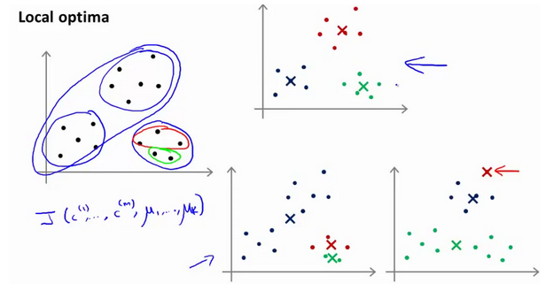

为了解决这个问题，我们通常需要多次运行**K-均值**算法，每一次都重新进行随机初始化，最后再比较多次运行**K-均值**的结果，选择代价函数最小的结果。这种方法在$K$较小的时候（2--10）还是可行的，但是如果$K$较大，这么做也可能不会有明显地改善。

##### 选择聚类数

没有所谓最好的选择聚类数的方法，通常是需要根据不同的问题，人工进行选择的。选择的时候思考我们运用**K-均值**算法聚类的动机是什么，然后选择能最好服务于该目的标聚类数。

当人们在讨论，选择聚类数目的方法时，有一个可能会谈及的方法叫作“肘部法则”。关于“肘部法则”，我们所需要做的是改变$K$值，也就是聚类类别数目的总数。我们用一个聚类来运行**K均值**聚类方法。这就意味着，所有的数据都会分到一个聚类里，然后计算成本函数或者计算畸变函数$J$。$K$代表聚类数字。

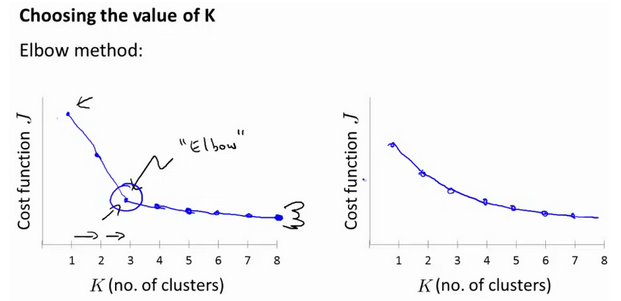

我们可能会得到一条类似于这样的曲线。像一个人的肘部。这就是“肘部法则”所做的，让我们来看这样一个图，看起来就好像有一个很清楚的肘在那儿。好像人的手臂，如果你伸出你的胳膊，那么这就是你的肩关节、肘关节、手。这就是“肘部法则”。你会发现这种模式，它的畸变值会迅速下降，从1到2，从2到3之后，你会在3的时候达到一个肘点。在此之后，畸变值就下降的非常慢，看起来就像使用3个聚类来进行聚类是正确的，这是因为那个点是曲线的肘点，畸变值下降得很快，$K=3$之后就下降得很慢，那么我们就选$K=3$。当你应用“肘部法则”的时候，如果你得到了一个像上面这样的图，那么这将是一种用来选择聚类个数的合理方法。

例如，我们的 T-恤制造例子中，我们要将用户按照身材聚类，我们可以分成3个尺寸:$S,M,L$，也可以分成5个尺寸$XS,S,M,L,XL$，这样的选择是建立在回答“聚类后我们制造的T-恤是否能较好地适合我们的客户”这个问题的基础上作出的。

**聚类参考资料：**

1.相似度/距离计算方法总结

(1). 闵可夫斯基距离**Minkowski**/（其中欧式距离：$p=2$) 

$dist(X,Y)={{\left( {{\sum\limits_{i=1}^{n}{\left| {{x}_{i}}-{{y}_{i}} \right|}}^{p}} \right)}^{\frac{1}{p}}}$

(2). 杰卡德相似系数(**Jaccard**)：

$J(A,B)=\frac{\left| A\cap B \right|}{\left|A\cup B \right|}$

(3). 余弦相似度(**cosine similarity**)：

$n$维向量$x$和$y$的夹角记做$\theta$，根据余弦定理，其余弦值为：

$cos (\theta )=\frac{{{x}^{T}}y}{\left|x \right|\cdot \left| y \right|}=\frac{\sum\limits_{i=1}^{n}{{{x}_{i}}{{y}_{i}}}}{\sqrt{\sum\limits_{i=1}^{n}{{{x}_{i}}^{2}}}\sqrt{\sum\limits_{i=1}^{n}{{{y}_{i}}^{2}}}}$
(4). Pearson皮尔逊相关系数：
${{\rho }_{XY}}=\frac{\operatorname{cov}(X,Y)}{{{\sigma }_{X}}{{\sigma }_{Y}}}=\frac{E[(X-{{\mu }_{X}})(Y-{{\mu }_{Y}})]}{{{\sigma }_{X}}{{\sigma }_{Y}}}=\frac{\sum\limits_{i=1}^{n}{(x-{{\mu }_{X}})(y-{{\mu }_{Y}})}}{\sqrt{\sum\limits_{i=1}^{n}{{{(x-{{\mu }_{X}})}^{2}}}}\sqrt{\sum\limits_{i=1}^{n}{{{(y-{{\mu }_{Y}})}^{2}}}}}$

Pearson相关系数即将$x$、$y$坐标向量各自平移到原点后的夹角余弦。

2.聚类的衡量指标

(1). 均一性：$p$

类似于精确率，一个簇中只包含一个类别的样本，则满足均一性。其实也可以认为就是正确率(每个 聚簇中正确分类的样本数占该聚簇总样本数的比例和)

(2). 完整性：$r$

类似于召回率，同类别样本被归类到相同簇中，则满足完整性;每个聚簇中正确分类的样本数占该 
类型的总样本数比例的和

(3). **V-measure**:

均一性和完整性的加权平均 

$V = \frac{(1+\beta^2)*pr}{\beta^2*p+r}$

(4). 轮廓系数

样本$i$的轮廓系数：$s(i)$

簇内不相似度:计算样本$i$到同簇其它样本的平均距离为$a(i)$，应尽可能小。

簇间不相似度:计算样本$i$到其它簇$C_j$的所有样本的平均距离$b_{ij}$，应尽可能大。

轮廓系数：$s(i)$值越接近1表示样本$i$聚类越合理，越接近-1，表示样本$i$应该分类到 另外的簇中，近似为0，表示样本$i$应该在边界上;所有样本的$s(i)$的均值被成为聚类结果的轮廓系数。 

$s(i) = \frac{b(i)-a(i)}{max\{a(i),b(i)\}}$

(5). **ARI**

数据集$S$共有$N$个元素，  两个聚类结果分别是：

$X=\{{{X}_{1}},{{X}_{2}},...,{{X}_{r}}\},Y=\{{{Y}_{1}},{{Y}_{2}},...,{{Y}_{s}}\}$

$X$和$Y$的元素个数为：

$a=\{{{a}_{1}},{{a}_{2}},...,{{a}_{r}}\},b=\{{{b}_{1}},{{b}_{2}},...,{{b}_{s}}\}$

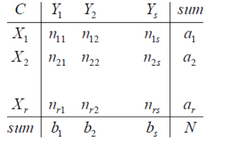

记：${{n}_{ij}}=\left| {{X}_{i}}\cap {{Y}_{i}} \right|$

$ARI=\frac{\sum\limits_{i,j}{C_{{{n}_{ij}}}^{2}}-\left[ \left( \sum\limits_{i}{C_{{{a}_{i}}}^{2}} \right)\cdot \left( \sum\limits_{i}{C_{{{b}_{i}}}^{2}} \right) \right]/C_{n}^{2}}{\frac{1}{2}\left[ \left( \sum\limits_{i}{C_{{{a}_{i}}}^{2}} \right)+\left( \sum\limits_{i}{C_{{{b}_{i}}}^{2}} \right) \right]-\left[ \left( \sum\limits_{i}{C_{{{a}_{i}}}^{2}} \right)\cdot \left( \sum\limits_{i}{C_{{{b}_{i}}}^{2}} \right) \right]/C_{n}^{2}}$

### 降维

#### 动机一：数据压缩

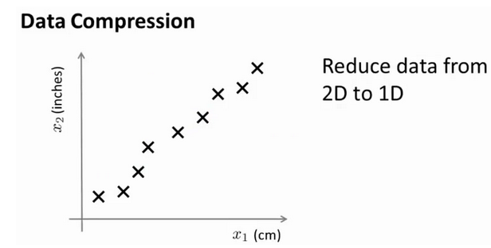

假设我们未知两个的特征：$x_1$:长度：用厘米表示；$x_2$：是用英寸表示同一物体的长度。

所以，这给了我们高度冗余表示，也许不是两个分开的特征$x_1$和$x_2$，这两个基本的长度度量，也许我们想要做的是减少数据到一维，只有一个数测量这个长度。这个例子似乎有点做作，这里厘米英寸的例子实际上不是那么不切实际的，两者并没有什么不同。

将数据从二维降至一维：
假使我们要采用两种不同的仪器来测量一些东西的尺寸，其中一个仪器测量结果的单位是英寸，另一个仪器测量的结果是厘米，我们希望将测量的结果作为我们机器学习的特征。现在的问题的是，两种仪器对同一个东西测量的结果不完全相等（由于误差、精度等），而将两者都作为特征有些重复，因而，我们希望将这个二维的数据降至一维。

从这件事情我看到的东西发生在工业上的事。如果你有几百个或成千上万的特征，它是它这往往容易失去你需要的特征。有时可能有几个不同的工程团队，也许一个工程队给你二百个特征，第二工程队给你另外三百个的特征，第三工程队给你五百个特征，一千多个特征都在一起，它实际上会变得非常困难，去跟踪你知道的那些特征，你从那些工程队得到的。其实不想有高度冗余的特征一样。

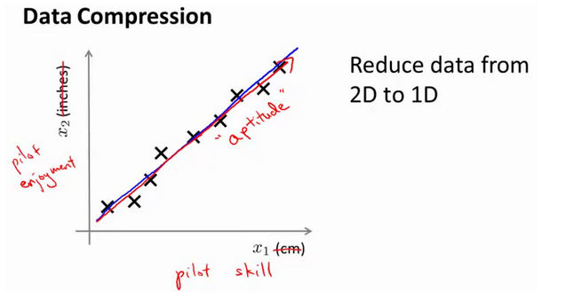

如果你想测量——如果你想做，你知道，做一个调查或做这些不同飞行员的测试——你可能有一个特征：$x_1$，这也许是他们的技能（直升机飞行员），也许$x_2$可能是飞行员的爱好。这是表示他们是否喜欢飞行，也许这两个特征将高度相关。你真正关心的可能是这条红线的方向，不同的特征，决定飞行员的能力。

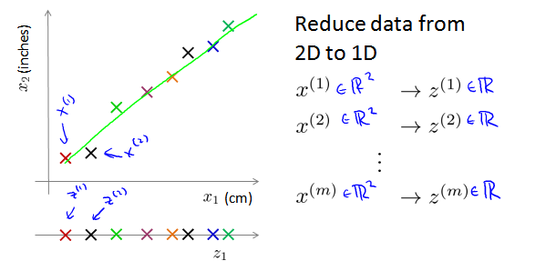

将数据从三维降至二维：
这个例子中我们要将一个三维的特征向量降至一个二维的特征向量。过程是与上面类似的，我们将三维向量投射到一个二维的平面上，强迫使得所有的数据都在同一个平面上，降至二维的特征向量。

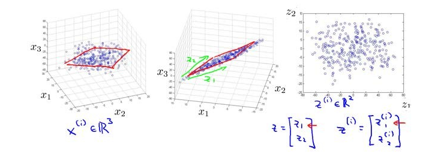

这样的处理过程可以被用于把任何维度的数据降到任何想要的维度，例如将1000维的特征降至100维。

#### 动机二：数据可视化

在许多及其学习问题中，如果我们能将数据可视化，我们便能寻找到一个更好的解决方案，降维可以帮助我们。

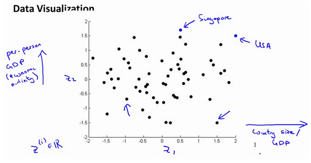

假使我们有有关于许多不同国家的数据，每一个特征向量都有50个特征（如**GDP**，人均**GDP**，平均寿命等）。如果要将这个50维的数据可视化是不可能的。使用降维的方法将其降至2维，我们便可以将其可视化了。

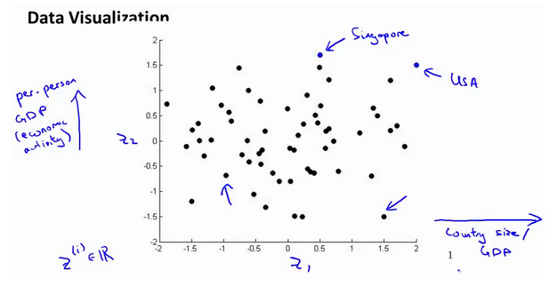

这样做的问题在于，降维的算法只负责减少维数，新产生的特征的意义就必须由我们自己去发现了。

#### 主成分分析问题

主成分分析(**PCA**)是最常见的降维算法。

在**PCA**中，我们要做的是找到一个方向向量（**Vector direction**），当我们把所有的数据都投射到该向量上时，我们希望投射平均均方误差能尽可能地小。方向向量是一个经过原点的向量，而投射误差是从特征向量向该方向向量作垂线的长度。

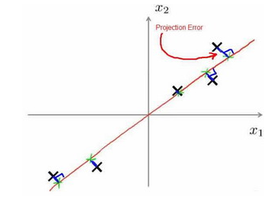

下面给出主成分分析问题的描述：

问题是要将$n$维数据降至$k$维，目标是找到向量$u^{(1)}$,$u^{(2)}$,...,$u^{(k)}$使得总的投射误差最小。主成分分析与线性回顾的比较：

主成分分析与线性回归是两种不同的算法。主成分分析最小化的是投射误差（**Projected Error**），而线性回归尝试的是最小化预测误差。线性回归的目的是预测结果，而主成分分析不作任何预测。

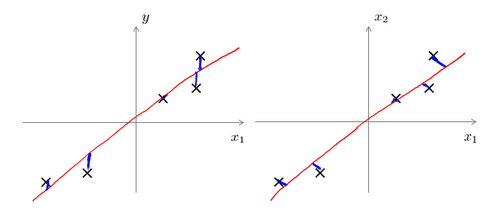

上图中，左边的是线性回归的误差（垂直于横轴投影），右边则是主要成分分析的误差（垂直于红线投影）。

**PCA**将$n$个特征降维到$k$个，可以用来进行数据压缩，如果100维的向量最后可以用10维来表示，那么压缩率为90%。同样图像处理领域的**KL变换**使用**PCA**做图像压缩。但**PCA** 要保证降维后，还要保证数据的特性损失最小。

**PCA**技术的一大好处是对数据进行降维的处理。我们可以对新求出的“主元”向量的重要性进行排序，根据需要取前面最重要的部分，将后面的维数省去，可以达到降维从而简化模型或是对数据进行压缩的效果。同时最大程度的保持了原有数据的信息。

**PCA**技术的一个很大的优点是，它是完全无参数限制的。在**PCA**的计算过程中完全不需要人为的设定参数或是根据任何经验模型对计算进行干预，最后的结果只与数据相关，与用户是独立的。

但是，这一点同时也可以看作是缺点。如果用户对观测对象有一定的先验知识，掌握了数据的一些特征，却无法通过参数化等方法对处理过程进行干预，可能会得不到预期的效果，效率也不高。

#### 主成分分析算法

**PCA** 减少$n$维到$k$维：

第一步是均值归一化。我们需要计算出所有特征的均值，然后令 $x_j= x_j-μ_j$。如果特征是在不同的数量级上，我们还需要将其除以标准差 $σ^2$。

第二步是计算**协方差矩阵**（**covariance matrix**）$Σ$：
$\sum=\dfrac {1}{m}\sum^{n}_{i=1}\left( x^{(i)}\right) \left( x^{(i)}\right) ^{T}$


第三步是计算协方差矩阵$Σ$的**特征向量**（**eigenvectors**）:

在 **Octave** 里我们可以利用**奇异值分解**（**singular value decomposition**）来求解，`[U, S, V]= svd(sigma)`。

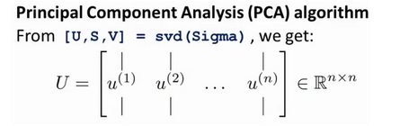

$$Sigma=\dfrac {1}{m}\sum^{n}_{i=1}\left( x^{(i)}\right) \left( x^{(i)}\right) ^{T}$$

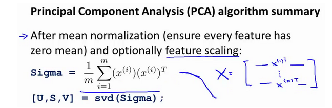

对于一个 $n×n$维度的矩阵，上式中的$U$是一个具有与数据之间最小投射误差的方向向量构成的矩阵。如果我们希望将数据从$n$维降至$k$维，我们只需要从$U$中选取前$k$个向量，获得一个$n×k$维度的矩阵，我们用$U_{reduce}$表示，然后通过如下计算获得要求的新特征向量$z^{(i)}$:
$$z^{(i)}=U^{T}_{reduce}*x^{(i)}$$

其中$x$是$n×1$维的，因此结果为$k×1$维度。注，我们不对方差特征进行处理。

#### 选择主成分的数量

主要成分分析是减少投射的平均均方误差：

训练集的方差为：$\dfrac {1}{m}\sum^{m}_{i=1}\left\| x^{\left( i\right) }\right\| ^{2}$

我们希望在平均均方误差与训练集方差的比例尽可能小的情况下选择尽可能小的$k$值。

如果我们希望这个比例小于1%，就意味着原本数据的偏差有99%都保留下来了，如果我们选择保留95%的偏差，便能非常显著地降低模型中特征的维度了。

我们可以先令$k=1$，然后进行主要成分分析，获得$U_{reduce}$和$z$，然后计算比例是否小于1%。如果不是的话再令$k=2$，如此类推，直到找到可以使得比例小于1%的最小$k$ 值（原因是各个特征之间通常情况存在某种相关性）。

还有一些更好的方式来选择$k$，当我们在**Octave**中调用“**svd**”函数的时候，我们获得三个参数：`[U, S, V] = svd(sigma)`。

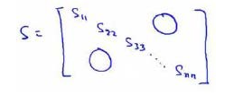

其中的$S$是一个$n×n$的矩阵，只有对角线上有值，而其它单元都是0，我们可以使用这个矩阵来计算平均均方误差与训练集方差的比例：
$$\dfrac {\dfrac {1}{m}\sum^{m}_{i=1}\left\| x^{\left( i\right) }-x^{\left( i\right) }_{approx}\right\| ^{2}}{\dfrac {1}{m}\sum^{m}_{i=1}\left\| x^{(i)}\right\| ^{2}}=1-\dfrac {\Sigma^{k}_{i=1}S_{ii}}{\Sigma^{m}_{i=1}S_{ii}}\leq 1\%$$

也就是：$$\frac {\Sigma^{k}_{i=1}s_{ii}}{\Sigma^{n}_{i=1}s_{ii}}\geq0.99$$

在压缩过数据后，我们可以采用如下方法来近似地获得原有的特征：$$x^{\left( i\right) }_{approx}=U_{reduce}z^{(i)}$$

#### 重建的压缩表示

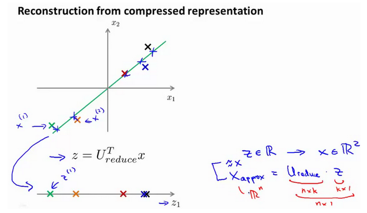

**PCA**算法，我们可能有一个这样的样本。如图中样本$x^{(1)}$,$x^{(2)}$。我们做的是，我们把这些样本投射到图中这个一维平面。然后现在我们需要只使用一个实数，比如$z^{(1)}$，指定这些点的位置后他们被投射到这一个三维曲面。给定一个点$z^{(1)}$，我们怎么能回去这个原始的二维空间呢？$x$为2维，$z$为1维，$z=U^{T}_{reduce}x$，相反的方程为：$x_{appox}=U_{reduce}\cdot z$,$x_{appox}\approx x$。如图：

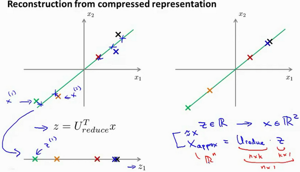

如你所知，这是一个漂亮的与原始数据相当相似。所以，这就是你从低维表示$z$回到未压缩的表示。我们得到的数据的一个之间你的原始数据 $x$，我们也把这个过程称为重建原始数据。

当我们认为试图重建从压缩表示 $x$ 的初始值。所以，给定未标记的数据集，您现在知道如何应用**PCA**，你的带高维特征$x$和映射到这的低维表示$z$。这个视频，希望你现在也知道如何采取这些低维表示$z$，映射到备份到一个近似你原有的高维数据。

现在你知道如何实施应用**PCA**，我们将要做的事是谈论一些技术在实际使用**PCA**很好，特别是，在接下来的视频中，我想谈一谈关于如何选择$k$。

#### 主成分分析法的应用建议

假使我们正在针对一张 100×100像素的图片进行某个计算机视觉的机器学习，即总共有10000 个特征。

      1. 第一步是运用主要成分分析将数据压缩至1000个特征

      2. 然后对训练集运行学习算法

         3. 在预测时，采用之前学习而来的$U_{reduce}$将输入的特征$x$转换成特征向量$z$，然后再进行预测

注：如果我们有交叉验证集合测试集，也采用对训练集学习而来的$U_{reduce}$。

错误的主要成分分析情况：一个常见错误使用主要成分分析的情况是，将其用于减少过拟合（减少了特征的数量）。这样做非常不好，不如尝试正则化处理。原因在于主要成分分析只是近似地丢弃掉一些特征，它并不考虑任何与结果变量有关的信息，因此可能会丢失非常重要的特征。然而当我们进行正则化处理时，会考虑到结果变量，不会丢掉重要的数据。

另一个常见的错误是，默认地将主要成分分析作为学习过程中的一部分，这虽然很多时候有效果，最好还是从所有原始特征开始，只在有必要的时候（算法运行太慢或者占用太多内存）才考虑采用主要成分分析。

