# 机器学习

抖音：谦行``AIing``

## 机器学习概念

 

### 人工智能


### 机器学习


### 深度学习


### AI,ML和DL的包含关系


 ### 机器学习三要素

- 模型（model）：总结数据的内在规律，用数学语言描述的参数系统

- 策略（strategy）：选取最优模型的评价准则

- 算法（algorithm）：选取最优模型的具体方法

 #### 模型


算法负责构建模型，模型负责预测未来

##### 专业术语-结合后面房子价格的案例

我们用来构建模型的数据，通常被称为**数据集 (Data set)**


上面这张图非常直观地展示了数据点和数据表之间的关系。图上的每一个红叉，都对应着数据表中的一行。

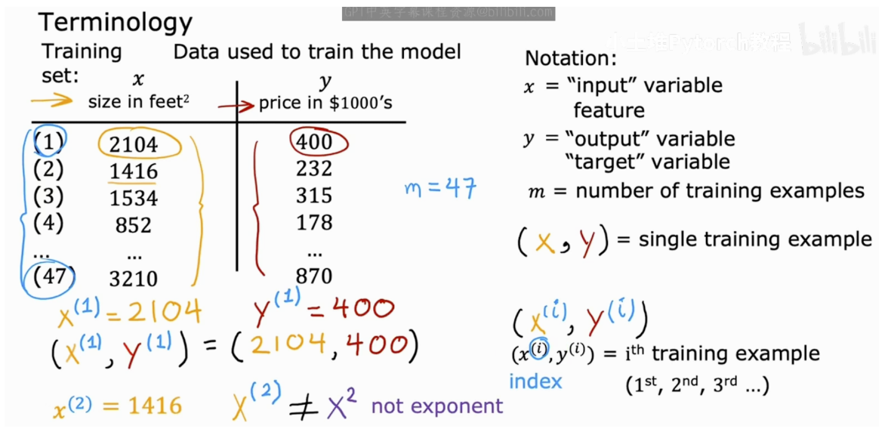

- x: 表示输入变量 (input variable)，也常被称为特征 (feature)。在我们的例子中，x就是房屋的面积。
- y: 表示输出变量 (output variable)，也常被称为目标 (target)。在我们的例子中，y就是房屋的价格。
- m: 表示训练样本的数量 (number of training examples)。图中的例子里，我们有47个训练样本，所以 m=47。
- (x, y): 表示一个单个的训练样本 (single training example)。
- (x⁽ⁱ⁾, y⁽ⁱ⁾): 表示第 i 个训练样本。这里的上标 (i) 只是一个索引 (index)，代表第几行数据，它不是数学上的指数或次方。
  - 例如，(x⁽¹⁾, y⁽¹⁾) 就代表第一个训练样本，即 (2104, 400)。

#### 策略


上图左侧清晰地展示了模型训练和预测的流程：

1. 我们将训练集 (training set)（包含了特征 x 和目标 y）喂给一个学习算法 (learning algorithm)。
2. 学习算法会输出一个函数 f。这个函数 f 就是我们最终得到的模型 (model)，在一些文献中它也被称为假设 (hypothesis)。
3. 当有新的输入 x（例如，一个全新的房屋面积）时，我们就可以用这个模型 f 来进行预测。模型输出的预测值，我们通常用 ŷ (读作 “y-hat”) 来表示。

#### 算法

那么，这个模型 f 的具体形式是什么呢？对于线性回归，我们希望找到一条直线来拟合我们的数据。初中数学告诉我们，一条直线的方程可以表示为 y = wx + b。在机器学习中，我们沿用这个形式，将模型写作：

f_w,b(x) = wx + b

这个模型只有一个输入特征 x（房屋面积），因此它被称为单变量线性回归 (Univariate linear regression)。“Univariate”中的“uni”就是“单一”的意思。

我们的核心任务，就是通过学习算法，找到最优的参数 w 和 b，使得这条直线能够最好地拟合我们的训练数据。

### 机器学习类型


#### 监督学习

##### 什么是监督学习

简单来说，监督学习就是我们给算法一个数据集，其中包含了“正确答案”。算法的任务就是学习输入与输出之间的映射关系，以便对新的、未知的数据进行预测。

就像下图展示的，我们有输入（X），通过某种学习算法，映射到输出标签（Y）。整个过程的核心思想是，我们通过提供一系列带有“正确答案”的样本来“监督”算法进行学习。

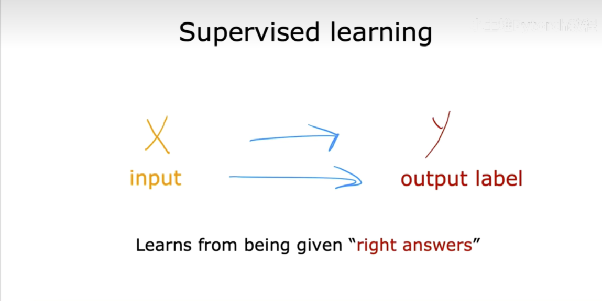

##### 应用实例

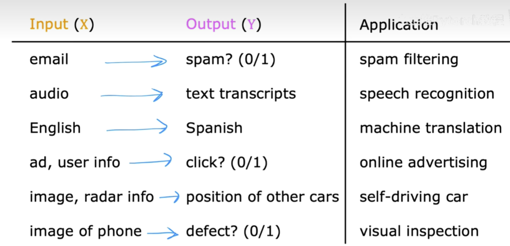

从上图中我们可以看到：

- 垃圾邮件过滤 (Spam filtering)：输入是邮件内容，输出是判断这封邮件是否为垃圾邮件（通常用0/1表示）。

- 语音识别 (Speech recognition)：输入是音频片段，输出是对应的文字记录。

- 机器翻译 (Machine translation)：输入是一种语言的文本（比如英语），输出是另一种语言的文本（比如西班牙语）。

- 在线广告 (Online advertising)：输入是广告信息和用户信息，输出是用户是否会点击这个广告（0/1）。

- 自动驾驶 (Self-driving car)：输入是汽车的图像、雷达信息等，输出是路面上其他车辆的位置。

- 视觉检测 (Visual inspection)：输入是产品的图片（比如手机），输出是判断产品是否存在缺陷（0/1）。

  

  这些例子都遵循着从输入X到输出Y的模式，并且都是通过学习大量已知答案的数据集来实现的。

##### 应用实例-房价预测

场景：根据房屋的面积预测房价，收集到一些数据并绘制出了如下图片（横轴是房屋的面积，纵轴是价格）

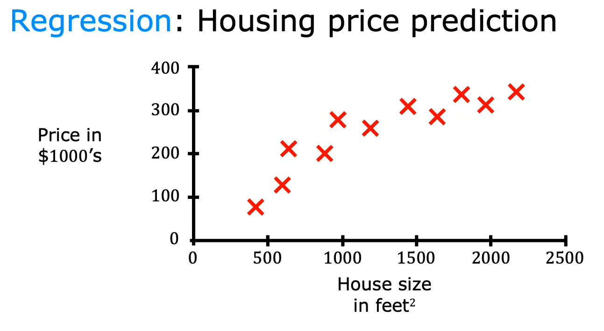

问题：根据以上数据，分析如果一个房子的面积是750平方英尺，那么价格是多少

方法：通过学习算法，将上面数据拟合成一条直线，根据这条直线找到750平方英尺房子所对应的价格差不多15万美元

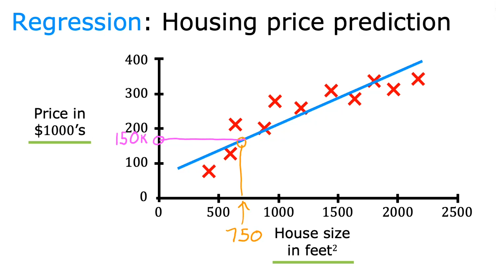

也可能拟合成曲线，通过更复杂的函数，此时会更加精确的看到750平方英尺的房子价格差不多20万美元

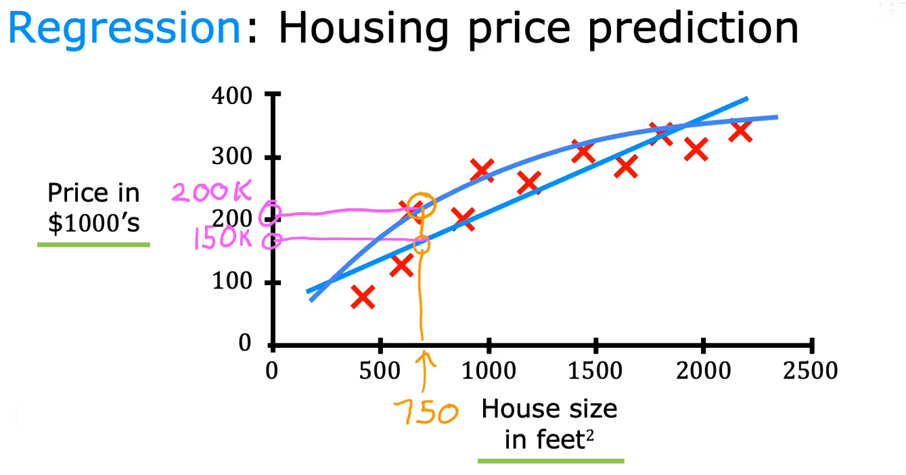

##### 应用实例-乳腺癌检测

场景：构建一个机器学习系统，以便医生用这个诊断工具来检测乳腺癌

问题：如何区分良性和恶性肿瘤

方法：数据集中包含各种大小的肿瘤，这些肿瘤通过用0表示良性，1表示恶性的方法进行标记。然后将数据绘制成图表，图表的横轴表示肿瘤大小，纵轴只有两个值也就是0和1，取决于肿瘤是良性还是恶性


**或者这样绘制，⚪️代表良性，X代表恶性**


**分类算法也可以预测两种以上的类型**


也可以考虑除了肿瘤大小之外，加上患者的年龄作为预测的输入(即多个两个和两个以上的数据集的输入)，用⚪️表示良性，X表示恶性。学习算法拟合出一条边界线，帮助医生进行诊断

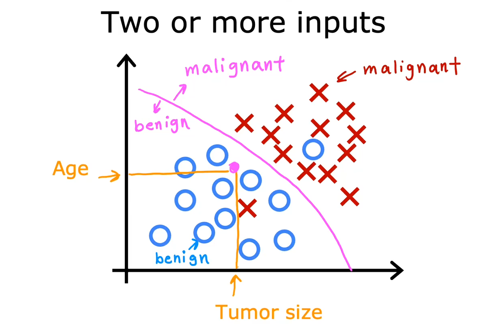

##### 监督学习的类型

上面的房价实例对应使用的就是回归算法，乳腺癌监测是分类算法

回归算法无限多的可能输出中预测输出值

分类预测的是一个小的，有限的，限定范围内的可能输出类别，例如0,1和2；猫,狗；良性,恶性 


#### 无监督学习


##### 无监督vs监督

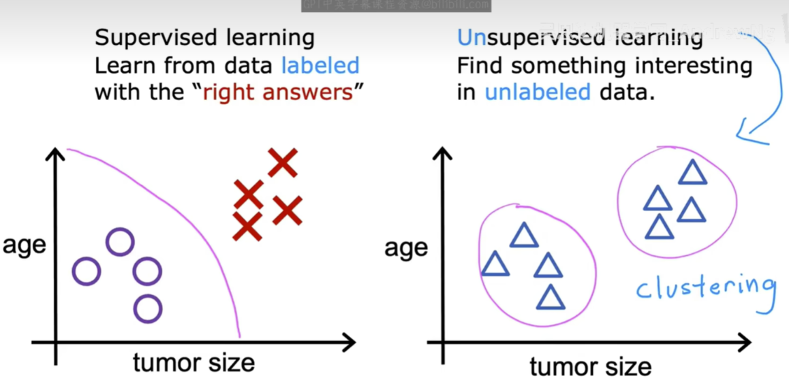

- 监督学习 (Supervised learning)：处理的是有标签 (labeled) 的数据。就像左图所示，我们提前为数据点标记好了类别（紫色圆圈和红色叉），算法的目标是学习如何区分它们，并画出一条决策边界。
- 无监督学习 (Unsupervised learning)：处理的是无标签 (unlabeled) 的数据。如右图所示，我们只有一堆数据点，没有任何关于它们类别的信息。算法的目标是在这些数据中自主地发现有趣的结构或模式。最常见的任务之一就是将数据分成不同的簇（cluster），这个过程也叫做聚类 (Clustering)。

简单来说，无监督学习的数据只有输入X，没有输出标签Y。算法必须靠自己去数据中寻找内在的结构。

##### 聚类算法


###### 案例：谷歌新闻

每天浏览成千上万的文章，并将相关报道分组到一起。以下的样本中头条新闻是：大熊猫在日本最古老的动物园产下红色双胞胎幼崽，而下方的所有文章标题也都出现了熊猫，动物园，双胞胎这些字样。聚类算法找到这些存在相似词语的文章并将这些新闻分到一个组当中，而聚类算法自己就弄清楚了哪些词语表明这些文章可以属于同一组。

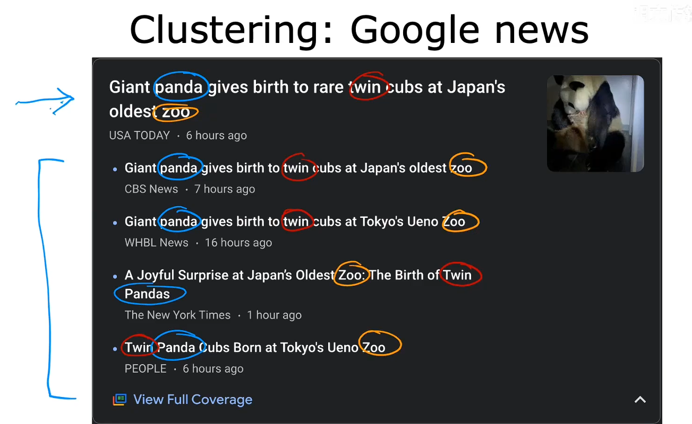

##### 降维算法


##### 生成算法


##### 异常检测

从数据中识别出那些与正常数据模式显著不同的“异常点”或“离群点”

#### 强化学习


- Q-Learning算法
- 蒙特卡洛树搜索
- 策略梯度算法
- 模仿学习
- 动态规划

#### 推荐系统

## 线性回归


### 模型公式


### 损失(代价)函数

在线性回归中我们有一个像这样的训练集，m代表了训练样本的数量，比如m = 47   。而我们的假设函数，也就是用来进行预测的函数，是这样的线性函数形式： 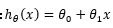

接下来我们会引入一些术语我们现在要做的便是为我们的模型选择合适的**参数**（**parameters**）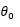和   ，在房价问题这个例子中便是直线的斜率和在  轴上的截距。

我们选择的参数决定了我们得到的直线相对于我们的训练集的准确程度，模型所预测的值与训练集中实际值之间的差距（下图中蓝线所指）就是**建模误差**（**modeling error**）

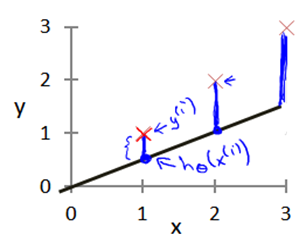

我们的目标便是选择出可以使得建模误差的平方和能够最小的模型参数。

#### 均方误差（MSE）


##### 优点


#### 平均绝对误差


平均绝对误差受异常值影响较小，但对小误差的惩罚较弱。适用与数据中存在显著异常值（如金融风险预测）的场景

### 寻找最优解

#### 梯度下降

1. 实际是求偏导过程，以拟合直线``f(x)=wx+b``来举例

2. 在线性回归中，使用样本数据对参数w , b 进行拟合时，需要定义一个损失函数用来衡量预测值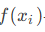与真实值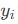

    的误差，而解决问题的方法就是使用梯度下降法来逐步缩小这个误差【均方误差】，损失函数如下：
   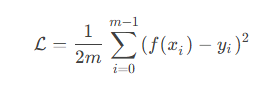

3. 计算梯度，对于损失函数求偏导

   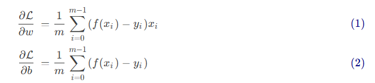

4. 参数w , b 在梯度的反方向上更新，采用固定学习率α (alphaα)

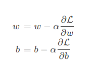

##### 学习率

学习率的选择通常需要实验调整，常见的起始值有 0.01、0.001、0.0001 等

学习率（Learning Rate）控制参数更新的步长：
- **学习率太小**：收敛速度慢，需要更多迭代
- **学习率太大**：可能震荡甚至发散，无法收敛
- **合适的学习率**：快速稳定地收敛到最优解

### 示例1-房价

```python
import numpy as np
# scikit-learn
from sklearn.linear_model import LinearRegression

# 1.准备数据：4个特征(面积、楼层、距地铁、房龄)
X = np.array([
   [50,3,0.5,5],
   [70,15,1.2,10],
   [90,8,0.3,2],
   [110,20,2.0,15],
   [130,12,0.8,8],
])

y = np.array([180,210,320,280,380]) # 总价

# 2.训练模型
model = LinearRegression()
model.fit(X, y)

# 3.查看学到的权重
feature_names = ['面积','楼层','距地铁','房龄']
print("多特征权重：")
for name,w in zip(feature_names,model.coef_):
    print(f"{name}:{w:+.2f}")

print(f"  偏置 b: {model.intercept_:.2f}")

# 4.预测新数据：100m²、10楼、距地铁0.6km、房龄5年
new_house = np.array([[100,10,0.6,5]])
pred = model.predict(new_house)
print(f"\n预测房价: {pred[0]:+.2f} 万元")
```


### 示例2-梯度下降

假设房价与面积呈线性关系：

房价 = w * 面积 + b

我们的目标是通过梯度下降算法，从数据中学习出参数 w 和 b。

#### 生成模拟数据

生成 100 套房屋的数据，面积范围 90-150 平米。为了使梯度下降更稳定，我们将面积单位转换为**百平米**，这样数据范围变为 0.9-1.5。

真实规律：房价 ≈ 250 * 面积(百平米) + 30 等价于 房价 ≈ 2.5 * 面积(平米) + 30

```python
import numpy as np
import matplotlib.pyplot as plt

plt.rcParams['font.sans-serif'] = ['SimHei', 'Arial Unicode MS', 'DejaVu Sans']
plt.rcParams['axes.unicode_minus'] = False

np.random.seed(42)
n_samples = 100
areas_m2 = np.random.uniform(90, 150, n_samples)
areas = areas_m2 / 100
prices = 250 * areas + 30 + np.random.randn(n_samples) * 15

print(f"房屋数量: {len(areas)} 套")
print(f"面积范围: {areas_m2.min():.1f} - {areas_m2.max():.1f} 平米 ({areas.min():.2f} - {areas.max():.2f} 百平米)")
print(f"价格范围: {prices.min():.1f} - {prices.max():.1f} 万")
print(f"真实规律: 房价 = 2.5 × 面积(平米) + 30")
```


#### 梯度下降算法


```python
def gradient_descent(X, y, lr=0.1, epochs=200):
    # 初始化参数
    w, b = 0.0, 0.0
    n = len(X)

    # 初始化历史记录，使用记录初始参数和损失
    history = {'w': [w], 'b': [b], 'loss': [np.mean((w * X + b - y) ** 2)]}

    # 进行迭代训练，更新参数
    for epoch in range(epochs):
        # 计算当前预测值
        y_pred = w * X + b

        # 计算参数 w 梯度
        dw = (2 / n) * np.sum((y_pred - y) * X)
        # 计算参数 b 梯度
        db = (2 / n) * np.sum(y_pred - y)

        # 使用学习率更新参数
        w -= lr * dw
        b -= lr * db

        # 记录参数和损失
        history['w'].append(w)
        history['b'].append(b)
        history['loss'].append(np.mean((y_pred - y) ** 2))

        # 每隔 1% 训练轮数，打印一次进度
        if epoch % (epochs / 100) == 0:
            print(f"迭代 {epoch:3d}: w={w:.2f}, b={b:.2f}, loss={history['loss'][-1]:.2f}")

    return history


history = gradient_descent(areas, prices, lr=0.01, epochs=100000)
print(f"\n最终结果: 房价 = {history['w'][-1] / 100:.3f} × 面积(平米) + {history['b'][-1]:.2f}")
```


#### 使用``adam``优化器加速训练

```python
def adam_optimizer(X, y, lr=0.1, epochs=200, beta1=0.9, beta2=0.999, epsilon=1e-8):
    # 初始化参数
    w, b = 0.0, 0.0
    n = len(X)

    # ================= Adam 特有的状态变量初始化 =================
    m_w, v_w = 0.0, 0.0  # w 的一阶矩和二阶矩
    m_b, v_b = 0.0, 0.0  # b 的一阶矩和二阶矩
    # =============================================================

    # 初始化历史记录
    history = {'w': [w], 'b': [b], 'loss': [np.mean((w * X + b - y) ** 2)]}

    # 进行迭代训练
    for epoch in range(epochs):
        t = epoch + 1  # Adam 的时间步 t 从 1 开始，用于偏差校正

        # 1. 计算当前预测值
        y_pred = w * X + b

        # 2. 计算当前梯度 (这部分和普通梯度下降完全一样)
        dw = (2 / n) * np.sum((y_pred - y) * X)
        db = (2 / n) * np.sum(y_pred - y)

        # ================= Adam 核心参数更新逻辑 =================
        # 3. 更新一阶矩估计（动量：累积历史梯度方向）
        m_w = beta1 * m_w + (1 - beta1) * dw
        m_b = beta1 * m_b + (1 - beta1) * db

        # 4. 更新二阶矩估计（RMSProp：累积历史梯度平方）
        v_w = beta2 * v_w + (1 - beta2) * (dw ** 2)
        v_b = beta2 * v_b + (1 - beta2) * (db ** 2)

        # 5. 计算偏差校正后的一阶和二阶矩（解决初期向 0 偏移的问题）
        m_w_hat = m_w / (1 - beta1 ** t)
        m_b_hat = m_b / (1 - beta1 ** t)
        v_w_hat = v_w / (1 - beta2 ** t)
        v_b_hat = v_b / (1 - beta2 ** t)

        # 6. 使用 Adam 公式更新参数
        w -= lr * m_w_hat / (np.sqrt(v_w_hat) + epsilon)
        b -= lr * m_b_hat / (np.sqrt(v_b_hat) + epsilon)
        # =========================================================

        # 计算当前 loss
        current_loss = np.mean((w * X + b - y) ** 2)

        # 记录参数和损失
        history['w'].append(w)
        history['b'].append(b)
        history['loss'].append(current_loss)

        # 每隔 1% 训练轮数，打印一次进度 (防止epochs较小报错，加个max限制)
        print_step = max(1, int(epochs / 100))
        if epoch % print_step == 0:
            print(f"迭代 {epoch:5d}: w={w:.4f}, b={b:.4f}, loss={current_loss:.4f}")

    return history


# ================= 运行测试 =================
# 提示：Adam 的收敛速度通常比普通梯度下降快很多。
# 原来需要 100,000 次，现在可能 10,000 ~ 50,000 次就足够收敛了。
# 学习率对 Adam 来说通常设为 0.1, 0.01 或 0.001 都可以自适应调整。
history = adam_optimizer(areas, prices, lr=0.1, epochs=50000)

print(f"\n最终结果: 房价 = {history['w'][-1] / 100:.3f} × 面积(平米) + {history['b'][-1]:.2f}")
```


#### 可视化结果

```python
# 创建一个 1 行 3 列的子图布局
fig, axes = plt.subplots(1, 3, figsize=(15, 5))

# 绘制房屋数据散点图
axes[0].scatter(areas_m2, prices, c='steelblue', s=60, alpha=0.7, label='房屋数据')

# 绘制拟合曲线
x_line = np.linspace(85, 155, 100) # 在 (85,100) 区间，生成 100 个等间距的点
y_line = (history['w'][-1]/100) * x_line + history['b'][-1] # 计算拟合曲线的 y 值
axes[0].plot(x_line, y_line, 'coral', lw=2,
             label=f'拟合: y={history["w"][-1]/100:.3f}x+{history["b"][-1]:.1f}')
axes[0].set_xlabel('面积 (平米)', fontsize=12)
axes[0].set_ylabel('房价 (万)', fontsize=12)
axes[0].set_title('房价预测模型', fontsize=14)
axes[0].legend(fontsize=10)
axes[0].grid(True, alpha=0.3)

# 跳过前 100 个迭代，避免初始值对收敛过程演示的干扰
skip = 100

### 绘制参数收敛过程

# 绘制 w 目标值水平线
axes[1].axhline(250, color='steelblue', ls='--', alpha=0.5)
# 绘制 w 收敛过程
axes[1].plot(history['w'][skip:], 'steelblue', lw=2, label='w (目标: 250)')

# 绘制 b 目标值水平线
axes[1].axhline(30, color='darkorange', ls='--', alpha=0.5)
# 绘制 b 收敛过程
axes[1].plot(history['b'][skip:], 'darkorange', lw=2, label='b (目标: 30)')

axes[1].set_xlabel('迭代次数', fontsize=12)
axes[1].set_ylabel('参数值', fontsize=12)
axes[1].set_title('参数收敛过程', fontsize=14)
axes[1].legend(fontsize=10)
axes[1].grid(True, alpha=0.3)

# 绘制损失函数下降过程
axes[2].plot(history['loss'][skip:], 'orangered', lw=2)
axes[2].set_xlabel('迭代次数', fontsize=12)
axes[2].set_ylabel('损失 (MSE)', fontsize=12)
axes[2].set_title('损失函数下降', fontsize=14)
axes[2].grid(True, alpha=0.3)

plt.tight_layout()
plt.show()
```


#### 对比不同学习率的效果

```python
import numpy as np
import matplotlib.pyplot as plt

plt.rcParams['font.sans-serif'] = ['SimHei', 'Arial Unicode MS', 'DejaVu Sans']
plt.rcParams['axes.unicode_minus'] = False

# ============ 核心逻辑 ============
def gradient_descent(start_x, lr, n_steps=15):
    """在 f(x)=x² 上做梯度下降，返回每步的 x 值"""
    trajectory = [start_x]
    x = start_x
    for _ in range(n_steps):
        grad = 2 * x                # f'(x) = 2x
        x = x - lr * grad           # 参数更新
        trajectory.append(x)
        if abs(x) > 500:            # 已经爆炸，提前停
            break
    return trajectory

# ============ 四种学习率对比 ============
x0 = 4.0
configs = [
    (0.05, '太小：蜗牛爬坡',     'steelblue'),
    (0.3,  '合适：稳步收敛',     'seagreen'),
    (0.9,  '偏大：剧烈震荡',     'orange'),
    (1.1,  '过大：梯度爆炸',  'crimson'),
]

# ---------- 图1：参数值随迭代变化 ----------
fig, axes = plt.subplots(2, 2, figsize=(12, 8))
for ax, (lr, title, color) in zip(axes.flatten(), configs):
    traj = gradient_descent(x0, lr)
    ax.plot(range(len(traj)), traj, 'o-', color=color, markersize=5)
    ax.axhline(y=0, color='gray', linestyle='--', alpha=0.5, label='最优点 x=0')
    ax.set_title(f'lr={lr} — {title}', fontsize=12)
    ax.set_xlabel('迭代次数')
    ax.set_ylabel('参数 x')
    ax.legend()
    ax.grid(True, alpha=0.3)

plt.suptitle('学习率对梯度下降的影响（参数变化）', fontsize=14, fontweight='bold')
plt.tight_layout()
plt.show()

# ---------- 图2：在损失曲线上可视化轨迹 ----------
fig, axes = plt.subplots(2, 2, figsize=(12, 8))
x_curve = np.linspace(-8, 8, 300)

for ax, (lr, title, color) in zip(axes.flatten(), configs):
    traj = gradient_descent(x0, lr, n_steps=10)
    # 只保留不越界的点，方便画图
    traj_plot = [x for x in traj if abs(x) <= 10]

    ax.plot(x_curve, x_curve**2, 'k-', alpha=0.2, linewidth=2)   # 损失曲线
    ax.plot(traj_plot, [x**2 for x in traj_plot], 'o', color=color, markersize=6)

    # 画箭头连接每一步
    for i in range(len(traj_plot) - 1):
        ax.annotate('', xy=(traj_plot[i+1], traj_plot[i+1]**2),
                    xytext=(traj_plot[i], traj_plot[i]**2),
                    arrowprops=dict(arrowstyle='->', color=color, lw=1.5))

    ax.set_title(f'lr={lr} — {title}', fontsize=12)
    ax.set_xlim(-9, 9)
    ax.set_ylim(-5, 70)
    ax.set_xlabel('x')
    ax.set_ylabel('f(x) = x²')
    ax.grid(True, alpha=0.3)

plt.suptitle('学习率对梯度下降的影响（损失曲面轨迹）', fontsize=14, fontweight='bold')
plt.tight_layout()
plt.show()
```


### 示例3-吴恩达版梯度下降实例

说明：左上角是模型和数据的图，右上角是代价函数的等高线图，下方是同一个代价函数的曲面图。这个例子中将w初始化为-0.1，b初始化为900


执行一次梯度下降之后，代价函数会从🔵移动到🟠，作图的拟合执行也发生变化


继续执行一次之后，代价函数移动到了🟢，左图函数f(x)同样发生变化

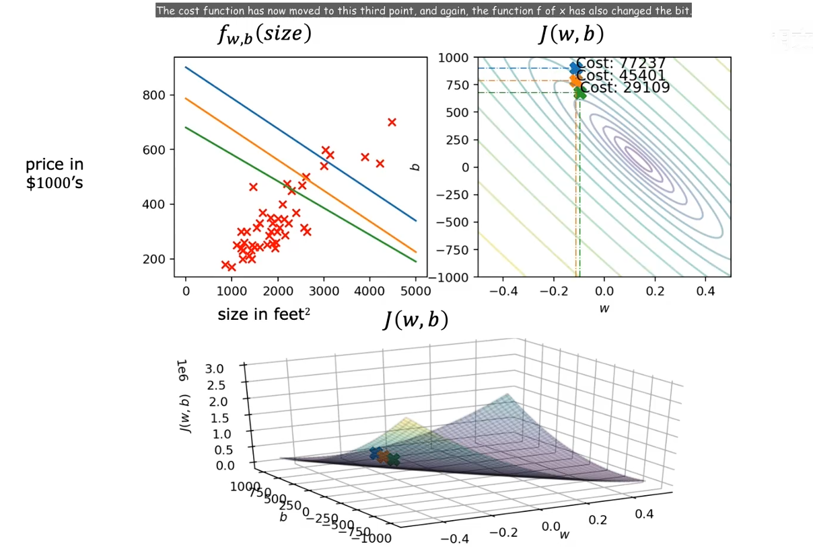

不断继续执行梯度下降更新w和b，代价每一次都在降低，左边拟合直线也越来越贴合数据，直到到达全局最小值

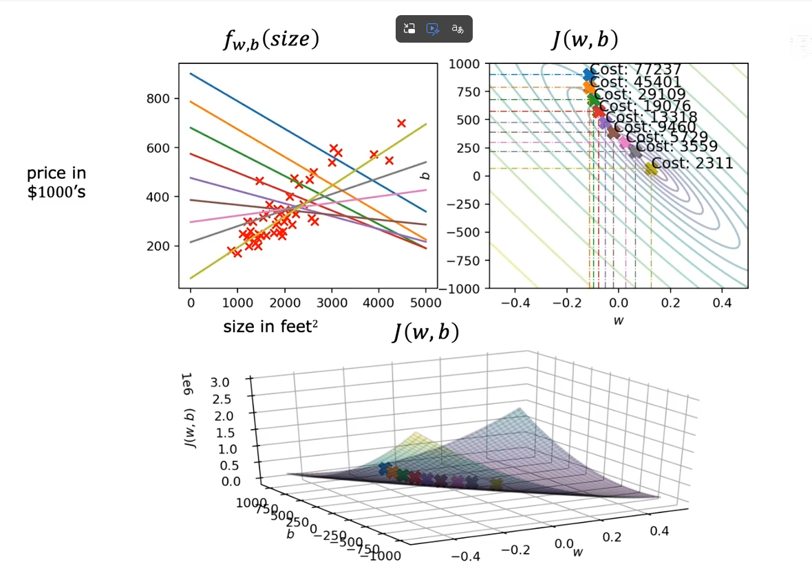

### 梯度下降的优化算法


#### Adam 优化器

``Adam = Momentum + RMSProp``。同时维护梯度的方向趋势（一阶矩）和大小变化（二阶矩）

#### 梯度下降的变体


#### 正规方程法

1. 正规方程法（Normal Equation）是一种用于求解线性回归的解析解的方法。它基于最小二乘法，通过求解矩阵方程来直接获得参数值
2. 正规方程法适用于特征数量较少的情况。当特征数量较大时，计算逆矩阵的复杂度会显著增加，此时梯度下降法更为适用

```python
# fit_intercept: 是否计算偏置
model = sklearn.linear_model.LinearRegression(fit_intercept=True)
model.fit([[0, 3], [1, 2], [2, 1]], [0, 1, 2])
# coef_: 系数
print(model.coef_)
# intercept_: 偏置
print(model.intercept_)

```

### 多元线性回归

目前为止，我们探讨了单变量/特征的回归模型，现在我们对房价模型增加更多的特征，例如房间数、楼层、房龄等，构成一个含有多个变量的模型。下图使用x1...x4表示四个特征；代表特征的列表，j=1...4,；n是特征的总数，该例子中n=4；表示第i个训练样本，这个例子中将是包含四个数字的列表，或者说是向量，它包含了第一个训练集的所有特征；表示第i个训练集的特定特征


#### 多元线性回归模型


本例中也就是


将所有的w用一个行向量表示，这个向量和数字b就是模型的参数

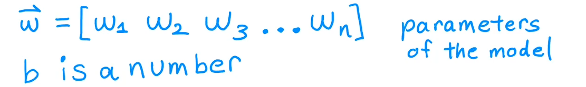

将所有的x用一个行向量表示


模型就可以简化为下方公式，其中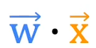就是W~1~X~1~+W~2~X~2~+...+W~n~X~n~

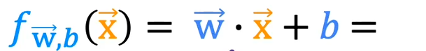

#### 向量化

##### 示例

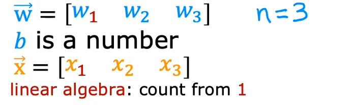

以上的向量和变量在python中的定义

```python
import numpy as np
w = np.array([1.0,2.5,-3.3])
b = 4
x = np.array([10,20,30])
```

不使用向量化实现模型预测的实现


```python
f = w[0] * x[0] + w[1] * x[1] + w[2] * x[2] + b
```

如果特征非常多，则进化为使用循环

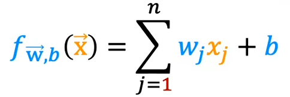

```python
n = 3
f = 0
for j in range(n):
    f = f + w[j] * x[j]
f = f + b
```

用向量化的方式实现，优势是**代码量少并且运行高效**

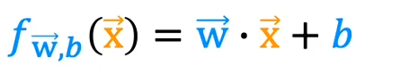

```python
f = np.dot(w,x) + b
```

##### 实现原理

np.dot是在计算机硬盘中以向量化方式实现，在单一步骤中将每一对w和x相乘

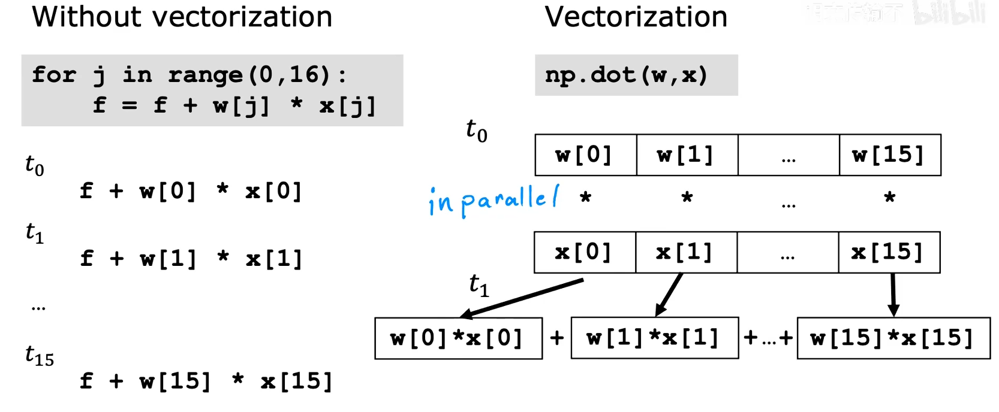

运用到线性回归梯度下降

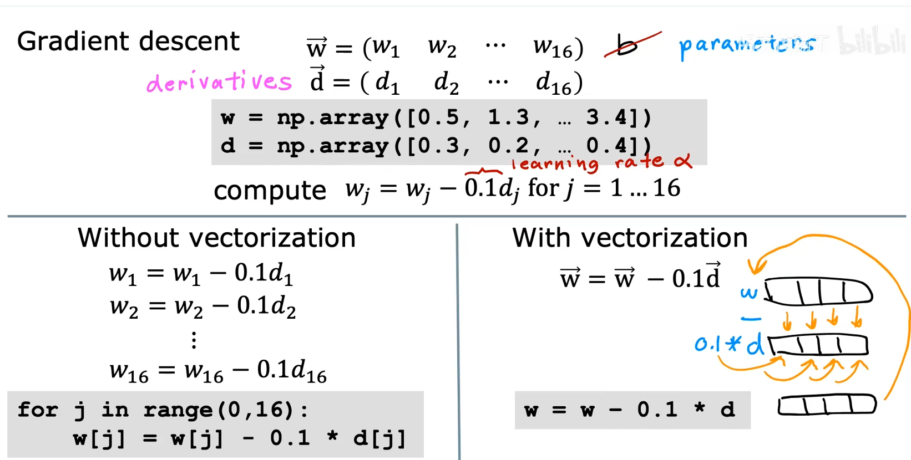

#### 用向量化为多元线性回归实现梯度下降

将W~1~ ~ W~n~替换为向量W


梯度下降的更新规则

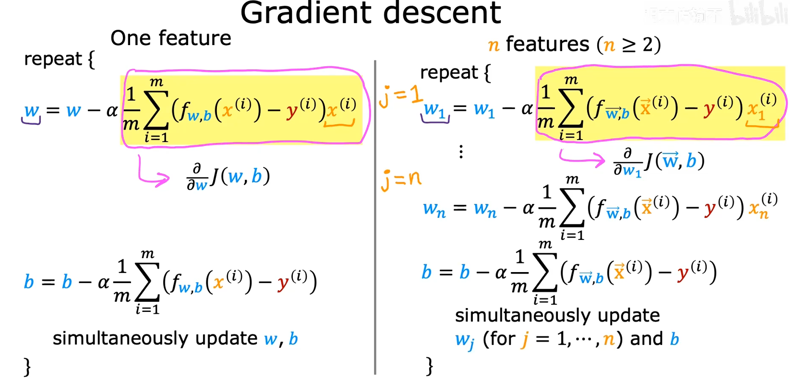

### 正规方程法

仅适用于线性回归求解w和b，这种方法不需要迭代式的梯度下降算法，使用高级线性代数，仅在一次计算中直接解出w和b

##### 缺点

1. 不能泛华到其他学习算法上
2. 如果特征数量n的值很大，正规方程法也会相当慢

#### 在python中的视线

```python
import numpy as np
def normalEqn(X, y):
   theta = np.linalg.inv(X.T@X)@X.T@y #X.T@X等价于X.T.dot(X)
   return theta
```

#### 正规方程及不可逆性

有些矩阵可逆，而有些矩阵不可逆。我们称那些不可逆矩阵为奇异或退化矩阵


### 特征缩放技术

以房价问题为例，假设我们使用两个特征，房屋的尺寸和房间的数量，尺寸的值为 0-2000平方英尺，而房间数量的值则是0-5，以两个参数分别为横纵坐标，绘制代价函数的等高线图能，看出图像会显得很扁，梯度下降算法需要来回反弹很长时间，进行多次的迭代才能收敛

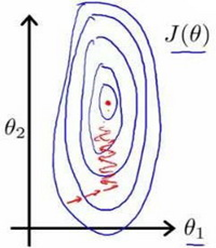

解决的方法是尝试将所有特征的尺度都尽量缩放到-1 ~ 1之间，也可以略微宽松，例如-3 ~ 3、-0.3 ~ 0.3、-2 ~ 0.5、0 ~ 3等范围。最简单的方法是令：，其中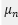是平均值，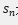是标准差，该方法称为z-分数归一化。

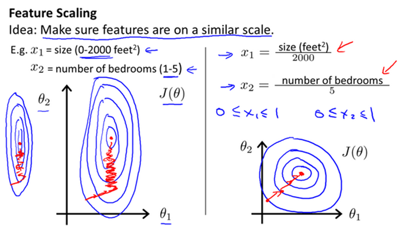

### 如何判断梯度下降正在收敛

代价函数的结果随执行次数的增加而逐渐趋于平稳

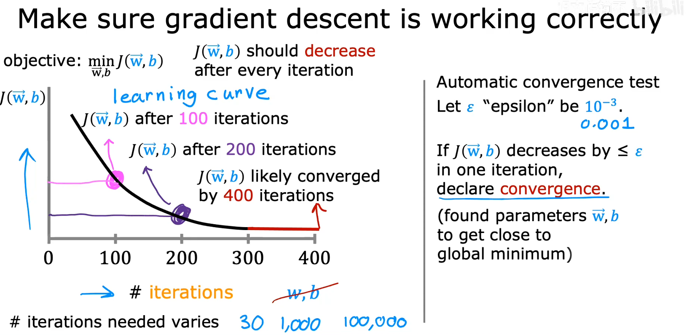

### 选择恰当的学习率

如果在一定迭代次数下的代价函数结果有时上升有时下降，则应该视为梯度下降没有正常工作，意味着代码有bug或者学习率太大

如果学习率过小，则达到收敛所需的迭代次数会非常高

可以先使用以下学习率进行尝试

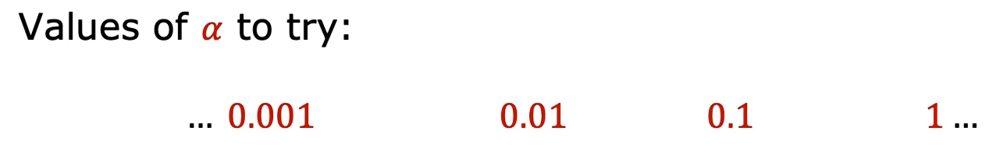

### 特征工程-选择合适的特征

### 多项式回归

有时直线并不能很好的拟合所有数据，例如下方的数据集：横轴是房子的大小，纵轴是价格。使用二次函数的曲线也许可以更好的拟合数据，但二次函数最终会回落，看起来并不是真的合理，因为房子应该不会随着面积的增加而变得便宜，引入三次函数则可能会更好的拟合

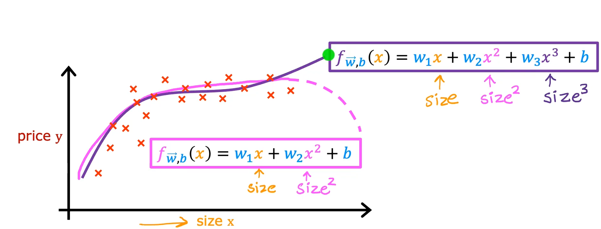

在三次函数的情况下，第一个特征是面积，第二个特征是面积的平方，第三个特征是面积的三次方。

如果创建的特征是原始特征的幂次方，那么特征缩放会很重要

## 逻辑回归

逻辑回归算法是**分类算法**，实际用于解决二元分类问题