# 机器学习

抖音：谦行``AIing``

## 机器学习概念

 

### 人工智能


### 机器学习


### 深度学习

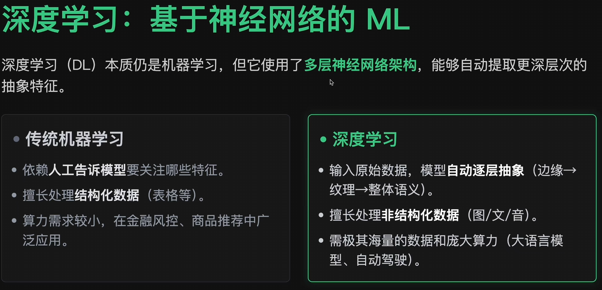

### AI,ML和DL的包含关系


 ### 机器学习三要素

- 模型（model）：总结数据的内在规律，用数学语言描述的参数系统

- 策略（strategy）：选取最优模型的评价准则

- 算法（algorithm）：选取最优模型的具体方法

 #### 模型


算法负责构建模型，模型负责预测未来

### 机器学习类型

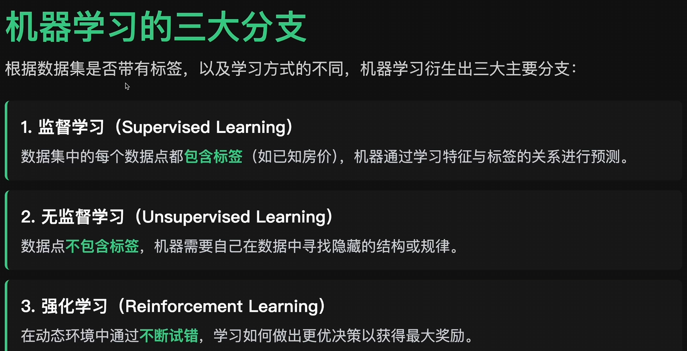

#### 监督学习

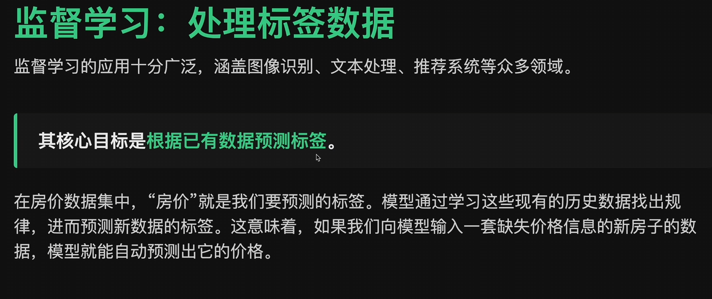

##### 分类

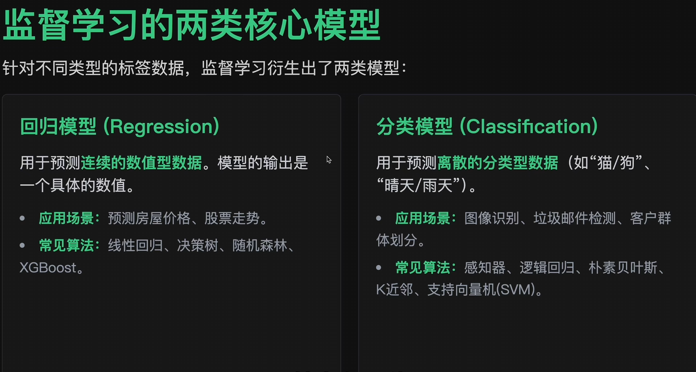

#### 无监督学习


##### 聚类算法

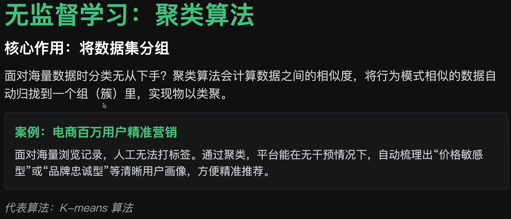

##### 降维算法


##### 生成算法

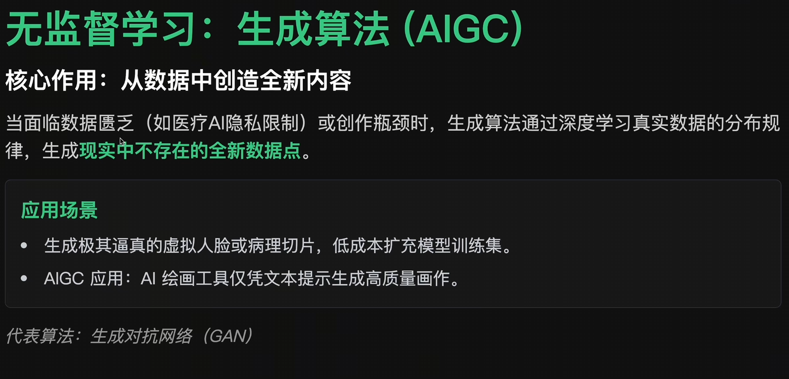

#### 强化学习

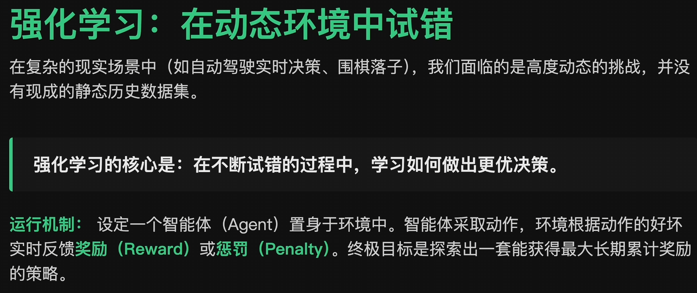

- Q-Learning算法
- 蒙特卡洛树搜索
- 策略梯度算法
- 模仿学习
- 动态规划

## 线性回归


### 模型公式

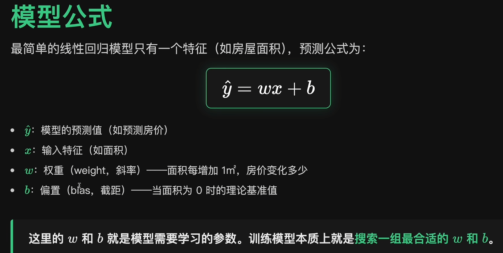

### 损失函数

损失函数用于衡量模型预测值与真实值之间的误差，并通过最小化损失函数来优化模型参数。当损失函数最小时，得到的自变量系数就是最优解

#### 均方误差（MSE）

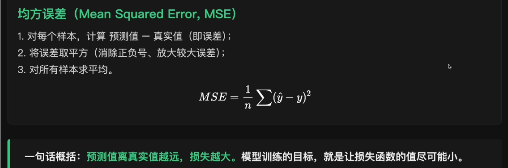

##### 优点


#### 平均绝对误差

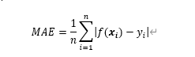

平均绝对误差受异常值影响较小，但对小误差的惩罚较弱。适用与数据中存在显著异常值（如金融风险预测）的场景

### 寻找最优解

#### 梯度下降

实际是求导过程

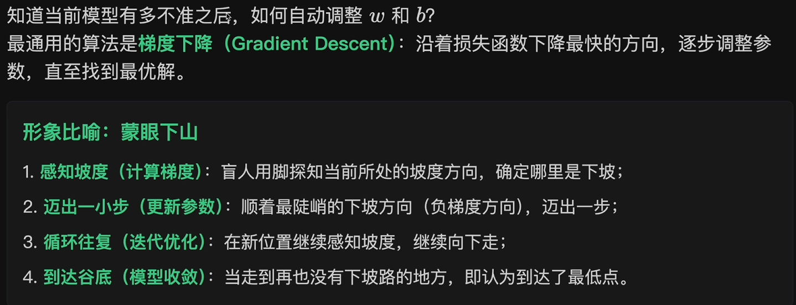

##### 核心原理

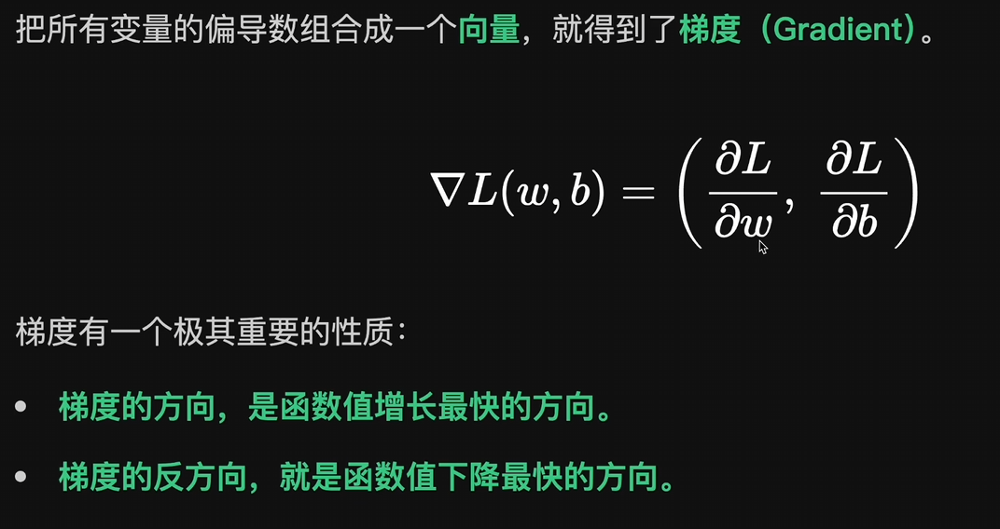

##### 梯度下降的迭代公式

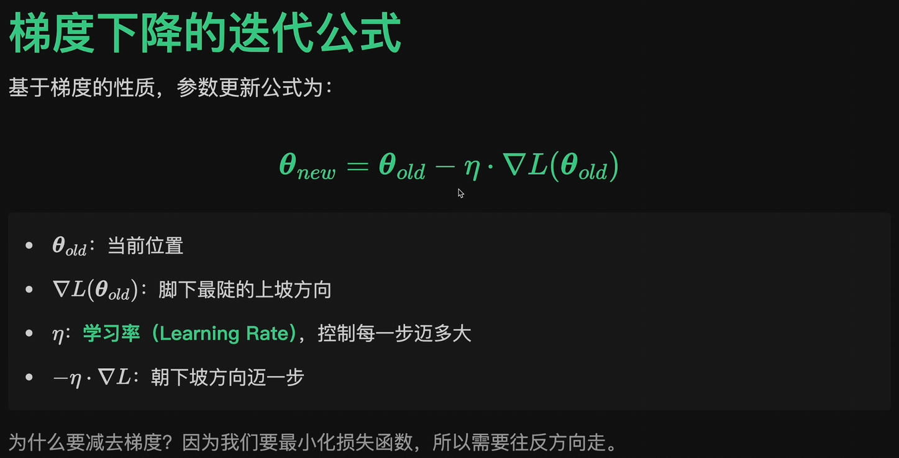

##### 线性回归的梯度推导

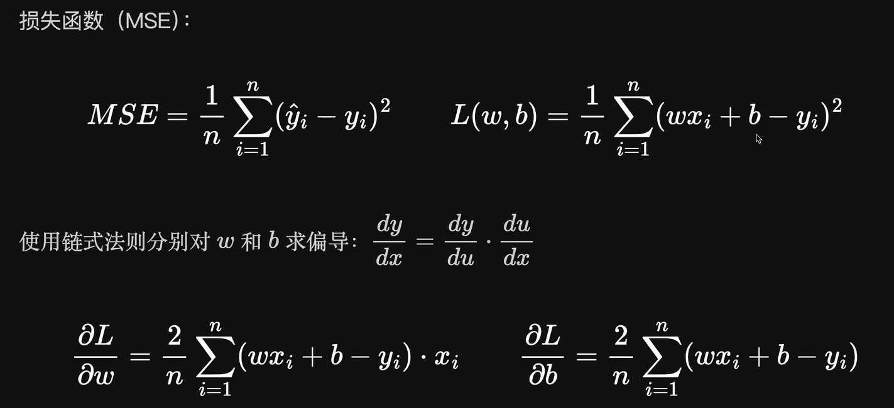

##### 学习率

学习率的选择通常需要实验调整，常见的起始值有 0.01、0.001、0.0001 等

学习率（Learning Rate）控制参数更新的步长：
- **学习率太小**：收敛速度慢，需要更多迭代
- **学习率太大**：可能震荡甚至发散，无法收敛
- **合适的学习率**：快速稳定地收敛到最优解

##### 梯度下降的优化算法


##### Adam 优化器

``Adam = Momentum + RMSProp``。同时维护梯度的方向趋势（一阶矩）和大小变化（二阶矩）

##### 梯度下降的变体


#### 正规方程法

1. 正规方程法（Normal Equation）是一种用于求解线性回归的解析解的方法。它基于最小二乘法，通过求解矩阵方程来直接获得参数值
2. 正规方程法适用于特征数量较少的情况。当特征数量较大时，计算逆矩阵的复杂度会显著增加，此时梯度下降法更为适用

```python
# fit_intercept: 是否计算偏置
model = sklearn.linear_model.LinearRegression(fit_intercept=True)
model.fit([[0, 3], [1, 2], [2, 1]], [0, 1, 2])
# coef_: 系数
print(model.coef_)
# intercept_: 偏置
print(model.intercept_)

```

### 多特征线性回归

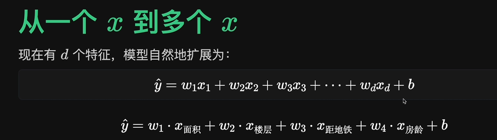

### 多项式回归

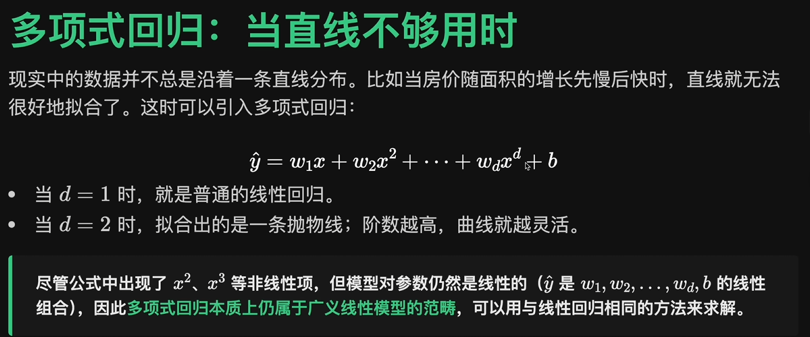

### 示例1

```python
import numpy as np
# scikit-learn
from sklearn.linear_model import LinearRegression

# 1.准备数据：4个特征(面积、楼层、距地铁、房龄)
X = np.array([
   [50,3,0.5,5],
   [70,15,1.2,10],
   [90,8,0.3,2],
   [110,20,2.0,15],
   [130,12,0.8,8],
])

y = np.array([180,210,320,280,380]) # 总价

# 2.训练模型
model = LinearRegression()
model.fit(X, y)

# 3.查看学到的权重
feature_names = ['面积','楼层','距地铁','房龄']
print("多特征权重：")
for name,w in zip(feature_names,model.coef_):
    print(f"{name}:{w:+.2f}")

print(f"  偏置 b: {model.intercept_:.2f}")

# 4.预测新数据：100m²、10楼、距地铁0.6km、房龄5年
new_house = np.array([[100,10,0.6,5]])
pred = model.predict(new_house)
print(f"\n预测房价: {pred[0]:+.2f} 万元")
```


### 示例2

假设房价与面积呈线性关系：

房价 = w * 面积 + b

我们的目标是通过梯度下降算法，从数据中学习出参数 w 和 b。

#### 生成模拟数据

生成 100 套房屋的数据，面积范围 90-150 平米。为了使梯度下降更稳定，我们将面积单位转换为**百平米**，这样数据范围变为 0.9-1.5。

真实规律：房价 ≈ 250 * 面积(百平米) + 30 等价于 房价 ≈ 2.5 * 面积(平米) + 30

```python
import numpy as np
import matplotlib.pyplot as plt

plt.rcParams['font.sans-serif'] = ['SimHei', 'Arial Unicode MS', 'DejaVu Sans']
plt.rcParams['axes.unicode_minus'] = False

np.random.seed(42)
n_samples = 100
areas_m2 = np.random.uniform(90, 150, n_samples)
areas = areas_m2 / 100
prices = 250 * areas + 30 + np.random.randn(n_samples) * 15

print(f"房屋数量: {len(areas)} 套")
print(f"面积范围: {areas_m2.min():.1f} - {areas_m2.max():.1f} 平米 ({areas.min():.2f} - {areas.max():.2f} 百平米)")
print(f"价格范围: {prices.min():.1f} - {prices.max():.1f} 万")
print(f"真实规律: 房价 = 2.5 × 面积(平米) + 30")
```


#### 梯度下降算法


```python
def gradient_descent(X, y, lr=0.1, epochs=200):
    # 初始化参数
    w, b = 0.0, 0.0
    n = len(X)

    # 初始化历史记录，使用记录初始参数和损失
    history = {'w': [w], 'b': [b], 'loss': [np.mean((w * X + b - y) ** 2)]}

    # 进行迭代训练，更新参数
    for epoch in range(epochs):
        # 计算当前预测值
        y_pred = w * X + b

        # 计算参数 w 梯度
        dw = (2 / n) * np.sum((y_pred - y) * X)
        # 计算参数 b 梯度
        db = (2 / n) * np.sum(y_pred - y)

        # 使用学习率更新参数
        w -= lr * dw
        b -= lr * db

        # 记录参数和损失
        history['w'].append(w)
        history['b'].append(b)
        history['loss'].append(np.mean((y_pred - y) ** 2))

        # 每隔 1% 训练轮数，打印一次进度
        if epoch % (epochs / 100) == 0:
            print(f"迭代 {epoch:3d}: w={w:.2f}, b={b:.2f}, loss={history['loss'][-1]:.2f}")

    return history


history = gradient_descent(areas, prices, lr=0.01, epochs=100000)
print(f"\n最终结果: 房价 = {history['w'][-1] / 100:.3f} × 面积(平米) + {history['b'][-1]:.2f}")
```


#### 使用``adam``优化器加速训练

```python
def adam_optimizer(X, y, lr=0.1, epochs=200, beta1=0.9, beta2=0.999, epsilon=1e-8):
    # 初始化参数
    w, b = 0.0, 0.0
    n = len(X)

    # ================= Adam 特有的状态变量初始化 =================
    m_w, v_w = 0.0, 0.0  # w 的一阶矩和二阶矩
    m_b, v_b = 0.0, 0.0  # b 的一阶矩和二阶矩
    # =============================================================

    # 初始化历史记录
    history = {'w': [w], 'b': [b], 'loss': [np.mean((w * X + b - y) ** 2)]}

    # 进行迭代训练
    for epoch in range(epochs):
        t = epoch + 1  # Adam 的时间步 t 从 1 开始，用于偏差校正

        # 1. 计算当前预测值
        y_pred = w * X + b

        # 2. 计算当前梯度 (这部分和普通梯度下降完全一样)
        dw = (2 / n) * np.sum((y_pred - y) * X)
        db = (2 / n) * np.sum(y_pred - y)

        # ================= Adam 核心参数更新逻辑 =================
        # 3. 更新一阶矩估计（动量：累积历史梯度方向）
        m_w = beta1 * m_w + (1 - beta1) * dw
        m_b = beta1 * m_b + (1 - beta1) * db

        # 4. 更新二阶矩估计（RMSProp：累积历史梯度平方）
        v_w = beta2 * v_w + (1 - beta2) * (dw ** 2)
        v_b = beta2 * v_b + (1 - beta2) * (db ** 2)

        # 5. 计算偏差校正后的一阶和二阶矩（解决初期向 0 偏移的问题）
        m_w_hat = m_w / (1 - beta1 ** t)
        m_b_hat = m_b / (1 - beta1 ** t)
        v_w_hat = v_w / (1 - beta2 ** t)
        v_b_hat = v_b / (1 - beta2 ** t)

        # 6. 使用 Adam 公式更新参数
        w -= lr * m_w_hat / (np.sqrt(v_w_hat) + epsilon)
        b -= lr * m_b_hat / (np.sqrt(v_b_hat) + epsilon)
        # =========================================================

        # 计算当前 loss
        current_loss = np.mean((w * X + b - y) ** 2)

        # 记录参数和损失
        history['w'].append(w)
        history['b'].append(b)
        history['loss'].append(current_loss)

        # 每隔 1% 训练轮数，打印一次进度 (防止epochs较小报错，加个max限制)
        print_step = max(1, int(epochs / 100))
        if epoch % print_step == 0:
            print(f"迭代 {epoch:5d}: w={w:.4f}, b={b:.4f}, loss={current_loss:.4f}")

    return history


# ================= 运行测试 =================
# 提示：Adam 的收敛速度通常比普通梯度下降快很多。
# 原来需要 100,000 次，现在可能 10,000 ~ 50,000 次就足够收敛了。
# 学习率对 Adam 来说通常设为 0.1, 0.01 或 0.001 都可以自适应调整。
history = adam_optimizer(areas, prices, lr=0.1, epochs=50000)

print(f"\n最终结果: 房价 = {history['w'][-1] / 100:.3f} × 面积(平米) + {history['b'][-1]:.2f}")
```

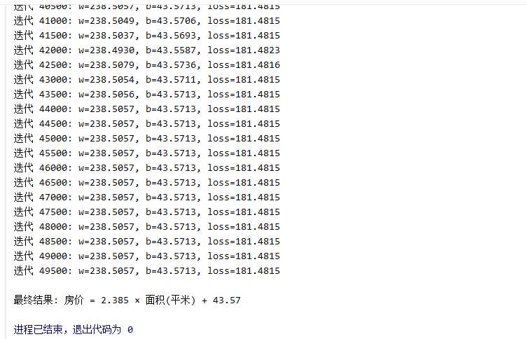

#### 可视化结果

```python
# 创建一个 1 行 3 列的子图布局
fig, axes = plt.subplots(1, 3, figsize=(15, 5))

# 绘制房屋数据散点图
axes[0].scatter(areas_m2, prices, c='steelblue', s=60, alpha=0.7, label='房屋数据')

# 绘制拟合曲线
x_line = np.linspace(85, 155, 100) # 在 (85,100) 区间，生成 100 个等间距的点
y_line = (history['w'][-1]/100) * x_line + history['b'][-1] # 计算拟合曲线的 y 值
axes[0].plot(x_line, y_line, 'coral', lw=2,
             label=f'拟合: y={history["w"][-1]/100:.3f}x+{history["b"][-1]:.1f}')
axes[0].set_xlabel('面积 (平米)', fontsize=12)
axes[0].set_ylabel('房价 (万)', fontsize=12)
axes[0].set_title('房价预测模型', fontsize=14)
axes[0].legend(fontsize=10)
axes[0].grid(True, alpha=0.3)

# 跳过前 100 个迭代，避免初始值对收敛过程演示的干扰
skip = 100

### 绘制参数收敛过程

# 绘制 w 目标值水平线
axes[1].axhline(250, color='steelblue', ls='--', alpha=0.5)
# 绘制 w 收敛过程
axes[1].plot(history['w'][skip:], 'steelblue', lw=2, label='w (目标: 250)')

# 绘制 b 目标值水平线
axes[1].axhline(30, color='darkorange', ls='--', alpha=0.5)
# 绘制 b 收敛过程
axes[1].plot(history['b'][skip:], 'darkorange', lw=2, label='b (目标: 30)')

axes[1].set_xlabel('迭代次数', fontsize=12)
axes[1].set_ylabel('参数值', fontsize=12)
axes[1].set_title('参数收敛过程', fontsize=14)
axes[1].legend(fontsize=10)
axes[1].grid(True, alpha=0.3)

# 绘制损失函数下降过程
axes[2].plot(history['loss'][skip:], 'orangered', lw=2)
axes[2].set_xlabel('迭代次数', fontsize=12)
axes[2].set_ylabel('损失 (MSE)', fontsize=12)
axes[2].set_title('损失函数下降', fontsize=14)
axes[2].grid(True, alpha=0.3)

plt.tight_layout()
plt.show()
```


#### 对比不同学习率的效果

```python
import numpy as np
import matplotlib.pyplot as plt

plt.rcParams['font.sans-serif'] = ['SimHei', 'Arial Unicode MS', 'DejaVu Sans']
plt.rcParams['axes.unicode_minus'] = False

# ============ 核心逻辑 ============
def gradient_descent(start_x, lr, n_steps=15):
    """在 f(x)=x² 上做梯度下降，返回每步的 x 值"""
    trajectory = [start_x]
    x = start_x
    for _ in range(n_steps):
        grad = 2 * x                # f'(x) = 2x
        x = x - lr * grad           # 参数更新
        trajectory.append(x)
        if abs(x) > 500:            # 已经爆炸，提前停
            break
    return trajectory

# ============ 四种学习率对比 ============
x0 = 4.0
configs = [
    (0.05, '太小：蜗牛爬坡',     'steelblue'),
    (0.3,  '合适：稳步收敛',     'seagreen'),
    (0.9,  '偏大：剧烈震荡',     'orange'),
    (1.1,  '过大：梯度爆炸',  'crimson'),
]

# ---------- 图1：参数值随迭代变化 ----------
fig, axes = plt.subplots(2, 2, figsize=(12, 8))
for ax, (lr, title, color) in zip(axes.flatten(), configs):
    traj = gradient_descent(x0, lr)
    ax.plot(range(len(traj)), traj, 'o-', color=color, markersize=5)
    ax.axhline(y=0, color='gray', linestyle='--', alpha=0.5, label='最优点 x=0')
    ax.set_title(f'lr={lr} — {title}', fontsize=12)
    ax.set_xlabel('迭代次数')
    ax.set_ylabel('参数 x')
    ax.legend()
    ax.grid(True, alpha=0.3)

plt.suptitle('学习率对梯度下降的影响（参数变化）', fontsize=14, fontweight='bold')
plt.tight_layout()
plt.show()

# ---------- 图2：在损失曲线上可视化轨迹 ----------
fig, axes = plt.subplots(2, 2, figsize=(12, 8))
x_curve = np.linspace(-8, 8, 300)

for ax, (lr, title, color) in zip(axes.flatten(), configs):
    traj = gradient_descent(x0, lr, n_steps=10)
    # 只保留不越界的点，方便画图
    traj_plot = [x for x in traj if abs(x) <= 10]

    ax.plot(x_curve, x_curve**2, 'k-', alpha=0.2, linewidth=2)   # 损失曲线
    ax.plot(traj_plot, [x**2 for x in traj_plot], 'o', color=color, markersize=6)

    # 画箭头连接每一步
    for i in range(len(traj_plot) - 1):
        ax.annotate('', xy=(traj_plot[i+1], traj_plot[i+1]**2),
                    xytext=(traj_plot[i], traj_plot[i]**2),
                    arrowprops=dict(arrowstyle='->', color=color, lw=1.5))

    ax.set_title(f'lr={lr} — {title}', fontsize=12)
    ax.set_xlim(-9, 9)
    ax.set_ylim(-5, 70)
    ax.set_xlabel('x')
    ax.set_ylabel('f(x) = x²')
    ax.grid(True, alpha=0.3)

plt.suptitle('学习率对梯度下降的影响（损失曲面轨迹）', fontsize=14, fontweight='bold')
plt.tight_layout()
plt.show()
```


