# 深度学习

深度学习（Deep Learning, DL）是机器学习的子集，也是人工智能（AI）的核心技术之一。它通过构建 “深度神经网络”（含多层隐藏层的神经网络）模拟人脑神经元的信息传递机制，无需人工设计特征，直接从原始数据（图像、文本、语音等）中自动学习层次化的特征表示，最终实现分类、预测、生成等任务。其核心优势在于 “端到端学习” 和对复杂数据的强大拟合能力，已广泛渗透到科研、工业、医疗等多个领域。

## 深度学习的核心基础

### 与人工智能、机器学习的关系
人工智能（AI）：广义目标是让机器具备人类的智能（如推理、感知、决策），是顶层概念；
机器学习（ML）：AI 的实现途径之一，通过算法让机器从数据中学习规律（而非硬编码规则），核心是 “特征工程 + 模型训练”；
深度学习：机器学习的进阶分支，用 “深度神经网络” 替代传统机器学习的 “手工特征提取”，直接从原始数据中自动学习高维特征，是 “数据驱动 + 特征自动学习” 的范式。
简单类比：AI 是 “制造智能机器人”，机器学习是 “教机器人通过经验学习”，深度学习是 “让机器人通过多层神经网络自主提炼经验规律”。

### 神经网络的基本单元：感知机
深度学习的核心是 “神经网络”，而感知机（Perceptron）是神经网络的最小组成单元，模拟人脑单个神经元的工作原理：

结构：1 个输入层（接收多个特征）、1 个权重向量（给每个特征分配重要性）、1 个偏置项（调整激活阈值）、1 个激活函数（输出结果）；
计算逻辑：输出 = 激活函数（输入特征 × 权重 + 偏置）例：二分类任务中，激活函数用 Sigmoid，输出 0 或 1 表示两类结果。
核心意义：感知机是 “线性分类器”，但单个感知机无法解决非线性问题（如异或问题），而 “多层感知机（MLP）” 通过堆叠感知机，可拟合复杂非线性关系。

### 深度神经网络 （DNN）的核心结构
“深度” 指神经网络包含至少 1 个隐藏层（多层隐藏层可学习更抽象的特征），典型结构分为 3 部分：

- 输入层（Input Layer）：接收原始数据（如图像的像素值、文本的向量表示），节点数 = 数据的特征维度；
- 隐藏层（Hidden Layer）：核心特征提取层，层数越多、节点数越多，模型拟合能力越强（但易过拟合）；隐藏层的每个节点是一个感知机，接收上一层输出，通过激活函数转换后传递给下一层；
- 输出层（Output Layer）：输出任务结果，节点数 = 任务目标维度（如二分类 = 1 个节点，10 分类 = 10 个节点），激活函数需匹配任务（分类用 Softmax，回归用 Linear）。

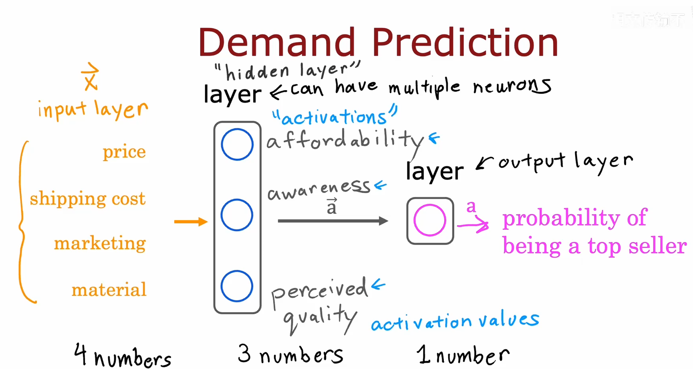

### 核心机制：前向传播与反向传播
前向传播（Forward Propagation）：数据从输入层流入，经隐藏层逐层计算（加权求和 + 激活），最终从输出层得到预测结果，是 “预测过程”；
反向传播（Backward Propagation）：通过 “损失函数” 计算预测结果与真实标签的误差，然后沿网络反向传播，用 “梯度下降法” 调整各层权重和偏置，最小化误差，是 “模型训练过程”。
### 关键概念

- 损失函数：衡量预测误差（如分类用交叉熵，回归用 MSE）；
- 梯度下降：沿误差梯度方向调整参数，最小化损失（常用变体：SGD、Adam、RMSprop）；
- 激活函数：给网络注入非线性（否则多层网络等价于单层线性模型），常用：ReLU（隐藏层）、Sigmoid（二分类输出）、Softmax（多分类输出）。

## 神经网络

### 模型表示1

神经网络模型建立在很多神经元之上，每一个神经元又是一个个学习模型。这些神经元（也叫激活单元，**activation unit**）采纳一些特征作为输出，并且根据本身的模型提供一个输出。下图是一个以逻辑回归模型作为自身学习模型的神经元示例，在神经网络中，参数又可被成为权重（**weight**）。

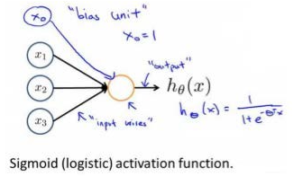

我们设计出了类似于神经元的神经网络，效果如下：

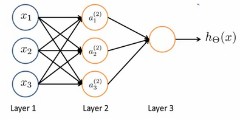

其中$x_1$, $x_2$, $x_3$是输入单元（**input units**），我们将原始数据输入给它们。
$a_1$, $a_2$, $a_3$是中间单元，它们负责将数据进行处理，然后呈递到下一层。
最后是输出单元，它负责计算${h_\theta}\left( x \right)$。

神经网络模型是许多逻辑单元按照不同层级组织起来的网络，每一层的输出变量都是下一层的输入变量。下图为一个3层的神经网络，第一层成为输入层（**Input Layer**），最后一层称为输出层（**Output Layer**），中间一层成为隐藏层（**Hidden Layers**）。我们为每一层都增加一个偏差单位（**bias unit**）：

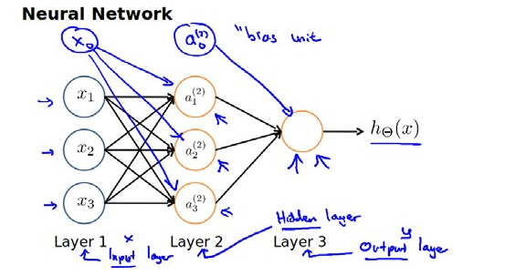

下面引入一些标记法来帮助描述模型：
$a_{i}^{\left( j \right)}$ 代表第$j$ 层的第 $i$ 个激活单元。${{\theta }^{\left( j \right)}}$代表从第 $j$ 层映射到第$ j+1$ 层时的权重的矩阵，例如${{\theta }^{\left( 1 \right)}}$代表从第一层映射到第二层的权重的矩阵。其尺寸为：以第 $j+1$层的激活单元数量为行数，以第 $j$ 层的激活单元数加一为列数的矩阵。例如：上图所示的神经网络中${{\theta }^{\left( 1 \right)}}$的尺寸为 3*4。

对于上图所示的模型，激活单元和输出分别表达为：

$a_{1}^{(2)}=g(\Theta _{10}^{(1)}{{x}_{0}}+\Theta _{11}^{(1)}{{x}_{1}}+\Theta _{12}^{(1)}{{x}_{2}}+\Theta _{13}^{(1)}{{x}_{3}})$
	$a_{2}^{(2)}=g(\Theta _{20}^{(1)}{{x}_{0}}+\Theta _{21}^{(1)}{{x}_{1}}+\Theta _{22}^{(1)}{{x}_{2}}+\Theta _{23}^{(1)}{{x}_{3}})$
	$a_{3}^{(2)}=g(\Theta _{30}^{(1)}{{x}_{0}}+\Theta _{31}^{(1)}{{x}_{1}}+\Theta _{32}^{(1)}{{x}_{2}}+\Theta _{33}^{(1)}{{x}_{3}})$
	${{h}_{\Theta }}(x)=g(\Theta _{10}^{(2)}a_{0}^{(2)}+\Theta _{11}^{(2)}a_{1}^{(2)}+\Theta _{12}^{(2)}a_{2}^{(2)}+\Theta _{13}^{(2)}a_{3}^{(2)})$

上面进行的讨论中只是将特征矩阵中的一行（一个训练实例）喂给了神经网络，我们需要将整个训练集都喂给我们的神经网络算法来学习模型。

我们可以知道：每一个$a$都是由上一层所有的$x$和每一个$x$所对应的决定的。

（我们把这样从左到右的算法称为前向传播算法( **FORWARD PROPAGATION** )）

把$x$, $\theta$, $a$ 分别用矩阵表示：

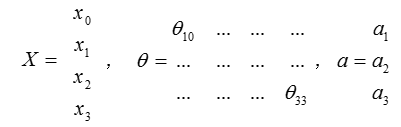

我们可以得到$\theta \cdot X=a$ 。

### 模型表示2

( **FORWARD PROPAGATION** )
相对于使用循环来编码，利用向量化的方法会使得计算更为简便。以上面的神经网络为例，试着计算第二层的值：

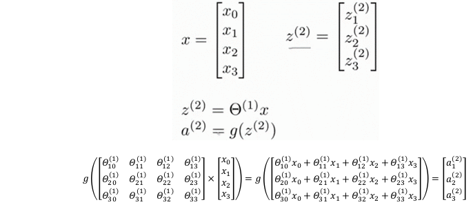

令 ${{z}^{\left( 2 \right)}}={{\theta }^{\left( 1 \right)}}x$，则 ${{a}^{\left( 2 \right)}}=g({{z}^{\left( 2 \right)}})$ ，计算后添加 $a_{0}^{\left( 2 \right)}=1$。 计算输出的值为：

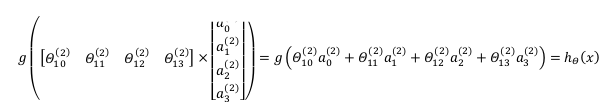

令 ${{z}^{\left( 3 \right)}}={{\theta }^{\left( 2 \right)}}{{a}^{\left( 2 \right)}}$，则 $h_\theta(x)={{a}^{\left( 3 \right)}}=g({{z}^{\left( 3 \right)}})$。
这只是针对训练集中一个训练实例所进行的计算。如果我们要对整个训练集进行计算，我们需要将训练集特征矩阵进行转置，使得同一个实例的特征都在同一列里。即：

${{z}^{\left( 2 \right)}}={{\Theta }^{\left( 1 \right)}}\times {{X}^{T}} $

 ${{a}^{\left( 2 \right)}}=g({{z}^{\left( 2 \right)}})$

为了更好了了解**Neuron Networks**的工作原理，先把左半部分遮住：

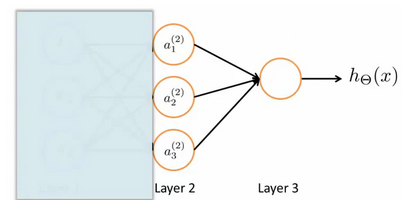

右半部分其实就是以$a_0, a_1, a_2, a_3$, 按照**逻辑回归**的方式输出$h_\theta(x)$：

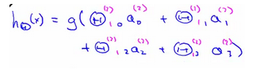

其实神经网络就像是**逻辑回归**，只不过把**逻辑回归**中的输入向量$\left[ x_1\sim {x_3} \right]$ 变成了中间层的$\left[ a_1^{(2)}\sim a_3^{(2)} \right]$, 即:  $h_\theta(x)=g\left( \Theta_0^{\left( 2 \right)}a_0^{\left( 2 \right)}+\Theta_1^{\left( 2 \right)}a_1^{\left( 2 \right)}+\Theta_{2}^{\left( 2 \right)}a_{2}^{\left( 2 \right)}+\Theta_{3}^{\left( 2 \right)}a_{3}^{\left( 2 \right)} \right)$ 
我们可以把$a_0, a_1, a_2, a_3$看成更为高级的特征值，也就是$x_0, x_1, x_2, x_3$的进化体，并且它们是由 $x$与$\theta$决定的，因为是梯度下降的，所以$a$是变化的，并且变得越来越厉害，所以这些更高级的特征值远比仅仅将 $x$次方厉害，也能更好的预测新数据。
这就是神经网络相比于逻辑回归和线性回归的优势。

### 特征和直观理解

从本质上讲，神经网络能够通过学习得出其自身的一系列特征。在普通的逻辑回归中，我们被限制为使用数据中的原始特征$x_1,x_2,...,{{x}_{n}}$，我们虽然可以使用一些二项式项来组合这些特征，但是我们仍然受到这些原始特征的限制。在神经网络中，原始特征只是输入层，在我们上面三层的神经网络例子中，第三层也就是输出层做出的预测利用的是第二层的特征，而非输入层中的原始特征，我们可以认为第二层中的特征是神经网络通过学习后自己得出的一系列用于预测输出变量的新特征。

神经网络中，单层神经元（无中间层）的计算可用来表示逻辑运算，比如逻辑与(**AND**)、逻辑或(**OR**)。

举例说明：逻辑与(**AND**)；下图中左半部分是神经网络的设计与**output**层表达式，右边上部分是**sigmod**函数，下半部分是真值表。

我们可以用这样的一个神经网络表示**AND** 函数：

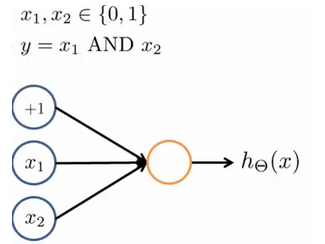

其中$\theta_0 = -30, \theta_1 = 20, \theta_2 = 20$
我们的输出函数$h_\theta(x)$即为：$h_\Theta(x)=g\left( -30+20x_1+20x_2 \right)$

我们知道$g(x)$的图像是：

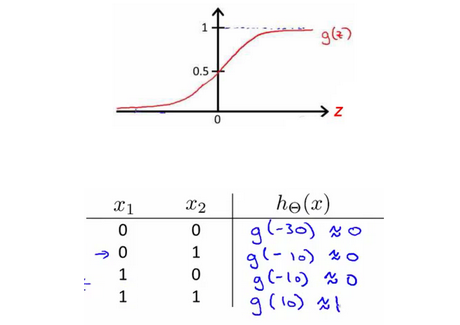

所以我们有：$h_\Theta(x) \approx \text{x}_1 \text{AND} \, \text{x}_2$

所以我们的：$h_\Theta(x) $

这就是**AND**函数。

接下来再介绍一个**OR**函数：

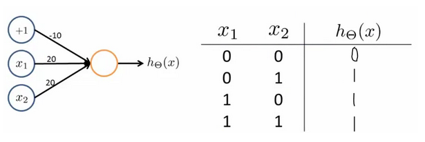

**OR**与**AND**整体一样，区别只在于的取值不同。

### 样本和直观理解

二元逻辑运算符（**BINARY LOGICAL OPERATORS**）当输入特征为布尔值（0或1）时，我们可以用一个单一的激活层可以作为二元逻辑运算符，为了表示不同的运算符，我们只需要选择不同的权重即可。

下图的神经元（三个权重分别为-30，20，20）可以被视为作用同于逻辑与（**AND**）：

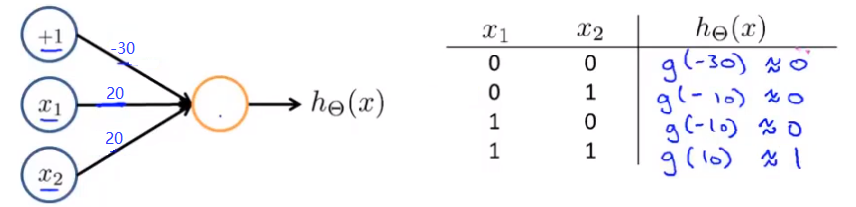

下图的神经元（三个权重分别为-10，20，20）可以被视为作用等同于逻辑或（**OR**）：

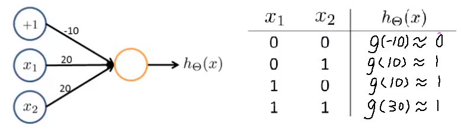

下图的神经元（两个权重分别为 10，-20）可以被视为作用等同于逻辑非（**NOT**）：

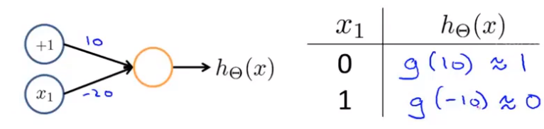

我们可以利用神经元来组合成更为复杂的神经网络以实现更复杂的运算。例如我们要实现**XNOR** 功能（输入的两个值必须一样，均为1或均为0），即 $\text{XNOR}=( \text{x}_1\, \text{AND}\, \text{x}_2 )\, \text{OR} \left( \left( \text{NOT}\, \text{x}_1 \right) \text{AND} \left( \text{NOT}\, \text{x}_2 \right) \right)$
首先构造一个能表达$\left( \text{NOT}\, \text{x}_1 \right) \text{AND} \left( \text{NOT}\, \text{x}_2 \right)$部分的神经元：

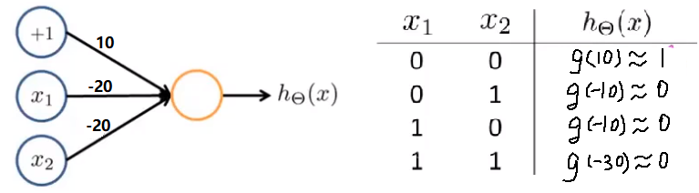

然后将表示 **AND** 的神经元和表示$\left( \text{NOT}\, \text{x}_1 \right) \text{AND} \left( \text{NOT}\, \text{x}_2 \right)$的神经元以及表示 OR 的神经元进行组合：

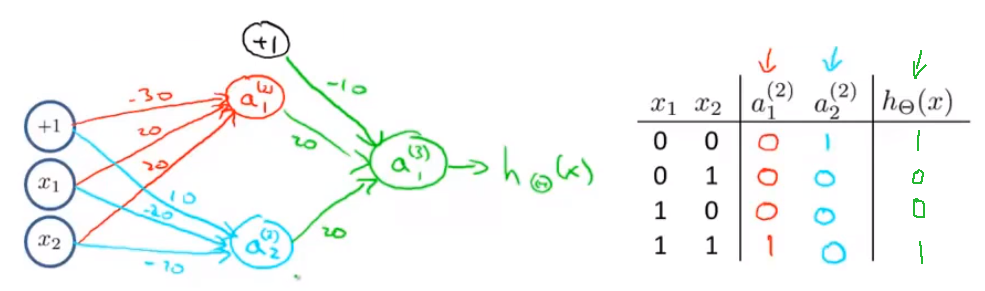

我们就得到了一个能实现 $\text{XNOR}$ 运算符功能的神经网络。

按这种方法我们可以逐渐构造出越来越复杂的函数，也能得到更加厉害的特征值。

### 多类分类

当我们有不止两种分类时（也就是$y=1,2,3….$），比如以下这种情况，该怎么办？如果我们要训练一个神经网络算法来识别路人、汽车、摩托车和卡车，在输出层我们应该有4个值。例如，第一个值为1或0用于预测是否是行人，第二个值用于判断是否为汽车。

输入向量$x$有三个维度，两个中间层，输出层4个神经元分别用来表示4类，也就是每一个数据在输出层都会出现${{\left[ a\text{ }b\text{ }c\text{ }d \right]}^{T}}$，且$a,b,c,d$中仅有一个为1，表示当前类。下面是该神经网络的可能结构示例：

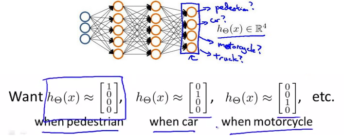

神经网络算法的输出结果为四种可能情形之一：

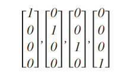

## 代价函数

首先引入一些便于稍后讨论的新标记方法：

假设神经网络的训练样本有$m$个，每个包含一组输入$x$和一组输出信号$y$，$L$表示神经网络层数，$S_I$表示每层的**neuron**个数($S_l$表示输出层神经元个数)，$S_L$代表最后一层中处理单元的个数。

将神经网络的分类定义为两种情况：二类分类和多类分类，

二类分类：$S_L=0, y=0\, or\, 1$表示哪一类；

$K$类分类：$S_L=k, y_i = 1$表示分到第$i$类；$(k>2)$

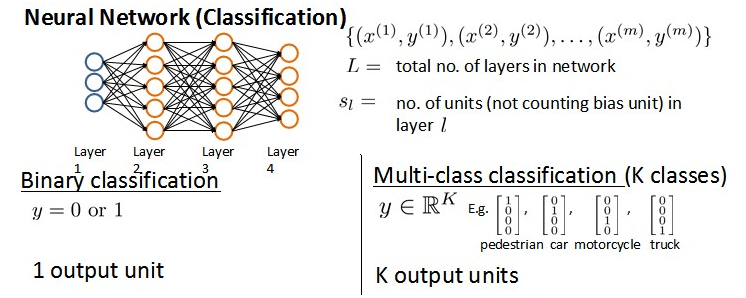

我们回顾逻辑回归问题中我们的代价函数为：

$  J\left(\theta \right)=-\frac{1}{m}\left[\sum_\limits{i=1}^{m}{y}^{(i)}\log{h_\theta({x}^{(i)})}+\left(1-{y}^{(i)}\right)log\left(1-h_\theta\left({x}^{(i)}\right)\right)\right]+\frac{\lambda}{2m}\sum_\limits{j=1}^{n}{\theta_j}^{2}  $

在逻辑回归中，我们只有一个输出变量，又称标量（**scalar**），也只有一个因变量$y$，但是在神经网络中，我们可以有很多输出变量，我们的$h_\theta(x)$是一个维度为$K$的向量，并且我们训练集中的因变量也是同样维度的一个向量，因此我们的代价函数会比逻辑回归更加复杂一些，为：$\newcommand{\subk}[1]{ #1_k }$
$$h_\theta\left(x\right)\in \mathbb{R}^{K}$$ $${\left({h_\theta}\left(x\right)\right)}_{i}={i}^{th} \text{output}$$

$J(\Theta) = -\frac{1}{m} \left[ \sum\limits_{i=1}^{m} \sum\limits_{k=1}^{k} {y_k}^{(i)} \log \subk{(h_\Theta(x^{(i)}))} + \left( 1 - y_k^{(i)} \right) \log \left( 1- \subk{\left( h_\Theta \left( x^{(i)} \right) \right)} \right) \right] + \frac{\lambda}{2m} \sum\limits_{l=1}^{L-1} \sum\limits_{i=1}^{s_l} \sum\limits_{j=1}^{s_{l+1}} \left( \Theta_{ji}^{(l)} \right)^2$

这个看起来复杂很多的代价函数背后的思想还是一样的，我们希望通过代价函数来观察算法预测的结果与真实情况的误差有多大，唯一不同的是，对于每一行特征，我们都会给出$K$个预测，基本上我们可以利用循环，对每一行特征都预测$K$个不同结果，然后在利用循环在$K$个预测中选择可能性最高的一个，将其与$y$中的实际数据进行比较。

正则化的那一项只是排除了每一层$\theta_0$后，每一层的$\theta$ 矩阵的和。最里层的循环$j$循环所有的行（由$s_{l+1}$  层的激活单元数决定），循环$i$则循环所有的列，由该层（$s_l$层）的激活单元数所决定。即：$h_\theta(x)$与真实值之间的距离为每个样本-每个类输出的加和，对参数进行**regularization**的**bias**项处理所有参数的平方和。

#### 梯度下降法

**梯度下降法（Gradient Descent）**是一种用于最小化目标函数的迭代优化算法。核心是沿着目标函数（如损失函数）的负梯度方向逐步调整参数，从而逼近函数的最小值。梯度方向指示了函数增长最快的方向，因此负梯度方向是函数下降最快的方向。

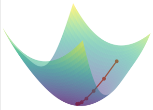

具体来说，我们初始找到函数*f*(*x*1*,x*2)的一个点(*x*1*,x*2)，按下式进行更新：

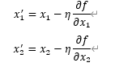

这样就可以沿着负梯度方向，找到一个新的点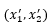，让函数值更小。

这里的η表示每次的更新量，在神经网络的学习过程中，就代表了一次学习的步长（一次学习多少、多大程度去更新参数），称为 **学习率（learning rate）**。学习率需要预先设定好，过大或过小都会导致学习效果不佳。

梯度下降法可以代码实现如下：

```python
def gradient_descent(f, init_x, lr=0.01, step_num=100):
    x = init_x
    x_history = []

    for i in range(step_num):
        x_history.append( x.copy() )

        grad = numerical_gradient(f, x)
        x -= lr * grad

    return x, np.array(x_history)

```

#### SGD

在神经网络的学习过程中，可以使用梯度下降法来更新参数，目标就是减小损失函数的值。

实际操作时，一般会从训练数据中随机选择一个小批量数据（mini-batch），然后用梯度下降法迭代多个轮次（iteration）；这种“对随机选择的数据进行的梯度下降法”，被称作 **随机梯度下降法（stochastic gradient descent，SGD）**。

具体过程如下：

1. 随机选择批数据（mini-batch）

从训练数据中随机选出一部分数据，学习的目标就是要减少这个mini-batch数据的损失函数值。

2. 计算梯度

对当前的各权重参数，计算出梯度的值，负梯度就表示了损失函数减小最多的方向。

3. 更新参数

按照3.4.1节中梯度下降法的公式，对权重参数沿负梯度方向进行微小更新。

4. 重复迭代

重复上面的步骤1）2）3），直到完成预定的总迭代次数。

##### 代码实现

TwoLayerNet类：

```python
from common.functions import *
from common.gradient import numerical_gradient

class TwoLayerNet:

    def __init__(self, input_size, hidden_size, output_size, weight_init_std=0.01):
        # 初始化权重
        self.params = {}
        self.params['W1'] = weight_init_std * np.random.randn(input_size, hidden_size)
        self.params['b1'] = np.zeros(hidden_size)
        self.params['W2'] = weight_init_std * np.random.randn(hidden_size, output_size)
        self.params['b2'] = np.zeros(output_size)

    def predict(self, x):
        W1, W2 = self.params['W1'], self.params['W2']
        b1, b2 = self.params['b1'], self.params['b2']
    
        a1 = np.dot(x, W1) + b1
        z1 = sigmoid(a1)
        a2 = np.dot(z1, W2) + b2
        y = softmax(a2)
        
        return y
        
    # x:输入数据, t:监督数据
    def loss(self, x, t):
        y = self.predict(x)
        
        return cross_entropy_error(y, t)
    
    def accuracy(self, x, t):
        y = self.predict(x)
        y = np.argmax(y, axis=1)
        t = t.reshape(-1)
        
        accuracy = np.sum(y == t) / float(x.shape[0])
        return accuracy
        
    # x:输入数据, t:监督数据
    def numerical_gradient(self, x, t):
        loss_W = lambda W: self.loss(x, t)
        
        grads = {}
        grads['W1'] = numerical_gradient(loss_W, self.params['W1'])
        grads['b1'] = numerical_gradient(loss_W, self.params['b1'])
        grads['W2'] = numerical_gradient(loss_W, self.params['W2'])
        grads['b2'] = numerical_gradient(loss_W, self.params['b2'])
        
        return grads

```

利用SGD对神经网络进行训练学习：

```python
import numpy as np
import matplotlib.pyplot as plt
from two_layer_net import TwoLayerNet

# 读入数据
x_train, x_test, t_train, t_test = get_data ()

network = TwoLayerNet(input_size=784, hidden_size=50, output_size=10)

iters_num = 10000  # 适当设定循环的次数
train_size = x_train.shape[0]
batch_size = 100
learning_rate = 0.1

train_loss_list = []
train_acc_list = []
test_acc_list = []

iter_per_epoch = max(train_size / batch_size, 1)

for i in range(iters_num):
    batch_mask = np.random.choice(train_size, batch_size)
    x_batch = x_train[batch_mask]
    t_batch = t_train[batch_mask]
    
    # 计算梯度
    grad = network.numerical_gradient(x_batch, t_batch)
    
    # 更新参数
    for key in ('W1', 'b1', 'W2', 'b2'):
        network.params[key] -= learning_rate * grad[key]
    
    loss = network.loss(x_batch, t_batch)
    train_loss_list.append(loss)
    
    if i % iter_per_epoch == 0:
        train_acc = network.accuracy(x_train, t_train)
        test_acc = network.accuracy(x_test, t_test)
        train_acc_list.append(train_acc)
        test_acc_list.append(test_acc)
        print("train acc, test acc | " + str(train_acc) + ", " + str(test_acc))

# 绘制图形
markers = {'train': 'o', 'test': 's'}
x = np.arange(len(train_acc_list))
plt.plot(x, train_acc_list, label='train acc')
plt.plot(x, test_acc_list, label='test acc', linestyle='--')
plt.xlabel("epochs")
plt.ylabel("accuracy")
plt.ylim(0, 1.0)
plt.legend(loc='lower right')
plt.show()

```

## 反向传播算法

在计算神经网络预测结果的时候我们采用了一种正向传播方法，我们从第一层开始正向一层一层进行计算，直到最后一层的$h_{\theta}\left(x\right)$。

现在，为了计算代价函数的偏导数$\frac{\partial}{\partial\Theta^{(l)}_{ij}}J\left(\Theta\right)$，我们需要采用一种反向传播算法，也就是首先计算最后一层的误差，然后再一层一层反向求出各层的误差，直到倒数第二层。
以一个例子来说明反向传播算法。

假设我们的训练集只有一个样本$\left({x}^{(1)},{y}^{(1)}\right)$，我们的神经网络是一个四层的神经网络，其中$K=4，S_{L}=4，L=4$：

前向传播算法：

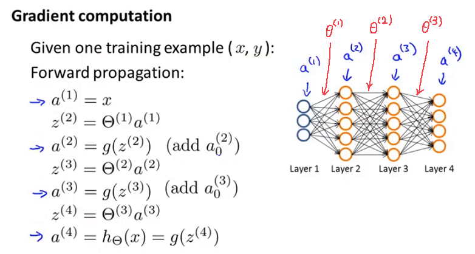

下面的公式推导过程见：<https://blog.csdn.net/qq_29762941/article/details/80343185>

我们从最后一层的误差开始计算，误差是激活单元的预测（${a^{(4)}}$）与实际值（$y^k$）之间的误差，（$k=1:k$）。
我们用$\delta$来表示误差，则：$\delta^{(4)}=a^{(4)}-y$
我们利用这个误差值来计算前一层的误差：$\delta^{(3)}=\left({\Theta^{(3)}}\right)^{T}\delta^{(4)}\ast g'\left(z^{(3)}\right)$
其中 $g'(z^{(3)})$是 $S$ 形函数的导数，$g'(z^{(3)})=a^{(3)}\ast(1-a^{(3)})$。而$(θ^{(3)})^{T}\delta^{(4)}$则是权重导致的误差的和。下一步是继续计算第二层的误差：
$ \delta^{(2)}=(\Theta^{(2)})^{T}\delta^{(3)}\ast g'(z^{(2)})$
因为第一层是输入变量，不存在误差。我们有了所有的误差的表达式后，便可以计算代价函数的偏导数了，假设$λ=0$，即我们不做任何正则化处理时有：
$\frac{\partial}{\partial\Theta_{ij}^{(l)}}J(\Theta)=a_{j}^{(l)} \delta_{i}^{l+1}$

重要的是清楚地知道上面式子中上下标的含义：

$l$ 代表目前所计算的是第几层。

$j$ 代表目前计算层中的激活单元的下标，也将是下一层的第$j$个输入变量的下标。

$i$ 代表下一层中误差单元的下标，是受到权重矩阵中第$i$行影响的下一层中的误差单元的下标。

如果我们考虑正则化处理，并且我们的训练集是一个特征矩阵而非向量。在上面的特殊情况中，我们需要计算每一层的误差单元来计算代价函数的偏导数。在更为一般的情况中，我们同样需要计算每一层的误差单元，但是我们需要为整个训练集计算误差单元，此时的误差单元也是一个矩阵，我们用$\Delta^{(l)}_{ij}$来表示这个误差矩阵。第 $l$  层的第 $i$ 个激活单元受到第 $j$ 个参数影响而导致的误差。

我们的算法表示为：

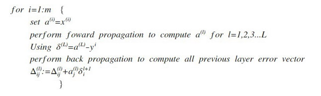

即首先用正向传播方法计算出每一层的激活单元，利用训练集的结果与神经网络预测的结果求出最后一层的误差，然后利用该误差运用反向传播法计算出直至第二层的所有误差。

在求出了$\Delta_{ij}^{(l)}$之后，我们便可以计算代价函数的偏导数了，计算方法如下：
$ D_{ij}^{(l)} :=\frac{1}{m}\Delta_{ij}^{(l)}+\lambda\Theta_{ij}^{(l)}$              ${if}\; j \neq  0$

$ D_{ij}^{(l)} :=\frac{1}{m}\Delta_{ij}^{(l)}$                             ${if}\; j = 0$

在**Octave** 中，如果我们要使用 `fminuc`这样的优化算法来求解求出权重矩阵，我们需要将矩阵首先展开成为向量，在利用算法求出最优解后再重新转换回矩阵。

假设我们有三个权重矩阵，Theta1，Theta2 和 Theta3，尺寸分别为 10\*11，10\*11 和1*11，
下面的代码可以实现这样的转换：

```
thetaVec = [Theta1(:) ; Theta2(:) ; Theta3(:)]

...optimization using functions like fminuc...

Theta1 = reshape(thetaVec(1:110, 10, 11);

Theta2 = reshape(thetaVec(111:220, 10, 11);

Theta1 = reshape(thetaVec(221:231, 1, 11);
```

### 反向传播算法的直观理解

前向传播算法：

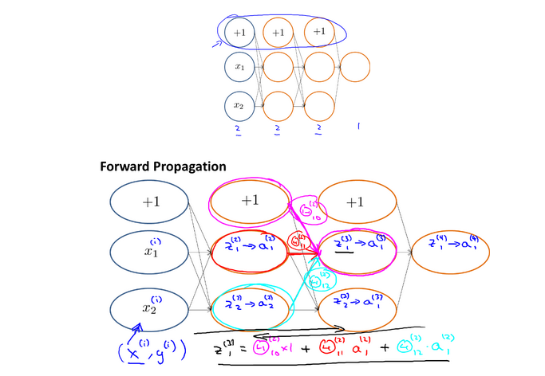

反向传播算法做的是：

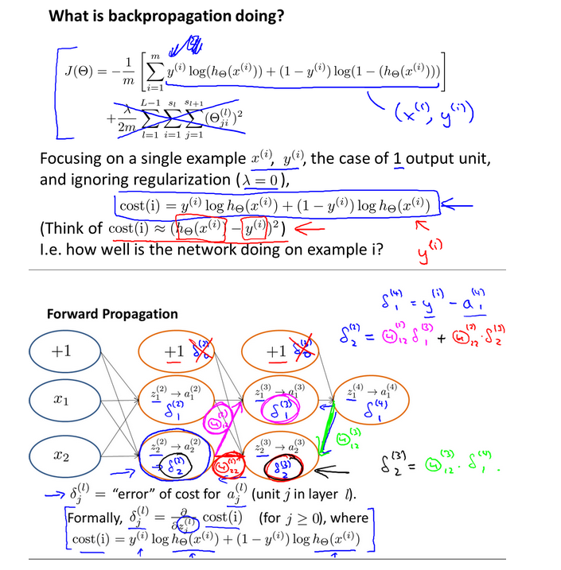

**感悟**：上图中的 $\delta^{(l)}_{j}="error" \ of cost \  for \ a^{(l)}_{j} \ (unit \ j \ in \ layer \ l)$ 理解如下：

$\delta^{(l)}_{j}$ 相当于是第 $l$ 层的第 $j$ 单元中得到的激活项的“误差”，即”正确“的 $a^{(l)}_{j}$ 与计算得到的 $a^{(l)}_{j}$ 的差。

而 $a^{(l)}_{j}=g(z^{(l)})$ ，（g为sigmoid函数）。我们可以想象 $\delta^{(l)}_{j}$ 为函数求导时迈出的那一丁点微分，所以更准确的说 $\delta^{(l)}_{j}=\frac{\partial}{\partial z^{(l)}_{j}}cost(i)$

### 实现注意：展开参数

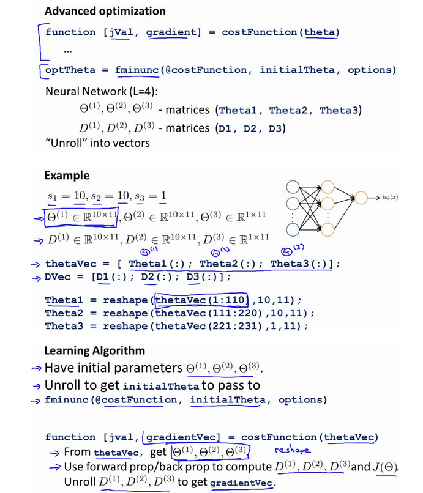

### 反向传播的综合代码实现

对于二层网络TwoLayerNet，隐藏层由一个Affine层和一个ReLU层组成，输出层则由一个Affine层和一个Softmax-with-Loss层组成。

```python
import numpy as np
from common.layers import *
from common.gradient import numerical_gradient
from collections import OrderedDict

class TwoLayerNet:

    def __init__(self, input_size, hidden_size, output_size, weight_init_std = 0.01):
        # 初始化权重
        self.params = {}
        self.params['W1'] = weight_init_std * np.random.randn(input_size, hidden_size)
        self.params['b1'] = np.zeros(hidden_size)
        self.params['W2'] = weight_init_std * np.random.randn(hidden_size, output_size) 
        self.params['b2'] = np.zeros(output_size)

        # 生成层
        self.layers = OrderedDict()
        self.layers['Affine1'] = Affine(self.params['W1'], self.params['b1'])
        self.layers['Relu1'] = Relu()
        self.layers['Affine2'] = Affine(self.params['W2'], self.params['b2'])

        self.lastLayer = SoftmaxWithLoss()
        
    def predict(self, x):
        for layer in self.layers.values():
            x = layer.forward(x)
        
        return x
        
    # x:输入数据, t:监督数据
    def loss(self, x, t):
        y = self.predict(x)
        return self.lastLayer.forward(y, t)
    
    def accuracy(self, x, t):
        y = self.predict(x)
        y = np.argmax(y, axis=1)
        if t.ndim != 1 : t = np.argmax(t, axis=1)
        
        accuracy = np.sum(y == t) / float(x.shape[0])
        return accuracy
        
    # x:输入数据, t:监督数据
    def numerical_gradient(self, x, t):
        loss_W = lambda W: self.loss(x, t)
        
        grads = {}
        grads['W1'] = numerical_gradient(loss_W, self.params['W1'])
        grads['b1'] = numerical_gradient(loss_W, self.params['b1'])
        grads['W2'] = numerical_gradient(loss_W, self.params['W2'])
        grads['b2'] = numerical_gradient(loss_W, self.params['b2'])
        
        return grads
        
    def gradient(self, x, t):
        # forward
        self.loss(x, t)

        # backward
        dout = 1
        dout = self.lastLayer.backward(dout)
        
        layers = list(self.layers.values())
        layers.reverse()
        for layer in layers:
            dout = layer.backward(dout)

        # 设定
        grads = {}
        grads['W1'], grads['b1'] = self.layers['Affine1'].dW, self.layers['Affine1'].db
        grads['W2'], grads['b2'] = self.layers['Affine2'].dW, self.layers['Affine2'].db

        return grads

```

## 梯度检验

当我们对一个较为复杂的模型（例如神经网络）使用梯度下降算法时，可能会存在一些不容易察觉的错误，意味着，虽然代价看上去在不断减小，但最终的结果可能并不是最优解。

为了避免这样的问题，我们采取一种叫做梯度的数值检验（**Numerical Gradient Checking**）方法。这种方法的思想是通过估计梯度值来检验我们计算的导数值是否真的是我们要求的。

对梯度的估计采用的方法是在代价函数上沿着切线的方向选择离两个非常近的点然后计算两个点的平均值用以估计梯度。即对于某个特定的 $\theta$，我们计算出在 $\theta$-$\varepsilon $ 处和 $\theta$+$\varepsilon $ 的代价值（$\varepsilon $是一个非常小的值，通常选取 0.001），然后求两个代价的平均，用以估计在 $\theta$ 处的代价值。

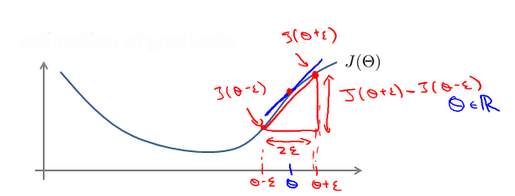

**Octave** 中代码如下：

`gradApprox = (J(theta + eps) – J(theta - eps)) / (2*eps)`

当$\theta$是一个向量时，我们则需要对偏导数进行检验。因为代价函数的偏导数检验只针对一个参数的改变进行检验，下面是一个只针对$\theta_1$进行检验的示例：
$$ \frac{\partial}{\partial\theta_1}=\frac{J\left(\theta_1+\varepsilon_1,\theta_2,\theta_3...\theta_n \right)-J \left( \theta_1-\varepsilon_1,\theta_2,\theta_3...\theta_n \right)}{2\varepsilon} $$

最后我们还需要对通过反向传播方法计算出的偏导数进行检验。

根据上面的算法，计算出的偏导数存储在矩阵 $D_{ij}^{(l)}$ 中。检验时，我们要将该矩阵展开成为向量，同时我们也将 $\theta$ 矩阵展开为向量，我们针对每一个 $\theta$ 都计算一个近似的梯度值，将这些值存储于一个近似梯度矩阵中，最终将得出的这个矩阵同 $D_{ij}^{(l)}$ 进行比较。

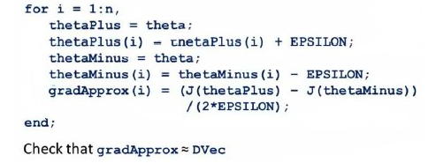

## 随机初始化

何优化算法都需要一些初始的参数。到目前为止我们都是初始所有参数为0，这样的初始方法对于逻辑回归来说是可行的，但是对于神经网络来说是不可行的。如果我们令所有的初始参数都为0，这将意味着我们第二层的所有激活单元都会有相同的值。同理，如果我们初始所有的参数都为一个非0的数，结果也是一样的。

我们通常初始参数为正负ε之间的随机值，假设我们要随机初始一个尺寸为10×11的参数矩阵，代码如下：

`Theta1 = rand(10, 11) * (2*eps) – eps`

