# NLP

## 定义

自然语言处理（Natural Language Processing, NLP），是人工智能领域的一个重要分支。自然语言，指人类日常使用的语言（如中文、英文），NLP 的目标是让计算机“理解”或“使用”这些语言。

## 常见分类

### 文本分类

对整段文本进行判断或归类。

常见应用：情感分析（判断评价是正面还是负面）、垃圾邮件识别、新闻主题分类等。

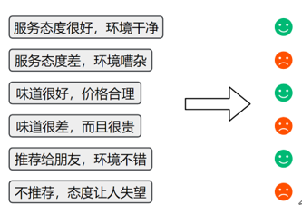

### 序列标注

对一段文本中的每个词或字打上标签。

常见应用：命名实体识别（找出人名、地名、手机号码等）

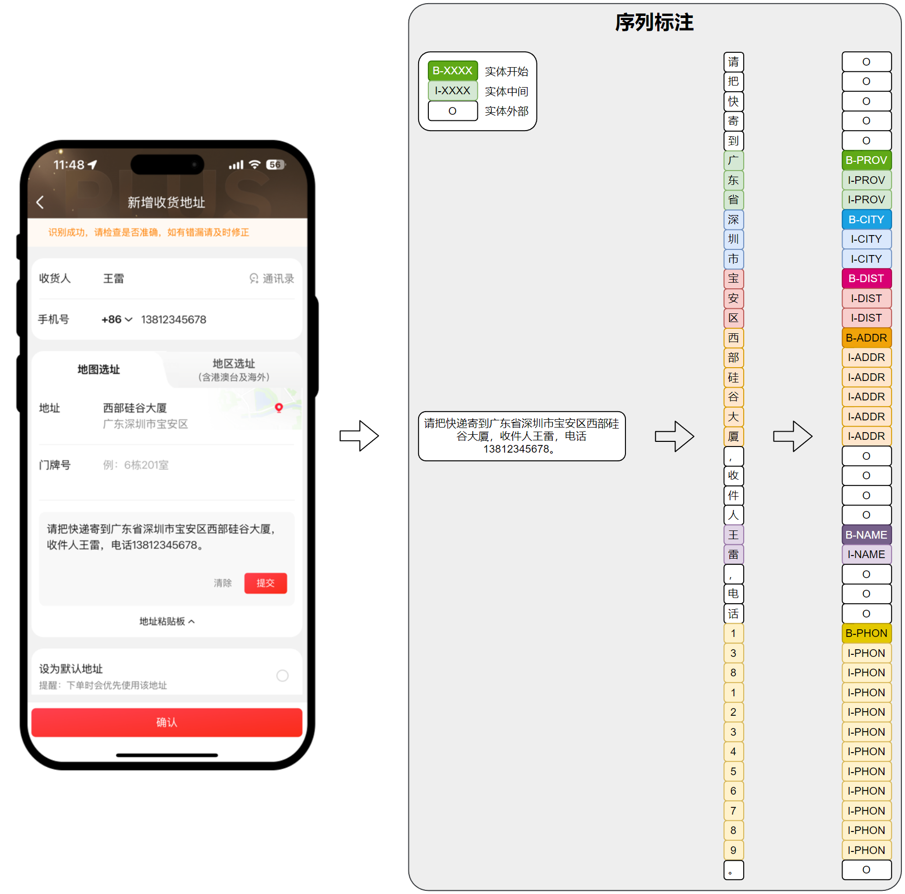

### 文本生成

根据已有内容生成新的自然语言文本。

常见应用：自动写作、摘要生成、智能回复、对话系统等。

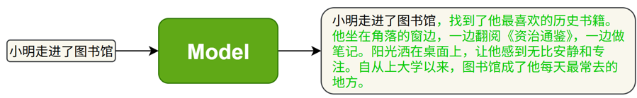

### 信息抽取

从文本中提取出结构化的信息。

常见应用：给出一段文本和一个问题，从中抽取答案。

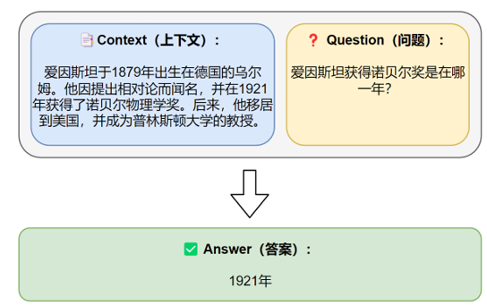

### 文本转换

将一种文本转换为另一种形式。

常见应用：机器翻译，摘要生成等。


## 环境准备

### 创建conda环境

```powershell
--创建项目的虚拟环境
conda create -n nlp python=3.12
--激活该虚拟环境
conda activate nlp
```

### 安装所需依赖

- pytorch：深度学习框架，主要用于模型的构建、训练与推理。

- jieba：高效的中文分词工具，用于对原始中文文本进行分词预处理。

- gensim：用于训练词向量模型（如 Word2Vec、FastText），提升模型对词语语义关系的理解。

- transformers：由 Hugging Face 提供的预训练模型库，用于加载和微调 BERT 等主流模型。

- datasets：Hugging Face 提供的数据处理库，用于高效加载和预处理大规模数据集。

- TensorBoard：可视化工具，用于展示训练过程中的损失函数、准确率等指标变化。

- tqdm：用于显示进度条，帮助实时监控训练与数据处理的进度。
- Jupyter Notebook：交互式开发环境，用于编写、测试和可视化模型代码与实验过程。

#### 安装pytorch

```powershell
pip3 install torch --index-url https://download.pytorch.org/whl/cu128
```

#### 安装其余依赖

```powershell
pip install jieba gensim transformers datasets tensorboard tqdm jupyter
```

## 文本表示

**文本表示**是将自然语言转化为计算机能够理解的数值形式，是绝大多数自然语言处理（NLP）任务的基础步骤。

早期的文本表示方法（如**词袋模型**）通常将整段文本编码为一个向量。这类方法实现简单、计算高效，但存在明显的局限性——表达语序和上下文语义的能力较弱。因此，现代 NLP 技术逐渐引入更加精细和表达力更强的文本表示方法，以更有效地建模语言的结构和含义。

文本表示的第一步通常是**分词**和**词表构建**，如下图所示：

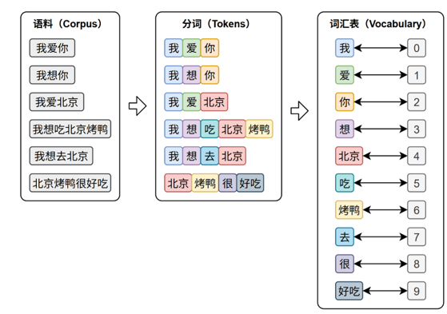

- **分词（Tokenization****）**是将原始文本切分为若干具有独立语义的最小单元（即token）的过程，是所有 NLP 任务的起点。

- **词表（Vocabulary****）**是由语料库构建出的、包含模型可识别 token 的集合。词表中每个token都分配有唯一的 ID，并支持 token 与 ID 之间的双向映射。

在后续训练或预测过程中，模型会首先对输入文本进行分词，再通过词表将每个 token 映射为其对应的 ID。接着，这些 ID 会被输入嵌入层（Embedding Layer），转换为低维稠密的向量表示（即词向量），如下图所示。

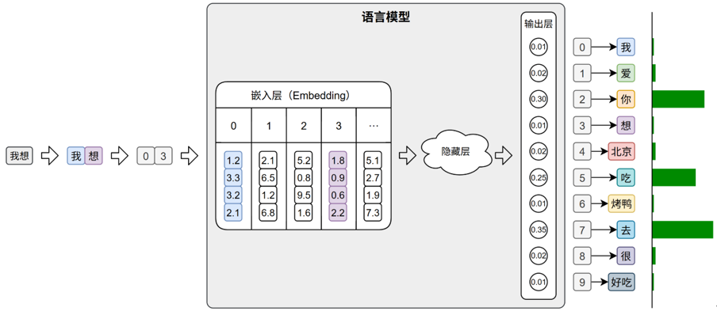

此外，在文本生成任务中，模型的输出层会针对词表中的每个 token 生成一个概率分布，表示其作为下一个词的可能性。系统通常选取具有最大概率的ID，并通过词表查找对应的 token，从而逐步生成最终的输出文本。

### 分词

不同语言由于语言结构、词边界的差异，其分词策略和算法也不尽相同，本节将分别介绍英文与中文中常见的分词方式。

#### 英文分词

按照分词粒度的大小，可分为词级（Word-Level）分词、字符级（Character‑Level）分词和子词级（Subword‑Level）分词。下面逐一介绍

##### 词级分词

词级分词是指将文本按词语进行切分，是最传统、最直观的分词方式。在英文中，空格和标点往往是天然的分隔符。

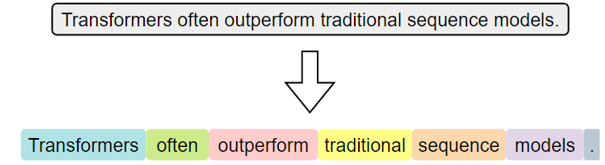

词级分词虽便于理解和实现，但在实际应用中容易出现 OOV（Out‑Of‑Vocabulary，未登录词）问题。所谓 OOV，是指在模型使用阶段，输入文本中出现了不在预先构建词表中的词语，常见的包括网络热词、专有名词、复合词及拼写变体等。由于模型无法识别这些词，通常会将其统一替换为特殊标记（如 <UNK>），从而导致语义信息的丢失，影响模型的理解与预测能力。

##### 字符级分词

字符级分词（Character-level Tokenization）是以单个字符为最小单位进行分词的方法，文本中的每一个字母、数字、标点甚至空格，都会被视作一个独立的 token。

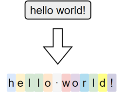

在这种分词方式下，词表仅由所有可能出现的字符组成，因此词表规模非常小，覆盖率极高，几乎不存在 OOV（Out-of-Vocabulary）问题。无论输入中出现什么样的新词或拼写变体，只要字符在词表中，都能被表示出来。

然而，由于单个字符本身语义信息极弱，模型必须依赖更长的上下文来推断词义和结构，这显著增加了建模难度和训练成本。此外，输入序列也会变得更长，影响模型效率。

##### 子词级分词

子词级分词是一种介于词级分词与字符级分词之间的分词方法，它将词语切分为更小的单元——子词（subword），例如词根、前缀、后缀或常见词片段。与词级分词相比，子词分词可以显著缓解OOV问题；与字符级分词相比，它能更好地保留一定的语义结构。

子词分词的基本思想是：即使一个完整的词没有出现在词表中，只要它可以被拆分为词表中存在的子词单元，就可以被模型识别和表示，从而避免整体被替换为<UNK>。

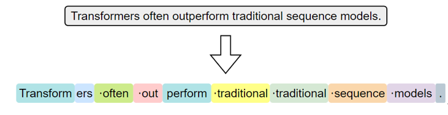

常见的子词分词算法包括 BPE（Byte Pair Encoding）、WordPiece 和 Unigram Language Model。

其中，BPE是最早被广泛应用的子词分词方法。其基本思想是，在训练阶段，首先将语料中的词汇拆分为单个字符，构建初始词表；然后迭代地统计语料中出现频率最高的相邻字符对，将其合并为新的子词单元，并加入词表。这个过程持续进行，直到词表大小达到预设上限。

在分词阶段，BPE 会根据构建好的词表和合并规则对新输入的文本进行处理。具体做法是：将文本拆分为最小单位（如字符或字节），然后按顺序应用训练中学习到的合并规则，逐步合并，直到无法继续。最终得到的就是由子词组成的分词结果。

详细的实现过程可参考Hugging Face提供的一篇[优秀教程](https://hf-mirror.com/learn/llm-course/chapter6/5?fw=pt)。

子词级分词已经成为现代英文 NLP 模型中的主流方法，如 BERT、GPT等模型均采用了基于子词的分词机制。

#### 中文分词

##### 字符级分词

字符级分词是中文处理中最简单的一种方式，即将文本按照单个汉字进行切分，文本中的每一个汉字都被视为一个独立的 token。

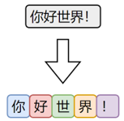

由于汉字本身通常具有独立语义，因此字符级分词在中文中具备天然的可行性。相比英文中的字符分词，中文的字符分词更加“语义友好”。

##### 词级分词

词级分词是将中文文本按照完整词语进行切分的传统方法，切分结果更贴近人类阅读习惯。

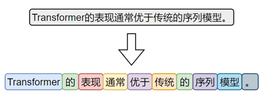

由于中文没有空格等天然词边界，词级分词通常依赖词典、规则或模型来识别词语边界。

##### 子词级分词

虽然中文没有英文中的子词结构（如前缀、后缀、词根等），但子词分词算法（如 BPE）**仍可直接应用于中文**。它们以汉字为基本单位，通过学习语料中高频的字组合（如“自然”、“语言”、“处理”），自动构建子词词表。这种方式无需人工词典，具有较强的适应能力。

在当前主流的中文大模型（如通义千问、DeepSeek）中，子词分词已成为广泛采用的文本切分策略。

#### 分词工具

目前市面上可用于中文分词的工具种类繁多，按照实现方式大致可以分为如下两类：

- 一类是基于**词典或模型**的传统方法，主要以“词”为单位进行切分；

- 另一类是基于**子词建模算法**（如BPE）的方式，从数据中自动学习高频字组合，构建子词词表。

前者的代表工具包括 [**jieba**](https://github.com/fxsjy/jieba)**、**[**HanLP**](https://github.com/hankcs/HanLP)等，这些工具广泛应用于传统 NLP 任务中。 

后者的代表工具包括 [**Hugging Face Tokenizer**](https://github.com/huggingface/tokenizers)**、**[**SentencePiece**](https://github.com/google/sentencepiece)**、**[**tiktoken**](https://github.com/openai/tiktoken)等，常用于大规模预训练语言模型中。

##### jieba分词器

jieba 是中文分词领域中应用广泛的开源工具之一，具有接口简洁、模式灵活、词典可扩展等特点，在各类传统 NLP 任务中依然具备良好的实用价值。

###### 安装

```powershell
pip install jieba
```

###### 分词模式

（1）**精确模式（默认）**

试图将句子最精确地切开，适合文本分析。分词效果如下：


精确模式分词可使用jieba.cut或者jieba.lcut方法，前者返回一个生成器对象，后者返回一个list。具体代码如下：

```python
import jieba

text = "小明毕业于北京大学计算机系"

words_generator = jieba.cut(text)  # 返回一个生成器
for word in words_generator:
    print(word)

words_list = jieba.lcut(text)  # 返回一个列表
print(words_list)

```

（2）**全模式**

把句子中所有的可以成词的词语都扫描出来，分词效果如下：


全模式分词可使用jieba.cut或者jieba.lcut，并将cut_all参数设置为True，具体代码如下：

```python
import jieba

text = "小明毕业于北京大学计算机系"

words_generator = jieba.cut(text, cut_all=True)  # 返回一个生成器
for word in words_generator:
    print(word)

words_list = jieba.lcut(text, cut_all=True)  # 返回一个列表
print(words_list)

```

（3）**搜索引擎模式**

在精确模式基础上，对长词进一步切分，适合用于搜索引擎分词，分词效果如下：


可使用jieba.cut_for_search或者jieba.lcut_for_search，具体代码如下：

```python
import jieba

text = "小明毕业于北京大学计算机系"

words_generator = jieba.cut_for_search(text)  # 返回一个生成器
for word in words_generator:
    print(word)

words_list = jieba.lcut_for_search(text)  # 返回一个列表
print(words_list)

```

（4）**自定义词典**

jieba支持用户自定义词典，以便包含 jieba 词库里没有的词，用于增强特定领域词汇的识别能力。

自定义词典的格式为：一个词占一行，每一行分三部分：词语、词频（可省略，词频决定某个词在分词时的优先级。词频越高被优先切分出来的概率越大）、词性标签（可省略，不影响分词结果），用空格隔开，顺序不可颠倒。例如

云计算

云原生 5

大模型 10 n

可使用jieba.load_userdict(file_name)加载词典文件，也可以使用jieba.add_word(word, freq=None, tag=None)与jieba.del_word(word)动态修改词典。

```python
import jieba

jieba.load_userdict('dict.txt')
words_list = jieba.lcut("随着云计算技术的普及，越来越多企业开始采用云原生架构来部署服务，并借助大模型能力提升智能化水平，实现业务流程的自动化与智能决策。")
print(words_list)

```

### 词表示

在分词完成之后，文本被转换为一系列的 token（词、子词或字符）。然而，这些符号本身对计算机而言是不可计算的。因此，为了让模型能够理解和处理文本，必须将这些 token 转换为计算机可以识别和操作的数值形式，这一步就是所谓的词表示（word representation）。

词表示的发展经历了从稀疏的**one-hot**编码，到稠密的语义化词向量，再到近年来的上下文相关的词表示。不同的词表示方法在表达能力、语义建模、上下文适应性等方面存在显著差异。

#### One-hot编码

最早期的词向量表示方式是 **One-hot** **编码**：它将词汇表中的每个词映射为一个稀疏向量，向量的长度等于整个词表的大小。该词在对应的位置为 1，其他位置为 0。

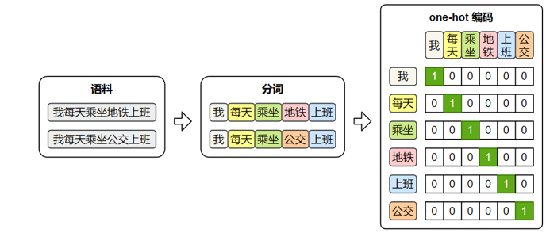

one-hot 虽然实现简单、直观易懂，但它无法体现词与词之间的语义关系，且随着词表规模的扩大，向量维度会迅速膨胀，导致计算效率低下。因此，在实际自然语言处理任务中，one-hot 表示已经很少被直接使用。

#### 语义化词向量

传统的one-hot表示虽然结构简单，但它无法反映词语之间的语义关系，也无法衡量词与词之间的相似度。为了解决这个问题，研究者提出了**Word2Vec**模型，它通过对大规模语料的学习，为每个词生成一个具有语义意义的**稠密向量**表示。这些向量能够在连续空间中表达词与词之间的关系，使得“意思相近”的词在空间中距离更近。

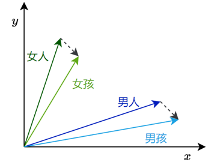

##### Word2Vec概述

Word2Vec的设计理念源自“[**分布假设**](https://en.wikipedia.org/wiki/Distributional_semantics)”——即**一个词的含义由它周围的词决定**。

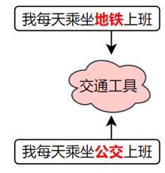

基于这一假设，Word2Vec构建了一个简洁的神经网络模型，通过学习词与上下文之间的关系，自动为每个词生成一个能够反映语义特征的向量表示。

Word2Vec提供了两种典型的模型结构，用于实现对词向量的学习

- **CBOW**（Continuous Bag-of-Words）模型

  输入是一个词的上下文（即前后若干个词），模型的目标是预测中间的目标词。

  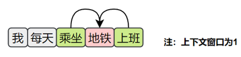

- **Skip-gram** **模型**

​	输入是一个中心词，模型的目标是预测其上下文中的所有词（即前后若干个词）。

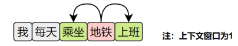

只要按照上述目标训练模型，就能得到语义化的词向量。

##### Word2Vec原理

1. 数据集

Word2Vec 不依赖人工标注，而是直接利用大规模原始文本（如书籍、新闻、网页等）作为数据源，从中自动构造训练样本。

由于两种模型的输入和输出都是词语，因此首先需要对原始文本进行分词，将连续文本转换为 token 序列。

此外，模型无法直接处理文本符号，训练时仍需将词语转换为 one-hot 编码，以便作为模型的输入和输出进行计算。

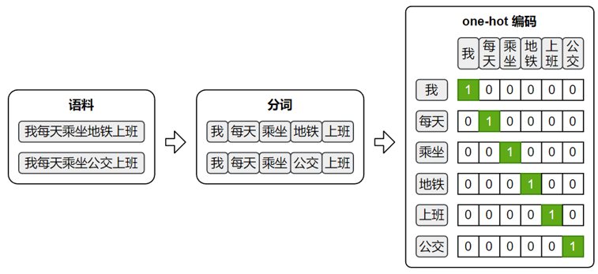

2. Skip-Gram

   2.1. 训练数据集

   Skip-Gram的目标是根据中间词预测上下文，所以其训练样本为：

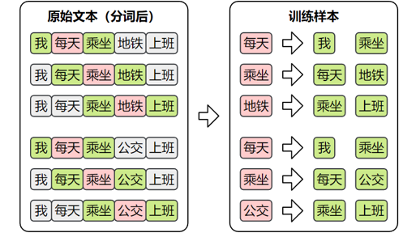

​	2.2. 模型结构

​	Skip-Gram模型结构如下图所示：

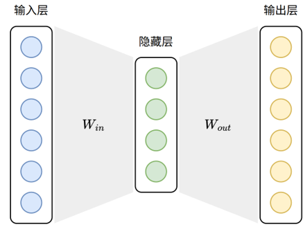

​	Skip-Gram模型损失值的计算图如下图所示：

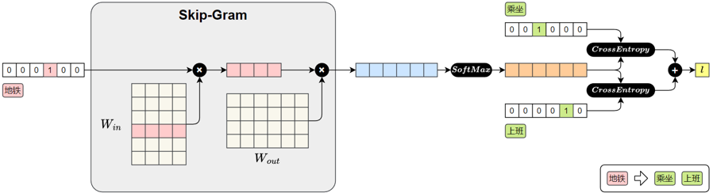

**前向传播过程如下：**

1.输入中心词（地铁）

“地铁”用 one-hot 向量表示

2.查找词向量（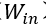)

与参数矩阵  相乘，取出“地铁”对应的词向量。（  实际上就是词向量矩阵，每一行表示一个词的向量）

3.预测上下文

将中心词向量与参数矩阵   相乘，得到对整个词表的预测得分。

4.Softmax 输出

得分通过 Softmax 转为概率分布，表示各词作为上下文的可能性。

5.计算损失

与真实上下文词“乘坐”、“上班”进行比对，计算交叉熵损失并求和，得到总损失。


之后在进行反向传播时，参数矩阵  中的“地铁”对应的词向量就会被更新，模型通过这个过程不断的进行学习，最终便能得到具有语义的词向量。

3. CBOW

​	3.1. 训练样本

​	CBOW的目标是根据上下文预测中间词，所以其训练样本为：

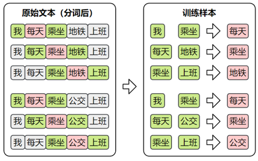

​	3.2. 模型结构

​	CBOW模型的结构如下图所示：

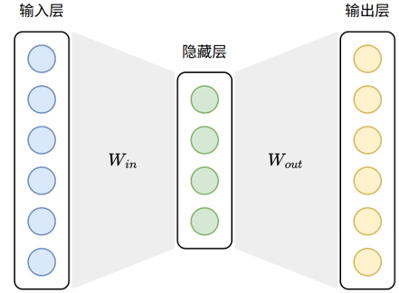

​	CBOW模型损失值的计算图如下图所示：

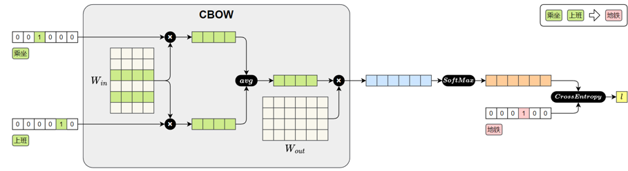

CBOW 模型的前向传播过程如下：

1.输入上下文词（乘坐、上班）

每个词用 one-hot 向量表示。

2.查找词向量（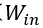)

每个 one-hot 向量与参数矩阵   相乘，查出对应的词向量。

（  实际上就是词向量矩阵，每一行表示一个词的向量）

3.平均上下文向量

将多个上下文词向量取平均，得到一个整体的上下文表示。

4.预测中心词

将平均后的上下文向量与参数矩阵  相乘，得到对整个词表的预测得分。

5.Softmax 输出

将得分输入Softmax，得到每个词作为中心词的概率分布。

6.计算损失

将预测结果与真实中心词“地铁”的one-hot向量进行比对，计算交叉熵损失。

 

之后在进行反向传播时，参数矩阵  中“乘坐”和“上班”对应的词向量就会被更新。模型通过不断训练，逐步优化这些向量，最终便能得到具有语义的词向量。

##### 获取Word2Vec词向量

词向量的获取通常有两种方式：一种是直接使用他人公开发布的词向量，另一种是在特定语料上自行训练。

在实际工作中，无论是加载已有模型还是从零训练，都可借助[Gensim](https://radimrehurek.com/gensim/)来完成，它提供了便捷的接口来加载 Word2Vec 格式的词向量，也支持基于自有语料训练属于自己的词向量模型。

可执行以下命令安装Gensim

```powershell
pip install gensim
```

###### 使用公开词向量

公开的中文词向量，可从https://github.com/Embedding/Chinese-Word-Vectors下载，其提供了基于多个数据集训练得到的词向量。

词向量文件的格式为：第一行记录基本信息，包括两个整数，分别表示总词数和词向量维度。从第二行起，每一行表示一个词及其对应的词向量，格式为：词 + 向量的各个维度值。所有内容通过空格分隔，该格式已成为自然语言处理领域中广泛接受的约定俗成的通用格式。具体格式如下

```tex
<词汇总数> <向量维度>
word1 val11 val12 ... val1N
word2 val21 val22 ... val2N
...
```

可使用[KeyedVectors.load_word2vec_format()](https://radimrehurek.com/gensim/models/keyedvectors.html#gensim.models.keyedvectors.KeyedVectors.load_word2vec_format) 加载上述词向量文件，具体代码如下。

```python
from gensim.models import KeyedVectors

model_path = 'sgns.weibo.word.bz2'
model = KeyedVectors.load_word2vec_format(model_path)

```

上述代码使用的sgns.weibo.word.bz2词向量文件包含195202个词，每个词向量300维。该文件可从该[网址](https://pan.baidu.com/s/1zbuUJEEEpZRNHxZ7Gezzmw)下载，也可直接从课程资料获取。

词向量加载完后，便可使用如下API查询词向量

- 查看词向量维度

  ```python
  print(model.vector_size)
  ```

- 查看某个词的向量

```python
print(model['地铁'])
```

- 查看两个向量的相似度

```python
similarity = model.similarity('地铁', '公交')
print('地铁 vs 公交 相似度：', similarity)

```

model.similarity计算的是两个词向量的余弦相似度，计算公式如下                              

返回值介于[-1,1]。接近1表示高度相似，语义接近接近；接近0表示无明显相关；接近-1方向完全相反，极度不相似。

- 找出与某个词最相似的词

```python
similar_words = model.most_similar(positive=["上班"], topn=5)
print(similar_words)
result = model.most_similar(positive=["爸爸", "女性"], negative=["男性"], topn=3)
print(result)

```

###### 自行训练词向量

（1）**准备语料**

Word2Vec的训练语料需要是已分词的文本序列，格式为：

```python
sentences = [['我', '每天','乘坐', '地铁', '上班'], ['我','每天', '乘坐', '公交', '上班']]
```

（2）**训练模型**

gensim提供了十分方便的训练词向量的API——[Word2Vec](https://radimrehurek.com/gensim/models/word2vec.html)

```python
from gensim.models import Word2Vec

model = Word2Vec(
    sentences,            # 已分词的句子序列
    vector_size=100,      # 词向量维度
    window=5,             # 上下文窗口大小
    min_count=2,          # 最小词频（低于将被忽略）
    sg=1,                 # 1:Skip-Gram，0:CBOW
    workers=4             # 并行训练线程数
)

```

（3）**保存词向量**

```python
model.wv.save_word2vec_format('my_vectors.kv')
```

（4）**加载词向量**

```python
from gensim.models import KeyedVectors

my_model = KeyedVectors.load_word2vec_format('my_vectors.kv')

```

完整案例如下：

数据集来源为[ChineseNLPCorpus](https://github.com/InsaneLife/ChineseNLPCorpus?tab=readme-ov-file#情感观点评论-倾向性分析)，格式CSV，具体结构如下

| **cat**  | **label** | **review**                                       |
| -------- | --------- | ------------------------------------------------ |
| **书籍** | 1         | 感谢于歌先生为大家带来这么精彩的一本好书！       |
| **书籍** | 0         | 这本书纸质不怎样，内容也不怎样。                 |
| **水果** | 1         | 苹果酸甜可口，大小适中，好吃。                   |
| **水果** | 0         | 不是很大，比较甜，不会回购，感觉加运费后不划算。 |

完成代码如下：

```python
import jieba
from gensim.models import Word2Vec, KeyedVectors
import pandas as pd

df = pd.read_csv('online_shopping_10_cats.csv', encoding='utf-8', usecols=['review'])

sentences = [[token for token in jieba.lcut(review) if token.strip() != ''] for review in df["review"]]

model = Word2Vec(
    sentences,  # 已分词的句子序列
    vector_size=100,  # 词向量维度
    window=5,  # 上下文窗口大小
    min_count=2,  # 最小词频（低于将被忽略）
    sg=1,  # 1 = Skip-Gram，0 = CBOW
    workers=4  # 并行训练线程数
)

model.wv.save_word2vec_format('my_vectors.kv')

my_model = KeyedVectors.load_word2vec_format('my_vectors.kv')
print(my_model)

```

##### 应用Word2Vec词向量

训练好的词向量，通常用于初始化下游NLP任务的嵌入层。

在现代深度学习的 NLP 模型中，大多数任务的输入第一层都是嵌入层。本质上，嵌入层就是一个查找表（lookup table）：输入是词在词汇表中的索引；输出是该词对应的向量表示。

嵌入层的参数矩阵可以有两种典型的初始化方式：

- **随机初始化**

模型训练开始时，嵌入向量是随机生成的，模型会通过反向传播逐步学习每个词的表示。

- **使用预训练词向量初始化**

加载训练好的词向量（如 Word2Vec）到嵌入层中作为初始参数，这样可以为模型注入丰富的语言知识，尤其在低资源任务中优势明显。并且，加载预训练词向量后，可选择是否让嵌入层继续参与训练。

下面以PyTorch为例，演示如何使用预训练词向量初始化Embedding层

核心API为[nn.Embedding.from_pretrained](https://pytorch.org/docs/stable/generated/torch.nn.Embedding.html#torch.nn.Embedding.from_pretrained)

```python
embedding_layer = nn.Embedding.from_pretrained(
    embedding_matrix, # 词向量矩阵，形状为(num_embeddigns,embedding_dim)
    freeze=False  # 是否冻结词向量
)

```

以下是完整案例

```python
import torch
import torch.nn as nn
from gensim.models import KeyedVectors

# 1. 加载预训练的 Word2Vec 模型
word_vectors = KeyedVectors.load_word2vec_format("my_vectors.kv")

# 2. 构建词表和词向量矩阵
word2index = word_vectors.key_to_index  # 词到索引的映射
embedding_dim = word_vectors.vector_size  # 词语向量维度
num_embeddings = len(word2index)  # 词表大小

embedding_matrix = torch.zeros(num_embeddings, embedding_dim)  # 构造词向量矩阵,形状为(词表大小,词向量维度大小)
for word, idx in word2index.items():
    embedding_matrix[idx] = torch.tensor(word_vectors[word])

# 3. 构建 PyTorch 的嵌入层
embedding_layer = nn.Embedding.from_pretrained(
    embedding_matrix, # 词向量矩阵，形状为(num_embeddigns,embedding_dim)
    freeze=False  # 是否冻结词向量
)

# 4. 示例：将词索引转换为向量
input_words = ["我", "喜欢", "乘坐", "地铁"]  # 分词后的句子
input_indices = [word2index[word] for word in input_words]  # token转为索引
input_tensor = torch.tensor([input_indices])  # 构造嵌入层输入张量

# 5. 查询嵌入（即词向量查找）
output = embedding_layer(input_tensor)  # 通过嵌入层查找预训练词向量

print(output.shape)  # 例如 torch.Size([1, 4, 100])

```

#### 上下文相关词表示

虽然像Word2Vec这样的模型已经能够为词语提供具有语义的向量表示，但是它只为每个词分配一个**固定的向量表示**，不论它在句中出现的语境如何。这种表示被称为**静态词向量（****static embeddings****）**。

然而，语言的表达极其灵活，一个词在不同上下文中可能有完全不同的含义。例如：


这时，使用同一个静态词向量去表示“苹果”，显然无法区分这两种语义。这就推动了上下文相关的词表示的发展。

上下文相关词表示（Contextual Word Representations），是指词语的向量表示会根据它所在的句子上下文动态变化，从而更好地捕捉其语义。一个具有代表性的模型是——[ELMo](https://arxiv.org/abs/1802.05365)。

该模型全称为 Embeddings from Language Models，发表于2018年2月。其基于LSTM 语言模型，使用上下文**动态**生成每个词的表示，每个词的向量由其前文和后文共同决定，是第一个被广泛应用于下游任务的上下文词向量模型。

## 传统序列模型

### RNN

#### 概述

在自然语言中，词语的顺序对于理解句子的含义至关重要。虽然词向量能够表示词语的语义，但它本身并不包含词语之间的顺序信息。

为了解决这一问题，研究者提出RNN（Recurrent Neural Network，循环神经网络）。

RNN 会逐个读取句子中的词语，并在每一步结合当前词和前面的上下文信息，不断更新对句子的理解。通过这种机制，RNN 能够持续建模上下文，从而更准确地把握句子的整体语义。因此RNN曾是序列建模领域的主流模型，被广泛应用于各类NLP任务。

**说明：**

随着技术的发展，RNN已经逐渐被结构更灵活、计算效率更高的Transformer 模型所取代，后者已经成为当前自然语言处理的主流方法。

尽管如此，RNN 仍然具有重要的学习价值。它所体现的“循环建模上下文”的思想，不仅为 LSTM 和 GRU 等改进模型奠定了基础，也有助于我们更好地理解 Transformer 等更复杂的架构。

#### 基础结构

RNN（循环神经网络）的核心结构是一个具有循环连接的隐藏层，它以时间步（time step）为单位，依次处理输入序列中的每个 token。

在每个时间步，RNN 接收当前 token 的向量和上一个时间步的隐藏状态（即隐藏层的输出），计算并生成新的隐藏状态，并将其传递到下一时间步。

具体结构如下图所示

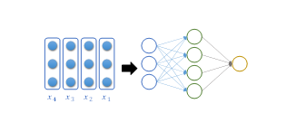

其中隐藏层的计算公式为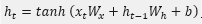,计算细节如下图所示：

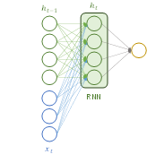

**说明：**

前面详细展示了基础 RNN 的内部结构，但 RNN还存在更复杂的结构形式。为了更清晰地展示这些结构的连接方式，接下来将使用简化的示意图来表示，省略内部细节，突出整体结构。

基础RNN的示意图如下:

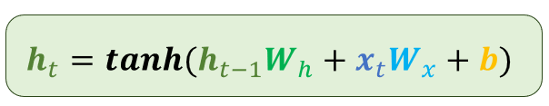

#### 多层结构

为了让模型捕捉更复杂的语言特征，可以将多个 RNN 层按层次堆叠起来，使不同层学习不同层次的语义信息。

这种设计的核心假设是：底层网络更容易捕捉局部模式（如词组、短语），而高层网络则能学习更抽象的语义信息（如句子主题或语境）。

多层RNN结构中，每一层的输出序列会作为下一层的输入序列，最底层RNN接收原始输入序列，顶层 RNN的输出作为最终结果用于后续任务。

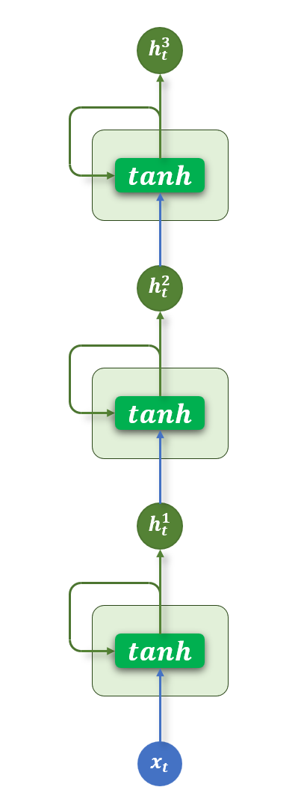

#### 双向结构

基础的 RNN 在每个时间步只输出一个隐藏状态，该状态仅包含来自上文的信息，而无法利用当前词之后的下文。

对于一些任务而言，这是一个明显的限制。比如在序列标注任务中，模型需要为每个 token 预测一个标签，如果只能参考前文信息，往往难以做出准确判断。

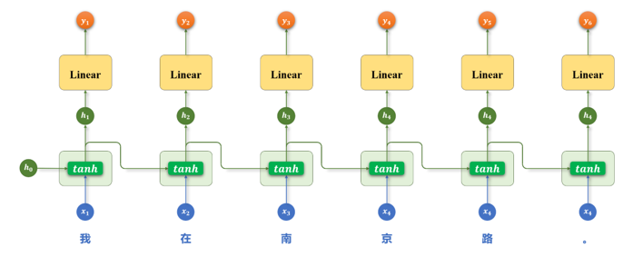

而使用双向 RNN（Bidirectional RNN），模型可以在每个时间步同时利用前文和后文的信息，从而获得更全面的上下文表示，有助于提升序列标注等任务的预测效果。

双向RNN同时使用两层 RNN：

正向 RNN：按照时间顺序（从前到后）处理序列；

反向 RNN：按照逆时间顺序（从后到前）处理序列。

每个时间步的输出，是正向和反向隐藏状态的组合（例如拼接或求和）。具体结构如下图所示

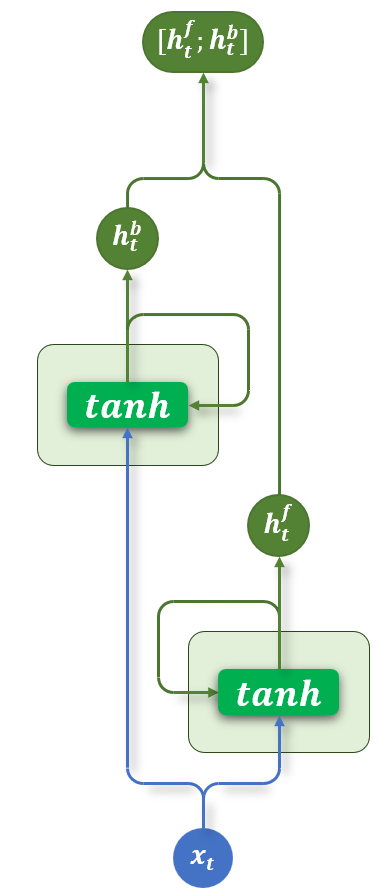

#### 多层+双向结构

多层结构和双向结构还可组合使用，每层都是一个双向RNN，如下图所示

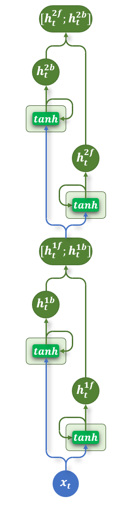

#### API使用

PyTorch 提供了 [torch.nn.RNN](https://pytorch.org/docs/stable/generated/torch.nn.RNN.html) 模块用于构建循环神经网络（Recurrent Neural Network, RNN）。该模块支持单层或多层结构，也可通过设置参数启用双向 RNN（bidirectional），适用于处理序列建模相关任务。

##### 参数说明

构造RNN层所需的参数如下：

```python
torch.nn.RNN(
    input_size,
    hidden_size,
    num_layers=1,
    nonlinearity="tanh",
    bias=True,
    batch_first=False,
    dropout=0.0,
    bidirectional=False,
    device=None,
    dtype=None,
)
```

各参数含义如下:

| **参数名**        | **类型**             | **说明**                                                     |
| ----------------- | -------------------- | ------------------------------------------------------------ |
| **input_size**    | int                  | 每个时间步输入特征的维度（词向量维度）                       |
| **hidden_size**   | int                  | 隐藏状态的维度                                               |
| **num_layers**    | int                  | RNN 层数，默认为 1                                           |
| **nonlinearity**  | str                  | 激活函数，'tanh'（默认）或 'relu'                            |
| **bias**          | bool                 | 是否使用偏置项，默认 True                                    |
| **batch_first**   | bool                 | 输入张量是否是 (batch, seq, feature)，默认 False 表示  (seq, batch, feature) |
| **dropout**       | float                | 除最后一层外，其余层之间的 dropout  概率                     |
| **bidirectional** | bool                 | 是否为双向 RNN，默认 False                                   |
| **device**        | torch.device  or str | 模块的初始化设备，如 'cuda',  'cpu'                          |
| **dtype**         | torch.dtype          | 模块初始化时的默认数据类型，如torch.float32                  |

##### 输入输出

示例代码如下

```python
rnn = torch.nn.RNN()
output, h_n = rnn(input, h_0)

```

输入输出内容如下

| **输**  **入** | **input**                                                    | 输入序列，形状为(seq_len, batch_size, input_size)，如果 batch_first=True，则为 (batch_size, seq_len,  input_size) |
| -------------- | ------------------------------------------------------------ | ------------------------------------------------------------ |
| **h_0**        | 可选，初始隐藏状态，形状为 (num_layers × num_directions,  batch_size, hidden_size) |                                                              |
| **输**  **出** | **output**                                                   | RNN层的输出，包含最后一层每个时间步的隐藏状态，形状为  (seq_len, batch_size,  num_directions × hidden_size )，如果如果 batch_first=True，则为(batch_size,  seq_len, num_directions × hidden_size ) |
| **h_n**        | 最后一个时间步的隐藏状态，包含每一层的每个方向，形状为 (num_layers ×  num_directions, batch_size, hidden_size) |                                                              |

输入输出形状如下

- **单层单向**

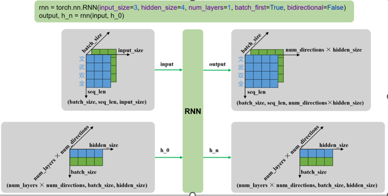

- **多层单向**

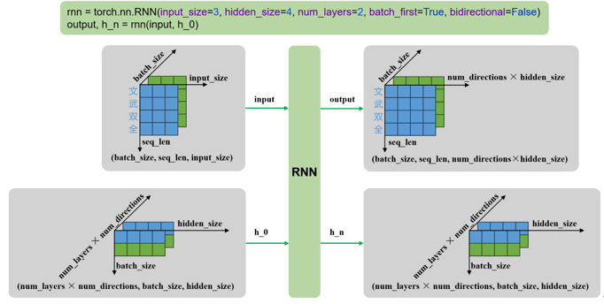

- **单层双向**

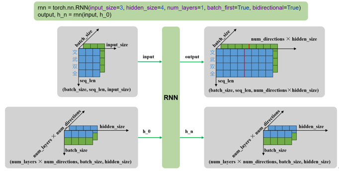

- **多层双向**

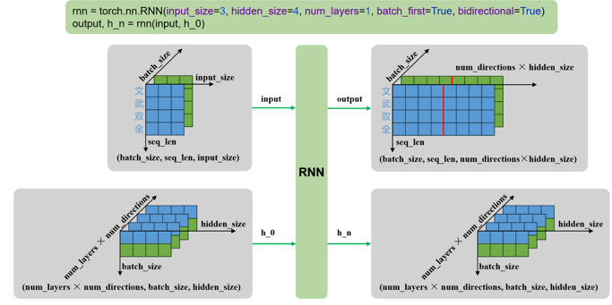

#### 案例实操（智能输入法）

##### 需求说明

本案例旨在实现一个用于手机输入法的**智能词语联想模型**。
 具体需求为：根据用户当前已输入的文本内容，预测下一个可能输入的词语，要求返回概率最高的 5 个候选词供用户选择。

例如：向模型输入“自然语言”，模型输出[“处理”、“理解”、“的”、“描述”、“生成”] ，如下图所示


##### 需求分析

1）数据集处理

在本任务中，模型需要根据用户已输入的文本预测下一个可能输入的词语，因此训练数据应具备自然语言上下文连续性和贴近真实使用场景的特点。

可选数据来源包括：

- 用户真实输入内容：如聊天记录、搜索历史、输入法日志等。这类数据最能反映真实输入场景，有助于模型学习用户输入习惯和上下文联想模式。

- 开放领域对话语料：如论坛回复、社交平台评论、闲聊对话等。这类语料具有较强的口语化特征，能够提升模型在真实输入场景中的泛化能力。

本任务使用的数据集为https://huggingface.co/datasets/Jax-dan/HundredCV-Chat

为了构造适用于“下一词预测”任务的训练样本，首先需要对原始语料进行分词。随后，采用**滑动窗口**的方式，从分词后的序列中提取连续的上下文片段，并以每个窗口的下一个词作为预测目标，构成输入-输出对，如下图所示

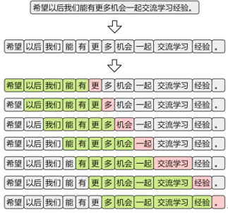

2）模型结构设计

本任务采用基于循环神经网络（RNN）的语言模型结构来实现“下一词预测”功能。模型整体由以下三个主要部分组成：

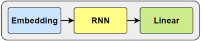

- **嵌入层（Embedding****）**

将输入的词或字索引映射为稠密向量表示，便于后续神经网络处理。

- **循环神经网络层（RNN****）**

用于建模输入序列的上下文信息，输出最后一个时间步的隐藏状态作为上下文表示。

- **输出层（Linear****）**

将隐藏状态映射到词表大小的维度，生成对下一个词的概率预测。

3）训练方案

- **损失函数**

下一个词的预测本质为多分类问题，所以损失函数采用 CrossEntropyLoss，其结合了softmax和交叉熵计算。

- **优化器**

使用 Adam 优化器，具有较强的收敛能力和稳定性。

##### 需求实现

1）项目结构

项目结构如下图所示

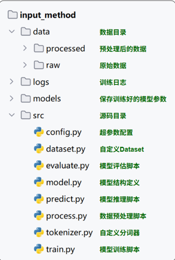

2）完整代码

（1）**数据预处理**

本模块负责将原始数据进行清洗、分词、编码与划分，最终生成模型可直接读取的标准格式数据集，并保存到jsonl文件中，如下图所示

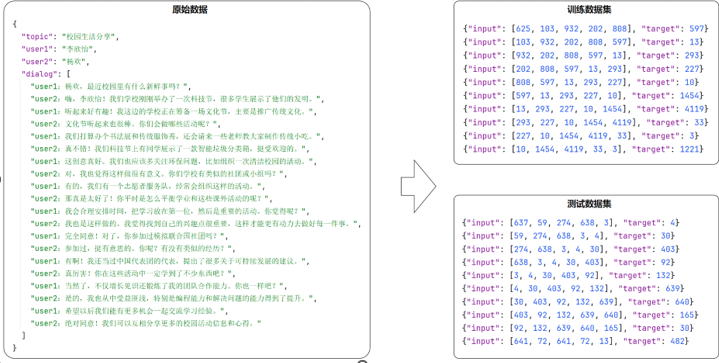

具体代码如下：

```python
# process.py

import time

import torch
from torch import nn
from torch.utils.tensorboard import SummaryWriter
from tqdm import tqdm

from dataset import get_dataloader
from model import InputMethodModel
from tokenizer import JiebaTokenizer
import config

def train_one_epoch(model, dataloader, loss_function, optimizer, device):
    """
    训练一个 epoch。

    :param model: 输入法模型。
    :param dataloader: 数据加载器。
    :param loss_function: 损失函数。
    :param optimizer: 优化器。
    :param device: 设备。
    :return: 平均损失。
    """
    total_loss = 0
    model.train()

    for inputs, targets in tqdm(dataloader, desc='训练'):
        # 将数据移到设备
        inputs, targets = inputs.to(device), targets.to(device)

        optimizer.zero_grad()

        # 前向传播
        outputs = model(inputs)

        # 计算损失
        loss = loss_function(outputs, targets)

        # 反向传播
        loss.backward()

        # 更新参数
        optimizer.step()

        total_loss += loss.item()

    avg_loss = total_loss / len(dataloader)
    return avg_loss

def train():
    """
    模型训练主函数。
    """
    device = torch.device('cuda' if torch.cuda.is_available() else 'cpu')
    print('设备:', device)

    # 获取数据加载器
    dataloader = get_dataloader()

    # 加载 tokenizer 和模型
    tokenizer = JiebaTokenizer.from_vocab(config.PROCESSED_DATA_DIR / 'vocab.txt')
    model = InputMethodModel(vocab_size=tokenizer.vocab_size).to(device)

    loss_function = nn.CrossEntropyLoss()
    optimizer = torch.optim.Adam(model.parameters(), lr=config.LEARNING_RATE)

    # TensorBoard 日志
    writer = SummaryWriter(log_dir=config.LOG_DIR / time.strftime('%Y-%m-%d_%H-%M-%S'))

    best_loss = float('inf')

    for epoch in range(1, config.EPOCHS + 1):
        print(f'========== Epoch: {epoch} ==========')

        # 训练一个 epoch
        avg_loss = train_one_epoch(model, dataloader, loss_function, optimizer, device)
        print(f'Loss: {avg_loss:.4f}')

        # 记录到 TensorBoard
        writer.add_scalar('Loss/train', avg_loss, epoch)

        # 保存最优模型
        if avg_loss < best_loss:
            best_loss = avg_loss
            torch.save(model.state_dict(), config.MODELS_DIR / 'model.pt')
            print('模型保存成功！')

if __name__ == '__main__':
    train()

```

（2）自定义分词器

本模块负责分词、词表构建等功能。

```python
# tokenizer.py

import jieba
from tqdm import tqdm

jieba.setLogLevel(jieba.logging.WARNING)

class JiebaTokenizer:
    """
    基于 jieba 的分词器，用于分词、编码和词表管理。
    """

    unk_token = '<unk>'

    @staticmethod
    def tokenize(sentence):
        """
        对句子进行分词。

        :param sentence: 输入句子。
        :return: 分词后的 token 列表。
        """
        # 调用 jieba 分词
        return jieba.lcut(sentence)

    @classmethod
    def build_vocab(cls, sentences, vocab_file):
        """
        构建词表并保存到文件。

        :param sentences: 句子列表。
        :param vocab_file: 保存词表的文件路径。
        """
        unique_words = set()
        for sentence in tqdm(sentences, desc='分词'):
            # 收集所有唯一词
            for word in cls.tokenize(sentence):
                unique_words.add(word)

        # 将 <unk> 放在词表首位
        vocab_list = [cls.unk_token] + list(unique_words)

        # 保存词表到文件
        with open(vocab_file, 'w', encoding='utf-8') as f:
            for word in vocab_list:
                f.write(word + '\n')

    @classmethod
    def from_vocab(cls, vocab_file):
        """
        从文件加载词表。

        :param vocab_file: 词表文件路径。
        :return: JiebaTokenizer 实例。
        """
        with open(vocab_file, 'r', encoding='utf-8') as f:
            vocab_list = [line.strip() for line in f.readlines()]
        return cls(vocab_list)

    def __init__(self, vocab_list):
        """
        初始化 tokenizer。

        :param vocab_list: 词表列表。
        """
        self.vocab_list = vocab_list
        self.vocab_size = len(vocab_list)
        # 建立词到索引映射
        self.word2index = {word: index for index, word in enumerate(vocab_list)}
        # 建立索引到词的映射
        self.index2word = {index: word for index, word in enumerate(vocab_list)}
        # 获取未知词索引
        self.unk_token_index = self.word2index[self.unk_token]

    def encode(self, sentence):
        """
        将句子编码为索引列表。

        :param sentence: 输入句子。
        :return: 索引列表。
        """
        tokens = self.tokenize(sentence)
        # 将 token 转为索引，未知词用 unk 索引替代
        return [self.word2index.get(token, self.unk_token_index) for token in tokens]

```

（3）自定义数据集

```python
# dataset.py

import torch
from torch.utils.data import Dataset, DataLoader
import pandas as pd

import config

class InputMethodDataset(Dataset):
    """
    输入法数据集类，用于加载 JSONL 文件并生成张量。
    """

    def __init__(self, file_path):
        """
        初始化数据集。

        :param file_path: 数据文件路径（JSONL 格式）。
        """
        self.data = pd.read_json(file_path, lines=True).to_dict(orient='records')

    def __len__(self):
        """
        获取数据集样本数量。

        :return: 样本数量。
        """
        return len(self.data)

    def __getitem__(self, index):
        """
        获取指定索引的数据样本。

        :param index: 数据索引。
        :return: (input_tensor, target_tensor)
        """
        input_tensor = torch.tensor(self.data[index]['input'], dtype=torch.long)
        target_tensor = torch.tensor(self.data[index]['target'], dtype=torch.long)
        return input_tensor, target_tensor

def get_dataloader(train=True):
    """
    获取数据加载器。

    :param train: 是否加载训练集（True 加载训练集，False 加载测试集）。
    :return: DataLoader 对象。
    """
    file_name = 'indexed_train.jsonl' if train else 'indexed_test.jsonl'
    dataset = InputMethodDataset(config.PROCESSED_DATA_DIR / file_name)
    return DataLoader(dataset, batch_size=config.BATCH_SIZE, shuffle=True)

if __name__ == '__main__':
    dataloader = get_dataloader()
    for input_tensor, target_tensor in dataloader:
        print(input_tensor.shape, target_tensor.shape)
        break

```

（4）模型定义

```python
# model.py

import torch
from torch import nn
from torchinfo import summary

import config

class InputMethodModel(nn.Module):
    """
    输入法预测模型，基于 RNN 的序列模型。
    """

    def __init__(self, vocab_size):
        """
        初始化模型。

        :param vocab_size: 词表大小。
        """
        super().__init__()
        # 嵌入层：将 token 索引映射为稠密向量
        self.embedding = nn.Embedding(num_embeddings=vocab_size, embedding_dim=config.EMBEDDING_DIM)
        # RNN：处理序列数据，提取上下文特征
        self.rnn = nn.RNN(
            input_size=config.EMBEDDING_DIM,
            hidden_size=config.HIDDEN_SIZE,
            batch_first=True
        )
        # 全连接层：将隐藏状态映射到词表大小的概率分布
        self.linear = nn.Linear(in_features=config.HIDDEN_SIZE, out_features=vocab_size)

    def forward(self, x):
        """
        前向传播。

        :param x: 输入张量，形状 (batch_size, seq_len)。
        :return: 模型输出，形状 (batch_size, vocab_size)。
        """
        # 嵌入层处理输入序列
        embed = self.embedding(x)  # (batch_size, seq_len, embedding_dim)

        # RNN 处理嵌入向量序列
        output, _ = self.rnn(embed)  # (batch_size, seq_len, hidden_size)

        # 取最后一个时间步的输出进行分类
        result = self.linear(output[:, -1, :])  # (batch_size, vocab_size)

        return result

if __name__ == '__main__':
    model = InputMethodModel(vocab_size=20000).to('cuda')

    # 创建随机 dummy 输入用于展示模型结构
    dummy_input = torch.randint(
        low=0,
        high=20000,
        size=(config.BATCH_SIZE, config.SEQ_LEN),
        dtype=torch.long,
        device='cuda'
    )

    # 打印模型摘要
    summary(model, input_data=dummy_input)

```

（5）模型训练

```python
# train.py

import time

import torch
from torch import nn
from torch.utils.tensorboard import SummaryWriter
from tqdm import tqdm

from dataset import get_dataloader
from model import InputMethodModel
from tokenizer import JiebaTokenizer
import config

def train_one_epoch(model, dataloader, loss_function, optimizer, device):
    """
    训练一个 epoch。

    :param model: 输入法模型。
    :param dataloader: 数据加载器。
    :param loss_function: 损失函数。
    :param optimizer: 优化器。
    :param device: 设备。
    :return: 平均损失。
    """
    total_loss = 0
    model.train()

    for inputs, targets in tqdm(dataloader, desc='训练'):
        # 将数据移到设备
        inputs, targets = inputs.to(device), targets.to(device)

        optimizer.zero_grad()

        # 前向传播
        outputs = model(inputs)

        # 计算损失
        loss = loss_function(outputs, targets)

        # 反向传播
        loss.backward()

        # 更新参数
        optimizer.step()

        total_loss += loss.item()

    avg_loss = total_loss / len(dataloader)
    return avg_loss

def train():
    """
    模型训练主函数。
    """
    device = torch.device('cuda' if torch.cuda.is_available() else 'cpu')
    print('设备:', device)

    # 获取数据加载器
    dataloader = get_dataloader()

    # 加载 tokenizer 和模型
    tokenizer = JiebaTokenizer.from_vocab(config.PROCESSED_DATA_DIR / 'vocab.txt')
    model = InputMethodModel(vocab_size=tokenizer.vocab_size).to(device)

    loss_function = nn.CrossEntropyLoss()
    optimizer = torch.optim.Adam(model.parameters(), lr=config.LEARNING_RATE)

    # TensorBoard 日志
    writer = SummaryWriter(log_dir=config.LOG_DIR / time.strftime('%Y-%m-%d_%H-%M-%S'))

    best_loss = float('inf')

    for epoch in range(1, config.EPOCHS + 1):
        print(f'========== Epoch: {epoch} ==========')

        # 训练一个 epoch
        avg_loss = train_one_epoch(model, dataloader, loss_function, optimizer, device)
        print(f'Loss: {avg_loss:.4f}')

        # 记录到 TensorBoard
        writer.add_scalar('Loss/train', avg_loss, epoch)

        # 保存最优模型
        if avg_loss < best_loss:
            best_loss = avg_loss
            torch.save(model.state_dict(), config.MODELS_DIR / 'model.pt')
            print('模型保存成功！')

if __name__ == '__main__':
    train()

```

（6）模型预测

本模块用于展示模型预测效果，具体效果如下：

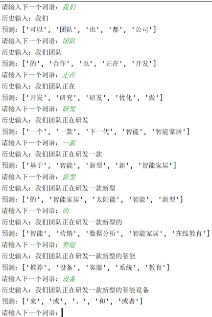

具体代码如下：

```python
# predict.py

import torch
from model import InputMethodModel
from tokenizer import JiebaTokenizer
import config

def predict_batch(input_tensor, model):
    """
    对一个 batch 的输入进行预测。

    :param input_tensor: 输入张量，形状 (batch_size, seq_len)。
    :param model: 输入法模型。
    :return: 每个样本 top-5 的索引列表。
    """
    model.eval()
    with torch.no_grad():
        # 前向传播获取输出 logits
        output = model(input_tensor)  # (batch_size, vocab_size)

        # 选取 top-5 概率最高的 token 索引
        predict_ids = torch.topk(output, k=5, dim=-1).indices  # (batch_size, 5)

    return predict_ids.tolist()

def predict(text, model, tokenizer, device):
    """
    对单条文本进行预测。

    :param text: 用户输入文本。
    :param model: 输入法模型。
    :param tokenizer: 分词器。
    :param device: 设备。
    :return: top-5 预测结果词汇列表。
    """
    # 编码文本为 token 索引
    input_ids = tokenizer.encode(text)

    # 转换为张量并移动到设备
    input_tensor = torch.tensor([input_ids], dtype=torch.long, device=device)

    # 调用 batch 预测
    topk_ids = predict_batch(input_tensor, model)[0]

    # 索引映射回词语
    return [tokenizer.index2word[topk_id] for topk_id in topk_ids]

def run_predict():
    """
    启动预测交互程序。
    """
    device = torch.device('cuda' if torch.cuda.is_available() else 'cpu')

    # 加载 tokenizer
    tokenizer = JiebaTokenizer.from_vocab(config.PROCESSED_DATA_DIR / 'vocab.txt')

    # 创建并加载模型
    model = InputMethodModel(vocab_size=tokenizer.vocab_size).to(device)
    model.load_state_dict(torch.load(config.MODELS_DIR / 'model.pt'))

    print('请输入词语：（输入q或者quit退出系统）')

    text = ''
    while True:
        user_input = input('> ')
        if user_input in ['q', 'quit']:
            print('感谢使用！')
            break

        if not user_input:
            print('请输入词语！')
            continue

        # 更新历史输入
        text += user_input
        print('历史输入：', text)

        # 获取预测结果
        topk_tokens = predict(text, model, tokenizer, device)
        print('预测结果：', topk_tokens)

if __name__ == '__main__':
run_predict()

```

（7）模型评估

本模块用于评估模型效果，评估指标为Top-1准确率和Top-5准确率。

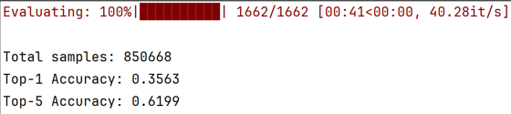

具体代码如下：

```python
# evaluate.py

import torch
from tqdm import tqdm

from tokenizer import JiebaTokenizer
import config
from model import InputMethodModel
from dataset import get_dataloader
from predict import predict_batch

def evaluate(model, dataloader, device):
    """
    评估模型。

    :param model: 输入法模型。
    :param dataloader: 数据加载器。
    :param device: 设备。
    :return: (top1_acc, topk_acc)
    """
    total_count = 0
    top1_correct = 0
    topk_correct = 0

    model.eval()
    for inputs, targets in tqdm(dataloader, desc='评估'):
        inputs = inputs.to(device)
        targets = targets.tolist()

        # 获取 top-5 预测结果
        predicted_ids = predict_batch(inputs, model)

        # 统计 top-1 和 top-5 正确率
        for pred, target in zip(predicted_ids, targets):
            if pred[0] == target:
                top1_correct += 1
            if target in pred:
                topk_correct += 1
            total_count += 1

    top1_acc = top1_correct / total_count
    topk_acc = topk_correct / total_count
    return top1_acc, topk_acc

def run_evaluate():
    """
    运行评估流程。
    """
    device = torch.device('cuda' if torch.cuda.is_available() else 'cpu')

    tokenizer = JiebaTokenizer.from_vocab(config.PROCESSED_DATA_DIR / 'vocab.txt')

    model = InputMethodModel(vocab_size=tokenizer.vocab_size).to(device)
    model.load_state_dict(torch.load(config.MODELS_DIR / 'model.pt'))

    dataloader = get_dataloader(train=False)

    # 执行评估
    top1_acc, topk_acc = evaluate(model, dataloader, device)

    # 输出评估结果
    print("======= 评估结果 =======")
    print(f"Top-1 准确率: {top1_acc:.4f}")
    print(f"Top-5 准确率: {topk_acc:.4f}")
    print("========================")

if __name__ == '__main__':
    run_evaluate()

（8）配置文件
# config.py

from pathlib import Path

# 项目根目录
ROOT_DIR = Path(__file__).parent.parent

# 数据路径
RAW_DATA_DIR = ROOT_DIR / 'data' / 'raw'
PROCESSED_DATA_DIR = ROOT_DIR / 'data' / 'processed'

# 模型和日志路径
MODELS_DIR = ROOT_DIR / 'models'
LOG_DIR = ROOT_DIR / 'logs'

# 训练参数
SEQ_LEN = 5  # 输入序列长度
BATCH_SIZE = 64  # 批大小
EMBEDDING_DIM = 64  # 嵌入层维度
HIDDEN_SIZE = 128  # RNN 隐藏层维度
LEARNING_RATE = 1e-3  # 学习率
EPOCHS = 30  # 训练轮数

```

#### 存在问题

##### 概述

尽管循环神经网络（RNN）在处理序列数据方面具有天然优势，但它在实际应用中面临一个非常严重的问题：长期依赖建模困难。这指的是：在训练过程中，当输入序列很长时，模型难以有效学习早期输入对最终输出的影响。

##### 问题分析

上述问题的根本原因在于训练过程中存在的**梯度消失**或**梯度爆炸问题**。

在训练RNN时，采用的是时间反向传播（Backpropagation Through Time, BPTT）方法，在反向传播过程中，梯度需要在每个时间步上不断链式传递，下图为RNN在训练过程中的计算图：

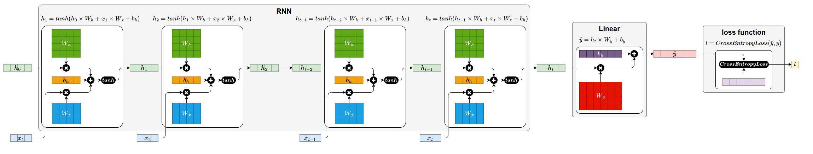

根据上述计算图，可以得出

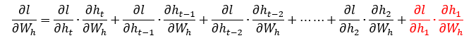

其中每一项表示每条路径对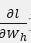贡献。

展开早期时间步的某一条路径（例如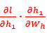)可以得到

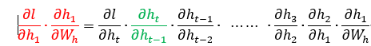

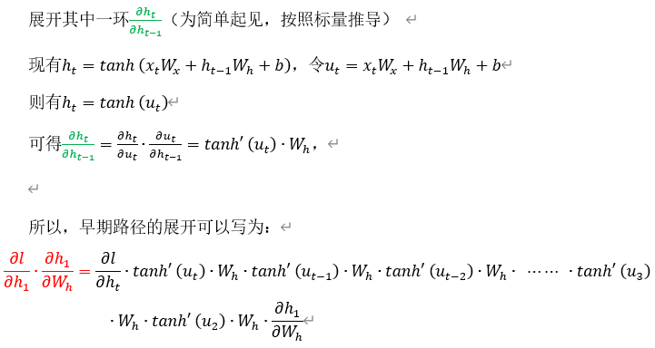

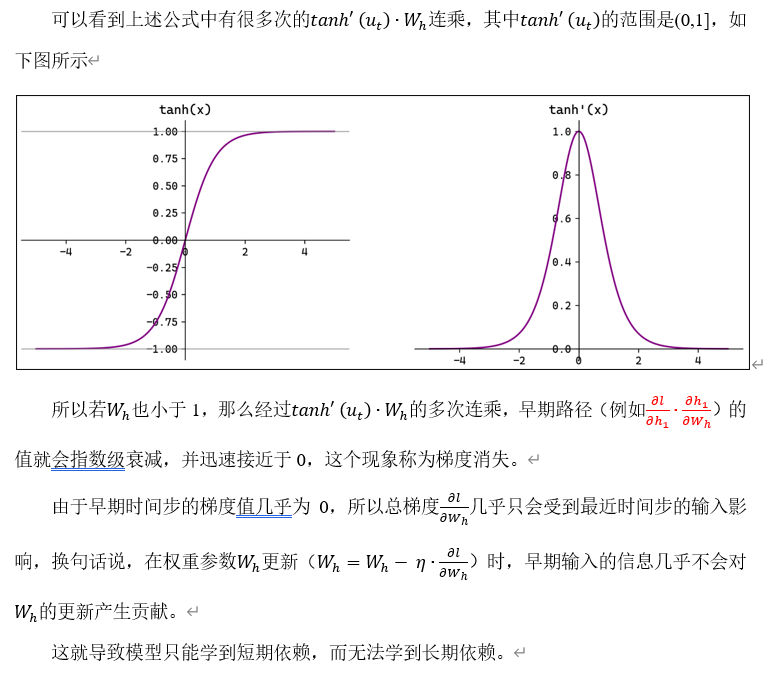


### LSTM

#### 概述

为了缓解RNN梯度消失或者梯度爆炸的问题，Hochreiter 和 Schmidhuber 于 1997 年提出了长短期记忆网络（Long Short-Term Memory, LSTM）。

#### 基础结构

LSTM 通过引入特殊的记忆单元（Memory Cell，图中的                                ），有效提升了模型对长序列依赖关系的建模能力。其沿时间步展开后的结构如下图所示：


各部分具体说明如下：

- **记忆单元（Memory Cell）**

记忆单元负责在序列中长期保存关键信息。它相当于一条“信息通道”，在多个时间步之间直接传递信息（记忆单元是缓解梯度消失和梯度爆炸问题的核心），如下图中的


- **遗忘门（Forget Gate）**

遗忘门决定当前时间步要忘记多少过去的记忆。

例如在上一节的输入法智能提示案例中，假如历史输入为：“小帅是一名程序员，他每天都加班；”，然后当前时间步的输入为“小美”，意味着当前的主语变为了“小美”，后续应该生成和“小美”相关的内容，所以此时记忆单元就应该忘记之前的主语信息“小帅”。

遗忘门会根据上一个时间步的隐藏状态和当前时间步的输入  ，生成一个0到1之间的控制系数，然后与上一个时间步的记忆单元状态  相乘，从而动态调整哪些信息应该被遗忘。


遗忘门的计算公式为：


- **输入门（Input Gate）**

输入门控制要从当前时间步的输入向记忆单元存入多少新的信息。例如上述案例中，当前时间步的输入为“小美”，所以此时记忆单元就应该存入新的主语信息“小美”。

当前时间步的信息由当前输入和上一个隐藏状态  计算而成，同时输入门也由当前输入  和上一个隐藏状态  计算而成，然后新的信息和输入门相乘得到需要存入记忆单元的信息，如下图所示


当前时间步的信息计算公式为：


输入门的计算公式为：


综上所述可以得到记忆单元更新的完整公式为：


Ø **输出门（Output Gate****）**

输出门控制从记忆单元中读取多少信息作为当前时间步的隐藏状态进行输出。例如上述输入法智能提示案例中，记忆单元中存入新主语信息“小美”之后，当前时间步就应该从记忆单元中提取该主语信息，生成与“小美”相关的内容。

输出门同样由当前时间步的输入和上一个时间步的隐藏状态计算而成，如下图所示。


输出门的计算公式为：


当前时间步输出的隐藏状态计算公式为：


LSTM的完整结构如下图所示


**思考题：LSTM为何能缓解梯度消失和梯度爆炸？**

LSTM的计算图如下：


#### 多层结构

与RNN类似，LSTM 也可以通过堆叠多个层来构建更深的网络，以增强模型对序列特征的建模能力。

在多层 LSTM 中，每一层 LSTM 的输出隐藏状态，会作为下一层 LSTM 的输入，同时每一层都维护独立的记忆单元。通过层层传递和提取信息，多层结构能够捕捉更复杂、更抽象的时序特征。

具体结构如下图所示


#### 双向结构

对于 LSTM，同样可以通过双向机制，利用序列中的过去信息和未来信息，进一步提升模型的建模能力。

在双向 LSTM 中，使用两套独立的 LSTM 网络：

正向 LSTM 按时间顺序处理输入序列；

反向 LSTM 按逆时间顺序处理输入序列。

每个时间步同时得到两个隐藏状态，通常将它们进行拼接，形成最终的输出，具体结构如下图所示：


#### 多层+双向结构

对于LSTM而言，多层结构和双向结构也可组合使用，每层都是一个双向LSTM，如下图所示


####API使用

[torch.nn.LSTM](https://pytorch.org/docs/stable/generated/torch.nn.LSTM.html)是 PyTorch 中实现长短期记忆网络（Long Short-Term Memory, LSTM）的模块。它用于对序列数据建模，在自然语言处理（NLP）、时间序列预测等任务中广泛使用。该模块支持单层或多层 LSTM，可选择是否使用双向结构（bidirectional）。

torch.nn.LSTM与torch.nn.RNN的API十分相似，主要区别在于相较于RNN，多了一个记忆单元需要处理。

##### 参数说明

构造RNN层所需的参数如下：

```python
torch.nn.LSTM(input_size, hidden_size, num_layers=1, bias=True, batch_first=False, dropout=0.0, bidirectional=False, proj_size=0, device=None, dtype=None)
```

各参数含义如下

| **参数名**    | **类型**            | **说明**                                                     |
| ------------- | ------------------- | ------------------------------------------------------------ |
| input_size    | int                 | 每个时间步输入特征的维度（词向量维度）                       |
| hidden_size   | int                 | 隐藏状态的维度                                               |
| num_layers    | int                 | RNN 层数，默认为 1                                           |
| nonlinearity  | str                 | 激活函数，'tanh'（默认）或 'relu'                            |
| bias          | bool                | 是否使用偏置项，默认 True                                    |
| batch_first   | bool                | 输入张量是否是 (batch,  seq, feature)，默认 False 表示 (seq, batch, feature) |
| dropout       | float               | 除最后一层外，其余层之间的 dropout 概率                      |
| bidirectional | bool                | 是否为双向 RNN，默认 False                                   |
| proj_size     | int                 | 隐藏状态的投影输出维度；若为 0，则不使用 projection。（详见[官方文档](https://pytorch.org/docs/stable/generated/torch.nn.LSTM.html)） |
| device        | torch.device or str | 模块的初始化设备，如 'cuda',  'cpu'                          |
| dtype         | torch.dtype         | 模块初始化时的默认数据类型，如 torch.float32, torch.float64  |

#####输入输出

示例代码如下

```python
lstm = torch.nn.LSTM()
output, (h_n, c_n) = lstm(input, (h_0, c_0))

```

输入输出内容如下

| **输入** | **input**                                                    | 输入序列，形状为(seq_len, batch_size, input_size)，如果 batch_first=True，则为 (batch_size, seq_len,  input_size) |
| :------: | ------------------------------------------------------------ | ------------------------------------------------------------ |
| **h_0**  | 可选，初始隐藏状态，形状为 (num_layers × num_directions,  batch_size, hidden_size) |                                                              |
| **c_0**  | 可选，初始细胞状态，形状为 (num_layers × num_directions, batch_size, hidden_size) |                                                              |
| **输出** | **output**                                                   | LSTM层的输出，包含最后一层每个时间步的隐藏状态，形状为 (seq_len, batch_size, num_directions ×  hidden_size )，如果如果 batch_first=True，则为(batch_size, seq_len, num_directions × hidden_size ) |
| **h_n**  | 最后一个时间步的隐藏状态，包含每一层的每个方向，形状为 (num_layers × num_directions, batch_size, hidden_size) |                                                              |
| **c_n**  | 最后一个时间步的细胞状态，包含每一层的每个方向，形状为 (num_layers ×  num_directions, batch_size, hidden_size) |                                                              |

输入输出形状如下

- **单层单向**


- **多层单向**


- **单层双向**


- **多层双向**


#### 案例实操（AI智评V1.0）

##### 需求说明

本案例的目标是基于 LSTM 构建一个文本情感分类模型，对评论内容进行二分类判断（正面或负面）。

##### 需求分析

1）数据集处理

本案例的目标对用户评论文本进行性感分类，因此需使用带有情感标签（正面/负面）的评论数据集。

数据集来源为[ChineseNLPCorpus](https://github.com/InsaneLife/ChineseNLPCorpus?tab=readme-ov-file#情感观点评论-倾向性分析)，格式CSV，具体结构如下：

| **cat**  | **label** | **review**                                       |
| -------- | --------- | ------------------------------------------------ |
| **书籍** | 1         | 感谢于歌先生为大家带来这么精彩的一本好书！       |
| **书籍** | 0         | 这本书纸质不怎样，内容也不怎样。                 |
| **水果** | 1         | 苹果酸甜可口，大小适中，好吃。                   |
| **水果** | 0         | 不是很大，比较甜，不会回购，感觉加运费后不划算。 |

本案例只需选取数据集中的review和label字段，构造输入-输出对即可。

2）模型结构设计

模型整体由以下三个主要部分组成：


- **嵌入层（Embedding****）**

将输入的词或字索引映射为稠密向量表示，便于后续神经网络处理。

- **长短期记忆网络（LSTM****）**

用于建模输入序列的上下文信息，输出最后一个时间步的隐藏状态作为上下文表示。

- **输出层（Linear****）**

将 LSTM 的隐藏状态输出映射为一个标量，表示该评论为正面情感的倾向得分（经sigmod函数后，大于0.5判定为正面情感，小于等于0.5判定为负面情感）。

3）训练方案

- 损失函数：

使用 BCEWithLogitsLoss，结合了sigmoid激活和二分类交叉熵计算，数值稳定且适合二分类任务。

- 优化器：

使用Adam优化器进行参数更新，提升训练效率。

4）评估方案

模型训练完毕后，使用测试集统计正确率。

##### 需求实现

1）项目结构

项目结构如下：


2）完整代码

完整代码如下

（1）**数据预处理**

```python
# process.py

import pandas as pd
from sklearn.model_selection import train_test_split
from tokenizer import JiebaTokenizer

import config

def process():
    """
    数据预处理主函数。
    """
    print("开始处理数据")

    # 1. 读取原始数据文件
    df = pd.read_csv(
        config.RAW_DATA_DIR / 'online_shopping_10_cats.csv',
        usecols=['review', 'label'],
        encoding='utf-8'
    )

    # 2. 数据清洗：去除空值和空字符串
    df = df.dropna()
    df = df[df['review'].str.strip().ne('')]

    # 3. 划分训练集和测试集
    train_df, test_df = train_test_split(df, test_size=0.2, random_state=42)

    # 4. 构建词表并保存
    JiebaTokenizer.build_vocab(
        train_df['review'].tolist(),
        config.PROCESSED_DATA_DIR / 'vocab.txt'
    )

    # 5. 加载词表
    tokenizer = JiebaTokenizer.from_vocab(config.PROCESSED_DATA_DIR / 'vocab.txt')

    # 6. 编码训练集并保存
    train_df['review'] = train_df['review'].apply(
        lambda x: tokenizer.encode(x, seq_len=config.SEQ_LEN)
    )
    train_df.to_json(
        config.PROCESSED_DATA_DIR / 'indexed_train.jsonl',
        orient='records',
        lines=True
    )

    # 7. 编码测试集并保存
    test_df['review'] = test_df['review'].apply(
        lambda x: tokenizer.encode(x, seq_len=config.SEQ_LEN)
    )
    test_df.to_json(
        config.PROCESSED_DATA_DIR / 'indexed_test.jsonl',
        orient='records',
        lines=True
    )

    print("数据处理完成")

if __name__ == '__main__':
    process()

```

（2）**自定义分词器**

```python
# tokenizer.py

import jieba
from tqdm import tqdm

jieba.setLogLevel(jieba.logging.WARNING)

class JiebaTokenizer:
    """
    基于 jieba 的分词器，用于分词、编码和词表管理。
    """

    unk_token = '<unk>'
    pad_token = '<pad>'

    @staticmethod
    def tokenize(sentence):
        """
        对句子进行分词。

        :param sentence: 输入句子。
        :return: 分词后的 token 列表。
        """
        return jieba.lcut(sentence)

    @classmethod
    def build_vocab(cls, sentences, vocab_file):
        """
        构建词表并保存到文件。

        :param sentences: 句子列表。
        :param vocab_file: 保存词表的文件路径。
        """
        unique_words = set()
        for sentence in tqdm(sentences, desc='分词'):
            # 收集所有唯一词
            for word in cls.tokenize(sentence):
                unique_words.add(word)

        # 将 pad 和 unk 放在词表开头
        vocab_list = [cls.pad_token, cls.unk_token] + list(unique_words)

        # 保存词表到文件
        with open(vocab_file, 'w', encoding='utf-8') as f:
            for word in vocab_list:
                f.write(word + '\n')

    @classmethod
    def from_vocab(cls, vocab_file):
        """
        从文件加载词表。

        :param vocab_file: 词表文件路径。
        :return: JiebaTokenizer 实例。
        """
        with open(vocab_file, 'r', encoding='utf-8') as f:
            vocab_list = [line.strip() for line in f.readlines()]
        return cls(vocab_list)

    def __init__(self, vocab_list):
        """
        初始化 tokenizer。

        :param vocab_list: 词表列表。
        """
        self.vocab_list = vocab_list
        self.vocab_size = len(vocab_list)
        self.word2index = {word: index for index, word in enumerate(vocab_list)}
        self.index2word = {index: word for index, word in enumerate(vocab_list)}
        self.unk_token_index = self.word2index[self.unk_token]
        self.pad_token_index = self.word2index[self.pad_token]

    def encode(self, sentence, seq_len):
        """
        将句子编码为索引列表。

        :param sentence: 输入句子。
        :param seq_len: 序列长度。
        :return: 索引列表。
        """
        tokens = self.tokenize(sentence)
        indexes = [self.word2index.get(token, self.unk_token_index) for token in tokens]

        # 填充或截断
        if len(indexes) >= seq_len:
            return indexes[:seq_len]
        else:
            return indexes + [self.pad_token_index] * (seq_len - len(indexes))

```

（3）**自定义数据集**

```python
# dataset.py

import torch
from torch.utils.data import Dataset, DataLoader
import pandas as pd

import config

class ReviewAnalyzeDataset(Dataset):
    """
    评论情感分析数据集。
    """

    def __init__(self, file_path):
        """
        初始化数据集。

        :param file_path: 数据文件路径（JSONL 格式）。
        """
        # 加载 JSONL 数据到内存
        self.data = pd.read_json(file_path, lines=True).to_dict(orient='records')

    def __len__(self):
        """
        获取数据集样本数。

        :return: 样本数量。
        """
        return len(self.data)

    def __getitem__(self, index):
        """
        获取指定索引的样本。

        :param index: 样本索引。
        :return: (input_tensor, target_tensor)
        """
        # 构建输入和目标张量
        input_tensor = torch.tensor(self.data[index]['review'], dtype=torch.long)
        target_tensor = torch.tensor(self.data[index]['label'], dtype=torch.float)

        return input_tensor, target_tensor

def get_dataloader(train=True):
    """
    创建数据加载器。

    :param train: 是否加载训练集（True）或测试集（False）。
    :return: DataLoader 实例。
    """
    file_name = 'indexed_train.jsonl' if train else 'indexed_test.jsonl'

    # 创建数据集实例
    dataset = ReviewAnalyzeDataset(config.PROCESSED_DATA_DIR / file_name)

    # 返回 DataLoader
    return DataLoader(dataset, batch_size=config.BATCH_SIZE, shuffle=True)

if __name__ == '__main__':
    # 简单测试数据加载器
    dataloader = get_dataloader()
    for input_tensor, target_tensor in dataloader:
        print(input_tensor.shape, target_tensor.shape)
        break

```

（4）**模型定义**

```python
# model.py

import torch
from torch import nn
import config
from torchinfo import summary

class ReviewAnalyzeModel(nn.Module):
    """
    评论情感分析模型，基于 LSTM。
    """

    def __init__(self, vocab_size, padding_idx):
        """
        初始化模型。

        :param vocab_size: 词表大小。
        :param padding_idx: padding token 的索引。
        """
        super().__init__()
        # 嵌入层：将索引映射为词向量
        self.embedding = nn.Embedding(
            num_embeddings=vocab_size,
            embedding_dim=config.EMBEDDING_DIM,
            padding_idx=padding_idx
        )
        # LSTM 层：提取序列特征
        self.lstm = nn.LSTM(
            input_size=config.EMBEDDING_DIM,
            hidden_size=config.HIDDEN_DIM,
            batch_first=True
        )
        # 线性层：映射到单输出，用于二分类
        self.linear = nn.Linear(in_features=config.HIDDEN_DIM, out_features=1)

    def forward(self, x):
        """
        前向传播。

        :param x: 输入张量，形状 (batch_size, seq_len)。
        :return: 模型输出张量，形状 (batch_size,)。
        """
        # 嵌入层处理
        embed = self.embedding(x)  # (batch_size, seq_len, embedding_dim)

        # LSTM 处理序列
        output, _ = self.lstm(embed)  # (batch_size, seq_len, hidden_dim)

        # 取最后时间步隐藏状态用于分类
        result = self.linear(output[:, -1, :]).squeeze(dim=1)  # (batch_size,)

        return result

if __name__ == '__main__':
    model = ReviewAnalyzeModel(vocab_size=1000, padding_idx=0)

    # 创建 dummy 输入张量用于结构展示
    dummy_input = torch.randint(
        low=0,
        high=1000,
        size=(config.BATCH_SIZE, config.SEQ_LEN),
        dtype=torch.long
    )

    # 打印模型结构信息
summary(model, input_data=dummy_input)

```

（5）**模型训练**

```python
# train.py

import time

import torch
from torch.utils.tensorboard import SummaryWriter
from tqdm import tqdm

from dataset import get_dataloader
from tokenizer import JiebaTokenizer
import config
from model import ReviewAnalyzeModel

def train_one_epoch(model, dataloader, loss_function, optimizer, device):
    """
    训练一个 epoch。

    :param model: 模型。
    :param dataloader: 数据加载器。
    :param loss_function: 损失函数。
    :param optimizer: 优化器。
    :param device: 设备。
    :return: 平均损失。
    """
    total_loss = 0
    model.train()

    for inputs, targets in tqdm(dataloader, desc='训练'):
        # 移动数据到设备
        inputs, targets = inputs.to(device), targets.to(device)

        optimizer.zero_grad()

        # 前向传播
        outputs = model(inputs)

        # 计算损失
        loss = loss_function(outputs, targets)

        # 反向传播
        loss.backward()

        # 参数更新
        optimizer.step()

        total_loss += loss.item()

    return total_loss / len(dataloader)

def train():
    """
    模型训练主函数。
    """
    device = torch.device('cuda' if torch.cuda.is_available() else 'cpu')

    dataloader = get_dataloader()

    tokenizer = JiebaTokenizer.from_vocab(config.PROCESSED_DATA_DIR / 'vocab.txt')

    model = ReviewAnalyzeModel(
        vocab_size=tokenizer.vocab_size,
        padding_idx=tokenizer.pad_token_index
    ).to(device)

    loss_function = torch.nn.BCEWithLogitsLoss()
    optimizer = torch.optim.Adam(model.parameters(), lr=config.LEARNING_RATE)

    writer = SummaryWriter(log_dir=config.LOG_DIR / time.strftime('%Y-%m-%d_%H-%M-%S'))

    best_loss = float('inf')

    for epoch in range(1, config.EPOCHS + 1):
        print(f'========== Epoch: {epoch} ==========')

        avg_loss = train_one_epoch(model, dataloader, loss_function, optimizer, device)

        print(f'Loss: {avg_loss:.4f}')

        writer.add_scalar('Loss/Train', avg_loss, epoch)

        if avg_loss < best_loss:
            best_loss = avg_loss
            torch.save(model.state_dict(), config.MODELS_DIR / 'model.pt')
            print('模型保存成功')

if __name__ == '__main__':
    train()

```

（6）**模型预测**

```python
# predict.py

import torch
import config

from tokenizer import JiebaTokenizer
from model import ReviewAnalyzeModel

def predict_batch(input_tensor, model):
    """
    对一个 batch 的输入进行预测。

    :param input_tensor: 输入张量，形状 (batch_size, seq_len)。
    :param model: 模型。
    :return: 概率列表。
    """
    model.eval()
    with torch.no_grad():
        # 前向传播获取 logits
        output = model(input_tensor)

        # 使用 sigmoid 将 logits 转换为概率
        probs = torch.sigmoid(output)

    return probs.tolist()

def predict(user_input, model, tokenizer, device):
    """
    对单条用户输入进行预测。

    :param user_input: 用户输入文本。
    :param model: 模型。
    :param tokenizer: 分词器。
    :param device: 设备。
    :return: 概率值。
    """
    # 编码并填充输入文本
    input_ids = tokenizer.encode(user_input, config.SEQ_LEN)

    # 转换为张量并移动到设备
    input_tensor = torch.tensor([input_ids], dtype=torch.long).to(device)

    # 获取预测概率
    probs = predict_batch(input_tensor, model)
    prob = probs[0]

    return prob

def run_predict():
    """
    启动预测交互程序。
    """
    device = torch.device('cuda' if torch.cuda.is_available() else 'cpu')

    # 加载 tokenizer
    tokenizer = JiebaTokenizer.from_vocab(config.PROCESSED_DATA_DIR / 'vocab.txt')

    # 创建并加载模型
    model = ReviewAnalyzeModel(
        vocab_size=tokenizer.vocab_size,
        padding_idx=tokenizer.pad_token_index
    ).to(device)
    model.load_state_dict(torch.load(config.MODELS_DIR / 'model.pt'))

    print('请输入要预测的评论：（输入 q 或 quit 退出）')

    while True:
        user_input = input('> ')
        if user_input in ['q', 'quit']:
            print('退出程序')
            break

        if not user_input:
            print('输入为空，请重新输入')
            continue

        # 预测结果
        prob = predict(user_input, model, tokenizer, device)
        if prob > 0.5:
            print(f'正面评价（置信度：{prob:.2f}）')
        else:
            print(f'负面评价（置信度：{1 - prob:.2f}）')

if __name__ == '__main__':
    run_predict()

```

（7）**模型评估**

```python
# evaluate.py

import torch
from tokenizer import JiebaTokenizer
import config
from model import ReviewAnalyzeModel
from dataset import get_dataloader
from predict import predict_batch

def evaluate(model, dataloader, device):
    """
    模型评估。

    :param model: 模型。
    :param dataloader: 数据加载器。
    :param device: 设备。
    :return: 准确率。
    """
    total_count = 0
    correct_count = 0

    model.eval()
    for inputs, targets in dataloader:
        # 数据转移到设备
        inputs = inputs.to(device)
        targets = targets.tolist()

        # 获取预测概率
        probs = predict_batch(inputs, model)

        # 统计准确率
        for prob, target in zip(probs, targets):
            pred_label = 1 if prob > 0.5 else 0
            if pred_label == target:
                correct_count += 1
            total_count += 1

    return correct_count / total_count

def run_evaluate():
    """
    运行评估流程。
    """
    device = torch.device('cuda' if torch.cuda.is_available() else 'cpu')

    tokenizer = JiebaTokenizer.from_vocab(config.PROCESSED_DATA_DIR / 'vocab.txt')

    model = ReviewAnalyzeModel(
        vocab_size=tokenizer.vocab_size,
        padding_idx=tokenizer.pad_token_index
    ).to(device)
    model.load_state_dict(torch.load(config.MODELS_DIR / 'model.pt'))

    dataloader = get_dataloader(train=False)

    acc = evaluate(model, dataloader, device)

    print("========== 评估结果 ==========")
    print(f"准确率：{acc:.4f}")
    print("=============================")

if __name__ == '__main__':
    run_evaluate()

```

（8）**配置文件**

```python
# config.py

# 项目根目录
from pathlib import Path

# 项目根目录
ROOT_DIR = Path(__file__).parent.parent

# 数据路径
RAW_DATA_DIR = ROOT_DIR / 'data' / 'raw'
PROCESSED_DATA_DIR = ROOT_DIR / 'data' / 'processed'

# 模型与日志路径
MODELS_DIR = ROOT_DIR / 'models'
LOG_DIR = ROOT_DIR / 'logs'

# 训练参数
SEQ_LEN = 128  # 输入序列长度
BATCH_SIZE = 64  # 批大小
EMBEDDING_DIM = 64  # 嵌入层维度
HIDDEN_DIM = 128  # LSTM 隐藏层维度
LEARNING_RATE = 1e-3  # 学习率
EPOCHS = 30  # 总训练轮数

```

#### 存在问题

尽管 LSTM 相较传统 RNN 解决了长期依赖问题，性能大幅提升，但在实际应用中，仍存在一些明显的局限性和问题，主要包括：

- **难以并行计算**

LSTM 的时间步之间具有强依赖性（后一个时间步的输入依赖前一个时间步的输出），导致无法进行大规模并行加速，训练和推理速度受限。

- **参数量大，计算开销高**

每个 LSTM 单元内部包含多个门控机制（输入门、遗忘门、输出门），每个门都需要独立计算，导致参数数量和计算量远大于普通 RNN。

在资源受限的场景下（如移动端、嵌入式设备），部署 LSTM 会面临挑战。

- **长期依赖建模仍然有限**

虽然 LSTM 延缓了梯度消失问题，但并不能完全消除。当序列极长时，模型依然难以有效捕捉非常远距离的依赖关系。

### GRU

#### 概述

Gated Recurrent Unit（GRU）是为了进一步简化 LSTM 结构、降低计算成本而提出的一种变体。GRU 保留了门控机制的核心思想，但相比 LSTM，结构更为简洁，参数更少，训练效率更高。

在许多实际任务中，GRU 能在保持类似性能的同时，显著减少训练时间。

#### 基础结构

与LSTM相比，GRU做出了以下改进：

- 取消了LSTM中独立的记忆单元，只保留隐藏状态。

- 通过两个门控结构控制信息流动：更新门（Update Gate）和 重置门（Reset Gate）。

具体结构如下图所示：


各部分说明如下：

- **重置门（Reset Gate）**

重置门由上一个时间步的隐藏状态和当前时间步的输入计算得到：


计算公式如下：


重置门会在计算当前时间步信息（候选隐藏状态）时，作用在上一个时间步的隐藏状态，用于控制遗忘多少旧信息，如下图所示：


当前时间步的信息（候选隐藏状态）的计算公式为：


- **更新门（Update Gate）**

更新门也由上一时间步的隐藏状态和当前时间步的输入计算得到，如下图所示


计算公式为


更新门会在计算当前时间步最终的隐藏状态h_t时，分别作用在上一时刻的隐藏状态h~(t-1~)和当前新计算出的候选隐藏状态(h~t~ ) ̃，用于控制保留多少旧信息，以及引入多少新信息。


最终隐藏状态的计算公式为：


完整结构如下下图所示


#### 多层结构

GRU同样支持多层结构


#### 双向结构


#### 多层+双向结构


#### API使用

[torch.nn.GRU](https://pytorch.org/docs/stable/generated/torch.nn.GRU.html) 是 PyTorch 中实现门控循环单元（Gated Recurrent Unit, GRU）的模块。它用于对序列数据建模，在自然语言处理（NLP）、时间序列预测等任务中广泛使用。该模块支持单层或多层 GRU，可选择是否使用双向结构（bidirectional）。

torch.nn.GRU与torch.nn.RNN的API几乎完全相同。

##### 参数说明

构造GRU层所需的参数如下：

```python
torch.nn.GRU(input_size, hidden_size, num_layers=1, bias=True, batch_first=False, dropout=0.0, bidirectional=False, device=None, dtype=None)
```

各参数含义如下

| **参数名**        | **类型**            | **说明**                                                     |
| ----------------- | ------------------- | ------------------------------------------------------------ |
| **input_size**    | int                 | 每个时间步输入特征的维度（词向量维度）                       |
| **hidden_size**   | int                 | 隐藏状态的维度                                               |
| **num_layers**    | int                 | RNN 层数，默认为 1                                           |
| **bias**          | bool                | 是否使用偏置项，默认 True                                    |
| **batch_first**   | bool                | 输入张量是否是 (batch, seq, feature)，默认 False 表示 (seq,  batch, feature) |
| **dropout**       | float               | 除最后一层外，其余层之间的  dropout 概率                     |
| **bidirectional** | bool                | 是否为双向 RNN，默认 False                                   |
| **device**        | torch.device or str | 模块的初始化设备，如 'cuda', 'cpu'                           |
| **dtype**         | torch.dtype         | 模块初始化时的默认数据类型，如torch.float32                  |

##### 输入输出

示例代码如下:

```python
gru= torch.nn.GRU()
output, h_n = gru(input, h_0)

```

输入输出内容如下

| **输**  **入** |         | **input**                                                    | 输入序列，形状为(seq_len, batch_size, input_size)，如果 batch_first=True，则为 (batch_size, seq_len,  input_size) |
| -------------- | ------- | ------------------------------------------------------------ | ------------------------------------------------------------ |
|                | **h_0** | 可选，初始隐藏状态，形状为 (num_layers × num_directions,  batch_size, hidden_size) |                                                              |
| **输**  **出** |         | **output**                                                   | RNN层的输出，包含最后一层每个时间步的隐藏状态，形状为  (seq_len, batch_size,  num_directions × hidden_size )，如果如果 batch_first=True，则为(batch_size,  seq_len, num_directions × hidden_size ) |
|                | **h_n** | 最后一个时间步的隐藏状态，包含每一层的每个方向，形状为 (num_layers ×  num_directions, batch_size, hidden_size) |                                                              |

输入输出形状如下

- **单层单向**


- **多层单向**


- **单层双向**


- **多层双向**


#### 案例实操（AI智评V2.0）

将上一节使用LSTM实现的评论情感分析模型改为使用GRU，并对比两者的效果，另外也改用RNN实现，对比其效果。

1）项目结构

项目结构如下：


2）完整代码

（1）**数据预处理**

```python
# process.py

import pandas as pd
from sklearn.model_selection import train_test_split
from tokenizer import JiebaTokenizer

import config

def process():
    print("开始处理数据")
    # 1.读取数据
    df = pd.read_csv(config.RAW_DATA_DIR / 'online_shopping_10_cats.csv', usecols=['review', 'label'], encoding='utf-8')

    # 2.过滤数据
    df = df.dropna()
    df = df[df['review'].str.strip().ne('')]

    # 3.划分数据集
    train_df, test_df = train_test_split(df, test_size=0.2, random_state=42)

    # 4.构建词表
    JiebaTokenizer.build_vocab(train_df['review'].tolist(), config.PROCESSED_DATA_DIR / 'vocab.txt')

    # 5.构建Tokenizer对象
    tokenizer = JiebaTokenizer.from_vocab(config.PROCESSED_DATA_DIR / 'vocab.txt')

    # 6.构建训练集并保存
    train_df['review'] = train_df['review'].apply(lambda x: tokenizer.encode(x, seq_len=config.SEQ_LEN))
    train_df.to_json(config.PROCESSED_DATA_DIR / 'indexed_train.jsonl', orient='records', lines=True)

    # 7.构建测试集并保存
    test_df['review'] = test_df['review'].apply(lambda x: tokenizer.encode(x, seq_len=config.SEQ_LEN))
    test_df.to_json(config.PROCESSED_DATA_DIR / 'indexed_test.jsonl', orient='records', lines=True)

    print("数据处理完成")

if __name__ == '__main__':
    process()

```

（2）**自定义分词器**

```python
# tokenizer.py

import jieba
from tqdm import tqdm

jieba.setLogLevel(jieba.logging.WARNING)

class JiebaTokenizer:
    unk_token = '<unk>'
    pad_token = '<pad>'

    @staticmethod
    def tokenize(sentence):
        """
        分词
        :param sentence: 句子
        :return: token列表
        """
        return jieba.lcut(sentence)

    @classmethod
    def build_vocab(cls, sentences, vocab_file):
        """
        构建并保存词表
        :param sentences: 句子列表
        :param vocab_file: 词表文件路径
        """

        # 1.获取词表
        unique_words = set()
        for sentence in tqdm(sentences, desc='分词'):
            for word in cls.tokenize(sentence):
                unique_words.add(word)

        vocab_list = [cls.pad_token, cls.unk_token] + list(unique_words)

        # 2.保存词表
        with open(vocab_file, 'w', encoding='utf-8') as f:
            for word in vocab_list:
                f.write(word + '\n')

    def __init__(self, vocab_list):
        """
        初始化tokenizer
        :param vocab_list: 词表列表
        """

        self.vocab_list = vocab_list  # 此表列表(实例属性)
        self.vocab_size = len(vocab_list)  # 词表大小(实例属性)
        self.word2index = {word: index for index, word in enumerate(vocab_list)}  # 词到索引(实例属性)
        self.index2word = {index: word for index, word in enumerate(vocab_list)}  # 索引到词(实例属性)

        self.unk_token_index = self.word2index[self.unk_token]  # 未知词索引(实例属性)
        self.pad_token_index = self.word2index[self.pad_token]

    @classmethod
    def from_vocab(cls, vocab_file):
        """
        加载词表并创建Tokenizer对象
        :param vocab_file: 词表文件
        :return: tokenizer对象
        """
        with open(vocab_file, 'r', encoding='utf-8') as f:
            vocab_list = [line[:-1] for line in f.readlines()]
        return cls(vocab_list)

    def encode(self, sentence, seq_len):
        """
        编码
        :param sentence: 句子
        :param seq_len: 长度
        :return: 索引列表
        """
        tokens = self.tokenize(sentence)
        indexes = [self.word2index.get(token, self.unk_token_index) for token in tokens]

        if len(indexes) >= seq_len:
            return indexes[:seq_len]
        else:
            return indexes + [self.pad_token_index] * (seq_len - len(indexes))

```

（3）**自定义数据集**

```python
# dataset.py

import torch
from torch.utils.data import Dataset, DataLoader
import pandas as pd
import config

class ReviewAnalyzeDataset(Dataset):
    """
    评论情感分析数据集。
    """

    def __init__(self, file_path):
        """
        初始化数据集。
        :param file_path: 数据文件路径（jsonl 格式）
        """
        self.data = pd.read_json(file_path, lines=True).to_dict(orient='records')

    def __len__(self):
        """
        返回数据集大小。
        :return: 数据集长度
        """
        return len(self.data)

    def __getitem__(self, index):
        """
        获取单条样本。
        :param index: 索引
        :return: (input_tensor, target_tensor)
        """
        input_tensor = torch.tensor(self.data[index]['review'], dtype=torch.long)
        target_tensor = torch.tensor(self.data[index]['label'], dtype=torch.float)
        return input_tensor, target_tensor

def get_dataloader(train: bool = True):
    """
    获取数据加载器。
    :param train: 是否加载训练集
    :return: DataLoader
    """
    file_name = 'indexed_train.jsonl' if train else 'indexed_test.jsonl'
    dataset = ReviewAnalyzeDataset(config.PROCESSED_DATA_DIR / file_name)
    return DataLoader(dataset, batch_size=config.BATCH_SIZE, shuffle=True)

if __name__ == '__main__':
    dataloader = get_dataloader()
    for input_tensor, target_tensor in dataloader:
        print(f"输入形状: {input_tensor.shape}, 标签形状: {target_tensor.shape}")
        break

```

（4）**模型定义**

```python
# model.py

import torch
from torch import nn
import config
from torchinfo import summary

class ReviewAnalyzeModel(nn.Module):
    """
    评论情感分析模型：Embedding -> GRU -> Linear
    """

    def __init__(self, vocab_size, padding_idx):
        """
        初始化模型。
        :param vocab_size: 词表大小
        :param padding_idx: padding token 的索引
        """
        super().__init__()
        self.embedding = nn.Embedding(
            num_embeddings=vocab_size,
            embedding_dim=config.EMBEDDING_DIM,
            padding_idx=padding_idx
        )
        self.gru = nn.GRU(
            input_size=config.EMBEDDING_DIM,
            hidden_size=config.HIDDEN_DIM,
            batch_first=True
        )
        self.linear = nn.Linear(
            in_features=config.HIDDEN_DIM,
            out_features=1
        )

    def forward(self, x):
        """
        前向传播。
        :param x: 输入索引张量，形状 (batch_size, seq_len)
        :return: 输出 logits，形状 (batch_size,)
        """
        embed = self.embedding(x)  # 嵌入层输出: (batch_size, seq_len, embedding_dim)
        gru_output, _ = self.gru(embed)  # GRU输出: (batch_size, seq_len, hidden_dim)
        final_output = gru_output[:, -1, :]  # 取最后时间步输出
        logits = self.linear(final_output).squeeze(dim=1)  # 线性层 + squeeze: (batch_size,)
        return logits

if __name__ == '__main__':
    model = ReviewAnalyzeModel(vocab_size=1000, padding_idx=0)
    dummy_input = torch.randint(low=0, high=1000, size=(config.BATCH_SIZE, config.SEQ_LEN), dtype=torch.long)
    summary(model, input_data=dummy_input)

```

（5）**模型训练**

```python
# train.py

import time
import torch
from torch.utils.tensorboard import SummaryWriter
from tqdm import tqdm
from dataset import get_dataloader
from tokenizer import JiebaTokenizer
from model import ReviewAnalyzeModel
import config

def train_one_epoch(model, dataloader, loss_function, optimizer, device):
    """
    单轮训练。
    :param model: 模型
    :param dataloader: 数据加载器
    :param loss_function: 损失函数
    :param optimizer: 优化器
    :param device: 设备
    :return: 平均损失
    """
    model.train()
    total_loss = 0
    for input_tensor, target_tensor in tqdm(dataloader, desc='训练'):
        input_tensor = input_tensor.to(device)
        target_tensor = target_tensor.to(device)

        optimizer.zero_grad()
        outputs = model(input_tensor)
        loss = loss_function(outputs, target_tensor)
        loss.backward()
        optimizer.step()

        total_loss += loss.item()
    return total_loss / len(dataloader)

def train():
    """
    模型训练主逻辑。
    """
    device = torch.device('cuda' if torch.cuda.is_available() else 'cpu')
    dataloader = get_dataloader(train=True)

    tokenizer = JiebaTokenizer.from_vocab(config.PROCESSED_DATA_DIR / 'vocab.txt')
    model = ReviewAnalyzeModel(vocab_size=tokenizer.vocab_size,
                               padding_idx=tokenizer.pad_token_index).to(device)

    loss_function = torch.nn.BCEWithLogitsLoss()
    optimizer = torch.optim.Adam(model.parameters(), lr=config.LEARNING_RATE)

    writer = SummaryWriter(log_dir=config.LOG_DIR / time.strftime('%Y-%m-%d_%H-%M-%S'))

    best_loss = float('inf')
    for epoch in range(1, config.EPOCHS + 1):
        print(f'========== Epoch: {epoch} ==========')
        avg_loss = train_one_epoch(model, dataloader, loss_function, optimizer, device)
        print(f'Loss: {avg_loss:.4f}')
        writer.add_scalar('Loss/Train', avg_loss, epoch)

        # 保存最佳模型
        if avg_loss < best_loss:
            best_loss = avg_loss
            torch.save(model.state_dict(), config.MODELS_DIR / 'model.pt')
            print('模型保存成功')

if __name__ == '__main__':
    train()

```

（6）**模型预测**

```python
# predict.py

import torch
from tokenizer import JiebaTokenizer
from model import ReviewAnalyzeModel
import config

def predict_batch(input_tensor, model):
    """
    对一个批次输入进行预测。
    :param input_tensor: 输入张量 (batch_size, seq_len)
    :param model: 模型
    :return: 概率列表
    """
    model.eval()
    with torch.no_grad():
        logits = model(input_tensor)
    probs = torch.sigmoid(logits)
    return probs.tolist()

def predict(user_input: str, model, tokenizer, device):
    """
    对单条用户输入进行预测。
    :param user_input: 用户输入字符串
    :param model: 模型
    :param tokenizer: 分词器
    :param device: 设备
    :return: 概率值
    """
    input_indexes = tokenizer.encode(user_input, config.SEQ_LEN)
    input_tensor = torch.tensor([input_indexes], dtype=torch.long).to(device)
    probs = predict_batch(input_tensor, model)
    return probs[0]

def run_predict():
    """
    预测交互主逻辑。
    """
    device = torch.device('cuda' if torch.cuda.is_available() else 'cpu')

    tokenizer = JiebaTokenizer.from_vocab(config.PROCESSED_DATA_DIR / 'vocab.txt')
    model = ReviewAnalyzeModel(vocab_size=tokenizer.vocab_size,
                               padding_idx=tokenizer.pad_token_index).to(device)
    model.load_state_dict(torch.load(config.MODELS_DIR / 'model.pt'))

    print('请输入要预测的评论：（输入 q 或 quit 退出）')
    while True:
        user_input = input('> ').strip()
        if user_input in ['q', 'quit']:
            print('退出程序')
            break
        if not user_input:
            print('输入为空，请重新输入')
            continue

        prob = predict(user_input, model, tokenizer, device)
        if prob > 0.5:
            print(f'正面评价（置信度：{prob:.2f}）')
        else:
            print(f'负面评价（置信度：{1 - prob:.2f}）')

if __name__ == '__main__':
    run_predict()

```

（7）**模型评估**

```python
# evaluate.py

import torch
from tokenizer import JiebaTokenizer
from model import ReviewAnalyzeModel
from dataset import get_dataloader
from predict import predict_batch
import config

def evaluate(model, dataloader, device):
    """
    模型评估。
    :param model: 模型
    :param dataloader: 数据加载器
    :param device: 设备
    :return: 准确率
    """
    model.eval()
    total_count = 0
    correct_count = 0

    for input_tensor, target_tensor in dataloader:
        input_tensor = input_tensor.to(device)
        target_tensor = target_tensor.tolist()

        probs = predict_batch(input_tensor, model)

        for prob, target in zip(probs, target_tensor):
            pred_label = 1 if prob > 0.5 else 0
            if pred_label == target:
                correct_count += 1
            total_count += 1

    return correct_count / total_count

def run_evaluate():
    """
    评估主流程。
    """
    device = torch.device('cuda' if torch.cuda.is_available() else 'cpu')

    tokenizer = JiebaTokenizer.from_vocab(config.PROCESSED_DATA_DIR / 'vocab.txt')
    model = ReviewAnalyzeModel(vocab_size=tokenizer.vocab_size,
                               padding_idx=tokenizer.pad_token_index).to(device)
    model.load_state_dict(torch.load(config.MODELS_DIR / 'model.pt'))

    dataloader = get_dataloader(train=False)

    acc = evaluate(model, dataloader, device)
    print("========== 评估结果 ==========")
    print(f"准确率：{acc:.4f}")
    print("=============================")

if __name__ == '__main__':
    run_evaluate()

```

（8）**配置文件**

```python
# config.py

# 配置文件，定义项目路径和超参数
from pathlib import Path

# 项目根目录
ROOT_DIR = Path(__file__).parent.parent

# 数据路径
RAW_DATA_DIR = ROOT_DIR / 'data' / 'raw'
PROCESSED_DATA_DIR = ROOT_DIR / 'data' / 'processed'

# 模型与日志路径
MODELS_DIR = ROOT_DIR / 'models'
LOG_DIR = ROOT_DIR / 'logs'

# 超参数
SEQ_LEN = 128  # 序列长度
BATCH_SIZE = 64  # 批次大小
EMBEDDING_DIM = 64  # 嵌入维度
HIDDEN_DIM = 128  # GRU 隐藏层维度
LEARNING_RATE = 1e-3  # 学习率
EPOCHS = 30  # 训练轮数

```

#### 存在问题

GRU 在简化结构、提高训练效率方面表现优秀，但在超长依赖建模、灵活性和并行计算方面仍存在天然限制。
