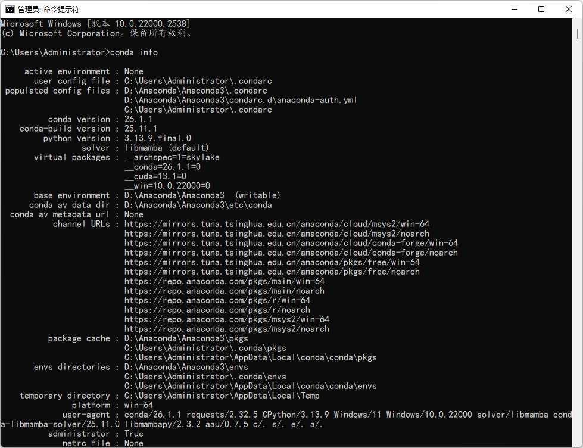
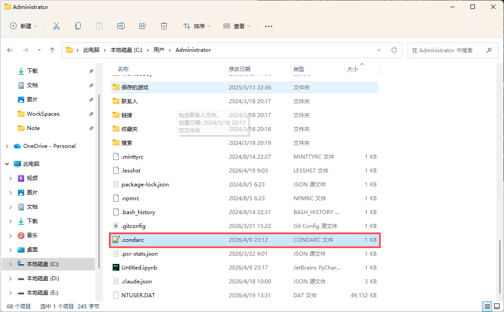
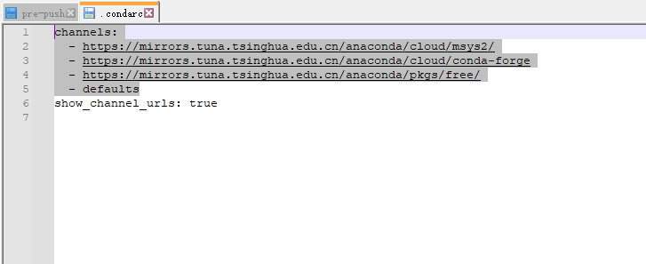

# Anaconda

## 验证安装成功

```powershell
conda info
```



## 配置国内镜像源

执行：

```powershell
conda config --set show_channel_urls yes
```

在C:\Users（用户）\用户名”路径下生``.condarc``



输入镜像源配置

```tex
channels:
  - https://mirrors.tuna.tsinghua.edu.cn/anaconda/cloud/msys2/
  - https://mirrors.tuna.tsinghua.edu.cn/anaconda/cloud/conda-forge
  - https://mirrors.tuna.tsinghua.edu.cn/anaconda/pkgs/free/
  - defaults
```



## conda

| **功能**          | **命令**                                                     |
| ----------------- | ------------------------------------------------------------ |
| **创建环境**      | conda create -n <环境名> python=<版本号>  例如：conda  create -n env1 python=3.12 |
| **激活环境**      | conda activate <环境名>  例如：conda  activate env1          |
| **退出环境**      | conda deactivate                                             |
| **列出所有环境**  | conda env list 或  conda info --env                          |
| **删除环境**      | conda remove -n <环境名> --all  例如：conda  remove -n env1 --all |
| **查看conda信息** | conda info                                                   |

| **功能**               | **命令**                                                     |
| ---------------------- | ------------------------------------------------------------ |
| **安装软件包**         | conda install <包名>  例如：conda  install numpy             |
| **指定版本安装软件包** | conda install <包名>=<版本号>  例如：conda  install numpy=1.26.4 |
| **更新软件包**         | conda update <包名>  例如：conda  update pandas              |
| **卸载软件包**         | conda remove <包名>  例如：conda  remove matplotlib          |

> 注意：虚拟新的环境起到的作用是环境隔离，项目间相互不影响，如果使用pycharm在指定anaconda解释器的时候，会自动创建虚拟环境

## Jupyter

esc：从输入模式退出到命令模式

a：在当前cell上面创建一个新的cell

b：在当前cell 下面创建一个新的cell

dd：删除当前cell

m：切换到markdown模式

y：切换到code模式

ctrl+回车：运行cell 

shift +回车：运行当前cell并创建一个新的cell

# NumPy

```python
# ==========================================
# NumPy - 数值计算基础
# ==========================================
import numpy as np

# 创建数组
a = np.array([1, 2, 3, 4, 5])
b = np.arange(0, 10, 2)        # [0, 2, 4, 6, 8]
c = np.linspace(0, 1, 5)      # [0, 0.25, 0.5, 0.75, 1]
d = np.zeros((2, 3))          # 2x3 零矩阵
e = np.ones((3, 3))            # 3x3 全1矩阵
f = np.eye(3)                  # 3x3 单位矩阵
g = np.random.rand(3, 4)       # 3x4 随机矩阵 [0,1)
h = np.random.randint(1, 10, (3, 3))  # 3x3 随机整数

print(f"数组: a={a}, shape={a.shape}")
print(f"等差: b={b}")
print(f"零矩阵:\n{d}")

# ==========================================
# 数组操作
# ==========================================
arr = np.array([1, 2, 3, 4, 5])

# 索引切片
print(f"arr[0]={arr[0]}, arr[1:3]={arr[1:3]}")
print(f"arr[::2]={arr[::2]}")  # 步长
print(f"arr[arr > 3]={arr[arr > 3]}")  # 布尔索引

# 2D数组
mat = np.array([[1, 2, 3], [4, 5, 6], [7, 8, 9]])
print(f"mat[1,1]={mat[1, 1]}")  # 5
print(f"mat[:, 1]={mat[:, 1]}")  # 列
print(f"mat[1:, :2]={mat[1:, :2]}")  # 子矩阵

# ==========================================
# 数学运算
# ==========================================
a = np.array([1, 2, 3, 4, 5])
b = np.array([5, 4, 3, 2, 1])

print(f"加: {a + b}")
print(f"乘: {a * b}")          # 逐元素
print(f"矩阵乘: {np.dot(a, b)}")  # 点积
print(f"sum={np.sum(a)}, mean={np.mean(a)}")
print(f"std={np.std(a)}, max={np.max(a)}")
print(f"argmax={np.argmax(a)}")  # 最大值索引

# 广播
arr2d = np.array([[1, 2, 3], [4, 5, 6]])
print(f"广播加: {arr2d + np.array([1, 2, 3])}")

# ==========================================
# 统计与排序
# ==========================================
arr = np.array([3, 1, 4, 1, 5, 9, 2, 6])
print(f"排序: {np.sort(arr)}")
print(f"唯一值: {np.unique([1,2,2,3,3,3])}")
print(f"累积和: {np.cumsum(arr)}")

# ==========================================
# 实战：矩阵运算
# ==========================================
# 线性代数
A = np.array([[1, 2], [3, 4]])
B = np.array([[5, 6], [7, 8]])
print(f"矩阵乘:\n{np.matmul(A, B)}")
print(f"转置:\n{A.T}")
print(f"逆矩阵:\n{np.linalg.inv(A)}")
print(f"行列式: {np.linalg.det(A)}")
print(f"特征值: {np.linalg.eigvals(A)}")
```

# Pandas

```python
# ==========================================
# Pandas - 数据分析
# ==========================================
import pandas as pd

# 创建 Series
s = pd.Series([1, 3, 5, np.nan, 6, 8])
print(f"Series:\n{s}")

# 创建 DataFrame
data = {
    "姓名": ["Alice", "Bob", "Charlie", "David"],
    "年龄": [25, 30, 35, 28],
    "薪资": [8000, 12000, 15000, 9500],
    "部门": ["技术", "市场", "技术", "人事"]
}
df = pd.DataFrame(data)
print(f"DataFrame:\n{df}")

# ==========================================
# 基本操作
# ==========================================
print(f"前2行:\n{df.head(2)}")
print(f"后2行:\n{df.tail(2)}")
print(f"形状: {df.shape}")
print(f"列名: {df.columns.tolist()}")
print(f"数据类型:\n{df.dtypes}")
print(f"统计:\n{df.describe()}")
print(f"薪资列:\n{df['薪资']}")
print(f"年龄>28的行:\n{df[df['年龄'] > 28]}")

# ==========================================
# 数据选择
# ==========================================
# 列选择
print(f"单列: {df['姓名'].tolist()}")
print(f"多列:\n{df[['姓名', '薪资']]}")

# iloc（位置索引）
print(f"前3行:\n{df.iloc[:3]}")
print(f"[1,2]位置: {df.iloc[1, 2]}")

# loc（标签索引）
df2 = df.set_index("姓名")
print(f"loc['Alice']:\n{df2.loc['Alice']}")

# ==========================================
# 数据处理
# ==========================================
df["绩效"] = ["A", "B", "A", "C"]
print(f"添加列后:\n{df}")

# 排序
print(f"按薪资排序:\n{df.sort_values('薪资', ascending=False)}")

# 分组聚合
print(f"按部门统计:\n{df.groupby('部门')['薪资'].agg(['mean', 'sum', 'count'])}")

# 缺失值
df3 = pd.DataFrame({"A": [1, 2, np.nan], "B": [4, np.nan, 6]})
print(f"缺失值:\n{df3}")
print(f"填充: {df3.fillna(0)}")
print(f"删除缺失: {df3.dropna()}")

# ==========================================
# 数据导入导出
# ==========================================
# CSV
df.to_csv("temp.csv", index=False, encoding="utf-8-sig")
df_loaded = pd.read_csv("temp.csv")

# Excel
# df.to_excel("temp.xlsx", index=False)
# df_loaded = pd.read_excel("temp.xlsx")

print(f"加载成功: {df_loaded.shape}")
```

# Matplotlib

```python
# ==========================================
# Matplotlib - 数据可视化
# ==========================================
import matplotlib.pyplot as plt
import numpy as np

# ==========================================
# 基础图表
# ==========================================
# 折线图
x = np.linspace(0, 2 * np.pi, 100)
y = np.sin(x)

plt.figure(figsize=(8, 4))
plt.plot(x, y, 'b-', linewidth=2, label='sin(x)')
plt.plot(x, np.cos(x), 'r--', linewidth=2, label='cos(x)')
plt.xlabel('X轴')
plt.ylabel('Y轴')
plt.title('三角函数')
plt.legend()
plt.grid(True)
plt.tight_layout()
plt.show()

# 散点图
plt.figure(figsize=(6, 6))
x = np.random.randn(100)
y = np.random.randn(100)
colors = np.random.rand(100)
sizes = 100 * np.random.rand(100)
plt.scatter(x, y, c=colors, s=sizes, alpha=0.6, cmap='viridis')
plt.colorbar()
plt.title('散点图示例')
plt.show()

# 柱状图
plt.figure(figsize=(8, 4))
categories = ['Python', 'Java', 'JavaScript', 'C++', 'Go']
popularity = [30, 18, 25, 8, 12]
colors = ['#1f77b4', '#ff7f0e', '#2ca02c', '#d62728', '#9467bd']
plt.bar(categories, popularity, color=colors)
plt.xlabel('语言')
plt.ylabel('使用率%')
plt.title('编程语言流行度')
for i, v in enumerate(popularity):
    plt.text(i, v + 0.5, str(v), ha='center')
plt.tight_layout()
plt.show()

# 饼图
plt.figure(figsize=(6, 6))
sizes = [25, 35, 20, 12, 8]
labels = ['苹果', '香蕉', '橙子', '葡萄', '其他']
plt.pie(sizes, labels=labels, autopct='%1.1f%%', startangle=90)
plt.title('水果占比')
plt.show()

# ==========================================
# 子图
# ==========================================
fig, axes = plt.subplots(2, 2, figsize=(10, 8))

# 子图1：正弦
axes[0, 0].plot(x, np.sin(x), 'b')
axes[0, 0].set_title('正弦')

# 子图2：余弦
axes[0, 1].plot(x, np.cos(x), 'r')
axes[0, 1].set_title('余弦')

# 子图3：正切
axes[1, 0].plot(x, np.tan(x), 'g')
axes[1, 0].set_ylim(-5, 5)
axes[1, 0].set_title('正切')

# 子图4：随机
axes[1, 1].hist(np.random.randn(1000), bins=30, edgecolor='black')
axes[1, 1].set_title('直方图')

plt.tight_layout()
plt.show()
```

