# Anaconda

## 验证安装成功

```powershell
conda info
```


## 配置国内镜像源

执行：

```powershell
conda config --set show_channel_urls yes
```

在C:\Users（用户）\用户名”路径下生``.condarc``


输入镜像源配置

```tex
channels:
  - https://mirrors.tuna.tsinghua.edu.cn/anaconda/cloud/msys2/
  - https://mirrors.tuna.tsinghua.edu.cn/anaconda/cloud/conda-forge
  - https://mirrors.tuna.tsinghua.edu.cn/anaconda/pkgs/free/
  - defaults
```


## conda

| **功能**          | **命令**                                                     |
| ----------------- | ------------------------------------------------------------ |
| **创建环境**      | conda create -n <环境名> python=<版本号>  例如：conda  create -n env1 python=3.12 |
| **激活环境**      | conda activate <环境名>  例如：conda  activate env1          |
| **退出环境**      | conda deactivate                                             |
| **列出所有环境**  | conda env list 或  conda info --env                          |
| **删除环境**      | conda remove -n <环境名> --all  例如：conda  remove -n env1 --all |
| **查看conda信息** | conda info                                                   |

| **功能**               | **命令**                                                     |
| ---------------------- | ------------------------------------------------------------ |
| **安装软件包**         | conda install <包名>  例如：conda  install numpy             |
| **指定版本安装软件包** | conda install <包名>=<版本号>  例如：conda  install numpy=1.26.4 |
| **更新软件包**         | conda update <包名>  例如：conda  update pandas              |
| **卸载软件包**         | conda remove <包名>  例如：conda  remove matplotlib          |

> 注意：虚拟新的环境起到的作用是环境隔离，项目间相互不影响，如果使用pycharm在指定anaconda解释器的时候，会自动创建虚拟环境

## Jupyter

esc：从输入模式退出到命令模式

a：在当前cell上面创建一个新的cell

b：在当前cell 下面创建一个新的cell

dd：删除当前cell

m：切换到markdown模式

y：切换到code模式

ctrl+回车：运行cell 

shift +回车：运行当前cell并创建一个新的cell

# NumPy

## 创建数组

### array和asarray

```python
"""
    array:将输入的数据转换为ndarray，会进行copy
    asarray：将输入的数据转换为ndarray，如果输入本身是ndarray，则不会进行copy
"""
import numpy as np

data = [1,2,3]
print(f"元数据地址为:{id(data)}")
arr = np.array(data)
print(f"arr1地址为:{id(arr)}")
print(f"数组数据为:{arr}")

print("-" * 20)
arr2 = np.array(arr)
print(f"arr2地址为:{id(arr2)}")
print(f"arr2数组数据为:{arr2}")

print("-" * 20)
arr3 = np.asarray(arr)
print(f"arr3地址为:{id(arr3)}")
print(f"arr3数组数据为:{arr3}")

```

### zeros()、ones()、empty()与zeros_like()、ones_like()、empty_like()

```python
"""
	zeros()：返回给定形状和类型的新数组，用0填充。
	ones()：返回给定形状和类型的新数组，用1填充。
	empty()：返回给定形状和类型的未初始化的新数组。
	np.empty 并不保证数组元素被初始化为 0，它只是分配内存空间，数组中的元素值是未初始化的，可能是内存中的任意值。上述3个方法创建的数组元素类型默认都是float64。
	zeros_like()：返回与给定数组具有相同形状和类型的0新数组。
	ones_like()：返回与给定数组具有相同形状和类型的1新数组。
	empty_like()：返回与给定数组具有相同形状和类型的未初始化的新数组。
"""
import numpy as np

arr1 = np.zeros((2, 5))  # 创建全0数组
# [[0. 0. 0. 0. 0.]
# [0. 0. 0. 0. 0.]]

arr2 = np.ones_like(arr1)  # 创建和arr1形状相同的全1数组
# [[1. 1. 1. 1. 1.]
# [1. 1. 1. 1. 1.]]

arr3 = np.empty((2, 3))  # 创建未初始化的数组
# [[-9.05243306e-312 -1.06658093e-264  9.05246807e-312]
# [ 9.05246807e-312  6.91691904e-323  2.96439388e-323]]

arr4 = np.empty_like(arr3)  # 创建和arr3形状相同的未初始化数组
# [[-6.95272242e-310  1.22635717e+139  9.05246806e-312]
# [ 9.05246806e-312  1.33397724e-322  4.15015143e-322]]

# 这里元素间的分隔符是空格，而不是小数点
```

###  full()与full_like()

```python
"""
	full()：返回给定形状和类型的新数组，用指定的值填充。
	full_like()：返回与给定数组具有相同形状和类型的用指定值填充的新数组。
"""
import numpy as np

arr1 = np.full((2, 3), 6)
# [[6 6 6]
#  [6 6 6]]

arr2 = np.full_like(arr1, 5)
# [[5 5 5]
#  [5 5 5]]

```

### arange()

```python
"""
	返回在给定范围内用均匀间隔的值填充的一维数组
"""
import numpy as np

arr1 = np.arange(0, 10, 2)
# [0 2 4 6 8]

```

### linspace()与logspace()

```python
"""
	linspace()：返回指定范围和元素个数的等差数列。数组元素类型为浮点型。
	logspace()：返回指定指数范围、元素个数、底数的等比数列
"""
import numpy as np

arr1 = np.linspace(start=0, stop=10, num=5)
# [ 0.   2.5  5.   7.5 10. ]

arr2 = np.linspace(start=0, stop=10, num=5, endpoint=False)  # 设置endpoint=False，表示不包括stop
# [0. 2. 4. 6. 8.]

arr3 = np.logspace(start=2, stop=5, num=5, base=2)
# [ 4.          6.72717132 11.3137085  19.02731384 32.        ]

```

- 默认endpoint=True时

如果把0到10看作一条线段，相当于用5个点将这条线段分成了4段，要计算每段的长度（即相邻元素的间隔），用总长度 (stop - start) 除以段数 (num - 1) ，得到间隔为 10-0 / 4 = 2.5。这样从起始点 0 开始，每次加上间隔 2.5 就能依次得到序列中的元素：0、2.5、5、7.5、10 。

- 若 endpoint=False 的情况

当 endpoint=False 时，意味着 stop 这个值不包含在生成的序列中，此时 [start, stop) 区间相当于一条右端点空心（不包含 stop 这个点）的线段。我们在这条线段上放置 num 个点进行划分，每一个点都会划分出一个新的区间段。比如，放 1 个点会把线段分成 1 段，放 2 个点会分成 2 段，放 num 个点就会分成 num 段，段数就等于点数 num，计算间隔的公式就变为 (stop - start) / num 。

### 创建随机数数组

```python
"""
	random.rand()：返回给定形状的数组，用 [0, 1) 上均匀分布的随机样本填充。
	random.randint()：返回给定形状的数组，用从低位(包含)到高位(不包含)上均匀分布的随机整数填充。
	random.uniform()：返回给定形状的数组，用从低位(包含)到高位(不包含)上均匀分布的随机浮点数填充。
	random.randn()：返回给定形状的数组，用标准正态分布(均值为0，标准差为1)的随机样本填充。
"""
import numpy as np

arr1 = np.random.rand(2, 3)
# [[0.77112868 0.97415392 0.25668864]
#  [0.49946961 0.23491874 0.40514576]]

arr2 = np.random.randint(0, 10, (2, 3))
# [[7 8 2]
#  [1 2 3]]

arr3 = np.random.uniform(3, 6, (2, 3))
# [[5.69275495 3.84857937 3.2899215 ]
#  [5.32035519 3.7460973  3.33859905]]

arr4 = np.random.randn(2, 3)
# [[-2.03654925 -0.50146561  0.4362483 ]
#  [-1.90585739  0.94797017 -0.77026926]]

```

### matrix()

```python
"""
	matrix为ndarray的子类，只能生成二维的矩阵。
"""
import numpy as np

arr1 = np.matrix("1 2; 3 4")
# [[1 2]
#  [3 4]]

arr2 = np.matrix([[1, 2], [3, 4]])
# [[1 2]
#  [3 4]]

```

## ndarray的数据类型

| **数据类型**                                                 | **类型代码**                 | **说明**                                                     |
| ------------------------------------------------------------ | ---------------------------- | ------------------------------------------------------------ |
| **bool**                                                     | ?                            | 布尔类型                                                     |
| **int8****、uint8**  **int16****、uint16**  **int32****、uint32**  **int64****、uint64** | i1,u1 ; i2,u2;  i4,u4; i8,u8 | 有符号、无符号的8位（1字节）整型  有符号、无符号的16位（2字节）整型  有符号、无符号的32位（4字节）整型  有符号、无符号的64位（8字节）整型 |
| **float16**  **float32**  **float64**                        | f2  f4或f  f8或d             | 半精度浮点型  单精度浮点型  双精度浮点型                     |
| **complex64**  **complex128**                                | c8  c16                      | 用两个32位浮点数表示的复数  用两个64位浮点数表示的复数       |

创建数组时可以使用dtype参数指定元素类型：

```python
arr1 = np.array([1, 2, 3], dtype=np.float64)
# [1. 2. 3.]

arr2 = np.array([0.2, 2.5, 4.8], dtype="i8")
# [0 2 4]
```

也可以使用ndarray.astype()方法转换数组的元素类型：

```python
arr1 = np.array([1, 2, 3], dtype=np.float64)
# [1. 2. 3.]

arr2 = arr1.astype(np.int64)
# [1 2 3]
```

## ndarray切片和索引

ndarray对象的内容可以通过索引或切片来访问和修改，与 Python 中 list 的切片操作一样。

可以通过内置的slice函数，或者冒号设置start, stop及step参数进行切片，从原数组中切割出一个新数组。

```python
import numpy as np

arr = np.arange(10)
print(arr)
# [0 1 2 3 4 5 6 7 8 9

#获取索引为2的数据
print(arr[2])
# 2

# 从索引 2开始到索引9(不包含)停止，间隔为2
print(arr[slice(2,9,2)])
# [2 4 6 8]

# 从索引2开始到索引9(不包含)停止，间隔为2
print(arr[2:9:2])
# [2 4 6 8]

# 从索引2开始到最后(不包含)，默认间隔为1
print(arr[2:])
# [2 3 4 5 6 7 8 9]

# 从索引2开始到索引9(不包含)结束，默认间隔为1
print(arr[2:9])
# [2 3 4 5 6 7 8]
```

## numpy常用函数

### 基本函数

| **函数**                      | **说明**                                                     |
| ----------------------------- | ------------------------------------------------------------ |
| **np.abs()**                  | 元素的绝对值，参数是 number 或 array                         |
| **np.ceil()**                 | 向上取整，参数是 number 或 array                             |
| **np.floor()**                | 向下取整，参数是 number 或 array                             |
| **np.rint()**                 | 四舍五入，参数是 number 或 array  四舍六入：当需要舍入的数字小于 5 时，直接舍去；当需要舍入的数字大于 5 时，进位。  五成双：当需要舍入的数字恰好是 5 时，会看 5 前面的数字，如果是偶数则直接舍去 5，如果是奇数则进位。 |
| **np.isnan()**                | 判断元素是否为NaN(Not a Number) ，参数是 number 或 array     |
| **np.multiply()**             | 元素相乘，参数是 number 或 array。如果第二个参数传递的是number，原数组中所有元素乘以这个数字，返回新的数组；如果第二个参数也是一个数组，是将两个数组中对应位置的元素相乘，返回一个新的数组，其形状与输入数组相同。 |
| **np.divide()**               | 元素相除，参数是 number 或 array                             |
| **np.where(condition, x, y)** | 三元运算符，x if condition else y                            |

```python
arr1 = np.random.randn(2, 3)
print(arr1)
print(np.abs(arr1))
print(np.ceil(arr1))
print(np.floor(arr1))
print(np.rint(arr1))
print(np.isnan(arr1))
print(np.multiply(arr1, 2))
print(np.divide(arr1, arr1))
print(np.where(arr1 > 0, 1, 0))
```

### 统计函数

| **函数**         | **说明**                                           |
| ---------------- | -------------------------------------------------- |
| **np.mean()**    | 所有元素的平均值                                   |
| **np.sum()**     | 所有元素的和                                       |
| **np.max()**     | 所有元素的最大值                                   |
| **np.min()**     | 所有元素的最小值                                   |
| **np.std()**     | 所有元素的标准差                                   |
| **np.var()**     | 所有元素的方差                                     |
| **np.argmax()**  | 最大值的下标索引值                                 |
| **np.argmin()**  | 最小值的下标索引值                                 |
| **np.cumsum()**  | 返回一个一维数组，每个元素都是之前所有元素的累加和 |
| **np.cumprod()** | 返回一个一维数组，每个元素都是之前所有元素的累乘积 |

多维数组在计算时默认计算全部维度，可以使用axis参数指定按某一维度为轴心统计，axis=0按列统计、axis=1按行统计。

```python
arr1 = np.random.randint(1, 5, (2, 3))
print(arr1)
print(np.mean(arr1))
print(np.sum(arr1))
print(np.max(arr1))
print(np.min(arr1))
print(np.std(arr1))
print(np.var(arr1))
print(np.argmax(arr1))
print(np.argmin(arr1))
print(np.cumsum(arr1))
print(np.cumprod(arr1))
print(np.cumprod(arr1, axis=1))
```

### 比较函数

| **函数**     | **说明**                               |
| ------------ | -------------------------------------- |
| **np.any()** | 至少有一个元素满足指定条件，就返回True |
| **np.all()** | 所有的元素都满足指定条件，才返回True   |

```python
arr1 = np.array([1, 2, 3, 4, 5])
print(np.any(arr1 > 3))
print(np.all(arr1 > 3))
```

### 排序函数

**ndarray.sort()**：就地排序（直接修改原数组）

```python
arr1 = np.random.randint(0, 10, (3, 3))
print(arr1)
arr1.sort()
print(arr1)
arr1.sort(axis=0)
print(arr1)
```

axis：指定排序的轴。默认值为 -1，表示沿着最后一个轴进行排序。在二维数组中，axis = 0 表示按列排序，axis = 1 表示按行排序。

在 NumPy 中，轴是对数组维度的一种抽象描述。对于多维数组，每个维度都对应一个轴，轴的编号从 0 开始。对于二维数组，它有两个轴：

轴 0：代表垂直方向，也就是行的方向。可以把二维数组想象成一个表格，轴 0 就像是表格中从上到下的行索引方向对列数据排序，所以axis=0表示按列排序。

轴 1：代表水平方向，也就是列的方向。就像是表格中从左到右的列索引方向对行数据进行排序，所以axis=1表示按行排序。

**np.sort()：**返回排序后的副本（创建新的数组）

```python
arr1 = np.random.randint(0, 10, (3, 3))
print(arr1)
print(np.sort(arr1))
```

### 去重函数

**np.unique()：**计算唯一值并返回有序结果

```python
arr1 = np.random.randint(0, 5, (3, 3))
print(arr1)
print(np.unique(arr1))
```

##  基本运算

numpy中的数组不用编写循环即可执行批量运算，称之为矢量化运算。大小相等的数组之间的任何算术运算都会将运算应用到元素级。

```python
arr1 = np.array([[1, 2, 3], [4, 5, 6]])
arr2 = np.array([[7, 8, 9], [10, 11, 12]])
print(arr1 + arr2)
print(arr1 - arr2)
print(arr1 * arr2)
print(arr1 / arr2)
```

数组与标量的算术运算会将标量值传播到各个元素，不同大小的数组之间的运算叫做广播

```python
arr1 = np.array([[1, 2, 3], [4, 5, 6]])
print(arr1 + 100)
print(arr1 - 100)
print(arr1 * 100)
print(arr1 / 100)
```

广播机制是 NumPy 中一个强大的特性，它允许在不同形状的数组之间进行元素级运算。广播机制的规则如下：

- 规则1：如果俩个数组的维度数不相同，那么小维度数组的形状将会在最左边补1

```python
import numpy as np
# 一维数组
arr1 = np.array([1, 2, 3])  # 形状为 (3,)
# 二维数组
arr2 = np.array([[4], [5], [6]])  # 形状为 (3, 1)
# 对 arr1 应用规则 1，在其形状最左边补 1，变为 (1, 3)  [[1,2,3]]
# 此时 arr1 形状 (1, 3) 和 arr2 形状 (3, 1) 满足广播条件
result = arr1 + arr2
print("规则 1 示例结果：\n", result)
```

- 规则2：如果俩个数组的形状在任何一个维度上都不匹配，那么数组的形状会沿着维度大小（元素个数）为1的维度开始扩展 ，（维度必须是1开始）直到所有维度都一样， 以匹配另一个数组的形状

```python
import numpy as np

# 二维数组
arr3 = np.array([[1, 2, 3]])  # 形状为 (1, 3)
# 二维数组
arr4 = np.array([[4], [5], [6]])  # 形状为 (3, 1)

# arr3 沿着第0个维度扩展,将原有的一行数据复制成3行,为 (3, 3)=>[[1,2,3], [1,2,3], [1,2,3]]
# arr4 沿着第1个维度扩展, (3, 3)=>[[4,4,4], [5,5,5], [6,6,6]]
result = arr3 + arr4
print("规则 2 示例结果：\n", result)
```

- 规则3：如果俩个数组的形状在任何一个维度上都不匹配，并且没有任何一个维度大小等于1，那么会引发异常

```python
import numpy as np
# 一维数组
arr5 = np.array([1, 2, 3])  # 形状为 (3,)
# 一维数组
arr6 = np.array([4, 5])  # 形状为 (2,)
try:
    result = arr5 + arr6
    print(result)
except ValueError as e:
    print(f"规则 3 示例错误信息：{e}")
```

## 矩阵乘法

- 通过*运算符和np.multiply()对两个数组相乘进行的是对位乘法而非矩阵乘法运算

```python
arr1 = np.array([[1, 2, 3], [4, 5, 6]])
arr2 = np.array([[6, 5, 4], [3, 2, 1]])
print(arr1 * arr2)
print(np.multiply(arr1, arr2))
```

- 使用np.dot()、ndarray.dot()、@可以进行矩阵乘法运算

```python
arr1 = np.array([[1, 2, 3], [4, 5, 6]])
arr2 = np.array([[6, 5], [4, 3], [2, 1]])
#对于矩阵乘法来说，要求第一个矩阵的列数等于第二个矩阵的行数
print(arr1)
print(arr2)
print(arr1.shape, arr2.shape)
print(np.dot(arr1, arr2))
print(arr1.dot(arr2))
print(arr1 @ arr2)
# 一个二维数组跟一个大小合适的一维数组的矩阵点积运算之后将会得到一个一维数组
arr3 = np.array([6, 5, 4])
print(arr1 @ arr3)

"""
矩阵乘法的规则是：结果矩阵中第 i 行第 j 列的元素等于第一个矩阵的第 i 行与第二个矩阵的第 j 列对应元素乘积之和
结果矩阵第一行第一列的元素：
计算 arr1 的第一行 [1, 2, 3] 与 arr2 的第一列 [6, 4, 2] 对应元素乘积之和，即 1*6 + 2*4 + 3*2 = 6 + 8 + 6 = 20

结果矩阵第一行第二列的元素：
计算 arr1 的第一行 [1, 2, 3] 与 arr2 的第二列 [5, 3, 1] 对应元素乘积之和，即 1*5 + 2*3 + 3*1 = 5 + 6 + 3 = 14

结果矩阵第二行第一列的元素：
计算 arr1 的第二行 [4, 5, 6] 与 arr2 的第一列 [6, 4, 2] 对应元素乘积之和，即 4*6 + 5*4 + 6*2 = 24 + 20 + 12 = 56

结果矩阵第二行第二列的元素：
计算 arr1 的第二行 [4, 5, 6] 与 arr2 的第二列 [5, 3, 1] 对应元素乘积之和，即 4*5 + 5*3 + 6*1 = 20 + 15 + 6 = 41

所以，手动计算得到的结果矩阵是 [[20, 14], [56, 41]]
"""
```

# Pandas

## Series

Series 是 Pandas 中的一个核心数据结构，类似于一个一维的数组，具有数据和索引。

Series 可以存储任何数据类型（整数、浮点数、字符串等），并通过标签（索引）来访问元素。Series 的数据结构是非常有用的，因为它可以处理各种数据类型，同时保持了高效的数据操作能力，比如可以通过标签来快速访问和操作数据。

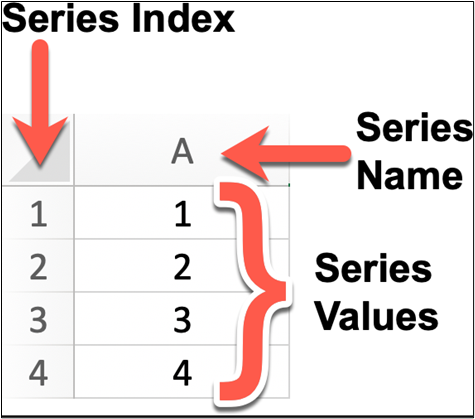

**特点**：

- 一维数组：Series 中的每个元素都有一个对应的索引值。

- 索引： 每个数据元素都可以通过标签（索引）来访问，默认情况下索引是从 0 开始的整数，但你也可以自定义索引。

- 数据类型： Series 可以容纳不同数据类型的元素，包括整数、浮点数、字符串、Python 对象等。

- 大小不变性：Series 的大小在创建后是不变的，但可以通过某些操作（如 append 或 delete）来改变。

- 操作：Series 支持各种操作，如数学运算、统计分析、字符串处理等。

- 缺失数据：Series 可以包含缺失数据，Pandas 使用NaN（Not a Number）来表示缺失或无值。

- 自动对齐：当对多个 Series 进行运算时，Pandas 会自动根据索引对齐数据，这使得数据处理更加高效。

### 创建Series

#### 通过列表创建

```python
import pandas as pd

# 创建 Series
s = pd.Series([1, 3, 5, np.nan, 6, 8])
print(f"Series:\n{s}")

# 指定索引
s1 = pd.Series([4, 7, -5, 3], index=["a", "b", "c", "d"])
print(s1)
# a    4
# b    7
# c   -5
# d    3
# dtype: int64

# 指定索引和名称
s2 = pd.Series([4, 7, -5, 3], index=["a", "b", "c", "d"],name="hello_python")
print(s2)
# a    4
# b    7
# c   -5
# d    3
# Name: hello_python, dtype: int6
```

#### 通过字典创建

```python
import pandas as pd

dic = {"a": 4, "b": 7, "c": -5, "d": 3}
s = pd.Series(dic)
print(s)
# a    4
# b    7
# c   -5
# d    3
# dtype: int64
s1 = pd.Series(dic,index=["a","c"],name="aacc")
print(s1)
# a    4
# c   -5
```

### Series的常用属性

| **属性**              | **说明**                   |
| --------------------- | -------------------------- |
| **index**             | Series的索引对象           |
| **values**            | Series的值                 |
| **ndim**              | Series的维度               |
| **shape**             | Series的形状               |
| **size**              | Series的元素个数           |
| **dtype****或dtypes** | Series的元素类型           |
| **name**              | Series的名称               |
| **loc[]**             | 显式索引，按标签索引或切片 |
| **iloc[]**            | 隐式索引，按位置索引或切片 |
| **at[]**              | 使用标签访问单个元素       |
| **iat[]**             | 使用位置访问单个元素       |

```python
import pandas as pd
arrs = pd.Series([11,22,33,44,55],name="atguigu",index=["a","b","c","d","e"])
# print(arrs)
# index Series的索引对象
print(arrs.index)
for i in arrs.index:
    print(i)
# values    Series的值
print(arrs.values)
# ndim  Series的维度
print(arrs.ndim)
# shape Series的形状
print(arrs.shape)
# size  Series的元素个数
print(arrs.size)
# dtype或dtypes  Series的元素类型
print(arrs.dtype)
print(arrs.dtypes)
# name  Series的名称
print(arrs.name)
# loc[] 显式索引，按标签索引或切片
print(arrs.loc["c"])
print(arrs.loc["c":"d"])
# iloc[]    隐式索引，按位置索引或切片
print(arrs.iloc[0])
print(arrs.iloc[0:3])
# at[]  使用标签访问单个元素
print(arrs.at["a"])
# iat[] 使用位置访问单个元素
print(arrs.iat[3])
```

### Series的常用方法

| **方法**                      | **说明**                                                     |
| ----------------------------- | ------------------------------------------------------------ |
| **head()**                    | 查看前n行数据，默认5行                                       |
| **tail()**                    | 查看后n行数据，默认5行                                       |
| **isin()**                    | 元素是否包含在参数集合中                                     |
| **isna()**                    | 元素是否为缺失值（通常为 NaN 或 None）                       |
| **sum()**                     | 求和，会忽略 Series 中的缺失值                               |
| **mean()**                    | 平均值                                                       |
| **min()**                     | 最小值                                                       |
| **max()**                     | 最大值                                                       |
| **var()**                     | 方差                                                         |
| **std()**                     | 标准差                                                       |
| **median()**                  | 中位数                                                       |
| **mode()**                    | 众数（出现频率最高的值），如果有多个值出现的频率相同且都是最高频率，这些值都会被包含在返回的 Series 中 |
| **quantile(q,interpolation)** | 指定位置的分位数  q的取值范围是 0 到 1 之间的浮点数或浮点数列表，如quantile(0.5)表示计算中位数（即第 50 百分位数）;  interpolation：指定在计算分位数时，如果分位数位置不在数据点上，采用的插值方法。默认值是线性插值 'linear'，还有其他可选值如 'lower'、'higher'、'midpoint'、'nearest' 等 |
| **describe()**                | 常见统计信息                                                 |
| **value_count()**             | 每个元素的个数                                               |
| **count()**                   | 非缺失值元素的个数，如果要包含缺失值，用len()                |
| **drop_duplicates()**         | 去重                                                         |
| **unique()**                  | 去重后的数组                                                 |
| **nunique()**                 | 去重后元素个数                                               |
| **sample()**                  | 随机采样                                                     |
| **sort_index()**              | 按索引排序                                                   |
| **sort_values()**             | 按值排序                                                     |
| **replace()**                 | 用指定值代替原有值                                           |
| **to_frame()**                | 将Series转换为DataFrame                                      |
| **equals()**                  | 判断两个Series是否相同                                       |
| **keys()**                    | 返回Series的索引对象                                         |
| **corr()**                    | 计算与另一个Series的相关系数   默认使用皮尔逊相关系数（Pearson correlation coefficient）来计算相关性。要求参与比较的数组元素类型都是数值型。  当相关系数为 1 时，表示两个变量完全正相关，即一个变量增加，另一个变量也随之增加。  当相关系数为 -1 时，表示两个变量完全负相关，即一个变量增加，另一个变量随之减少。  当相关系数为 0 时，表示两个变量之间不存在线性相关性。  例如，分析某地区的气温和冰淇淋销量之间的关系 |
| **cov()**                     | 计算与另一个Series的协方差                                   |
| **hist()**                    | 绘制直方图，用于展示数据的分布情况。它将数据划分为若干个区间（也称为 “bins”），并统计每个区间内数据的频数。  需要安装matplotlib包 |
| **items()**                   | 获取索引名以及值                                             |

```python
import pandas as pd
import numpy as np
arrs = pd.Series([11,22,np.nan,None,44,22],index=['a','b','c','d','e','f'])
# head()    查看前n行数据，默认5行
print(arrs.head())
# tail()    查看后n行数据，默认5行
print(arrs.tail(3))
# isin()    判断数组中的每一个元素是否包含在参数集合中
print(arrs.isin([11]))
# isna()    元素是否为缺失值
print(arrs.isna())
# sum() 求和，会忽略 Series 中的缺失值
print(arrs.sum())
# mean()    平均值
print(arrs.mean())
# min() 最小值
print(arrs.min())
# max() 最大值
print(arrs.max())
# var() 方差
print(arrs.var())
# std() 标准差
print(arrs.std())
# print(arrs.var())
# median()  中位数
# 若数据集的元素个数为奇数，中位数就是排序后位于中间位置的数值。
# 若数据集的元素个数为偶数，中位数则是排序后中间两个数的平均值。
# 去除缺失值之后，arrs 就变成了 [11, 22, 44, 22]。
# 对 [11, 22, 44, 22] 进行排序，得到 [11, 22, 22, 44]
print(arrs.median())
# mode()    众数
print(arrs.mode())
# quantile()    指定位置的分位数，如quantile(0.5)
# 分位数：分位数是把一组数据按照从小到大的顺序排列后，分割成若干等份的数值点。
# 0.25 分位数就是将数据从小到大排序后，位于 25% 位置处的数值。
# 插值方法：当计算分位数时，若位置不是整数，就需要借助插值方法来确定分位数值。# "midpoint" 插值方法是指当分位数位置处于两个数据点之间时，取这两个数据点的
# 平均值作为分位数值。
# 对于有 n个数据点的有序数据集，q分位数的位置 i可以通过公式 i=(n−1)q来计
# 算。这里 n=4，q=0.25，则 i=(4−1)×0.25=0.75。这意味着 0.25 分位数处于第一个# 数据点（值为 11）和第二个数据点（值为 22）之间。使用 "midpoint" 插值方法，
# 分位数值就是这两个数据点的平均值，即 (11+22)÷2=16.5
print(arrs.quantile(0.25, interpolation="midpoint"))

# describe()    常见统计信息
print(arrs.describe())
# value_counts()    每个元素的个数
print(arrs.value_counts())
# count()   非缺失值元素的个数
print(arrs.count())
print(len(arrs))
# drop_duplicates() 去重  这里可以看出，底层None也作为NaN处理
print(arrs.drop_duplicates())
# unique()  去重后的数组
print(arrs.unique())

# nunique() 去重后非缺失值元素元素个数
print(arrs.nunique())
# sample()  随机采样
print(arrs.sample())

# sort_index()  按索引排序
print(arrs.sort_index())

# sort_values() 按值排序
print(arrs.sort_values())
# replace() 用指定值代替原有值
print(arrs.replace(22,"haha"))

# to_frame()    将Series转换为DataFrame
print(arrs.to_frame())

# equals()  判断两个Series是否相同
arr1 = pd.Series([1,2,3])
arr2 = pd.Series([1,2,3])
print(arr1.equals(arr2))
# keys()    返回Series的索引对象
print(arrs.index)
print(arrs.keys())
# corr()    计算与另一个Series的相关系数
# arr1.corr(arr2)：由于 arr1 和 arr2 的值完全相同，它们之间是完全正相关的，
#因此相关系数为 1。
# arr1.corr(arr3)：arr1 的值是递增的，而 arr3 的值是递减的，它们之间是完全
# 负相关的，所以相关系数为 -1。
# arr1.corr(arr4)：arr1 和 arr4 的值都是递增的，且变化趋势一致，它们之间是
# 完全正相关的，相关系数为 1。
# arr5.corr(arr6)：arr5 和 arr6 的值之间没有明显的线性关系，它们的相关系数
# 为 0。
arr3 = pd.Series([3,2,1])
arr4 = pd.Series([6,7,8])
arr5 = pd.Series([1, -1, 1, -1])
arr6 = pd.Series([1, 1, -1, -1])
print(arr1.corr(arr2))
print(arr1.corr(arr3))
print(arr1.corr(arr4))
print(arr5.corr(arr6))

# cov() 计算与另一个Series的协方差
# 协方差用于衡量两个变量的总体误差，其值的正负表示两个变量的变化方向关系：
# 正值表示同向变化，负值表示反向变化。
print(arr1.cov(arr3))

# hist()    绘制直方图
arr7 = pd.Series([3,2,1,1,1,2,2])
# 绘制直方图
# 直方图（Histogram）是一种用于展示数据分布的统计图表，它通过将数据划分为
# 若干个连续的区间（ bins ），统计每个区间内数据的频数或频率，并用矩形条的
# 高度表示该区间的数值分布情况
arr7.hist(bins=3)
# items()   获取索引名以及值
for i,v in arr7.items():
    print(i,v)

```

### Series的布尔索引

```python
import pandas as pd

s = pd.Series({"a": -1.2, "b": 3.5, "c": 6.8, "d": 2.9})
bools = s > s.mean()  # 将大于平均值的元素标记为 True
print(bools)
# a    False
# b     True
# c     True
# d    False
# dtype: bool
print(s[bools])
# b    3.5
# c    6.8
# dtype: float64

```

### Series的运算

#### Series与标量运算

```python
import pandas as pd

s = pd.Series({"a": -1.2, "b": 3.5, "c": 6.8, "d": 2.9})
print(s * 10)
# a   -12.0
# b    35.0
# c    68.0
# d    29.0
# dtype: float64

```

#### Series与Series运算

```python
import pandas as pd

s1 = pd.Series([1, 1, 1, 1])
s2 = pd.Series([2, 2, 2, 2], index=[1, 2, 3, 4])
print(s1 + s2)
# 0    NaN
# 1    3.0
# 2    3.0
# 3    3.0
# 4    NaN
# dtype: float64

```

## DataFrame

DataFrame是Pandas 中的另一个核心数据结构，类似于一个二维的表格或数据库中的数据表。它是一个表格型的数据结构，它含有一组有序的列，每列可以是不同的值类型（数值、字符串、布尔型值），既有行索引也有列索引

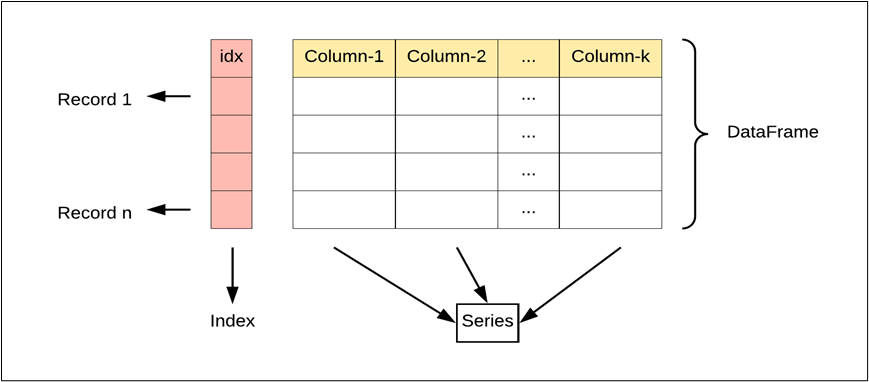

DataFrame中的数据是以一个或多个二维块存放的（而不是列表、字典或别的一维数据结构）。它可以被看做由Series组成的字典（共同用一个索引）。提供了各种功能来进行数据访问、筛选、分割、合并、重塑、聚合以及转换等操作，广泛用于数据分析、清洗、转换、可视化等任务。

​                                   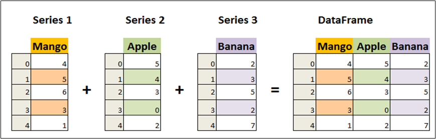

### DataFrame的创建

#### 通过字典创建

```python
import pandas as pd

df = pd.DataFrame({"id": [101, 102, 103], "name": ["张三", "李四", "王五"], "age": [20, 30, 40]})
print(df)
#     id name  age
# 0  101   张三   20
# 1  102   李四   30
# 2  103   王五   40

# 创建时指定列的顺序和行索引
# 需要安装hypothesis 、pytest
df = pd.DataFrame(
    data={"age": [20, 30, 40], "name": ["张三", "李四", "王五"]}, columns=["name", "age"], index=[101, 102, 103]
)
print(df)
#     name  age
# 101   张三   20
# 102   李四   30
# 103   王五   40

```

### DataFrame的常用属性

| **属性**    | **说明**                       |
| ----------- | ------------------------------ |
| **index**   | DataFrame的行索引              |
| **columns** | DataFrame的列标签              |
| **values**  | DataFrame的值                  |
| **ndim**    | DataFrame的维度                |
| **shape**   | DataFrame的形状                |
| **size**    | DataFrame的元素个数            |
| **dtypes**  | DataFrame的元素类型            |
| **T**       | 行列转置                       |
| **loc[]**   | 显式索引，按行列标签索引或切片 |
| **iloc[]**  | 隐式索引，按行列位置索引或切片 |
| **at[]**    | 使用行列标签访问单个元素       |
| **iat[]**   | 使用行列位置访问单个元素       |

```python
import pandas as pd
df = pd.DataFrame(data={"id": [101, 102, 103], "name": ["张三", "李四", "王五"], "age": [20, 30, 40]},index=["aa", "bb", "cc"])
# index DataFrame的行索引
print(df.index)
# columns   DataFrame的列标签
print(df.columns)
# values    DataFrame的值
print(df.values)
# ndim  DataFrame的维度
print(df.ndim)
# shape DataFrame的形状
print(df.shape)
# size  DataFrame的元素个数
print(df.size)
# dtypes    DataFrame的元素类型
print(df.dtypes)
# T 行列转置
print(df.T)
# loc[] 显式索引，按行列标签索引或切片 逗号前是行切片规则，后是列切片规则
print(df.loc["aa":"cc"])
print(df.loc[:,["id","name"]])
# iloc[]    隐式索引，按行列位置索引或切片
print(df.iloc[0:1])
print(df.iloc[0:3,2])
print("----------")
# at[]  使用行列标签访问单个元素
print(df.at["aa","name"])
# iat[] 使用行列位置访问单个元素
print(df.iat[0,1])

```

### DataFrame的常用方法

| **方法**              | **说明**                                                     |
| --------------------- | ------------------------------------------------------------ |
| **head()**            | 查看前n行数据，默认5行                                       |
| **tail()**            | 查看后n行数据，默认5行                                       |
| **isin()**            | 元素是否包含在参数集合中                                     |
| **isna()**            | 元素是否为缺失值                                             |
| **sum()**             | 求和                                                         |
| **mean()**            | 平均值                                                       |
| **min()**             | 最小值                                                       |
| **max()**             | 最大值                                                       |
| **var()**             | 方差                                                         |
| **std()**             | 标准差                                                       |
| **median()**          | 中位数                                                       |
| **mode()**            | 众数                                                         |
| **quantile()**        | 指定位置的分位数，如quantile(0.5)                            |
| **describe()**        | 常见统计信息                                                 |
| **info()**            | 基本信息                                                     |
| **value_counts()**    | 每个元素的个数                                               |
| **count()**           | 非空元素的个数                                               |
| **drop_duplicates()** | 去重                                                         |
| **sample()**          | 随机采样                                                     |
| **replace()**         | 用指定值代替原有值                                           |
| **equals()**          | 判断两个DataFrame是否相同                                    |
| **cummax()**          | 累计最大值                                                   |
| **cummin()**          | 累计最小值                                                   |
| **cumsum()**          | 累计和                                                       |
| **cumprod()**         | 累计积                                                       |
| **diff()**            | 一阶差分，对序列中的元素进行差分运算，也就是用当前元素减去前一个元素得到差值，默认情况下，它会计算一阶差分，即相邻元素之间的差值。参数：  periods：整数，默认为 1。表示要向前或向后移动的周期数，用于计算差值。正数表示向前移动，负数表示向后移动。  axis：指定计算的轴方向。0 或 'index' 表示按列计算，1 或 'columns' 表示按行计算，默认值为 0。 |
| **sort_index()**      | 按行索引排序                                                 |
| **sort_values()**     | 按某列的值排序，可传入列表来按多列排序，并通过ascending参数设置升序或降序 |
| **nlargest()**        | 返回某列最大的n条数据                                        |
| **nsmallest()**       | 返回某列最小的n条数据                                        |

```python
"""
	在Pandas的 DataFrame 方法里，axis 是一个非常重要的参数，它用于指定操作的方向。
	axis 参数可以取两个主要的值，即 0 或 'index'，以及 1 或 'columns' ，其含义如下：
	axis=0 或 axis='index'：表示操作沿着行的方向进行，也就是对每一列的数据进行处理。例如，当计算每列的均值时，就是对每列中的所有行数据进行计算。
	axis=1 或 axis='columns'：表示操作沿着列的方向进行，也就是对每行的数据进行处理。例如，当计算每行的总和时，就是对每行中的所有列数据进行计算。
"""
import pandas as pd

df = pd.DataFrame(data={"id": [101, 102, 103,104,105,106,101], "name": ["张三", "李四", "王五","赵六","冯七","周八","张三"], "age": [10, 20, 30, 40, None, 60,10]},index=["aa", "bb", "cc", "dd", "ee", "ff","aa"])
# head()    查看前n行数据，默认5行
print(df.head())
# tail()    查看后n行数据，默认5行
print(df.tail())
# isin()    元素是否包含在参数集合中
print(df.isin([103,106]))
# isna()    元素是否为缺失值
print(df.isna())
# sum() 求和
print(df["age"].sum())
# mean()    平均值
print(df["age"].mean())
# min() 最小值
print(df["age"].min())
# max() 最大值
print(df["age"].max())
# var() 方差
print(df["age"].var())
# std() 标准差
print(df["age"].std())
# median()  中位数
print(df["age"].median())
# mode()    众数
print(df["age"].mode())
# quantile()    指定位置的分位数，如quantile(0.5)
print(df["age"].quantile(0.5))
# describe()    常见统计信息
print(df.describe())
# info()    基本信息
print(df.info())
# value_counts()    每个元素的个数
print(df.value_counts())
# count()   非空元素的个数
print(df.count())
# drop_duplicates() 去重  duplicated()判断是否为重复行
print(df.duplicated(subset="age"))
# sample()  随机采样
print(df.sample())
# replace() 用指定值代替原有值
print("----------------")
print(df.replace(20,"haha"))
# equals()  判断两个DataFrame是否相同
df1 = pd.DataFrame(data={"id": [101, 102, 103], "name": ["张三", "李四", "王五"], "age": [10, 20, 30]})
df2 = pd.DataFrame(data={"id": [101, 102, 103], "name": ["张三", "李四", "王五"], "age": [10, 20, 30]})
print(df1.equals(df2))
# cummax()  累计最大值
df3 = pd.DataFrame({'A': [2, 5, 3, 7, 4],'B': [1, 6, 2, 8, 3]})
# 按列  等价于axis=0 默认
print(df3.cummax(axis="index"))
# 按行  等价于axis=1
print(df3.cummax(axis="columns"))
# cummin()  累计最小值
print(df3.cummin())
# cumsum()  累计和
print(df3.cumsum())
# cumprod() 累计积
print(df3.cumprod())
# diff()    一阶差分
print(df3.diff())
# sort_index()  按行索引排序
print(df.sort_index())
# sort_values() 按某列的值排序，可传入列表来按多列排序，并通过ascending参数设置升序或降序
print(df.sort_values(by="age"))
# nlargest()    返回某列最大的n条数据
print(df.nlargest(n=2,columns="age"))
# nsmallest()   返回某列最小的n条数据
print(df.nsmallest(n=1,columns="age"))

```

### DataFrame的布尔索引

```python
import pandas as pd

df = pd.DataFrame(
    data={"age": [20, 30, 40, 10], "name": ["张三", "李四", "王五", "赵六"]},
    columns=["name", "age"],
    index=[101, 104, 103, 102],
)
print(df["age"] > 25)
print(df[df["age"] > 25])
#101    False
#104     True
#103     True
#102    False
Name: age, dtype: bool
#     name  age
# 104   李四   30
# 103   王五   40

```

### DataFrame的运算

#### DataFrame与标量运算

```python
import pandas as pd

df = pd.DataFrame(
    data={"age": [20, 30, 40, 10], "name": ["张三", "李四", "王五", "赵六"]},
    columns=["name", "age"],
    index=[101, 104, 103, 102],
)
print(df * 2)
#      name  age
# 101  张三张三   40
# 104  李四李四   60
# 103  王五王五   80
# 102  赵六赵六   20

```

#### DataFrame与DataFrame运算

```python
import pandas as pd

df1 = pd.DataFrame(
    data={"age": [10, 20, 30, 40], "name": ["张三", "李四", "王五", "赵六"]},
    columns=["name", "age"],
    index=[101, 102, 103, 104],
)
df2 = pd.DataFrame(
    data={"age": [10, 20, 30, 40], "name": ["张三", "李四", "王五", "田七"]},
    columns=["name", "age"],
    index=[102, 103, 104, 105],
)
print(df1 + df2)
#      name   age
# 101   NaN   NaN
# 102  李四张三  30.0
# 103  王五李四  50.0
# 104  赵六王五  70.0
# 105   NaN   NaN

```

### DataFrame的更改操作

#### 设置行索引

```python
import pandas as pd

df = pd.DataFrame({"age": [20, 30, 40, 10], "name": ["张三", "李四", "王五", "赵六"], "id": [101, 102, 103, 104]})
print(df)
#    age name   id
# 0   20   张三  101
# 1   30   李四  102
# 2   40   王五  103
# 3   10   赵六  104


# inplace=True：这是一个布尔类型的参数。当设为 True 时，会直接在原 
# DataFrame上进行修改；若设为 False（默认值），则会返回一个新的 
# DataFrame，原DataFrame 保持不变
df.set_index("id", inplace=True)  # 设置行索引
print(df)
#      age name
# id
# 101   20   张三
# 102   30   李四
# 103   40   王五
# 104   10   赵六


df.reset_index(inplace=True)  # 重置索引
print(df)
#     id  age name
# 0  101   20   张三
# 1  102   30   李四
# 2  103   40   王五
# 3  104   10   赵六

```

#### 修改行索引名和列名

```python
import pandas as pd

df = pd.DataFrame({"age": [20, 30, 40, 10], "name": ["张三", "李四", "王五", "赵六"], "id": [101, 102, 103, 104]})
df.set_index("id", inplace=True)
print(df)
#      age name
# id
# 101   20   张三
# 102   30   李四
# 103   40   王五
# 104   10   赵六

df.rename(index={101: "一", 102: "二", 103: "三", 104: "四"}, columns={"age": "年龄", "name": "姓名"}, inplace=True)
print(df)
#     年龄  姓名
# id
# 一   20  张三
# 二   30  李四
# 三   40  王五
# 四   10  赵六


df.index = ["Ⅰ", "Ⅱ", "Ⅲ", "Ⅳ"]
df.columns = ["年齡", "名稱"]
print(df)
#    年齡  名稱
# Ⅰ  20  张三
# Ⅱ  30  李四
# Ⅲ  40  王五
# Ⅳ  10  赵六

```

#### 列操作

```python
import pandas as pd

# 添加
df["phone"] = ["13333333333", "14444444444", "15555555555", "16666666666"]
print(df)
#      age name          phone
# id
# 101   20   张三   13333333333
# 102   30   李四   14444444444
# 103   40   王五   15555555555
# 104   10   赵六   16666666666


#删除
df.drop("phone", axis=1, inplace=True)  # 删除phone，按列删除，inplace=True表示直接在原对象上修改
print(df)
#      age name
# id
# 101   20   张三
# 102   30   李四
# 103   40   王五
# 104   10   赵六

del df["phone"]
print(df)
#      age name
# id
# 101   20   张三
# 102   30   李四
# 103   40   王五
# 104   10   赵六


#插入
df.insert(loc=0, column="phone", value=df["age"] * df.index)
print(df)
#      phone  age name
# id
# 101   2020   20   张三
# 102   3060   30   李四
# 103   4120   40   王五
# 104   1040   10   赵六

```

### DataFrame数据的导入与导出

#### 导出

| **方法**           | **说明**                                                     |
| ------------------ | ------------------------------------------------------------ |
| **to_csv()**       | 将数据保存为csv格式文件，数据之间以逗号分隔，可通过sep参数设置使用其他分隔符，可通过index参数设置是否保存行标签，可通过header参数设置是否保存列标签。 |
| **to_pickle()**    | 如要保存的对象是计算的中间结果，或者保存的对象以后会在Python中复用，可把对象保存为.pickle文件。如果保存成pickle文件，只能在python中使用。文件的扩展名可以是.p、.pkl、.pickle。 |
| **to_excel()**     | 保存为Excel文件，需安装openpyxl包。                          |
| **to_clipboard()** | 保存到剪切板。                                               |
| **to_dict()**      | 保存为字典。                                                 |
| **to_hdf()**       | 保存为HDF格式，需安装tables包。                              |
| **to_html()**      | 保存为HTML格式，需安装lxml、html5lib、beautifulsoup4包。     |
| **to_json()**      | 保存为JSON格式。                                             |
| **to_feather()**   | feather是一种文件格式，用于存储二进制对象。feather对象也可以加载到R语言中使用。feather格式的主要优点是在Python和R语言之间的读写速度要比csv文件快。feather数据格式通常只用中间数据格式，用于Python和R之间传递数据，一般不用做保存最终数据。需安装pyarrow包。 |
| **to_sql()**       | 保存到数据库。                                               |

```python
import os
import pandas as pd

os.makedirs("data", exist_ok=True)
df = pd.DataFrame({"age": [20, 30, 40, 10], "name": ["张三", "李四", "王五", "赵六"], "id": [101, 102, 103, 104]})
df.set_index("id", inplace=True)

df.to_csv("data/df.csv")
df.to_csv("data/df.tsv", sep="\t")  # 设置分隔符为 \t
df.to_csv("data/df_noindex.csv", index=False)  # index=False 不保存行索引
df.to_pickle("data/df.pkl")
df.to_excel("data/df.xlsx")
df.to_clipboard()
df_dict = df.to_dict()
df.to_hdf("data/df.h5", key="df")
df.to_html("data/df.html")
df.to_json("data/df.json")
df.to_feather("data/df.feather")

```

#### 导入

| **方法**             | **说明**                                                     |
| -------------------- | ------------------------------------------------------------ |
| **read_csv()**       | 加载csv格式的数据。可通过sep参数指定分隔符，可通过index_col参数指定行索引。 |
| **read_pickle()**    | 加载pickle格式的数据。                                       |
| **read_excel()**     | 加载Excel格式的数据。                                        |
| **read_clipboard()** | 加载剪切板中的数据。                                         |
| **read_hdf()**       | 加载HDF格式的数据。                                          |
| **read_html()**      | 加载HTML格式的数据。                                         |
| **read_json()**      | 加载JSON格式的数据。                                         |
| **read_feather()**   | 加载feather格式的数据。                                      |
| **read_sql()**       | 加载数据库中的数据。                                         |

```python
import pandas as pd

df_csv = pd.read_csv("data/df.csv", index_col="id")  # 指定行索引
df_tsv = pd.read_csv("data/df.tsv", sep="\t")  # 指定分隔符
df_pkl = pd.read_pickle("data/df.pkl")
df_excel = pd.read_excel("data/df.xlsx", index_col="id")
df_clipboard = pd.read_clipboard(index_col="id")
df_from_dict = pd.DataFrame(df_dict)
df_hdf = pd.read_hdf("data/df.h5", key="df")
df_html = pd.read_html("data/df.html", index_col=0)[0]
df_json = pd.read_json("data/df.json")
df_feather = pd.read_feather("data/df.feather")

print(df_csv)
print(df_tsv)
print(df_pkl)
print(df_excel)
print(df_clipboard)
print(df_from_dict)
print(df_hdf)
print(df_html)
print(df_json)
print(df_feather)

```

## 日期数据处理

### to_datetime()

| **参数名**                | **说明**                                                     |
| ------------------------- | ------------------------------------------------------------ |
| **arg**                   | 要转换为日期时间的对象                                       |
| **errors**                | ignore,raise,coerce, 默认为ignore,表示无效的解析将会返回原值 |
| **dayfirst**              | 指定日期解析顺序。如果为True，则以日期开头解析日期，例如：“10/11/12”解析为2012-11-10。默认false |
| **yearfirst**             | 如果为True，则以日期开头解析，例如：“10/11/12”解析为2010-11-12。如果dayfirst和yearfirst都为True，则yearfirst在前面。默认false。当日期字符串格式不明确时，指定年份是否在最前面。当日期字符串是 '2010/1/4' 这种形式，由于年份是 4 位数字，pandas 能很清晰地识别出这是年份，所以即使 yearfirst 为 False，也不会影响其正确解析 |
| **utc**                   | 返回utc，即协调世界时间                                      |
| **format**                | 格式化显示时间的格式，字符串，默认值为None                   |
| **exact**                 | 要求格式完全匹配                                             |
| **unit**                  | 参数的单位表示时间的单位                                     |
| **infer_datetime_format** | 如果为True且未给出格式，则尝试基于第一个非nan元素推断datetime字符串的格式，如果可以推断，则切换到更快的解析方法。在某些情况下，这可以将解析速度提高5-10倍。 |
| **origin**                | 默认值为unix,定义参考日期1970-01-01                          |
| **cache**                 | 使用唯一的已转换日期缓存来应用日期时间转换。在解析重复日期字符串时产生显著的加速。 |

```python
import pandas as pd
df = pd.DataFrame({"gmv":[100,200,300,400],"trade_date":["2025-01-06","2023-10-31","2023-12-31","2023-01-05"]})
df["ymd"] = pd.to_datetime(df["trade_date"])
print(df)
```

### 时间属性访问器对象Series.dt

1. 获取年月日

```python
df['week']=df['ymd'].dt.day_name()
print(df)
```

2. 获取星期

```python
df['week']=df['ymd'].dt.day_name()
print(df)
```

3. 获取日期所在季度

```python
df['quarter']=df['ymd'].dt.quarter
print(df)
```

4. 判断日期是否月底年底

```python
df['mend']=df['ymd'].dt.is_month_end
df['yend']=df['ymd'].dt.is_year_end
print(df)
```

### to_period()

freq：这是 to_period() 方法最重要的参数，用于指定要转换的时间周期频率

常见的取值如下：

-  "D"：按天周期，例如 2024-01-01 会转换为 2024-01-01 这个天的周期。

- "W"：按周周期，通常以周日作为一周的结束，比如日期落在某一周内，就会转换为该周的周期表示。

- "M"：按月周期，像 2024-05-15 会转换为 2024-05。

- "Q"：按季度周期，一年分为四个季度，日期会转换到对应的季度周期，例如 2024Q2 。

- "A" 或 "Y"：按年周期，如 2024-07-20 会转换为 2024 

```python
df["ystat"] = df["ymd"].dt.to_period("Y")
df["mstat"] = df["ymd"].dt.to_period("M")
df["qstat"] = df["ymd"].dt.to_period("Q")
df["wstat"] = df["ymd"].dt.to_period("W")
print(df)
```

## 数据分析

### 加载数据集

使用weather（天气）数据集。其中包含6个字段：

- date：日期，年-月-日格式。

- precipitation：降水量。

- temp_max：最高温度。

- temp_min：最低温度。

- wind：风力。

- weather：天气状况。

```python
import pandas as pd

df = pd.read_csv("data/weather.csv")
print(type(df))  # 查看df类型
print(df.shape)  # 查看df形状
print(df.columns)  # 查看df的列名
print(df.dtypes)  # 查看df各列数据类型
df.info()  # 查看df基本信息
```

pandas与Python常用数据类型对照：

| **pandas****类型** | **Python****类型** | **说明**     |
| ------------------ | ------------------ | ------------ |
| **object**         | string             | 字符串类型   |
| **int64**          | int                | 整型         |
| **float64**        | float              | 浮点型       |
| **datetime64**     | datetime           | 日期时间类型 |

### 查看部分数据

1. 通过head()、tail()获取前n行或后n行

```python
print(df.head())
print(df.tail(10))
```

2. 获取一列或多列数据

```python
df_date_series = df["date"]  # 返回的是Series
df_date_dataframe = df[["date"]]  # 返回的是DataFrame
```

3. 按行获取数据

（1）**loc**：通过行标签获取数据

```python
df.loc[1]  # 获取行标签为1的数据

df.loc[[1, 10, 100]]  # 获取行标签分别为1、10、100的数据
```

（2）**iloc**：通过行位置获取数据

```python
df.iloc[0]  # 获取行位置为0的数据

df.iloc[-1]  # 获取行位置为最后一位的数据
```

4. 获取指定行与列的数据

```python
df.loc[1, "precipitation"]  # 获取行标签为1，列标签为precipitation的数据

df.loc[:, "precipitation"]  # 获取所有行，列标签为precipitation的数据

df.iloc[:, [3, 5, -1]]  # 获取所有行，列位置为3，5，最后一位的数据

df.iloc[:10, 2:6]  # 获取前10行，列位置为2、3、4、5的数据

df.loc[:10, ["date", "precipitation", "temp_max", "temp_min"]]  # 通过行列标签获取数据
```

## 分组聚合计算

```python
"""
	df.groupby("分组字段")["要聚合的字段"].聚合函数()
	df.groupby(["分组字段", "分组字段2", ...])[["要聚合的字段", "要聚合的字段2", ...]].聚合函数()
"""

df["month"] = pd.to_datetime(df["date"]).dt.to_period("M").astype(str)  # 将date转换为 年-月 的格式

df_groupby_date = df.groupby("month")  # 按month分组，返回一个分组对象(DataFrameGroupBy)
month_temp = df_groupby_date[["temp_max", "temp_min"]]  # 从分组对象中选择特定的列
month_temp_mean = month_temp.mean()  # 对每个列求平均值

# 以上代码可以写在一起
month_temp_mean = df.groupby("month")[["temp_max", "temp_min"]].mean()
#           temp_max   temp_min
# month
# 2012-01   7.054839   1.541935
# 2012-02   9.275862   3.203448
# 2012-03   9.554839   2.838710
# 2012-04  14.873333   5.993333
# 2012-05  17.661290   8.190323


df.groupby("month")["weather"].nunique()
# date
# 2012-01    4
# 2012-02    4
# 2012-03    4
# 2012-04    4
```

## 基本绘图

plot()：pandas 提供的绘图方法，它基于 matplotlib 库。将前面计算得到的均值结果绘制成图表，默认情况下会绘制折线图，其中 "month" 作为 x 轴，"temp_max" 和 "temp_min" 的均值作为 y 轴

```python
df.groupby("month")[["temp_max", "temp_min"]].mean().plot()  # 使用plot绘制折线图
```

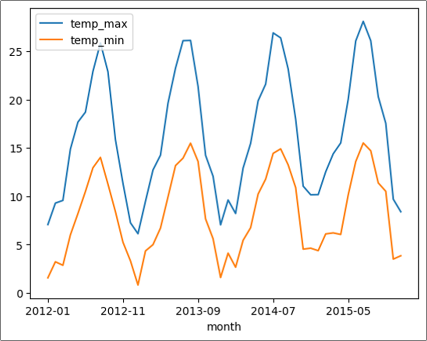

## 常用统计值

```python
df.describe()  # 查看常用统计信息
df.describe().T  # 行列转置

df.describe(include="all")  # 统计所有列
df.describe(include=["float64"])  # 只统计数据类型为float64的列
```

## 常用排序方法

**nlargest(n, [列名1, 列名2, …])**：按列排序的最大n个

**nsmallest(n, [列名1, 列名2, …])**：按列排序的最小n个

**sort_values([列名1, 列名2, …], asceding=[True, False, …])**：按列升序或降序排序

**drop_duplicates(subset=[列名1, 列名2])：**按列去重

## Pandas 的数据组合函数

### concat 连接

#### Series与Series连接

```python
s1 = pd.Series(["A", "B"], index=[1, 2])
s2 = pd.Series(["D", "E"], index=[4, 5])
s3 = pd.Series(["G", "H"], index=[7, 8])

pd.concat([s1, s2, s3])  # 按行连接
# 1    A
# 2    B
# 4    D
# 5    E
# 7    G
# 8    H
# dtype: object

pd.concat([s1, s2, s3], axis=1)  # 按列连接
#      0    1    2
# 1    A  NaN  NaN
# 2    B  NaN  NaN
# 4  NaN    D  NaN
# 5  NaN    E  NaN
# 7  NaN  NaN    G
# 8  NaN  NaN    H

```

#### DataFrame与Series连接

```python
df1 = pd.DataFrame(data={"a": [1, 2], "b": [4, 5]}, index=[1, 2])
s1 = pd.Series(data=[7, 10], index=[1, 2], name="a")

pd.concat([df1, s1])  # 按行连接
#     a    b
# 1   1  4.0
# 2   2  5.0
# 1   7  NaN
# 2  10  NaN

pd.concat([df1, s1], axis=1)  # 按列连接
#    a  b   a
# 1  1  4   7
# 2  2  5  10

```

#### DataFrame与DataFrame连接

```python
df1 = pd.DataFrame(data={"a": [1, 2], "b": [4, 5]}, index=[1, 2])
df2 = pd.DataFrame(data={"a": [7, 8], "b": [10, 11]}, index=[1, 2])

pd.concat([df1, df2])  # 按行连接
#    a   b
# 1  1   4
# 2  2   5
# 1  7  10
# 2  8  11

pd.concat([df1, df2], axis=1)  # 按列连接
#    a  b  a   b
# 1  1  4  7  10
# 2  2  5  8  11
```

#### 重置索引

```python
df1 = pd.DataFrame(data={"a": [1, 2], "b": [4, 5]}, index=[1, 2])
df2 = pd.DataFrame(data={"a": [7, 8], "b": [10, 11]}, index=[1, 2])

pd.concat([df1, df2], ignore_index=True)  # 重置索引
#    a   b
# 0  1   4
# 1  2   5
# 2  7  10
# 3  8  11
```

#### 类似join的连接

默认的合并方式是对其他轴进行并集合并（join=outer），可以用join=inner实现其他轴上的交集合并

```python
df1 = pd.DataFrame(data={"a": [1, 2], "b": [4, 5]}, index=[1, 2])
df2 = pd.DataFrame(data={"b": [7, 8], "c": [10, 11]}, index=[2, 3])

pd.concat([df1, df2])
#      a  b     c
# 1  1.0  4   NaN
# 2  2.0  5   NaN
# 2  NaN  7  10.0
# 3  NaN  8  11.0

pd.concat([df1, df2], join="inner")
#    b
# 1  4
# 2  5
# 2  7
# 3  8
```

### merge 合并

#### 数据连接的类型

1. 一对一连接

```python
df1 = pd.DataFrame(
    {"employee": ["Bob", "Jake", "Lisa", "Sue"], "group": ["Accounting", "Engineering", "Engineering", "HR"]}
)
df2 = pd.DataFrame({"employee": ["Lisa", "Bob", "Jake", "Sue"], "hire_date": [2004, 2008, 2012, 2014]})
print(df1)
#   employee        group
# 0      Bob   Accounting
# 1     Jake  Engineering
# 2     Lisa  Engineering
# 3      Sue           HR
print(df2)
#   employee  hire_date
# 0     Lisa       2004
# 1      Bob       2008
# 2     Jake       2012
# 3      Sue       2014
# 通过相同的字段名employee进行关联的
df3 = pd.merge(df1, df2)
print(df3)
#   employee        group  hire_date
# 0      Bob   Accounting       2008
# 1     Jake  Engineering       2012
# 2     Lisa  Engineering       2004
# 3      Sue           HR       2014
```

------

2. 多对一连接

在需要连接的两个列中，有一列的值有重复。通过多对一连接获得的结果将会保留重复值

```python
df1 = pd.DataFrame(
    {"employee": ["Bob", "Jake", "Lisa", "Sue"], "group": ["Accounting", "Engineering", "Engineering", "HR"]}
)
df2 = pd.DataFrame({"group": ["Accounting", "Engineering", "HR"], "supervisor": ["Carly", "Guido", "Steve"]})
print(df1)
#   employee        group
# 0      Bob   Accounting
# 1     Jake  Engineering
# 2     Lisa  Engineering
# 3      Sue           HR
print(df2)
#          group supervisor
# 0   Accounting      Carly
# 1  Engineering      Guido
# 2           HR      Steve
df3 = pd.merge(df1, df2)
print(df3)
#   employee        group supervisor
# 0      Bob   Accounting      Carly
# 1     Jake  Engineering      Guido
# 2     Lisa  Engineering      Guido
# 3      Sue           HR      Steve
```

3. 多对多连接

```python
df1 = pd.DataFrame(
    {"employee": ["Bob", "Jake", "Lisa", "Sue"], "group": ["Accounting", "Engineering", "Engineering", "HR"]}
)
df2 = pd.DataFrame(
    {
        "group": ["Accounting", "Accounting", "Engineering", "Engineering", "HR", "HR"],
        "skills": ["math", "spreadsheets", "coding", "linux", "spreadsheets", "organization"],
    }
)
print(df1)
#   employee        group
# 0      Bob   Accounting
# 1     Jake  Engineering
# 2     Lisa  Engineering
# 3      Sue           HR
print(df2)
#          group        skills
# 0   Accounting          math
# 1   Accounting  spreadsheets
# 2  Engineering        coding
# 3  Engineering         linux
# 4           HR  spreadsheets
# 5           HR  organization
df3 = pd.merge(df1, df2)
print(df3)
#   employee        group        skills
# 0      Bob   Accounting          math
# 1      Bob   Accounting  spreadsheets
# 2     Jake  Engineering        coding
# 3     Jake  Engineering         linux
# 4     Lisa  Engineering        coding
# 5     Lisa  Engineering         linux
# 6      Sue           HR  spreadsheets
# 7      Sue           HR  organization

```

#### 设置合并的键与索引

1. 通过on指定使用某个列连接，只能在有共同列名的时候使用

```python
df1 = pd.DataFrame(
    {"employee": ["Bob", "Jake", "Lisa", "Sue"], "group": ["Accounting", "Engineering", "Engineering", "HR"]}
)
df2 = pd.DataFrame({"employee": ["Lisa", "Bob", "Jake", "Sue"], "hire_date": [2004, 2008, 2012, 2014]})
print(df1)
#   employee        group
# 0      Bob   Accounting
# 1     Jake  Engineering
# 2     Lisa  Engineering
# 3      Sue           HR
print(df2)
#   employee  hire_date
# 0     Lisa       2004
# 1      Bob       2008
# 2     Jake       2012
# 3      Sue       2014
df3 = pd.merge(df1, df2, on="employee")
print(df3)
#   employee        group  hire_date
# 0      Bob   Accounting       2008
# 1     Jake  Engineering       2012
# 2     Lisa  Engineering       2004
# 3      Sue           HR       2014

```

2. 两对象列名不同，通过left_on和right_on分别指定列名

```python
df1 = pd.DataFrame(
    {"employee": ["Bob", "Jake", "Lisa", "Sue"], "group": ["Accounting", "Engineering", "Engineering", "HR"]}
)
df2 = pd.DataFrame({"name": ["Bob", "Jake", "Lisa", "Sue"], "salary": [70000, 80000, 120000, 90000]})
print(df1)
#   employee        group
# 0      Bob   Accounting
# 1     Jake  Engineering
# 2     Lisa  Engineering
# 3      Sue           HR
print(df2)
#    name  salary
# 0   Bob   70000
# 1  Jake   80000
# 2  Lisa  120000
# 3   Sue   90000
df3 = pd.merge(df1, df2, left_on="employee", right_on="name")
print(df3)
#   employee        group  name  salary
# 0      Bob   Accounting   Bob   70000
# 1     Jake  Engineering  Jake   80000
# 2     Lisa  Engineering  Lisa  120000
# 3      Sue           HR   Sue   90000

```

3. 通过left_index和right_index设置合并的索引

```python
df1 = pd.DataFrame(
    {"employee": ["Bob", "Jake", "Lisa", "Sue"], "group": ["Accounting", "Engineering", "Engineering", "HR"]}
)
df2 = pd.DataFrame({"employee": ["Lisa", "Bob", "Jake", "Sue"], "hire_date": [2004, 2008, 2012, 2014]})
df1.set_index("employee", inplace=True)
df2.set_index("employee", inplace=True)
print(df1)
#                 group
# employee
# Bob        Accounting
# Jake      Engineering
# Lisa      Engineering
# Sue                HR
print(df2)
#           hire_date
# employee
# Lisa           2004
# Bob            2008
# Jake           2012
# Sue            2014
# 设置索引后，如果不指定关联列会报错，建议通过以下方式指定，on="employee"也可#以实现，但是不同的解释器可能效果不一样，因为设置索引后，employee就不算是列了
df3 = pd.merge(df1, df2, left_index=True, right_index=True)
#                 group  hire_date
# employee
# Bob        Accounting       2008
# Jake      Engineering       2012
# Lisa      Engineering       2004
# Sue                HR       2014

```

> DataFrame实现了join()方法，可以按照索引进行数据合并。但要求没有重叠的列，或通过lsuffix、rsuffix指定重叠列的后缀

```python
import pandas as pd

df1 = pd.DataFrame({
    'key': ['A', 'B', 'C'],
    'value1': [1, 2, 3]
})

df2 = pd.DataFrame({
    'key': ['B', 'C', 'D'],
    'value2': [4, 5, 6]
})

# 合并两个 DataFrame，并处理列名冲突，如果通过on指定列，只是指定的df1。会用
df1指定的列和df2的索引连接，会报错。除非df2.set_index指定索引。
df1.join(df2,lsuffix='_left',rsuffix='_right')

```

#### 设置数据连接的集合操作规则

```python
df1 = pd.DataFrame({"name": ["Peter", "Paul", "Mary"], "food": ["fish", "beans", "bread"]}, columns=["name", "food"])
df2 = pd.DataFrame({"name": ["Mary", "Joseph"], "drink": ["wine", "beer"]}, columns=["name", "drink"])
print(df1)
#     name   food
# 0  Peter   fish
# 1   Paul  beans
# 2   Mary  bread
print(df2)
#      name drink
# 0    Mary  wine
# 1  Joseph  beer
print(pd.merge(df1, df2))
#    name   food drink
# 0  Mary  bread  wine

print(pd.merge(df1, df2, how="outer"))
#      name   food drink
# 0  Joseph    NaN  beer
# 1    Mary  bread  wine
# 2    Paul  beans   NaN
# 3   Peter   fish   NaN


print(pd.merge(df1, df2, how="left"))
#     name   food drink
# 0  Peter   fish   NaN
# 1   Paul  beans   NaN
# 2   Mary  bread  wine

```

#### 重复列名的处理

```python
df1 = pd.DataFrame({"name": ["Bob", "Jake", "Lisa", "Sue"], "rank": [1, 2, 3, 4]})
df2 = pd.DataFrame({"name": ["Bob", "Jake", "Lisa", "Sue"], "rank": [3, 1, 4, 2]})
print(df1)
#    name  rank
# 0   Bob     1
# 1  Jake     2
# 2  Lisa     3
# 3   Sue     4
print(df2)
#    name  rank
# 0   Bob     3
# 1  Jake     1
# 2  Lisa     4
# 3   Sue     2
print(pd.merge(df1, df2, on="name"))  # 不指定后缀名，默认为_x和_y
#    name  rank_x  rank_y
# 0   Bob       1       3
# 1  Jake       2       1
# 2  Lisa       3       4
# 3   Sue       4       2
print(pd.merge(df1, df2, on="name", suffixes=("_df1", "_df2")))  # 通过suffixes指定后缀名
#    name  rank_df1  rank_df2
# 0   Bob         1         3
# 1  Jake         2         1
# 2  Lisa         3         4
# 3   Sue         4         2

```

## Pandas 的缺失值处理函数

### 缺失值表示

- `NaN`、`pd.NA`、`None`
- `isnull()`、`isna()`、`notnull()`、`notna()`

### 查看缺失值

1. isnull()

```python
df = pd.read_csv("data/weather_withna.csv")
print(df.isnull().sum())
# date               0
# precipitation    303
# temp_max         303
# temp_min         303
# wind             303
# weather          303
# dtype: int64

```

2. missingno

先安装missingno包：``pip install missingno``

```python
import missingno as msno
import pandas as pd

df = pd.read_csv("data/weather_withna.csv")
msno.bar(df)
```

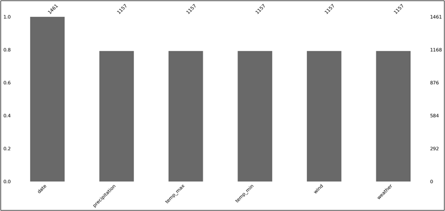

3. 通过热力图查看缺失值的相关性

missingno绘制的热力图能够展示数据集中不同列的缺失值之间的相关性。这里的相关性体现的是当某一列出现缺失值时，其他列出现缺失值的可能性。如果两个列的缺失值呈现正相关，意味着当其中一列有缺失值时，另一列也很可能有缺失值；若为负相关，则表示当一列有缺失值时，另一列更倾向于没有缺失值。

- 颜色与数值：热力图中的颜色和数值反映了列之间缺失值的相关性。接近 1 表示正相关，接近 -1 表示负相关，接近 0 则表示缺失值之间没有明显的关联。

- 示例说明：假如 A 列和 B 列在热力图中对应区域颜色较深且数值接近 1，这就表明当 A 列出现缺失值时，B 列也很可能出现缺失值；若数值接近 -1，情况则相反。

```python
msno.heatmap(df)
```

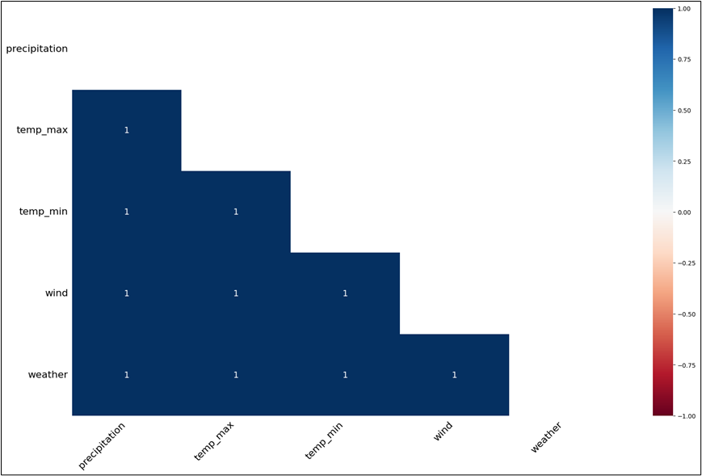

### 剔除缺失值

#### Series剔除缺失值

```python
s = pd.Series([1, pd.NA, None])
print(s)
# 0       1
# 1    <NA>
# 2    None
# dtype: object
print(s.dropna())
# 0    1
# dtype: object

```

#### DataFrame剔除缺失值

无法从DataFrame中单独剔除一个值，只能剔除缺失值所在的整行或整列。默认情况下，dropna()会剔除任何包含缺失值的整行数据

```python
df = pd.DataFrame([[1, pd.NA, 2], [2, 3, 5], [pd.NA, 4, 6]])
print(df)
#       0     1  2
# 0     1  <NA>  2
# 1     2     3  5
# 2  <NA>     4  6
print(df.dropna())
#    0  1  2
# 1  2  3  5

# 可以设置按不同的坐标轴剔除缺失值，比如axis=1（或 axis='columns'）会剔除任何包含缺失值的整列数据
df = pd.DataFrame([[1, pd.NA, 2], [2, 3, 5], [pd.NA, 4, 6]])
print(df)
#       0     1  2
# 0     1  <NA>  2
# 1     2     3  5
# 2  <NA>     4  6
print(df.dropna(axis=1))
#    2
# 0  2
# 1  5
# 2  6


# 有时只需要剔除全部是缺失值的行或列，或者绝大多数是缺失值的行或列。这些需求可以通过设置how或thresh参数来满足，它们可以设置剔除行或列缺失值的数量阈值
df = pd.DataFrame([[1, pd.NA, 2], [pd.NA, pd.NA, 5], [pd.NA, pd.NA, pd.NA]])
print(df)
#       0     1     2
# 0     1  <NA>     2
# 1  <NA>  <NA>     5
# 2  <NA>  <NA>  <NA>
print(df.dropna(how="all"))  # 如果所有值都是缺失值,则删除这一行
#       0     1  2
# 0     1  <NA>  2
# 1  <NA>  <NA>  5
print(df.dropna(thresh=2))  # 如果至少有2个值不是缺失值,则保留这一行
#    0     1  2
# 0  1  <NA>  2


# 可以通过设置subset参数来设置某一列有缺失值则进行剔除
df = pd.DataFrame([[1, pd.NA, 2], [pd.NA, pd.NA, 5], [pd.NA, pd.NA, pd.NA]])
print(df)
#       0     1     2
# 0     1  <NA>     2
# 1  <NA>  <NA>     5
# 2  <NA>  <NA>  <NA>
print(df.dropna(subset=[0]))  # 如果0列有缺失值,则删除这一行
#    0     1  2
# 0  1  <NA>  2

```

### 填充缺失值

#### 使用固定值填充

```python
df = pd.read_csv("data/weather_withna.csv")
print(df.fillna(0).tail())  # 使用固定值填充
#             date  precipitation  temp_max  temp_min  wind weather
# 1456  2015-12-27            0.0       0.0       0.0   0.0       0
# 1457  2015-12-28            0.0       0.0       0.0   0.0       0
# 1458  2015-12-29            0.0       0.0       0.0   0.0       0
# 1459  2015-12-30            0.0       0.0       0.0   0.0       0
# 1460  2015-12-31           20.6      12.2       5.0   3.8    rain
print(df.fillna({"temp_max": 60, "temp_min": -60}).tail())  # 使用字典来填充
#             date  precipitation  temp_max  temp_min  wind weather
# 1456  2015-12-27            NaN      60.0     -60.0   NaN     NaN
# 1457  2015-12-28            NaN      60.0     -60.0   NaN     NaN
# 1458  2015-12-29            NaN      60.0     -60.0   NaN     NaN
# 1459  2015-12-30            NaN      60.0     -60.0   NaN     NaN
# 1460  2015-12-31           20.6      12.2       5.0   3.8    rain

```

------

#### 使用统计值填充

```python
print(df.fillna(df[["precipitation", "temp_max", "temp_min", "wind"]].mean()).tail())  # 使用平均值填充
#             date  precipitation   temp_max  temp_min      wind weather
# 1456  2015-12-27       3.052332  15.851468  7.877202  3.242055     NaN
# 1457  2015-12-28       3.052332  15.851468  7.877202  3.242055     NaN
# 1458  2015-12-29       3.052332  15.851468  7.877202  3.242055     NaN
# 1459  2015-12-30       3.052332  15.851468  7.877202  3.242055     NaN
# 1460  2015-12-31      20.600000  12.200000  5.000000  3.800000    rain
```

#### 使用前后的有效值填充

```python
print(df.ffill().tail())  # 使用前面的有效值填充
#             date  precipitation  temp_max  temp_min  wind weather
# 1456  2015-12-27            0.0      11.1       4.4   4.8     sun
# 1457  2015-12-28            0.0      11.1       4.4   4.8     sun
# 1458  2015-12-29            0.0      11.1       4.4   4.8     sun
# 1459  2015-12-30            0.0      11.1       4.4   4.8     sun
# 1460  2015-12-31           20.6      12.2       5.0   3.8    rain
print(df.bfill().tail())  # 使用后面的有效值填充
#             date  precipitation  temp_max  temp_min  wind weather
# 1456  2015-12-27           20.6      12.2       5.0   3.8    rain
# 1457  2015-12-28           20.6      12.2       5.0   3.8    rain
# 1458  2015-12-29           20.6      12.2       5.0   3.8    rain
# 1459  2015-12-30           20.6      12.2       5.0   3.8    rain
# 1460  2015-12-31           20.6      12.2       5.0   3.8    rain
```

#### 通过线性插值填充

通过interpolate()方法进行线性插值填充。线性插值操作，就是用于在已知数据点之间估算未知数据点的值。interpolate 方法支持多种插值方法，可通过 method 参数指定，常见的方法有：

- 'linear'：线性插值，基于两点之间的直线来估算缺失值，适用于数据呈线性变化的情况。

- 'time'：适用于时间序列数据，会考虑时间间隔进行插值。

- 'polynomial'：多项式插值，通过拟合多项式曲线来估算缺失值，可通过 order 参数指定多项式的阶数。

```python
import pandas as pd
import numpy as np

# 创建包含缺失值的 Series
s = pd.Series([1, np.nan, 3, 4, np.nan, 6])
# 使用默认的线性插值方法填充缺失值
s_interpolated = s.interpolate()
print(s_interpolated)

# 0    1.0
# 1    2.0
# 2    3.0
# 3    4.0
# 4    5.0
# 5    6.0
# dtype: float64
```

## Pandas 的 apply 函数

### Series使用apply()

```python
import pandas as pd
# Series的apply方法调用的函数，参数接收的是Series中的一个元素
def func(item):
    return item * 20

s = pd.Series([10, 20, 30])
s.apply(func)


s.apply(lambda item: item * 20)

# apply()方法会将自己没有匹配上的参数，在调用func的时候作为func的参数传递过去,必须通过关键字传参
def func1(item,p1):
    return item * p1
s.apply(func1,p1=3)

```

### DataFrame使用apply

```python
# DataFrame的apply方法调用的函数，参数接收的是DataFrame中的一个Series
def func(s):
    return s.sum()

df = pd.DataFrame({"a": [10, 20, 30], "b": [40, 50, 60]})
df.apply(func)

#默认axis=0，按行方向进行操作，对列进行统计；
#可以设置axis=1，按照列的方向进行操作，对行进行统计
df.apply(func, axis=1)

```

> df.apply 一次只能处理一个 Series（当 axis=0 时处理列，当 axis=1 时处理行），但如下的函数 func中，获取同一个Series对象的两列数据a和b，所以不能直接使用 df.apply(f)按列处理了，需要指定axis=1,按行处理，才能获取一行中的不同列

```python
def func(s):
    return s["a"] / s["b"]

df = pd.DataFrame({"a": [10, 20, 30], "b": [40, 50, 60]})
print(df.apply(func, axis=1))
# 0    0.25
# 1    0.40
# 2    0.50
# dtype: float64

```

### 向量化函数

```python
def f(x, y):
    if y == 0:
        return np.nan
    return x / y

df = pd.DataFrame({"a": [10, 20, 30], "b": [40, 0, 60]})
print(f(df["a"], df["b"]))  # ValueError

```

------

上述代码会报错，因为y==0中，y为向量而0为标量

1. 可以通过np.vectorize()将函数向量化来进行计算

```python
def f(x, y):
    if y == 0:
        return np.nan
    return x / y

df = pd.DataFrame({"a": [10, 20, 30], "b": [40, 0, 60]})
f_vec = np.vectorize(f)
print(f_vec(df["a"], df["b"]))  # [0.25  nan 0.5 ]
```

2. 也可以使用@np.vectorize装饰器将函数向量化

```python
@np.vectorize
def f(x, y):
    if y == 0:
        return np.nan
    return x / y

df = pd.DataFrame({"a": [10, 20, 30], "b": [40, 0, 60]})
print(f(df["a"], df["b"]))  # [0.25  nan 0.5 ]
```

## 数据聚合、转换、过滤函数

### DataFrameGroupBy对象

```python
df = pd.read_csv("data/employees.csv")  # 读取员工数据
print(df.groupby("department_id"))  # 按department_id分组，返回DataFrameGroupBy对象
# <pandas.core.groupby.generic.DataFrameGroupBy object at 0x0000024FCBAFD700>
```

#### 查看分组

```python
print(df.groupby("department_id").groups)  # 查看分组结果
# {10.0: [100], 20.0: [101, 102], 30.0: [14, 15, 16, 17, 18, 19]...

# 通过get_group()方法获取分组
print(df.groupby("department_id").get_group(50))  # 获取分组为50的数据
#     employee_id first_name    last_name     email...
# 20          120    Matthew        Weiss    MWEISS...
# 21          121       Adam        Fripp    AFRIPP...
# 22          122      Payam     Kaufling  PKAUFLIN...

```

#### 按列取值

```python
print(df.groupby("department_id")["salary"])  # 按department_id分组，取salary列
# <pandas.core.groupby.generic.SeriesGroupBy object at 0x0000022456D6F2F0>


print(df.groupby("department_id")["salary"].mean())  # 计算每个部门平均薪资
# department_id
# 10.0      4400.000000
# 20.0      9500.000000
# 30.0      4150.000000

```

#### 按组迭代

```python
for dept_id,group in df.groupby("department_id"):
    print(f"当前组为{dept_id}，组里的数据情况{group.shape}:")
    print(group.iloc[:,0:3])
    print("-------------------")
# 当前组为10.0，组里的数据情况(1, 10):
#      employee_id first_name last_name
# 100          200   Jennifer    Whalen
# -------------------
# 当前组为20.0，组里的数据情况(2, 10):
#      employee_id first_name  last_name
# 101          201    Michael  Hartstein
# 102          202        Pat        Fay

```

#### 按多字段分组

```python
salary_mean = df.groupby(["department_id", "job_id"])[
    ["salary", "commission_pct"]
].mean()  # 按department_id和job_id分组
print(salary_mean.index)  # 查看分组后的索引
# MultiIndex([( 10.0,    'AD_ASST'),
#             ( 20.0,     'MK_MAN'),
#             ( 20.0,     'MK_REP'),
#             ( 30.0,   'PU_CLERK'),
#             ( 30.0,     'PU_MAN'),
#             ...
print(salary_mean.columns)  # 查看分组后的列
# Index(['salary', 'commission_pct'], dtype='object')


# 可通过reset_index()方法重置索引
print(salary_mean.reset_index())
#     department_id      job_id        salary  commission_pct
# 0            10.0     AD_ASST   4400.000000             NaN
# 1            20.0      MK_MAN  13000.000000             NaN
# 2            20.0      MK_REP   6000.000000             NaN
# 3            30.0    PU_CLERK   2780.000000             NaN
# 4            30.0      PU_MAN  11000.000000             NaN


# 可以在分组的时候通过as_index = False参数（默认是True）重置索引
salary_mean = df.groupby(["department_id", "job_id"], as_index=False)[
    ["salary", "commission_pct"]
].mean()  # 按department_id和job_id分组
print(salary_mean)
#     department_id      job_id        salary  commission_pct
# 0            10.0     AD_ASST   4400.000000             NaN
# 1            20.0      MK_MAN  13000.000000             NaN
# 2            20.0      MK_REP   6000.000000             NaN
# 3            30.0    PU_CLERK   2780.000000             NaN
# 4            30.0      PU_MAN  11000.000000             NaN

```

#### cut()

pandas.cut()用于将连续数据（如数值型数据）分割成离散的区间。可以使用cut()来将数据划分为不同的类别或范围，通常用于数据的分箱处理。

cut()部分参数说明：

| **参数**   | **说明**                                                     |
| ---------- | ------------------------------------------------------------ |
| **x**      | 要分箱的数组或Series，通常是数值型数据。                     |
| **bins**   | 切分区间的数值列表或者整数。如果是整数，则表示将数据均匀地分成多少个区间。如果是列表，则需要指定每个区间的边界。 |
| **right**  | 默认True，表示每个区间的右端点是闭区间，即包含右端点。如果设置为False，则左端点为闭区间。 |
| **labels** | 传入一个列表指定每个区间的标签。                             |

```python
df = pd.read_csv("data/employees.csv")  # 加载员工数据

salary = pd.cut(df.iloc[9:16]["salary"], 3)
print(salary)
# 9      (8366.667, 11000.0]
# 10    (5733.333, 8366.667]
# 11    (5733.333, 8366.667]
# 12    (5733.333, 8366.667]
# 13    (5733.333, 8366.667]
# 14     (8366.667, 11000.0]
# 15      (3092.1, 5733.333]
# Name: salary, dtype: category
# Categories (3, interval[float64, right]): [(3092.1, 5733.333] < (5733.333, 8366.667] <
#                                            (8366.667, 11000.0]]

salary = pd.cut(df.iloc[9:16]["salary"], [0, 10000, 20000])
print(salary)
# 9         (0, 10000]
# 10        (0, 10000]
# 11        (0, 10000]
# 12        (0, 10000]
# 13        (0, 10000]
# 14    (10000, 20000]
# 15        (0, 10000]
# Name: salary, dtype: category
# Categories (2, interval[int64, right]): [(0, 10000] < (10000, 20000]]

salary = pd.cut(df.iloc[9:16]["salary"], 3, labels=["low", "medium", "high"])
print(salary)
# 9       high
# 10    medium
# 11    medium
# 12    medium
# 13    medium
# 14      high
# 15       low
# Name: salary, dtype: category
# Categories (3, object): ['low' < 'medium' < 'high']

```

### 分组聚合

#### 常用聚合函数

| **方法**       | **说明**                          |
| -------------- | --------------------------------- |
| **sum()**      | 求和                              |
| **mean()**     | 平均值                            |
| **min()**      | 最小值                            |
| **max()**      | 最大值                            |
| **var()**      | 方差                              |
| **std()**      | 标准差                            |
| **median()**   | 中位数                            |
| **quantile()** | 指定位置的分位数，如quantile(0.5) |
| **describe()** | 常见统计信息                      |
| **size()**     | 所有元素的个数                    |
| **count()**    | 非空元素的个数                    |
| **first**      | 第一行                            |
| **last**       | 最后一行                          |
| **nth**        | 第n行                             |

#### 一次计算多个统计值

```python
df = pd.read_csv("data/employees.csv")  # 读取员工数据
# 按department_id分组，计算salary的最小值，中位数，最大值
print(df.groupby("department_id")["salary"].agg(["min", "median", "max"]))
#                    min   median      max
# department_id
# 10.0            4400.0   4400.0   4400.0
# 20.0            6000.0   9500.0  13000.0
# 30.0            2500.0   2850.0  11000.0
# 40.0            6500.0   6500.0   6500.0
# 50.0            2100.0   3100.0   8200.0

```

#### 多个列计算不同的统计值

```python
df = pd.read_csv("data/employees.csv")  # 读取员工数据
# 按department_id分组，统计job_id的种类数，commission_pct的平均值
print(df.groupby("department_id").agg({"job_id": "nunique", "commission_pct": "mean"}))
#                job_id  commission_pct
# department_id
# 10.0                1             NaN
# 20.0                2             NaN
# 30.0                2             NaN
# 40.0                1             NaN
# 50.0                3             NaN

```

#### 重命名统计值

```python
df = pd.read_csv("data/employees.csv")  # 读取员工数据
# 按department_id分组，统计job_id的种类数，commission_pct的平均值
print(
    df.groupby("department_id")
    .agg(
        {"job_id": "nunique", "commission_pct": "mean"},
    )
    .rename(
        columns={"job_id": "工种数", "commission_pct": "佣金比例平均值"},
    )
)
#                工种数  佣金比例平均值
# department_id
# 10.0             1      NaN
# 20.0             2      NaN
# 30.0             2      NaN
# 40.0             1      NaN
# 50.0             3      NaN

```

#### 自定义函数

```python
df = pd.read_csv("data/employees.csv")  # 读取员工数据

def f(x):
    """统计每个部门员工last_name的首字母"""
    result = set()
    for i in x:
        result.add(i[0])
    return result

print(df.groupby("department_id")["last_name"].agg(f))
# department_id
# 10.0                                                   {W}
# 20.0                                                {F, H}
# 30.0                                    {B, T, R, C, K, H}
# 40.0                                                   {M}
# 50.0     {O, E, K, S, W, L, P, D, C, V, B, T, M, J, F, ...

```

### 分组转换

#### 通过transform()将每一组的样本数据减去各组的均值，实现数据标准化

```python
df = pd.read_csv("data/employees.csv")  # 读取员工数据
print(df.groupby("department_id")["salary"].transform(lambda x: x - x.mean()))
# 0      4666.666667
# 1     -2333.333333
# 2     -2333.333333
# 3      3240.000000
# 4       240.000000

```

#### 通过transform()按分组使用平均值填充缺失值

```python
df = pd.read_csv("data/employees.csv")  # 读取员工数据
na_index = pd.Series(df.index.tolist()).sample(30)  # 随机挑选30条数据
df.loc[na_index, "salary"] = pd.NA  # 将这30条数据的salary设置为缺失值
print(df.groupby("department_id")["salary"].agg(["size", "count"]))  # 查看每组数据总数与非空数据数

def fill_missing(x):
    # 使用平均值填充，如果平均值也为NaN，用0填充
    if np.isnan(x.mean()):
        return 0
    return x.fillna(x.mean())

df["salary"] = df.groupby("department_id")["salary"].transform(fill_missing)
print(df.groupby("department_id")["salary"].agg(["size", "count"]))  # 查看每组数据总数与非空数据数

```

### 分组过滤

```python
commission_pct_filter = df.groupby("department_id").filter(
    lambda x: x["commission_pct"].notnull().all()
)  # 按department_id分组，过滤掉commission_pct包含空值的分组
print(commission_pct_filter)

```

## Pandas透视表

透视表（pivot table）是各种电子表格程序和其他数据分析软件中一种常见的数据汇总工具。它可以根据多个行分组键和多个列分组键对数据进行聚合，并根据行和列上的分组键将数据分配到各个矩形区域中

### pivot_table()

pandas中提供了DataFrame.pivot_table()和pandas.pivot_table()方法来生成透视表。两者的区别是pandas.pivot_table()需要额外传入一个data参数指定对哪个DataFrame进行处理。

pivot_table()的参数如下：

| **参数**       | **说明**                                                     |
| -------------- | ------------------------------------------------------------ |
| **values**     | 待聚合的列，默认聚合所有数值列。                             |
| **index**      | 用作透视表行索引的列。即通过哪个（些）行来对数据进行分组，行索引决定了透视表的行维度。 |
| **columns**    | 用作透视表列索引的列。即通过哪个（些）列来对数据进行分组，列索引决定了透视表的列维度。 |
| **aggfunc**    | 聚合函数或函数列表，默认为mean。                             |
| **fill_value** | 用于替换结果表中的缺失值。                                   |
| **margins**    | 是否在透视表的边缘添加汇总行和列，显示总计。默认值是 False，如果设置为 True，会添加“总计”行和列，方便查看数据的总体汇总。 |
| **dropna**     | 是否排除包含缺失值的行和列。默认为 True，即如果某个组合的行列数据中包含缺失值，则会被排除在外。如果设置为 False，则会保留这些含有缺失值的行和列。 |
| **observerd**  | 是否显示所有组合数据，True:只显示实际存在的组合              |

## Pandas时间序列

### pandas中的日期与时间

pandas的日期时间类型默认是datetime64[ns]。

- 针对时间戳数据，pandas提供了Timestamp类型。它本质上是Python原生datetime类型的替代品，但是在性能更好的numpy.datetime64类型的基础上创建。对应的索引数据结构是DatetimeIndex。

- 针对时间周期数据，pandas提供了Period类型。这是利用numpy.datetime64类型将固定频率的时间间隔进行编码。对应的索引数据结构是PeriodIndex。

- 针对时间增量或持续时间，pandas提供了Timedelta类型。Timedelta是一种代替Python原生datetime.timedelta类型的高性能数据结构，同样是基于numpy.timedelta64类型。对应的索引数据结构是TimedeltaIndex

#### datetime64

to_datetime()可以解析许多日期与时间格式。对to_datetime()传递一个日期会返回一个Timestamp类型，传递一个时间序列会返回一个DatetimeIndex类型。

> Timestamp 是 pandas 对 datetime64 数据类型的一个封装。datetime64 是 NumPy 中的一种数据类型，用于表示日期和时间，而 pandas 基于 datetime64 构建了 Timestamp 类，以便更方便地在 pandas 的数据结构（如 DataFrame 和 Series）中处理日期时间数据。当 pd.to_datetime 接收单个日期时间值时，会返回 Timestamp 对象。不过，要是使用 dtype 属性查看，得到的却是 datetime64[ns]，这是因为 dtype 反映的是底层存储的数据类型，而 Timestamp 对象底层存储的数据类型就是 datetime64[ns]

```python
print(pd.to_datetime("2015-01-01"))
# 2015-01-01 00:00:00
print(pd.to_datetime(["4th of July, 2015", "2015-Jul-6", "07-07-2015", "20150708"], format="mixed"))
# DatetimeIndex(['2015-07-04', '2015-07-06', '2015-07-07', '2015-07-08'], dtype='datetime64[ns]', freq=None)

```

> 在加载数据时，可以通过to_datetime()将数据中的列解析为datetime64

```python
df = pd.read_csv("data/weather.csv")
print(df["date"].tail())
# 1456    2015-12-27
# 1457    2015-12-28
# 1458    2015-12-29
# 1459    2015-12-30
# 1460    2015-12-31
# Name: date, dtype: object
print(pd.to_datetime(df["date"]).tail())
# 1456   2015-12-27
# 1457   2015-12-28
# 1458   2015-12-29
# 1459   2015-12-30
# 1460   2015-12-31
# Name: date, dtype: datetime64[ns]

```

> 在加载数据时也可以通过parse_dates参数将指定列解析为datetime64

```python
df = pd.read_csv("data/weather.csv", parse_dates=[0])
print(df["date"].tail())
# 1456   2015-12-27
# 1457   2015-12-28
# 1458   2015-12-29
# 1459   2015-12-30
# 1460   2015-12-31
# Name: date, dtype: datetime64[ns]

```

#### 提取日期的各个部分

1. 提取Timestamp

```python
d = pd.Timestamp("2015-01-01 09:08:07.123456")
print(d.year)  # 2015
print(d.month)  # 1
print(d.day)  # 1
print(d.hour)  # 9
print(d.minute)  # 8
print(d.second)  # 7
print(d.microsecond)  # 123456

```

2. 对于Series对象，需要使用dt访问器

```python
df = pd.read_csv("data/weather.csv", parse_dates=[0])
df_date = pd.to_datetime(df["date"])
df["year"] = df_date.dt.year
df["month"] = df_date.dt.month
df["day"] = df_date.dt.day
print(df[["date", "year", "month", "day"]].tail())
#            date  year  month  day
# 1456 2015-12-27  2015     12   27
# 1457 2015-12-28  2015     12   28
# 1458 2015-12-29  2015     12   29
# 1459 2015-12-30  2015     12   30
# 1460 2015-12-31  2015     12   31

```

3. period

```python
df = pd.read_csv("data/weather.csv")
df["quarter"] = pd.to_datetime(df["date"]).dt.to_period("Q")  # 将 年-月-日 转换为 年季度
print(df[["date", "quarter"]].head())
#          date quarter
# 0  2012-01-01  2012Q1
# 1  2012-01-02  2012Q1
# 2  2012-01-03  2012Q1
# 3  2012-01-04  2012Q1
# 4  2012-01-05  2012Q1

```

4. timedelta64

```python
df = pd.read_csv("data/weather.csv", parse_dates=[0])
df_date = pd.to_datetime(df["date"])
timedelta = df_date - df_date[0]
print(timedelta.head())
# 0   0 days
# 1   1 days
# 2   2 days
# 3   3 days
# 4   4 days
# Name: date, dtype: timedelta64[ns]

```

### 使用时间作为索引

#### DatetimeIndex

将datetime64类型的数据设置为索引，得到的就是DatetimeIndex

```python
df = pd.read_csv("data/weather.csv")
df["date"] = pd.to_datetime(df["date"])  # 将date列转换为datetime64类型
df.set_index("date", inplace=True)  # 将date列设置为索引
df.info()
# <class 'pandas.core.frame.DataFrame'>
# DatetimeIndex: 1461 entries, 2012-01-01 to 2015-12-31

# 将时间作为索引后可以直接使用时间进行切片取值
print(df.loc["2013-01":"2013-06"])  # 获取2013年1~6月的数据
#             precipitation  temp_max  temp_min  wind weather
# date
# 2013-01-01            0.0       5.0      -2.8   2.7     sun
# 2013-01-02            0.0       6.1      -1.1   3.2     sun
# ...                   ...       ...       ...   ...     ...
# 2013-06-29            0.0      30.0      18.3   1.7     sun
# 2013-06-30            0.0      33.9      17.2   2.5     sun
print(df.loc["2015"])  # 获取2015年所有数据
#             precipitation  temp_max  temp_min  wind weather
# date
# 2015-01-01            0.0       5.6      -3.2   1.2     sun
# 2015-01-02            1.5       5.6       0.0   2.3    rain
# ...                   ...       ...       ...   ...     ...
# 2015-12-30            0.0       5.6      -1.0   3.4     sun
# 2015-12-31            0.0       5.6      -2.1   3.5     sun


# 也可以通过between_time()和at_time()获取某些时刻的数据
df.between_time("9:00", "11:00")  # 获取9:00到11:00之间的数据
df.at_time("3:33")  # 获取3:33的数据

```

#### TimedeltaIndex

将timedelta64类型的数据设置为索引，得到的就是TimedeltaIndex

```python
df = pd.read_csv("data/weather.csv", parse_dates=[0])
df_date = pd.to_datetime(df["date"])
df["timedelta"] = df_date - df_date[0]  # 得到timedelta64类型的数据
df.set_index("timedelta", inplace=True)  # 将timedelta列设置为索引
df.info()
# <class 'pandas.core.frame.DataFrame'>
# TimedeltaIndex: 1461 entries, 0 days to 1460 days

# 将时间作为索引后可以直接使用时间进行切片取值
print(df.loc["0 days":"5 days"])
#                 date  precipitation  temp_max  temp_min  wind  weather
# timedelta
# 0 days    2012-01-01            0.0      12.8       5.0   4.7  drizzle
# 1 days    2012-01-02           10.9      10.6       2.8   4.5     rain
# 2 days    2012-01-03            0.8      11.7       7.2   2.3     rain
# 3 days    2012-01-04           20.3      12.2       5.6   4.7     rain
# 4 days    2012-01-05            1.3       8.9       2.8   6.1     rain
# 5 days    2012-01-06            2.5       4.4       2.2   2.2     rain

```

### 生成时间序列

#### date_range()

date_range()通过开始日期、结束日期和频率代码（可选）创建一个有规律的日期序列，默认的频率是天

```python
print(pd.date_range("2015-07-03", "2015-07-10"))
# DatetimeIndex(['2015-07-03', '2015-07-04', '2015-07-05', '2015-07-06',
#                '2015-07-07', '2015-07-08', '2015-07-09', '2015-07-10'],
#               dtype='datetime64[ns]', freq='D')

```

日期范围不一定非是开始时间与结束时间，也可以是开始时间与周期数periods

```python
print(pd.date_range("2015-07-03", periods=5))
# DatetimeIndex(['2015-07-03', '2015-07-04', '2015-07-05', '2015-07-06',
#                '2015-07-07'],
#               dtype='datetime64[ns]', freq='D')

```

可以通过freq参数设置时间频率，默认值是D。此处改为h，按小时变化的时间戳

```python
print(pd.date_range("2015-07-03", periods=5, freq="h"))
# DatetimeIndex(['2015-07-03 00:00:00', '2015-07-03 01:00:00',
#                '2015-07-03 02:00:00', '2015-07-03 03:00:00',
#                '2015-07-03 04:00:00'],
#               dtype='datetime64[ns]', freq='h')

```

#### 时间频率与偏移量

1. 可通过freq参数设置时间频率

下表为常见时间频率代码与说明：

| **代码**   | **说明**                                   |
| ---------- | ------------------------------------------ |
| **D**      | 天（calendar day，按日历算，含双休日）     |
| **B**      | 天（business day，仅含工作日）             |
| **W**      | 周（weekly）                               |
| **ME / M** | 月末（month end）                          |
| **BME**    | 月末（business month end，仅含工作日）     |
| **MS**     | 月初（month start）                        |
| **BMS**    | 月初（business month start，仅含工作日）   |
| **QE / Q** | 季末（quarter end）                        |
| **BQE**    | 季末（business quarter end，仅含工作日）   |
| **QS**     | 季初（quarter start）                      |
| **BQS**    | 季初（business quarter start，仅含工作日） |
| **YE / Y** | 年末（year end）                           |
| **BYE**    | 年末（business year end，仅含工作日）      |
| **YS**     | 年初（year start）                         |
| **BYS**    | 年初（business year start，仅含工作日）    |
| **h**      | 小时（hours）                              |
| **bh**     | 小时（business hours，工作时间）           |
| **min**    | 分钟（minutes）                            |
| **s**      | 秒（seconds）                              |
| **ms**     | 毫秒（milliseonds）                        |
| **us**     | 微秒（microseconds）                       |
| **ns**     | 纳秒（nanoseconds）                        |

2. 偏移量

可以在频率代码后面加三位月份缩写字母来改变季、年频率的开始时间。

- QE-JAN、BQE-FEB、QS-MAR、BQS-APR等

- YE-JAN、BYE-FEB、YS-MAR、BYS-APR等

```python
print(pd.date_range("2015-07-03", periods=10, freq="QE-JAN"))  # 设置1月为季度末
# DatetimeIndex(['2015-07-31', '2015-10-31', '2016-01-31', '2016-04-30',
#                '2016-07-31', '2016-10-31', '2017-01-31', '2017-04-30',
#                '2017-07-31', '2017-10-31'],
#               dtype='datetime64[ns]', freq='QE-JAN')

```

同理，也可以在后面加三位星期缩写字母来改变一周的开始时间。

- W-SUN、W-MON、W-TUE、W-WED等

```python
print(pd.date_range("2015-07-03", periods=10, freq="W-WED"))  # 设置周三为一周的第一天
# DatetimeIndex(['2015-07-08', '2015-07-15', '2015-07-22', '2015-07-29',
#                '2015-08-05', '2015-08-12', '2015-08-19', '2015-08-26',
#                '2015-09-02', '2015-09-09'],
#               dtype='datetime64[ns]', freq='W-WED')


print(pd.date_range("2015-07-03", periods=10, freq="2h30min"))
# DatetimeIndex(['2015-07-03 00:00:00', '2015-07-03 02:30:00',
#                '2015-07-03 05:00:00', '2015-07-03 07:30:00',
#                '2015-07-03 10:00:00', '2015-07-03 12:30:00',
#                '2015-07-03 15:00:00', '2015-07-03 17:30:00',
#                '2015-07-03 20:00:00', '2015-07-03 22:30:00'],
#               dtype='datetime64[ns]', freq='150min')

```

### 重新采样

处理时间序列数据时，经常需要按照新的频率（更高频率、更低频率）对数据进行重新采样。可以通过resample()方法解决这个问题。resample()方法以数据累计为基础，会将数据按指定的时间周期进行分组，之后可以对其使用聚合函数

```python
df = pd.read_csv("data/weather.csv")
df["date"] = pd.to_datetime(df["date"])
df.set_index("date", inplace=True)
print(df[["temp_max", "temp_min"]].resample("YE").mean())  # 将数据按年分组,并计算每年的平均最高最低温度
#              temp_max  temp_min
# date
# 2012-12-31  15.276776  7.289617
# 2013-12-31  16.058904  8.153973
# 2014-12-31  16.995890  8.662466
# 2015-12-31  17.427945  8.835616
```

## Matplotlib可视化

### 两种画图接口

#### 状态接口

```python
import numpy as np
import matplotlib.pyplot as plt  # 导入matplotlib

x = np.linspace(0, 10, 100)  # 创建x轴的数据
y1 = np.sin(x)  # 创建y轴的数据
y2 = np.cos(x)  # 创建y轴的数据

plt.figure(figsize=(10, 6))  # 创建画布，并指定画布大小 10*6英寸

plt.subplot(2, 1, 1)  # 创建2行1列个子图，并指定第1个子图
plt.xlim(0, 10)  # 设置x轴的范围
plt.ylim(-1, 1)  # 设置y轴的范围
plt.xlabel("x")  # 设置x轴的标签
plt.ylabel("sin(x)")  # 设置y轴的标签
plt.title("sin")  # 设置子图的标题
plt.plot(x, y1)  # 绘制曲线

plt.subplot(2, 1, 2)  # 创建2行1列个子图，并指定第2个子图
plt.xlim(0, 10)  # 设置x轴的范围
plt.ylim(-1, 1)  # 设置y轴的范围
plt.xlabel("x")  # 设置x轴的标签
plt.ylabel("cos(x)")  # 设置y轴的标签
plt.title("cos")  # 设置子图的标题
plt.plot(x, y2)

plt.show()  # 显示图像

```


#### 面向对象接口

```python
import numpy as np
import matplotlib.pyplot as plt  # 导入matplotlib

x = np.linspace(0, 10, 100)  # 创建x轴的数据
y1 = np.sin(x)  # 创建y轴的数据
y2 = np.cos(x)  # 创建y轴的数据

fig, ax = plt.subplots(2, figsize=(10, 6))  # 创建画布，并指定画布大小

ax[0].set_xlim(0, 10)  # 设置x轴的范围
ax[0].set_ylim(-1, 1)  # 设置y轴的范围
ax[0].set_xlabel("x")  # 设置x轴的标签
ax[0].set_ylabel("sin(x)")  # 设置y轴的标签
ax[0].set_title("sin")  # 设置子图的标题
ax[0].plot(x, y1)  # 绘制曲线

ax[1].plot(x, y2)  # 绘制曲线
ax[1].set_xlim(0, 10)  # 设置x轴的范围
ax[1].set_ylim(-1, 1)  # 设置y轴的范围
ax[1].set_xlabel("x")  # 设置x轴的标签
ax[1].set_ylabel("cos(x)")  # 设置y轴的标签
ax[1].set_title("cos")  # 设置子图的标题

plt.show()

```

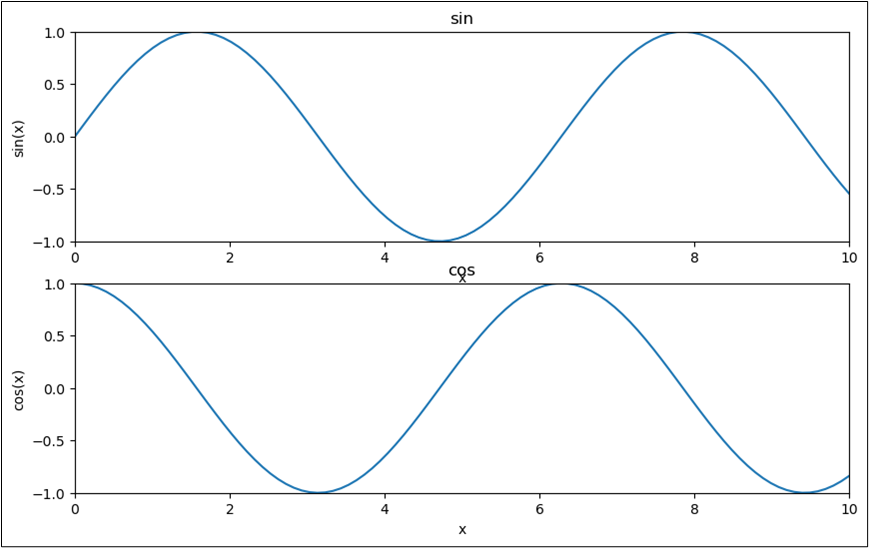

### 单变量可视化

使用weather（天气）数据集。其中包含6个字段：

- date：日期，年-月-日格式。

- precipitation：降水量。

- temp_max：最高温度。

- temp_min：最低温度。

- wind：风力。

- weather：天气状况。

加载数据：

```python
import pandas as pd
import matplotlib.pyplot as plt
from matplotlib import rcParams

rcParams["font.sans-serif"] = ["SimHei"]  # 指定中文字体
rcParams["axes.unicode_minus"] = False  # 解决负号显示问题

df = pd.read_csv("data/weather.csv")
df.info()  # 查看数据集信息
# RangeIndex: 1461 entries, 0 to 1460
# Data columns (total 6 columns):
#  #   Column         Non-Null Count  Dtype
# ---  ------         --------------  -----
#  0   date           1461 non-null   object
#  1   precipitation  1461 non-null   float64
#  2   temp_max       1461 non-null   float64
#  3   temp_min       1461 non-null   float64
#  4   wind           1461 non-null   float64
#  5   weather        1461 non-null   object
# dtypes: float64(4), object(2)
# memory usage: 68.6+ KB

```

使用直方图将降水量分组并绘制每组出现频次

```python
fig = plt.figure()
ax1 = fig.add_subplot(1, 1, 1)
ax1.hist(df["precipitation"], bins=5)  # 绘制直方图，将降水量均匀分为5组
ax1.set_xlabel("降水量")
ax1.set_ylabel("出现频次")
plt.show()

```

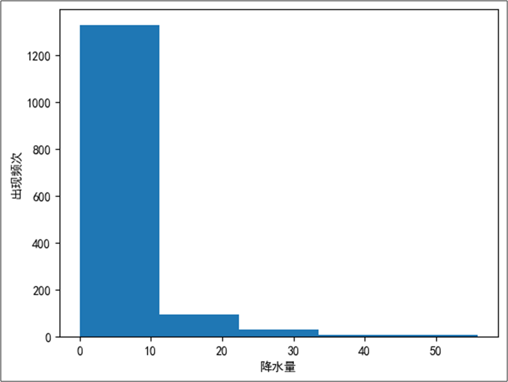

### 多变量可视化

#### 双变量

使用散点图呈现降水量随最高气温变化的大致趋势

```python
import pandas as pd
import matplotlib.pyplot as plt
from matplotlib import rcParams

rcParams["font.sans-serif"] = ["SimHei"]  # 指定中文字体
rcParams["axes.unicode_minus"] = False  # 解决负号显示问题

df = pd.read_csv("data/weather.csv")
fig = plt.figure()
ax1 = fig.add_subplot(1, 1, 1)
ax1.scatter(df["temp_max"], df["precipitation"])  # 绘制散点图，横轴为最高气温，纵轴为降水量
ax1.set_xlabel("最高气温")
ax1.set_ylabel("降水量")
plt.show()

```

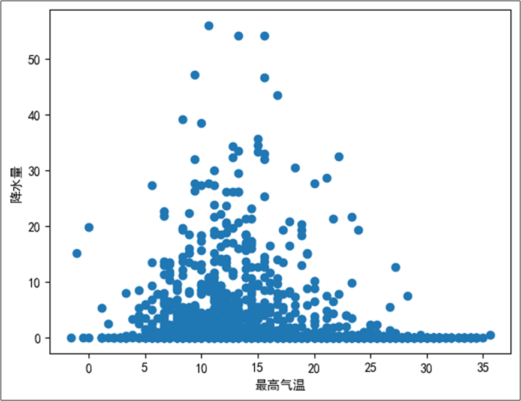

#### 多变量

使用散点图呈现降水量随最高气温变化的大致趋势，用不同颜色区分不同年份的数据

```python
import pandas as pd
import matplotlib.pyplot as plt
from matplotlib import rcParams

rcParams["font.sans-serif"] = ["SimHei"]  # 指定中文字体
rcParams["axes.unicode_minus"] = False  # 解决负号显示问题

def year_color(x):
    """添加一列，为不同年份的数据添加不同的颜色"""
    match x.year:
        case 2012:
            return "r"
        case 2013:
            return "g"
        case 2014:
            return "b"
        case 2015:
            return "k"

df = pd.read_csv("data/weather.csv")
df["date"] = pd.to_datetime(df["date"])
df["color"] = df["date"].apply(year_color)
fig = plt.figure()
ax1 = fig.add_subplot(1, 1, 1)
# 绘制散点图，横轴为最高气温，纵轴为降水量
# c设置颜色,alpha设置透明度
ax1.scatter(df["temp_max"], df["precipitation"], c=df["color"], alpha=0.5)
ax1.set_xlabel("最高气温")
ax1.set_ylabel("降水量")
plt.show()

```

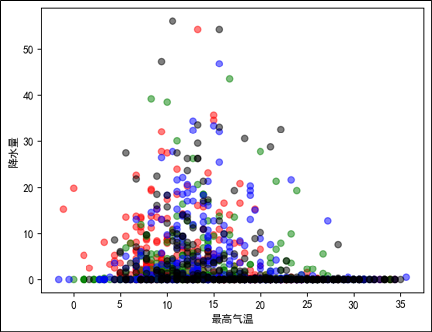

## Pandas可视化

### 单变量可视化

使用sleep（睡眠健康和生活方式）数据集，其中包含13个字段：

- person_id：每个人的唯一标识符。

- gender：个人的性别（男/女）。

- age：个人的年龄（以岁为单位）。

- occupation：个人的职业或就业状况（例如办公室职员、体力劳动者、学生）。

- sleep_duration：每天的睡眠总小时数。

- sleep_quality：睡眠质量的主观评分，范围从 1（差）到 10（极好）。

- physical_activity_level：每天花费在体力活动上的时间（以分钟为单位）。

- stress_level：压力水平的主观评级，范围从 1（低）到 10（高）。

- bmi_category：个人的 BMI 分类（体重过轻、正常、超重、肥胖）。

- blood_pressure：血压测量，显示为收缩压与舒张压的数值。

- heart_rate：静息心率，以每分钟心跳次数为单位。

- daily_steps：个人每天行走的步数。

- sleep_disorder：存在睡眠障碍（无、失眠、睡眠呼吸暂停）。

加载数据：

```python
import pandas as pd

df = pd.read_csv("data/sleep.csv")
df.info()  # 查看数据集信息
# RangeIndex: 400 entries, 0 to 399
# Data columns (total 13 columns):
#  #   Column                   Non-Null Count  Dtype
# ---  ------                   --------------  -----
#  0   person_id                400 non-null    int64
#  1   gender                   400 non-null    object
#  2   age                      400 non-null    int64
#  3   occupation               400 non-null    object
#  4   sleep_duration           400 non-null    float64
#  5   sleep_quality            400 non-null    float64
#  6   physical_activity_level  400 non-null    int64
#  7   stress_level             400 non-null    int64
#  8   bmi_category             400 non-null    object
#  9   blood_pressure           400 non-null    object
#  10  heart_rate               400 non-null    int64
#  11  daily_steps              400 non-null    int64
#  12  sleep_disorder           110 non-null    object
# dtypes: float64(2), int64(6), object(5)
# memory usage: 40.8+ KB

```

#### 柱状图

柱状图用于展示类别数据的分布情况。它通过一系列矩形的高度（或长度）来展示数据值，适合对比不同类别之间的数量或频率。简单直观，容易理解和比较各类别数据。

使用柱状图展示不同睡眠时长的数量。

```python
pd.cut(df["sleep_duration"], [0, 5, 6, 7, 8, 9, 10, 11, 12]).value_counts().plot.bar(
    color=["red", "green", "blue", "yellow", "cyan", "magenta", "black", "purple"]
)

```

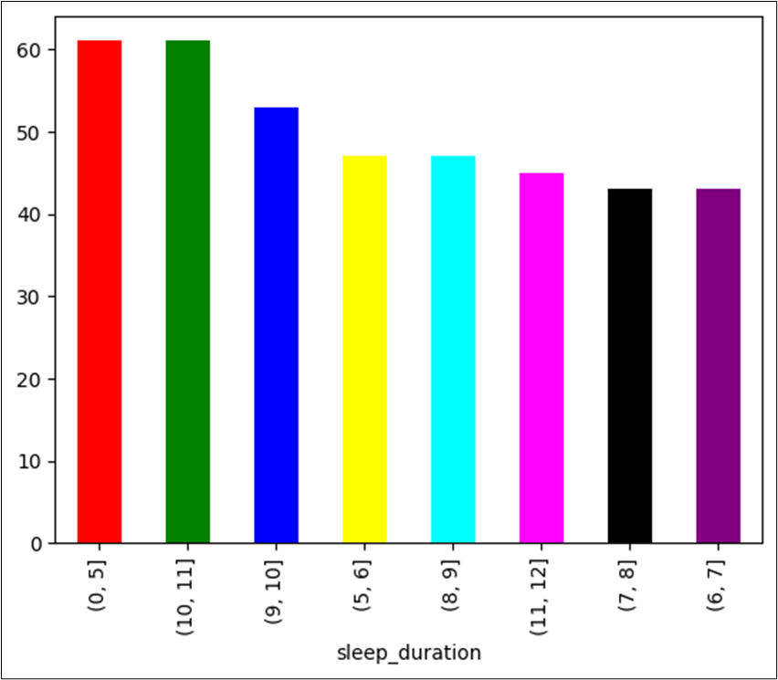

#### 折线图

折线图通常用于展示连续数据的变化趋势。它通过一系列数据点连接成的线段来表示数据的变化。能够清晰地展示数据的趋势和波动。

使用折线图展示不同睡眠时长的数量。

```python
pd.cut(df["sleep_duration"], [0, 5, 6, 7, 8, 9, 10, 11, 12]).value_counts().sort_index().plot()
```

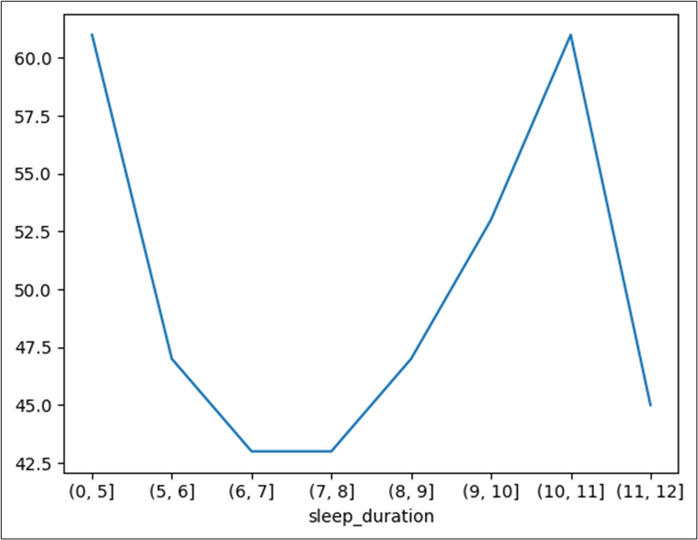

#### 面积图

面积图是折线图的一种变体，线下的区域被填充颜色，用于强调数据的总量或变化。可以更直观地展示数据量的变化，适合用来展示多个分类的累计趋势。

使用面积图展示不同睡眠时长的数量。

```python
pd.cut(df["sleep_duration"], [0, 5, 6, 7, 8, 9, 10, 11, 12]).value_counts().sort_index().plot.area()
```

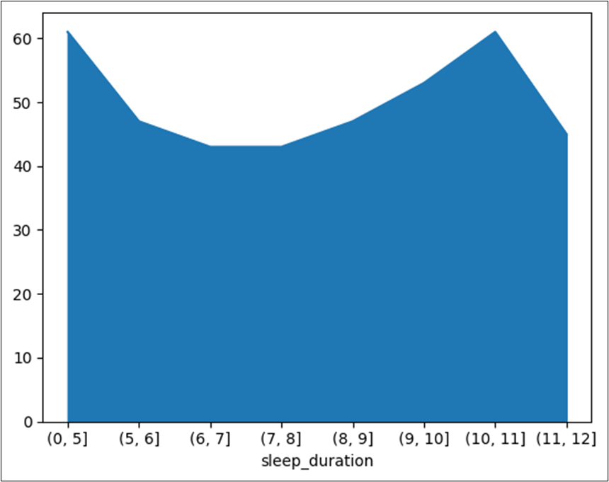
#### 直方图

直方图用于展示数据的分布情况。它将数据范围分成多个区间，并通过矩形的高度显示每个区间内数据的频率或数量。可以揭示数据分布的模式，如偏态、峰度等。

使用直方图展示不同睡眠时长的数量。

```python
df["sleep_duration"].value_counts().plot.hist()
```

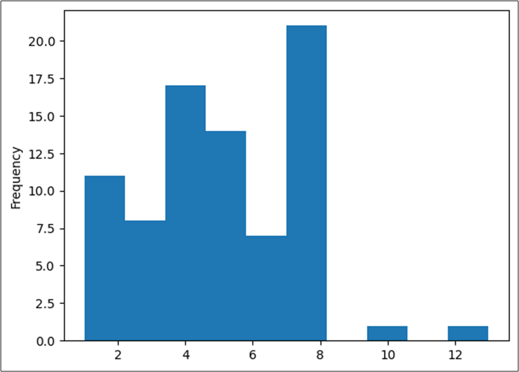

#### 饼状图

饼状图用于展示一个整体中各个部分所占的比例。它通过一个圆形图形分割成不同的扇形，每个扇形的角度与各部分的比例成正比。能够快速展示各部分之间的比例关系，但不适合用于展示过多的类别或比较数值差异较小的部分。

使用饼状图展示不同睡眠时长的占比。

```python
pd.cut(df["sleep_duration"], [0, 5, 6, 7, 8, 9, 10, 11, 12]).value_counts().sort_index().plot.pie()
```

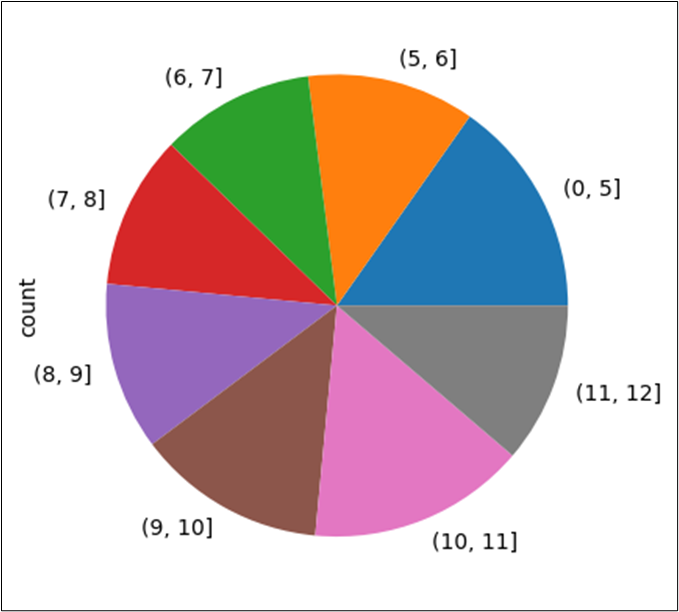

### 双变量可视化

#### 散点图

散点图通过在二维坐标系中绘制数据点来展示两组数值数据之间的关系。能够揭示两个变量之间的相关性和趋势。

绘制睡眠时间与睡眠质量的散点图。

```python
df.plot.scatter(x="sleep_duration", y="sleep_quality")
```

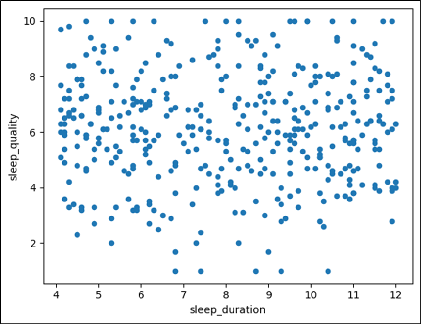

#### 蜂窝图

蜂窝图是散点图的扩展，通常用于表示大量数据点之间的关系。它通过将数据点分布在一个六边形网格中，每个六边形的颜色代表其中的数据密度。适合展示大量数据点，避免了散点图中的过度重叠问题。

绘制睡眠时间与睡眠质量的蜂窝图。

```python
df.plot.hexbin(x="sleep_duration", y="sleep_quality", gridsize=10)
```

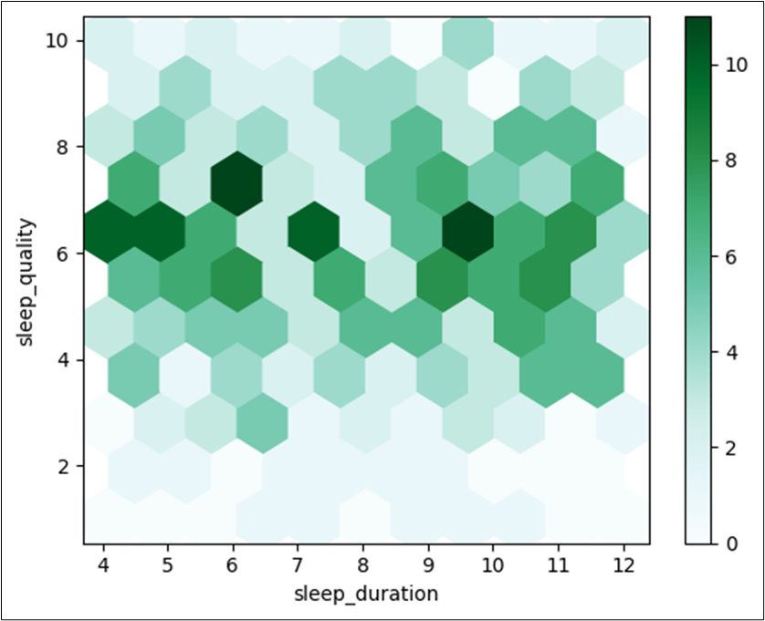

#### 堆叠图

堆叠图用于展示多个数据系列的累积变化。常见的堆叠图包括堆叠柱状图、堆叠面积图等。它通过将每个数据系列堆叠在前一个系列之上，展示数据的累积情况。能够清晰地展示不同部分的相对贡献，适合多个数据系列的比较。

绘制睡眠时间与睡眠质量的堆叠图。

```python
df["sleep_quality_stage"] = pd.cut(df["sleep_quality"], range(11))
df["sleep_duration_stage"] = pd.cut(df["sleep_duration"], [0, 5, 6, 7, 8, 9, 10, 11, 12])
df_pivot_table = df.pivot_table(
    values="person_id", index="sleep_quality_stage", columns="sleep_duration_stage", aggfunc="count"
)
df_pivot_table.plot.bar()

```

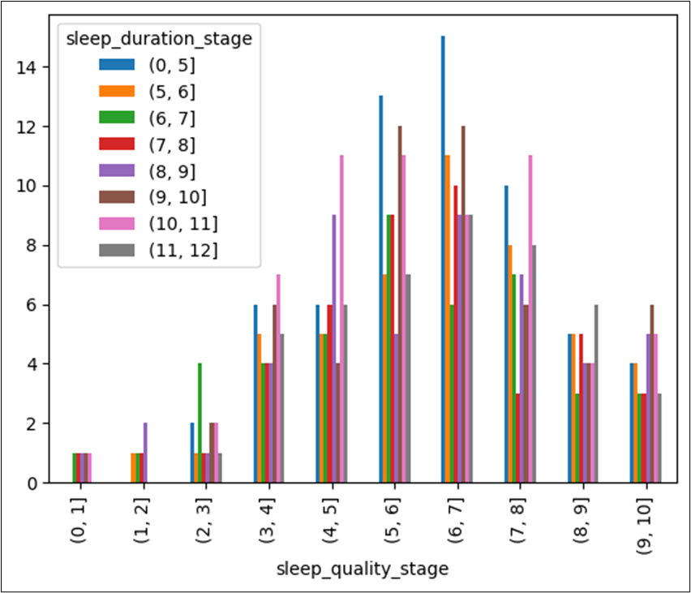

> 设置stacked=True，会将柱体堆叠

```python
df_pivot_table.plot.bar(stacked=True)
```

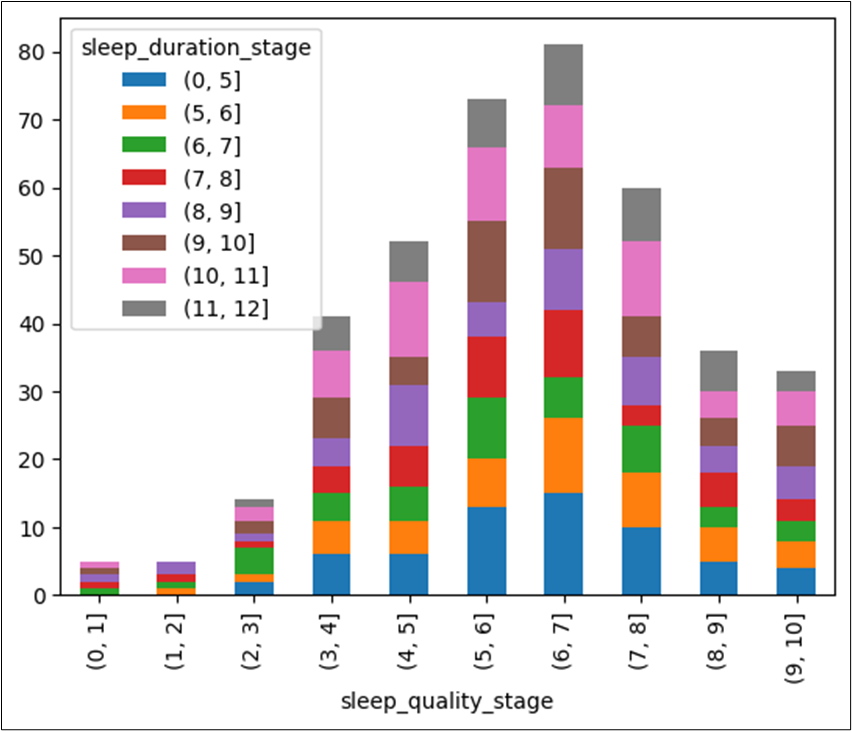

#### 折线图

```python
df_pivot_table.plot.line()
```

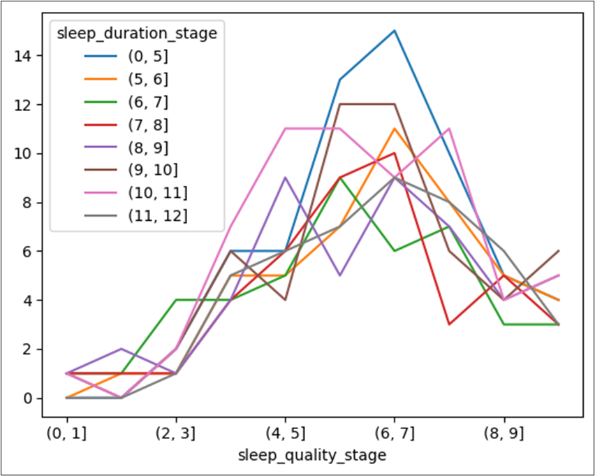

## Seaborn可视化

### 单变量可视化

使用penguins（企鹅🐧）数据集，其中包含7个字段：

- species：企鹅种类（Adelie、Gentoo、Chinstrap）。

- island：观测岛屿（Torgersen, Biscoe, Dream）。

- bill_length_mm：喙（嘴）长度（毫米）。

- bill_depth_mm：喙深度（毫米）。

- flipper_length_mm：脚蹼长度（毫米）。

- body_mass_g：体重（克）。

- sex：性别（Male、Female）。

加载数据：

```python
import pandas as pd
import seaborn as sns
import matplotlib.pyplot as plt

plt.rcParams["font.sans-serif"] = ["KaiTi"]
penguins = pd.read_csv("data/penguins.csv")
penguins.dropna(inplace=True)
penguins.info()
# <class 'pandas.core.frame.DataFrame'>
# Index: 333 entries, 0 to 343
# Data columns (total 7 columns):
#  #   Column             Non-Null Count  Dtype
# ---  ------             --------------  -----
#  0   species            333 non-null    object
#  1   island             333 non-null    object
#  2   bill_length_mm     333 non-null    float64
#  3   bill_depth_mm      333 non-null    float64
#  4   flipper_length_mm  333 non-null    float64
#  5   body_mass_g        333 non-null    float64
#  6   sex                333 non-null    object
# dtypes: float64(4), object(3)
# memory usage: 20.8+ KB

```

#### 直方图

绘制不同种类企鹅数量的直方图

```python
sns.histplot(data=penguins, x="species")
```

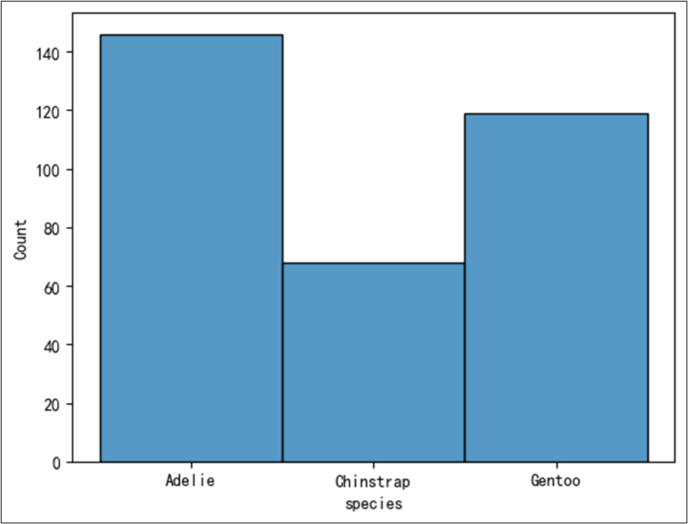

#### 核密度估计图

核密度估计图（KDE，Kernel Density Estimate Plot）是一种用于显示数据分布的统计图表，它通过平滑直方图的方法来估计数据的概率密度函数，使得分布图看起来更加连续和平滑。核密度估计是一种非参数方法，用于估计随机变量的概率密度函数。其基本思想是，将每个数据点视为一个“核”（通常是高斯分布），然后将这些核的贡献相加以形成平滑的密度曲线。

绘制喙长度的核密度估计图。

```python
sns.kdeplot(data=penguins, x="bill_length_mm")
```

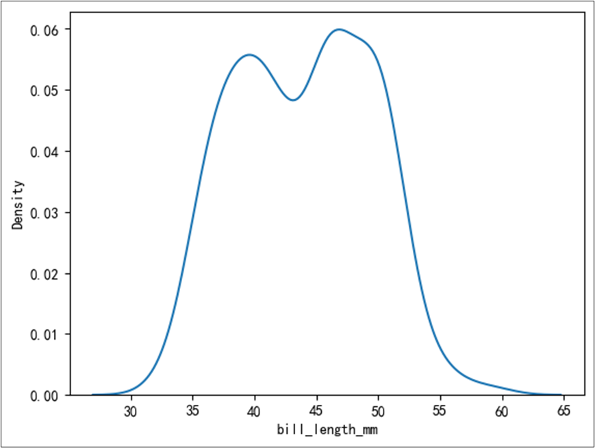

> 在histplot()中设置kde=True也可以得到核密度估计图

```python
sns.histplot(data=penguins, x="bill_length_mm", kde=True)
```

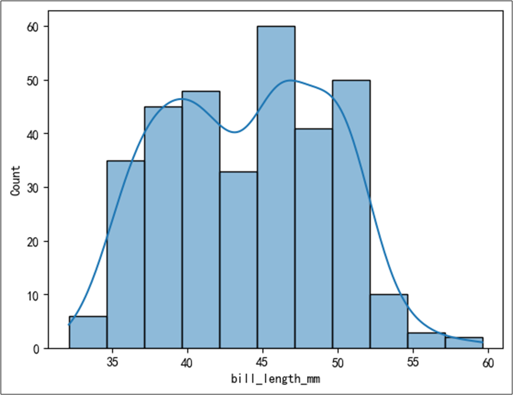

#### 计数图

计数图用于绘制分类变量的计数分布图，显示每个类别在数据集中出现的次数，是分析分类数据非常直观的工具，可以快速了解类别的分布情况。

绘制不同岛屿企鹅数量的计数图。

```python
sns.countplot(data=penguins, x="island")
```

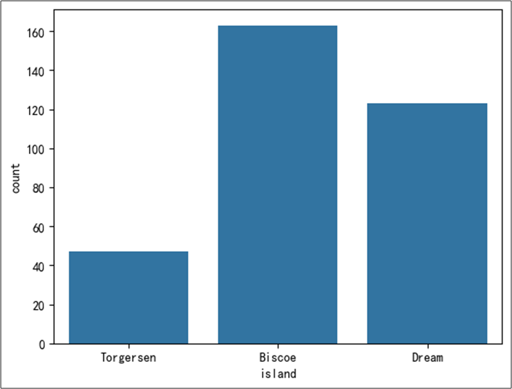

### 双变量可视化

#### 散点图

绘制横轴为体重，纵轴为脚蹼长度的散点图。可通过hue参数设置不同组别进行对比

```python
sns.scatterplot(data=penguins, x="body_mass_g", y="flipper_length_mm", hue="sex")
```

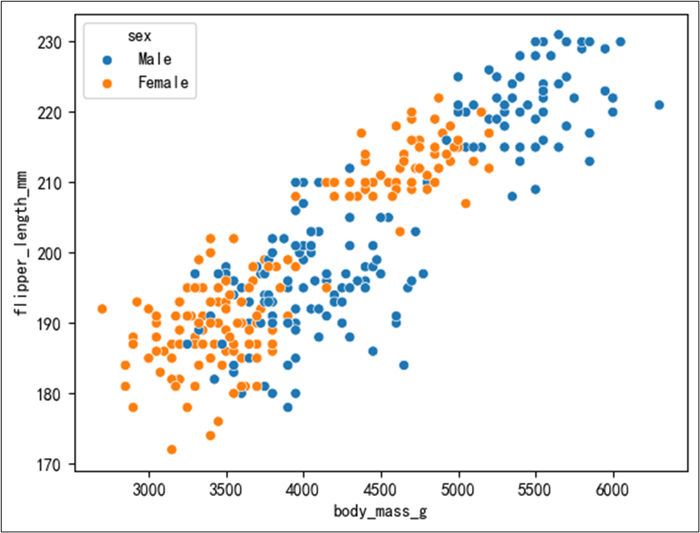

> 也可以通过regplot()函数绘制散点图，同时会拟合回归曲线。可以通过fit_reg=False关闭拟合

```python
sns.regplot(data=penguins, x="body_mass_g", y="flipper_length_mm")
```

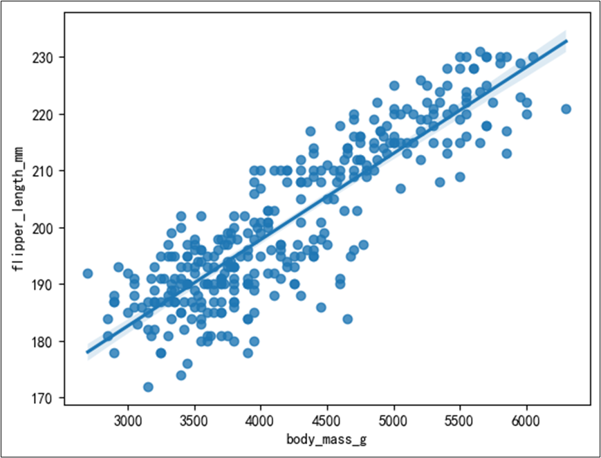

> 也可以通过lmplot()函数绘制基于hue参数的分组回归图

```python
sns.lmplot(data=penguins, x="body_mass_g", y="flipper_length_mm", hue="sex")
```

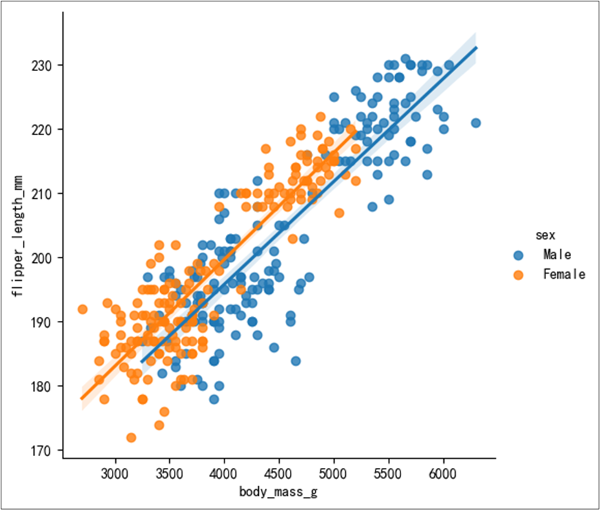

> 也可以通过jointplot()函数绘制在每个轴上包含单个变量的散点图

```python
sns.jointplot(data=penguins, x="body_mass_g", y="flipper_length_mm")
```

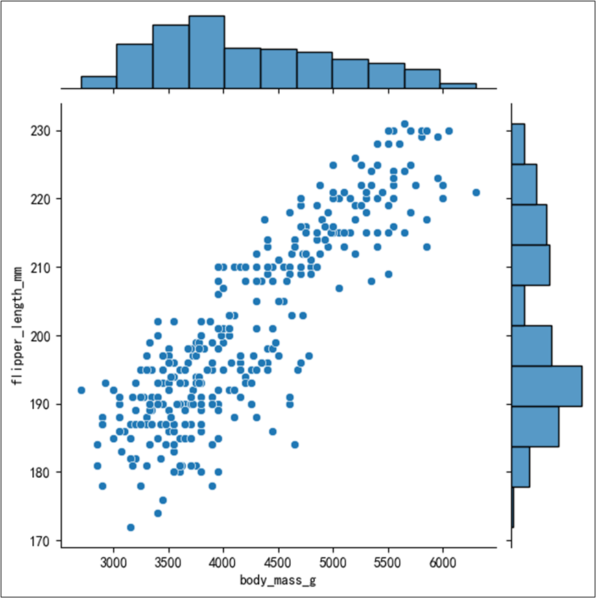

#### 蜂窝图

通过jointplot()函数，设置kind="hex"来绘制蜂窝图

```python
sns.jointplot(data=penguins, x="body_mass_g", y="flipper_length_mm", kind="hex")
```

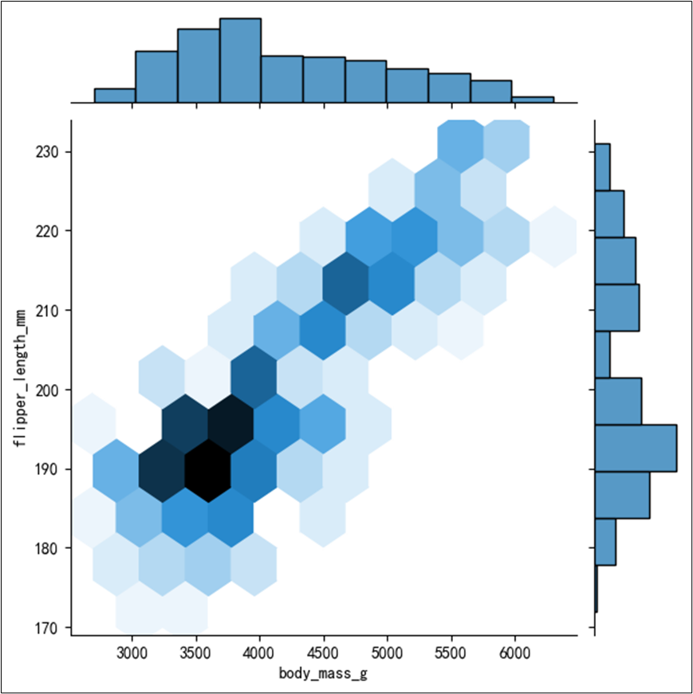

#### 二维核密度估计图

通过kdeplot()函数，同时设置x参数和y参数来绘制二维核密度估计图

```python
sns.kdeplot(data=penguins, x="body_mass_g", y="flipper_length_mm")
```

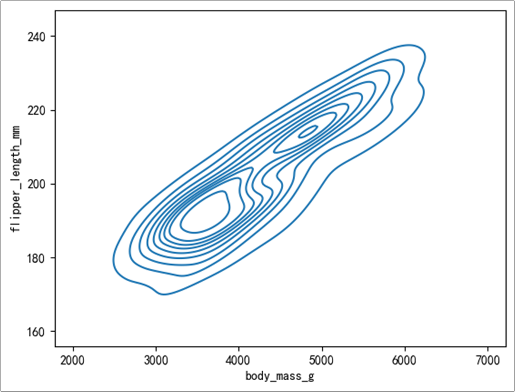

> 通过fill=True设置为填充，通过cbar=True设置显示颜色示意条

```python
sns.kdeplot(data=penguins, x="body_mass_g", y="flipper_length_mm", fill=True, cbar=True)
```

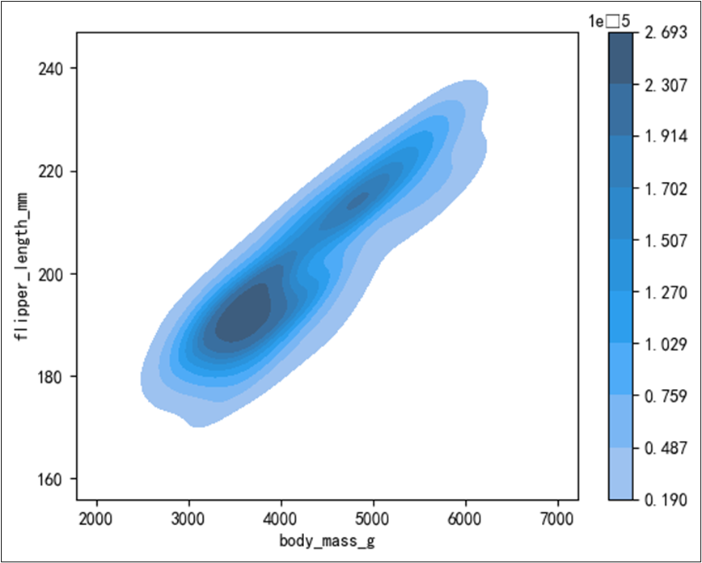

#### 条形图

条形图会按x分组对y进行聚合，通过estimator参数设置聚合函数，并通过errorbar设置误差条，误差条默认会显示。可以通过误差条显示抽样数据统计结果的可能统计范围，如果数据不是抽样数据, 可以设置为None来关闭误差条

```python
sns.barplot(data=penguins, x="species", y="bill_length_mm", estimator="mean", errorbar=None)
```

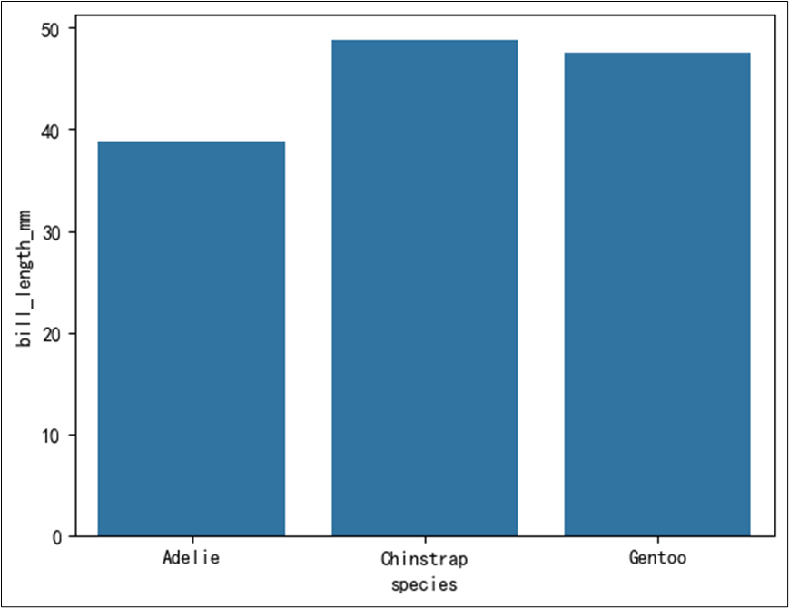

#### 箱线图

箱线图是一种用于展示数据分布、集中趋势、散布情况以及异常值的统计图表。它通过五个关键的统计量（最小值、第一四分位数、中位数、第三四分位数、最大值）来展示数据的分布情况。

箱线图通过箱体和须来表现数据的分布，能够有效地显示数据的偏斜、分散性以及异常值。箱线图的组成部分：

- 箱体（Box）：

- 下四分位数（Q1）：数据集下 25% 的位置，箱体的下边缘。

- 上四分位数（Q3）：数据集下 75% 的位置，箱体的上边缘。

- 四分位间距（IQR, Interquartile Range）：Q3 和 Q1 之间的距离，用来衡量数据的离散程度。

- 中位数（Median）：箱体内部的水平线，表示数据集的中位数。

- 须（Whiskers）：

- 下须：从 Q1 向下延伸，通常是数据集中最小值与 Q1 的距离，直到没有超过1.5倍 IQR 的数据点为止。

- 上须：从 Q3 向上延伸，通常是数据集中最大值与 Q3 的距离，直到没有超过1.5倍 IQR 的数据点为止。

- 异常值（Outliers）：

- 超过1.5倍 IQR 的数据被认为是异常值，通常用点标记出来。异常值是数据中相对于其他数据点而言“非常大”或“非常小”的值。

```python
sns.boxplot(data=penguins, x="species", y="bill_length_mm")
```

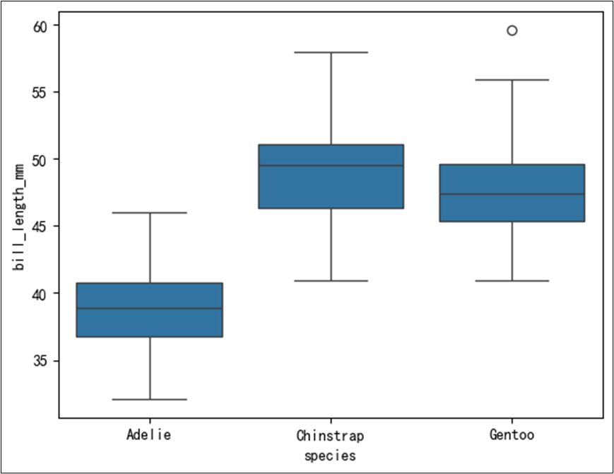

#### 小提琴图

小提琴图（Violin Plot） 是一种结合了箱线图和核密度估计图（KDE）的可视化图表，用于展示数据的分布情况、集中趋势、散布情况以及异常值。小提琴图不仅可以显示数据的基本统计量（如中位数和四分位数），还可以展示数据的概率密度，提供比箱线图更丰富的信息

```python
sns.violinplot(data=penguins, x="species", y="bill_length_mm")
```

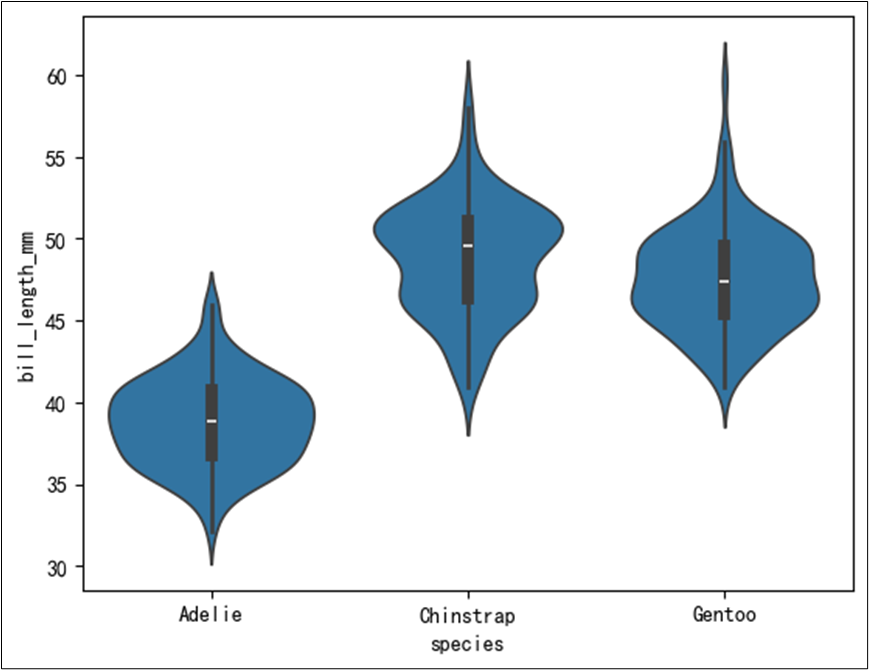

#### 成对关系图

成对关系图是一种用于显示多个变量之间关系的可视化工具。它可以展示各个变量之间的成对关系，并且通过不同的图表形式帮助我们理解数据中各个变量之间的相互作用。

对角线上的图通常显示每个变量的分布（如直方图或核密度估计图），帮助观察每个变量的单变量特性。其他位置展示所有变量的两两关系，用散点图表示。

```python
sns.pairplot(data=penguins, hue="species")
```

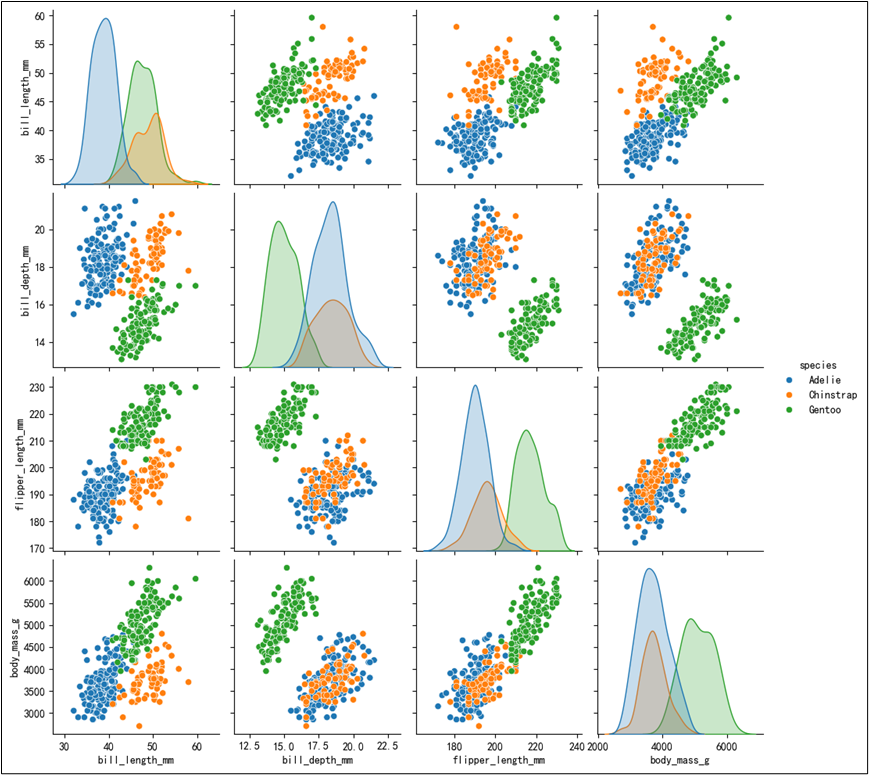

>   通常情况下成对关系图左上和右下对应位置的图的信息是相同的，可以通过PairGrid()为每个区域设置不同的图类型。

```python
pair_grid = sns.PairGrid(data=penguins, hue="species")

# 通过 map 方法在网格上绘制不同的图形
pair_grid.map_upper(sns.scatterplot)  # 上三角部分使用散点图
pair_grid.map_lower(sns.kdeplot)  # 下三角部分使用核密度估计图
pair_grid.map_diag(sns.histplot)  # 对角线部分使用直方图

```

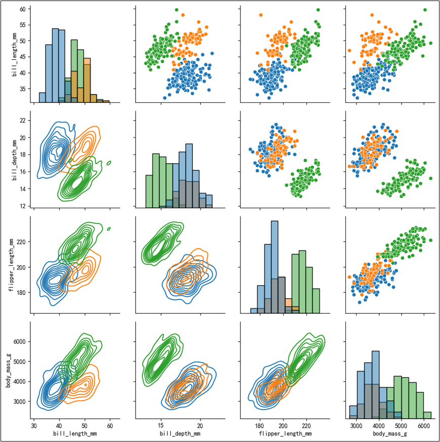

### 多变量可视化

多数绘图函数都支持使用hue参数设置一个类别变量，统计时按此类别分组统计并在绘图时使用颜色区分。

例如对小提琴图设置hue参数添加性别类别：

```python
sns.violinplot(data=penguins, x="species", y="bill_length_mm", hue="sex", split=True)
```

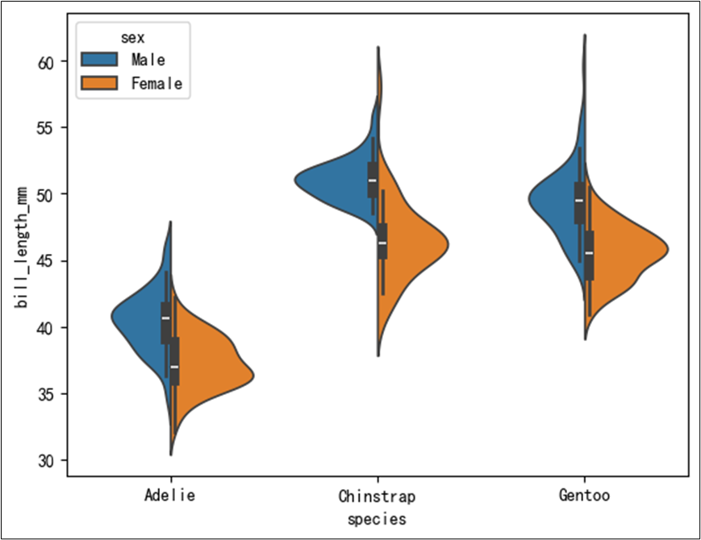

### Seaborn样式

在Seaborn中，样式（style）控制了图表的整体外观，包括背景色、网格线、刻度线等元素。Seaborn提供了一些内置的样式选项，可以通过seaborn.set_style()来设置当前图表的样式。常见的样式有以下几种：

- white：纯白背景，没有网格线。

- dark：深色背景，带有网格线。

- whitegrid：白色背景，带有网格线。

- darkgrid：深色背景，带有网格线（默认样式）。

```python
sns.set_style("darkgrid")
sns.histplot(data=penguins, x="island", kde=True)

```

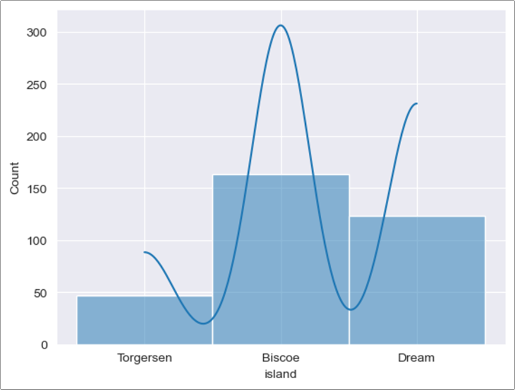
