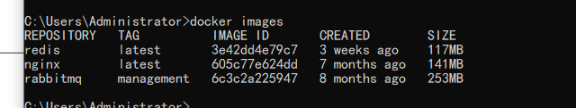
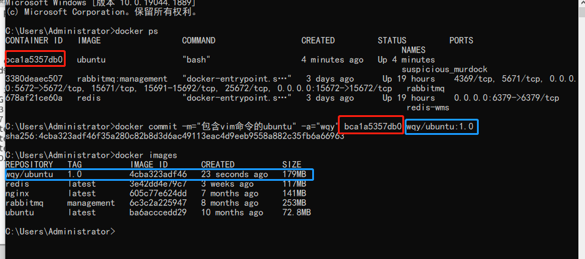
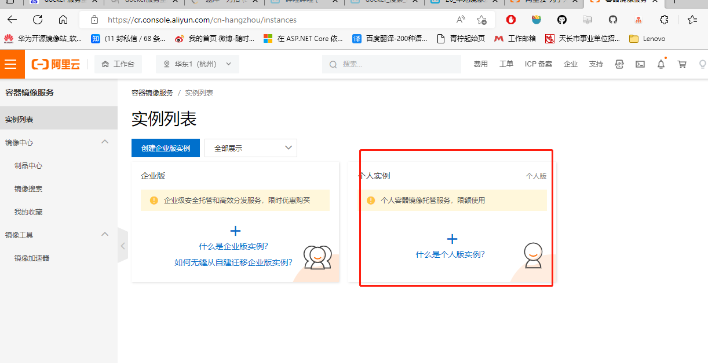
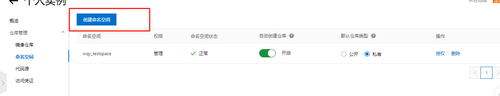
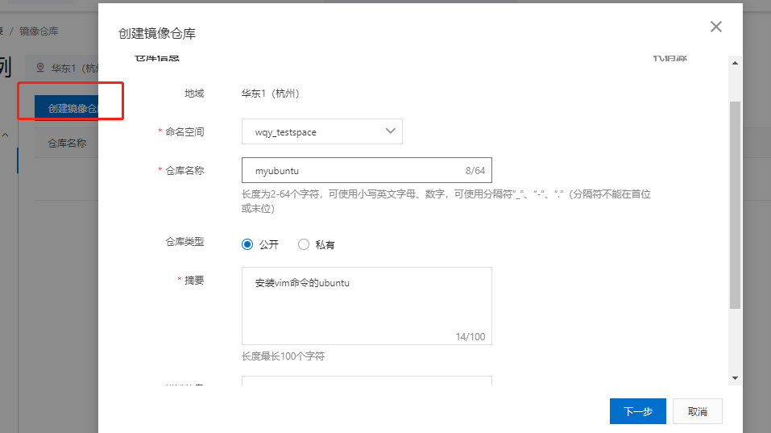
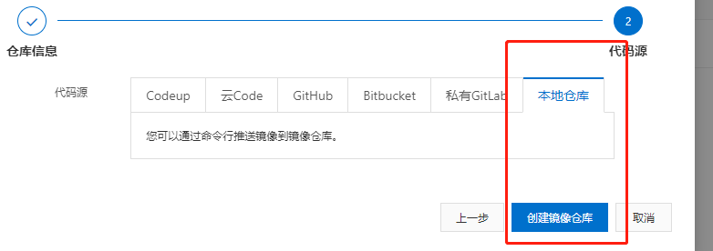
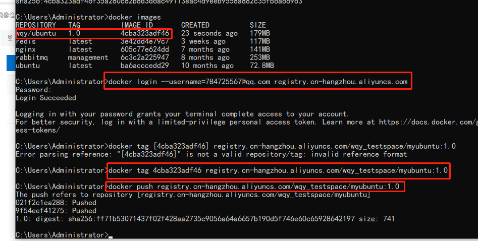
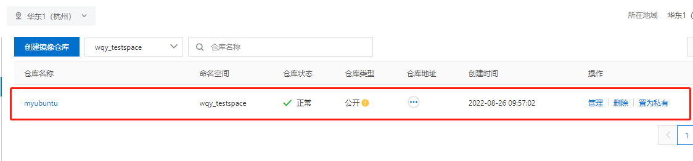

# 安装

Ubuntu [官方安装网址](https://docs.docker.com/engine/install/ubuntu/)

## OS requirements

To install Docker Engine, you need the 64-bit version of one of these Ubuntu versions:

- Ubuntu Jammy 22.04 (LTS)
- Ubuntu Impish 21.10
- Ubuntu Focal 20.04 (LTS)
- Ubuntu Bionic 18.04 (LTS)

Docker Engine is supported on `x86_64` (or `amd64`), `armhf`, `arm64`, and `s390x` architectures.

## Uninstall old versions

Older versions of Docker were called `docker`, `docker.io`, or `docker-engine`. If these are installed, uninstall them:

```
$ sudo apt-get remove docker docker-engine docker.io containerd runc
```

It’s OK if `apt-get` reports that none of these packages are installed.

The contents of `/var/lib/docker/`, including images, containers, volumes, and networks, are preserved. If you do not need to save your existing data, and want to start with a clean installation, refer to the [uninstall Docker Engine](https://docs.docker.com/engine/install/ubuntu/#uninstall-docker-engine) section at the bottom of this page.

## Installation methods

You can install Docker Engine in different ways, depending on your needs:

- Most users [set up Docker’s repositories](https://docs.docker.com/engine/install/ubuntu/#install-using-the-repository) and install from them, for ease of installation and upgrade tasks. This is the recommended approach.
- Some users download the DEB package and [install it manually](https://docs.docker.com/engine/install/ubuntu/#install-from-a-package) and manage upgrades completely manually. This is useful in situations such as installing Docker on air-gapped systems with no access to the internet.
- In testing and development environments, some users choose to use automated [convenience scripts](https://docs.docker.com/engine/install/ubuntu/#install-using-the-convenience-script) to install Docker.

### Install using the repository

Before you install Docker Engine for the first time on a new host machine, you need to set up the Docker repository. Afterward, you can install and update Docker from the repository.

#### Set up the repository

1. Update the `apt` package index and install packages to allow `apt` to use a repository over HTTPS:

   ```
   $ sudo apt-get update
   
   $ sudo apt-get install \
       ca-certificates \
       curl \
       gnupg \
       lsb-release
   ```

2. Add Docker’s official GPG key:

   ```
   $ sudo mkdir -p /etc/apt/keyrings
   $ curl -fsSL https://download.docker.com/linux/ubuntu/gpg | sudo gpg --dearmor -o /etc/apt/keyrings/docker.gpg
   ```

3. Use the following command to set up the repository:

   ```
   $ echo \
     "deb [arch=$(dpkg --print-architecture) signed-by=/etc/apt/keyrings/docker.gpg] https://download.docker.com/linux/ubuntu \
     $(lsb_release -cs) stable" | sudo tee /etc/apt/sources.list.d/docker.list > /dev/null
   ```

#### Install Docker Engine

1. Update the `apt` package index, and install the *latest version* of Docker Engine, containerd, and Docker Compose, or go to the next step to install a specific version:

   ```
    $ sudo apt-get update
    $ sudo apt-get install docker-ce docker-ce-cli containerd.io docker-compose-plugin
   ```

   > Receiving a GPG error when running `apt-get update`?
   >
   > Your default umask may not be set correctly, causing the public key file for the repo to not be detected. Run the following command and then try to update your repo again: `sudo chmod a+r /etc/apt/keyrings/docker.gpg`.

2. To install a *specific version* of Docker Engine, list the available versions in the repo, then select and install:

   a. List the versions available in your repo:

   ```
   $ apt-cache madison docker-ce
   
   docker-ce | 5:20.10.16~3-0~ubuntu-jammy | https://download.docker.com/linux/ubuntu jammy/stable amd64 Packages
   docker-ce | 5:20.10.15~3-0~ubuntu-jammy | https://download.docker.com/linux/ubuntu jammy/stable amd64 Packages
   docker-ce | 5:20.10.14~3-0~ubuntu-jammy | https://download.docker.com/linux/ubuntu jammy/stable amd64 Packages
   docker-ce | 5:20.10.13~3-0~ubuntu-jammy | https://download.docker.com/linux/ubuntu jammy/stable amd64 Packages
   ```

   b. Install a specific version using the version string from the second column, for example, `5:20.10.16~3-0~ubuntu-jammy`.

   ```
   $ sudo apt-get install docker-ce=<VERSION_STRING> docker-ce-cli=<VERSION_STRING> containerd.io docker-compose-plugin
   ```

3. Verify that Docker Engine is installed correctly by running the `hello-world` image.

   ```
   $ sudo docker run hello-world
   ```

   This command downloads a test image and runs it in a container. When the container runs, it prints a message and exits.

4. Ubuntu设置docker自启动

   ```
   # 开启 docker 自启动
   systemctl enable docker.service
    
   # 关闭 docker 自启动
   systemctl disable docker.service
   ```

5. 设置镜像随docker启动自启动

   ```
   # 开启容器自启动
   docker update --restart=always 【容器名】
   例如：docker update --restart=always tracker
    
    
   # 关闭容器自启动
   docker update --restart=no【容器名】
   例如：docker update --restart=no tracker
   ```

Docker Engine is installed and running. The `docker` group is created but no users are added to it. You need to use `sudo` to run Docker commands. Continue to [Linux postinstall](https://docs.docker.com/engine/install/linux-postinstall/) to allow non-privileged users to run Docker commands and for other optional configuration steps.

#### Upgrade Docker Engine

To upgrade Docker Engine, first run `sudo apt-get update`, then follow the [installation instructions](https://docs.docker.com/engine/install/ubuntu/#install-using-the-repository), choosing the new version you want to install.

### Install from a package

If you cannot use Docker’s repository to install Docker Engine, you can download the `.deb` file for your release and install it manually. You need to download a new file each time you want to upgrade Docker.

1. Go to [`https://download.docker.com/linux/ubuntu/dists/`](https://download.docker.com/linux/ubuntu/dists/), choose your Ubuntu version, then browse to `pool/stable/`, choose `amd64`, `armhf`, `arm64`, or `s390x`, and download the `.deb` file for the Docker Engine version you want to install.

2. Install Docker Engine, changing the path below to the path where you downloaded the Docker package.

   ```
   $ sudo dpkg -i /path/to/package.deb
   ```

   The Docker daemon starts automatically.

3. Verify that Docker Engine is installed correctly by running the `hello-world` image.

   ```
   $ sudo docker run hello-world
   ```

   This command downloads a test image and runs it in a container. When the container runs, it prints a message and exits.

Docker Engine is installed and running. The `docker` group is created but no users are added to it. You need to use `sudo` to run Docker commands. Continue to [Post-installation steps for Linux](https://docs.docker.com/engine/install/linux-postinstall/) to allow non-privileged users to run Docker commands and for other optional configuration steps.

#### Upgrade Docker Engine

To upgrade Docker Engine, download the newer package file and repeat the [installation procedure](https://docs.docker.com/engine/install/ubuntu/#install-from-a-package), pointing to the new file.

### Install using the convenience script

Docker provides a convenience script at [get.docker.com](https://get.docker.com/) to install Docker into development environments quickly and non-interactively. The convenience script is not recommended for production environments, but can be used as an example to create a provisioning script that is tailored to your needs. Also refer to the [install using the repository](https://docs.docker.com/engine/install/ubuntu/#install-using-the-repository) steps to learn about installation steps to install using the package repository. The source code for the script is open source, and can be found in the [`docker-install` repository on GitHub](https://github.com/docker/docker-install).

Always examine scripts downloaded from the internet before running them locally. Before installing, make yourself familiar with potential risks and limitations of the convenience script:

- The script requires `root` or `sudo` privileges to run.
- The script attempts to detect your Linux distribution and version and configure your package management system for you, and does not allow you to customize most installation parameters.
- The script installs dependencies and recommendations without asking for confirmation. This may install a large number of packages, depending on the current configuration of your host machine.
- By default, the script installs the latest stable release of Docker, containerd, and runc. When using this script to provision a machine, this may result in unexpected major version upgrades of Docker. Always test (major) upgrades in a test environment before deploying to your production systems.
- The script is not designed to upgrade an existing Docker installation. When using the script to update an existing installation, dependencies may not be updated to the expected version, causing outdated versions to be used.

> Tip: preview script steps before running
>
> You can run the script with the `DRY_RUN=1` option to learn what steps the script will execute during installation:
>
> ```
> $ curl -fsSL https://get.docker.com -o get-docker.sh
> $ DRY_RUN=1 sh ./get-docker.sh
> ```

This example downloads the script from [get.docker.com](https://get.docker.com/) and runs it to install the latest stable release of Docker on Linux:

```
$ curl -fsSL https://get.docker.com -o get-docker.sh
$ sudo sh get-docker.sh
Executing docker install script, commit: 7cae5f8b0decc17d6571f9f52eb840fbc13b2737
<...>
```

Docker is installed. The `docker` service starts automatically on Debian based distributions. On `RPM` based distributions, such as CentOS, Fedora, RHEL or SLES, you need to start it manually using the appropriate `systemctl` or `service` command. As the message indicates, non-root users cannot run Docker commands by default.

> **Use Docker as a non-privileged user, or install in rootless mode?**
>
> The installation script requires `root` or `sudo` privileges to install and use Docker. If you want to grant non-root users access to Docker, refer to the [post-installation steps for Linux](https://docs.docker.com/engine/install/linux-postinstall/#manage-docker-as-a-non-root-user). Docker can also be installed without `root` privileges, or configured to run in rootless mode. For instructions on running Docker in rootless mode, refer to [run the Docker daemon as a non-root user (rootless mode)](https://docs.docker.com/engine/security/rootless/).

#### Install pre-releases

Docker also provides a convenience script at [test.docker.com](https://test.docker.com/) to install pre-releases of Docker on Linux. This script is equivalent to the script at `get.docker.com`, but configures your package manager to enable the “test” channel from our package repository, which includes both stable and pre-releases (beta versions, release-candidates) of Docker. Use this script to get early access to new releases, and to evaluate them in a testing environment before they are released as stable.

To install the latest version of Docker on Linux from the “test” channel, run:

```
$ curl -fsSL https://test.docker.com -o test-docker.sh
$ sudo sh test-docker.sh
<...>
```

#### Upgrade Docker after using the convenience script

If you installed Docker using the convenience script, you should upgrade Docker using your package manager directly. There is no advantage to re-running the convenience script, and it can cause issues if it attempts to re-add repositories which have already been added to the host machine.

## Uninstall Docker Engine

1. Uninstall the Docker Engine, CLI, Containerd, and Docker Compose packages:

   ```
   $ sudo apt-get purge docker-ce docker-ce-cli containerd.io docker-compose-plugin
   ```

2. Images, containers, volumes, or customized configuration files on your host are not automatically removed. To delete all images, containers, and volumes:

   ```
   $ sudo rm -rf /var/lib/docker
   $ sudo rm -rf /var/lib/containerd
   ```

You must delete any edited configuration files manually.

# 阿里云镜像加速

使用加速器可以提升获取Docker官方镜像的速度

加速器

| 加速器地址                               |
| ---------------------------------------- |
| https://ph2uascc.mirror.aliyuncs.com复制 |

操作文档

## Ubuntu

### 1. 安装／升级Docker客户端

推荐安装1.10.0以上版本的Docker客户端，参考文档[docker-ce](https://yq.aliyun.com/articles/110806)

### 2. 配置镜像加速器

针对Docker客户端版本大于 1.10.0 的用户

您可以通过修改daemon配置文件/etc/docker/daemon.json来使用加速器

```
sudo mkdir -p /etc/docker
sudo tee /etc/docker/daemon.json <<-'EOF'
{
  "registry-mirrors": ["https://ph2uascc.mirror.aliyuncs.com"]
}
EOF
sudo systemctl daemon-reload
sudo systemctl restart docker
```

## CentOS

### 1. 安装／升级Docker客户端

推荐安装1.10.0以上版本的Docker客户端，参考文档[docker-ce](https://yq.aliyun.com/articles/110806)

### 2. 配置镜像加速器

针对Docker客户端版本大于 1.10.0 的用户

您可以通过修改daemon配置文件/etc/docker/daemon.json来使用加速器

```
sudo mkdir -p /etc/docker
sudo tee /etc/docker/daemon.json <<-'EOF'
{
  "registry-mirrors": ["https://ph2uascc.mirror.aliyuncs.com"]
}
EOF
sudo systemctl daemon-reload
sudo systemctl restart docker
```

## MAC

### 1. 安装／升级Docker客户端

对于10.10.3以下的用户 推荐使用Docker Toolbox

Mac安装文件：http://mirrors.aliyun.com/docker-toolbox/mac/docker-toolbox/

对于10.10.3以上的用户 推荐使用Docker for Mac

Mac安装文件：http://mirrors.aliyun.com/docker-toolbox/mac/docker-for-mac/

### 2. 配置镜像加速器

针对安装了Docker Toolbox的用户，您可以参考以下配置步骤：

创建一台安装有Docker环境的Linux虚拟机，指定机器名称为default，同时配置Docker加速器地址。

```
docker-machine create --engine-registry-mirror=https://ph2uascc.mirror.aliyuncs.com -d virtualbox default
```

查看机器的环境配置，并配置到本地，并通过Docker客户端访问Docker服务。

```
docker-machine env defaulteval "$(docker-machine env default)"docker info
```

针对安装了Docker for Mac的用户，您可以参考以下配置步骤：

在任务栏点击 Docker Desktop 应用图标 -> Perferences，在左侧导航菜单选择 Docker Engine，在右侧输入栏编辑 json 文件。将

https://ph2uascc.mirror.aliyuncs.com加到"registry-mirrors"的数组里，点击 Apply & Restart按钮，等待Docker重启并应用配置的镜像加速器。

### 3. 相关文档

[Docker 命令参考文档](https://docs.docker.com/engine/reference/commandline/cli/)

[Dockerfile 镜像构建参考文档](https://docs.docker.com/engine/reference/builder/)

## Windows

### 1. 安装／升级Docker客户端

对于Windows 10以下的用户，推荐使用Docker Toolbox

Windows安装文件：http://mirrors.aliyun.com/docker-toolbox/windows/docker-toolbox/

对于Windows 10以上的用户 推荐使用Docker for Windows

Windows安装文件：http://mirrors.aliyun.com/docker-toolbox/windows/docker-for-windows/

### 2. 配置镜像加速器

针对安装了Docker Toolbox的用户，您可以参考以下配置步骤：

创建一台安装有Docker环境的Linux虚拟机，指定机器名称为default，同时配置Docker加速器地址。

```
docker-machine create --engine-registry-mirror=https://ph2uascc.mirror.aliyuncs.com -d virtualbox default
```

查看机器的环境配置，并配置到本地，并通过Docker客户端访问Docker服务。

```
docker-machine env defaulteval "$(docker-machine env default)"docker info
```

针对安装了Docker for Windows的用户，您可以参考以下配置步骤：

在系统右下角托盘图标内右键菜单选择 Settings，打开配置窗口后左侧导航菜单选择 Docker Daemon。编辑窗口内的JSON串，填写下方加速器地址：

```
{
  "registry-mirrors": ["https://ph2uascc.mirror.aliyuncs.com"]
}
```

编辑完成后点击 Apply 保存按钮，等待Docker重启并应用配置的镜像加速器。

### 注意

Docker for Windows 和 Docker Toolbox互不兼容，如果同时安装两者的话，需要使用hyperv的参数启动。

```
docker-machine create --engine-registry-mirror=https://ph2uascc.mirror.aliyuncs.com -d hyperv default
```

Docker for Windows 有两种运行模式，一种运行Windows相关容器，一种运行传统的Linux容器。同一时间只能选择一种模式运行。

### 3. 相关文档

[Docker 命令参考文档](https://docs.docker.com/engine/reference/commandline/cli/)

[Dockerfile 镜像构建参考文档](https://docs.docker.com/engine/reference/builder/)

# 常用操作和命令

## 启动，停止，重启docker服务(Linux)

```powershell
# 启动
systemctl start docker

# 停止
systemctl stop docker

# 重启
systemctl restart docker
```

## 查看docker状态，信息

```powershell
# 状态
systemctl status docker

#信息
docker info
```

## docker开机启动

```powershell
systemctl enable docker
```

## 查找镜像

```powershell
docker search 镜像名
```



- REPOSITORY:镜像的仓库源
- TAG:镜像版本号
- IMAGE ID:镜像ID
- CREATED:创建时间
- SIZE:镜像大小

## 查看所有镜像

``` powershell
docker images
```

## 拉取docker镜像，示例拉取的SQL server镜像

```powershell
docker pull microsoft/mssql-server-linux[:TAG]
```

## 删除镜像

```powershell
# 删除容器和镜像要先停止运行的容器
docker rmi 镜像名
```

## 启动容器

```powershell
docker run --name sql_server -m 512m -e 'ACCEPT_EULA=Y' -e 'SA_PASSWORD=sa.123456' -p 11433:1433 -d microsoft/mssql-server-linux
```

--name：容器名

-m：配置内存

-e：设置环境变量

-p：指定端口映射，左边docker映射端口，右边容器内部端口

-P：随机端口映射

-d：后台运行

-i：以交互模式运行容器，通常和-t同时使用

-t：为容器重新分配一个伪输入终端，即启动交互式容器

## 查看容器状态

```powershell
docker ps
```

## 停止和开启容器

```powershell
docker stop 容器名

docker start 容器名
```

## 重启容器

```powershell
docker restart 容器名
```

## 容器自启动

```powershell
docker update --restart=always sql_server
```

## 删除容器，删除前需要先停止容器

```powershell
docker rm 容器名
```

## 查看容器运行日志

``` powershell
docker logs 容器ID
```

## 查看容器内部细节

```powershell
docker inspect 容器ID
```

## 进入正在运行的容器，终端交互

```powershell
docker exec -it 容器ID /bin/bash

#退出,容器不停止
exit
```

## 从容器拷贝文件到主机

```powershell
docker cp 容器ID:容器内路径 目的主机路径
```

## 导入导出容器

```powershell
# 导出
docker export 容器ID > name.tar

#导入
cat name.tar | docker import - 镜像用户/镜像名:镜像版本号
```

## 提交容器副本作为新的镜像

```powershell
docker commit -m="描述信息" -a="作者" 容器ID 要创建的目标镜像名:[TAG]
```



## 本地镜像推送到阿里云









- 按照阿里云指令执行

  ```powershell
  docker login --username=7847*****@qq.com registry.cn-hangzhou.aliyuncs.com
  
  docker tag [ImageId] registry.cn-hangzhou.aliyuncs.com/wqy_testspace/myubuntu:[镜像版本号]
  
  docker push registry.cn-hangzhou.aliyuncs.com/wqy_testspace/myubuntu:[镜像版本号]
  ```





## 映射容器目录和宿主主机目录

```powershell
#-v可以多个
#:ro或者rw readonly 或者 read+write 
docker run -it --privileged=true -v 宿主主机绝对路径:容器内绝对路径[:ro或者rw] 镜像名
```

## 本地镜像推送到私有库

-  Docker Registry是官方提供的工具，可以用于构建私有镜像仓库

  ```powershell
  docker pull registry
  
  docker run -d -p 5000:5000  -v /本地路径/myregistry/:/tmp/registry --privileged=true registry
  # 默认情况，仓库被创建在容器的/var/lib/registry目录下，建议自行用容器卷映射，方便于宿主机联调
  ```

- curl验证私服库上有什么镜像

  ```powershell
  curl -XGET http://192.168.242.128:5000/v2/_catalog
  ```

- 将新镜像zzyyubuntu:1.2修改符合私服规范的Tag

  ```powershell
  # docker   tag   镜像:Tag   Host:Port/Repository:Tag
  
  docker tag  wqy/ubuntu:1.0  192.168.242.128:5000/myubuntu:1.0
  ```

- 修改配置文件使之支持http

  ```powershell
  vim /etc/docker/daemon.json
  ```

  ```json
  {
    "registry-mirrors": ["https://aa25jngu.mirror.aliyuncs.com"],
    "insecure-registries": ["192.168.242.128:5000"]
  }
  # docker默认不允许http方式推送镜像，通过配置选项来取消这个限制。====> 修改完后如果不生效，建议重启docker
  ```

- push推送到私服库

  ```powershell
  docker push 192.168.242.128:5000/myubuntu:1.0
  ```

- pull到本地并运行

  ```powershell
  docker pull 192.168.242.128:5000/myubuntu:1.0
  ```

# Docker轻量级可视化工具Portainer

- https://www.portainer.io/

-  https://docs.portainer.io/v/ce-2.9/start/install/server/docker/linux

## 安装

### Linux

```powershell
docker pull portainer

docker volume create portainer_data

docker run -d -p 8000:8000 -p 9000:9000 --name portainer \
    --restart=always \
    -v /var/run/docker.sock:/var/run/docker.sock \
    -v portainer_data:/data \
    portainer/portainer-ce:latest
```

### windows

```powershell
# powershell
netsh advfirewall firewall add rule name="cluster_management" dir=in action=allow protocol=TCP localport=2377
netsh advfirewall firewall add rule name="node_communication_tcp" dir=in action=allow protocol=TCP localport=7946
netsh advfirewall firewall add rule name="node_communication_udp" dir=in action=allow protocol=UDP localport=7946
netsh advfirewall firewall add rule name="overlay_network" dir=in action=allow protocol=UDP localport=4789
netsh advfirewall firewall add rule name="swarm_dns_tcp" dir=in action=allow protocol=TCP localport=53
netsh advfirewall firewall add rule name="swarm_dns_udp" dir=in action=allow protocol=UDP localport=53

Enable-WindowsOptionalFeature -Online -FeatureName containers -All
Install-Module -Name DockerMsftProvider -Repository PSGallery -Force
Install-Package -Name docker -ProviderName DockerMsftProvider
```

```powershell
docker volume create portainer_data

docker run -d -p 8000:8000 -p 9000:9000 --name portainer --restart always -v \\.\pipe\docker_engine:\\.\pipe\docker_engine -v portainer_data:C:\data portainer/portainer-ce:latest
```


