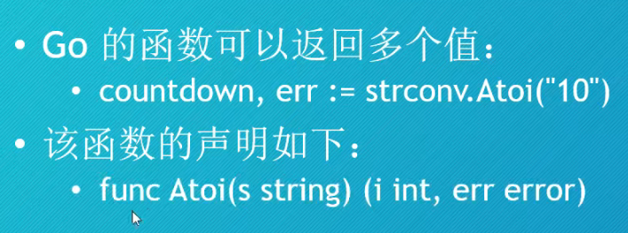
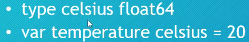
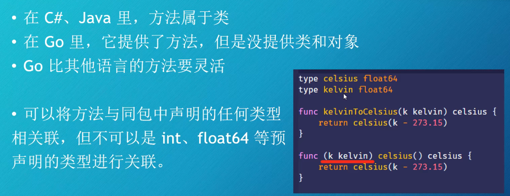
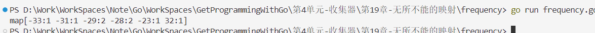

# Go
## Go语言中文网
https://studygolang.com/
## 配置``VSCode``开发环境
1. 安装``Go``扩展


2. Ctrl + Shift + P


3. 全选安装


> 如果下载速度缓慢或者遇到网络问题，可以使用Go代理，打开cmd执行 ``go env -w GO111MODULE=on``，然后再执行``go env -w GOPROXY=https://goproxy.cn,direct``

## 包和包中的函数

```go
package main

import (
	"fmt"
)

func main(){
    fmt.Println("Hello World")
}
```
### ``fmt.Print``和``fmt.Println``
- 可以传递若干和参数，参数之间用逗号隔开
- 参数可以是字符串，数字，表达式等等
### ``fmt.Printf``
- 第一个参数必须是字符串，这个字符串里包含像``v%``这样的个格式化动词，它的值由第二个参数的值所代替；如果指定了多个格式化动词，它们的值由后面的参数按顺序进行替换
- 在格式化动词里指定宽度可以对齐文本，正数表示向左填充空格；负数表示向右填充空格
```go
package main

import (
	"fmt"
)

func main() {
	fmt.Print("My weight on the surface of Mars is ")
	fmt.Print(130 * 0.3783)
	fmt.Print(" lbs, and I would be ")
	fmt.Print(18 *365 / 687)
	fmt.Println(" years old")
	fmt.Printf("%-15v $%4v\n", "SpaceX", 94.212417899808)
}
```

### ``math/rand``
- 可以生成伪随机数
#### ``rand.Intn``返回一个指定返回的随机整数
```go
package main

import (
	"fmt"
	"math/rand"
)

func main() {
	var num = rand.Intn(10) + 1
	fmt.Println(num)
	num = rand.Intn(10) + 1
	fmt.Println(num)
	num = rand.Intn(10) + 1
	fmt.Println(num)
	num = rand.Intn(10) + 1
	fmt.Println(num)
	num = rand.Intn(10) + 1
	fmt.Println(num)
	num = rand.Intn(10) + 1
	fmt.Println(num)
	num = rand.Intn(10) + 1
	fmt.Println(num)
}
```


## 类型
### 浮点型
- 默认是``float64``
	-	64位的浮点类型
	-	占用8字节内存

- ``float32``	
	-	占用4字节内存
	-	精度比``float64``低
#### ``%f``格式化动词
- 宽度：会显示出的最少字符个数(包含小数点和小数)
	-	如果宽度大于数字的值，那么左边会填充空格
	-	如果没有指定宽度，那么就按实际位数显示
- 精度：小数点后边的位数	


```go
package main

import (
	"fmt"
)

func main() {
	selection := 1

	switch selection {
	case 1:
		fmt.Println("格式化打印浮点数：")
		third := 1.0 / 3
		fmt.Println(third)
		fmt.Printf("%v\n", third)
		fmt.Printf("%f\n", third)
		fmt.Printf("%.3f\n", third)
		fmt.Printf("%4.2f\n", third)
		fmt.Printf("%05.2f\n", third)
	case 2:
		fmt.Println("浮点数不精确的例子：")
		piggyBank := 0.1
		piggyBank += 0.2
		fmt.Println(piggyBank)
	case 3:
		fmt.Println("先执行除法算法：")
		celsius := 21.0
		fmt.Print((celsius/5.0*9.0)+32, " F\n")
		fmt.Print((9.0/5.0*celsius)+32, " F\n")
	case 4:
		fmt.Println("先执行乘法运算：")
		celsius := 21.0
		fahrenheit := (celsius * 9.0 / 5.0) +32.0
		fmt.Print(fahrenheit, " F\n")
	}
}
```


### 整数类型
- Go语言提供了10种整数类型
	- 不可以存小数部分
	- 范围有限
	- 通常根据数值范围来选取整数类型
- 五种是有符号的整数类型
	- 能表示正数、0和负数
- 五种是无符号的整数类型	
	- 能表示正数、0


- 整数类型，包括有符号和无符号，实际上一共有8种
	- 他们的取值范围各不相同
	- 与架构无关


#### ``int``和``uint``
- ``int``和``uint``是针对目标设备优化的类型
	- 在树莓派2、比较老的设备上``int``和``uint``是32位的整数类型
	- 在比较新的设备上``int``和``uint``是64位的
> 如果在较老的设备上使用了超过20亿的整数，并且代码能够运行，那最好使用``int64``和``uint64``来代替``int``和``uint``

#### 打印数据的类型
- 在``Printf``里使用``%T``就可以打印出数据的类型

```go
package main

import "fmt"

func main() {
	year:=2023
	fmt.Printf("%v的类型是%T\n",year,year)

	a:="text"
	fmt.Printf("%[1]v的类型是%T\n",a,a)

	b:=42
	fmt.Printf("%[1]v的类型是%T\n",b,b)

	c:=3.14
	fmt.Printf("%[1]v的类型是%T\n",c,c)

	d:=true
	fmt.Printf("%[1]v的类型是%T\n",d,d)
}
```


#### 整数环绕


#### 打印每个bit


#### 整数类型最大值与最小值


### 大数
- 对于较大的整数（超过10的十八次方）:``big.Int``
- 对于任意精度的浮点型：``big.Float``
- 对于分数：``big.Rat``

#### ``big.Int``

```go
package main 

import (
	"fmt"
	"math/big"
)

func main() {
	distance := new(big.Int)
	distance.SetString("236000000000000000", 10)
	lightSpeed := big.NewInt(299792)
	secondsPreYear := big.NewInt(3600*24*365)
	seconds := new(big.Int)
	years := new(big.Int)
	seconds.Div(distance, lightSpeed)
	years.Div(seconds, secondsPreYear)
	fmt.Println("Canis Major Dwarf is", distance, "km away.")
	fmt.Println("That is", years, "years of travel at light speed.")
}
```

### 字符串


#### 字符串字面值和原始字符串字面值
- 字符串字面值可以包含转移字符，如\n
- 如果是想要得到\n这个字符串而不是换行，则可以使用`代替"，这叫做原始字符串

```go
package main

import (
	"fmt"
	"unicode/utf8"
)

func raw() {
	fmt.Println("原始字符串字面量：")
	fmt.Println("peace be upon you\n upon you be peace")
	fmt.Println(`strings can span multiple lines with the \n escape sequence`)
}
func rawLines() {
	fmt.Println(`
	peace be upon you
	upon you be peace
	`)
}
func rawType() {
	fmt.Printf("%v is a %[1]T\n", "literal string")
	fmt.Printf("%v is a %[1]T\n", "raw string literal")
}
func testRune() {
	var pi rune = 960
	var alpha rune = 940
	var omega rune = 969
	var bang rune = 33
	//打印值 960 940 969 33
	fmt.Printf("%v %v %v %v\n", pi, alpha, omega, bang)
	//打印字符 πάω!
	fmt.Printf("%c%c%c%c\n", pi, alpha, omega, bang)

	var grade rune = 'A'
	fmt.Printf("%v %[1]T %[1]c\n", grade) //65 int32 A
}
func index() {
	message := "shalom"
	for i := 0; i < 6; i++ {
		c := message[i]
		fmt.Printf("%c\n", c)
	}
}
func caesar() {
	message := "L fdph, L vdz, L frqtxhuhg."
	for i := 0; i < len(message)-1; i++ {
		c := message[i]
		if c >= 'a' && c <= 'z' {
			c = c - 3
			if c < 'a' {
				c = c + 26
			}
		}
		if c >= 'A' && c <= 'Z' {
			c = c - 3
			if c < 'A' {
				c = c + 26
			}
		}
		fmt.Printf("%c", c)
	}
	fmt.Printf(".\n")
}
func rot13() {
	message := "uv vagreangvbany fcnpr fgngvba"
	for i := 0; i < len(message); i++ {
		c := message[i]
		if c >= 'a' && c <= 'z' {
			c = c + 13
			if c > 'z' {
				c = c - 26
			}
		}
		fmt.Printf("%c", c)
	}
	fmt.Printf("\n")
}
func spanish() {
	question := "¿Te quieres? Correcto"
	fmt.Println(len(question), "bytes") //len返回的是字节长度
	fmt.Println(utf8.RuneCountInString(question), "runes")

	c, size := utf8.DecodeRuneInString(question)
	fmt.Printf("First rune: %c %v bytes", c, size)
}
func spanishRange() {
	question := "¿Te quieres? Correcto"

	//range遍历，返回索引和值
	//_丢弃标识符，不需要的返回值
	for _, c := range question {
		fmt.Printf(" %c", c)
	}

}

func main() {
	spanishRange()
}
```

#### 字符,``code point``,``runes``,``bytes``


#### 类型别名


#### 打印字符
- 用``c%``


### 类型转换
```go
package main

import (
	"fmt"
	"math"
	"strconv"
)

func mars_Age() {
	fmt.Println("计算作者在火星上的年龄：")
	age := 41 
	marsAge := float64(age)
	
	marsDays := 687.0 
	earthDays := 365.2425 
	marsAge = marsAge * earthDays / marsDays
	fmt.Println("I am", int(marsAge), "years old on Mars.")
}
func ariane() {
	fmt.Println("阿丽亚娜类型转换：")
	var bh float64 = 32768
	if bh < math.MinInt16 || bh > math.MaxInt16 {
		defer fmt.Println("bh超出int16的范围！")
	}
	var h = int16(bh)
	fmt.Println(h)
}
func runeConvert() {
	fmt.Println("将类型int32转换位string:")
	var pi int32 = 960
	var alpha int32 = 940
	var omega int32 = 969
	var bang int32 = 33
	fmt.Println(string(pi),string(alpha),string(omega),string(bang) )
}
func itoa() {
	fmt.Println("将整数转换为ASCII字符：")
	countdown := 10
	str := "Launch in T minus " + strconv.Itoa(countdown) + " seconds."
	fmt.Println(str)

	str2 := fmt.Sprintf("Launch in T minus %v seconds.", countdown)
	fmt.Println(str2)

	//字符串转换为数值
	fmt.Println("字符串转换为数值")
	countdown2, err := strconv.Atoi("-12")
	if err != nil {
		fmt.Println("哎呀，有地方出错了！")
	}
	fmt.Println(countdown2)
}
func launch() {
	fmt.Println("将布尔值转换为字符串：")

	launch := false

	launchText := fmt.Sprintf("%v", launch)
	fmt.Println("Ready for launch:", launchText)
	
	var yesNo string
	if launch {
		yesNo = "yes"
	} else {
		yesNo = "no"
	}
	fmt.Println("Ready for launch:", yesNo)
}
func tobool() {
	fmt.Println("将字符串转换为布尔值：")
	yesNo := "no"
	launch := (yesNo == "yes")
	fmt.Println("Ready for launch:", launch)
}

func main() {
	launch()
}
```
## 函数
### 函数声明


- 使用``func``关键字声明一个函数


- 函数有多个参数如果类型是相同的可以只写一次


- 函数返回值可以有多个



### 可变参数函数


## 方法
- 方法可以理解为只属于某个类型的函数

### 声明新类型
- 使用关键字``type``声明一个新类型



### 通过方法为类型添加行为



- 方法声明图解


### 方法调用
- 使用type.方法名
```go
package main

import (
	"fmt"
)

type celsius float64
type kelvin float64
type fahrenheit float64

func (f fahrenheit) celsius() celsius {
	return celsius((f - 32.0) * 5.0 / 9.0)
}

func (c celsius) kelvin() kelvin {
	return kelvin(c + 273.15)
}

// kelvinToCelsius converts °K to °C
func kelvinToCelsius(k kelvin) celsius {
	return celsius(k - 273.15)
}

// celsiusToKelvin converts °C to °K
func celsiusToKelvin(c celsius) kelvin {
	return kelvin(c + 273.15)
}

func main() {
	var c celsius = 294.0
	k := c.kelvin()
	fmt.Print(k, "°K is ", c, "°C")
}
```

## 数组
- 是一组固定长度且有序的元素集合
- 数组声明：var planets [8]string
### 访问数组元素
planets[0],planets[1]...
- 数组长度可由内置函数``len``确定
- 数组中未被赋值的元素的值是对应类型的零值
- 无论数组是赋值给一个新的变量还是作为参数传递给函数，都会产生一个完整的副本
```go
package main

import (
	"fmt"
)

type planet string

func main() {
	var planets = [...]planet{
		"Mercury",
		"Venus",
		"Earth",
		"Mars",
		"Jupiter",
		"Sturn",
		"Uranus",
		"Neptune",
	}
	//遍历数组
	// for i, dwarf := range planets {
	// 	fmt.Println(i, dwarf)
	// }
	fmt.Printf("planets length:%d\n", len(planets)) // "planets length: 12"
	planetsMarkII := planets
	planets[2] = "whoops"
	fmt.Println(planets)
	fmt.Println(planetsMarkII)

	var test [4]string
	test[0] = "foo"
	test[1] = "bar"
	fmt.Println(test[2] == "")
}
```


### 二维数组
```go
package main

import "fmt"

func main() {
	var board [8][8]string

	board[0][0] = "r"
	board[0][7] = "r"

	for column := range board[1] {
		board[1][column] = "p"
	}
	fmt.Println(board)
}
```


### 切片(``Slice``)
- 假设planets是一个数组，planets[0:4]就是一个切片，它切出了数组的前四个元素
- 切分数组不会导致原数组被修改，只是创建了一个指向数组的窗口
- 忽略掉切片的起始索引，表示从数组的开始位置进行切分；忽略切片的结束索引，表示使用数组的长度作为结束索引；同时省略切片的起始索引和结束索引，那么它就是一个包含数组所有元素的切片
- 切分数组的语法也可以用于切分字符串，切分字符串时索引代表的是字节数
- go1.2中引入第三个索引：planets[0:4:4]限制切片的容量
```go
package main

import "fmt"

func main() {
	var planets = [...]string{
		"Mercury",
		"Venus",
		"Earth",
		"Mars",
		"Jupiter",
		"Sturn",
		"Uranus",
		"Neptune",
	}
	terrestrail := planets[0:4]
	gasGiants := planets[4:6]
	iceGiants := planets[6:8]
	colonized := terrestrail[2:]
	fmt.Println(terrestrail, gasGiants, iceGiants, colonized)
	fmt.Println(gasGiants[0])

	giants := planets[4:]
	gas := giants[:2]
	ice := giants[2:4]
	fmt.Println(giants, gas, ice)

	allPlanets:=planets[:]
	fmt.Println(allPlanets)
}
```


#### ``append``函数
- ``len``函数获取切片的长度
- ``cap``函数获取切片的容量
- ``make``函数，创建切片可以对切片进行预分配策略，避免额外的内存分配和数组复制操作
- 切片的容量：切片的底层数组的长度-切片的起始索引
```go
package main

import (
	"fmt"
)

func dump(label string, slice []string) {
	fmt.Printf("%v: length %v, capacity %v %v\n", label, len(slice), cap(slice), slice)
}

func main() {
	dwarfs := make([]string, 0, 10)
	dwarfs = append(dwarfs, "Ceres", "Pluto", "Haumea", "Makemake", "Eris")
	dump("dwarfs", dwarfs)
	dwarfs = append(dwarfs, "Salacia", "Quaoar", "Sedna", "Orcus")
	dump("dwarfs", dwarfs)
	dump("dwarfs[4:7]", dwarfs[4:7])

	terrestrial := dwarfs[0:4:4]
	worlds:=append(terrestrial,"Ceres")
	dump("worlds",worlds)
}
```


## ``map``


### 声明


```go
package main

import "fmt"

func main() {
	temperature := map[string]int{
		"Earth": 15,
		"Mars":  -65,
	}

	temp := temperature["Earth"]
	fmt.Printf("On average the Earth is %v°C\n", temp)
	temperature["Earth"] = 16
	temperature["Venus"] = 464

	fmt.Println(temperature)

	//不存在的moon返回零值
	if moon, ok := temperature["Moon"]; ok {
		fmt.Printf("On average the Moon is %v°C\n", moon)
	} else {
		fmt.Println("Where is the moon?")
	}
}
```


### ``map``赋值给新变量或者作为参数时不会被复制（按引用传递）
```go
package main

import "fmt"

func main(){
	planets:=map[string]string{
		"Earth":"Sector ZZ9",
		"Mars":"Sector ZZ9",
	}

	planetsMarkII := planets
	planets["Earth"] = "whoops"

	fmt.Println(planets) 
	fmt.Println(planetsMarkII)

	delete(planets,"Earth")
	
	fmt.Println(planets) 
	fmt.Println(planetsMarkII)
}
```


### ``make``函数预分配


```go
package main

import "fmt"

func main() {
	temperature := []float64{
		-28.0, 32.0, -31.0, -29.0, -23.0, -29.0, -28.0, -33.0,
	}
	frequency := make(map[float64]int, 6)

	for _, t := range temperature {
		frequency[t]++
	}
	fmt.Println(frequency)
}
```



## 结构类型(``struct``)
```go
package main

import "fmt"

type location struct {
	lat  float64
	long float64
}

func main() {
	var curiosity = location{lat: -4.5895, long: 137.4417}
	//var curiosity struct{
		//lat float64
		//long float64
	//}
	var spirit location
	spirit.lat = -14.5684
	spirit.long = 175.472636

	var opportunity location
	opportunity.lat = -1.9462
	opportunity.long = 354.4734
	fmt.Println(curiosity, spirit, opportunity)
	fmt.Printf("%+v %+v %+v\n", curiosity, spirit, opportunity)
}
```
### ``struct``组成的切片
```go
// 由location结构组成的切片
package main

import "fmt"

type location struct {
	name string
	lat  float64
	long float64
}

func main() {
	locations := []location{
		{name: "Bradbury Landing", lat: -4.5895, long: 137.4417},
		{name: "Columbia Memorial", lat: -14.5684, long: 175.472636},
		{name: "Challenger Memorial", lat: -1.9462, long: 354.4734},
	}
	fmt.Println(locations)
}
```
### 将``struct``编码为``json``
```go
// 定制Location结构中的字段
package main

import (
	"encoding/json"
	"fmt"
	"os"
)

func main() {
	//字段名字一定要首字母大写才能通过json.Marshal正常导出
	//注明标签latitude和longitude指定参数在json中对应的名字
	type location struct {
		//Lat  float64
		//Long float64
		Lat  float64 `json:"latitude"xml:"latitude"`
		Long float64 `json:"longitude"`
	}

	curiosity := location{-4.5895, 137.4417}
	//bytes, err := json.MarshalIndent(curiosity,"","\t")//json格式化打印
	bytes, err := json.Marshal(curiosity)
	exitOnError(err)

	fmt.Println(bytes)
	fmt.Println(string(bytes))
}

// exitOnError打印所有错误和退出信息
func exitOnError(err error) {
	if err != nil {
		fmt.Println(err)
		os.Exit(1)
	}
}
```


### ``go``没有类的概念
#### 构造函数


```go
package main

import "fmt"

// 使用度/分/秒格式的坐标表示东西南北半球
type coordinate struct {
	d, m, s float64
	h       rune
}

type location struct {
	lat, long float64
}

// decimal方法会将DMS格式的坐标转换除成十进制格式
func (c coordinate) decimal() float64 {
	sign := 1.0
	switch c.h {
	case 'S', 'W', 's', 'w':
		sign = -1
	}
	return sign * (c.d + c.m/60 + c.s/3600)
}

// 创建新的location
func newLocation(lat, long coordinate) location {
	return location{lat.decimal(), long.decimal()}
}

func main() {
	lat := coordinate{4, 35, 22.2, 'S'}
	long := coordinate{137, 26, 30.12, 'E'}
	fmt.Println(lat.decimal(), long.decimal())

	curiosity := newLocation(lat, long)
	fmt.Println(curiosity)
}
```