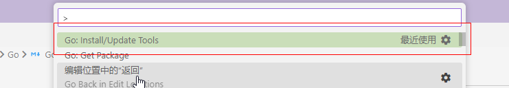

# Go
## Go语言中文网
https://studygolang.com/
## 配置``VSCode``开发环境
1. 安装``Go``扩展


2. Ctrl + Shift + P



3. 全选安装


> 如果下载速度缓慢或者遇到网络问题，可以使用Go代理，打开cmd执行 ``go env -w GO111MODULE=on``，然后再执行``go env -w GOPROXY=https://goproxy.cn,direct``

## 包和函数

```go
package main

import (
	"fmt"
)

func main(){
    fmt.Println("Hello World")
}
```
### ``fmt.Print``和``fmt.Println``
- 可以传递若干和参数，参数之间用逗号隔开
- 参数可以是字符串，数字，表达式等等
### ``fmt.Printf``
- 第一个参数必须是字符串，这个字符串里包含像``v%``这样的个格式化动词，它的值由第二个参数的值所代替；如果指定了多个格式化动词，它们的值由后面的参数按顺序进行替换
- 在格式化动词里指定宽度可以对齐文本，正数表示向左填充空格；负数表示向右填充空格
```go
package main

import (
	"fmt"
)

func main() {
	fmt.Print("My weight on the surface of Mars is ")
	fmt.Print(130 * 0.3783)
	fmt.Print(" lbs, and I would be ")
	fmt.Print(18 *365 / 687)
	fmt.Println(" years old")
	fmt.Printf("%-15v $%4v\n", "SpaceX", 94.212417899808)
}
```

### ``math/rand``
- 可以生成伪随机数
#### ``rand.Intn``返回一个指定返回的随机整数
```go
package main

import (
	"fmt"
	"math/rand"
)

func main() {
	var num = rand.Intn(10) + 1
	fmt.Println(num)
	num = rand.Intn(10) + 1
	fmt.Println(num)
	num = rand.Intn(10) + 1
	fmt.Println(num)
	num = rand.Intn(10) + 1
	fmt.Println(num)
	num = rand.Intn(10) + 1
	fmt.Println(num)
	num = rand.Intn(10) + 1
	fmt.Println(num)
	num = rand.Intn(10) + 1
	fmt.Println(num)
}
```

