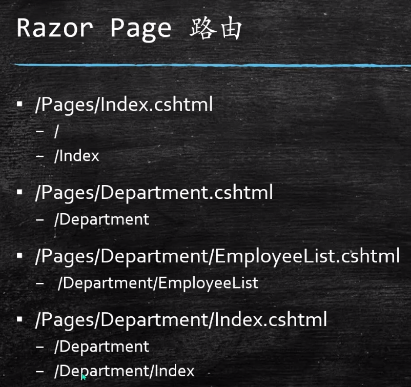
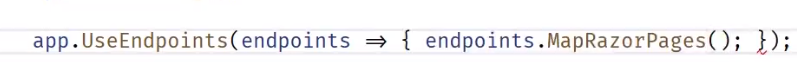
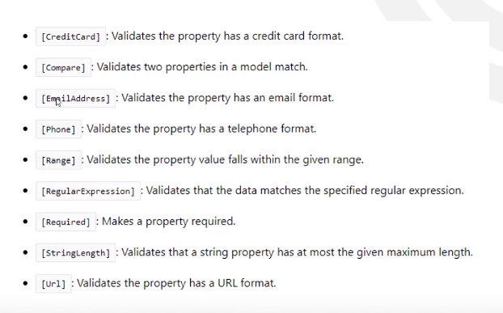
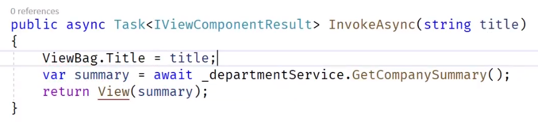

# .csproj文件

```c#
<Project Sdk="Microsoft.NET.Sdk.Web">

  <PropertyGroup>
    <!--项目运行环境-->
    <!--.net Framework环境 <TargetFramework>net472</TargetFramework>-->
    <!--支持多个运行环境 <TargetFrameworks>netcoreapp2.1;net472</TargetFrameworks>-->
    <TargetFramework>netcoreapp2.1</TargetFramework>
  </PropertyGroup>

  <ItemGroup>
    <Folder Include="wwwroot\" />
  </ItemGroup>
	
  <!--引用的程序集-->      
  <ItemGroup>
    <PackageReference Include="Microsoft.AspNetCore.App" />
    <PackageReference Include="Microsoft.AspNetCore.Razor.Design" Version="2.1.2" PrivateAssets="All" />
  </ItemGroup>

</Project>
```

# wwwroot文件夹

- 静态文件文件夹

# 依赖注入

## 生命周期

- Transient:每次被请求都会创建新的实例
- Scoped:每次web请求会创建一个实例
- Singleton:一旦被创建实例就会一直使用这个实例，直到应用停止

# Startup文件

## 注册服务和配置中间件

```c#
	public class Startup
    {
        //配置依赖注入
        public void ConfigureServices(IServiceCollection services)
        {
            //注册MVC相关服务
            services.AddControllersWithViews();
            
            services.AddSingleton<ICinemaService,CinemaMemoryService>();
            services.AddSingleton<IMovieService, MovieMemoryService>();
        }

        /// <summary>
        ///  配置请求管道(中间件)
        /// </summary>
        /// <param name="app"></param>
        /// <param name="env"></param>
        /// <param name="logger">内置的日志</param>
        public void Configure(IApplicationBuilder app, IHostingEnvironment env,ILogger<Startup> logger)
        {
            if (env.IsDevelopment())//判断launchSettings.json文件中的ASPNETCORE_ENVIRONMENT的值
            {
                app.UseDeveloperExceptionPage();
            }
            
            //app.UseMvcWithDefaultRoute();//做了默认的路由配置，不需要再自己配置
            //app.UseMVC();
			//app.UseStaticFiles();//访问wwwroot内的文件
            app.Use(async (context,next) =>
            {
                logger.LogInformation("M1 start");//1
                await context.Response.WriteAsync("Hello World!");
                await next();//调用下一个中间件
                logger.LogInformation("M1 end");//4
            });
            //不会调用后面的中间件
            app.Run(async (context) =>
            {
                logger.LogInformation("M2 start");//2
                await context.Response.WriteAsync("Another World!");
                logger.LogInformation("M2 end");//3
            });
        }
    }
```

# 前端包下载

1. 在web项目下添加package.json配置文件
2. 添加引用包的配置

```json
{
    "version": "1.0.0",
    "name": "asp.net",
    "private": true,
    "devDependencies": {
        "bootstrap": "4.1.3",
        "jquery": "3.1.0",
        "popper.js": "1.14.3"
    }
}
```

# 前端文件打包压缩

1. 将名为 bundleconfig.json 的新 JSON 文件添加到 MVC 或 Razor Pages 项目根目录

```json
[
  {
    "outputFileName": "wwwroot/css/all.min.css",
    "inputFiles": [
      "node_modules/bootstrap/dist/css/bootstrap.css",
      "wwwroot/css/site.css"
    ]
  },
  {
    "outputFileName": "wwwroot/js/site.min.js",
    "inputFiles": [
      "wwwroot/js/site.js"，
      "node_modules/bootstrap/dist/js/bootstrap.js"
    ],
    "minify": {
      "enabled": true,
      "renameLocals": true
    },
    "sourceMap": false
  }
]
```

- `outputFileName`：要输出的捆绑文件的名称。 可包含 bundleconfig.json 文件中的相对路径。 （必需）
- `inputFiles`：要捆绑在一起的文件数组。 这些是配置文件的相对路径。 可以选择使用空值，*这将导致输出文件为空。 支持 [glob](https://www.tldp.org/LDP/abs/html/globbingref.html) 模式
- minify`：输出类型的缩小选项。 可选，默认值 - `minify: { enabled: true }
- `includeInProject`：指示是否将生成的文件添加到项目文件的标记。 可选，默认值 - false
- `sourceMap`：指示是否为捆绑的文件生成源映射的标记。 可选，默认值 - false
- `sourceMapRootPath`：用于存储所生成的源映射文件的根路径

2. 在wwwroot文件夹添加css和js文件夹
3. Nuget 安装 BuildBundlerMinifier 包，生成项目

# 设置MVC

## 注册MVC服务

在Startup.cs文件的ConfigureServices方法中注册

```c#
		public void ConfigureServices(IServiceCollection services)
        {
            //注册MVC相关服务
            services.AddMvc();

            services.AddSingleton<ICinemaService,CinemaMemoryService>();
            services.AddSingleton<IMovieService, MovieMemoryService>();
        }
```

## 配置MVC中间件

在Startup.cs文件的Configure方法中配置

```c#
		public void Configure(IApplicationBuilder app, IHostingEnvironment env,ILogger<Startup> logger)
        {
            if (env.IsDevelopment())//判断launchSettings.json文件中的ASPNETCORE_ENVIRONMENT的值
            {
                app.UseDeveloperExceptionPage();
            }
            
            app.UseStaticFiles();//访问wwwroot内的文件

            //配置MVC中间件
            app.UseMvc(routes =>
            {
                //配置路由，路由也可以用特性设置[Route([controller])]  [Route([action])] 或Route([controller]/[action])
                routes.MapRoute("default",template:"{Controller=Home}/{action=Index}/{id?}");//默认路由
            });
        }
```

# Controller控制器

## 路由配置

- 在添加MVC中间件时配置

```c#
			//配置MVC中间件
            app.UseMvc(routes =>
            {
                //配置路由，路由也可以用特性设置[Route([controller])]  [Route([action])] 或Route([controller]/[action])
                routes.MapRoute("default",template:"{Controller=Home}/{action=Index}/{id?}");//默认路由
            });
```

- 属性标签配置路由

```c#
[Route("[controller]/[action]")]
public class HomeController:Controller{
    ...
}
```

## 继承于Controller类

1. 可以返回IActionResult结果

- return OK();//return NotFound();
- 返回文件：return this.File("文件路径"或者字节数组等);
- Content("...");//类似于string
- return new ObjectResult(对象);//将对象以何种形式返回给前端是由管道里的其他处理环节决定的不是Controller决定的
- 返回view:View();//不写参数则默认寻找的是本方法名作为参数如View("Index");
- View(对象);//view就可以用@Model得到传过去的对象，即@Model就是回传的对象
- RedrictToAction();

# 使用Razor

## 路由



## configureservice方法services.addRazorPages();

## configure方法



# HtmlHelpers

- 超链接：@Html.ActionLink("Content","actionName",“ControllerName”,new{id = @Model.id});

## 配置内置TagHelper

在Views文件夹下添加_ViewImports.cshtml文件,文件内容

```c#
@addTagHelper *, Microsoft.AspNetCore.Mvc.TagHelpers
```

- 根据环境引入样式文件

```html
	<environment include="Development">
        <link rel="stylesheet" asp-href-include="css/*" asp-href-exclude="css/all.min.css"/>
    </environment>

    <environment exclude="Development">
        <link rel="stylesheet" asp-href-include="css/all.min.css"/>
    </environment>
```

- img图片处理更新后缓存问题

```html
@* asp-append-version 处理缓存 *@

```

- asp-for：值和model的属性一致
- asp-route-参数名：参数名和要接收的参数名一致
- asp-controller 和 asp-action
- asp-items="Html.GetEnumSelectList<枚举类型>()"//给下拉框用
- asp-validation-for：显示验证错误信息
- -<div asp-validation-summary="All"></div><!--汇总错误信息 All:所有信息，ModelOnly:属性级别的错误信息，不会显示验证错误信息-->

## 自定义Taghelper

1. 继承TagHelper类,重写Process方法
2. 在_ViewImports.cs中注册：@addTagHelper *,项目名

# 从View 传值到Controller

## 使用Form

```c#
@using CoreDemo.Models
@model Movie

<div class="container">
    <form asp-action="Add" method="post">
        <input type="hidden" asp-for="CinemaId" />
        <div class="form-group row">
            <label asp-for="Name" class="col-sm-2 col-form-label"></label>
            <div class="col-sm-10">
                <input type="text" class="form-control" asp-for="Name" />
            </div>
            <span asp-validation-for="Name"></span>
        </div>
        <div class="form-group row">
            <label asp-for="Starring" class="col-sm-2 col-form-label"></label>
            <div class="col-sm-10">
                <input type="text" class="form-control" asp-for="Starring">
            </div>
            <span asp-validation-for="Starring"></span>
        </div>
        <div class="form-group row">
            <label asp-for="ReleaseDate" class="col-sm-2 col-form-label"></label>
            <div class="col-sm-10">
                <input type="date" class="form-control" asp-for="ReleaseDate">
            </div>
            <span asp-validation-for="ReleaseDate"></span>
        </div>
        @* ticai是枚举类型 *@
        <div class="form-group row">
            <label asp-for="ticai" class="col-sm-2 col-form-label"></label>
            <div class="col-sm-10">
                <select asp-for="ticai" asp-items="Html.GetEnumSelectList<ticai>()"></select>
            </div>
            <span asp-validation-for="ticai"></span>
        </div>
        <div class="form-group row">
            <div class="col-sm-10 offset-sm-2">
                <button type="submit" class="btn btn-primary">确认</button>
            </div>
        </div>
    </form>
</div>
```

```c#
    public enum ticai
    {
        惊悚 = 1,
        喜剧 = 2,
        人物 = 3
    }
```

# 数据验证注解

## 常用注解



- [Display(Name = "")] : 前端label可以显示Name的值

  ```c#
  public class Movie
      {
          [Required]
          public int Id { get; set; }
          [Display(Name ="姓名"),MaxLength(10)]
          public string Name { get; set; }
          public int CinemaId { get; set; }
          [Display(Name = "主演")]
          public string Starring { get; set; }
          [Display(Name = "上映时间")]
          [DataType(DataType.DateTime)]//定义验证类型
          public DateTime ReleaseDate { get; set; }
          [Display(Name = "题材")]
          public ticai ticai { get; set; }
      }
  ```

  

  ## ModelState.IsValid

  - 该值为true则验证通过

## 自定义验证

1. 定义类egAttribute继承Attribute并实现IModelValidator接口的validate方法

## 远程验证（[remote]）

# EFCore

## 配置

1. 在appsetting.json文件配置连接字符串

```json
{
    "Logging": {
        "LogLevel": {
            "Default": "Warning"
        }
    },
    "AllowedHosts": "*",
    "ConnectionStrings": {
        "DefaultConnection": "Data Source=(localdb)\\MSSQLLocalDB;Initial Catalog=master;Integrated Security=True;Connect Timeout=30;Encrypt=False;TrustServerCertificate=False;ApplicationIntent=ReadWrite;MultiSubnetFailover=False"
    }
}
```

2. 建一个类继承Context

   ```c#
   public class DataContext:DbContext
       {
           public DataContext(DbContextOptions<DataContext> options):base(options)
           {
   
           }
           public DbSet<Cinema> Cinemas { get; set; }//对应要建立的表名
           public DbSet<Movie> Movies { get; set; }
       }
   ```

3. startup.cs文件注册DbContext

   ```c#
   private readonly IConfiguration _configuration;
           public Startup(IConfiguration configuration)
           {
               _configuration = configuration;
           }
           //配置依赖注入
           public void ConfigureServices(IServiceCollection services)
           {
               //注册MVC相关服务
               services.AddMvc();
   
               //注册DbContext
               //var connectionString = _configuration["ConnectionStrings:DefaultConnection"];
               var connectionString = _configuration.GetConnectionString("DefaultConnection");
               services.AddDbContext<DataContext>(options =>
               {
                   options.UseSqlServer(connectionString);
               });
           }
   ```

   4. 程序包控制台执行 Add-Migration  ...和 Update-DataBase -v命令进行数据库迁移

# Partial View(复用代码)

- 可以嵌套
- 没有自己的逻辑和model

@Html.Partial("_PartialViewName",data)         data是引用页面传进去的

@Html.PartialAsync("_PartialViewName",data)

或者使用Taghelper:<partial name="_PartialViewName" for="data" />

# Template

@Html.DisplayForModel()

- index.cshtml

  ```c#
  @using CoreDemo.Models
  @model IEnumerable<Cinema>
  
  <div class="container">
      <div class="row">
          <table class="table">
              <thead class="thead-dark">
                  <tr>
                      <th scope="col">Id</th>
                      <th scope="col">Name</th>
                      <th scope="col">Location</th>
                      <th scope="col">Capacity</th>
                      <th scope="col">操作</th>
                  </tr>
              </thead>
              <tbody>
                  @Html.DisplayForModel()
              </tbody>
          </table>
  
          @section bottom{
              <a asp-action="Add">添加</a>
          }
      </div>
  </div>
  ```

  - 模板（在index.cshtml同级的DisplayTemplates文件夹下）

  ```c#
  @using CoreDemo.Models
  @model Cinema
  
  
  <tr>
      <th scope="row">@Model.Id</th>
      <td>
          <a asp-controller="Movie" asp-action="Index" asp-route-cinemaId="@Model.Id"> @Model.Name</a>       
      </td>
      <td>@Model.Location</td>
      <td>@Model.Capacity</td>
      <td>
          <a asp-controller="Home" asp-action="Edit" asp-route-cinemaId="@Model.Id">编辑</a>
      </td>
  </tr>
  ```

# View Component

1. 项目的ViewComponents文件夹下建立xxxViewCompontnt类，继承ViewComponent,实现Invoke[Async]方法，返回Task<IViewComponentResult>[return view()],如果需要传参数，直接给Invoke[Async]加参数



2. 视图建在Shared/Components/xxx/Default.cshtml

3. 调用：@[await] Component.Invoke[Async] ("xxx")

   带参数的调用：@[await] Component.Invoke[Async] ("xxx",new {title="汇总列表"})

4. TagHelper方式调用:`<vc:component-name title="汇总二"><vc:component-name>`,要在_ViewImports.cshtml下添加@addTagHelper *,项目名称

# 授权认证

- UserManager<IdentityUser>
- SingInManager<IdentityUser>

# 基于claim的授权

- 键值对

## policy使用

1. 在startup中注册
2. 使用policy授权

# xxs

# CSFR

# model Binding

- Bind
- BindNever
- BindRequired

# Logging

## 诊断中间件

在startup中使用这些方法

- UseDeveloperExceptionPage
- UseStatusCodePages
- UseExceptionhandler
- UseWelcome

## ILogger


注入：


## 使用第三方Logger

### Nlog

1. 在NuGet中安装：Nlog 和 Nlog.Web.AspNetCore
2. 配置Configure如下

```c#
public void Configure(IApplicationBuilder app, IHostingEnvironment env, ILoggerFactory loggerFactory)
{
    loggerFactory.AddNLog();//添加NLog
    env.ConfigureNLog("nlog.config");//读取Nlog配置文件

}
```

3. 添加nlog配置文件 **nlog.config** 到bin文件夹下

```xml
<?xml version="1.0" encoding="utf-8" ?>
<nlog xmlns="http://www.nlog-project.org/schemas/NLog.xsd"
      xmlns:xsi="http://www.w3.org/2001/XMLSchema-instance"
     autoReload="true"
       internalLogLevel="Warn"
       internalLogFile="internal-nlog.txt">
     <!--define various log targets-->
     <targets>
        <!--write logs to file-->
         <target xsi:type="File" name="allfile" fileName="nlog-all-${shortdate}.log"
                  layout="${longdate}|${logger}|${uppercase:${level}}|${message} ${exception}" />
    
         <target xsi:type="File" name="ownFile-web" fileName=
```