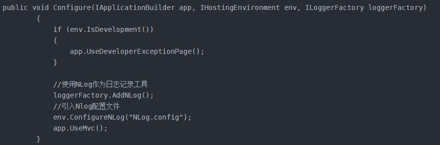
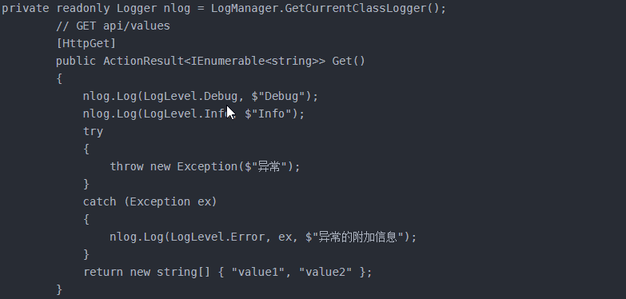

# NLog保存日志到数据库

## 配置文件

第一步：首先添加包NLog.Config （可通过微软添加包命令Install-Package 包名进行添加，也可以通过管理NuGet程序包进行添加），添加成功后会生成NLog.config配置文件。并对该配置文件进行配置。详细配置可参考Git上 NLog说明。

```xml
<?xml version="1.0" encoding="utf-8" ?>
  <nlog xmlns="http://www.nlog-project.org/schemas/NLog.xsd"
        xmlns:xsi="http://www.w3.org/2001/XMLSchema-instance"
        xsi:schemaLocation="http://www.nlog-project.org/schemas/NLog.xsd NLog.xsd"
        autoReload="true"
        throwExceptions="false"
        internalLogLevel="Warn"   
        internalLogFile="Logs/nlog-internal.log">
    
   <!--internalLogLevel="Off"-->
   <!-- optional, add some variables
   https://github.com/nlog/NLog/wiki/Configuration-file#variables
   -->
   <variable name="myvar" value="myvalue"/>
 
   <!--
   See https://github.com/nlog/nlog/wiki/Configuration-file
   for information on customizing logging rules and outputs.
    -->
   <targets>
 
     <!--
     add your targets here
     See https://github.com/nlog/NLog/wiki/Targets for possible targets.
     See https://github.com/nlog/NLog/wiki/Layout-Renderers for the possible layout renderers.
     -->
 
     <!--
     Write events to a file with the date in the filename.
     <target xsi:type="File" name="f" fileName="${basedir}/logs/${shortdate}.log"
             layout="${longdate} ${uppercase:${level}} ${message}" />
     -->
 
     <!-- write logs to file -->
     <target xsi:type="File" name="allfile" fileName="Logs/${date:format=yyyyMM}/nlog-all-${shortdate}.log"
              layout="${longdate}|${event-properties:item=EventId.Id}|${uppercase:${level}}|${logger} ${newline}${message} ${exception} ${newline}" />
 
     <target xsi:type="File" name="ownFile-web" fileName="Logs/${date:format=yyyyMM}/nlog-own-${shortdate}.log"
              layout="${longdate}|${event-properties:item=EventId.Id}|${uppercase:${level}}|${logger} ${newline}${message} ${exception} ${newline} --- |url: ${aspnet-request-url}|action: ${aspnet-mvc-action}" />
 
     <target xsi:type="Null" name="blackhole" />
 
     <target xsi:type="Database" name="database">
       <connectionString>${var:connectionString}</connectionString>
       <commandText>
         insert into syslogs (Application,Levels,Operatingtime,Operatingaddress,Userid,Logger,Callsite,Requesturl,Referrerurl,Action,Message,Exception)
         values (@application,@levels,@operatingtime,@operatingaddress,@userid,@logger,@callSite,@requesturl,@referrerurl,@action,@message,@exception);
       </commandText>
       <parameter name="@application" layout="WebApi" />
       <parameter name="@levels" layout="${level}" />
       <parameter name="@operatingTime" layout="${date}" />
       <parameter name="@operatingaddress" layout="${aspnet-Request-IP}" />
       <parameter name="@userid" layout="1" />
       <parameter name="@logger" layout="${logger}" />
       <parameter name="@callSite" layout="${callsite}" />
       <parameter name="@requesturl" layout="${aspnet-request-url}" />
       <parameter name="@referrerurl" layout="${aspnet-request}" />
       <parameter name="@action" layout="${aspnet-mvc-action}" />
     <parameter name="@message" layout="${message}" />
       <parameter name="@exception" layout="${exception:tostring}" />
     </target>
     
   </targets>
 
   <rules>
     <!-- add your logging rules here --> 
     <!--
     Write all events with minimal level of Debug (So Debug, Info, Warn, Error and Fatal, but not Trace)  to "f"
     <logger name="*" minlevel="Debug" writeTo="f" />
     --> 
     <!--All logs, including from Microsoft-->
     <!--minlevel 改为Trace 跟踪全部 Error 只捕获异常-->
     <logger name="*" minlevel="Error" writeTo="allfile" />
 
     <!--Skip Microsoft logs and so log only own logs-->
     <logger name="Microsoft.*" minlevel="Trace" writeTo="blackhole" final="true" />
     <logger name="*" minlevel="Trace" writeTo="ownFile-web" />
     <logger name="*" minlevel="Trace" writeTo="database" />    1     
   </rules>
 </nlog>

```

## 在数据库中添加该记录日志表

## 修改Program.cs文件

添加包NLog.Web.AspNetCore，在Program.cs中的WebHost加入".UseNLog()"（该属于程序集NLog.Web，需要添加引用using NLog.Web;）,即为添加nlog.

```c#
namespace WebApi
{
    public class Program
    {
        public static void Main(string[] args)
        {
            CreateWebHostBuilder(args).Build().Run();
        }

        public static IWebHostBuilder CreateWebHostBuilder(string[] args) =>
            WebHost.CreateDefaultBuilder(args)
                .UseStartup<Startup>()
                .UseNLog(); //加入nlog日志
    }
}

```

## 修改Startup.cs的Configure方法

在Startup.cs中的Configure方法中添加记日志代码，即需要加载的配置文件和配置日志写入数据库连接字符串代码。注意：为避免中文乱码问题需要添加System.Text.Encoding.CodePages包。

```c#
public void Configure(IApplicationBuilder app, IHostingEnvironment env)
          { 
              #region Nlog记日志
              //将日志记录到数据库                 config/NLog.config             NLog.LogManager.LoadConfiguration("nlog.config").GetCurrentClassLogger();       NLog.LogManager.Configuration.Variables["connectionString"] = Configuration.GetConnectionString("DefaultConnection");   Encoding.RegisterProvider(CodePagesEncodingProvider.Instance);  //避免日志中的中文输出乱码
              #endregion 
              if (env.IsDevelopment())
                 app.UseDeveloperExceptionPage();
             else
                 app.UseHsts();
    app.UseHttpsRedirection(); 
             app.UseMvc();
         }

```

或者



## 使用

```c#
public class UsersController : Controller
    {
        private readonly ILogger logger;    
         public UsersController(ILoggerFactory loggerFactory)
        {
            this.logger = loggerFactory.CreateLogger<UsersController>();
            #region 测试日志
            logger.LogTrace("开发阶段调试，可能包含敏感程序数据", 1);
            logger.LogDebug("开发阶段短期内比较有用，对调试有益。");
            logger.LogInformation("你访问了首页。跟踪程序的一般流程。");
            logger.LogWarning("警告信息！因程序出现故障或其他不会导致程序停止的流程异常或意外事件。");
            logger.LogError("错误信息。因某些故障停止工作");
            logger.LogCritical("程序或系统崩溃、遇到灾难性故障！！！");
            #endregion
        }

```

或者



