# Webapi

Webapi:使用http协议并通过网络调用的API (大多数API都不是RESTful API)

# RESTful API

示例：

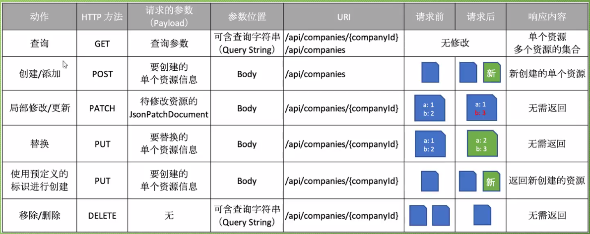

# http状态码

## 1xx：属于信息性的状态码，web api并不使用1xx的状态码

## 2xx：请求执行成功

- 200-OK,表示请求成功(return Ok();)

- 201-Created，请求成功并创建了资源

- 204-No Content，请求成功，但不应该返回任何东西，例如删除操作

## 3xx:用于跳转，例如告诉搜索引擎某个页面的网址已经永久的改变。绝大多数API不需要使用这类状态码

## 4xx：客户端错误

- 400-Bad Request:表示API消费者发送到服务器的请求是有错误的

- 401-Unauthorized:表示没有提供授权信息或者提供授权信息不正确

- 403-Forbidden:表示身份认证已经成功，但是已认证的用户无法访问请求的资源

- 404-Not Found:表示请求的资源不存在（return NotFound();）

- 405-Method Not Allowed:当尝试发送请求资源的时候，使用了不被支持的http方法

- 406-Not Accepted:表示API消费者请求的表述格式（json.xml之类）并不被API所支持，并且API不会提供默认的表述格式

- 409-Conflict:表示请求与服务器当前状态冲突。如要创建的资源已存在或者要更新的资源在服务器也进行更新

- 415-Unsupported Media Type:有些请求必须带着数据发往服务器，这些数据都是属于特定的媒体类型，如果API不支持该媒体类型，就会返回415

- 422-Unprocessable entity:是Http扩展协议的一部分，说明服务器已经懂得了实体的Content-Type,实体的语法也没有问题，但是服务器仍然无法处理这个实体数据，通常表示语意上有错误或表示实体验证的错误

## 5xx:服务器端的错误

- 500-Internal server error:表示服务器出现错误

# 内容协商(请求和响应的内容格式)

根据API消费者设置的媒体类型，响应输出对应格式的结果

## Accept Header

Application/json（默认）

Application/xml

…

## Content-Type Header

Application/json（默认）

Application/xml

…

## 请求：

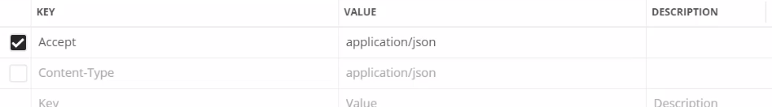

## 响应：

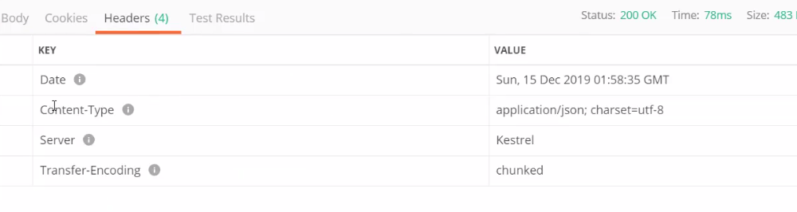

## 设置**请求和响应格式不一致时返回**406状态码

```c#
services.AddControllers(setup =>
            {
                setup.ReturnHttpNotAcceptable = true;//该值设置为true，请求和响应格式不一致时会返回406状态码
            });

```

## **设置支持输出xml格式**

```c#
services.AddControllers(setup =>
            {
				//旧的方法
                //setup.OutputFormatters.Add(new XmlDataContractSerializerOutputFormatter());//支持xml, OutputFormatters是个集合
//setup.OutputFormatters.Insert(0, new XmlDataContractSerializerOutputFormatter());//放在第一位则默认的就是xml格式
            }).AddXmlDataContractSerializerFormatters();//Input和Output都添加xml格式

```

# 读取配置文件

```json
{
    "AllowedHosts": "*",
    "Logging": {
        "LogLevel": {
            "Default": "Information",
            "Microsoft": "Warning",
            "Other": "Information"
        }
    }
}
```

```c#
	public class Logging
    {
        public const string logging = "Logging";
        public LogLevel LogLevel { get;} = new LogLevel();
    }

    public class LogLevel
    {
        public string Default { get; set; }

        public string Microsoft { get; set; }

        public string Other { get; set; }
    }
```

- startup中读取

```c#
		app.Use(async (context, next) =>
            {
                var log = new Logging();
                Configuration.GetSection(Logging.logging).Bind(log);
                await context.Response.WriteAsync(log.LogLevel.Microsoft);
            });
```

- 注入之后在其他地方使用

```c#
 //添加到依赖注入容器
 services.Configure<Logging>(Configuration.GetSection(Logging.logging));
```

```c#
 		private readonly Logging _options;
        public ValuesController(IOptions<Logging> options)
        {
            _options = options.Value;
        }

        [HttpGet(nameof(GetValue))]
        public IActionResult GetValue()
        {
            var str = _options.LogLevel.Default;
            return Ok($"{str}");
        }
```


# ActionResult<T>

# AutoMapper: 对象到对象的映射器

1. Nuget安装AutoMapper.Microsoft.Extensions.DependencyInjection

2. ConfigServices方法注册服务

 ```c#
 services.AddAutoMapper(AppDomain.CurrentDomain.GetAssemblies());
 ```

3. 类继承Profile

```c#
public class EmployeeProfile: Profile
    {
        public EmployeeProfile()
        {
            CreateMap<Employee, EmployeeDto>()
                .ForMember(dest => dest.Name,
                    opt => opt.MapFrom(src => $"{src.FirstName} {src.LastName}"))
                .ForMember(dest => dest.GenderDisplay
                , opt => opt.MapFrom(src => src.Gender.ToString()))
                .ForMember(dest => dest.Age, 
                    opt => opt.MapFrom(src => DateTime.Now.Year - src.DateOfBirth.Year));

            CreateMap<EmployeeAddDto, Employee>();
            CreateMap<EmployeeUpdateDto, Employee>();
            CreateMap<Employee, EmployeeUpdateDto>();
        }
}

```

4. 代码中映射

```c#
_mapper.Map<IEnumerable<CompanyDto>>(companies);
```

# **异常处理（自定义异常信息）**

```c#
if (env.IsDevelopment())
            {
                app.UseDeveloperExceptionPage();
            }
            else
            {
                //存在未处理异常
                app.UseExceptionHandler(appBuilder =>
                {
                    appBuilder.Run(async context =>
                    {
                        context.Response.StatusCode = 500;
                        await context.Response.WriteAsync("Unexpected Error!");
                    });
                });
            }

```

# HTTP HEAD

HEAD几乎和GET一样，只是HEAD的API不应该返回响应的body，HEAD可以用来在资源上获取一些信息

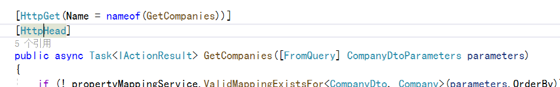

# 过滤和搜索

## Binding Source 特性

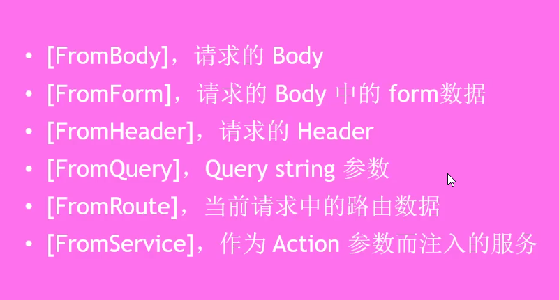

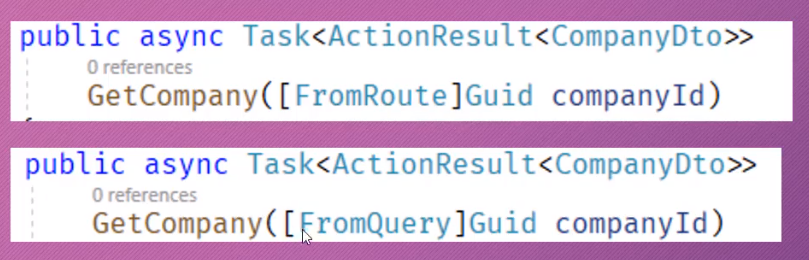

## ApiController更改后的规则

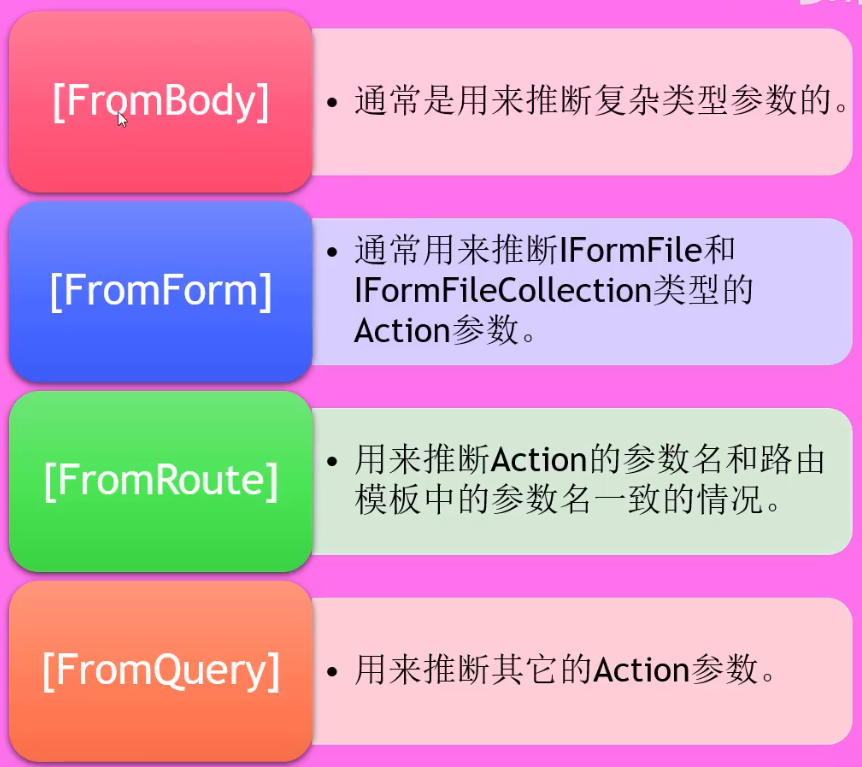

## 过滤：根据条件限定返回的集合

过滤的意思就是把某个字段的名字以及想要让该字段匹配的值一起传递给API，并将这些作为返回集合的一部分

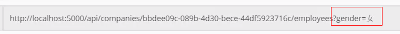

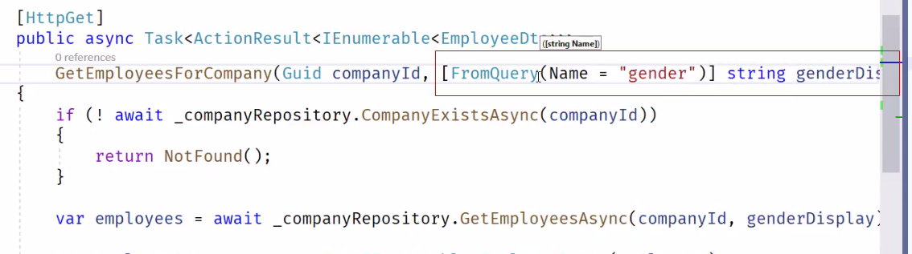

## 搜索：根据预定义的规则，把符合条件的数据添加到集合


# Http Options 和 XM支持

Option请求可以获得针对某个api的通信选项信息

# 输入验证

## 定义验证规则

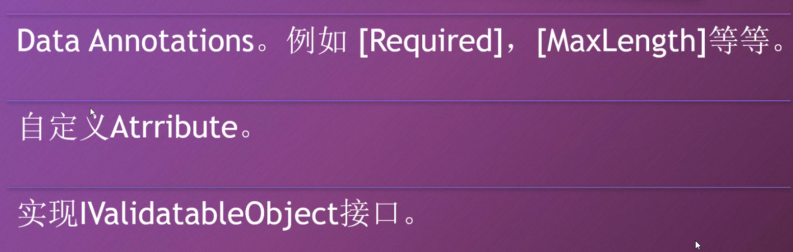

## Attribute示例

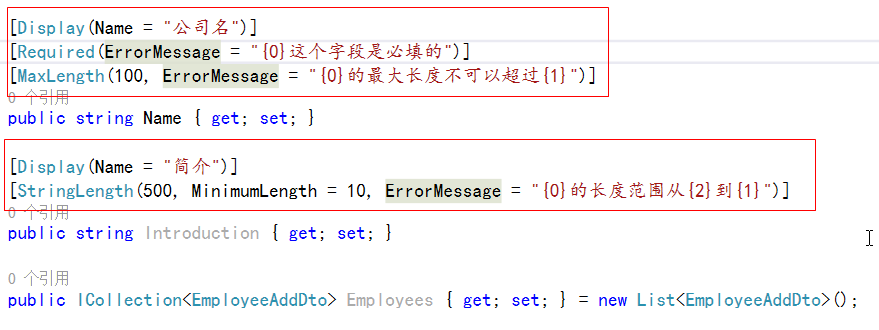

## 自定义Attribute示例

```c#
public class EmployeeNoMustDifferentFromFirstNameAttribute : ValidationAttribute
    {
        protected override ValidationResult IsValid(object value, ValidationContext validationContext)
        {
            var addDto = (EmployeeAddOrUpdateDto)validationContext.ObjectInstance;
            if (addDto.EmployeeNo == addDto.FirstName)
            {
                return new ValidationResult(ErrorMessage, new[] { nameof(EmployeeAddOrUpdateDto) });
            }
            return ValidationResult.Success;
        }
}

```

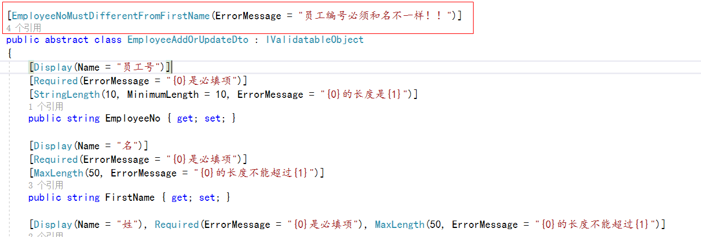

## IValidatableObject接口

```c#
public abstract class EmployeeAddOrUpdateDto : IValidatableObject
    {
        [Display(Name = "员工号")]
        [Required(ErrorMessage = "{0}是必填项")]
        [StringLength(10, MinimumLength = 10, ErrorMessage = "{0}的长度是{1}")]
        public string EmployeeNo { get; set; }
        public IEnumerable<ValidationResult> Validate(ValidationContext validationContext)
        {
            if (FirstName == LastName)
            {
                yield return new ValidationResult("姓和名不能一样",
                    new[] { nameof(FirstName), nameof(LastName) });
            }
        }

```

## **其他验证方式**

### FluentValidation

1. 容易创建复杂的验证规则

2. 验证规则与Model分开

3. 容易进行单元测试

## **如果验证错误**

### 默认的

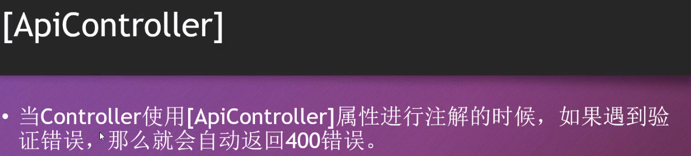

### **自定义**

```c#
//处理输入验证错误
Services.ConfigureApiBehaviorOptions(setup =>
                {
                    setup.InvalidModelStateResponseFactory = context =>
                    {
                        var problemDetails = new ValidationProblemDetails(context.ModelState)
                        {
                            Type = "http://www.baidu.com",
                            Title = "有错误！！！",
                            Status = StatusCodes.Status422UnprocessableEntity,
                            Detail = "请看详细信息",
                            Instance = context.HttpContext.Request.Path
                        };

                        problemDetails.Extensions.Add("traceId", context.HttpContext.TraceIdentifier);

                        return new UnprocessableEntityObjectResult(problemDetails)
                        {
                            ContentTypes = { "application/problem+json" }
                        };
                    };
                });

```

# **缓存**

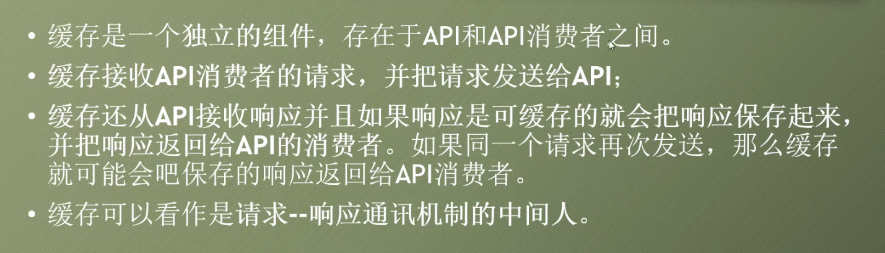

- 客户端缓存（存在于客户端，私有）

- 网关缓存（服务器端，共享）

- 代理缓存（存在网络的其他地方）

## 实现的方式

1. 添加特性 [ResponseCache(Duration = 60)]// Duration指定缓存的时间

> ResponseCache：只是添加一个响应头，并没有缓存任何数据

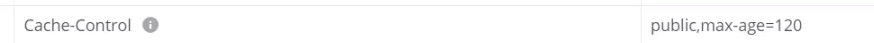

2. 注册服务

```c#
services.AddResponseCaching();

app.UseResponseCaching();//微软自带的，不支持验证模型
```

也可以在AddControllers里设置

```c#
services.AddControllers(setup =>
                {
                    setup.ReturnHttpNotAcceptable = true;
                    setup.CacheProfiles.Add("120CacheProfile",new CacheProfile
                    {
                        Duration = 120
                    });
                })
```

然后在特性中指定``[ResponseCache(CacheProfileName = "120CacheProfile")]``

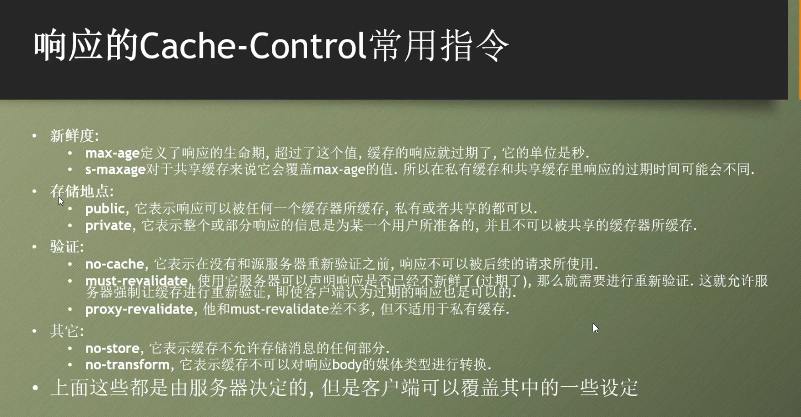

## 支持ETag验证

### Marvin.Cache.Headers库


### Startup

```c#
//ETag
            services.AddHttpCacheHeaders();

			app.UseHttpCacheHeaders();//必须在UseResponseCaching之后，在controller中间件之前

```

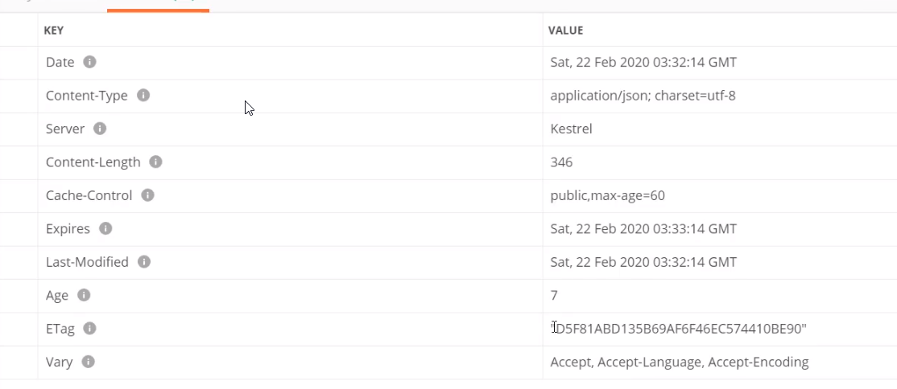

### 过期模型和验证模型的一些参数

#### 全局配置

```c#
services.AddHttpCacheHeaders(expires =>//过期模型
            {
                expires.MaxAge = 60;
                expires.CacheLocation = CacheLocation.Private;
            }, validation =>//验证模型
            {
                validation.MustRevalidate = true;//如果响应过期必须重新验证
            }); 
```

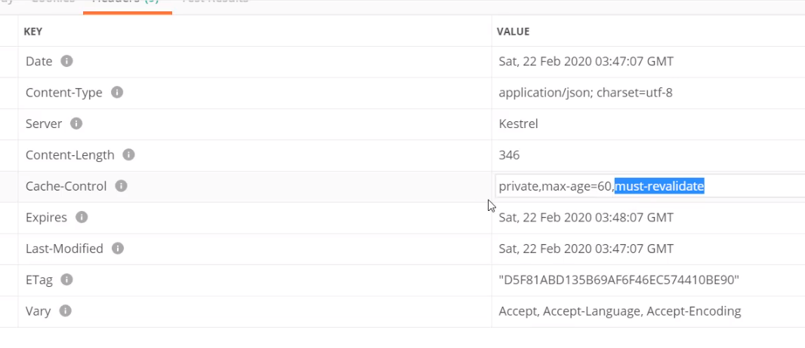

#### 对各个资源单独配置

```c#
		[HttpGet("{userId}")]
        //[ResponseCache(Duration = 60)]
        [HttpCacheExpiration(CacheLocation = CacheLocation.Public,MaxAge = 1800)]//过期模型
        [HttpCacheValidation(MustRevalidate = false)]//验证模型
        public async Task<IActionResult> GetUserById(Guid userId)

```

### Vary-Header

即可以分别对不同格式的请求分别缓存，一般使用默认的就可以

### ETag如何工作

请求时添加一个if-none-match请求头，把之前响应头中的ETag值给它，当请求资源发生改变后，再次请求会响应会带新的ETag，即不是缓存返回而是重新请求

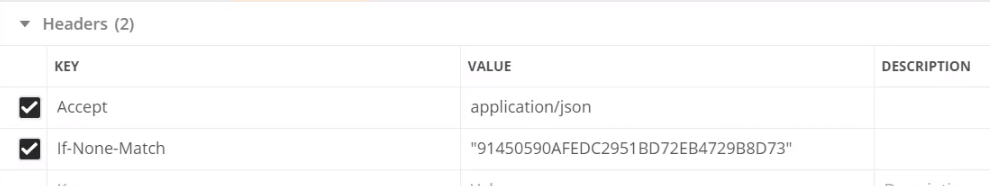

# 并发控制

## 悲观并发控制


## 乐观并发控制


### 例子

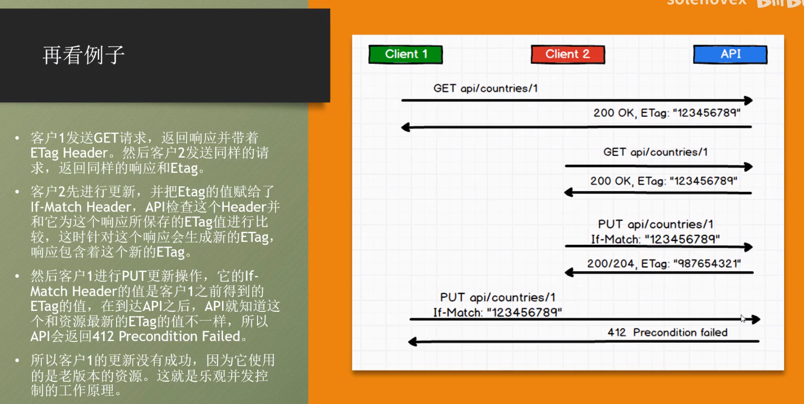

# Swagger

## 安装Swashbuckle.AspNetCore

Nuget安装

## 添加并配置 Swagger 中间件

将 Swagger 生成器添加到 `Startup.ConfigureServices` 方法中的服务集合中：

```c#
public void ConfigureServices(IServiceCollection services)
{
    services.AddDbContext<TodoContext>(opt =>
        opt.UseInMemoryDatabase("TodoList"));
    services.AddMvc()
        .SetCompatibilityVersion(CompatibilityVersion.Version_2_1);

    // Register the Swagger generator, defining 1 or more Swagger documents
 services.AddSwaggerGen();
}
//在 Startup.Configure 方法中，启用中间件为生成的 JSON 文档和 Swagger UI 提供服务：public void Configure(IApplicationBuilder app)
{
    // Enable middleware to serve generated Swagger as a JSON endpoint.
 app.UseSwagger();

    // Enable middleware to serve swagger-ui (HTML, JS, CSS, etc.),
    // specifying the Swagger JSON endpoint.
 app.UseSwaggerUI(c => { c.SwaggerEndpoint("/swagger/v1/swagger.json", "My API V1"); });
}

```

## 生成方法说明xml和取消警告

Xml文件输出路径为默认（startup.cs同一级）即可


## API 信息和说明

传递给 `AddSwaggerGen` 方法的配置操作会添加诸如作者、许可证和说明的信息：

using Microsoft.OpenApi.Models;

使用 `OpenApiInfo` 类修改 UI 中显示的信息：

```c#
// Register the Swagger generator, defining 1 or more Swagger documents
services.AddSwaggerGen(c =>
{
    c.SwaggerDoc("v1", new OpenApiInfo
    {
        Version = "v1",
        Title = "ToDo API",
        Description = "A simple example ASP.NET Core Web API",
        TermsOfService = new Uri("https://example.com/terms"),
        Contact = new OpenApiContact
        {
            Name = "Shayne Boyer",
            Email = string.Empty,
            Url = new Uri("https://twitter.com/spboyer"),
        },
        License = new OpenApiLicense
        {
            Name = "Use under LICX",
            Url = new Uri("https://example.com/license"),
        }
});
// 为 Swagger JSON and UI设置xml文档注释路径
var basePath = Path.GetDirectoryName(AppContext.BaseDirectory);//获取应用程序所在目录(绝对，不受工作目录影响，建议采用此方法获取路径)
var xmlPath = Path.Combine(basePath, "ERP.Api.xml");
c.IncludeXmlComments(xmlPath);
});
```

## 修改默认打开页面

修改launchSetting.json文件

"launchUrl": "swagger/index.html"
