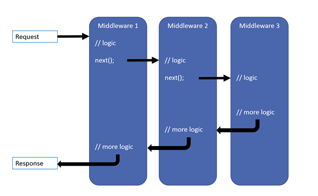
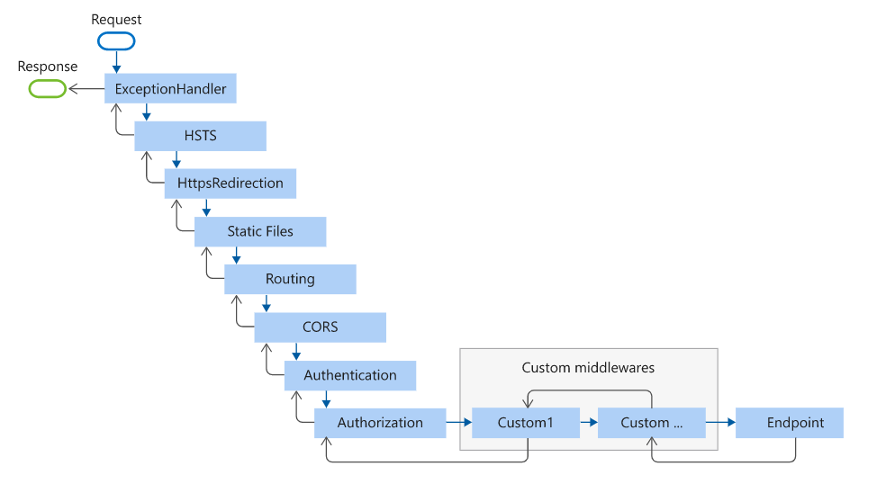
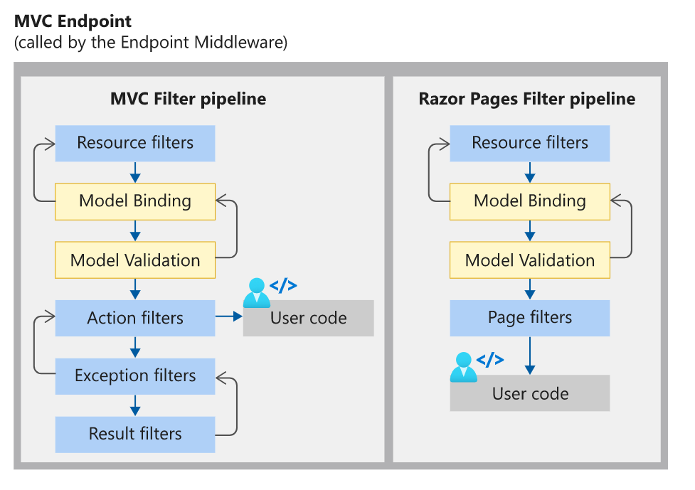

##使用 IApplicationBuilder 创建中间件管道

ASP.NET Core 请求管道包含一系列请求委托，依次调用。 下图演示了这一概念。 沿黑色箭头执行。



每个委托均可在下一个委托前后执行操作。 应尽早在管道中调用异常处理委托，这样它们就能捕获在管道的后期阶段发生的异常。

尽可能简单的 ASP.NET Core 应用设置了处理所有请求的单个请求委托。 这种情况不包括实际请求管道。 调用单个匿名函数以响应每个 HTTP 请求。

```c#
public class Startup
{
    public void Configure(IApplicationBuilder app)
    {
        app.Run(async context =>
        {
            await context.Response.WriteAsync("Hello, World!");
        });
    }
}
```

用 [Use](https://docs.microsoft.com/zh-cn/dotnet/api/microsoft.aspnetcore.builder.useextensions.use) 将多个请求委托链接在一起。 `next` 参数表示管道中的下一个委托。 可通过不调用 next 参数使管道短路。 通常可在下一个委托前后执行操作，如以下示例所示：

```c#
public class Startup
{
    public void Configure(IApplicationBuilder app)
    {
        app.Use(async (context, next) =>
        {
            // Do work that doesn't write to the Response.
            await next.Invoke();
            // Do logging or other work that doesn't write to the Response.
        });

        app.Run(async context =>
        {
            await context.Response.WriteAsync("Hello from 2nd delegate.");
        });
    }
}
```

[Run](https://docs.microsoft.com/zh-cn/dotnet/api/microsoft.aspnetcore.builder.runextensions.run) 委托不会收到 `next` 参数。 第一个 `Run` 委托始终为终端，用于终止管道。 `Run` 是一种约定。 某些中间件组件可能会公开在管道末尾运行的 `Run[Middleware]` 方法：

```c#
public class Startup
{
    public void Configure(IApplicationBuilder app)
    {
        app.Use(async (context, next) =>
        {
            // Do work that doesn't write to the Response.
            await next.Invoke();
            // Do logging or other work that doesn't write to the Response.
        });

        app.Run(async context =>
        {
            await context.Response.WriteAsync("Hello from 2nd delegate.");
        });
    }
}
```

在前面的示例中，`Run` 委托将 `"Hello from 2nd delegate."` 写入响应，然后终止管道。 如果在 `Run` 委托之后添加了另一个 `Use` 或 `Run` 委托，则不会调用该委托。

## 中间件顺序



上图中的“终结点”中间件为相应的应用类型（MVC 或 Razor Pages）执行筛选器管道。



向 `Startup.Configure` 方法添加中间件组件的顺序定义了针对请求调用这些组件的顺序，以及响应的相反顺序。 此顺序对于安全性、性能和功能至关重要。

下面的 `Startup.Configure` 方法按照典型的建议顺序增加与安全相关的中间件组件：

```c#
public void Configure(IApplicationBuilder app, IWebHostEnvironment env)
{
    if (env.IsDevelopment())
    {
        app.UseDeveloperExceptionPage();
        app.UseDatabaseErrorPage();
    }
    else
    {
        app.UseExceptionHandler("/Error");
        app.UseHsts();
    }

    app.UseHttpsRedirection();
    app.UseStaticFiles();
    // app.UseCookiePolicy();

    app.UseRouting();
    // app.UseRequestLocalization();
    // app.UseCors();

    app.UseAuthentication();
    app.UseAuthorization();
    // app.UseSession();
    // app.UseResponseCompression();
    // app.UseResponseCaching();

    app.UseEndpoints(endpoints =>
    {
        endpoints.MapRazorPages();
        endpoints.MapControllerRoute(
            name: "default",
            pattern: "{controller=Home}/{action=Index}/{id?}");
    });
}
```

以下 `Startup.Configure` 方法将为常见应用方案添加中间件组件：

1. 异常/错误处理
   - 当应用在开发环境中运行时：
     - 开发人员异常页中间件 ([UseDeveloperExceptionPage](https://docs.microsoft.com/zh-cn/dotnet/api/microsoft.aspnetcore.builder.developerexceptionpageextensions.usedeveloperexceptionpage)) 报告应用运行时错误。
     - 数据库错误页中间件报告数据库运行时错误。
   - 当应用在生产环境中运行时：
     - 异常处理程序中间件 ([UseExceptionHandler](https://docs.microsoft.com/zh-cn/dotnet/api/microsoft.aspnetcore.builder.exceptionhandlerextensions.useexceptionhandler)) 捕获以下中间件中引发的异常。
     - HTTP 严格传输安全协议 (HSTS) 中间件 ([UseHsts](https://docs.microsoft.com/zh-cn/dotnet/api/microsoft.aspnetcore.builder.hstsbuilderextensions.usehsts)) 添加 `Strict-Transport-Security` 标头。
2. HTTPS 重定向中间件 ([UseHttpsRedirection](https://docs.microsoft.com/zh-cn/dotnet/api/microsoft.aspnetcore.builder.httpspolicybuilderextensions.usehttpsredirection)) 将 HTTP 请求重定向到 HTTPS。
3. 静态文件中间件 ([UseStaticFiles](https://docs.microsoft.com/zh-cn/dotnet/api/microsoft.aspnetcore.builder.staticfileextensions.usestaticfiles)) 返回静态文件，并简化进一步请求处理。
4. Cookie 策略中间件 ([UseCookiePolicy](https://docs.microsoft.com/zh-cn/dotnet/api/microsoft.aspnetcore.builder.cookiepolicyappbuilderextensions.usecookiepolicy)) 使应用符合欧盟一般数据保护条例 (GDPR) 规定。
5. 用于路由请求的路由中间件 ([UseRouting](https://docs.microsoft.com/zh-cn/dotnet/api/microsoft.aspnetcore.builder.endpointroutingapplicationbuilderextensions.userouting))。
6. 身份验证中间件 ([UseAuthentication](https://docs.microsoft.com/zh-cn/dotnet/api/microsoft.aspnetcore.builder.authappbuilderextensions.useauthentication)) 尝试对用户进行身份验证，然后才会允许用户访问安全资源。
7. 用于授权用户访问安全资源的授权中间件 ([UseAuthorization](https://docs.microsoft.com/zh-cn/dotnet/api/microsoft.aspnetcore.builder.authorizationappbuilderextensions.useauthorization))。
8. 会话中间件 ([UseSession](https://docs.microsoft.com/zh-cn/dotnet/api/microsoft.aspnetcore.builder.sessionmiddlewareextensions.usesession)) 建立和维护会话状态。 如果应用使用会话状态，请在 Cookie 策略中间件之后和 MVC 中间件之前调用会话中间件。
9. 用于将 Razor Pages 终结点添加到请求管道的终结点路由中间件（带有 [MapRazorPages](https://docs.microsoft.com/zh-cn/dotnet/api/microsoft.aspnetcore.builder.razorpagesendpointroutebuilderextensions.maprazorpages) 的 [UseEndpoints](https://docs.microsoft.com/zh-cn/dotnet/api/microsoft.aspnetcore.builder.endpointroutingapplicationbuilderextensions.useendpoints)）。

## 内置中间件

ASP.NET Core 附带以下中间件组件。 “顺序”列提供备注，以说明中间件在请求处理管道中的放置，以及中间件可能会终止请求处理的条件。 如果中间件让请求处理管道短路，并阻止下游中间件进一步处理请求，它被称为“终端中间件”。

| 中间件                                                       | 描述                                                         | 顺序                                                         |
| :----------------------------------------------------------- | :----------------------------------------------------------- | :----------------------------------------------------------- |
| [身份验证](https://docs.microsoft.com/zh-cn/aspnet/core/security/authentication/identity?view=aspnetcore-5.0) | 提供身份验证支持。                                           | 在需要 `HttpContext.User` 之前。 OAuth 回叫的终端。          |
| [授权](https://docs.microsoft.com/zh-cn/dotnet/api/microsoft.aspnetcore.builder.authorizationappbuilderextensions.useauthorization) | 提供身份验证支持。                                           | 紧接在身份验证中间件之后。                                   |
| [Cookie 策略](https://docs.microsoft.com/zh-cn/aspnet/core/security/gdpr?view=aspnetcore-5.0) | 跟踪用户是否同意存储个人信息，并强制实施 cookie 字段（如 `secure` 和 `SameSite`）的最低标准。 | 在发出 cookie 的中间件之前。 示例：身份验证、会话、MVC (TempData)。 |
| [CORS](https://docs.microsoft.com/zh-cn/aspnet/core/security/cors?view=aspnetcore-5.0) | 配置跨域资源共享。                                           | 在使用 CORS 的组件之前。 由于[此错误](https://github.com/dotnet/aspnetcore/issues/23218)，`UseCors` 当前必须在 `UseResponseCaching` 之前运行。 |
| [诊断](https://docs.microsoft.com/zh-cn/aspnet/core/fundamentals/error-handling?view=aspnetcore-5.0) | 提供新应用的开发人员异常页、异常处理、状态代码页和默认网页的几个单独的中间件。 | 在生成错误的组件之前。 异常终端或为新应用提供默认网页的终端。 |
| [转接头](https://docs.microsoft.com/zh-cn/aspnet/core/host-and-deploy/proxy-load-balancer?view=aspnetcore-5.0) | 将代理标头转发到当前请求。                                   | 在使用已更新字段的组件之前。 示例：方案、主机、客户端 IP、方法。 |
| [运行状况检查](https://docs.microsoft.com/zh-cn/aspnet/core/host-and-deploy/health-checks?view=aspnetcore-5.0) | 检查 ASP.NET Core 应用及其依赖项的运行状况，如检查数据库可用性。 | 如果请求与运行状况检查终结点匹配，则为终端。                 |
| [标头传播](https://docs.microsoft.com/zh-cn/aspnet/core/fundamentals/http-requests?view=aspnetcore-5.0#header-propagation-middleware) | 将 HTTP 标头从传入的请求传播到传出的 HTTP 客户端请求中。     |                                                              |
| [HTTP 方法重写](https://docs.microsoft.com/zh-cn/dotnet/api/microsoft.aspnetcore.builder.httpmethodoverrideextensions) | 允许传入 POST 请求重写方法。                                 | 在使用已更新方法的组件之前。                                 |
| [HTTPS 重定向](https://docs.microsoft.com/zh-cn/aspnet/core/security/enforcing-ssl?view=aspnetcore-5.0#require-https) | 将所有 HTTP 请求重定向到 HTTPS。                             | 在使用 URL 的组件之前。                                      |
| [HTTP 严格传输安全性 (HSTS)](https://docs.microsoft.com/zh-cn/aspnet/core/security/enforcing-ssl?view=aspnetcore-5.0#http-strict-transport-security-protocol-hsts) | 添加特殊响应标头的安全增强中间件。                           | 在发送响应之前，修改请求的组件之后。 示例：转接头、URL 重写。 |
| [MVC](https://docs.microsoft.com/zh-cn/aspnet/core/mvc/overview?view=aspnetcore-5.0) | 用 MVC/Razor Pages 处理请求。                                | 如果请求与路由匹配，则为终端。                               |
| [OWIN](https://docs.microsoft.com/zh-cn/aspnet/core/fundamentals/owin?view=aspnetcore-5.0) | 与基于 OWIN 的应用、服务器和中间件进行互操作。               | 如果 OWIN 中间件处理完请求，则为终端。                       |
| [响应缓存](https://docs.microsoft.com/zh-cn/aspnet/core/performance/caching/middleware?view=aspnetcore-5.0) | 提供对缓存响应的支持。                                       | 在需要缓存的组件之前。 `UseCORS` 必须在 `UseResponseCaching` 之前。 |
| [响应压缩](https://docs.microsoft.com/zh-cn/aspnet/core/performance/response-compression?view=aspnetcore-5.0) | 提供对压缩响应的支持。                                       | 在需要压缩的组件之前。                                       |
| [请求本地化](https://docs.microsoft.com/zh-cn/aspnet/core/fundamentals/localization?view=aspnetcore-5.0) | 提供本地化支持。                                             | 在对本地化敏感的组件之前。                                   |
| [终结点路由](https://docs.microsoft.com/zh-cn/aspnet/core/fundamentals/routing?view=aspnetcore-5.0) | 定义和约束请求路由。                                         | 用于匹配路由的终端。                                         |
| [SPA](https://docs.microsoft.com/zh-cn/dotnet/api/microsoft.aspnetcore.builder.spaapplicationbuilderextensions.usespa) | 通过返回单页应用程序 (SPA) 的默认页面，在中间件链中处理来自这个点的所有请求 | 在链中处于靠后位置，因此其他服务于静态文件、MVC 操作等内容的中间件占据优先位置。 |
| [会话](https://docs.microsoft.com/zh-cn/aspnet/core/fundamentals/app-state?view=aspnetcore-5.0) | 提供对管理用户会话的支持。                                   | 在需要会话的组件之前。                                       |
| [静态文件](https://docs.microsoft.com/zh-cn/aspnet/core/fundamentals/static-files?view=aspnetcore-5.0) | 为提供静态文件和目录浏览提供支持。                           | 如果请求与文件匹配，则为终端。                               |
| [URL 重写](https://docs.microsoft.com/zh-cn/aspnet/core/fundamentals/url-rewriting?view=aspnetcore-5.0) | 提供对重写 URL 和重定向请求的支持。                          | 在使用 URL 的组件之前。                                      |
| [WebSockets](https://docs.microsoft.com/zh-cn/aspnet/core/fundamentals/websockets?view=aspnetcore-5.0) | 启用 WebSockets 协议。                                       | 在接受 WebSocket 请求所需的组件之前。                        |