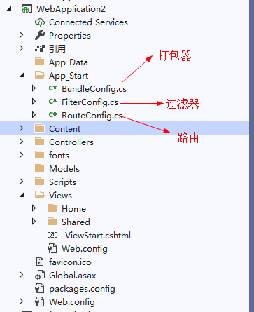
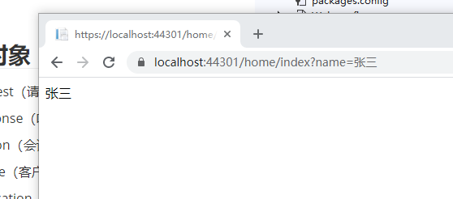
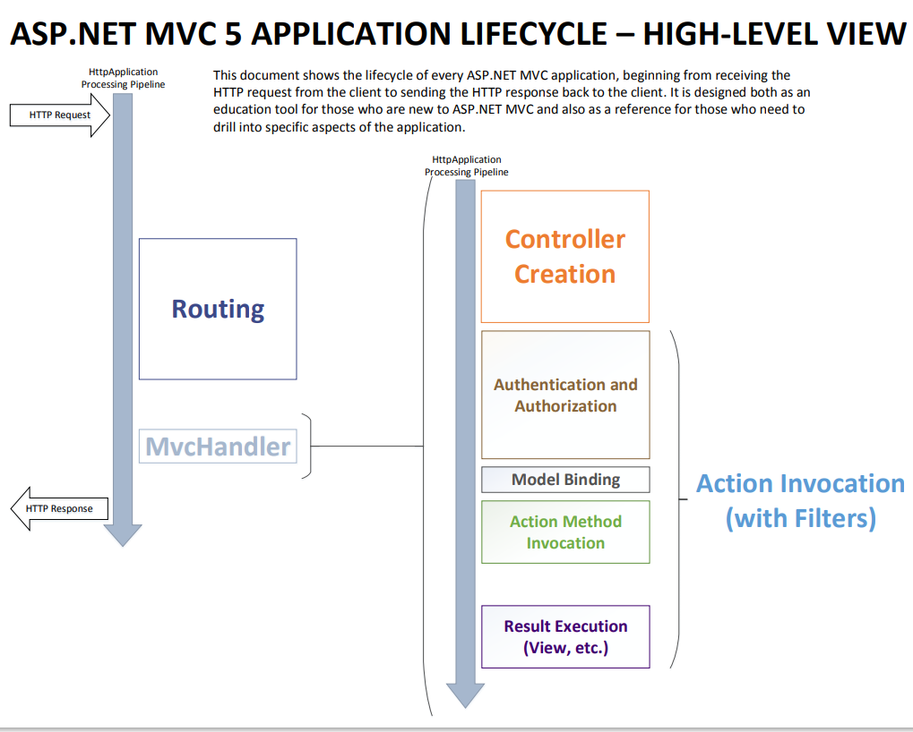

##项目目录



## 内置对象

- Request（请求）
- Response（响应）
- Session（会话）数据保存在服务器
- Cookie（客户端缓存）
- Application（当前网站对象）
- Server（服务器对象）

### Request

> 服务器接收客户端数据

1. Request.QueryString                 ============》        Get请求

```c#
 	public class HomeController : Controller
    {
        //对应地址:https://localhost:44301/home/index?name=张三
        public ActionResult Index()
        {
            return Content(Request.QueryString["name"]);
            //return View();
        }
    }        
```



2. Request.Form                        ==========》         Post请求

```c#
		public ActionResult PostData()
        {
            return Content($"{Request.Form["LoginName"]} ==== {Request.Form["Password"]}");
        }
```

3. Request.Files                    =============》          File（文件大小有限制的）

```c#
		public ActionResult FileData()
        {
            //SaveAs方法需要物理路径
            Request.Files["files"].SaveAs(Request.MapPath("~/uploads/"+Request.Files["files"].FileName));
            return Content("ok");
        }
```

```html
	<!--enctype="multipart/form-data 设置上传文件-->
    <form method="post" action="/Home/FileData" enctype="multipart/form-data">
        <input type="file" name="files" value="" />
        <button>提交</button>
    </form>
```

4. Request.Headers          =====》    获取请求头

### Response

1. Response.Write      ===》 向客户端输出内容
2. Response.Redirect   ===》重定向
3. Response.Headers    ===》  设置响应头

### Session

> 数据保存在服务器，只能用来存储少量重要数据，默认存活时间20分钟

```c#
            //设置和读取Session数据
			Session["LoginName"] = Request.Form["LoginName"];
            return Content((string) Session["LoginName"]);

			//Session.Clear();//Ssession.Abandon();//销毁session
```

### Cookie

```c#
 			Response.Cookies.Add(new HttpCookie("token")
            {
                Value = "1651sdfsdf",
                Expires = DateTime.Now.AddDays(7)//设置过期时间
            });


			//获取
			Request.Cookies.Get("token")?.ToString();

			//清除
			Response.Cookies.Add(new HttpCookie("token")
            {
                Value = "1651sdfsdf",
                Expires = DateTime.Now.AddDays(-1)//设置过期时间
            });
```

### Application

```c#
 		//存Application
		public ActionResult ApplicationData()
        { 
            HttpContext.Application["LoginName"] = Request.Form["LoginName"];

            return Content("");
        }

		//取Application
        public ActionResult GetApplicationData()
        {
            return Content((string) HttpContext.Application["LoginName"]);
        }
```

### Server

```c#
			//转发  不能转发外站
            Server.Transfer("/ShowDemo.html");
			//Server.MapPath();虚拟路径传物理路径
			//Server.HtmlDecode();
			//Server.HtmlEncode();
			//Server.UrlDecode();
			//Server.UrllEncode();
```


## View 和 Controller数据交互

### Controller到View

#### ViewBag

```c#
//后端
ViewBag.Content = "这是Study/Index";
```

```cshtml
@*前端*@
@ViewBag.Content
```

#### ViewData

> 不能跨页面

```c#
//后端
ViewData["Study"] = "64651";
```

```cshtml
@*前端*@
@ViewData["Study"]
```

#### TempData

> 存储之后只能读取一次，可以跨页面

```c#
TempData["hello"] = "hello";
```

```c#
@TempData["hello"]
```

#### 通过View（）

> View()可以指定指向的页面和母版页

```c#
		public ActionResult ShowData()
        {
            List<Student> students = new List<Student>();
            for (int i = 0; i < 5; i++)
            {
                students.Add(new Student()
                {
                    Id = i.ToString(),
                    Name = "Names" + i
                });
            }
            return View(new Test()
            {
                Students = students
            });
        }
```

```c#
<table class="table">
@foreach (var student in Model.Students)
{
    <tr>
        <td>@student.Id</td>
        <td>@student.Name</td>
    </tr>    
}
</table>
```

### 从View到Controller

## MVC生命周期




