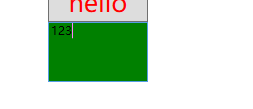
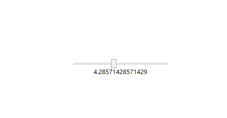

# 项目结构

## 如何启动（App.xaml）

```xaml
<Application x:Class="WpfApp1.App"
             xmlns="http://schemas.microsoft.com/winfx/2006/xaml/presentation"
             xmlns:x="http://schemas.microsoft.com/winfx/2006/xaml"
             xmlns:local="clr-namespace:WpfApp1"
             StartupUri="MainWindow.xaml">  <!--用户设置启动页-->
    
    <!-- 资源字典(WPF资源以及WPF应用程序的其他元素) -->
    <Application.Resources>
         
    </Application.Resources>
</Application>
```

## xaml文件

```xaml
<Window x:Class="WpfApp1.MainWindow"
        xmlns="http://schemas.microsoft.com/winfx/2006/xaml/presentation"<!--WPF核心命名空间（控件，标签）-->
        xmlns:x="http://schemas.microsoft.com/winfx/2006/xaml"
        xmlns:d="http://schemas.microsoft.com/expression/blend/2008"
        xmlns:mc="http://schemas.openxmlformats.org/markup-compatibility/2006"
        xmlns:local="clr-namespace:WpfApp1"
        mc:Ignorable="d"
        Title="MainWindow" Height="450" Width="800">
    <Grid>
        
    </Grid>
</Window><!--顶级元素-->
```

> 每个``xaml`` 文件只能有一个顶级元素
>
> ``xaml`` 区分大小写，但对于属性而言通常不区分

## 编译过程

xaml和cs文件编译成为baml文件

## 读取baml

```c#
var resourcesName = this.GetType().Assembly.GetName().Name + ".g";
var manager = new ResourceManager(resourcesName,this.GetType().Assembly);
var resourceSet = manager.GetResourceSet(CultureInfo.CurrentCulture,true,true);
var dictionaryEntries = resourceSet.OfType<DictionaryEntry>().ToList();
dictionaryEntries.ForEach(args =>
                          {
                              Baml2006Reader reader = new Baml2006Reader((Stream)args.Value);
                              //var win = XamlReader.Load(reader) as Window;
                              //MessageBox.Show(win.Name);
                          });
```

# 布局和控件

## 常用的布局属性


## 常用的布局容器

1. Grid
2. StackPanel
3. WrapPanel
4. DockPanel
5. UniformGrid

### Grid

ShowGridLines属性(true/false)：行列分割线是否显示

```xaml
<Grid ShowGridLines="True">
    <Grid.RowDefinitions>
        <RowDefinition/>
        <RowDefinition/>
   </Grid.RowDefinitions>

   <Grid.ColumnDefinitions>
        <ColumnDefinition/>
        <ColumnDefinition/>
   </Grid.ColumnDefinitions>

   <Border Background="#f26321" Margin="5"/>
   <Border Background="#8cc43d" Grid.Column="1" Margin="5"/>

   <Border Background="#00abed" Grid.Row="1" Margin="5"/>
   <Border Background="#efbe0b" Grid.Row="1" Grid.Column="1" Margin="5"/>
</Grid>
```


### StackPanel

- Orientation属性：按行排或者按列排
- StackPanel主要用于垂直或水平排列元素、在容器的可用尺寸内放置有限个元素，元素的尺寸总和(长/高)不允许超过StackPanel的尺寸, 否则超出的部分不可见。

### WrapPanel

- WrapPanel默认排列方向与StackPanel相反、WrapPanel的Orientation默认为Horizontal。
- WrapPanel具备StackPanel的功能基础上具备在尺寸变更后自动适应容器的宽高进行换行换列处理。

### DockPanel

- 默认DockPanel中的元素具备DockPanel.Dock属性, 该属性为枚举具备: Top、Left、Right、Bottom。
- 默认情况下, DockPanel中的元素不添加DockPanel.Dock属性, 则系统则会默认添加 Left。
- DockPanel有一个LastChildFill属性, 该属性默认为true, 该属性作用为, 当容器中的最后一个元素时, 默认该元素填充DockPanel所有空间。

### UniformGrid

会按行列的个数均分窗体空间

```xa
<UniformGrid Columns="2" Rows="2">
            <Button Width="80" Height="40" Content="sdfsadf"/>
            <Button Width="80" Height="40" Content="sdfsadf"/>
            <Button Width="80" Height="40" Content="sdfsadf"/>
            <Button Width="80" Height="40" Content="sdfsadf"/>
</UniformGrid>
```

## 控件结构


- 凡是继承于ContentControl的控件定义内容都用Content属性，除了TextBlock之外大部分都是用Content
- 继承Control的控件大部分都有Padding，Margin属性，TextBlock则是单独实现了这两个属性
- Content是object类型，所以对于Button，CheckBox等来说，不仅仅可以设置成字符串，也可以设置各种复杂的对象类型

```xa
<Button Width="80" Height="40">
            <Button.Content>
                <StackPanel Orientation="Horizontal">
                    <TextBlock Text="❥(^_-)"/>
                    <TextBlock Text="哈哈"/>
                </StackPanel>
            </Button.Content>
</Button>
```

# 样式Style

## 声明样式

1.在Window里面声明

```xaml
<Window x:Class="WpfApp2.MainWindow"
        xmlns="http://schemas.microsoft.com/winfx/2006/xaml/presentation"
        xmlns:x="http://schemas.microsoft.com/winfx/2006/xaml"
        xmlns:d="http://schemas.microsoft.com/expression/blend/2008"
        xmlns:mc="http://schemas.openxmlformats.org/markup-compatibility/2006"
        xmlns:local="clr-namespace:WpfApp2"
        mc:Ignorable="d"
        Title="MainWindow" Height="450" Width="800">

    <Window.Resources>
        <Style x:Key="BaseStyle" TargetType="Button">
            <Setter Property="Width" Value="100"/>
            <Setter Property="Height" Value="40"/>
            <Setter Property="Foreground" Value="Red"/>
        </Style>
        <Style TargetType="Button" x:Key="style1" BasedOn="{StaticResource BaseStyle}">
            <Setter Property="Content" Value="hello"/>
        </Style>
    </Window.Resources>
</Window>    
```

- 当样式没有设置`x:key` 属性时表示全局，如下面没有给声明的样式添加`x:key` 的时候全部的`button` 都使用这个样式
- `TargetType` 指定样式给什么控件使用
  * ` TargetType="Button"` 也可以写成 `TargetType="{x:Type Button}"` 
- `property` 指定要设置的样式
- `BasedOn` 指定继承的样式

```xaml
<Window x:Class="WpfApp2.MainWindow"
        xmlns="http://schemas.microsoft.com/winfx/2006/xaml/presentation"
        xmlns:x="http://schemas.microsoft.com/winfx/2006/xaml"
        xmlns:d="http://schemas.microsoft.com/expression/blend/2008"
        xmlns:mc="http://schemas.openxmlformats.org/markup-compatibility/2006"
        xmlns:local="clr-namespace:WpfApp2"
        mc:Ignorable="d"
        Title="MainWindow" Height="450" Width="800">

    <Window.Resources>
        <Style x:Key="BaseStyle" TargetType="Button">
            <Setter Property="Width" Value="100"/>
            <Setter Property="Height" Value="40"/>
            <Setter Property="Foreground" Value="Red"/>
        </Style>
        <Style TargetType="Button" x:Key="style1" BasedOn="{StaticResource BaseStyle}">
            <Setter Property="Content" Value="hello"/>
        </Style>
    </Window.Resources>
    <Grid>
        <StackPanel>
            <Button Style="{StaticResource style1}"/>
            <Button Style="{StaticResource style1}"/>
            <Button Style="{StaticResource style1}"/>
            <Button Style="{StaticResource style1}"/>
            <Button Style="{StaticResource style1}"/>
            <Button Style="{StaticResource style1}"/>
        </StackPanel>
    </Grid>
</Window>
```

效果如下：


## 触发器

### 定义


### 声明触发器

```xaml
<Style x:Key="BaseStyle" TargetType="{x:Type Button}">
            <Setter Property="Width" Value="100"/>
            <Setter Property="Height" Value="40"/>
            <Setter Property="Foreground" Value="Red"/>
            <!--声明触发器-->
            <Style.Triggers>
                <!-- 触发器的条件,满足这个条件就会使用当前触发器里的样式
                   IsMouseOver:鼠标移入这个区域 value 为 True -->
                <Trigger Property="IsMouseOver" Value="True">
                    <Setter Property="Foreground" Value="Blue"/>
                    <Setter Property="FontSize" Value="20"/>
                </Trigger>

                <Trigger Property="IsMouseOver" Value="False">
                    <Setter Property="Foreground" Value="red"/>
                    <Setter Property="FontSize" Value="25"/>
                </Trigger>
            </Style.Triggers>
</Style>
```

### 某个控件单独声明触发器

```xaml
<TextBox>
     <TextBox.Triggers>
                    
     </TextBox.Triggers>
</TextBox>
```

### 演示

```xaml
<Window x:Class="WpfApp2.MainWindow"
        xmlns="http://schemas.microsoft.com/winfx/2006/xaml/presentation"
        xmlns:x="http://schemas.microsoft.com/winfx/2006/xaml"
        xmlns:d="http://schemas.microsoft.com/expression/blend/2008"
        xmlns:mc="http://schemas.openxmlformats.org/markup-compatibility/2006"
        xmlns:local="clr-namespace:WpfApp2"
        mc:Ignorable="d"
        Title="MainWindow" Height="450" Width="800">

    <Window.Resources>
        <Style x:Key="BaseStyle" TargetType="{x:Type Button}">
            <Setter Property="Width" Value="100"/>
            <Setter Property="Height" Value="40"/>
            <Setter Property="Foreground" Value="Red"/>
            <!--声明触发器-->
            <Style.Triggers>
                <!-- 触发器的条件,满足这个条件就会使用当前触发器里的样式
                   IsMouseOver:鼠标移入这个区域 value 为 True -->
                <Trigger Property="IsMouseOver" Value="True">
                    <Setter Property="Foreground" Value="Blue"/>
                    <Setter Property="FontSize" Value="20"/>
                </Trigger>

                <Trigger Property="IsMouseOver" Value="False">
                    <Setter Property="Foreground" Value="red"/>
                    <Setter Property="FontSize" Value="25"/>
                </Trigger>
            </Style.Triggers>
        </Style>
        
        <Style TargetType="Button" x:Key="style1" BasedOn="{StaticResource BaseStyle}">
            <Setter Property="Content" Value="hello"/>
        </Style>
    </Window.Resources>
    <Grid>
        <StackPanel>
            <Button Style="{StaticResource style1}"/>
            <Button Style="{StaticResource style1}"/>
            <Button Style="{StaticResource style1}"/>
            <Button Style="{StaticResource style1}"/>
            <Button Style="{StaticResource style1}"/>
            <Button Style="{StaticResource style1}"/>
        </StackPanel>
    </Grid>
</Window>
```


### MultiTrigger

```xaml
<MultiTrigger>
     <MultiTrigger.Conditions>
           <Condition Property="IsMouseOver" Value="True"/>
           <Condition Property="IsFocused" Value="True"/>
     </MultiTrigger.Conditions>

     <MultiTrigger.Setters>
          <Setter Property="Background" Value="Green"/>
          <Setter Property="Foreground" Value="Yellow"/>
     </MultiTrigger.Setters>
</MultiTrigger>
```

- `MultiTrigger.Conditions` 设置条件
- `MultiTrigger.Setters` 设置样式


### DataTrigger

```xaml
<Style x:Key="style2" TargetType="{x:Type TextBox}">
            <Setter Property="Width" Value="100"/>
            <Setter Property="Height" Value="60"/>
            <Style.Triggers>
                <!--意思是绑定文本框的文本内容，当值为123时背景色为绿色-->
                <DataTrigger Binding="{Binding RelativeSource={RelativeSource Mode=Self},Path=Text}" Value="123">
                    <Setter Property="Background" Value="Green"/>
                </DataTrigger>
            </Style.Triggers>
</Style>
```

- `DataTrigger` 监测数据达到条件使用特定样式



### MultiDataTrigger

- 使用方式同`MultiTrigger`

### EventTrigger

- 某个事件发生时触发

# Bingding(绑定)

绑定的概念则侧重于: 两者的关联,协议与两者之间的影响

例子：创建一个滑块控件, 并且希望在滑动的过程中, 把值更新到另外一个静态文本上

```xaml
<Grid>
        <StackPanel VerticalAlignment="Center" HorizontalAlignment="Center">
            <Slider Name="Slider" Width="200"/>
            <TextBlock Text="{Binding ElementName=Slider,Path=Value}" HorizontalAlignment="Center"/>
        </StackPanel>
    </Grid>
```

效果：




## 绑定的模式

- OneWay(单向绑定) : 当源属性发生变化更新目标属性
- TwoWay(双向绑定) : 当源属性发生变化更新目标属性, 目标属性发生变化也更新源属性
- OneTime(单次模式) : 根据第一次源属性设置目标属性, 在此之后所有改变都无效
- OneWayToSource : 和OneWay类型, 只不过整个过程倒置
- Default : 既可以是双向,也可以是单项, 除非明确表明某种模式, 否则采用该默认绑定

## **绑定到非元素上**

使用的绑定方式是根据元素的方式: ElementName=xxx, 如需绑定到一个非元素的对象, 则有一下几属性:

- Source : 指向一个数据源, 示例, TextBox使用绑定的方式用Source指向一个静态资源ABC

```xaml
	<Window.Resources>
        <TextBox x:Key="txt2"> ABC </TextBox>
    </Window.Resources>
    <Grid>
        <TextBox Text="{Binding Source={StaticResource txt2},Path=Text}"/>
    </Grid>
```

- RelativeSource : 使用一个名为RelativeSource的对象来根据不同的模式查找源对象

```xaml
	<!--使用RelativeSource的FindAncestor模式, 查找父元素为StackPanel的Width值-->
	<StackPanel Width="200">
        <StackPanel Width="300">
            <TextBlock Text="{Binding Path=Width,RelativeSource=
                {RelativeSource Mode=FindAncestor,AncestorType={x:Type StackPanel}}}"/>
        </StackPanel>
    </StackPanel>
```

- DataContext: 从当前的元素树向上查找到第一个非空的DataContext属性为源对象

```c#
	//后端代码
	public partial class MainWindow : Window
    {
        public MainWindow()
        {
            InitializeComponent();
            this.DataContext = new Test() { Name = "小明" };
        }
    }

    public class Test
    {
        public string Name { get; set; }
    }
```

```xaml
	<!--xaml-->
	<Grid>
        <TextBlock Text="{Binding Name}"/>
    </Grid>
```

# MVVMLight

- 1.NuGet引用MVVM框架包


引入该框架包之后, 默认会在目录下创建ViewModel层的示例代码


- 第二步, 通过在MainViewModel中创建一些业务代码, 将其与MainWindow.xaml 通过上下文的方式关联起来, 而MainWindow则是通过Binding的写法 引用业务逻辑的部分
- 在MainViewModel中, 添加同一个班级名称, 与学生列表, 分别用于显示在文本 和列表上展示, Command则用于绑定DataGrid的双击命令上, 通过双击, 展示点击行的学生信息
- MainViewModel 继承了 ViewModelBase, 该继承的父类实在MVVM框架中, 实现双向通知的基类, 通过引用该类, 那么其之类的属性则可通过 添加 RaisePropertyChanged() 即可

```c#
	//Student类
	public class Student : ViewModelBase
    {
        private string name;
        private string age;
        private string sex;
        
        public string Name
        {
            get { return name; }
            set { name = value; RaisePropertyChanged(); }
        }
        public string Age
        {
            get { return age; }
            set { age = value; RaisePropertyChanged(); }
        }
        public string Sex
        {
            get { return sex; }
            set { sex = value; RaisePropertyChanged(); }
        }
    }

	//MainViewModel.cs
	public class MainViewModel : ViewModelBase
    {
        public MainViewModel()
        {
            ClassName = "高二三班";
            Students = new ObservableCollection<Student>();
            Students.Add(new Student() { Name = "张三", Age = "18", Sex = "男" });
            Students.Add(new Student() { Name = "李四", Age = "19", Sex = "女" });
            Students.Add(new Student() { Name = "王二", Age = "20", Sex = "男" });
        }

        private string className;

        public string ClassName
        {
            get { return className; }
            set { className = value; RaisePropertyChanged(); }
        }

        private ObservableCollection<Student> students;
        public ObservableCollection<Student> Students
        {
            get { return students; }
            set { students = value; RaisePropertyChanged(); }
        }

        public RelayCommand<Student> Command
        {
            get
            {
                if (command == null)
                    command = new RelayCommand<Student>((t) => Rcommand(t));
                return command;
            }
        }

        private RelayCommand<Student> command;

        private void Rcommand(Student stu)
        {
            MessageBox.Show($"学生的姓名:{stu.Name}学生的年龄:{stu.Age}学生的性别:{stu.Sex}");
        }


        private RelayCommand updateCommand;

        public RelayCommand UpdateCommand
        {
            get
            {
                if (updateCommand == null)
                    updateCommand = new RelayCommand(() => UpdateText());
                return updateCommand;
            }
        }

        private void UpdateText()
        {
            ClassName = "高三三班";
        }

    }

	//MainWindow.xaml.cs
	public MainWindow()
        {
            InitializeComponent();
            this.DataContext = new MainViewModel();
        }
```

- 设计UI层, 添加一个文本用于显示班级名称,  添加一个DataGrid 用于展示学生列表,  同时DataGrid中添加一个绑定的命令,MouseAction 以为触发的事件类型, CommandParameter 则是命令传递的参数, 也就是DataGrid选中的一行的类型 Student,Command 则是MainViewModel中定义的Command

```xaml
	<Grid>
        <Grid.RowDefinitions>
            <RowDefinition Height="20"/>
            <RowDefinition/>
        </Grid.RowDefinitions>

        <StackPanel Orientation="Horizontal" HorizontalAlignment="Right">
            <Button Command="{Binding UpdateCommand}" Content="刷新"/>
            <TextBlock Margin="5 0 0 0" Text="班级名称:" />
            <TextBlock Margin="5 0 0 0" Text="{Binding ClassName}"/>
        </StackPanel>

        <DataGrid Grid.Row="1" ItemsSource="{Binding Students}" AutoGenerateColumns="False">
            <DataGrid.InputBindings>
                <MouseBinding MouseAction="LeftDoubleClick"  
                                  CommandParameter="{Binding RelativeSource={RelativeSource Mode=FindAncestor, 
                        AncestorType=DataGrid}, Path=SelectedItem}"  
                                  Command="{Binding Command}"/>
            </DataGrid.InputBindings>
            <DataGrid.Columns>
                <DataGridTextColumn Binding="{Binding Name}"  Header="名称"/>
                <DataGridTextColumn Binding="{Binding Age}" Header="年龄"/>
                <DataGridTextColumn Binding="{Binding Sex}" Header="性别"/>
            </DataGrid.Columns>
        </DataGrid>
    </Grid>
```

