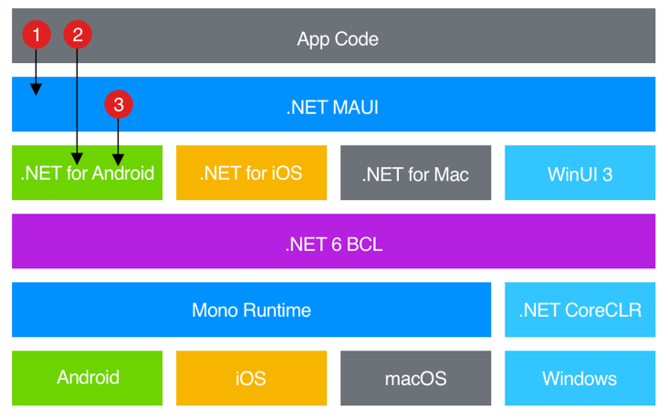

# 什么是 .NET MAUI？

.NET 多平台应用 UI (.NET MAUI) 是一个跨平台框架，用于使用 C# 和 XAML 创建本机移动和桌面应用。

使用 .NET MAUI，可以从单个共享代码库开发可在 Android、iOS、macOS 和 Windows 上运行的应用。


NET MAUI 是开源的，是 Xamarin.Forms 的演变，它从移动方案扩展到桌面方案，UI 控件从头开始重新生成，以便实现性能和扩展性。 如果以前使用 Xamarin.Forms 生成跨平台用户界面，你将注意到 .NET MAUI 有许多相似之处。 但也有一些差异。 使用 .NET MAUI，可以使用单个项目创建多平台应用，但如有必要，可以添加特定于平台的源代码和资源。 .NET MAUI 的主要目标是在单个代码库中实现尽可能多的应用逻辑和 UI 布局。

## .NET MAUI 的工作原理

.NET MAUI 将 Android、iOS、macOS 和 Windows API 统一到单个 API 中，该 API 允许在任意位置运行一次的开发人员体验，同时提供对每个本机平台的各个方面的深入访问。

.NET 6 提供了一系列特定于平台的框架来创建应用：适用于 Android 的 .NET、适用于 iOS 的 .NET、适用于 macOS 的 .NET 和 Windows UI 3 (WinUI 3) 库。 这些框架都有权访问同一个 .NET 6 基类库 (BCL) 。 此库将基础平台的详细信息从代码中抽象化。 BCL 依赖于 .NET 运行时，为代码提供执行环境。 对于 Android、iOS 和 macOS，环境由 Mono 实现，这是 .NET 运行时的实现。 在 Windows 上，.NET CoreCLR 提供执行环境。

虽然 BCL 使在不同平台上运行的应用能够共享常见的业务逻辑，但各种平台具有为应用定义用户界面的不同方式，并且它们提供了不同的模型，用于指定用户界面元素的通信和互操作方式。 可以使用适用于 Android、适用于 iOS 的 .NET for iOS、适用于 macOS 的 .NET 或 WinUI 3) 的相应平台特定框架 (.NET 单独为每个平台创建 UI，但此方法要求你为每个单独的设备系列维护代码库。

.NET MAUI 提供了一个框架，用于为移动和桌面应用构建 UI。 下图显示了 .NET MAUI 应用的体系结构的高级视图：



## .NET MAUI 提供的内容

.NET MAUI 提供了可用于显示数据的控件集合、启动操作、指示活动、显示集合、选取数据等。 除了控件集合外，.NET MAUI 还提供：

- 用于设计页面的精心设计布局引擎。
- 用于创建丰富导航类型的多种页类型，如抽屉。
- 支持数据绑定，以更优雅且可维护的开发模式。
- 自定义处理程序以增强 UI 元素呈现方式的功能。
- 用于访问本机设备功能的跨平台 API。 这些 API 使应用能够访问设备功能，例如 GPS、加速计和电池和网络状态。 有关详细信息，请参阅 [设备功能的跨平台 API](https://docs.microsoft.com/zh-cn/dotnet/maui/what-is-maui#cross-platform-apis-for-device-features)。
- 跨平台图形功能，提供一个绘图画布，支持绘制和绘制形状和图像、组合操作和图形对象转换。
- 一个使用多目标来面向 Android、iOS、macOS 和 Windows 的单个项目系统。 有关详细信息，请参阅 [.NET MAUI 单一项目](https://docs.microsoft.com/zh-cn/dotnet/maui/what-is-maui#single-project)。
- .NET 热重载，以便在应用运行时同时修改 XAML 和托管源代码，然后观察修改的结果，而无需重新生成应用。 有关详细信息，请参阅 [.NET 热重载](https://docs.microsoft.com/zh-cn/dotnet/maui/what-is-maui#hot-reload)。

### 适用于设备功能的跨平台 API

.NET MAUI 为本机设备功能提供跨平台 API。 用于访问设备功能的 .NET MAUI 提供的功能示例包括：

- 访问设备上的传感器，例如加速计、指南针和陀螺仪。
- 能够检查设备的网络连接状态，并检测更改。
- 提供有关应用正在运行的设备的信息。
- 在应用之间将文本复制并粘贴到系统剪贴板。
- 从设备中选择单个或多个文件。
- 将数据安全地存储为键/值对。
- 利用内置文本转语音引擎从设备读取文本。
- 启动基于浏览器的身份验证流，该流侦听对特定应用注册的 URL 的回调。

### 单个项目

.NET MAUI 单一项目采用开发应用时通常遇到的特定于平台的开发体验，并将其抽象化为面向 Android、iOS、macOS 和 Windows 的单个共享项目。

无论面向的平台如何，.NET MAUI 单一项目都提供简化且一致的跨平台开发体验。 .NET MAUI 单一项目提供以下功能：

- 一个可面向 Android、iOS、macOS 和 Windows 的共享项目。
- 用于运行 .NET MAUI 应用的简化调试目标选择。
- 单个项目中的共享资源文件。
- 一个应用清单，用于指定应用标题、ID 和版本。
- 根据需要访问特定于平台的 API 和工具。
- 单个跨平台应用入口点。

.NET MAUI 单一项目使用多目标启用，并在 .NET 6 中使用 SDK 样式项目。 有关 .NET MAUI 单一项目的详细信息，请参阅 [.NET MAUI 单一项目](https://docs.microsoft.com/zh-cn/dotnet/maui/fundamentals/single-project)。

### 热重载

.NET MAUI 包括对 .NET 热重载的支持，使你可以在应用运行时修改托管源代码，而无需手动暂停或命中断点。 然后，代码编辑可以应用于正在运行的应用，而无需重新编译。

.NET MAUI 包括对 XAML 热重载的支持，使你能够保存 XAML 文件，并查看在正在运行的应用中反映的更改，而无需重新编译。 此外，将维护导航状态和数据，使你能够在不丢失应用中的位置的情况下快速循环访问 UI。

# 安装

Visual Studio Installer


# 项目结构


# 基于MVVM模式

## CommunityToolkit.Mvvm

- Unget install CommunityToolkit.Mvvm
- 添加MainViewModel.cs


- [ObservableProperty]和[RelayCommand]特性会在上图中的位置自动生成代码
- 在MauiPrograme.cs注入

```c#
public static class MauiProgram
{
	public static MauiApp CreateMauiApp()
	{
		var builder = MauiApp.CreateBuilder();
		builder
			.UseMauiApp<App>()
			.ConfigureFonts(fonts =>
			{
				fonts.AddFont("OpenSans-Regular.ttf", "OpenSansRegular");
				fonts.AddFont("OpenSans-Semibold.ttf", "OpenSansSemibold");
			});
		
		builder.Services.AddSingleton<IConnectivity>(Connectivity.Current);
		
        //注入ViewModel和View
		builder.Services.AddSingleton<MainPage>();
		builder.Services.AddSingleton<MainViewModel>();

        //使用AddTransient:因为每次导航进入Detail页都重新创建
        builder.Services.AddTransient<DetailPage>();
        builder.Services.AddTransient<DetailViewModel>();

		return builder.Build();
	}
}
```

# 路由

## 注册

- 在AppShell.cs中注册路由

```c#
public partial class AppShell : Shell
{
	public AppShell()
	{
		InitializeComponent();

		//注册导航路由
		Routing.RegisterRoute(nameof(DetailPage), typeof(DetailPage));
	}
}
```

### 跳转路由

```c#
		[RelayCommand]
        async Task Tap(string s)
        {
            //可以用字典传递复杂参数
            //await Shell.Current.GoToAsync($"{nameof(DetailPage)}?Text={s}",new Dictionary<string, object>
            //{
            //    {"ObjectParam",new object()},
            //});

            await Shell.Current.GoToAsync($"{nameof(DetailPage)}?Text={s}");
        }
```

### 接收路由传递的参数

```c#
	[QueryProperty("Text","Text")]//[QueryProperty("属性名","跳转路由时的参数名Text")] await Shell.Current.GoToAsync($"{nameof(DetailPage)}?Text={s}");
    public partial class DetailViewModel:ObservableObject
    {
        [ObservableProperty]
        string text;

        [RelayCommand]
        async Task GoBack()
        {
            //这里类似文件的目录返回上一级
            //../Another.xaml===>跳转到Another页
            await Shell.Current.GoToAsync("..");
        }
    }
```

