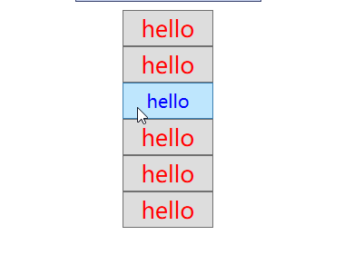

# 	项目结构

## 如何启动（App.xaml）

```xaml
<Application x:Class="WpfApp1.App"
             xmlns="http://schemas.microsoft.com/winfx/2006/xaml/presentation"
             xmlns:x="http://schemas.microsoft.com/winfx/2006/xaml"
             xmlns:local="clr-namespace:WpfApp1"
             StartupUri="MainWindow.xaml">  <!--用户设置启动页-->
    
    <!-- 资源字典(WPF资源以及WPF应用程序的其他元素) -->
    <Application.Resources>
         
    </Application.Resources>
</Application>
```

## xaml文件

```xaml
<Window x:Class="WpfApp1.MainWindow"
        xmlns="http://schemas.microsoft.com/winfx/2006/xaml/presentation"<!--WPF核心命名空间（控件，标签）-->
        xmlns:x="http://schemas.microsoft.com/winfx/2006/xaml"
        xmlns:d="http://schemas.microsoft.com/expression/blend/2008"
        xmlns:mc="http://schemas.openxmlformats.org/markup-compatibility/2006"
        xmlns:local="clr-namespace:WpfApp1"
        mc:Ignorable="d"
        Title="MainWindow" Height="450" Width="800">
    <Grid>
        
    </Grid>
</Window><!--顶级元素-->
```

> 每个``xaml`` 文件只能有一个顶级元素
>
> ``xaml`` 区分大小写，但对于属性而言通常不区分

## 编译过程

xaml和cs文件编译成为baml文件

## 读取baml

```c#
var resourcesName = this.GetType().Assembly.GetName().Name + ".g";
var manager = new ResourceManager(resourcesName,this.GetType().Assembly);
var resourceSet = manager.GetResourceSet(CultureInfo.CurrentCulture,true,true);
var dictionaryEntries = resourceSet.OfType<DictionaryEntry>().ToList();
dictionaryEntries.ForEach(args =>
                          {
                              Baml2006Reader reader = new Baml2006Reader((Stream)args.Value);
                              //var win = XamlReader.Load(reader) as Window;
                              //MessageBox.Show(win.Name);
                          });
```

# 布局和控件

## 常用的布局属性


## 常用的布局容器

1. Grid
2. StackPanel
3. WrapPanel
4. DockPanel
5. UniformGrid

### Grid

ShowGridLines属性(true/false)：行列分割线是否显示

```xaml
<Grid ShowGridLines="True">
    <Grid.RowDefinitions>
        <RowDefinition/>
        <RowDefinition/>
   </Grid.RowDefinitions>

   <Grid.ColumnDefinitions>
        <ColumnDefinition/>
        <ColumnDefinition/>
   </Grid.ColumnDefinitions>

   <Border Background="#f26321" Margin="5"/>
   <Border Background="#8cc43d" Grid.Column="1" Margin="5"/>

   <Border Background="#00abed" Grid.Row="1" Margin="5"/>
   <Border Background="#efbe0b" Grid.Row="1" Grid.Column="1" Margin="5"/>
</Grid>
```


### StackPanel

- Orientation属性：按行排或者按列排
- StackPanel主要用于垂直或水平排列元素、在容器的可用尺寸内放置有限个元素，元素的尺寸总和(长/高)不允许超过StackPanel的尺寸, 否则超出的部分不可见。

### WrapPanel

- WrapPanel默认排列方向与StackPanel相反、WrapPanel的Orientation默认为Horizontal。
- WrapPanel具备StackPanel的功能基础上具备在尺寸变更后自动适应容器的宽高进行换行换列处理。

### DockPanel

- 默认DockPanel中的元素具备DockPanel.Dock属性, 该属性为枚举具备: Top、Left、Right、Bottom。
- 默认情况下, DockPanel中的元素不添加DockPanel.Dock属性, 则系统则会默认添加 Left。
- DockPanel有一个LastChildFill属性, 该属性默认为true, 该属性作用为, 当容器中的最后一个元素时, 默认该元素填充DockPanel所有空间。

### UniformGrid

会按行列的个数均分窗体空间

```xa
<UniformGrid Columns="2" Rows="2">
            <Button Width="80" Height="40" Content="sdfsadf"/>
            <Button Width="80" Height="40" Content="sdfsadf"/>
            <Button Width="80" Height="40" Content="sdfsadf"/>
            <Button Width="80" Height="40" Content="sdfsadf"/>
</UniformGrid>
```

## 控件结构


- 凡是继承于ContentControl的控件定义内容都用Content属性，除了TextBlock之外大部分都是用Content
- 继承Control的控件大部分都有Padding，Margin属性，TextBlock则是单独实现了这两个属性
- Content是object类型，所以对于Button，CheckBox等来说，不仅仅可以设置成字符串，也可以设置各种复杂的对象类型

```xa
<Button Width="80" Height="40">
            <Button.Content>
                <StackPanel Orientation="Horizontal">
                    <TextBlock Text="❥(^_-)"/>
                    <TextBlock Text="哈哈"/>
                </StackPanel>
            </Button.Content>
</Button>
```

# 样式Style

## 声明样式

1.在Window里面声明

```xaml
<Window x:Class="WpfApp2.MainWindow"
        xmlns="http://schemas.microsoft.com/winfx/2006/xaml/presentation"
        xmlns:x="http://schemas.microsoft.com/winfx/2006/xaml"
        xmlns:d="http://schemas.microsoft.com/expression/blend/2008"
        xmlns:mc="http://schemas.openxmlformats.org/markup-compatibility/2006"
        xmlns:local="clr-namespace:WpfApp2"
        mc:Ignorable="d"
        Title="MainWindow" Height="450" Width="800">

    <Window.Resources>
        <Style x:Key="BaseStyle" TargetType="Button">
            <Setter Property="Width" Value="100"/>
            <Setter Property="Height" Value="40"/>
            <Setter Property="Foreground" Value="Red"/>
        </Style>
        <Style TargetType="Button" x:Key="StyleButton" BasedOn="{StaticResource BaseStyle}">
            <Setter Property="Content" Value="hello"/>
        </Style>
    </Window.Resources>
    <StackPanel>
        <Button Style="{StaticResource StyleButton}"></Button>
        <Button Content="button2"></Button>
        <Button Content="button3"></Button>
    </StackPanel>
</Window>
```

- 当样式没有设置`x:key` 属性时表示全局，如下面没有给声明的样式添加`x:key` 的时候全部的`button` 都使用这个样式
- `TargetType` 指定样式给什么控件使用
  * ` TargetType="Button"` 也可以写成 `TargetType="{x:Type Button}"` 
- `property` 指定要设置的样式
- `BasedOn` 指定继承的样式

```xaml
<Window x:Class="WpfApp2.MainWindow"
        xmlns="http://schemas.microsoft.com/winfx/2006/xaml/presentation"
        xmlns:x="http://schemas.microsoft.com/winfx/2006/xaml"
        xmlns:d="http://schemas.microsoft.com/expression/blend/2008"
        xmlns:mc="http://schemas.openxmlformats.org/markup-compatibility/2006"
        xmlns:local="clr-namespace:WpfApp2"
        mc:Ignorable="d"
        Title="MainWindow" Height="450" Width="800">

    <Window.Resources>
        <Style x:Key="BaseStyle" TargetType="Button">
            <Setter Property="Width" Value="100"/>
            <Setter Property="Height" Value="40"/>
            <Setter Property="Foreground" Value="Red"/>
        </Style>
        <Style TargetType="Button" x:Key="style1" BasedOn="{StaticResource BaseStyle}">
            <Setter Property="Content" Value="hello"/>
        </Style>
    </Window.Resources>
    <Grid>
        <StackPanel>
            <Button Style="{StaticResource style1}"/>
            <Button Style="{StaticResource style1}"/>
            <Button Style="{StaticResource style1}"/>
            <Button Style="{StaticResource style1}"/>
            <Button Style="{StaticResource style1}"/>
            <Button Style="{StaticResource style1}"/>
        </StackPanel>
    </Grid>
</Window>
```

效果如下：


## 触发器

### 定义


### 声明触发器

```xaml
<Style x:Key="BaseStyle" TargetType="{x:Type Button}">
            <Setter Property="Width" Value="100"/>
            <Setter Property="Height" Value="40"/>
            <Setter Property="Foreground" Value="Red"/>
            <!--声明触发器-->
            <Style.Triggers>
                <!-- 触发器的条件,满足这个条件就会使用当前触发器里的样式
                   IsMouseOver:鼠标移入这个区域 value 为 True -->
                <Trigger Property="IsMouseOver" Value="True">
                    <Setter Property="Foreground" Value="Blue"/>
                    <Setter Property="FontSize" Value="20"/>
                </Trigger>

                <Trigger Property="IsMouseOver" Value="False">
                    <Setter Property="Foreground" Value="red"/>
                    <Setter Property="FontSize" Value="25"/>
                </Trigger>
            </Style.Triggers>
</Style>
```

### 某个控件单独声明触发器

```xaml
<TextBox>
     <TextBox.Triggers>
                    
     </TextBox.Triggers>
</TextBox>
```

### 演示

```xaml
<Window x:Class="WpfApp2.MainWindow"
        xmlns="http://schemas.microsoft.com/winfx/2006/xaml/presentation"
        xmlns:x="http://schemas.microsoft.com/winfx/2006/xaml"
        xmlns:d="http://schemas.microsoft.com/expression/blend/2008"
        xmlns:mc="http://schemas.openxmlformats.org/markup-compatibility/2006"
        xmlns:local="clr-namespace:WpfApp2"
        mc:Ignorable="d"
        Title="MainWindow" Height="450" Width="800">

    <Window.Resources>
        <Style x:Key="BaseStyle" TargetType="{x:Type Button}">
            <Setter Property="Width" Value="100"/>
            <Setter Property="Height" Value="40"/>
            <Setter Property="Foreground" Value="Red"/>
            <!--声明触发器-->
            <Style.Triggers>
                <!-- 触发器的条件,满足这个条件就会使用当前触发器里的样式
                   IsMouseOver:鼠标移入这个区域 value 为 True -->
                <Trigger Property="IsMouseOver" Value="True">
                    <Setter Property="Foreground" Value="Blue"/>
                    <Setter Property="FontSize" Value="20"/>
                </Trigger>

                <Trigger Property="IsMouseOver" Value="False">
                    <Setter Property="Foreground" Value="red"/>
                    <Setter Property="FontSize" Value="25"/>
                </Trigger>
            </Style.Triggers>
        </Style>
        
        <Style TargetType="Button" x:Key="style1" BasedOn="{StaticResource BaseStyle}">
            <Setter Property="Content" Value="hello"/>
        </Style>
    </Window.Resources>
    <Grid>
        <StackPanel>
            <Button Style="{StaticResource style1}"/>
            <Button Style="{StaticResource style1}"/>
            <Button Style="{StaticResource style1}"/>
            <Button Style="{StaticResource style1}"/>
            <Button Style="{StaticResource style1}"/>
            <Button Style="{StaticResource style1}"/>
        </StackPanel>
    </Grid>
</Window>
```



### MultiTrigger

```xaml
<MultiTrigger>
     <MultiTrigger.Conditions>
           <Condition Property="IsMouseOver" Value="True"/>
           <Condition Property="IsFocused" Value="True"/>
     </MultiTrigger.Conditions>

     <MultiTrigger.Setters>
          <Setter Property="Background" Value="Green"/>
          <Setter Property="Foreground" Value="Yellow"/>
     </MultiTrigger.Setters>
</MultiTrigger>
```

- `MultiTrigger.Conditions` 设置条件
- `MultiTrigger.Setters` 设置样式


### DataTrigger

```xaml
<Style x:Key="style2" TargetType="{x:Type TextBox}">
            <Setter Property="Width" Value="100"/>
            <Setter Property="Height" Value="60"/>
            <Style.Triggers>
                <!--意思是绑定文本框的文本内容，当值为123时背景色为绿色-->
                <DataTrigger Binding="{Binding RelativeSource={RelativeSource Mode=Self},Path=Text}" Value="123">
                    <Setter Property="Background" Value="Green"/>
                </DataTrigger>
            </Style.Triggers>
</Style>
```

- `DataTrigger` 监测数据达到条件使用特定样式


### MultiDataTrigger

- 使用方式同`MultiTrigger`

### EventTrigger

- 某个事件发生时触发

# 控件模板

## ControlTemplate

```c#
 <ControlTemplate TargetType="{x:Type Button}">
                        <Border x:Name="border" BorderBrush="{TemplateBinding BorderBrush}" BorderThickness="{TemplateBinding BorderThickness}" Background="{TemplateBinding Background}" SnapsToDevicePixels="true">
                            <ContentPresenter x:Name="contentPresenter" Focusable="False" HorizontalAlignment="{TemplateBinding HorizontalContentAlignment}" Margin="{TemplateBinding Padding}" RecognizesAccessKey="True" SnapsToDevicePixels="{TemplateBinding SnapsToDevicePixels}" VerticalAlignment="{TemplateBinding VerticalContentAlignment}"/>
                        </Border>
                        <ControlTemplate.Triggers>
                            <Trigger Property="IsMouseOver" Value="true">
                                <Setter Property="Background" TargetName="border" Value="{StaticResource Button.MouseOver.Background}"/>
                                <Setter Property="BorderBrush" TargetName="border" Value="{StaticResource Button.MouseOver.Border}"/>
                            </Trigger>
                            <Trigger Property="IsPressed" Value="true">
                                <Setter Property="Background" TargetName="border" Value="{StaticResource Button.Pressed.Background}"/>
                                <Setter Property="BorderBrush" TargetName="border" Value="{StaticResource Button.Pressed.Border}"/>
                            </Trigger>
                        </ControlTemplate.Triggers>
</ControlTemplate>
```

## DataTemplate

```c#
 <ComboBox x:Name="Com" Width="200" Height="20" Margin="0 20 0 0">
                <ComboBox.ItemTemplate>
                    <DataTemplate>
                        <StackPanel Orientation="Horizontal">
                            <TextBlock Text="{Binding Name}"></TextBlock>
                            <TextBlock Text="||"></TextBlock>
                            <TextBlock Text="{Binding Sex}"></TextBlock>
                        </StackPanel>
                    </DataTemplate>
                </ComboBox.ItemTemplate>
            </ComboBox>
```

# Bingding(绑定)

绑定的概念则侧重于: 两者的关联,协议与两者之间的影响

例子：创建一个滑块控件, 并且希望在滑动的过程中, 把值更新到另外一个静态文本上

```xaml
<Grid>
        <StackPanel VerticalAlignment="Center" HorizontalAlignment="Center">
            <Slider Name="Slider" Width="200"/>
            <TextBlock Text="{Binding ElementName=Slider,Path=Value}" HorizontalAlignment="Center"/>
        </StackPanel>
    </Grid>
```

效果：


## 绑定的模式

- OneWay(单向绑定) : 当源属性发生变化更新目标属性
- TwoWay(双向绑定) : 当源属性发生变化更新目标属性, 目标属性发生变化也更新源属性
- OneTime(单次模式) : 根据第一次源属性设置目标属性, 在此之后所有改变都无效
- OneWayToSource : 和OneWay类型, 只不过整个过程倒置
- Default : 既可以是双向,也可以是单项, 除非明确表明某种模式, 否则采用该默认绑定

## **绑定到非元素上**

使用的绑定方式是根据元素的方式: ElementName=xxx, 如需绑定到一个非元素的对象, 则有一下几属性:

- Source : 指向一个数据源, 示例, TextBox使用绑定的方式用Source指向一个静态资源ABC

```xaml
	<Window.Resources>
        <TextBox x:Key="txt2"> ABC </TextBox>
    </Window.Resources>
    <Grid>
        <TextBox Text="{Binding Source={StaticResource txt2},Path=Text}"/>
    </Grid>
```

- RelativeSource : 使用一个名为RelativeSource的对象来根据不同的模式查找源对象

```xaml
	<!--使用RelativeSource的FindAncestor模式, 查找父元素为StackPanel的Width值-->
	<StackPanel Width="200">
        <StackPanel Width="300">
            <TextBlock Text="{Binding Path=Width,RelativeSource=
                {RelativeSource Mode=FindAncestor,AncestorType={x:Type StackPanel}}}"/>
        </StackPanel>
    </StackPanel>
```

- DataContext: 从当前的元素树向上查找到第一个非空的DataContext属性为源对象

```c#
	//后端代码
	public partial class MainWindow : Window
    {
        public MainWindow()
        {
            InitializeComponent();
            this.DataContext = new Test() { Name = "小明" };
        }
    }

    public class Test
    {
        public string Name { get; set; }
    }
```

```xaml
	<!--xaml-->
	<Grid>
        <TextBlock Text="{Binding Name}"/>
    </Grid>
```

或者直接在页面申明强类型

```xaml
<Window.DataContext>
    <local:MainViewModel/>
</Window.DataContext>    
```

## DataGrid绑定

### MainViewModel

```c#
 	public class MainViewModel
    {
        public MainViewModel()
        {
            Students = new ObservableCollection<Student>();
            for (int i = 0; i < 10; i++)
            {
                Students.Add(new Student()
                {
                    Name = $"Student-{i}",
                    Sex = i % 2 == 0 ? "男" : "女"
                });
            }
        }

		//ObservableCollection  动态集合
        private ObservableCollection<Student> _students;

        public ObservableCollection<Student> Students
        {
            get => _students;
            set => _students = value;
        }
    }
```

### MainWindow

```xaml
	<Window.DataContext>
        <local:MainViewModel></local:MainViewModel>
    </Window.DataContext>
    <Grid>
        <StackPanel>
            
            <!--AutoGenerateColumns:是否自动创建列-->
            <DataGrid ItemsSource="{Binding Students}"  AutoGenerateColumns="False" Margin="0 10 0 0 ">
                <DataGrid.Columns>
                    <DataGridTextColumn Header="姓名" Binding="{Binding Name}"></DataGridTextColumn>
                    <DataGridTextColumn Header="性别" Binding="{Binding Sex}"></DataGridTextColumn>
</DataGrid.Columns>
            </DataGrid>


        </StackPanel>
    </Grid>
```

## 绑定命令

1. 定义方法实现Icommand

```c#
 	public class RelayCommand:ICommand
    {
        public Action Action;

        public RelayCommand(Action action)
        {
            Action = action;
        }

        /// <summary>
        /// 能不能执行
        /// </summary>
        /// <param name="parameter"></param>
        /// <returns></returns>
        public bool CanExecute(object parameter)
        {
            return true;
        }

        /// <summary>
        /// 具体执行的什么
        /// </summary>
        /// <param name="parameter"></param>
        public void Execute(object parameter)
        {
            if (Action != null)
                Action();
        }

        public event EventHandler CanExecuteChanged;
    }
```

2. 在MainViewModel中定义命令GetDataCommand,并实现InotifyPropertyChanged

```c#
	public class MainViewModel:INotifyPropertyChanged
    {
        public MainViewModel()
        {
            GetDataCommand = new RelayCommand(GetData);
        }

        private void GetData()
        {
            Students = new ObservableCollection<Student>();
            for (int i = 0; i < 10; i++)
            {
                Students.Add(new Student()
                {
                    Name = $"Student-{i}",
                    Sex = i % 2 == 0 ? "男" : "女"
                });
            }
        }


        private ObservableCollection<Student> _students;

        public ObservableCollection<Student> Students
        {
            get => _students;
            set 
            { 	_students = value;
                OnPropertyChanged();
            }
        }


        #region 命令
        public RelayCommand GetDataCommand { get; set; }
        #endregion

        public event PropertyChangedEventHandler PropertyChanged;

        [NotifyPropertyChangedInvocator]
        protected virtual void OnPropertyChanged([CallerMemberName] string propertyName = null)
        {
            PropertyChanged?.Invoke(this, new PropertyChangedEventArgs(propertyName));
        }
    }
```

3. 绑定命令

```xaml
<Button Margin="0 10 0 0" Command="{Binding GetDataCommand}" Width="40" Height="20" Content="显示"></Button>
<TextBlock Text="{Binding Name}"></TextBlock>
```

```c#
public partial class MainWindow : Window
{
    public MainWindow()
    {
        InitializeComponent();
        this.DataContext = new MainViewModel();
    }
}    
```

## 对于没有Command属性的控件

1. 安装System.Windows.Interactivity.WPF包
2. 引用包`xmlns:i="http://schemas.microsoft.com/expression/2010/interactivity"`
3. 给控件绑定事件

```xaml
			<Border Width="60" Height="40" Background="Aqua" Margin="0 10 0 0">
                <i:Interaction.Triggers>
                    <i:EventTrigger EventName="MouseLeftButtonDown"><!--鼠标左击事件-->
                        <i:InvokeCommandAction Command="{Binding GetDataCommand}"></i:InvokeCommandAction>
                    </i:EventTrigger>
                </i:Interaction.Triggers>
            </Border>
```

# 装饰器

```c#
	public class TestAdorner:Adorner
    {
        public TestAdorner(UIElement adornedElement) : base(adornedElement)
        {

        }

        /// <summary>
        /// 该装饰器效果--给四个边角加圆圈
        /// </summary>
        /// <param name="drawingContext"></param>
        protected override void OnRender(DrawingContext drawingContext)
        {
            Rect adornedElementRect = new Rect(this.AdornedElement.DesiredSize);

            // Some arbitrary drawing implements.
            SolidColorBrush renderBrush = new SolidColorBrush(Colors.Green);
            renderBrush.Opacity = 0.2;
            Pen renderPen = new Pen(new SolidColorBrush(Colors.Navy), 1.5);
            double renderRadius = 5.0;

            // Draw a circle at each corner.
            drawingContext.DrawEllipse(renderBrush, renderPen, adornedElementRect.TopLeft, renderRadius, renderRadius);
            drawingContext.DrawEllipse(renderBrush, renderPen, adornedElementRect.TopRight, renderRadius, renderRadius);
            drawingContext.DrawEllipse(renderBrush, renderPen, adornedElementRect.BottomLeft, renderRadius, renderRadius);
            drawingContext.DrawEllipse(renderBrush, renderPen, adornedElementRect.BottomRight, renderRadius, renderRadius);
        }
    }
```

```c#
 		private void ButtonBase_OnClick(object sender, RoutedEventArgs e)
        {
            var layer = AdornerLayer.GetAdornerLayer(myBtn);//装饰层

            if (layer != null) layer.Add(new TestAdorner(myBtn)); //添加装饰器
        }

        private void Button2_OnClick(object sender, RoutedEventArgs e)
        {
            var layer = AdornerLayer.GetAdornerLayer(myBtn);//装饰层

            if (layer != null)
            {
                var arr = layer.GetAdorners(myBtn); //装饰器数组
                if (arr != null)
                {
                    foreach (var item in arr)
                    {
                        layer.Remove(item);
                    }
                }
            }
        }
```

```xaml
	<Grid>
        <Grid.RowDefinitions>
            <RowDefinition></RowDefinition>
            <RowDefinition Height="100"></RowDefinition>
        </Grid.RowDefinitions>

        <Button Width="200" Height="40" x:Name="myBtn"></Button>
        

        <StackPanel Grid.Row="1">
            <Button Content="添加装饰效果" Width="200" Height="40" Click="ButtonBase_OnClick"></Button>
            <Button Content="移除装饰效果" Width="200" Height="40" Click="Button2_OnClick" Margin="0 10 0 0 "></Button>
        </StackPanel>

    </Grid>
```

- 效果


# 转换器

## 值转换器

```c#
	//实现IValueConverter
	public class IDisplayConverter:IValueConverter
    {
        public object Convert(object value, Type targetType, object parameter, CultureInfo culture)
        {
            if (value != null)
            {
                return  value.ToString().Equals("0")?"Yes":"No";
            }

            return "";
        }

        public object ConvertBack(object value, Type targetType, object parameter, CultureInfo culture)
        {
            throw new NotImplementedException();
        }
    }
```

```xaml
	<Window.Resources>
        <local:IDisplayConverter x:Key="Converter"></local:IDisplayConverter>
    </Window.Resources>
    <Grid>
        <Grid.RowDefinitions>
            <RowDefinition></RowDefinition>
            <RowDefinition></RowDefinition>
        </Grid.RowDefinitions>

        <StackPanel>
            <TextBlock Text="0" Name="t1" FontSize="50"></TextBlock>
			<!--使用转换器-->
            <TextBlock Name="t2" FontSize="50" Text="{Binding ElementName=t1,Path=Text,Converter={StaticResource Converter}}">
            </TextBlock>
        </StackPanel>
    </Grid>
```

- 效果


## 多值转换器

```c#
	//实现IMultiValueConverter
	public class IMultiValueDisplayConverter:IMultiValueConverter
    {
        public object Convert(object[] values, Type targetType, object parameter, CultureInfo culture)
        {
            if (values == null || values.Length<3)
            {
                return null;
            }

            byte r = System.Convert.ToByte(values[0]);
            byte g = System.Convert.ToByte(values[1]);
            byte b = System.Convert.ToByte(values[2]);

            Color color = Color.FromRgb(r,g,b);

            return new SolidColorBrush(color);
        }

        public object[] ConvertBack(object value, Type[] targetTypes, object parameter, CultureInfo culture)
        {
            throw new NotImplementedException();
        }
    }
```

```xaml
	<Window.Resources>
        <local:IMultiValueDisplayConverter x:Key="MultiValueDisplayConverter"></local:IMultiValueDisplayConverter>
    </Window.Resources>
    <Grid>
        <StackPanel>
            <Slider Name="Slider_R" Minimum="0" Maximum="255" Width="400" Margin="10"></Slider>
            <Slider Name="Slider_G" Minimum="0" Maximum="255" Width="400" Margin="10"></Slider>
            <Slider Name="Slider_B" Minimum="0" Maximum="255" Width="400" Margin="10"></Slider>

            <Path HorizontalAlignment="Center" Margin="321,0">
                <Path.Data>
                    <EllipseGeometry Center="80,80" RadiusX="50" RadiusY="50"></EllipseGeometry>
                </Path.Data>

                <Path.Fill>
                    <MultiBinding Converter="{StaticResource MultiValueDisplayConverter}">
                        <Binding ElementName="Slider_R" Path="Value"></Binding>
                        <Binding ElementName="Slider_G" Path="Value"></Binding>
                        <Binding ElementName="Slider_B" Path="Value"></Binding>
                    </MultiBinding>
                </Path.Fill>
            </Path>
        </StackPanel>
    </Grid>
```

- 效果


# 行为(Behavior)

首先安装System.Windows.Interactivity.WPF

```c#
 	public class EffectBehavior:Behavior<FrameworkElement>
    {
        protected override void OnAttached()
        {
            base.OnAttached();

            AssociatedObject.MouseMove += AssociatedObjectOnMouseMove;

            AssociatedObject.MouseLeave += AssociatedObjectOnMouseLeave;
        }

        
        protected override void OnDetaching()
        {
            base.OnDetaching();
            AssociatedObject.MouseMove -= AssociatedObjectOnMouseMove;

            AssociatedObject.MouseLeave -= AssociatedObjectOnMouseLeave;
        }
        
        private void AssociatedObjectOnMouseLeave(object sender, MouseEventArgs e)
        {
            var element = sender as FrameworkElement;
            if (element != null)
                element.Effect = (Effect)new DropShadowEffect() { Color = Colors.Transparent, ShadowDepth = 0 };
        }

        private void AssociatedObjectOnMouseMove(object sender, MouseEventArgs e)
        {
            var element = sender as FrameworkElement;
            if (element != null)
                element.Effect = (Effect)new DropShadowEffect() { Color = Colors.Red, ShadowDepth = 0 };
        }

    }
```

```xaml
	<Window x:Class="WpfBehaviorDemo.MainWindow"
        xmlns="http://schemas.microsoft.com/winfx/2006/xaml/presentation"
        xmlns:x="http://schemas.microsoft.com/winfx/2006/xaml"
        xmlns:d="http://schemas.microsoft.com/expression/blend/2008"
        xmlns:mc="http://schemas.openxmlformats.org/markup-compatibility/2006"
        xmlns:i="http://schemas.microsoft.com/expression/2010/interactivity"<!--引用命名空间-->
        xmlns:local="clr-namespace:WpfBehaviorDemo"
        mc:Ignorable="d"
        Title="MainWindow" Height="450" Width="800">
    <Grid>
        <StackPanel>
            
            <TextBox Width="100" Height="30" Margin="10">
                <i:Interaction.Behaviors>
                    <local:EffectBehavior></local:EffectBehavior>
                </i:Interaction.Behaviors>
            </TextBox>

            <Button Width="100" Height="30" Margin="10">
                <i:Interaction.Behaviors>
                    <local:EffectBehavior></local:EffectBehavior>
                </i:Interaction.Behaviors>
            </Button>
            
        </StackPanel>
    </Grid>
</Window>
```

# 动画

## 分类

- 线性动画
- 关键帧动画
- 路径动画

## 命名空间

System.Windows.Media.Animation

## 封装DoubleAnimation

```c#
        private void BtnStart(object sender, RoutedEventArgs e)
        {
            Storyboard storyboard = new Storyboard();

            //DoubleAnimation doubleAnimation = new DoubleAnimation();

            ////doubleAnimation.From = 0;//动画的起始值
            ////doubleAnimation.To = 100;//动画的结束值
            //doubleAnimation.By = 30;//代表在原有基础上增加的范围

            //doubleAnimation.Duration = TimeSpan.FromSeconds(2);//持续时间

            //doubleAnimation.RepeatBehavior = RepeatBehavior.Forever;//一直重复

            //doubleAnimation.AutoReverse = true;//自动倒序播放

            //Storyboard.SetTarget(doubleAnimation,Btn1);
            //Storyboard.SetTargetProperty(doubleAnimation,new PropertyPath("Width"));

            storyboard.Children.Add(CreateDoubleAnimation(Btn1,false, RepeatBehavior.Forever,"Width",30,2));
            storyboard.Children.Add(CreateDoubleAnimation(Btn2, false, new RepeatBehavior(5), "Width", 30, 2));

            storyboard.Children.Add(CreateDoubleAnimation(Btn3, true, new RepeatBehavior(2), "Width", 30, 2));

            storyboard.Children.Add(CreateDoubleAnimation(Btn4, true, RepeatBehavior.Forever, "Width", 30, 2));


            storyboard.Begin();

        }

        private void BtnStart1(object sender, RoutedEventArgs e)
        {
            Storyboard storyboard = new Storyboard();

            ////Btn5.RenderTransform = new TranslateTransform(0, 0);//支持位移

            //Btn5.RenderTransform = new RotateTransform(0, 0, 0);//支持旋转

            //DoubleAnimation doubleAnimation = new DoubleAnimation();

            //doubleAnimation.By = 360;
            //doubleAnimation.Duration = TimeSpan.FromSeconds(2);
            //Storyboard.SetTarget(doubleAnimation, Btn5);

            //Storyboard.SetTargetProperty(doubleAnimation, new PropertyPath("(UIElement.RenderTransform).(RotateTransform.Angle)"));//(UIElement.RenderTransform).(TranslateTransform.X)
            //storyboard.Children.Add(doubleAnimation);

            //

            storyboard.Children.Add(CreateDoubleAnimation(Btn5,true,RepeatBehavior.Forever, "(UIElement.RenderTransform).(TranslateTransform.X)", 120,2));

            storyboard.Children.Add(CreateDoubleAnimation(Btn6, false, new RepeatBehavior(2), "(UIElement.RenderTransform).(TranslateTransform.X)", 120, 2));

            storyboard.Children.Add(CreateDoubleAnimation(Btn7, true, RepeatBehavior.Forever, "(UIElement.RenderTransform).(RotateTransform.Angle)", 120, 2));

            storyboard.Children.Add(CreateDoubleAnimation(Btn8, true, RepeatBehavior.Forever, "(UIElement.RenderTransform).(RotateTransform.Angle)", 120, 2));

            storyboard.Begin();
        }

        /// <summary>
        /// 创建动画
        /// </summary>
        /// <param name="element">元素</param>
        /// <param name="autoReverse">是否自动倒序播放</param>
        /// <param name="repeatBehavior">运动类型</param>
        /// <param name="property">执行动画的属性</param>
        /// <param name="by">在原有基础上增加的范围</param>
        /// <param name="duration">持续时间</param>
        /// <returns></returns>
        private static Timeline CreateDoubleAnimation(UIElement element,bool autoReverse,RepeatBehavior repeatBehavior,string property,double by,double duration)
        {
            Storyboard storyboard = new Storyboard();

            DoubleAnimation doubleAnimation = new DoubleAnimation();

            doubleAnimation.From = 0;//动画的起始值
            //doubleAnimation.To = 100;//动画的结束值
            doubleAnimation.By = by;//代表在原有基础上增加的范围

            doubleAnimation.Duration = TimeSpan.FromSeconds(duration);//持续时间

            doubleAnimation.RepeatBehavior = repeatBehavior;//一直重复

            doubleAnimation.AutoReverse = autoReverse;//自动倒序播放

            Storyboard.SetTarget(doubleAnimation, element);
            Storyboard.SetTargetProperty(doubleAnimation, new PropertyPath(property));

            return doubleAnimation;
        }


        private void BtnStart2(object sender, RoutedEventArgs e)
        {
            Storyboard storyboard = new Storyboard();

            storyboard.Children.Add(CreateDoubleAnimation(Btn9, false, RepeatBehavior.Forever, "Opacity", 1, 2));
            storyboard.Children.Add(CreateDoubleAnimation(Btn10, false, new RepeatBehavior(5), "Opacity", 1, 2));

            storyboard.Children.Add(CreateDoubleAnimation(Btn11, true, new RepeatBehavior(2), "Opacity", 1, 2));

            storyboard.Children.Add(CreateDoubleAnimation(Btn12, true, RepeatBehavior.Forever, "Opacity", 1, 2));


            storyboard.Begin();
        }
```

```xaml
    <Grid>
        <TabControl>
            <TabItem Header="大小变化">
                <Grid>
                    <Grid.RowDefinitions>
                        <RowDefinition Height="80"></RowDefinition>
                        <RowDefinition></RowDefinition>
                    </Grid.RowDefinitions>

                    <Button Width="120" Height="40" Content="启动" Click="BtnStart"></Button>


                    <UniformGrid Grid.Row="1" Columns="2" Rows="2">
                        <Button Width="80" Height="30" Name="Btn1"></Button>
                        <Button Width="80" Height="30" Name="Btn2"></Button>
                        <Button Width="80" Height="30" Name="Btn3"></Button>
                        <Button Width="80" Height="30" Name="Btn4"></Button>
                    </UniformGrid>

                </Grid>
            </TabItem>

            <TabItem Header="旋转移动">
                <Grid>
                    <Grid.RowDefinitions>
                        <RowDefinition Height="80"></RowDefinition>
                        <RowDefinition></RowDefinition>
                    </Grid.RowDefinitions>

                    <Button Width="120" Height="40" Content="启动" Click="BtnStart1"></Button>


                    <UniformGrid Grid.Row="1" Columns="2" Rows="2">
                        <Button Width="80" Height="30" Name="Btn5">
                            <Button.RenderTransform>
                                <TranslateTransform X="0" Y="0"></TranslateTransform>
                            </Button.RenderTransform>
                        </Button>
                        <Button Width="80" Height="30" Name="Btn6">
                            <Button.RenderTransform>
                                <TranslateTransform X="0" Y="0"></TranslateTransform>
                            </Button.RenderTransform>
                        </Button>
                        <Button Width="80" Height="30" Name="Btn7">
                            <Button.RenderTransform>
                                <RotateTransform Angle="0" CenterX="0" CenterY="0"></RotateTransform>
                            </Button.RenderTransform>
                        </Button>
                        <Button Width="80" Height="30" Name="Btn8">
                            <Button.RenderTransform>
                                <RotateTransform Angle="0" CenterX="0" CenterY="0"></RotateTransform>
                            </Button.RenderTransform>
                        </Button>
                    </UniformGrid>

                </Grid>
            </TabItem>

            <TabItem Header="渐变">
                <Grid>
                    <Grid.RowDefinitions>
                        <RowDefinition Height="80"></RowDefinition>
                        <RowDefinition></RowDefinition>
                    </Grid.RowDefinitions>

                    <Button Width="120" Height="40" Content="启动" Click="BtnStart2"></Button>


                    <UniformGrid Grid.Row="1" Columns="2" Rows="2">
                        <Button Width="80" Height="30" Name="Btn9"></Button>
                        <Button Width="80" Height="30" Name="Btn10"></Button>
                        <Button Width="80" Height="30" Name="Btn11"></Button>
                        <Button Width="80" Height="30" Name="Btn12"></Button>
                    </UniformGrid>

                </Grid>
            </TabItem>
        </TabControl>
    </Grid>
```

# MVVMLight

- 1.NuGet引用MVVM框架包


引入该框架包之后, 默认会在目录下创建ViewModel层的示例代码


- 第二步, 通过在MainViewModel中创建一些业务代码, 将其与MainWindow.xaml 通过上下文的方式关联起来, 而MainWindow则是通过Binding的写法 引用业务逻辑的部分
- 在MainViewModel中, 添加同一个班级名称, 与学生列表, 分别用于显示在文本 和列表上展示, Command则用于绑定DataGrid的双击命令上, 通过双击, 展示点击行的学生信息
- MainViewModel 继承了 ViewModelBase, 该继承的父类实在MVVM框架中, 实现双向通知的基类, 通过引用该类, 那么其之类的属性则可通过 添加 RaisePropertyChanged() 即可

```c#
	//Student类
	public class Student : ViewModelBase
    {
        private string name;
        private string age;
        private string sex;
        
        public string Name
        {
            get { return name; }
            set { name = value; RaisePropertyChanged(); }
        }
        public string Age
        {
            get { return age; }
            set { age = value; RaisePropertyChanged(); }
        }
        public string Sex
        {
            get { return sex; }
            set { sex = value; RaisePropertyChanged(); }
        }
    }

	//MainViewModel.cs
	public class MainViewModel : ViewModelBase
    {
        public MainViewModel()
        {
            ClassName = "高二三班";
            Students = new ObservableCollection<Student>();
            Students.Add(new Student() { Name = "张三", Age = "18", Sex = "男" });
            Students.Add(new Student() { Name = "李四", Age = "19", Sex = "女" });
            Students.Add(new Student() { Name = "王二", Age = "20", Sex = "男" });
        }

        private string className;

        public string ClassName
        {
            get { return className; }
            set { className = value; RaisePropertyChanged(); }
        }

        private ObservableCollection<Student> students;
        public ObservableCollection<Student> Students
        {
            get { return students; }
            set { students = value; RaisePropertyChanged(); }
        }

        
        private RelayCommand<Student> command;
        public RelayCommand<Student> Command
        {
            get
            {
                if (command == null)
                    command = new RelayCommand<Student>((t) => Rcommand(t));
                return command;
            }
        }

        private void Rcommand(Student stu)
        {
            MessageBox.Show($"学生的姓名:{stu.Name}学生的年龄:{stu.Age}学生的性别:{stu.Sex}");
        }


        private RelayCommand updateCommand;
        public RelayCommand UpdateCommand
        {
            get
            {
                if (updateCommand == null)
                    updateCommand = new RelayCommand(() => UpdateText());
                return updateCommand;
            }
        }

        private void UpdateText()
        {
            ClassName = "高三三班";
        }

    }

	//MainWindow.xaml.cs
	public MainWindow()
        {
            InitializeComponent();
            this.DataContext = new MainViewModel();
        }
```

- 设计UI层, 添加一个文本用于显示班级名称,  添加一个DataGrid 用于展示学生列表,  同时DataGrid中添加一个绑定的命令,MouseAction 以为触发的事件类型, CommandParameter 则是命令传递的参数, 也就是DataGrid选中的一行的类型 Student,Command 则是MainViewModel中定义的Command

```xaml
	<Grid>
        <Grid.RowDefinitions>
            <RowDefinition Height="20"/>
            <RowDefinition/>
        </Grid.RowDefinitions>

        <StackPanel Orientation="Horizontal" HorizontalAlignment="Right">
            <Button Command="{Binding UpdateCommand}" Content="刷新"/>
            <TextBlock Margin="5 0 0 0" Text="班级名称:" />
            <TextBlock Margin="5 0 0 0" Text="{Binding ClassName}"/>
        </StackPanel>

        <DataGrid Grid.Row="1" ItemsSource="{Binding Students}" AutoGenerateColumns="False">
            <DataGrid.InputBindings>
                <MouseBinding MouseAction="LeftDoubleClick"  
                                  CommandParameter="{Binding RelativeSource={RelativeSource Mode=FindAncestor, 
                        AncestorType=DataGrid}, Path=SelectedItem}"  
                                  Command="{Binding Command}"/>
            </DataGrid.InputBindings>
            <DataGrid.Columns>
                <DataGridTextColumn Binding="{Binding Name}"  Header="名称"/>
                <DataGridTextColumn Binding="{Binding Age}" Header="年龄"/>
                <DataGridTextColumn Binding="{Binding Sex}" Header="性别"/>
            </DataGrid.Columns>
        </DataGrid>
    </Grid>
```

## 注册和发送消息

```c#
		//在命令中发送消息
        Messenger.Default.Send("123","show");

		public MainWindow()
        {
            InitializeComponent();


            //在当前的页面注册一个消息
            Messenger.Default.Register<string>(this, "show", Show);
        }

        void Show(string str)
        {
            MessageBox.Show(str);
        }
```

## 如果需要发送信息且接收回调microsoft.toolkit.mvvm

将``MvvmLight`` 改为安装``microsoft.toolkit.mvvm``,``MainViewModel``继承``ObservableObject``

```c#
			//发送消息
			//回调会显示名字改成了李四
			var result = WeakReferenceMessenger.Default.Send(new Student()
            {
                Name = "张三",
                Sex = "男"
            },"show");


			//在当前的页面注册一个消息
            WeakReferenceMessenger.Default.Register<Student,string>(this, "show", (sender, arg) =>
            {
                arg.Name = "李四";
            });


			//用完要取消注册
			WeakReferenceMessenger.Default.UnregisterAll(this);

```

## 异步的Command

``IAsyncRelayCommand``

```c#
 public class MainViewModel:ObservableObject
    {
        public MainViewModel()
        {
            GetDataCommand = new AsyncRelayCommand(GetData);
        }

        private async Task GetData()
        {
            Students = new ObservableCollection<Student>();
            for (int i = 0; i < 10; i++)
            {
                Students.Add(new Student()
                {
                    Name = $"Student-{i}",
                    Sex = i % 2 == 0 ? "男" : "女"
                });
            }

            //发送消息
            var result = WeakReferenceMessenger.Default.Send(new Student()
            {
                Name = "张三",
                Sex = "男"
            },"show");


            await Task.Run(() =>
            {
                Console.WriteLine(result);
            });
        }


        private ObservableCollection<Student> _students;

        public ObservableCollection<Student> Students
        {
            get => _students;
            set 
            { _students = value;
                OnPropertyChanged();
            }
        }


        #region 命令
        public IAsyncRelayCommand GetDataCommand { get; set; }
        #endregion
    }
```

## DataGrid传递当前行参数

```c#
		public MainViewModel()
        {
            GetDataCommand = new AsyncRelayCommand(GetData);
            GetDataCommand2 = new RelayCommand<string>(GetData2);
        }

        private void GetData2(string m)
        {
            m = m + "s";
        }

		public RelayCommand<string> GetDataCommand2 { get; set; }
```

```xaml
DataGrid ItemsSource="{Binding Students}"  AutoGenerateColumns="False" Margin="0 10 0 0 ">
                <DataGrid.Columns>
                    <DataGridTextColumn Header="姓名" Binding="{Binding Name}"></DataGridTextColumn>
                    <DataGridTextColumn Header="性别" Binding="{Binding Sex}"></DataGridTextColumn>
                    <DataGridTemplateColumn>
                        <DataGridTemplateColumn.CellTemplate>
                            <DataTemplate>
                                <Button Content="编辑" Command="{Binding RelativeSource={RelativeSource AncestorType={x:Type local:MainWindow}},Path=DataContext.GetDataCommand2}" CommandParameter="{Binding  Name}"></Button>
                            </DataTemplate>
                        </DataGridTemplateColumn.CellTemplate>
                    </DataGridTemplateColumn>
                </DataGrid.Columns>
            </DataGrid>
```

# ToolKit

NuGet下载 Microsoft.Toolkit.Mvvm 

```c#
	internal class MainViewModel:ObservableObject
    {
        private string _name;
        public string Name
        {
            get => _name;
            set
            {
                _name = value;
                OnPropertyChanged();
            }
        }
        /// <summary>
        /// Initializes a new instance of the MainViewModel class.
        /// </summary>
        public MainViewModel()
        {
            Name = "Hello";
            ShowCommand = new RelayCommand(Show);
        }

        public RelayCommand ShowCommand { get; set; }


        public void Show()
        {
            Name = "点击";
            MessageBox.Show(Name);
        }
    }
```

# Prism

1. Nuget 安装 Prism.DryIoc
2. 修改App.xaml.cs，继承PrismApplication

```c#
	/// <summary>
    /// Interaction logic for App.xaml
    /// </summary>
    public partial class App : PrismApplication

    {
        /// <summary>
        /// 依赖注入
        /// </summary>
        /// <param name="containerRegistry"></param>
        protected override void RegisterTypes(IContainerRegistry containerRegistry)
        {
            
        }

        /// <summary>
        /// 首页
        /// </summary>
        /// <returns></returns>
        protected override Window CreateShell()
        {
            return Container.Resolve<MainWindow>();
        }
    }
```

3. 修改App.xaml

```xaml
<prism:PrismApplication 
    x:Class="WpfApp4.App"
             xmlns="http://schemas.microsoft.com/winfx/2006/xaml/presentation"
             xmlns:x="http://schemas.microsoft.com/winfx/2006/xaml"
             xmlns:local="clr-namespace:WpfApp4"
             xmlns:prism="http://prismlibrary.com/"
             >
    <Application.Resources>
         
    </Application.Resources>
</prism:PrismApplication>
```

> 安装 Prism TTemplate Pack扩展，可以直接建立该模板

## Prism区域导航

MainView.xaml

```xaml
<Window x:Class="WpfApp4.Views.MainView"
        xmlns="http://schemas.microsoft.com/winfx/2006/xaml/presentation"
        xmlns:x="http://schemas.microsoft.com/winfx/2006/xaml"
        xmlns:d="http://schemas.microsoft.com/expression/blend/2008"
        xmlns:mc="http://schemas.openxmlformats.org/markup-compatibility/2006"
        xmlns:local="clr-namespace:WpfApp4"
        xmlns:prism="http://prismlibrary.com/"
        mc:Ignorable="d"
        prism:ViewModelLocator.AutoWireViewModel="True"
        Title="MainWindow" Height="450" Width="800">
    <!--prism:ViewModelLocator.AutoWireViewModel   自动查找对应名称的ViewModel,自动绑定-->
    <Grid>
        <Grid.RowDefinitions>
            <RowDefinition Height="Auto"/>
            <RowDefinition/>
        </Grid.RowDefinitions>
        <StackPanel Orientation="Horizontal">
            <Button Content="模块A" Margin="5" Command="{Binding OpenCommand}" CommandParameter="ViewA"></Button>
            <Button Content="模块B" Margin="5" Command="{Binding OpenCommand}" CommandParameter="ViewB"></Button>
            <Button Content="模块C" Margin="5" Command="{Binding OpenCommand}" CommandParameter="ViewC"></Button>
        </StackPanel>
        <!--prism:RegionManager.RegionName 定义区域-->
        <ContentControl Grid.Row="1" prism:RegionManager.RegionName="ContentRegion"></ContentControl>
    </Grid>
</Window>

```

MainViewModel.cs

```c#
	public class MainViewModel:BindableBase
    {
        private readonly IRegionManager _regionManager;
        public DelegateCommand<string> OpenCommand { get; set; }

        /// <summary>
        /// IRegionManager负责管理所有定义的区域
        /// </summary>
        /// <param name="regionManager"></param>
        public MainViewModel(IRegionManager regionManager)
        {
            _regionManager = regionManager;
            OpenCommand = new DelegateCommand<string>(Open);
        }

        private void Open(string obj)
        {
            //通过IRegionManager获取到全局定义的可用区域
            //通过依赖注入的形式往区域动态的设置内容
            _regionManager.Regions["ContentRegion"].RequestNavigate(obj);
        }
    }
```

App.xaml.cs

```c#
	/// <summary>
    /// Interaction logic for App.xaml
    /// </summary>
    public partial class App : PrismApplication
    {
        /// <summary>
        /// 依赖注入
        /// </summary>
        /// <param name="containerRegistry"></param>
        protected override void RegisterTypes(IContainerRegistry containerRegistry)
        {
            //注册导航
            containerRegistry.RegisterForNavigation<ViewA>();
            //指定ViewModel
            //containerRegistry.RegisterForNavigation<ViewA, ViewAViewModel>();
            //指定ViewModel并且添加别名
            //containerRegistry.RegisterForNavigation<ViewB, ViewBViewModel>("CustomName");
            containerRegistry.RegisterForNavigation<ViewB>();
            containerRegistry.RegisterForNavigation<ViewC>();
        }

        /// <summary>
        /// 首页
        /// </summary>
        /// <returns></returns>
        protected override Window CreateShell()
        {
            return Container.Resolve<MainView>();
        }
    }
```

在Prism中, 控件都支持注册Region, 只是有些控件需要自己实现一个RegionAdapters(区域适配器)

### 使用导航

```c#
IRegionManager regionManager = …;
regionManager.RequestNavigate("RegionName", "ViewName");
```

可以注意点, 我们调用了IRegionManager接口的RequestNavigate方法, 并且传递了两个参数:

- RegionName: 该参数为注册的区域名称
- ViewName: 该参数实际为我们上面注册过的导航页, 字符串类型, 对应的是我们注册页面的nameof

### 带参数导航

```c#
var param = new NavigationParameters();
param.Add("Parameter", param);
_regionManger.RequestNavigate("RegionName", "ViewName", param);

//类似URL地址传递参数
_regionManger.RequestNavigate("RegionName", "ViewName?id=1&Name=xiaoming");

```

### INavigationAware

该接口包含3个方法, 每个方法中都包含当前导航的上下文, 如下所示:

```c#
        public void OnNavigatedTo(NavigationContext navigationContext)
        {

        }

        public bool IsNavigationTarget(NavigationContext navigationContext)
        {
            return true;
        }

        public void OnNavigatedFrom(NavigationContext navigationContext)
        {

        }

```

- OnNavigatedTo: 导航完成前, 此处可以传递过来的参数以及是否允许导航等动作的控制。
- IsNavigationTarget: 调用以确定此实例是否可以处理导航请求。否则新建实例
- OnNavigatedFrom: 当导航离开当前页时, 类似打开A, 再打开B时, 该方法被触发。

### 获取导航请求参数

```c#
        public void OnNavigatedTo(NavigationContext navigationContext)
        {
            var id = navigationContext.Parameters.GetValue<int>("id");

            var name = navigationContext.Parameters["Name"].ToString();
        }

```

### IConfirmNavigationRequest

该接口继承于INavigationAware, 所以, 它多了一个功能: 允许用户针对导航请求进行拦截。

```cpp
    //多了一个回调函数, 该值觉得是否拦截该导航请求
    void ConfirmNavigationRequest(NavigationContext navigationContext, Action<bool> continuationCallback);
```

### 拦截导航请求

当打开新的导航时, 或许有些情况下你需要经过用户进行确认, 这个时候, IConfirmNavigationRequest接口可以满足需求, 如下:

```c#
        public void ConfirmNavigationRequest(NavigationContext navigationContext, Action<bool> continuationCallback)
        {
            bool result = true;

            if (MessageBox.Show("确认导航?", "温馨提示", MessageBoxButton.YesNo) == MessageBoxResult.No)
                result = false;

            //通过回调当前返回的确认结果,决定是否启动该导航
            continuationCallback(result);
        }
```

## Navigation Journal

导航日志, 其实就是对导航系统的一个管理功能, 理论上来说, 我们应该知道我们上一步导航的位置、以及下一步导航的位置, 包括我们导航的历史记录。以便于我们使用导航对应用程序可以灵活的控制。

### IRegionNavigationJournal

该接口包含以下功能:

- GoBack() : 返回上一页
- CanGoBack : 是否可以返回上一页
- GoForward(): 返回后一页
- CanGoForward : 是否可以返回后一页

### 1.示例(返回上一页)

当导航日志当中,包含上一页的历史记录,  D的前面有ABC的记录,所以对于D而言, 它可以返回上一页, 所以CanGoBack 为True。

### 2.示例(返回下一页)

当导航日志当中,包含下一个的历史记录,D的后面有E的记录,所以对于D而言,它可以返回下一页,所以CanGoForward 为True。

## RegionAdapters

​		假设在应用程序的某个区域, 需要显示我们定义的视图,这个时候实际上利用了RegionAdapter。
该类负责将传入我们定义的视图到指定的Region当中

Prism提供了许多内置得RegionAdapter
\- ContentControlRegionAdapter
\- ItemsControlRegionAdapter

\- SelectorRegionAdapter
\- ComboBox
\- ListBox
\- Ribbon
\- TabControl

**注:除此之外, 如果想要实现控件作用域Region, 则必须创建自己的自定义Region**

首先创建一个类继承于RegionAdapterBase，重写其中的CreateRegion和Adapt方法

```c#
public class StackPanelRegionAdapter : RegionAdapterBase<StackPanel>
    {
        public StackPanelRegionAdapter(IRegionBehaviorFactory regionBehaviorFactory) : base(regionBehaviorFactory)
        {
        }

        protected override void Adapt(IRegion region, StackPanel regionTarget)
        {
            //该事件监听往StackPanel添加view时的操作
            region.Views.CollectionChanged += (sender, e) =>
            {
                //监听到增加操作时则往StackPanel添加Children，枚举出来的操作在后面一段代码中体现
                if (e.Action == System.Collections.Specialized.NotifyCollectionChangedAction.Add)
                {
                    regionTarget.Children.Clear();
                    foreach (var item in e.NewItems)
                    {
                        regionTarget.Children.Add(item as UIElement);
                    }
                }
            };
        }

        protected override IRegion CreateRegion()
        {
            return new Region();
        }
    }
```

在App.cs当中, 注册我们创建好的自定义适配器

```c#
protected override void ConfigureRegionAdapterMappings(RegionAdapterMappings regionAdapterMappings)
        {
            base.ConfigureRegionAdapterMappings(regionAdapterMappings);

            regionAdapterMappings.RegisterMapping(typeof(StackPanel), Container.Resolve<StackPanelRegionAdapter>());
        }
```

## Module模块

​		对于一个应用程序而言, 特定功能的所有View、Logic、Service等都可以独立存在。那么意味着, 每个
独立的功能我们都可以称之为模块。

创建一个基于WPF的应用程序, 定义为ModuleA, 为ModuleA定义一个类,并且实现IModule接口

```c#
public class ModuleAModule : IModule
    {
        /// <summary>
        /// 通知模块已被初始化。
        /// </summary>
        /// <param name="containerProvider"></param>
        public void OnInitialized(IContainerProvider containerProvider)
        {
        }

        /// <summary>
        /// 用于在您的应用程序将使用的容器中注册类型。
        /// </summary>
        /// <param name="containerRegistry"></param>
        public void RegisterTypes(IContainerRegistry containerRegistry)
        {
        }
    }

```

在启动项目当中,添加ModuleA的应用, 打开App.xaml.cs, 重写ConfigureModuleCatalog方法

```c#
public partial class App
    {
        protected override Window CreateShell()
        {
            return Container.Resolve<MainWindow>();
        }

        protected override void RegisterTypes(IContainerRegistry containerRegistry)
        {

        }

        protected override void ConfigureModuleCatalog(IModuleCatalog moduleCatalog)
        {
            //添加模块A
            moduleCatalog.AddModule<ModuleAModule>();
        }
    }
```

在Prism当中, 有多种方式可以加载我们的模块, 如下所示:
Module Catalog

- (代码方式)Code
- (配置文件)App.config
- (磁盘目录)Disk/Directory
- (XAML定义)XAML
- (自定义)Custom
  Register Catalog with PrismApplication
  Register Modules with Catalog

### Directory配置模块目录

```c#
public partial class App
    {
        protected override IModuleCatalog CreateModuleCatalog()
        {
            return new DirectoryModuleCatalog() { ModulePath=@".\Modules" };
        }
    }
```

### App.Config配置模块目录

```c#
 public partial class App
    {
        protected override IModuleCatalog CreateModuleCatalog()
        {
            return new ConfigurationModuleCatalog();
        }
    }
```

然后,为应用程序添加配置文件app.config, 添加以下内容:

```xml
<configuration>
  <configSections>
    <section name="modules" type="Prism.Modularity.ModulesConfigurationSection, Prism.Wpf" />
  </configSections>
  <startup>
  </startup>
  <modules>
    <module assemblyFile="ModuleA.dll" moduleType="ModuleA.ModuleAModule, ModuleA, Version=1.0.0.0, Culture=neutral, PublicKeyToken=null" moduleName="ModuleAModule" startupLoaded="True" />
  </modules>
</configuration>
```

### XAML配置模块目录

修改CreateModuleCatalog方法, 从指定XAML文件读取模块配置

```c#
    public partial class App
    {
        protected override IModuleCatalog CreateModuleCatalog()
        {
            return new XamlModuleCatalog(new Uri("/Modules;component/ModuleCatalog.xaml", UriKind.Relative));
        }
    }

```

创建模块名为ModuleCatalog.xaml文件, 添加模块信息

```xaml
<m:ModuleCatalog xmlns="http://schemas.microsoft.com/winfx/2006/xaml/presentation"
                    xmlns:x="http://schemas.microsoft.com/winfx/2006/xaml"
                    xmlns:m="clr-namespace:Prism.Modularity;assembly=Prism.Wpf">

    <m:ModuleInfo ModuleName="ModuleAModule" 
                  ModuleType="ModuleA.ModuleAModule, ModuleA, 
                  Version=1.0.0.0, Culture=neutral, PublicKeyToken=null" />

</m:ModuleCatalog>

```

## View Injection

通过依赖注入的方式,使用IRegionManager接口来向指定区域注册视图:

```c#
public class ModuleAModule : IModule
{
    private readonly IRegionManager _regionManager;

    public ModuleAModule(IRegionManager regionManager)
    {
        _regionManager = regionManager;
    }

    public void OnInitialized(IContainerProvider containerProvider)
    {
        _regionManager.RegisterViewWithRegion("ContentRegion", typeof(ViewA));
    }

    public void RegisterTypes(IContainerRegistry containerRegistry)
    {
            
    }
}

```

可以对已定义的区域进行 Add / Remove/ Activate/ Deactivate 等操作

```c#
Iregion region = _regionManager.Regions[“RegionName“];
region.Add(viewInstance);
region.Remove(viewInstance);
region.Activate(viewInstance);
region.Deactivate(viewInstance);
```

## ViewModelLocator

```c#
prism:ViewModelLocator.AutoWireViewModel="True"
```

### 更改约定

修改方式:
1.使用ViewModelLocationProvider设置默认视图类型指定的ViewModel

```c#
ViewModelLocationProvider.SetDefaultViewTypeToViewModelTypeResolver((viewType) =>
            {
                var viewName = viewType.FullName;
                var assemblyName = viewType.Assembly.FullName;
                var vmName = $"{viewName.Replace("Controls", "ViewModels")}ViewModel, {assemblyName}";
                return Type.GetType(vmName);
            });

```

该代码的最终意思就是,将原有的View命名控件命名改成了符合约定的命名。

2.使用ViewModelLocationProvider指定View与ViewModel的类型。

```c#
        public void RegisterTypes(IContainerRegistry containerRegistry)
        {
            ViewModelLocationProvider.Register<ControlA, ControlAViewModel>();

            //ViewModelLocationProvider.Register<ControlA>(() => new ControlAViewModel() { Text = "Hello from Factory" });
        }
```

## Dialog

Prism提供了一组对话服务, 封装了常用的对话框组件的功能, 例如:

- RegisterDialog/IDialogService (注册对话及使用对话)
- 打开对话框传递参数/关闭对话框返回参数
- 回调通知对话结果

- 创建对话框,通常是一组用户控件 ,并且实现 IDialogAware

```csharp
public interface IDialogAware
{
string Title { get; }
event Action<IDialogResult> RequestClose;
bool CanCloseDialog();
void OnDialogClosed();
void OnDialogOpened(IDialogParameters parameters);
}
```

- 注册对话框 RegisterDialog

```cpp
        protected override void RegisterTypes(IContainerRegistry containerRegistry)
        {
            //仅注册视图
            containerRegistry.RegisterDialog<MessageDialog>();

            //注册视图时绑定VM
            containerRegistry.RegisterDialog<MessageDialog, MessageDialogViewModel>();

            //添加别名
            containerRegistry.RegisterDialog<MessageDialog>("DialogName");
        }
```

- 使用IDialogService接口 Show/ShowDialog 方法调用对话框

```c#
        private readonly IDialogService dialogService;

        private void ShowDialog()
        {
            DialogParameters keys = new DialogParameters();
            keys.Add("message", "Hello,Prism!");

            dialogService.ShowDialog("MessageDialog", keys, arg =>
            {
                
            });
        }

```

**调用Show/ShowDialog,我们通过注册时候的名称进行打开, 并且可以传递参数, 以及回调方法(主要用于返回对话框的返回结果)**

## 封装Dialog API

对于对话框而言, 通常我们需要做的只是打开, 传递参数, 接收到指定的返回结果,仅此而已。
对于常用的公共对话框, 我们可以封装成扩展方法, 以便于我们在应用程序的任何位置可以使用到它, 所以, 通常我们可以考虑以下做法:

```c#
public static void ShowNotification(this IDialogService dialogService,
string message, Action<IDialogResult> callback)
{
var p = new DialogParameters();
p.Add("message", message);
dialogService.ShowDialog(“NotificationDialog", p, callback);
}
```

