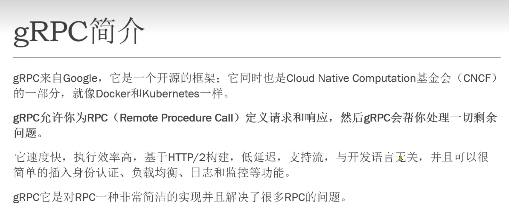
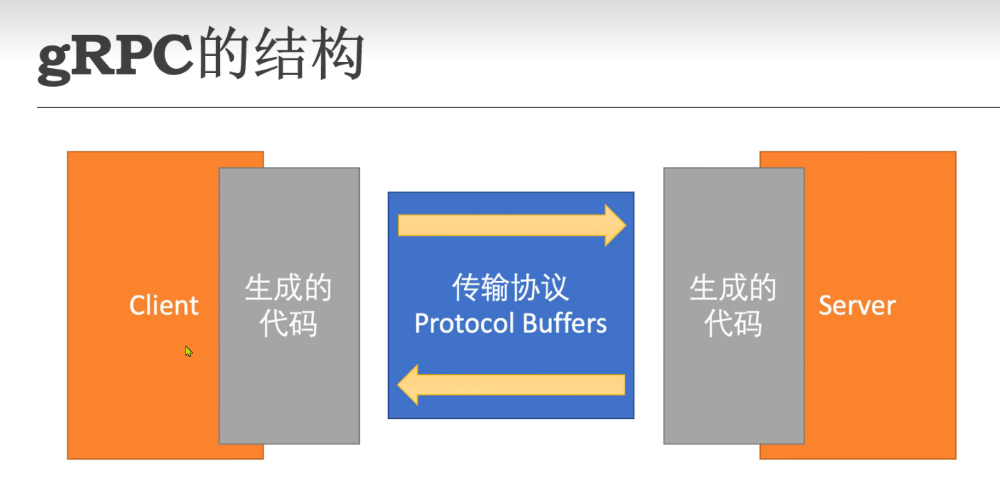
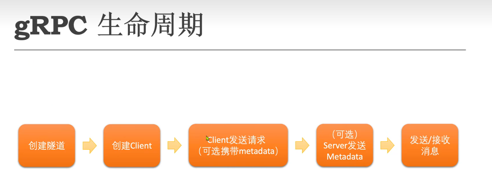
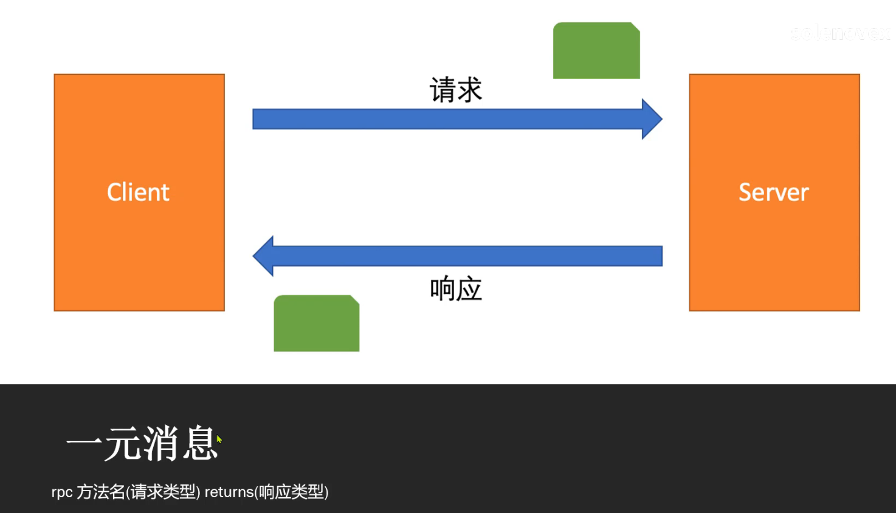
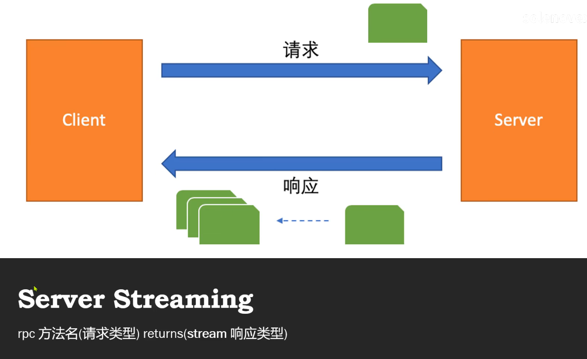
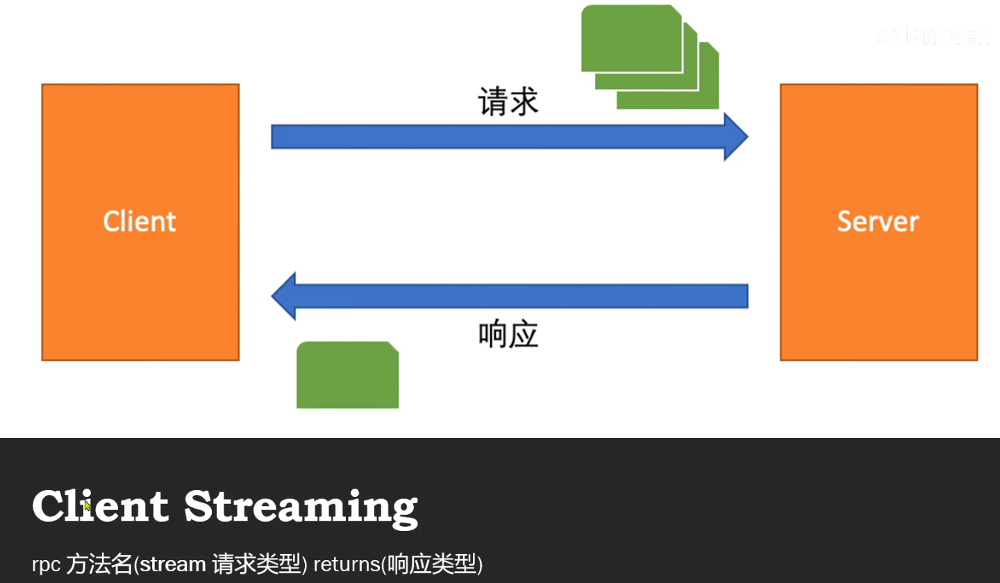
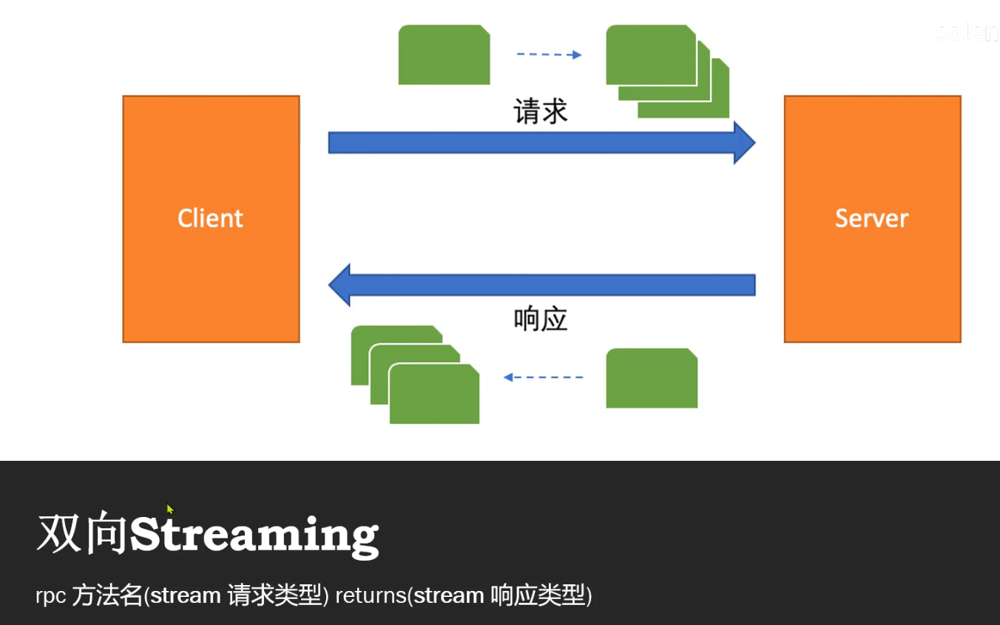

# gRPC介绍



## Protocol Buffers

- 官网[[Protocol Buffers  | Google Developers](https://developers.google.cn/protocol-buffers/)]
- 用来定义消息和服务

### 开发环境

- vscode 安装插件:vscode-proto3和Clang-Format
- Windows需要安装Clang[[LLVM Download Page](https://releases.llvm.org/download.html#3.7.0)]

### 定义一个消息类型

```protobuf
syntax = "proto3";

/* SearchRequest represents a search query, with pagination options to
 * indicate which results to include in the response. */
message SearchRequest {
  string query = 1;
  int32 page_number = 2;// Which page number do we want?
  int32 result_per_page = 3;// Number of results to return per page.
}
```

- 文件的第一行指定您使用的是proto3语法：如果您不这样做，协议缓冲区编译器将假设您使用proto2。这必须是文件的第一个非空的非注释行
- SearchRequest消息定义指定了三个字段（名称/值对），每个字段对应于要包含在此类型消息中的每段数据。每个字段都有名称和类型

### 保留的字段

指定已删除字段的字段编号（和/或名称，这也会导致JSON序列化问题）是保留的。如果任何未来用户试图使用这些字段标识符，协议缓冲区编译器将发生异常

```protobuf
message Foo {
  reserved 2, 15, 9 to 11;
  reserved "foo", "bar";
}
```

### 变量类型

- 标量类型

| .proto Type | Notes                                                        | C++ Type | Java/Kotlin Type[1] | Python Type[3]                  | Go Type | Ruby Type                      | C# Type    | PHP Type          | Dart Type |
| :---------- | :----------------------------------------------------------- | :------- | :------------------ | :------------------------------ | :------ | :----------------------------- | :--------- | :---------------- | :-------- |
| double      |                                                              | double   | double              | float                           | float64 | Float                          | double     | float             | double    |
| float       |                                                              | float    | float               | float                           | float32 | Float                          | float      | float             | double    |
| int32       | Uses variable-length encoding. Inefficient for encoding negative numbers – if your field is likely to have negative values, use sint32 instead. | int32    | int                 | int                             | int32   | Fixnum or Bignum (as required) | int        | integer           | int       |
| int64       | Uses variable-length encoding. Inefficient for encoding negative numbers – if your field is likely to have negative values, use sint64 instead. | int64    | long                | int/long[4]                     | int64   | Bignum                         | long       | integer/string[6] | Int64     |
| uint32      | Uses variable-length encoding.                               | uint32   | int[2]              | int/long[4]                     | uint32  | Fixnum or Bignum (as required) | uint       | integer           | int       |
| uint64      | Uses variable-length encoding.                               | uint64   | long[2]             | int/long[4]                     | uint64  | Bignum                         | ulong      | integer/string[6] | Int64     |
| sint32      | Uses variable-length encoding. Signed int value. These more efficiently encode negative numbers than regular int32s. | int32    | int                 | int                             | int32   | Fixnum or Bignum (as required) | int        | integer           | int       |
| sint64      | Uses variable-length encoding. Signed int value. These more efficiently encode negative numbers than regular int64s. | int64    | long                | int/long[4]                     | int64   | Bignum                         | long       | integer/string[6] | Int64     |
| fixed32     | Always four bytes. More efficient than uint32 if values are often greater than 228. | uint32   | int[2]              | int/long[4]                     | uint32  | Fixnum or Bignum (as required) | uint       | integer           | int       |
| fixed64     | Always eight bytes. More efficient than uint64 if values are often greater than 256. | uint64   | long[2]             | int/long[4]                     | uint64  | Bignum                         | ulong      | integer/string[6] | Int64     |
| sfixed32    | Always four bytes.                                           | int32    | int                 | int                             | int32   | Fixnum or Bignum (as required) | int        | integer           | int       |
| sfixed64    | Always eight bytes.                                          | int64    | long                | int/long[4]                     | int64   | Bignum                         | long       | integer/string[6] | Int64     |
| bool        |                                                              | bool     | boolean             | bool                            | bool    | TrueClass/FalseClass           | bool       | boolean           | bool      |
| string      | A string must always contain UTF-8 encoded or 7-bit ASCII text, and cannot be longer than 232. | string   | String              | str/unicode[5]                  | string  | String (UTF-8)                 | string     | string            | String    |
| bytes       | May contain any arbitrary sequence of bytes no longer than 232. | string   | ByteString          | str (Python 2) bytes (Python 3) | []byte  | String (ASCII-8BIT)            | ByteString | string            |           |

### 默认值

解析消息时，如果编码消息不包含特定的单一元素，则解析对象中的对应字段将设置为该字段的默认值。这些默认值是特定于类型的：

对于字符串，默认值为空字符串。

对于字节，默认值为空字节。

对于布尔值，默认值为false。

对于数字类型，默认值为零。

对于枚举，默认值是第一个定义的枚举值，该值必须为0。

对于消息字段，未设置该字段。它的确切值取决于语言。

### 枚举

```protobuf
enum Corpus {
  CORPUS_UNSPECIFIED = 0;
  CORPUS_UNIVERSAL = 1;
  CORPUS_WEB = 2;
  CORPUS_IMAGES = 3;
  CORPUS_LOCAL = 4;
  CORPUS_NEWS = 5;
  CORPUS_PRODUCTS = 6;
  CORPUS_VIDEO = 7;
}
message SearchRequest {
  string query = 1;
  int32 page_number = 2;
  int32 result_per_page = 3;
  Corpus corpus = 4;
}
```

- 可以通过将相同的值分配给不同的枚举常量来定义别名。为此，需要将allow_alias选项设置为true，否则当找到别名时，协议编译器将生成错误消息。尽管所有别名值在反序列化期间都有效，但序列化时始终使用第一个值

```protobuf
enum EnumAllowingAlias {
  option allow_alias = true;
  EAA_UNSPECIFIED = 0;
  EAA_STARTED = 1;
  EAA_RUNNING = 1;
  EAA_FINISHED = 2;
}
enum EnumNotAllowingAlias {
  ENAA_UNSPECIFIED = 0;
  ENAA_STARTED = 1;
  // ENAA_RUNNING = 1;  // Uncommenting this line will cause a compile error inside Google and a warning message outside.
  ENAA_FINISHED = 2;
}
```

### repeated 

```protobuf
message SearchResponse {
  repeated Result results = 1;
}

message Result {
  string url = 1;
  string title = 2;
  repeated string snippets = 3;//类似List
}
```

### 导入定义的proto文件

```protobuf
import "myproject/other_protos.proto";
```

### 嵌套类型

```protobuf
message SearchResponse {
  message Result {
    string url = 1;
    string title = 2;
    repeated string snippets = 3;
  }
  repeated Result results = 1;
}


//在父消息类型之外重用此消息类型
message SomeOtherMessage {
  SearchResponse.Result result = 1;
}
```

### Any

Any消息类型允许您将消息用作嵌入类型，而不需要它们的.proto定义。Any包含一个字节形式的任意序列化消息，以及一个URL，该URL充当该消息的全局唯一标识符并解析为该消息的类型。要使用Any类型，需要导入google/protobuf/Any.proto

```protobuf
import "google/protobuf/any.proto";

message ErrorStatus {
  string message = 1;
  repeated google.protobuf.Any details = 2;
}
```

### Oneof

要在.proto中定义oneof，请使用oneof关键字后跟oneof名称，在本例中为test_oneof：

```protobuf
message SampleMessage {
  oneof test_oneof {
    string name = 4;
    SubMessage sub_message = 9;
  }
}
```

然后将其中一个字段添加到其中一个定义中。可以添加任何类型的字段，但映射字段和重复字段除外。

设置oneof字段将自动清除oneof的所有其他成员。因此，如果设置了多个字段，则只有设置的最后一个字段仍然具有值。

```protobuf
SampleMessage消息；

message.set_name（“名称”）；

CHECK（message.has_name（））；

//调用mutable_sub_message（）将清除名称字段，并将

//sub_message到未设置字段的SubMessage的新实例

message.mutable_sub_message（）；

CHECK（！message.has_name（））；
```

- 如果解析器在连线上遇到同一个的多个成员，则在解析的消息中只使用最后一个成员。

- oneof不能repeated。

- 反射API适用于其中一个字段。

- 如果将oneof字段设置为默认值（例如将int32 oneof字段设为0），则将设置该oneof字段的“大小写”，并且该值将在连线上序列化。

- 如果您使用的是C++，请确保代码不会导致内存崩溃。下面的示例代码将崩溃，因为sub_message已通过调用set_name（）方法删除。

```protobuf
SampleMessage消息；

SubMessage*sub_message=message.mautable_sub_message（）；

消息集合名称（“名称”）；//将删除子消息（_M）

sub_message->set_…//此处崩溃
```

同样在C++中，如果将两条消息与一条消息交换（），则每条消息将以另一条消息的大小写结尾：在下面的示例中，msg1将有一个子消息，msg2将有一个名称。

```protobuf
SampleMessage msg1;
msg1.set_name("name");
SampleMessage msg2;
msg2.mutable_sub_message();
msg1.swap(&msg2);
CHECK(msg1.has_sub_message());
CHECK(msg2.has_name());
```

### Map

如果要创建关联映射作为数据定义的一部分，协议缓冲区提供了一种方便快捷的语法：

```protobuf
map＜key_type，value_type＞map_field=N；
```

…其中key_type可以是任何整数或字符串类型（因此，除了浮点类型和字节之外的任何标量类型）。请注意，enum不是有效的key_type。value_type可以是除其他贴图之外的任何类型。

因此，例如，如果您想创建一个项目映射，其中每个Project消息都与一个字符串键相关联，可以这样定义：

```protobuf
map<string，Project>projects=3；
```

- 映射字段不能重复。

- 映射值的连线格式排序和映射迭代排序是未定义的，因此不能依赖于特定顺序的映射项。

- 为.proto生成文本格式时，map按关键字排序。数字键按数字排序。

- 从连线解析或合并时，如果存在重复的映射键，则使用最后一个键。从文本格式解析映射时，如果存在重复的键，解析可能会失败。

- 如果为映射字段提供了键但没有值，则序列化该字段时的行为取决于语言。在C++、Java、Kotlin和Python中，该类型的默认值是串行化的，而在其他语言中则没有串行化的。

- 生成的map API目前可用于所有proto3支持的语言。您可以在相关的API参考中找到有关所选语言的映射API的更多信息。

### Packages

您可以向.proto文件中添加可选的包说明符，以防止协议消息类型之间的名称冲突。

```protobuf
package foo.bar;
message Open { ... }
```

然后，可以在定义消息类型的字段时使用包说明符：

```protobuf
message Foo {
  ...
  foo.bar.Open open = 1;
  ...
}
```

包说明符影响生成代码的方式取决于您选择的语言：

- 在C++中，生成的类被包装在C++命名空间中。例如，Open将位于名称空间foo:：bar中。

- 在Java和Kotlin中，该包被用作Java包，除非您在.proto文件中明确提供了Java_package选项。

- 在Python中，package指令被忽略，因为Python模块是根据它们在文件系统中的位置来组织的。

- 在Go中，除非您在.proto文件中明确提供了选项Go_package，否则该包将用作Go包名。

- 在Ruby中，生成的类被封装在嵌套的Ruby名称空间中，转换为所需的Ruby大写样式（第一个字母大写；如果第一个字符不是字母，则PB_被前置）。例如，Open将位于名称空间Foo:：Bar中。

- 在C#中，除非在.proto文件中明确提供了选项csharp_namespace，否则在转换为PascalCase后，该包将用作命名空间。例如，Open将位于名称空间Foo.Bar中。

#### 软件包和名称解析

协议缓冲区语言中的类型名称解析与C++类似：首先搜索最内部的作用域，然后搜索下一个最内部的范围，依此类推，每个包都被认为是其父包的“内部”。前导词“.”（例如，.foo.bar.Baz）表示从最外层开始

### 定义服务

```protobuf
service SearchService {
  rpc Search(SearchRequest) returns (SearchResponse);
}
```

## gRPC结构



## gRPC生命周期



## gRPC身份认证


## 消息传输类型


### 一元消息



### Server Streaming



### Client Streaming



### 双向Streaming



## gRPC示例

### proto文件

```protobuf
syntax = "proto3";

option csharp_namespace = "GrpcServer.Web.Protos";

message Employee{
	int32 id = 1;
	int32 no = 2;
	string firstName = 3;
	string lastName = 4;
	float salary = 5;
}


message GetByNoRequest{
	int32 no = 1;
}

message EmployeeResponse{
	Employee employee = 1;
}

message GetAllRequest{

}

message AddPhotoRequest{
	bytes data = 1;
}

message AddPhotoResponse{
	bool isOk = 1;
}

message EmployeeRequest{
	Employee employee = 1;
}

service EmployeeService{
	rpc GetByNo(GetByNoRequest) returns (EmployeeResponse);
	rpc GetAll(GetAllRequest) returns (stream EmployeeResponse);
	rpc AddPhoto(stream AddPhotoRequest) returns (AddPhotoResponse);
	rpc Save(EmployeeRequest) returns (EmployeeResponse);
	rpc SaveAll(stream EmployeeRequest) returns (stream EmployeeResponse);
}

```

### Server端

- 需要安装Grpc.AspNetCore

```c#
using GrpcServer.Web.Services;

var builder = WebApplication.CreateBuilder(args);

builder.Services.AddGrpc();

var app = builder.Build();

// Configure the HTTP request pipeline.
if (!app.Environment.IsDevelopment())
{
    app.UseExceptionHandler("/Error");

}

app.UseRouting();

app.UseHttpsRedirection();

app.UseEndpoints(endpoint =>
{
    endpoint.MapGrpcService<MyEmployeeService>();
});

app.Run();

```

```c#
using Grpc.Core;
using GrpcServer.Web.Data;
using GrpcServer.Web.Protos;

namespace GrpcServer.Web.Services
{
    public class MyEmployeeService:EmployeeService.EmployeeServiceBase
    {
        private readonly ILogger<MyEmployeeService> _logger;

        public MyEmployeeService(ILogger<MyEmployeeService> logger)
        {
            _logger = logger;
        }

        public override Task<EmployeeResponse> GetByNo(GetByNoRequest request, ServerCallContext context)
        {
            var md = context.RequestHeaders;
            foreach (var pair in md)
            {
                _logger.LogInformation($"Key:{pair.Key},value:{pair.Value}");
            }

            var employee = InMemoryData.Employees.SingleOrDefault(x => x.No == request.No);

            if (employee != null)
            {
                var response = new EmployeeResponse
                {
                    Employee = employee
                };
                return Task.FromResult(response);
            }

            throw new Exception($"Employee not found with no:{request.No}");
        }

        public override async Task GetAll(GetAllRequest request, IServerStreamWriter<EmployeeResponse> responseStream, ServerCallContext context)
        {
            foreach (var employee in InMemoryData.Employees)
            {
                await responseStream.WriteAsync(new EmployeeResponse()
                {
                    Employee = employee
                });
            } 
        }

        public override async Task<AddPhotoResponse> AddPhoto(IAsyncStreamReader<AddPhotoRequest> requestStream, ServerCallContext context)
        {
            var md = context.RequestHeaders;
            foreach (var pair in md)
            {
                _logger.LogInformation($"Key:{pair.Key},value:{pair.Value}");
            }

            var data = new List<byte>();

            while (await requestStream.MoveNext())
            {
                _logger.LogInformation($"Received {requestStream.Current.Data.Length} bytes");

                data.AddRange(requestStream.Current.Data);
            }

            _logger.LogInformation($"Received file with {data.Count} bytes");

            return new AddPhotoResponse()
            {
                IsOk = true
            };
        }

        public override async Task SaveAll(IAsyncStreamReader<EmployeeRequest> requestStream, IServerStreamWriter<EmployeeResponse> responseStream, ServerCallContext context)
        {
            while (await requestStream.MoveNext())
            {
                var employee = requestStream.Current.Employee;
                lock (this)
                {
                    employee.Id = InMemoryData.Employees.Max(x => x.Id) + 1;

                    InMemoryData.Employees.Add(employee);
                    
                }
                await responseStream.WriteAsync(new EmployeeResponse()
                {
                    Employee = employee
                });
            }

            _logger.LogInformation($"Employees:");
            foreach (var employee in InMemoryData.Employees)
            {
                _logger.LogInformation($"{employee}");
            }
        }
    }
}

```

### Client端

- 需要安装Grpc.Net.Client,Google.Protobuf,Grpc.Tools

```c#
using Google.Protobuf;
using Grpc.Core;
using Grpc.Net.Client;
using GrpcServer.Web.Protos;


using var channel = GrpcChannel.ForAddress("https://localhost:7157");

var client = new EmployeeService.EmployeeServiceClient(channel);

var option = int.Parse(args[0]);

switch (option)
{
    case 1:
        await GetByNoAsync(client);
        break;
    case 2:
        await GetByAll(client);
        break;
    case 3:
        await AddPhotoAsync(client);
        break;
    case 5:
        await SaveAllAsync(client);
        break;
}

Console.ReadKey();


async Task GetByNoAsync(EmployeeService.EmployeeServiceClient client)
{
    var md = new Metadata()
    {
        {"username","administrator"},
        {"role","Admin"}
    };
    var response = await client.GetByNoAsync(new GetByNoRequest
    {
        No = 1994
    }, md);
    Console.WriteLine($"Response Message:{response}");
}


async Task GetByAll(EmployeeService.EmployeeServiceClient client)
{
    using var call = client.GetAll(new GetAllRequest());
    var responseStream = call.ResponseStream;
    while (await responseStream.MoveNext())
    {
        Console.WriteLine(responseStream.Current.Employee);
    }
}

async Task AddPhotoAsync(EmployeeService.EmployeeServiceClient client)
{
    var md = new Metadata()
    {
        {"username","administrator"},
        {"role","Admin"}
    };

    FileStream fs = File.OpenRead("images/01.png");

    using var call = client.AddPhoto(md);

    var stream = call.RequestStream;

    while (true)
    {
        byte[] buffer = new byte[1024];

        int numRead = await fs.ReadAsync(buffer, 0, buffer.Length);
        if (numRead == 0)
        {
            break;
        }

        if (numRead < buffer.Length)
        {
            Array.Resize(ref buffer,numRead);
        }

        await stream.WriteAsync(new AddPhotoRequest()
        {
            Data = ByteString.CopyFrom(buffer)
        });
    }

    await stream.CompleteAsync();

    var response = await call.ResponseAsync;

    Console.WriteLine(response.IsOk);
}

async Task SaveAllAsync(EmployeeService.EmployeeServiceClient client)
{
    var employees = new List<Employee>()
    {
        new Employee()
        {
            No = 111,
            FirstName = "Monica",
            LastName = "Geller",
            Salary = 7890.1f
        },
        new Employee()
        {
            No = 222,
            FirstName = "Joey",
            LastName = "Michael",
            Salary = 500
        }
    };

    using var call = client.SaveAll();
    var requestStream = call.RequestStream;
    var responseStream = call.ResponseStream;

    var responseTask = Task.Run(async () =>
    {
        while (await responseStream.MoveNext())
        {
            Console.WriteLine($"Saved {responseStream.Current.Employee}");
        }
    });

    foreach (var employee in employees)
    {
        await requestStream.WriteAsync(new EmployeeRequest()
        {
            Employee = employee
        });
    }

    await requestStream.CompleteAsync();

    await responseTask;
}
```

