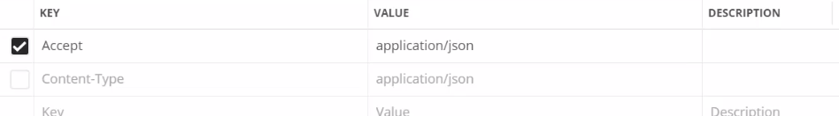
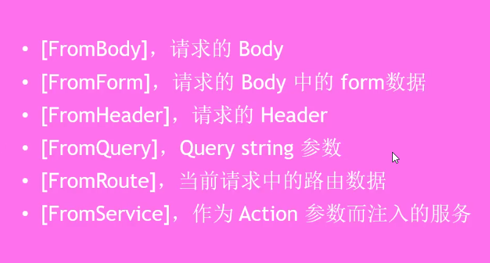
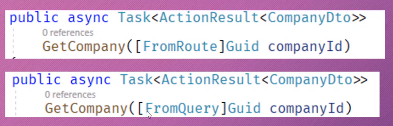
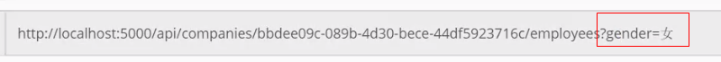
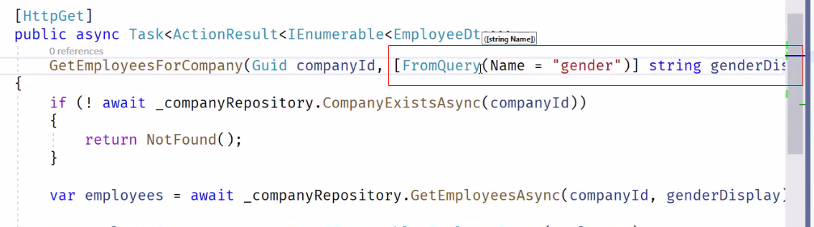
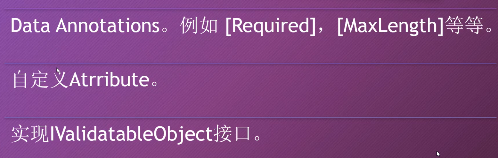
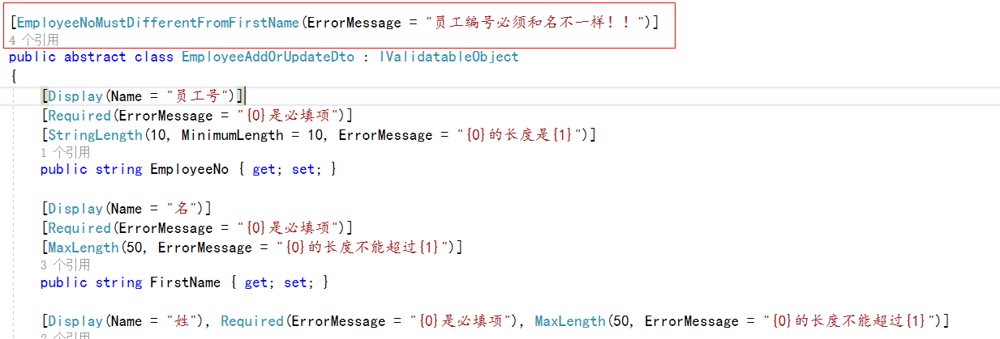
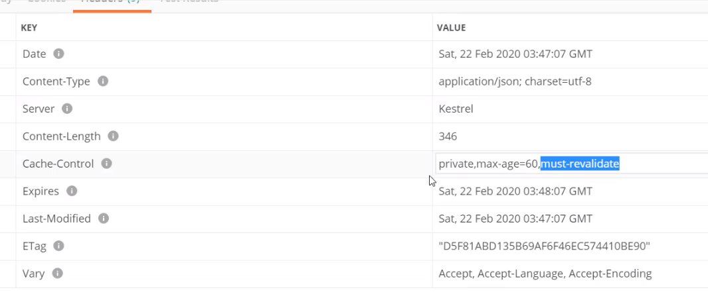
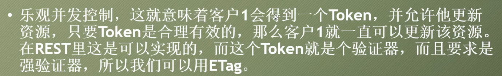
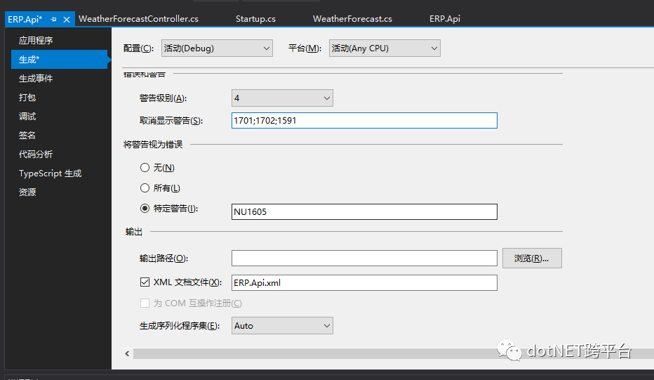

# Webapi

Webapi:使用http协议并通过网络调用的API (大多数API都不是RESTful API)

# RESTful API

示例：


# http状态码

## 1xx：属于信息性的状态码，web api并不使用1xx的状态码

## 2xx：请求执行成功

- 200-OK,表示请求成功(return Ok();)

- 201-Created，请求成功并创建了资源

- 204-No Content，请求成功，但不应该返回任何东西，例如删除操作

## 3xx:用于跳转，例如告诉搜索引擎某个页面的网址已经永久的改变。绝大多数API不需要使用这类状态码

## 4xx：客户端错误

- 400-Bad Request:表示API消费者发送到服务器的请求是有错误的

- 401-Unauthorized:表示没有提供授权信息或者提供授权信息不正确

- 403-Forbidden:表示身份认证已经成功，但是已认证的用户无法访问请求的资源

- 404-Not Found:表示请求的资源不存在（return NotFound();）

- 405-Method Not Allowed:当尝试发送请求资源的时候，使用了不被支持的http方法

- 406-Not Accepted:表示API消费者请求的表述格式（json.xml之类）并不被API所支持，并且API不会提供默认的表述格式

- 409-Conflict:表示请求与服务器当前状态冲突。如要创建的资源已存在或者要更新的资源在服务器也进行更新

- 415-Unsupported Media Type:有些请求必须带着数据发往服务器，这些数据都是属于特定的媒体类型，如果API不支持该媒体类型，就会返回415

- 422-Unprocessable entity:是Http扩展协议的一部分，说明服务器已经懂得了实体的Content-Type,实体的语法也没有问题，但是服务器仍然无法处理这个实体数据，通常表示语意上有错误或表示实体验证的错误

## 5xx:服务器端的错误

- 500-Internal server error:表示服务器出现错误

# 内容协商(请求和响应的内容格式)

根据API消费者设置的媒体类型，响应输出对应格式的结果

## Accept Header

Application/json（默认）

Application/xml

…

## Content-Type Header

Application/json（默认）

Application/xml

…

## 请求：



## 响应：


## 设置**请求和响应格式不一致时返回**406状态码

```c#
services.AddControllers(setup =>
            {
                setup.ReturnHttpNotAcceptable = true;//该值设置为true，请求和响应格式不一致时会返回406状态码
            });

```

## **设置支持输出xml格式**

```c#
services.AddControllers(setup =>
            {
				//旧的方法
                //setup.OutputFormatters.Add(new XmlDataContractSerializerOutputFormatter());//支持xml, OutputFormatters是个集合
//setup.OutputFormatters.Insert(0, new XmlDataContractSerializerOutputFormatter());//放在第一位则默认的就是xml格式
            }).AddXmlDataContractSerializerFormatters();//Input和Output都添加xml格式

```

# 读取配置文件appsetting.json

## IOption<T>

```json
{
    "AllowedHosts": "*",
    "Logging": {
        "LogLevel": {
            "Default": "Information",
            "Microsoft": "Warning",
            "Other": "Information"
        }
    }
}
```

```c#
	public class Logging
    {
        public const string logging = "Logging";
        public LogLevel LogLevel { get;} = new LogLevel();
    }

    public class LogLevel
    {
        public string Default { get; set; }

        public string Microsoft { get; set; }

        public string Other { get; set; }
    }
```

- startup中读取

```c#
		app.Use(async (context, next) =>
            {
                var log = new Logging();
                Configuration.GetSection(Logging.logging).Bind(log);
                await context.Response.WriteAsync(log.LogLevel.Microsoft);
            });
```

- 注入之后在其他地方使用

```c#
 //添加到依赖注入容器
 services.Configure<Logging>(Configuration.GetSection(Logging.logging));
```

```c#
 		private readonly Logging _options;
        public ValuesController(IOptions<Logging> options)
        {
            _options = options.Value;
        }

        [HttpGet(nameof(GetValue))]
        public IActionResult GetValue()
        {
            var str = _options.LogLevel.Default;
            return Ok($"{str}");
        }
```

## Configuration

```c#
Configuration["ConnectionStrings:CityInfoDBConnectionString"]
```

# ActionResult<T>

# AutoMapper: 对象到对象的映射器

1. Nuget安装AutoMapper.Microsoft.Extensions.DependencyInjection

2. ConfigServices方法注册服务

 ```c#
 services.AddAutoMapper(AppDomain.CurrentDomain.GetAssemblies());
 ```

3. 类继承Profile

```c#
public class EmployeeProfile: Profile
    {
        public EmployeeProfile()
        {
            CreateMap<Employee, EmployeeDto>()
                .ForMember(dest => dest.Name,
                    opt => opt.MapFrom(src => $"{src.FirstName} {src.LastName}"))
                .ForMember(dest => dest.GenderDisplay
                , opt => opt.MapFrom(src => src.Gender.ToString()))
                .ForMember(dest => dest.Age, 
                    opt => opt.MapFrom(src => DateTime.Now.Year - src.DateOfBirth.Year));

            CreateMap<EmployeeAddDto, Employee>();
            CreateMap<EmployeeUpdateDto, Employee>();
            CreateMap<Employee, EmployeeUpdateDto>();
        }
}

```

4. 代码中映射

```c#
_mapper.Map<IEnumerable<CompanyDto>>(companies);
```

# **异常处理（自定义异常信息）**

## 全局

```c#
if (env.IsDevelopment())
            {
                app.UseDeveloperExceptionPage();
            }
            else
            {
                //存在未处理异常
                app.UseExceptionHandler(appBuilder =>
                {
                    appBuilder.Run(async context =>
                    {
                        context.Response.StatusCode = 500;
                        await context.Response.WriteAsync("Unexpected Error!");
                    });
                });
            }

```

## 使用Filter

```c#
public class CustomExceptionFilter : IExceptionFilter
    {
        private readonly ILogger<CustomExceptionFilter> _logger;

        public CustomExceptionFilter(ILogger<CustomExceptionFilter> logger)
        {
            _logger = logger;
        }
        public void OnException(ExceptionContext context)
        {
            _logger.LogError(context.Exception.Message);

            //filter中设置返回值
            context.HttpContext.Response.StatusCode = 500;
            context.Result = new ObjectResult(context.Exception.Message);
        }
    }
```


# HTTP HEAD

HEAD几乎和GET一样，只是HEAD的API不应该返回响应的body，HEAD可以用来在资源上获取一些信息


# 过滤和搜索

## Binding Source 特性





## ApiController更改后的规则


## 过滤：根据条件限定返回的集合

过滤的意思就是把某个字段的名字以及想要让该字段匹配的值一起传递给API，并将这些作为返回集合的一部分





## 搜索：根据预定义的规则，把符合条件的数据添加到集合


# Http Options 和 XM支持

Option请求可以获得针对某个api的通信选项信息

# 输入验证

## 定义验证规则



## Attribute示例


## 自定义Attribute示例

```c#
public class EmployeeNoMustDifferentFromFirstNameAttribute : ValidationAttribute
    {
        protected override ValidationResult IsValid(object value, ValidationContext validationContext)
        {
            var addDto = (EmployeeAddOrUpdateDto)validationContext.ObjectInstance;
            if (addDto.EmployeeNo == addDto.FirstName)
            {
                return new ValidationResult(ErrorMessage, new[] { nameof(EmployeeAddOrUpdateDto) });
            }
            return ValidationResult.Success;
        }
}

```



## IValidatableObject接口

```c#
public abstract class EmployeeAddOrUpdateDto : IValidatableObject
    {
        [Display(Name = "员工号")]
        [Required(ErrorMessage = "{0}是必填项")]
        [StringLength(10, MinimumLength = 10, ErrorMessage = "{0}的长度是{1}")]
        public string EmployeeNo { get; set; }
        public IEnumerable<ValidationResult> Validate(ValidationContext validationContext)
        {
            if (FirstName == LastName)
            {
                yield return new ValidationResult("姓和名不能一样",
                    new[] { nameof(FirstName), nameof(LastName) });
            }
        }

```

## **其他验证方式**

### FluentValidation

1. 容易创建复杂的验证规则

2. 验证规则与Model分开

3. 容易进行单元测试

## **如果验证错误**

### 默认的


### **自定义**

```c#
//处理输入验证错误
Services.ConfigureApiBehaviorOptions(setup =>
                {
                    setup.InvalidModelStateResponseFactory = context =>
                    {
                        var problemDetails = new ValidationProblemDetails(context.ModelState)
                        {
                            Type = "http://www.baidu.com",
                            Title = "有错误！！！",
                            Status = StatusCodes.Status422UnprocessableEntity,
                            Detail = "请看详细信息",
                            Instance = context.HttpContext.Request.Path
                        };

                        problemDetails.Extensions.Add("traceId", context.HttpContext.TraceIdentifier);

                        return new UnprocessableEntityObjectResult(problemDetails)
                        {
                            ContentTypes = { "application/problem+json" }
                        };
                    };
                });

```

# **缓存**


- 客户端缓存（存在于客户端，私有）

- 网关缓存（服务器端，共享）

- 代理缓存（存在网络的其他地方）

## 实现的方式

1. 添加特性 [ResponseCache(Duration = 60)]// Duration指定缓存的时间

> ResponseCache：只是添加一个响应头，并没有缓存任何数据


2. 注册服务

```c#
services.AddResponseCaching();

app.UseResponseCaching();//微软自带的，不支持验证模型
```

也可以在AddControllers里设置

```c#
services.AddControllers(setup =>
                {
                    setup.ReturnHttpNotAcceptable = true;
                    setup.CacheProfiles.Add("120CacheProfile",new CacheProfile
                    {
                        Duration = 120
                    });
                })
```

然后在特性中指定``[ResponseCache(CacheProfileName = "120CacheProfile")]``


## 支持ETag验证

### Marvin.Cache.Headers库


### Startup

```c#
//ETag
            services.AddHttpCacheHeaders();

			app.UseHttpCacheHeaders();//必须在UseResponseCaching之后，在controller中间件之前

```


### 过期模型和验证模型的一些参数

#### 全局配置

```c#
services.AddHttpCacheHeaders(expires =>//过期模型
            {
                expires.MaxAge = 60;
                expires.CacheLocation = CacheLocation.Private;
            }, validation =>//验证模型
            {
                validation.MustRevalidate = true;//如果响应过期必须重新验证
            }); 
```



#### 对各个资源单独配置

```c#
		[HttpGet("{userId}")]
        //[ResponseCache(Duration = 60)]
        [HttpCacheExpiration(CacheLocation = CacheLocation.Public,MaxAge = 1800)]//过期模型
        [HttpCacheValidation(MustRevalidate = false)]//验证模型
        public async Task<IActionResult> GetUserById(Guid userId)

```

### Vary-Header

即可以分别对不同格式的请求分别缓存，一般使用默认的就可以

### ETag如何工作

请求时添加一个if-none-match请求头，把之前响应头中的ETag值给它，当请求资源发生改变后，再次请求会响应会带新的ETag，即不是缓存返回而是重新请求


# 并发控制

## 悲观并发控制


## 乐观并发控制



### 例子


# Swagger

## 安装Swashbuckle.AspNetCore

Nuget安装

## 添加并配置 Swagger 中间件

将 Swagger 生成器添加到 `Startup.ConfigureServices` 方法中的服务集合中：

```c#
public void ConfigureServices(IServiceCollection services)
{
    services.AddDbContext<TodoContext>(opt =>
        opt.UseInMemoryDatabase("TodoList"));
    services.AddMvc()
        .SetCompatibilityVersion(CompatibilityVersion.Version_2_1);

    // Register the Swagger generator, defining 1 or more Swagger documents
 services.AddSwaggerGen();
}
//在 Startup.Configure 方法中，启用中间件为生成的 JSON 文档和 Swagger UI 提供服务：public void Configure(IApplicationBuilder app)
{
    // Enable middleware to serve generated Swagger as a JSON endpoint.
 app.UseSwagger();

    // Enable middleware to serve swagger-ui (HTML, JS, CSS, etc.),
    // specifying the Swagger JSON endpoint.
 app.UseSwaggerUI(c => { c.SwaggerEndpoint("/swagger/v1/swagger.json", "My API V1"); });
}

```

## 生成方法说明xml和取消警告

Xml文件输出路径为默认（startup.cs同一级）即可



## API 信息和说明

传递给 `AddSwaggerGen` 方法的配置操作会添加诸如作者、许可证和说明的信息：

using Microsoft.OpenApi.Models;

使用 `OpenApiInfo` 类修改 UI 中显示的信息：

```c#
// Register the Swagger generator, defining 1 or more Swagger documents
services.AddSwaggerGen(c =>
{
    c.SwaggerDoc("v1", new OpenApiInfo
    {
        Version = "v1",
        Title = "ToDo API",
        Description = "A simple example ASP.NET Core Web API",
        TermsOfService = new Uri("https://example.com/terms"),
        Contact = new OpenApiContact
        {
            Name = "Shayne Boyer",
            Email = string.Empty,
            Url = new Uri("https://twitter.com/spboyer"),
        },
        License = new OpenApiLicense
        {
            Name = "Use under LICX",
            Url = new Uri("https://example.com/license"),
        }
});
// 为 Swagger JSON and UI设置xml文档注释路径
var basePath = Path.GetDirectoryName(AppContext.BaseDirectory);//获取应用程序所在目录(绝对，不受工作目录影响，建议采用此方法获取路径)
var xmlPath = Path.Combine(basePath, "ERP.Api.xml");
c.IncludeXmlComments(xmlPath);
});
```

## 修改默认打开页面

修改launchSetting.json文件

"launchUrl": "swagger/index.html"

# API版本控制

> 安装Nuget包 Microsoft.AspNetCore.Mvc.Versioning

## programe

```c#
service.AddApiVersioning(option =>
            {
                option.ReportApiVersions = true;
                option.DefaultApiVersion = new ApiVersion(2, 0);
                option.AssumeDefaultVersionWhenUnspecified = true;
                // Url Path的形式无需特别配置

                // 使用Http Header时的配置
                // option.ApiVersionReader=new HeaderApiVersionReader("api-version");

                // 使用Query String时的配置
                // option.ApiVersionReader=new QueryStringApiVersionReader("api-version");

                // Http Header和Query String能一起使用时的配置
                option.ApiVersionReader = ApiVersionReader.Combine
                (
                    new HeaderApiVersionReader("api-version"),
                    new QueryStringApiVersionReader("api-version")
                );
            });
```

## 特性

```c#
[ApiVersion("1.0")]
[ApiVersion("2.0")]
[Route("api/v{version:apiVersion}/cities")]
public class UserController:ControllerBase
{
    [MapToApiVersion("1.0")]
    [HttpGet]
    public async Task<ActionResult> Get1()
    {
        var values = new {Version = "1.0", Method = "Get"};
        return Ok(values);
    }

    [MapToApiVersion("2.0")]
    [HttpGet]
    public async Task<ActionResult> Get2()
    {
        var values = new { Version = "2.0", Method = "Get" };
        return Ok(values);
    }
}
/*MapToApiVersion：MapToApiVersion 特性允许将单个 action 映射到任何版本。在上面的代码中Get1对应v1，Get2对应v2
Deprecated(弃用)：只是增加一个标识，并不代表该版本的API无法使用（此时访问v1版本仍然会有返回值）

多路由特性：采用这种形式可以保证api/user（访问的是指定的默认版本）和api/v1/user两种形式都可以正常访问*/
```

# 授权验证

## JWT

```c#
services.AddAuthentication(x =>
            {
                x.DefaultAuthenticateScheme = JwtBearerDefaults.AuthenticationScheme;
                x.DefaultChallengeScheme = JwtBearerDefaults.AuthenticationScheme;
            }).AddJwtBearer(options => {// 添加jwt验证：
                    options.TokenValidationParameters = new TokenValidationParameters
                    {
                        ValidateIssuer = true,//是否验证Issuer
                        ValidateAudience = true,//是否验证Audience
                        ValidateLifetime = true,//是否验证失效时间
                        ValidateIssuerSigningKey = true,//是否验证SecurityKey
                        ValidAudience = "192.168.242.128:8001",//Audience
                        ValidIssuer = "192.168.242.128:8001",//Issuer，这两项和前面签发jwt的设置一致
                        IssuerSigningKey = new SymmetricSecurityKey(Encoding.UTF8.GetBytes(Configuration["SecurityKey"]))//拿到SecurityKey
                    };
                });


			app.UseRefreshTokenExpire();
			app.UseAuthentication();
            app.UseAuthorization();
```

```c#
	public static class MiddlewareExtensions
    {/// <summary>
     /// 使用自定义的鉴权中间件
     /// </summary>
     /// <param name="app"></param>
     /// <returns></returns>
        public static IApplicationBuilder UseRefreshTokenExpire(this IApplicationBuilder app)
        {
            //这样在startup.configure方法中直接用app.UseRefreshTokenExpire();就可以了
            //如果不写这个扩展方法就把下面这句直接放在startup.configure方法中就可以了
            return app.UseMiddleware<RefreshTokenExpireMiddleWare>();
        }
    }
```

```c#
/// <summary>
    /// token令牌过期自动刷新
    /// </summary>
    public class RefreshTokenExpireMiddleWare
    {
        //下一个要执行的中间件
        private RequestDelegate _next;
        //构造函数注入的方式，在IOC容器中获取服务
        private IConfiguration _configuration;
        //如果需要其他服务，可以自己加
        public RefreshTokenExpireMiddleWare(RequestDelegate next, IConfiguration configuration)
        {
            _next = next;
            _configuration = configuration;
        }

        private DateTime ConvertStringToDateTime(string timeStamp)
        {
            Int64 begtime = Convert.ToInt64(timeStamp) * 10000000;
            DateTime dt_1970 = new DateTime(1970, 1, 1, 8, 0, 0);
            long tricks_1970 = dt_1970.Ticks;//1970年1月1日刻度
            long time_tricks = tricks_1970 + begtime;//日志日期刻度
            DateTime dt = new DateTime(time_tricks);//转化为DateTime
            return dt;
        }


        public async Task Invoke(HttpContext context)
        {
            context.Request.Headers.TryGetValue("Authorization", out StringValues values);
            string valStr = values.ToString();
            if (!string.IsNullOrWhiteSpace(valStr) && valStr.StartsWith("Bearer "))
            {
                valStr = valStr.Split(' ')[1];
                //认证模拟basic认证：cusAuth YWRtaW46YWRtaW4=
                JwtSecurityTokenHandler handler = new JwtSecurityTokenHandler();
                try
                {
                    IDictionary<string, object> claims = new Dictionary<string, object>();
                    JwtSecurityToken jwt = handler.ReadJwtToken(valStr);
                    if (jwt != null)
                    {
                        var key = new SymmetricSecurityKey(Encoding.UTF8.GetBytes(_configuration["SecurityKey"]));

                        TokenValidationParameters validationParameters = new TokenValidationParameters
                        {
                            RequireExpirationTime = true,
                            ClockSkew = TimeSpan.Zero,
                            IssuerSigningKey = key,//签名验证算法
                            ValidateIssuer = true,//是否验证Issuer
                            ValidateAudience = true,//是否验证Audience
                            ValidateLifetime = false,//是否验证失效时间
                            ValidAudience = "yourdomain.com",
                            ValidIssuer = "yourdomain.com",
                            ValidateIssuerSigningKey = true,//是否验证签名
                        };
                        var principal = handler.ValidateToken(valStr, validationParameters, out SecurityToken securityToken);
                        foreach (Claim item in principal.Claims)
                        {
                            claims.Add(item.Type, item.Value);
                        }
                        
                        if (claims.ContainsKey("exp") && ConvertStringToDateTime(claims["exp"].ToString()) <= DateTime.Now && ConvertStringToDateTime(claims["exp"].ToString()).AddHours(4) >= DateTime.Now)
                        {
                            var creds = new SigningCredentials(key, SecurityAlgorithms.HmacSha256);
                            int expires_in = int.Parse(_configuration["Expire_in"]);
                            var claimArr = new[]
                            {
                               new Claim(ClaimTypes.Name, claims[ClaimTypes.Name].ToString()),
                               new Claim("exp", DateTime.Now.AddMinutes(expires_in).ToString())
                            };
                            var token = new JwtSecurityToken(
                                issuer: "yourdomain.com",
                                audience: "yourdomain.com",
                                claims: claimArr,
                                expires: DateTime.Now.AddMinutes(expires_in),
                                signingCredentials: creds);

                            var accessToken = new JwtSecurityTokenHandler().WriteToken(token);
                            context.Response.Headers.Add("X-Refresh-Token", accessToken);
                        }else if (ConvertStringToDateTime(claims["exp"].ToString()) < DateTime.Now)
                        {
                            context.Response.Headers.Remove("X-Refresh-Token");
                            context.Response.StatusCode = (int)HttpStatusCode.Unauthorized;
                            await context.Response.WriteAsJsonAsync(new
                            {
                                code = (int)HttpStatusCode.Unauthorized,
                                msg = "超时，请重新登录"
                            });
                            
                            return;
                        }
                        else
                        {
                            context.Response.Headers.Remove("X-Refresh-Token");
                        }
                    }
                }
                catch (Exception ex)
                {
                    context.Response.StatusCode = (int)HttpStatusCode.InternalServerError;
                    await context.Response.WriteAsJsonAsync(new
                    {
                        code = (int)HttpStatusCode.InternalServerError,
                        msg = ex.Message
                    });
                    return;
                }
                
            }

            await _next(context);
        }
    }
```

```c#
		/// <summary>
        /// 登录
        /// </summary>
        /// <param name="request"></param>
        /// <returns></returns>
        [AllowAnonymous]
        [HttpPost]
        public IActionResult RequestToken([FromBody] TokenRequest request)
        {
            string username = request.Username;
            string password = request.Password;

            //先验证用户名和密码合法性
            if (username.Equals("admin") && password.Equals("1"))
            {
                // push the user’s name into a claim, so we can identify the user later on.
                var claims = new[]
                {
                   new Claim(ClaimTypes.Name, request.Username)//角色等信息
                };
                //sign the token using a secret key.This secret will be shared between your API and anything that needs to check that the token is legit.
                var key = new SymmetricSecurityKey(Encoding.UTF8.GetBytes(_configuration["SecurityKey"]));
                var creds = new SigningCredentials(key, SecurityAlgorithms.HmacSha256);
                //.NET Core’s JwtSecurityToken class takes on the heavy lifting and actually creates the token.
                /**
                 * Claims (Payload)
                    Claims 部分包含了一些跟这个 token 有关的重要信息。 JWT 标准规定了一些字段，下面节选一些字段:
                    iss: The issuer of the token，token 是给谁的
                    sub: The subject of the token，token 主题
                    exp: Expiration Time。 token 过期时间，Unix 时间戳格式
                    iat: Issued At。 token 创建时间， Unix 时间戳格式
                    jti: JWT ID。针对当前 token 的唯一标识
                    除了规定的字段外，可以包含其他任何 JSON 兼容的字段。
                 * */
                int expires_in = int.Parse(_configuration["Expire_in"]);
                var token = new JwtSecurityToken(
                    issuer: "yourdomain.com",
                    audience: "yourdomain.com",
                    claims: claims,
                    expires: DateTime.Now.AddMinutes(expires_in),
                    signingCredentials: creds);

                var accessToken = new JwtSecurityTokenHandler().WriteToken(token);
                
                var response = new
                {

                    username = username,
                    access_token = accessToken,
                    expires_in = 1800
                };

                return Ok(response);

                //return Ok(new
                //{
                //    token = new JwtSecurityTokenHandler().WriteToken(token)
                //});
            }
            else
            {
                return BadRequest("Could not verify username and password");
            }
```

```c#
		[Authorize(AuthenticationSchemes = JwtBearerDefaults.AuthenticationScheme)]//jwt验证
        public async Task<IEnumerable<Student>> GetTestStudentInfo()
        {
            var stus = await _test.GetTestStudentInfo();
            _logger.LogInformation("获取所有学生信息");
            return _mapper.Map<IEnumerable<Student>>(stus);
        }
```

### 添加JWT自定义验证

```c#
 services.AddAuthentication(x =>
            {
                //添加自定义认证处理器
                x.AddScheme<CustomerAuthenticationHandler>(CustomerAuthenticationHandler.CustomerSchemeName, CustomerAuthenticationHandler.CustomerSchemeName);
            })
```

```c#
		/// <summary>
        /// GetSingleStudent
        /// </summary>
        /// <param name="student">输入要查询的学生信息</param>
        /// <returns></returns>
        [HttpPost(nameof(GetSingleStudent))]
        //指定认证时，采用CustomerAuthenticationHandler.CustomerSchemeName
        [Authorize(AuthenticationSchemes = CustomerAuthenticationHandler.CustomerSchemeName)]
        public async Task<Student> GetSingleStudent(Student student)
        {
            var stus = await _test.GetTestStudentInfo();
            var st = stus.SingleOrDefault(c => c.Id == student.Id && c.DbName == student.Name);
            return _mapper.Map<Student>(st);
        }
```

```c#
	public class CustomAuthsizeFilter : AuthorizeAttribute
    {
        public void OnAuthorization(AuthorizationFilterContext context)
        {
            var user = context.HttpContext.User;
            if (user.Identity.IsAuthenticated)
            {
                //context.Result = new ContentResult() { StatusCode = (int)HttpStatusCode.OK, Content = "验证通过" };
            }
            else
            {
                context.Result = new ContentResult() { StatusCode = (int)HttpStatusCode.Forbidden, Content = "你没有访问该资源的权限" };
            }
        }
    }
```

```c#
//CustomerAuthenticationHandler
public class CustomerAuthenticationHandler : IAuthenticationHandler
    {
        /// <summary>
        /// 自定义认证Scheme名称
        /// </summary>
        public const string CustomerSchemeName = "cusAuth";

        private AuthenticationScheme _scheme;
        private HttpContext _context;
        private readonly IConfiguration _configuration;

        public CustomerAuthenticationHandler(IConfiguration configuration)
        {
            _configuration = configuration;
        }

        /// <summary>
        /// 认证逻辑：认证校验主要逻辑
        /// </summary>
        /// <returns></returns>
        /// <exception cref="System.NotImplementedException"></exception>
        public Task<AuthenticateResult> AuthenticateAsync()
        {
            AuthenticateResult result;
            _context.Request.Headers.TryGetValue("Authorization", out StringValues values);
            string valStr = values.ToString();
            if (!string.IsNullOrWhiteSpace(valStr) && valStr.StartsWith("Bearer "))
            {
                valStr = valStr.Split(' ')[1];
                //认证模拟basic认证：cusAuth YWRtaW46YWRtaW4=
                JwtSecurityTokenHandler handler = new JwtSecurityTokenHandler();
                try
                {
                    IDictionary<string, object> claims = new Dictionary<string, object>();
                    JwtSecurityToken jwt = handler.ReadJwtToken(valStr);
                    if (jwt == null)
                    {
                        result = AuthenticateResult.Fail("未登陆");
                    }
                    var key = new SymmetricSecurityKey(Encoding.UTF8.GetBytes(_configuration["SecurityKey"]));
                    TokenValidationParameters validationParameters = new TokenValidationParameters
                    {
                        RequireExpirationTime = true,
                        ClockSkew = TimeSpan.Zero,
                        IssuerSigningKey = key,//签名验证算法
                        ValidateIssuer = true,//是否验证Issuer
                        ValidateAudience = true,//是否验证Audience
                        ValidateLifetime = true,//是否验证失效时间
                        ValidAudience = "yourdomain.com",
                        ValidIssuer = "yourdomain.com",
                        ValidateIssuerSigningKey = true,//是否验证签名
                    };
                    var principal = handler.ValidateToken(valStr, validationParameters, out SecurityToken securityToken);
                    foreach (Claim item in principal.Claims)
                    {
                        claims.Add(item.Type, item.Value);
                    }

                    var ticket = GetAuthTicket(claims[ClaimTypes.Name].ToString(), "admin");

                    result = AuthenticateResult.Success(ticket);
                    return Task.FromResult(result);
                }
                catch (SecurityTokenInvalidLifetimeException ex)
                {
                    result = AuthenticateResult.Fail(ex.Message);
                    return Task.FromResult(result);
                }
                catch (Exception ex)
                {
                    result = AuthenticateResult.Fail(ex.Message);
                    return Task.FromResult(result);
                }

            }
            else
            {
                result = AuthenticateResult.Fail("未登陆");
                return Task.FromResult(result);
            }
            
        }

        /// <summary>
        /// 未登录时的处理
        /// </summary>
        /// <param name="properties"></param>
        /// <returns></returns>
        /// <exception cref="System.NotImplementedException"></exception>
        public Task ChallengeAsync(AuthenticationProperties properties)
        {
            _context.Response.StatusCode = (int)HttpStatusCode.Unauthorized;
            _context.Response.WriteAsJsonAsync(new
            {
                code = (int)HttpStatusCode.Unauthorized,
                msg = "已超时"
            });
            return Task.CompletedTask;
        }

        /// <summary>
        /// 权限不足时处理
        /// </summary>
        /// <param name="properties"></param>
        /// <returns></returns>
        /// <exception cref="System.NotImplementedException"></exception>
        public Task ForbidAsync(AuthenticationProperties properties)
        {
            _context.Response.StatusCode = (int)HttpStatusCode.Forbidden;
            _context.Response.WriteAsJsonAsync(new
            {
                code = (int)HttpStatusCode.Forbidden,
                msg = "没有权限"
            });
            return Task.CompletedTask;
        }

        /// <summary>
        /// 初始化认证
        /// </summary>
        /// <param name="scheme"></param>
        /// <param name="context"></param>
        /// <returns></returns>
        /// <exception cref="System.NotImplementedException"></exception>
        public Task InitializeAsync(AuthenticationScheme scheme, HttpContext context)
        {
            _scheme = scheme;
            _context = context;
            if (_context.Request.Query["Username"].Equals("admin") && _context.Request.Query["Username"].Equals("1"))
            {
                var claims = new[]
                {
                   new Claim(ClaimTypes.Name, _context.Request.Query["Username"])
                };
                //sign the token using a secret key.This secret will be shared between your API and anything that needs to check that the token is legit.
                var key = new SymmetricSecurityKey(Encoding.UTF8.GetBytes(_configuration["SecurityKey"]));
                var creds = new SigningCredentials(key, SecurityAlgorithms.HmacSha256);
                //.NET Core’s JwtSecurityToken class takes on the heavy lifting and actually creates the token.
                /**
                 * Claims (Payload)
                    Claims 部分包含了一些跟这个 token 有关的重要信息。 JWT 标准规定了一些字段，下面节选一些字段:
                    iss: The issuer of the token，token 是给谁的
                    sub: The subject of the token，token 主题
                    exp: Expiration Time。 token 过期时间，Unix 时间戳格式
                    iat: Issued At。 token 创建时间， Unix 时间戳格式
                    jti: JWT ID。针对当前 token 的唯一标识
                    除了规定的字段外，可以包含其他任何 JSON 兼容的字段。
                 * */
                int expires_in = int.Parse(_configuration["Expire_in"]);
                var token = new JwtSecurityToken(
                    issuer: "yourdomain.com",
                    audience: "yourdomain.com",
                    claims: claims,
                    expires: DateTime.Now.AddMinutes(expires_in),
                    signingCredentials: creds);

                var accessToken = new JwtSecurityTokenHandler().WriteToken(token);

                var response = new
                {

                    username = _context.Request.Query["Username"],
                    access_token = accessToken,
                    expires_in = 1800
                };
                _context.Response.StatusCode = (int)HttpStatusCode.OK;
                _context.Response.WriteAsJsonAsync(response);
            }
            return Task.CompletedTask;
        }

        private AuthenticationTicket GetAuthTicket(string name, string role)
        {
            var claimsIdentity = new ClaimsIdentity(new Claim[]
            {
    new Claim(ClaimTypes.Name, name)
            }, CustomerSchemeName);
            var principal = new ClaimsPrincipal(claimsIdentity);
            return new AuthenticationTicket(principal, _scheme.Name);
        }
    }
```

# 跨域

### 添加策略

```c#
//添加跨域策略
            services.AddCors(opt =>
            {
                opt.AddPolicy("CorsPolicy", policy => policy.AllowAnyHeader().AllowAnyMethod().AllowAnyOrigin().WithExposedHeaders("X-Pagination"));

                //options.AddPolicy(name: "_myAllowSpecificOrigins",
                //      policy =>
                //      {
                //          policy.WithOrigins("http://example.com",
                //                              "http://www.contoso.com");
                //      });
            });
```

### 使用

```c#
		    //使用跨域策略
            app.UseCors("CorsPolicy");


 			app.UseEndpoints(endpoints =>
            {
                endpoints.MapControllers();
                //也可以在这里启用跨域//.RequireCors("CorsPolicy");
            });
			
			//特性
			[EnableCors("CorsPolicy")]属性启用跨域
```

# Filters

## ActionFilter

```c#
	public class CustomActionFilter : IActionFilter
    {
        private readonly ILogger<CustomActionFilter> _logger;
        public CustomActionFilter(ILogger<CustomActionFilter> logger)
        {
            _logger = logger;
        }
        public void OnActionExecuted(ActionExecutedContext context)
        {
            _logger.LogInformation("OnActionExecuted");
        }

        public void OnActionExecuting(ActionExecutingContext context)
        {
            _logger.LogInformation("OnActionExecuting");
        }
    }
```

```c#
		/// <summary>
        /// GetWeatherForecast
        /// </summary>
        /// <returns>WeatherForecasts</returns>
        [HttpGet]
        [TypeFilter(typeof(CustomActionFilter))]//用typefilter是为了过滤器中使用依赖注入,如果使用ServiceFilter需要在Startup注册服务
        public IEnumerable<WeatherForecast> Get()
        {
            var rng = new Random();
            return Enumerable.Range(1, 5).Select(index => new WeatherForecast
            {
                Date = DateTime.Now.AddDays(index),
                TemperatureC = rng.Next(-20, 55),
                Summary = Summaries[rng.Next(Summaries.Length)]
            })
            .ToArray();
        }
```

## ExceptionFilter

```c#
	public class CustomExceptionFilter : IExceptionFilter
    {
        private readonly ILogger<CustomExceptionFilter> _logger;

        public CustomExceptionFilter(ILogger<CustomExceptionFilter> logger)
        {
            _logger = logger;
        }
        public void OnException(ExceptionContext context)
        {
            _logger.LogError(context.Exception.Message);

            //filter中设置返回值
            context.HttpContext.Response.StatusCode = 500;
            context.Result = new ObjectResult(context.Exception.Message);
        }
    }
```

```c#
services.AddControllers(opt =>
            //全局过滤器
            opt.Filters.Add(typeof(CustomExceptionFilter))));
```

### AuthorizeFilter

```c#
	public class CustomAuthsizeFilter : AuthorizeAttribute
    {
        public void OnAuthorization(AuthorizationFilterContext context)
        {
            var user = context.HttpContext.User;
            if (user.Identity.IsAuthenticated)
            {
                //context.Result = new ContentResult() { StatusCode = (int)HttpStatusCode.OK, Content = "验证通过" };
            }
            else
            {
                context.Result = new ContentResult() { StatusCode = (int)HttpStatusCode.Forbidden, Content = "你没有访问该资源的权限" };
            }
        }
    }
```

```c#
		/// <summary>
        /// 获取所有学生信息
        /// </summary>
        /// <returns>Students</returns>
        [HttpGet(nameof(GetTestStudentInfo))]
        [CustomAuthsizeFilter]
        [Authorize(AuthenticationSchemes = JwtBearerDefaults.AuthenticationScheme)]//jwt验证
        public async Task<IEnumerable<Student>> GetTestStudentInfo()
        {
            var stus = await _test.GetTestStudentInfo();
            _logger.LogInformation("获取所有学生信息");
            return _mapper.Map<IEnumerable<Student>>(stus);
        }
```

# 自定义中间件

```c#
using Microsoft.AspNetCore.Authentication;
using Microsoft.AspNetCore.Http;
using Microsoft.Extensions.Configuration;
using Microsoft.Extensions.Primitives;
using Microsoft.IdentityModel.Tokens;
using System;
using System.Collections.Generic;
using System.IdentityModel.Tokens.Jwt;
using System.Net;
using System.Security.Claims;
using System.Text;
using System.Threading.Tasks;

namespace Dev.CoreApi.MiddleWare
{
    /// <summary>
    /// token令牌过期自动刷新
    /// </summary>
    public class RefreshTokenExpireMiddleWare
    {
        //下一个要执行的中间件
        private RequestDelegate _next;
        //构造函数注入的方式，在IOC容器中获取服务
        private IConfiguration _configuration;
        //如果需要其他服务，可以自己加
        public RefreshTokenExpireMiddleWare(RequestDelegate next, IConfiguration configuration)
        {
            _next = next;
            _configuration = configuration;
        }

        private DateTime ConvertStringToDateTime(string timeStamp)
        {
            Int64 begtime = Convert.ToInt64(timeStamp) * 10000000;
            DateTime dt_1970 = new DateTime(1970, 1, 1, 8, 0, 0);
            long tricks_1970 = dt_1970.Ticks;//1970年1月1日刻度
            long time_tricks = tricks_1970 + begtime;//日志日期刻度
            DateTime dt = new DateTime(time_tricks);//转化为DateTime
            return dt;
        }


        public async Task Invoke(HttpContext context)
        {
            context.Request.Headers.TryGetValue("Authorization", out StringValues values);
            string valStr = values.ToString();
            if (!string.IsNullOrWhiteSpace(valStr) && valStr.StartsWith("Bearer "))
            {
                valStr = valStr.Split(' ')[1];
                //认证模拟basic认证：cusAuth YWRtaW46YWRtaW4=
                JwtSecurityTokenHandler handler = new JwtSecurityTokenHandler();
                try
                {
                    IDictionary<string, object> claims = new Dictionary<string, object>();
                    JwtSecurityToken jwt = handler.ReadJwtToken(valStr);
                    if (jwt != null)
                    {
                        var key = new SymmetricSecurityKey(Encoding.UTF8.GetBytes(_configuration["SecurityKey"]));

                        TokenValidationParameters validationParameters = new TokenValidationParameters
                        {
                            RequireExpirationTime = true,
                            ClockSkew = TimeSpan.Zero,
                            IssuerSigningKey = key,//签名验证算法
                            ValidateIssuer = true,//是否验证Issuer
                            ValidateAudience = true,//是否验证Audience
                            ValidateLifetime = false,//是否验证失效时间
                            ValidAudience = "yourdomain.com",
                            ValidIssuer = "yourdomain.com",
                            ValidateIssuerSigningKey = true,//是否验证签名
                        };
                        var principal = handler.ValidateToken(valStr, validationParameters, out SecurityToken securityToken);
                        foreach (Claim item in principal.Claims)
                        {
                            claims.Add(item.Type, item.Value);
                        }
                        
                        if (claims.ContainsKey("exp") && ConvertStringToDateTime(claims["exp"].ToString()) <= DateTime.Now && ConvertStringToDateTime(claims["exp"].ToString()).AddHours(4) >= DateTime.Now)
                        {
                            var creds = new SigningCredentials(key, SecurityAlgorithms.HmacSha256);
                            int expires_in = int.Parse(_configuration["Expire_in"]);
                            var claimArr = new[]
                            {
                               new Claim(ClaimTypes.Name, claims[ClaimTypes.Name].ToString()),
                               new Claim("exp", DateTime.Now.AddMinutes(expires_in).ToString())
                            };
                            var token = new JwtSecurityToken(
                                issuer: "yourdomain.com",
                                audience: "yourdomain.com",
                                claims: claimArr,
                                expires: DateTime.Now.AddMinutes(expires_in),
                                signingCredentials: creds);

                            var accessToken = new JwtSecurityTokenHandler().WriteToken(token);
                            context.Response.Headers.Add("X-Refresh-Token", accessToken);
                        }else if (ConvertStringToDateTime(claims["exp"].ToString()) < DateTime.Now)
                        {
                            context.Response.Headers.Remove("X-Refresh-Token");
                            context.Response.StatusCode = (int)HttpStatusCode.Unauthorized;
                            await context.Response.WriteAsJsonAsync(new
                            {
                                code = (int)HttpStatusCode.Unauthorized,
                                msg = "超时，请重新登录"
                            });
                            
                            return;
                        }
                        else
                        {
                            context.Response.Headers.Remove("X-Refresh-Token");
                        }
                    }
                }
                catch (Exception ex)
                {
                    context.Response.StatusCode = (int)HttpStatusCode.InternalServerError;
                    await context.Response.WriteAsJsonAsync(new
                    {
                        code = (int)HttpStatusCode.InternalServerError,
                        msg = ex.Message
                    });
                    return;
                }
                
            }

            await _next(context);
        }
    }
}
```

```c#
using Microsoft.AspNetCore.Builder;

namespace Dev.CoreApi.MiddleWare
{
    public static class MiddlewareExtensions
    {/// <summary>
     /// 使用自定义的鉴权中间件
     /// </summary>
     /// <param name="app"></param>
     /// <returns></returns>
        public static IApplicationBuilder UseRefreshTokenExpire(this IApplicationBuilder app)
        {
            //这样在startup.configure方法中直接用app.UseRefreshTokenExpire();就可以了
            //如果不写这个扩展方法就把下面这句直接放在startup.configure方法中就可以了
            return app.UseMiddleware<RefreshTokenExpireMiddleWare>();
        }
    }
}
```

```c#
app.UseRefreshTokenExpire();
```

