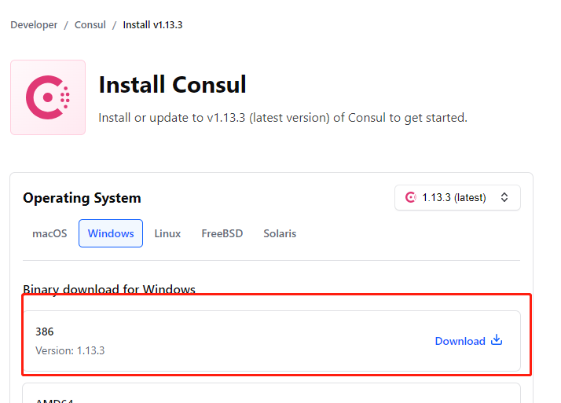
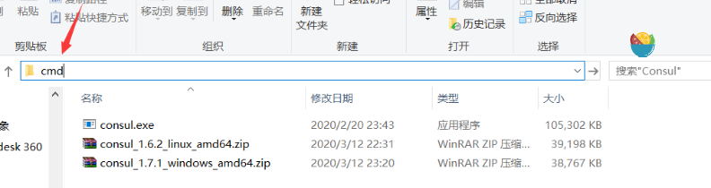
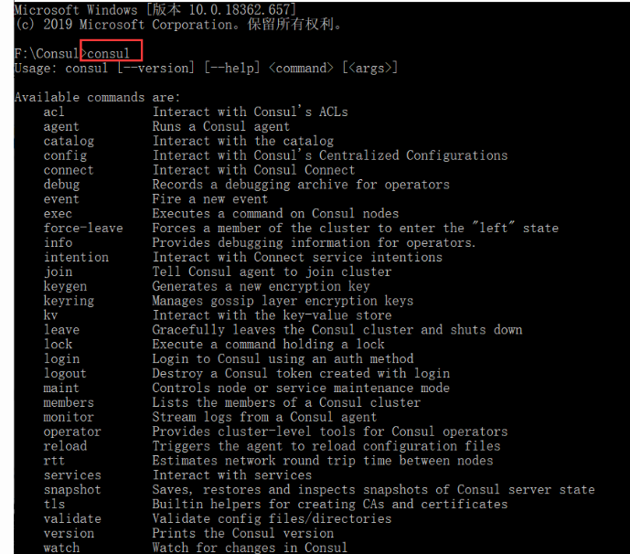
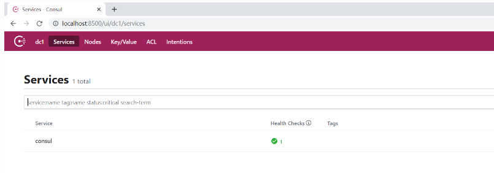
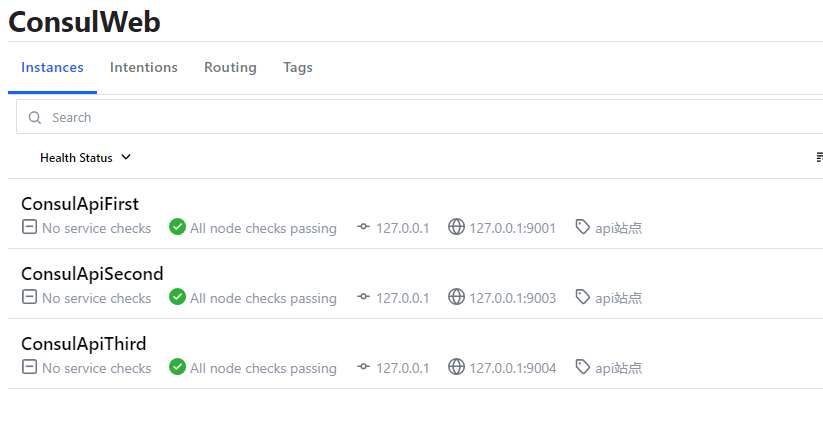
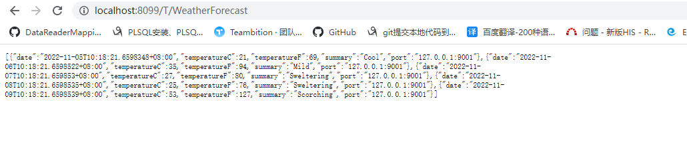
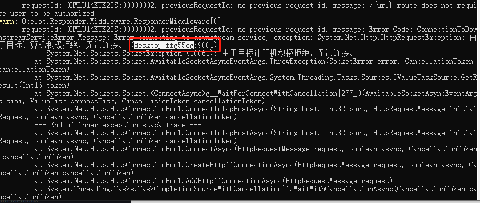
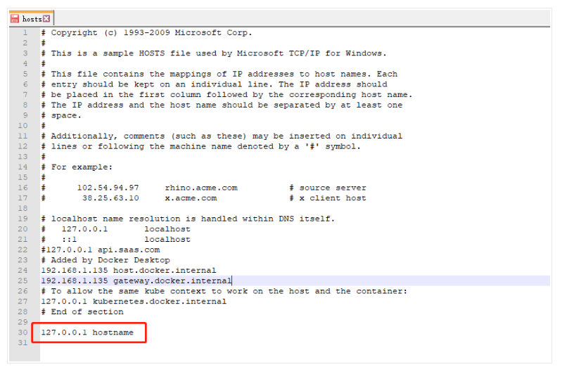

# Consul

## 下载

[Install | Consul | HashiCorp Developer](https://developer.hashicorp.com/consul/downloads)



下载完成后解压，根据自己实际情况选择路径

解压完成后，在解压路径下的地址栏输入“cmd”，打开命令行窗口。并键入“consul”，若出现一连串英文则表示安装成功





## 启动：

命令 consul agent -dev 启动

## 访问

http://localhost:8500



## 服务注册Consul

### 安装Consul包

Nuget搜索Consul

### 中间件

```c#
using Consul;
using Microsoft.AspNetCore.Mvc;

namespace ConsulWebApi.Extensions
{
    public static class AppExtension
    {
        //服务注册
        public static IApplicationBuilder UseConsul(this IApplicationBuilder app, IConfiguration configuration)
        {
            // 获取主机生命周期管理接口
            var lifetime = app.ApplicationServices.GetRequiredService<IHostApplicationLifetime>();

            ConsulClient client = new ConsulClient(c =>
            {
                c.Address = new Uri("http://localhost:8500/");
                c.Datacenter = "dc1";
            });
            var serviceId = "ConsulApi" + configuration["nameback"];
            //服务注册
            string ip = configuration["ip"]; //优先接收变量的值
            string port = configuration["port"]; //优先接收变量的值

            client.Agent.ServiceRegister(new AgentServiceRegistration()
            {
                ID = serviceId, //唯一的
                Name = "ConsulWeb", //服务集群名或组名
                Address = ip, //ip地址
                Port = int.Parse(port), //端口
                Tags = new string[] { "api站点" },//标签
                //Check = new AgentServiceCheck()
                //{
                //    Interval = TimeSpan.FromSeconds(10),//多久检查一次心跳
                //    GRPC = $"{httpContext.HttpContext?.Connection.LocalIpAddress}:{httpContext.HttpContext.Connection.LocalPort}", //gRPC注册特有
                //    GRPCUseTLS = false,//支持http
                //    Timeout = TimeSpan.FromSeconds(5),//超时时间
                //    DeregisterCriticalServiceAfter = TimeSpan.FromSeconds(5) //服务停止多久后注销服务
                //}

            }).Wait();
            //应用程序终止时,注销服务
            lifetime.ApplicationStopping.Register(() =>
            {
                client.Agent.ServiceDeregister(serviceId).Wait();
            });
            return app;
        }
    }
}

```

### Programe.cs注册

```c#
using ConsulWebApi.Extensions;
using Microsoft.Extensions.Configuration;

var builder = WebApplication.CreateBuilder(args);

// Add services to the container.

builder.Services.AddControllers();
// Learn more about configuring Swagger/OpenAPI at https://aka.ms/aspnetcore/swashbuckle
builder.Services.AddEndpointsApiExplorer();

builder.Services.AddCors(options =>
    options.AddPolicy("cors",
        p => p.AllowAnyOrigin().AllowAnyHeader().AllowAnyMethod()));

builder.Services.AddSwaggerGen();
builder.Configuration
    .SetBasePath(Directory.GetCurrentDirectory())
    .AddCommandLine(args)//设置支持命令行参数
    .Build();
//访问地址
builder.WebHost.UseUrls($"http://{builder.Configuration["ip"]}:{builder.Configuration["port"]}");
var app = builder.Build();

// Configure the HTTP request pipeline.
if (app.Environment.IsDevelopment())
{
    app.UseSwagger();
    app.UseSwaggerUI();
}

// 允许所有跨域，cors是在ConfigureServices方法中配置的跨域策略名称
app.UseCors("cors");

//app.UseAuthorization();
app.MapControllers();

//使用Consul中间件
app.UseConsul(builder.Configuration);
app.Run();

```

### 启动服务

需先启动consul再启动服务

```
dotnet ConsulWebApi.dll --url="http://127.0.0.1:9001" --ip="127.0.0.1" --port=9001 --nameback="First"

dotnet ConsulWebApi.dll --url="http://127.0.0.1:9002" --ip="127.0.0.1" --port=9002 --nameback="Second"

dotnet ConsulWebApi.dll --url="http://127.0.0.1:9003" --ip="127.0.0.1" --port=9003 --nameback="Third"
```



# Ocelot网关

1. 新建GateWay网关服务

2. Nuget添加 Ocelot，Ocelot.Provider.Consul包

3. 添加Ocelot的配置文件configuration.json

   ```json
   {
     "Routes": [
       {
         "DownstreamPathTemplate": "/{url}", //服务地址
         "DownstreamScheme": "http",
         "UpstreamPathTemplate": "/T/{url}", //网关地址
         "UpstreamHttpMethod": [ "Post", "Put", "Get" ],
         "UseServiceDiscovery": true,
         "ServiceName": "ConsulWeb", //consul服务名称
         "LoadBalancerOptions": {
           "Type": "RoundRobin" //RoundRobin轮询   LeastConnection-将请求发往最空闲的那个服务器;  NoLoadBalance不负载均衡,总是发往第一个请求或者是服务发现
         }
         //"DownstreamHostAndPorts": [
         //  {
         //    "Host": "localhost",
         //    "Port": 9001
         //  },
         //  {
         //    "Host": "localhost",
         //    "Port": 9002
         //  },
         //  {
         //    "Host": "localhost",
         //    "Port": 9003
         //  }
         //],
         //"QoSOptions": {
         //  "ExceptionsAllowedBeforeBreaking": 3, //允许多少个异常请求
         //  "DurationOfBreak": 10000, // 熔断的时间，单位为ms
         //  "TimeoutValue": 10000 //如果下游请求的处理时间超过多少则自如将请求设置为超时 默认90秒
         //},
         //"DownstreamHttpVersion": "",
         //"AddHeadersToRequest": {},
         //"AddClaimsToRequest": {},
         //"RouteClaimsRequirement": {},
         //"AddQueriesToRequest": {},
         //"RequestIdKey": "",
         //"FileCacheOptions": {
         //  "TtlSeconds": 0,
         //  "Region": ""
         //},
         //"AuthenticationOptions": {
         //  "AuthenticationProviderKey": "",
         //  "AllowedScopes": []
         //},
         //"HttpHandlerOptions": {
         //  "AllowAutoRedirect": true,
         //  "UseCookieContainer": true,
         //  "UseTracing": true,
         //  "MaxConnectionsPerServer": 100 //这控制内部HttpClient将打开多少连接。这可以在路线或全球一级设置。
         //},
         //"DangerousAcceptAnyServerCertificateValidator": false,
         ////路由限流配置
         //"RateLimitOptions": {
         //  "ClientWhitelist": [], //白名单
         //  "EnableRateLimiting": false, //是否启用限流
         //  "Period": "5s", //统计时间段：1s，5m，1h，1d
         //  "PeriodTimespan": 10, //客户端可以重试时间，单位秒
         //  "Limit": 3 //在统计时间段内允许的最大请求数量
         //},
         ////Polly配置
         //"QoSOptions": {
         //  "ExceptionsAllowedBeforeBreaking": 3, //允许多少个异常请求
         //  "DurationOfBreak": 5, //熔断的时间，单位为秒
         //  "TimeoutValue": 6000 //如果下游请求的处理时间超过多少则自动将请求设置为超时
         //},
   
         //"Priority": 0 ,//优先权顺序
   
       }
     ],
     "GlobalConfiguration": {
       //"BaseUrl": "http://127.0.0.1:8099", //网关对外地址
       //"RequestIdKey": "OcRequestId",
       "ServiceDiscoveryProvider": {
         "Host": "localhost",
         "Port": 8500,
         "Type": "Consul" //由Consul提供服务发现
       }
     }
   }

4. 注册Ocelot

   ```c#
   using Ocelot.DependencyInjection;
   using Ocelot.Middleware;
   using Ocelot.Provider.Consul;
   
   var builder = WebApplication.CreateBuilder(args);
   
   builder.Configuration
       .AddJsonFile("configuration.json", optional: false, reloadOnChange: true);
   //Ocelot
   builder.Services
       .AddOcelot().
       AddConsul();
   
   
   //访问地址
   builder.WebHost.UseUrls($"http://{builder.Configuration["ip"]}:{builder.Configuration["port"]}");
   
   var app = builder.Build();
   
   //Ocelot
   app.UseOcelot();//.Wait()
   
   
   app.MapControllers();
   
   app.Run();
   
   ```

5. 启动服务,通过网关服务配置文件配置的地址访问api接口服务

   ```
   dotnet OcelotForWeatherApp.dll --url="http://127.0.0.1:8099" --ip="127.0.0.1" --port="8099"
   ```

   

# 问题

### Ocelot配置文件

Ocelot版本在16.0.0之前的配置文件最外层节点的Routes应改为ReRoutes

## 接口访问返回502

详细异常如下：



**成因**:造成这的问题是,consul支持SSL认证加入的处理。如果有node，下游地址使用node.name

### 解决方案

**第一种:**在启动consul的时候,node参数可以写成 -node=127.0.0.1
如:consul agent -server -ui -bootstrap-expect=1 -data-dir=d:\consul -node=127.0.0.1 -client=0.0.0.0 -bind=127.0.0.1 -datacenter=dc1 -join 127.0.0.1或者consul agent -dev -node=127.0.0.1

**第二种:**在启动consul的时候,node参数可写成"hostname",在Hosts文件中对,node参数添加dns解析.
consul agent -server -ui -bootstrap-expect=1 -data-dir=d:\consul -node=hostname -client=0.0.0.0 -bind=127.0.0.1 -datacenter=dc1 -join 127.0.0.1,hosts文件位置:C:\System32\drivers\etc，在hosts文件中添加一行"127.0.0.1 hostname"即可



