## 基于Docker安装

查找RabbitMQ镜像

```undefined
docker search rabbitmq
```

拉取RabbitMQ镜像

```css
docker pull rabbitmq (镜像未配有管理页面)
docker pull rabbitmq:management (镜像配有管理页面)
```

安装 RabbitMQ

```go
docker run -d --name rabbitmq -p 5672:5672 -p 15672:15672 -e RABBITMQ_DEFAULT_USER=admin -e RABBITMQ_DEFAULT_PASS=wa rabbitmq:management
```

停止 RabbitMQ 容器

```undefined
  docker stop rabbitmq
```

启动 RabbitMQ 容器

```undefined
  docker start rabbitmq
```

重启 RabbitMQ 容器

```undefined
  docker restart rabbitmq
```

查看 RabbitMQ 容器进程信息

```undefined
  docker top rabbitmq
```

## Docker中搭建RabbitMQ集群

### 1、拉取镜像

``` powershell
PS C:\Users\Administrator> docker pull rabbitmq:management
```

### 2、运行容器

``` powershell
PS C:\Users\Administrator> docker run -d --hostname rabbit1 --name myrabbit1 -p 15672:15672 -p 5672:5672 -e RABBITMQ_ERLANG_COOKIE='rabbitmq_cookie' rabbitmq:management
PS C:\Users\Administrator> docker run -d --hostname rabbit2 --name myrabbit2 -p 5673:5672 --link myrabbit1:rabbit1 -e RABBITMQ_ERLANG_COOKIE='rabbitmq_cookie' rabbitmq:management
PS C:\Users\Administrator> docker run -d --hostname rabbit3 --name myrabbit3 -p 5674:5672 --link myrabbit1:rabbit1 --link myrabbit2:rabbit2 -e RABBITMQ_ERLANG_COOKIE='rabbitmq_cookie' rabbitmq:management
```

-p 15672:15672 management 界面管理访问端口
-p 5672:5672 amqp 访问端口
--link 容器之间连接
Erlang Cookie 值必须相同，也就是一个集群内 RABBITMQ_ERLANG_COOKIE 参数的值必须相同。因为 RabbitMQ 是用Erlang实现的，Erlang Cookie 相当于不同节点之间通讯的密钥，Erlang节点通过交换 Erlang Cookie 获得认证。

### 3、加入节点到集群

#### 设置节点1

``` powershell
PS C:\Users\Administrator> docker exec -it myrabbit1 bash
root@rabbit1:/# rabbitmqctl stop_app
root@rabbit1:/# rabbitmqctl reset
root@rabbit1:/# rabbitmqctl start_app
root@rabbit1:/# exit
```


#### 设置节点2

``` powershell
PS C:\Users\Administrator> docker exec -it myrabbit2 bash
root@rabbit2:/# rabbitmqctl stop_app
root@rabbit2:/# rabbitmqctl reset
root@rabbit2:/# rabbitmqctl join_cluster --ram rabbit@rabbit1
root@rabbit2:/# rabbitmqctl start_app
root@rabbit2:/# exit
```


#### 设置节点3

``` powershell
PS C:\Users\Administrator> docker exec -it myrabbit3 bash
root@rabbit2:/# rabbitmqctl stop_app
root@rabbit2:/# rabbitmqctl reset
root@rabbit2:/# rabbitmqctl join_cluster --ram rabbit@rabbit1
root@rabbit2:/# rabbitmqctl start_app
root@rabbit2:/# exit
```


**主要参数：**

--ram 表示设置为内存节点，忽略参数默认为磁盘节点。该配置启动了3个节点，1个磁盘节点和2个内存节点。

设置好之后，使用http://物理机ip:15672 进行访问了，默认账号密码是guest/guest

启动了3个节点，1个磁盘节点和2个内存节点


可以看到有很多节点

### RabbitMQ镜像集群部署

#### 策略policy概念

使用RabbitMQ镜像功能，需要基于RabbitMQ策略来实现，策略policy是用来控制和修改群集范围的某个vhost队列行为和Exchange行为。策略policy就是要设置哪些Exchange或者queue的数据需要复制、同步，以及如何复制同步。

为了使队列成为镜像队列，需要创建一个策略来匹配队列，设置策略有两个键“ha-mode和 ha-params（可选）”。ha-params根据ha-mode设置不同的值，下表说明这些key的选项。


#### 添加策略

``` powershell
PS C:\Users\Administrator> docker exec -it myrabbit1 bash
root@rabbit1:/# rabbitmqctl set_policy ha-all "^" '{"ha-mode":"all"}'
```

#### 查看效果

此策略会同步所在同一VHost中的交换器和队列数据。设置好policy之后，使用 http://ip:15672 再次进行访问，可以看到队列镜像同步。


## Windows安装

### 安装ErLang环境

下载地址：http://www.erlang.org/downloads 

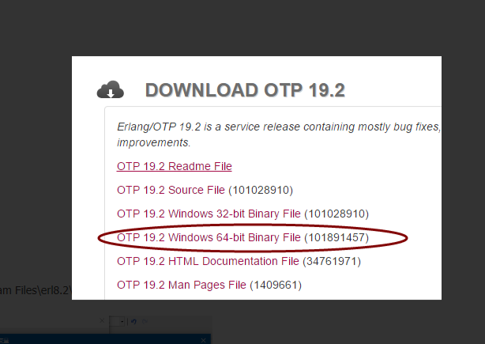

设置环境变量

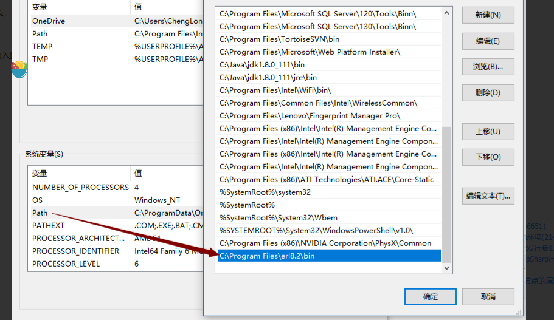

检查Erlang是否安装成功,打开 cmd ,输入 erl 后回车，如果看到如下的信息，表明安装成功

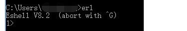

### 安装RabbitMQ服务端

[Messaging that just works — RabbitMQ](https://www.rabbitmq.com/#getstarted)

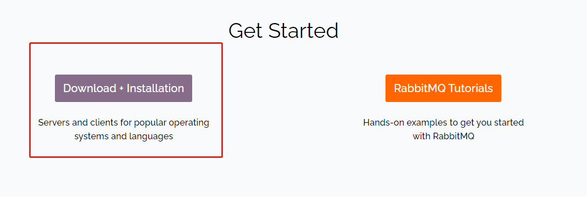

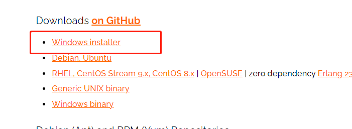

安装完之后

运行cmd，进入rabbitMQ服务安装目录的sbin目录下，运行如下三条命令：

```text
rabbitmq-service install
rabbitmq-service enable
rabbitmq-service start
```

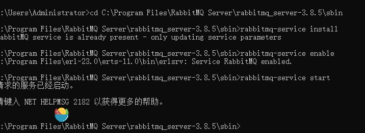

假如显示node没有连接上，需要到C:\Windows目录下，将.erlang.cookie文件，拷贝到用户目录下 C:\Users\{用户名}，这是Erlang的Cookie文件，允许与Erlang进行交互。

**使用命令查看用户：**

```text
rabbitmqctl list_users
```

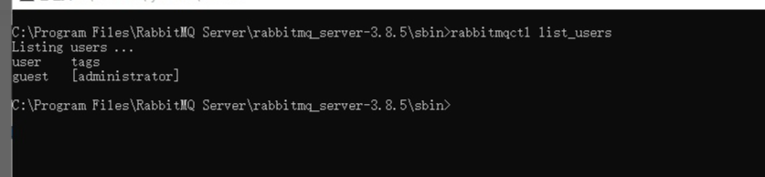

RabbitMQ会为我们创建默认的用户名guest和密码guest，guest默认拥有RabbitMQ的所有权限。

　　一般的，我们需要新建一个我们自己的用户，设置密码，并授予权限，并将其设置为管理员，可以使用下面的命令来执行这一操作：

```text
rabbitmqctl  add_user  admin wang0705   //创建用户admin密码为wang0705
rabbitmqctl  set_permissions  admin ".*"  ".*"  ".*"    //赋予admin读写所有消息队列的权限
rabbitmqctl  set_user_tags admin administrator    //分配用户组
```

**修改admin密码为123：**

```text
 rabbitmqctl change_password admin 123
```

**删除用户admin：**

```text
 rabbitmqctl delete_user  admin
```

### RabbitMQ客户端

使用客户端dll写代码

### RabbitMQ-Management

rabbitmq提供了一个图形的管理界面，用于管理、监控rabbitmq的运行情况，它是以插件的形式提供的，如果要启用需要启用插件

同样启动cmd，进入rabbitMQ服务安装目录的sbin目录下，运行如下命令

```text
rabbitmq-plugins enable rabbitmq_management
```

然后重启服务（右键点击重启）

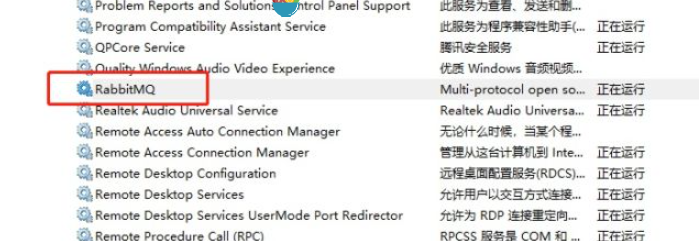

rabbitmq_management默认地址为：127.0.0.1:15672

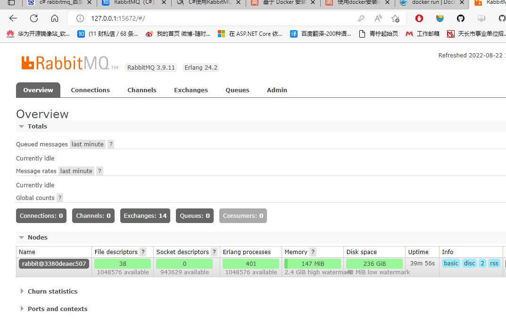

## Ubuntu安装

### 安装erlang[#](https://www.cnblogs.com/FleetingAstral/p/16025737.html#安装erlang)

由于RabbitMq需要erlang语言的支持，在安装RabbitMq之前需要安装erlang

```
sudo apt-get install erlang-nox  //sudo apt-get install erlang -y
```

### 安装RabbitMq[#](https://www.cnblogs.com/FleetingAstral/p/16025737.html#安装rabbitmq)

1. 更新源
   `sudo apt-get update`

2. 安装

   `sudo apt-get install rabbitmq-server`

3. 以应用方式

```Bash
sudo rabbitmq-server         # 启动
sudo rabbitmqctl stop       # 停止
sudo rabbitmqctl status     # 查看状态
```

1. 以服务方式启动（安装完之后在任务管理器中服务一栏能看到RabbtiMq）

```Bash
sudo rabbitmq-service install        # 安装服务
sudo rabbitmq-service start          # 开始服务
sudo rabbitmq-service stop           # 停止服务
sudo rabbitmq-service enable         # 使服务有效
sudo rabbitmq-service disable        # 使服务无效
sudo rabbitmq-service help           # 帮助
# 当rabbitmq-service install之后默认服务是enable的，如果这时设置服务为disable的话，rabbitmq-service start就会报错。
# 当rabbitmq-service start正常启动服务之后，使用disable是没有效果的
sudo rabbitmqctl stop                # 关闭服务
```

1. RabbitMq 管理插件启动，可视化界面

```Bash
sudo rabbitmq-plugins enable rabbitmq_management       # 启动
sudo rabbitmq-plugins disable rabbitmq_management      # 关闭
```

1. RabbitMq节点管理方式

```Bash
rabbitmqctl
```

### 添加admin，并赋予administrator权限[#](https://www.cnblogs.com/FleetingAstral/p/16025737.html#添加admin并赋予administrator权限)

1. 添加admin用户，密码设置为wang0705

   `sudo rabbitmqctl add_user admin wang0705`

2. 赋予权限

   `sudo rabbitmqctl set_user_tags admin administrator`

3. 赋予virtual host中所有资源的配置、写、读权限以便管理其中的资源

   `sudo rabbitmqctl set_permissions -p / admin '.`*`' '.`*`' '.*'`

### 设置开机自启动

1. 编辑service文件

> vim /lib/systemd/system/**rabbitmq-server.service**

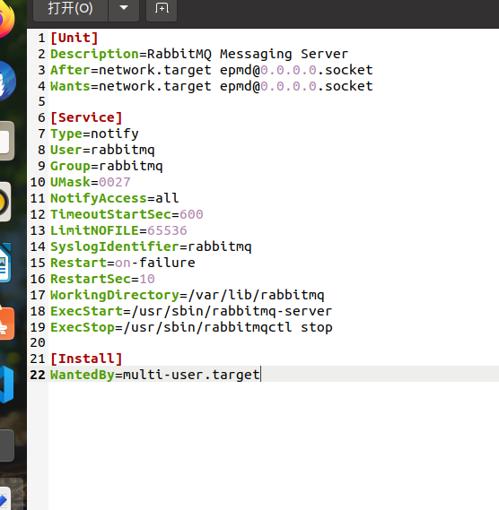

2. 设置开机启动

> systemctl enable rabbitmq-server.service

## RabbitMQ使用

### API文档

[Namespace RabbitMQ.Client](https://rabbitmq.github.io/rabbitmq-dotnet-client/api/RabbitMQ.Client.html)

### 工作队列


#### 轮循机制调度

默认情况下，RabbitMQ 将按顺序将每条消息发送给下一个使用者。平均而言，每个消费者将获得相同数量的消息。这种分发消息的方式称为轮循机制。

> 改变权重

```c#
//MQ不再对消费者一次发送多个请求，而是等消费者处理完(channel.BasicAck(ea.DeliveryTag,false);)一个消息后再从队列中获取一个新的消息
channel.BasicQos(0, 1, false);
```

#### 消息确认

RabbitMQ 支持[消息*确认*](https://www.rabbitmq.com/confirms.html)。ack（nowledgement）由消费者发回，告诉RabbitMQ已经收到，处理了一条特定的消息，并且RabbitMQ可以自由地删除它。

如果使用者在没有发送 ack 的情况下死亡（其通道已关闭、连接已关闭或 TCP 连接丢失），则 RabbitMQ 将了解消息未完全处理，并将重新排队。如果同时有其他消费者在线，它将迅速将其重新交付给另一个消费者。

```c#
 //false表示只确认签收当前的消息，true表示签收该消费者所有未签收的消息
 channel.BasicAck(ea.DeliveryTag, false);

/*
 * 从MQ服务中获取数据
 * 创建一个消费者
 * queue:队列名
 * autoAck:是否自动确认收到消息,false表示手动确认,默认false
 * 要传入的IBasicConsumer接口
 */
channel.BasicConsume("BuyTrainTicket", false, consumer);
```

#### 消息持久化

```c#
/*
 * 声明并创建队列，如果队列已存在则使用这个队列
 * QueueHello:队列名称ID
 * durable:是否持久化,false表示不会持久化,MQ服务停掉数据会丢失
 * exclusive:是否队列私有化,false表示所有消费者都可以访问,true表示只有第一次使用它的消费者才可以一直使用
 * autoDelete:是否自动删除,false表示MQ停掉之后不自动删除这个队列
 * arguements:其他参数
 */
channel.QueueDeclare("QueueHello", false, false, false, null);//创建一个名称为hello的消息队列
```

### 发布订阅模式

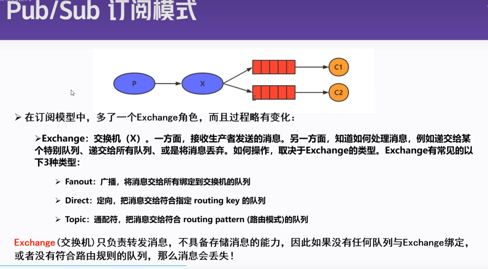

### 路由模式

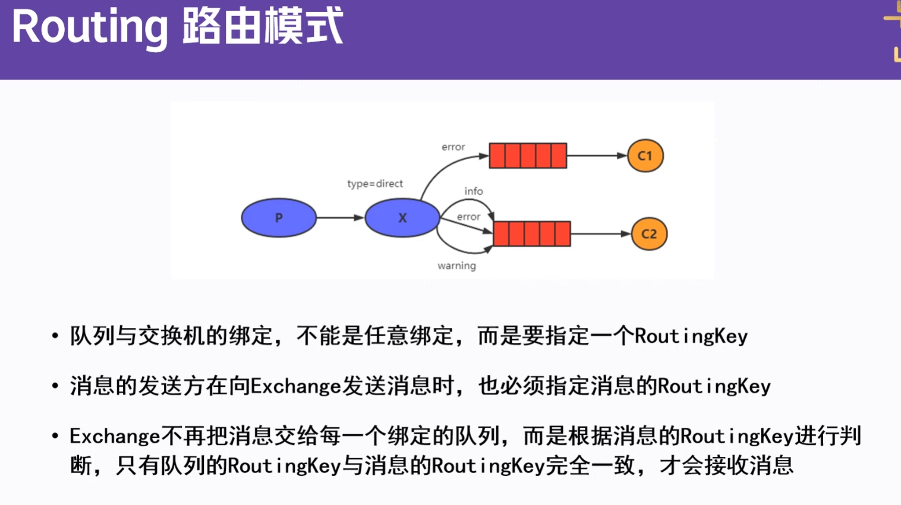

### 主题模式

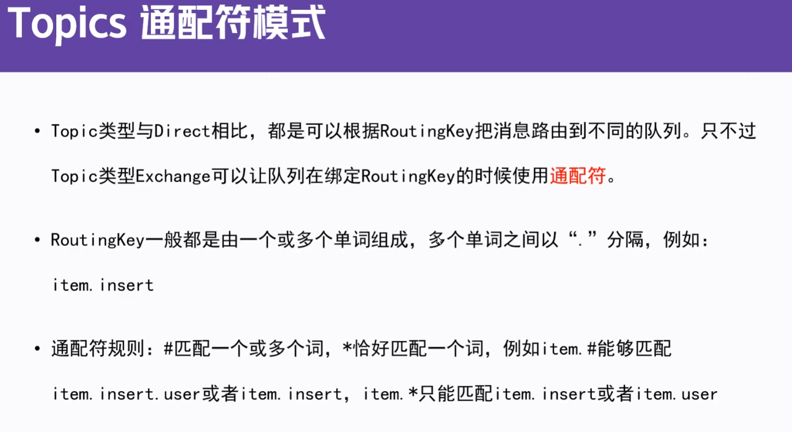

### 设置TTL（延时队列）

#### 在申明队列时设置

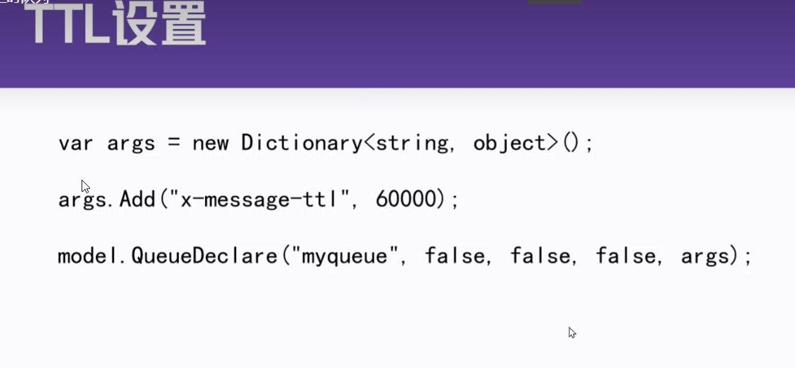

#### 给每条消息单独设置TTL

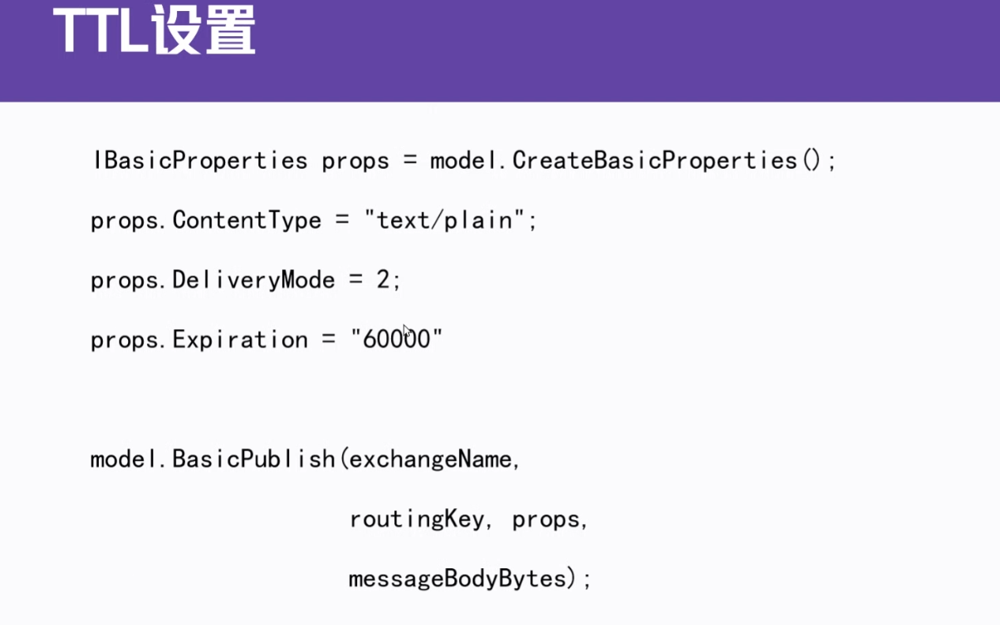

### 死信队列

> 在设置TTL的时间内没有被消费的消息会成为死信消息

```c#
//配置死信交换机
props = new Dictionary<string, object>()
                {
                    {"x-dead-letter-exchange", RabbitConstant.DEAD_LETTER_EXCHANGE},
                    {"x-dead-letter-routing-key", RabbitConstant.DEAD_LETTER_ROUTING_KEY}
                },
model.QueueDeclare(queue, true, false, false, props);
```

