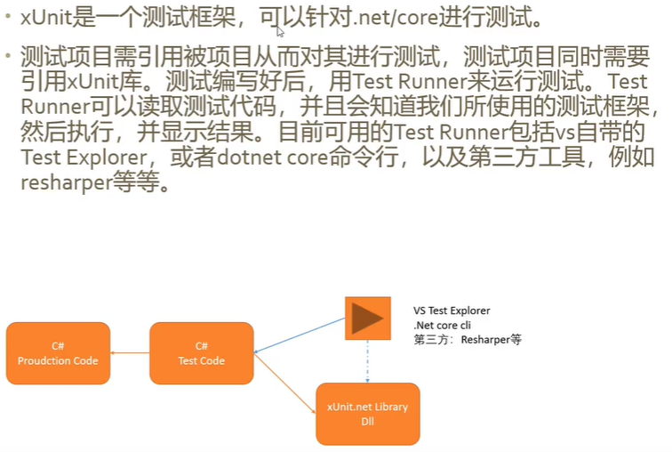
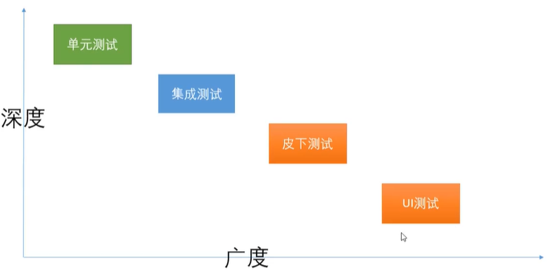
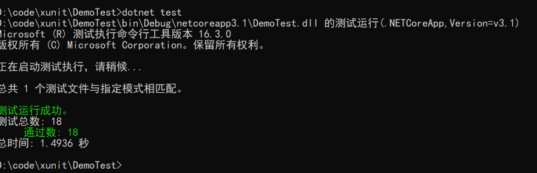
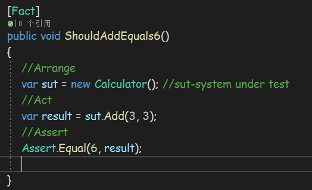
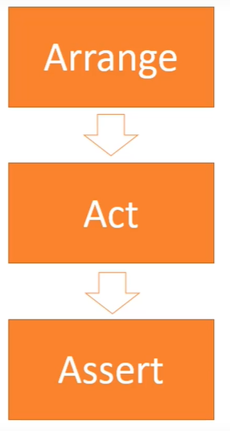
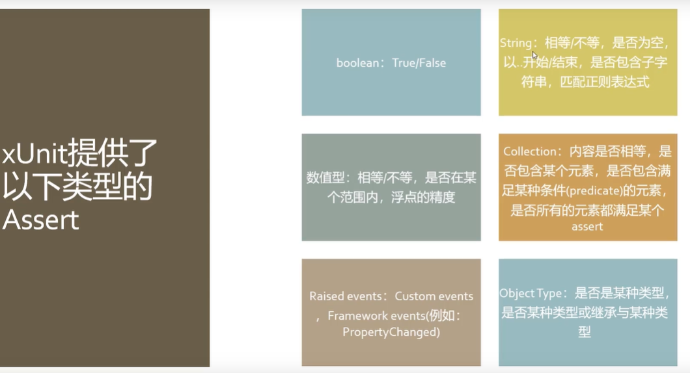
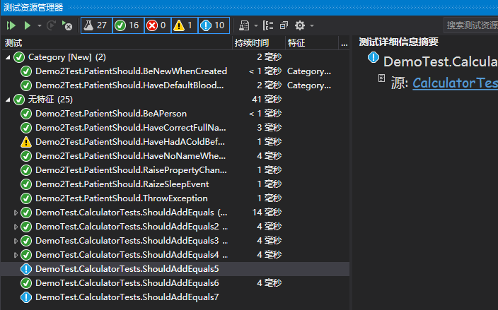

# xUnit总结

## 什么是xUnit[#](https://www.cnblogs.com/AlexanderZhao/p/12369732.html#1140722515)

xUnit.net是针对.NET Framework的免费，开源，以社区为中心的单元测试工具。



## 自动化测试的优点[#](https://www.cnblogs.com/AlexanderZhao/p/12369732.html#3584388098)

- 可以频繁的进行测试
- 可以在任何时间进行测试，也可以按计划定时进行，例如：可以在半夜进行自动化测试
- 比人工测试速度快
- 可以更快速地发现错误
- 基本上是非常可靠的
- 测试代码与生产代码紧密结合
- 使得开发团队更具有幸福感

## 自动化测试的分类[#](https://www.cnblogs.com/AlexanderZhao/p/12369732.html#2850072399)

单元测试可以测试某个类或方法，具有较高的深度,对应用的功能覆盖面很小。
集成测试有更好的广度，可以测试web资源，数据库资源等。
皮下测试在web中针对controller下的节点测试。
UI测试是对应用的界面功能测试。
实际上常用的是单元测试和集成测试。



## 是测试行为还是测试私有方法[#](https://www.cnblogs.com/AlexanderZhao/p/12369732.html#3410002173)

一般是针对类的Public方法进行测试，也就是对行为进行测试，如果是私有方法需要改变修饰符才能测试

## xUnit.Net特点：[#](https://www.cnblogs.com/AlexanderZhao/p/12369732.html#3665666844)

- 支持多平台/运行时
- 并行测试
- 数据驱动测试
- 可扩展

## xUnit支持的平台：[#](https://www.cnblogs.com/AlexanderZhao/p/12369732.html#125913464)

.Net Framework
.Net Core
.Net Standard
UWP
Xamarin

官网：
[https://xunit.net](https://xunit.net/)

## 测试工具：[#](https://www.cnblogs.com/AlexanderZhao/p/12369732.html#3656208954)

```
VS自带的测试浏览器（右键测试或者ctrl+r,t）
resharper,
cmd命令行(.net cli)： 
	dotnet test
		dotnet test --help
```

## 简单的例子[#](https://www.cnblogs.com/AlexanderZhao/p/12369732.html#1632208118)

1.  在VS中创建一个解决方案，再创建一个.net core类库:Demo，添加一个Calculator类：

```c#
namespace Demo
{
    public class Calculator
    {
        public int Add(int x,int y)
        {
            return x + y;
        }
    }
}
```

2. 在同一解决方案，创建一个xUnit测试项目：DemoTest,针对项目测试，一般是项目名+Test命名测试项目。创建一个类：CalculatorTests

```c#
public class CalculatorTests
{
	[Fact]
	public void ShouldAddEquals5() //注意命名规范
	{
	    //Arrange
	    var sut = new Calculator(); //sut-system under test，通用命名
	    //Act
	    var result = sut.Add(3, 2);
	    //Assert
	    Assert.Equal(5, result);

	}
}
```

3. 运行测试(任意一种方法)：

- 通过vs自带的测试资源管理器，找到测试项目，选择运行；


- 通过在ShouldAddEquals5方法上，右键选择运行测试或者快捷键(ctrl+r,t)
- 通过cmd,在测试项目目录运行dotnet test



## 测试的三个阶段：AAA[#](https://www.cnblogs.com/AlexanderZhao/p/12369732.html#2160948971)

> Arrange: 在这里做一些先决的设定。例如创建对象实例，数据，输入等。
> Act: 在这里执行生产代码并返回结果。例如调用方法或者设置属性。
> Assert:在这里检查结果，会产生测试通过或者失败两种结果。





# Assert

Assert基于代码的返回值、对象的最终状态、事件是否发生等情况来评估测试的结果
Assert的结果可能是Pass或者Fail
如果所有的asserts都通过了，那么整个测试就通过了。
如果任何assert 失败了，那么结果就失败了。

一个test里应该有多少个asserts

1. 一种简易的做法是，每个test方法里面只有一个assert.
2. 而还有一种建议就是，每个test里面可以有多个asserts，只要这些asserts都是针对同一个行为。
   xUnit提供了以下类型的Assert:



## Assert方法应用[#](https://www.cnblogs.com/AlexanderZhao/p/12369732.html#1503813260)

演示示例：
先建一个.net core类库项目,再建立一个xunit测试项目(参考最后综合示例)

### Assert.True,Assert.False[#](https://www.cnblogs.com/AlexanderZhao/p/12369732.html#4075891671)

```c#
[Fact]
[Trait("Category","New")]
public void BeNewWhenCreated()
{
    _output.WriteLine("第一个测试");
    // Arrange
    var patient = new Patient();
    // Act
    var result = patient.IsNew;
    // Assert
    Assert.True(result);
}
```

### 字符串结果测试：Assert.Equal[#](https://www.cnblogs.com/AlexanderZhao/p/12369732.html#1726116125)

```c#
[Fact]
public void HaveCorrectFullName()
{
    //var patient = new Patient();
    _patient.FirstName = "Nick";
    _patient.LastName = "Carter";
    var fullName = _patient.FullName;
    Assert.Equal("Nick Carter", fullName); //相等
    Assert.StartsWith("Nick", fullName);//以开头
    Assert.EndsWith("Carter", fullName);//以结尾
    Assert.Contains("Carter", fullName);//包含
    Assert.Contains("Car", fullName);
    Assert.NotEqual("CAR", fullName);//不相等
    Assert.Matches(@"^[A-Z][a-z]*\s[A-Z][a-z]*", fullName);//正则表达式
}
```

### 数字结果测试[#](https://www.cnblogs.com/AlexanderZhao/p/12369732.html#809373217)

```c#
[Fact]
[Trait("Category", "New")]
public void HaveDefaultBloodSugarWhenCreated()
{
    var p = new Patient();
    var bloodSugar = p.BloodSugar;
    Assert.Equal(4.9f, bloodSugar,5); //判断是否相等
    Assert.InRange(bloodSugar, 3.9, 6.1);//判断是否在某一范围内
}
```

### 判断null，not null[#](https://www.cnblogs.com/AlexanderZhao/p/12369732.html#1619661122)

```c#
[Fact]
public void HaveNoNameWhenCreated()
{
    var p = new Patient();
    Assert.Null(p.FirstName);
    Assert.NotNull(_patient);
}
```

### 集合测试[#](https://www.cnblogs.com/AlexanderZhao/p/12369732.html#3223230281)

```c#
[Fact]
public void HaveHadAColdBefore()
{
	//Arrange
    var _patient = new Patient();
    
	//Act
	var diseases = new List<string>
    {
        "感冒",
        "发烧",
        "水痘",
        "腹泻"
    };
    _patient.History.Add("发烧");
    _patient.History.Add("感冒");
    _patient.History.Add("水痘");
    _patient.History.Add("腹泻");
    
	//Assert
	//判断集合是否含有或者不含有某个元素
    Assert.Contains("感冒",_patient.History);
    Assert.DoesNotContain("心脏病", _patient.History);

    //判断p.History至少有一个元素，该元素以水开头
    Assert.Contains(_patient.History, x => x.StartsWith("水"));
	//判断集合的长度
    Assert.All(_patient.History, x => Assert.True(x.Length >= 2));

    //判断集合是否相等,这里测试通过，说明是比较集合元素的值，而不是比较引用
    Assert.Equal(diseases, _patient.History);

}
```

### 测试对象[#](https://www.cnblogs.com/AlexanderZhao/p/12369732.html#791826937)

```c#
/// <summary>
/// 测试Object
/// </summary>
[Fact]
public void BeAPerson()
{
    var p = new Patient();
    var p2 = new Patient();
    Assert.IsNotType<Person>(p); //测试对象是否相等，注意这里为false
    Assert.IsType<Patient>(p);

    Assert.IsAssignableFrom<Person>(p);//判断对象是否继承自Person,true

    //判断是否为同一个实例
    Assert.NotSame(p, p2);
    //Assert.Same(p, p2);

}
```

### 判断是否发生异常[#](https://www.cnblogs.com/AlexanderZhao/p/12369732.html#2279092866)

```c#
/// <summary>
/// 判断是否发生异常
/// </summary>
[Fact]
public void ThrowException() //注意不能使用ctrl+R,T快捷键,因为会中断测试，抛出异常
{
    var p = new Patient();
    //判断是否返回指定类型的异常
    var ex = Assert.Throws<InvalidOperationException>(()=> { p.NotAllowed(); });
    //判断异常信息是否相等
    Assert.Equal("not able to create", ex.Message);
}
```

### 判断是否触发事件[#](https://www.cnblogs.com/AlexanderZhao/p/12369732.html#3341209431)

```c#
/// <summary>
/// 判断是否触发事件
/// </summary>
[Fact]
public void RaizeSleepEvent()
{
    var p = new Patient();
    Assert.Raises<EventArgs>(
        handler=>p.PatientSlept+=handler,
        handler=>p.PatientSlept -= handler,
        () => p.Sleep());
}
```

### 判断属性改变是否触发事件[#](https://www.cnblogs.com/AlexanderZhao/p/12369732.html#1409738134)

```c#
/// <summary>
/// 测试属性改变事件是否触发
/// </summary>
[Fact]
public void RaisePropertyChangedEvent()
{
    var p = new Patient();
    Assert.PropertyChanged(p, nameof(p.HeartBeatRate),
                           () => p.IncreaseHeartBeatRate());
}
```

# 分组、忽略、log、共享上下文

## 测试分组[#](https://www.cnblogs.com/AlexanderZhao/p/12369732.html#508658880)

使用trait特性，对测试进行分组：[Trait("Name","Value")] 可以作用于方法级和Class级别
相同的分组使用相同的特性。

```c#
[Fact]
[Trait("Category","New")]
public void BeNewWhenCreated()
{
    _output.WriteLine("第一个测试");
    // Arrange
    //var patient = new Patient();
    // Act
    var result = _patient.IsNew;
    // Assert
    Assert.True(result);
    //Assert.False(result);
}
```

测试分组搜索： 可以在测试资源管理器中按分组排列、搜索、运行测试



在dotnet cli中分组测试：

```bash
Copydotnew test --filter “Category=New” //运行单个分类测试
dotnew test --filter “Category=New|Category=Add”//运行多个分类测试
dotnet test --filter Category --logger:trx //输出测试日志
```

## 忽略测试[#](https://www.cnblogs.com/AlexanderZhao/p/12369732.html#2795746939)

使用特性：[Fact(Skip="不跑这个测试")]，可以忽略测试，忽略测试图标为黄色警告

## 自定义测试输出内容[#](https://www.cnblogs.com/AlexanderZhao/p/12369732.html#559202009)

使用ITestOutputHelper可以自定义在测试时的输出内容
dotnet test --filter Category --logger:trx会输出测试日志trx结尾的文件

```c#
public class PatientShould:IClassFixture<LongTimeFixture>,IDisposable
{
    private readonly ITestOutputHelper _output;
    private readonly Patient _patient;
    private readonly LongTimeTask _task;
    public PatientShould(ITestOutputHelper output,LongTimeFixture fixture)
    {
        this._output = output;
        _patient = new Patient();
        //_task = new LongTimeTask();
        _task = fixture.Task;
    }

    [Fact]
    [Trait("Category","New")]
    public void BeNewWhenCreated()
    {
        _output.WriteLine("第一个测试");
        // Arrange
        //var patient = new Patient();
        // Act
        var result = _patient.IsNew;
        // Assert
        Assert.True(result);
        //Assert.False(result);
    }
}
```

## 减少重复代码[#](https://www.cnblogs.com/AlexanderZhao/p/12369732.html#2519238285)

1. 减少new对象，可以在构造函数中new，在方法中使用。
2. 测试类实现IDispose接口，测试完释放资源，注意每个测试结束后都会调用Dispose方法。

## 共享上下文[#](https://www.cnblogs.com/AlexanderZhao/p/12369732.html#1242990312)

### 同一个测试类[#](https://www.cnblogs.com/AlexanderZhao/p/12369732.html#2118890199)

在执行一个方法时，需要很长事件，而在构造函数中new时，每个测试跑的时候都会new对象或者执行方法，这是导致测试很慢。解决方法：

1. 创建一个类：

```c#
using Demo2;
using System;

namespace Demo2Test
{
    public class LongTimeFixture : IDisposable
    {
        public LongTimeTask Task { get; }
        public LongTimeFixture()
        {

        }
        public void Dispose()
        {
        }
    }
}
```

2. 测试类实现IClassFixture<LongTimeFixture>接口,并在构造函数中获取方法

```c#
public class PatientShould:IClassFixture<LongTimeFixture>,IDisposable
{
    private readonly ITestOutputHelper _output;
    private readonly Patient _patient;
    private readonly LongTimeTask _task;
    public PatientShould(ITestOutputHelper output,LongTimeFixture fixture)
    {
        this._output = output;
        _patient = new Patient();
        //_task = new LongTimeTask();
        _task = fixture.Task;//获取方法
    }
}
```

### 不同的测试类[#](https://www.cnblogs.com/AlexanderZhao/p/12369732.html#3711498043)

1.在上一个的继承上，先建立一个TaskCollection类，实现ICollectionFixture<LongTimeFixture>接口，注意不能有副作用，否则会影响结果

```c#
using Xunit;

namespace Demo2Test
{
    [CollectionDefinition("Lone Time Task Collection")]
    public class TaskCollection:ICollectionFixture<LongTimeFixture>
    {
    }
}
```

1. 使用，加上[Collection("Lone Time Task Collection")]

```c#
[Collection("Lone Time Task Collection")]
public class PatientShould:IClassFixture<LongTimeFixture>,IDisposable
{
    private readonly ITestOutputHelper _output;
    private readonly Patient _patient;
    private readonly LongTimeTask _task;
    public PatientShould(ITestOutputHelper output,LongTimeFixture fixture)
    {
        this._output = output;
        _patient = new Patient();
        //_task = new LongTimeTask();
        _task = fixture.Task;//获取方法
    }
}
```

------

# 数据共享

## 1. 使用[Theory]，可以写有构造参数的测试方法,使用InlineData传递数据[#](https://www.cnblogs.com/AlexanderZhao/p/12369732.html#334426475)

```c#
[Theory]
[InlineData(1,2,3)]
[InlineData(2,2,4)]
[InlineData(3,3,6)]
public void ShouldAddEquals(int operand1,int operand2,int expected)
{
    //Arrange
    var sut = new Calculator(); //sut-system under test
    //Act
    var result = sut.Add(operand1, operand2);
    //Assert
    Assert.Equal(expected, result);
}
```

## 2. 使用[MemberData]特性,可以在多个测试中使用[#](https://www.cnblogs.com/AlexanderZhao/p/12369732.html#3607999296)

1. 先添加CalculatorTestData类：

```c#
using System.Collections.Generic;

namespace DemoTest
{
    public  class CalculatorTestData
    {
        private static readonly List<object[]> Data = new List<object[]>
        {
            new object[]{ 1,2,3},
            new object[]{ 1,3,4},
            new object[]{ 2,4,6},
            new object[]{ 0,1,1},
        };

        public static IEnumerable<object[]> TestData => Data;
    }
}
```

2. 使用MemberData

```c#
/// <summary>
/// 数据共享-MemberData
/// </summary>
/// <param name="operand1"></param>
/// <param name="operand2"></param>
/// <param name="expected"></param>
[Theory]
[MemberData(nameof(CalculatorTestData.TestData),MemberType =typeof(CalculatorTestData))]
public void ShouldAddEquals2(int operand1, int operand2, int expected)
{
    //Arrange
    var sut = new Calculator(); //sut-system under test
    //Act
    var result = sut.Add(operand1, operand2);
    //Assert
    Assert.Equal(expected, result);
}
```

## 3. 使用外部数据[#](https://www.cnblogs.com/AlexanderZhao/p/12369732.html#2069414838)

1. 先创建一个类，准备数据,这里是读取的csv文件的数据

```c#
using System.Collections.Generic;
using System.IO;
using System.Linq;

namespace DemoTest.Data
{
    /// <summary>
    /// 读取文件并返回数据集合
    /// </summary>
    public class CalculatorCsvData
    {
        public static IEnumerable<object[]> TestData
        {
            get
            {
	            //把csv文件中的数据读出来，转换
                string[] csvLines = File.ReadAllLines("Data\\TestData.csv");
                var testCases = new List<object[]>();
                foreach (var csvLine in csvLines)
                {
                    IEnumerable<int> values = csvLine.Trim().Split(',').Select(int.Parse);
                    object[] testCase = values.Cast<object>().ToArray();
                    testCases.Add(testCase);
                }
                return testCases;
            }
        }
    }
}
```

1. csv数据

```
1,2,3
1,3,4
2,4,6
0,1,1
```

1. 使用

```c#
/// <summary>
/// 数据共享-MemberData-外部数据
/// </summary>
/// <param name="operand1"></param>
/// <param name="operand2"></param>
/// <param name="expected"></param>
[Theory]
[MemberData(nameof(CalculatorCsvData.TestData), MemberType = typeof(CalculatorCsvData))]
public void ShouldAddEquals3(int operand1, int operand2, int expected)
{
    //Arrange
    var sut = new Calculator(); //sut-system under test
    //Act
    var result = sut.Add(operand1, operand2);
    //Assert
    Assert.Equal(expected, result);
}
```

## 4. 使用自定义特性，继承自DataAttribute[#](https://www.cnblogs.com/AlexanderZhao/p/12369732.html#1275187537)

1. 自定义特性

```c#
Copyusing System.Collections.Generic;
using System.Reflection;
using Xunit.Sdk;

namespace DemoTest.Data
{
    public class CalculatorDataAttribute : DataAttribute
    {
        public override IEnumerable<object[]> GetData(MethodInfo testMethod)
        {
            yield return new object[] { 0, 100, 100 };
            yield return new object[] { 1, 99, 100 };
            yield return new object[] { 2, 98, 100 };
            yield return new object[] { 3, 97, 100 };
        }
    }
}
```

2. 使用

```c#
/// <summary>
/// 数据共享-自定义特性继承自DataAttribute
/// </summary>
/// <param name="operand1"></param>
/// <param name="operand2"></param>
/// <param name="expected"></param>
[Theory]
[CalculatorDataAttribute]
public void ShouldAddEquals4(int operand1, int operand2, int expected)
{
    //Arrange
    var sut = new Calculator(); //sut-system under test
    //Act
    var result = sut.Add(operand1, operand2);
    //Assert
    Assert.Equal(expected, result);
}
```