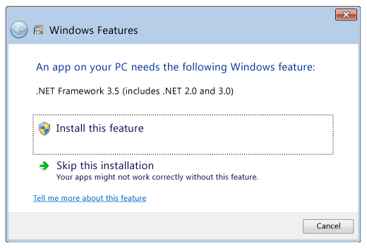
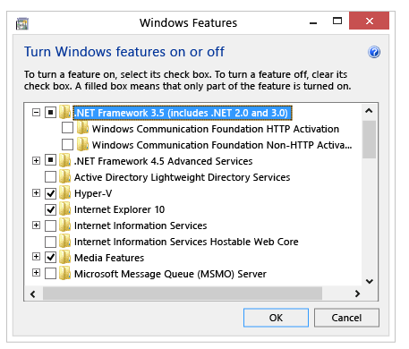

# 在 Windows 10、Windows 8.1 和 Windows 8 上安装 .NET Framework 3.5

## 下载脱机安装程序

.NET Framework 3.5 SP1 脱机安装程序可在 [.NET Framework 3.5 SP1 下载页](https://dotnet.microsoft.com/download/dotnet-framework/net35-sp1)上找到，并且适用于 Windows 10 之前的 Windows 版本。

## 按需安装.NET Framework 3.5

如果尝试运行的应用要求安装 .NET Framework 3.5，则会看到以下配置对话框。 选择“安装此功能” ，启用 .NET Framework 3.5。 此选项需要 Internet 连接。



### 为什么我会看到此弹出项？

.NET Framework 是由 Microsoft 创建，用于提供应用程序运行环境。 有多种不同版本。 许多公司都开发使用 .NET Framework 运行的应用程序，并且这些应用都定目标到具体版本。 如果看到此弹出项，表明尝试运行的应用程序需要 .NET Framework 版本 3.5，但未在系统上安装此版本。

## 在控制面板中启用 .NET Framework 3.5

可以通过 Windows 控制面板启用 .NET Framework 3.5。 此选项需要 Internet 连接。

1. 按下键盘上的 Windows 徽标键 ， 键入“Windows 功能”，然后按 Enter。 随即显示“打开或关闭 Windows 功能”对话框 。
2. 如果弹出提示，选择“.NET Framework 3.5 (包括 .NET 2.0 和 3.0)” 复选框，选择“确定”，然后重启计算机 。



1. 无需选择“Windows Communication Foundation (WCF) HTTP 激活” 和“Windows Communication Foundation (WCF) 非 HTTP 激活” 的子项，除非是需要使用此功能的开发者或服务器管理员。

## .NET Framework 3.5 安装疑难解答

安装过程中，你可能会遇到错误 0x800f0906、0x800f0907、0x800f081f 或 0x800F0922，此时请参阅 [.NET Framework 3.5 安装错误：0x800f0906、0x800f0907 或 0x800f081f](https://support.microsoft.com/help/2734782/net-framework-3-5-installation-error-0x800f0906--0x800f081f--0x800f09)，了解如何解决这些问题。

如果仍无法解决安装问题，或未连接到 Internet，可以尝试使用 Windows 安装介质进行安装。 有关详细信息，请参阅[使用部署映像服务和管理 (DISM) 部署 .NET Framework 3.5](https://docs.microsoft.com/zh-cn/windows-hardware/manufacture/desktop/deploy-net-framework-35-by-using-deployment-image-servicing-and-management--dism)。 如果使用的是 Windows 7、Windows 8.1 或最新的 Windows 10 版本，但没有安装媒体，请在此处创建最新的安装媒体：[为 Windows 创建安装媒体](https://support.microsoft.com/help/15088/windows-create-installation-media)。 有关 Windows 10 按需功能的附加信息：[按需功能](https://docs.microsoft.com/zh-cn/windows-hardware/manufacture/desktop/features-on-demand-v2--capabilities)。

# 使用部署映像服务和管理 (DISM) 部署 .NET Framework 3.5

可使用部署映像服务和管理 (DISM) 命令行工具创建修改后的映像以部署 .NET Framework 3.5。

对于将支持多种语言的映像，必须在添加任何语言包之前先添加 .NET Framework 3.5 二进制文件。 此顺序可确保 .NET Framework 3.5 语言资源已正确安装在引用映像中，且可供用户和应用程序使用。

## 通过 Internet 连接使用 DISM

### 要求

- 具有 Internet 连接
- 具有 Windows 更新的访问权限。 如果电脑或服务器位于防火墙后或使用代理服务器，请参阅 [KB900935 - Windows 更新客户端如何确定使用哪个代理服务器来连接到 Windows 更新网站](https://support.microsoft.com/kb/900935)。
- Windows 8、Windows Server 2012 或 [Windows 评估和部署工具包 (ADK)](https://docs.microsoft.com/zh-cn/previous-versions/windows/hh825420(v=win.10)) 工具。
- 安装介质
- 管理员用户权限。 当前用户必须是本地管理员组的成员才能添加或删除 Windows 功能。

### 对于可访问 Windows 更新的联机引用映像

1. 使用 Windows 8 或 Windows Server 2012 中的管理员用户权限（以管理员身份运行）打开命令提示符。

2. 若要从 Windows 更新安装 .NET Framework 3.5 功能文件，请使用以下命令：

   复制

   ```
   DISM /Online /Enable-Feature /FeatureName:NetFx3 /All 
   ```

   使用“/All”启用指定功能的所有父功能 。 有关 DISM 参数的详细信息，请参阅[使用 DISM 启用或禁用 Windows 功能](https://docs.microsoft.com/zh-cn/previous-versions/windows/it-pro/windows-8.1-and-8/hh824822(v=win.10))。

3. 安装完成后，在 Windows 8 电脑上，.NET Framework 3.5 在控制面板中的“打开或关闭 Windows 功能”中显示为“已启用”。 对于 Windows Server 2012 系统，可在服务器管理器中查看功能安装状态。

### 对于脱机引用映像

1. 运行以下 DISM 命令（装载到“c:\test\offline”文件夹的映像和“D:\drive”中的安装介质）以安装 .NET 3.5：

   复制

   ```
   DISM /Image:C:\test\offline /Enable-Feature /FeatureName:NetFx3 /All /LimitAccess /Source:D:\sources\sxs
   ```

   使用“/All”启用指定功能的所有父功能 。

   使用“/LimitAccess”阻止 DISM 与 Windows 更新/WSUS 联系 。

   使用“/Source”指定还原功能所需的文件的位置 。

   若要使用 Windows ADK 安装中的 DISM，请找到 Windows ADK 服务文件夹，并导航到此目录。 默认情况下，DISM 安装在“C:\Program Files (x86)\Windows Kits\8.0\Assessment and Deployment Kit\Deployment Tools”\中。 可通过 Windows ADK 在另一个支持的操作系统上安装 DISM 及其他部署和映像工具，如 Windows 系统映像管理器 (Windows SIM)。 有关 DISM 支持的平台的信息，请参阅 [DISM 支持的平台](https://docs.microsoft.com/zh-cn/previous-versions/windows/it-pro/windows-8.1-and-8/hh825186(v=win.10))。

2. 运行以下命令以查找 .NET Framework 3.5 的状态（装载到“c:\test\offline”的脱机映像）：

   复制

   ```
   DISM /Image:c:\test\offline /Get-Features /Format:Table
   ```

   如果状态为“启用挂起”，则必须将映像联机才能完成安装 。

## 在没有 Internet 连接的情况下使用 DISM

可使用 DISM 添加 .NET Framework 3.5，并提供对安装介质上的“\sources\SxS”文件夹的访问权限，以安装未连接到 Internet 的 Windows。

 警告

如果不依赖 Windows 更新作为安装 .NET Framework 3.5 的源，请确保使用相同且对应的 Windows 操作系统版本中的源。 使用不对应于同一版本 Windows 的源路径不会阻止安装 .NET Framework 3.5 的不匹配版本。 这可能导致系统陷入不受支持和无法服务的状态。

### 要求

- Windows 8、Windows Server 2012 或 [Windows ADK](https://docs.microsoft.com/zh-cn/previous-versions/windows/hh825420(v=win.10)) 工具。
- 安装介质
- 管理员用户权限。 当前用户必须是本地管理员组的成员才能添加或删除 Windows 功能。

### 步骤

1. 使用管理员用户权限（以管理员身份运行）打开命令提示符。

2. 若要从位于“D:”驱动器上的安装介质安装 .NET Framework 3.5，请使用以下命令 ：

   复制

   ```
   DISM /Online /Enable-Feature /FeatureName:NetFx3 /All /LimitAccess /Source:d:\sources\sxs
   ```

   使用“/All”启用指定功能的所有父功能 。

   使用“/LimitAccess”阻止 DISM 与 Windows 更新/WSUS 联系 。

   使用“/Source”指定还原功能所需的文件的位置 。

   有关 DISM 参数的详细信息，请参阅[使用 DISM 启用或禁用 Windows 功能](https://docs.microsoft.com/zh-cn/previous-versions/windows/it-pro/windows-8.1-and-8/hh824822(v=win.10))。

安装完成后，在 Windows 8 电脑上，.NET Framework 3.5 在控制面板中的“打开或关闭 Windows 功能”中显示为“已启用”。