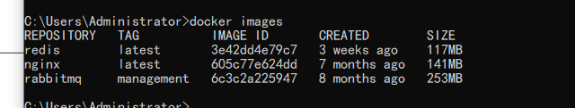
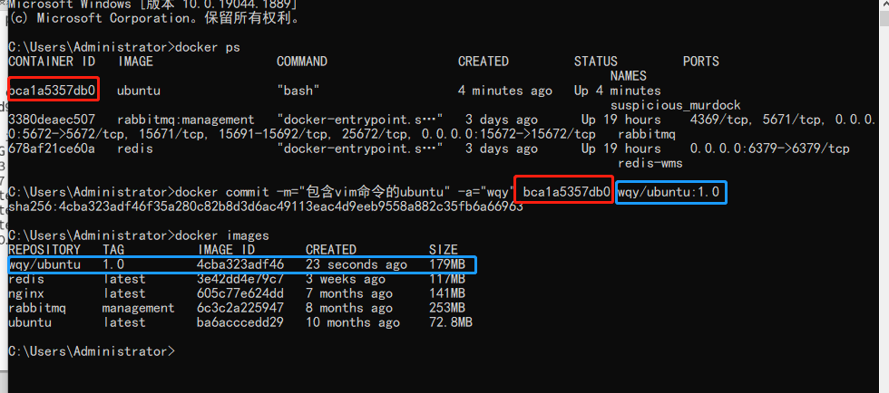
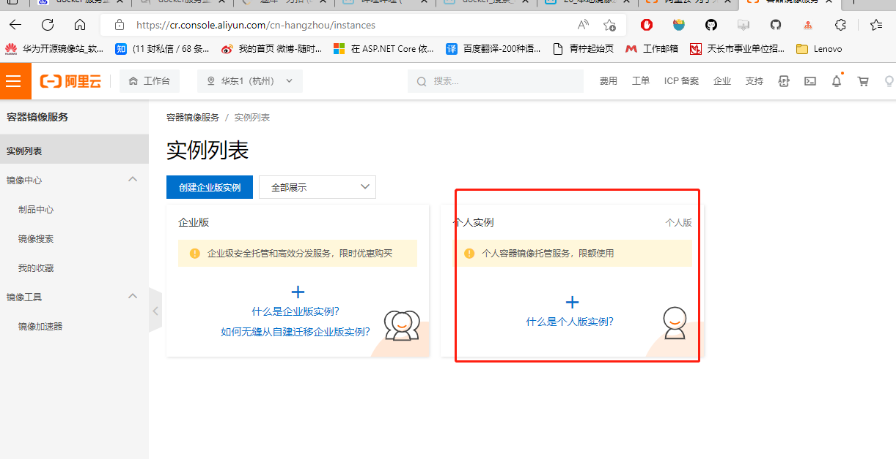
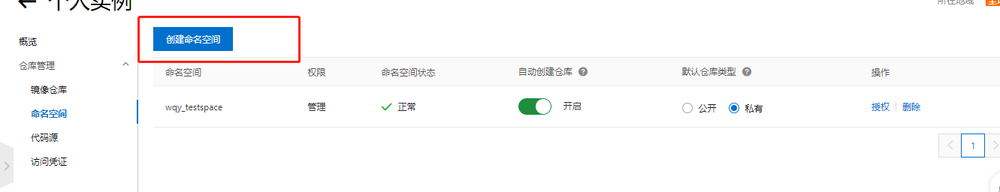
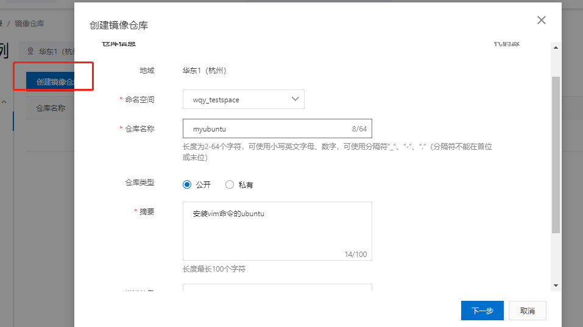
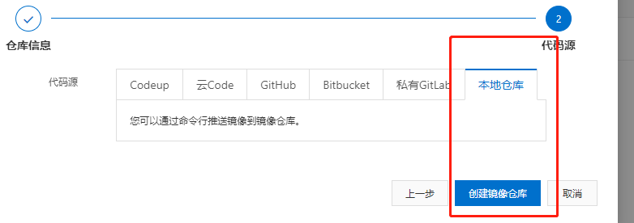
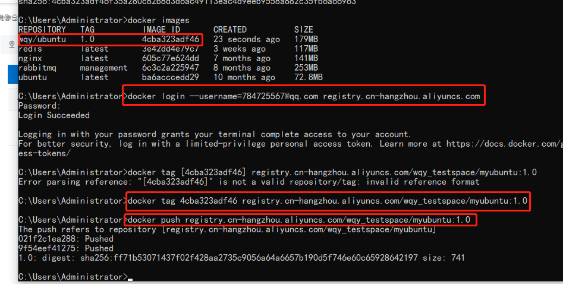
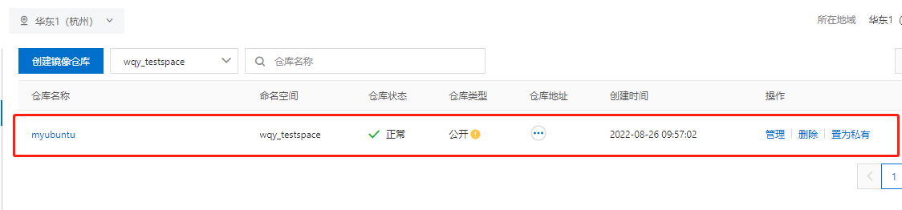

# 安装

Ubuntu [官方安装网址](https://docs.docker.com/engine/install/ubuntu/)

### 操作系统要求

要安装 Docker Engine，您需要这些 Ubuntu 之一的 64 位版本 版本：

- Ubuntu Kinetic 22.10
- Ubuntu Jammy 22.04 （LTS）
- Ubuntu Focal 20.04 （LTS）
- Ubuntu 仿生 18.04 （LTS）

Docker 引擎与（或）,,,和架构兼容。`x86_64``amd64``armhf``arm64``s390x`

### 卸载旧版本

旧版本的Docker的名字是，，或。在尝试安装之前卸载任何此类旧版本 新版本：`docker``docker.io``docker-engine`

```
$ sudo apt-get remove docker docker-engine docker.io containerd runc
```

如果报告未安装这些包，则没关系。`apt-get`

存储的映像、容器、卷和网络不是 卸载 Docker 时自动删除。如果要从 全新安装，并且希望清理任何现有数据，请参阅[卸载 Docker 引擎](https://docs.docker.com/engine/install/ubuntu/#uninstall-docker-engine)部分。`/var/lib/docker/`

## 安装方法

您可以根据需要以不同的方式安装 Docker 引擎：

- Docker Engine 与[Docker Desktop for Linux](https://docs.docker.com/desktop/install/linux-install/) 捆绑在一起。这是 最简单、最快捷的入门方法。
- 您还可以从[Docker's repository`apt`](https://docs.docker.com/engine/install/ubuntu/#install-using-the-repository).
- 手动[安装并手动](https://docs.docker.com/engine/install/ubuntu/#install-from-a-package)管理升级。
- 使用[方便的脚本](https://docs.docker.com/engine/install/ubuntu/#install-using-the-convenience-script)。只 建议用于测试和开发环境。

### 使用存储库安装

在新主机上首次安装 Docker 引擎之前，您需要 需要设置 Docker 存储库。之后，您可以安装和更新 存储库中的 Docker。

#### 设置存储库

1. 更新软件包索引并安装软件包以允许使用 基于 HTTPS 的存储库：`apt``apt`
   
   ```
   $ sudo apt-get update
   
   $ sudo apt-get install \
       ca-certificates \
       curl \
       gnupg \
       lsb-release
   ```

2. 添加 Docker 的官方 GPG 密钥：
   
   ```
   $ sudo mkdir -p /etc/apt/keyrings
   $ curl -fsSL https://download.docker.com/linux/ubuntu/gpg | sudo gpg --dearmor -o /etc/apt/keyrings/docker.gpg
   ```

3. 使用以下命令设置存储库：
   
   ```
   $ echo \
     "deb [arch=$(dpkg --print-architecture) signed-by=/etc/apt/keyrings/docker.gpg] https://download.docker.com/linux/ubuntu \
     $(lsb_release -cs) stable" | sudo tee /etc/apt/sources.list.d/docker.list > /dev/null
   ```

#### 安装 Docker 引擎

1. 更新包索引：`apt`
   
   ```
   $ sudo apt-get update
   ```
   
   > 运行时收到 GPG 错误？`apt-get update`
   > 默认[掩码](https://en.wikipedia.org/wiki/Umask)可能配置不正确，导致无法检测到 存储库公钥文件。尝试授予 Docker 的读取权限 更新包索引之前的公钥文件：
   > 
   > 
   > 
   > ```
   > $ sudo chmod a+r /etc/apt/keyrings/docker.gpg
   > $ sudo apt-get update
   > ```

2. 安装 Docker Engine、containerd 和 Docker Compose。
   
   - 最近的
   - 特定版本
   
   要安装最新版本，请运行：
   
   ```
    $ sudo apt-get install docker-ce docker-ce-cli containerd.io docker-compose-plugin
   ```
   
   ------

3. 通过运行映像验证 Docker 引擎安装是否成功：`hello-world`
   
   ```
   $ sudo docker run hello-world
   ```
   
   此命令下载测试映像并在容器中运行它。当 容器运行，它会打印确认消息并退出。

您现在已成功安装并启动 Docker 引擎。用户 组存在，但不包含任何用户，这就是为什么需要使用来运行 Docker 命令的原因。继续执行[Linux 安装后](https://docs.docker.com/engine/install/linux-postinstall/)操作，以允许非特权用户运行 Docker 命令和其他可选 配置步骤。`docker``sudo`

#### 升级码头工人引擎

要升级 Docker 引擎，请按照[安装说明](https://docs.docker.com/engine/install/ubuntu/#install-docker-engine)选择新版本 您要安装。

### 从包安装

如果你不能使用 Docker 的存储库来安装 Docker Engine，你可以 下载适用于您的版本的文件并手动安装。你需要 每次要升级 Docker 引擎时下载一个新文件。`apt``deb`

1. 转到[`https://download.docker.com/linux/ubuntu/dists/`](https://download.docker.com/linux/ubuntu/dists/).

2. 在列表中选择您的 Ubuntu 版本。

3. 转到并选择适用的体系结构（,,, OR）。`pool/stable/``amd64``armhf``arm64``s390x`

4. 下载以下适用于 Docker 引擎、CLI、containerd 和 和 Docker Compose 包：`deb`
   
   - `containerd.io_<version>_<arch>.deb`
   - `docker-ce_<version>_<arch>.deb`
   - `docker-ce-cli_<version>_<arch>.deb`
   - `docker-compose-plugin_<version>_<arch>.deb`

5. 安装软件包。将以下示例中的路径更新为 您下载了 Docker 软件包的位置。`.deb`
   
   ```
   $ sudo dpkg -i ./containerd.io_<version>_<arch>.deb \
     ./docker-ce_<version>_<arch>.deb \
     ./docker-ce-cli_<version>_<arch>.deb \
     ./docker-compose-plugin_<version>_<arch>.deb
   ```
   
   Docker 守护程序会自动启动。

6. 通过运行映像验证 Docker 引擎安装是否成功：`hello-world`
   
   ```
   $ sudo docker run hello-world
   ```
   
   此命令下载测试映像并在容器中运行它。当 容器运行，它会打印确认消息并退出。

您现在已成功安装并启动 Docker 引擎。用户 组存在，但不包含任何用户，这就是为什么需要使用来运行 Docker 命令的原因。继续执行[Linux 安装后](https://docs.docker.com/engine/install/linux-postinstall/)操作，以允许非特权用户运行 Docker 命令和其他可选 配置步骤。`docker``sudo`

#### 升级Docker引擎

要升级 Docker 引擎，请下载较新的软件包文件并重复[安装过程](https://docs.docker.com/engine/install/ubuntu/#install-from-a-package)，指向新文件。

### 使用方便脚本安装

Docker提供了一个方便的脚本，https://get.docker.com/ 将Docker安装到中 非交互式开发环境。方便脚本不是 建议用于生产环境，但它对于创建 根据需求量身定制的预配脚本。另请参阅[使用存储库安装](https://docs.docker.com/engine/install/ubuntu/#install-using-the-repository)的步骤以了解 关于使用包存储库进行安装的安装步骤。出处 该脚本的代码是开源的，可以在[`docker-install`GitHub 上的存储库](https://github.com/docker/docker-install).

在本地运行脚本之前，请始终检查从互联网下载的脚本。 在安装之前，请熟悉潜在的风险和限制 的方便脚本：

- 该脚本需要权限才能运行。`root``sudo`
- 该脚本尝试检测您的 Linux 发行版和版本，以及 为您配置包管理系统。
- 该脚本不允许您自定义大多数安装参数。
- 该脚本安装依赖项和建议，而不要求 确认。这可能会安装大量软件包，具体取决于 主机的当前配置。
- 默认情况下，该脚本会安装 Docker 的最新稳定版本， 集装箱，和润色。使用此脚本置备计算机时，这可能会 导致 Docker 的意外主要版本升级。始终在 中测试升级 部署到生产系统之前的测试环境。
- 该脚本并非旨在升级现有的 Docker 安装。什么时候 使用脚本更新现有安装，依赖项可能不是 更新到预期版本，导致版本过时。

> 提示：运行前预览脚本步骤
> 
> 您可以使用选项运行脚本，以了解哪些步骤 脚本将在调用时运行：`DRY_RUN=1`
> 
> ```
> $ curl -fsSL https://get.docker.com -o get-docker.sh
> $ DRY_RUN=1 sudo sh ./get-docker.sh
> ```

此示例从https://get.docker.com/ 下载脚本并运行它以安装 Linux 上 Docker 的最新稳定版本：

```
$ curl -fsSL https://get.docker.com -o get-docker.sh
$ sudo sh get-docker.sh
Executing docker install script, commit: 7cae5f8b0decc17d6571f9f52eb840fbc13b2737
<...>
```

您现在已成功安装并启动 Docker 引擎。该服务在基于 Debian 的发行版上自动启动。基于基础 发行版，如 CentOS、Fedora、RHEL 或 SLES，您需要启动它 手动使用 appropriateor命令。作为消息 表示默认情况下，非 root 用户无法运行 Docker 命令。`docker``RPM``systemctl``service`

> **以非特权用户身份使用 Docker，还是以无根模式安装？**
> 
> 安装脚本需要权限才能安装和 使用 Docker。如果要授予非 root 用户访问 Docker 的权限，请参阅[Linux 的安装后步骤](https://docs.docker.com/engine/install/linux-postinstall/#manage-docker-as-a-non-root-user)。 您也可以在没有权限的情况下安装 Docker，或配置为在 无根模式。有关在无根模式下运行 Docker 的说明，请参阅[以非 root 用户身份运行 Docker 守护程序（无根模式）。](https://docs.docker.com/engine/security/rootless/)`root``sudo``root`

#### 安装预发行版

Docker还提供了方便的脚本，https://test.docker.com/ 安装预发行版 Docker on Linux.此脚本等于脚本在，但 将包管理器配置为使用 Docker 包的测试通道 存储 库。测试通道包括稳定版和预发布版（测试版 版本，发布候选者）的 Docker。使用此脚本提前访问 新版本，并在发布之前在测试环境中对其进行评估 作为稳定发布。`get.docker.com`

要从测试通道在 Linux 上安装最新版本的 Docker，请运行：

```
$ curl -fsSL https://test.docker.com -o test-docker.sh
$ sudo sh test-docker.sh
```

#### 使用方便脚本后升级 Docker

如果您使用便利脚本安装了 Docker，则应升级 Docker 直接使用包管理器。重新运行 方便脚本。如果尝试重新安装，重新运行它可能会导致问题 主机上已存在的存储库。

## 卸载Docker引擎

1. 卸载 Docker Engine、CLI、containerd 和 Docker Compose 软件包：
   
   ```
   $ sudo apt-get purge docker-ce docker-ce-cli containerd.io docker-compose-plugin
   ```

2. 主机上的映像、容器、卷或自定义配置文件 不会自动移除。要删除所有映像、容器和卷，请执行以下操作：
   
   ```
   $ sudo rm -rf /var/lib/docker
   $ sudo rm -rf /var/lib/containerd
   ```

您必须手动删除任何已编辑的配置文件。

# 阿里云镜像加速

使用加速器可以提升获取Docker官方镜像的速度

加速器

| 加速器地址                                |
| ------------------------------------ |
| https://ph2uascc.mirror.aliyuncs.com |

操作文档

## Ubuntu

### 1. 安装／升级Docker客户端

推荐安装1.10.0以上版本的Docker客户端，参考文档[docker-ce](https://yq.aliyun.com/articles/110806)

### 2. 配置镜像加速器

针对Docker客户端版本大于 1.10.0 的用户

您可以通过修改daemon配置文件/etc/docker/daemon.json来使用加速器

```
sudo mkdir -p /etc/docker
sudo tee /etc/docker/daemon.json <<-'EOF'
{
  "registry-mirrors": [
                "https://registry.docker-cn.com",
                "https://mirrors.tuna.tsinghua.edu.cn",
                "https://aeckruos.mirror.aliyuncs.com",
                "http://hub-mirror.c.163.com",
                "https://docker.mirrors.ustc.edu.cn"
    ]
}
EOF
sudo systemctl daemon-reload
sudo systemctl restart docker
```

## CentOS

### 1. 安装／升级Docker客户端

推荐安装1.10.0以上版本的Docker客户端，参考文档[docker-ce](https://yq.aliyun.com/articles/110806)

### 2. 配置镜像加速器

针对Docker客户端版本大于 1.10.0 的用户

您可以通过修改daemon配置文件/etc/docker/daemon.json来使用加速器

```
sudo mkdir -p /etc/docker
sudo tee /etc/docker/daemon.json <<-'EOF'
{
  "registry-mirrors": ["https://ph2uascc.mirror.aliyuncs.com"]
}
EOF
sudo systemctl daemon-reload
sudo systemctl restart docker
```

## MAC

### 1. 安装／升级Docker客户端

对于10.10.3以下的用户 推荐使用Docker Toolbox

Mac安装文件：http://mirrors.aliyun.com/docker-toolbox/mac/docker-toolbox/

对于10.10.3以上的用户 推荐使用Docker for Mac

Mac安装文件：http://mirrors.aliyun.com/docker-toolbox/mac/docker-for-mac/

### 2. 配置镜像加速器

针对安装了Docker Toolbox的用户，您可以参考以下配置步骤：

创建一台安装有Docker环境的Linux虚拟机，指定机器名称为default，同时配置Docker加速器地址。

```
docker-machine create --engine-registry-mirror=https://ph2uascc.mirror.aliyuncs.com -d virtualbox default
```

查看机器的环境配置，并配置到本地，并通过Docker客户端访问Docker服务。

```
docker-machine env defaulteval "$(docker-machine env default)"docker info
```

针对安装了Docker for Mac的用户，您可以参考以下配置步骤：

在任务栏点击 Docker Desktop 应用图标 -> Perferences，在左侧导航菜单选择 Docker Engine，在右侧输入栏编辑 json 文件。将

https://ph2uascc.mirror.aliyuncs.com加到"registry-mirrors"的数组里，点击 Apply & Restart按钮，等待Docker重启并应用配置的镜像加速器。

### 3. 相关文档

[Docker 命令参考文档](https://docs.docker.com/engine/reference/commandline/cli/)

[Dockerfile 镜像构建参考文档](https://docs.docker.com/engine/reference/builder/)

## Windows

### 1. 安装／升级Docker客户端

对于Windows 10以下的用户，推荐使用Docker Toolbox

Windows安装文件：http://mirrors.aliyun.com/docker-toolbox/windows/docker-toolbox/

对于Windows 10以上的用户 推荐使用Docker for Windows

Windows安装文件：http://mirrors.aliyun.com/docker-toolbox/windows/docker-for-windows/

### 2. 配置镜像加速器

针对安装了Docker Toolbox的用户，您可以参考以下配置步骤：

创建一台安装有Docker环境的Linux虚拟机，指定机器名称为default，同时配置Docker加速器地址。

```
docker-machine create --engine-registry-mirror=https://ph2uascc.mirror.aliyuncs.com -d virtualbox default
```

查看机器的环境配置，并配置到本地，并通过Docker客户端访问Docker服务。

```
docker-machine env defaulteval "$(docker-machine env default)"docker info
```

针对安装了Docker for Windows的用户，您可以参考以下配置步骤：

在系统右下角托盘图标内右键菜单选择 Settings，打开配置窗口后左侧导航菜单选择 Docker Daemon。编辑窗口内的JSON串，填写下方加速器地址：

```
{
  "registry-mirrors": ["https://ph2uascc.mirror.aliyuncs.com"]
}
```

编辑完成后点击 Apply 保存按钮，等待Docker重启并应用配置的镜像加速器。

### 注意

Docker for Windows 和 Docker Toolbox互不兼容，如果同时安装两者的话，需要使用hyperv的参数启动。

```
docker-machine create --engine-registry-mirror=https://ph2uascc.mirror.aliyuncs.com -d hyperv default
```

Docker for Windows 有两种运行模式，一种运行Windows相关容器，一种运行传统的Linux容器。同一时间只能选择一种模式运行。

### 3. 相关文档

[Docker 命令参考文档](https://docs.docker.com/engine/reference/commandline/cli/)

[Dockerfile 镜像构建参考文档](https://docs.docker.com/engine/reference/builder/)

# 常用操作和命令

## 启动，停止，重启docker服务(Linux)

```powershell
# 启动
systemctl start docker

# 停止
systemctl stop docker

# 重启
systemctl restart docker
```

## 查看docker状态，信息

```powershell
# 状态
systemctl status docker

#信息
docker info
```

## docker开机启动

```powershell
systemctl enable docker
```

## 查找镜像

```powershell
docker search 镜像名
```



- REPOSITORY:镜像的仓库源
- TAG:镜像版本号
- IMAGE ID:镜像ID
- CREATED:创建时间
- SIZE:镜像大小

## 查看所有镜像

```powershell
docker images
```

## 拉取docker镜像，示例拉取的SQL server镜像

```powershell
docker pull microsoft/mssql-server-linux[:TAG]
```

## 删除镜像

```powershell
# 删除容器和镜像要先停止运行的容器
docker rmi 镜像名
```

## 启动容器

```powershell
docker run --name sql_server -m 512m -e 'ACCEPT_EULA=Y' -e 'SA_PASSWORD=sa.123456' -p 11433:1433 -d microsoft/mssql-server-linux
```

--name：容器名

-m：配置内存

-e：设置环境变量

-p：指定端口映射，左边docker映射端口，右边容器内部端口

-P：随机端口映射

-d：后台运行

-i：以交互模式运行容器，通常和-t同时使用

-t：为容器重新分配一个伪输入终端，即启动交互式容器

## 查看容器状态

```powershell
docker ps
```

## 停止和开启容器

```powershell
docker stop 容器名

docker start 容器名
```

## 重启容器

```powershell
docker restart 容器名
```

## 容器自启动

```powershell
docker update --restart=always sql_server
```

## 删除容器，删除前需要先停止容器

```powershell
docker rm 容器名
```

## 查看容器运行日志

```powershell
docker logs 容器ID
```

## 查看容器内部细节

```powershell
docker inspect 容器ID
```

## 进入正在运行的容器，终端交互

```powershell
docker exec -it 容器ID /bin/bash

#退出,容器不停止
exit
```

## 从容器拷贝文件到主机

```powershell
docker cp 容器ID:容器内路径 目的主机路径
```

## 导入导出容器

```powershell
# 导出
docker export 容器ID > name.tar

#导入
cat name.tar | docker import - 镜像用户/镜像名:镜像版本号
```

## 提交容器副本作为新的镜像

```powershell
docker commit -m="描述信息" -a="作者" 容器ID 要创建的目标镜像名:[TAG]
```



## 本地镜像推送到阿里云









- 按照阿里云指令执行
  
  ```powershell
  docker login --username=7847*****@qq.com registry.cn-hangzhou.aliyuncs.com
  
  docker tag [ImageId] registry.cn-hangzhou.aliyuncs.com/wqy_testspace/myubuntu:[镜像版本号]
  
  docker push registry.cn-hangzhou.aliyuncs.com/wqy_testspace/myubuntu:[镜像版本号]
  ```





## 映射容器目录和宿主主机目录

```powershell
#-v可以多个
#:ro或者rw readonly 或者 read+write 
docker run -it --privileged=true -v 宿主主机绝对路径:容器内绝对路径[:ro或者rw] 镜像名
```

## 本地镜像推送到私有库

- Docker Registry是官方提供的工具，可以用于构建私有镜像仓库
  
  ```powershell
  docker pull registry
  
  docker run -d -p 5000:5000  -v /本地路径/myregistry/:/tmp/registry --privileged=true registry
  # 默认情况，仓库被创建在容器的/var/lib/registry目录下，建议自行用容器卷映射，方便于宿主机联调
  ```

- curl验证私服库上有什么镜像
  
  ```powershell
  curl -XGET http://192.168.242.128:5000/v2/_catalog
  ```

- 将新镜像zzyyubuntu:1.2修改符合私服规范的Tag
  
  ```powershell
  # docker   tag   镜像:Tag   Host:Port/Repository:Tag
  
  docker tag  wqy/ubuntu:1.0  192.168.242.128:5000/myubuntu:1.0
  ```

- 修改配置文件使之支持http
  
  ```powershell
  vim /etc/docker/daemon.json
  ```
  
  ```json
  {
    "registry-mirrors": ["https://aa25jngu.mirror.aliyuncs.com"],
    "insecure-registries": ["192.168.242.128:5000"]
  }
  # docker默认不允许http方式推送镜像，通过配置选项来取消这个限制。====> 修改完后如果不生效，建议重启docker
  ```

- push推送到私服库
  
  ```powershell
  docker push 192.168.242.128:5000/myubuntu:1.0
  ```

- pull到本地并运行
  
  ```powershell
  docker pull 192.168.242.128:5000/myubuntu:1.0
  ```

# Docker轻量级可视化工具Portainer

- https://www.portainer.io/

- https://docs.portainer.io/v/ce-2.9/start/install/server/docker/linux

## 安装

### Linux

```powershell
docker pull portainer

docker volume create portainer_data

docker run -d -p 8000:8000 -p 9000:9000 --name portainer \
    --restart=always \
    -v /var/run/docker.sock:/var/run/docker.sock \
    -v portainer_data:/data \
    portainer/portainer-ce:latest
```

### windows

```powershell
# powershell
netsh advfirewall firewall add rule name="cluster_management" dir=in action=allow protocol=TCP localport=2377
netsh advfirewall firewall add rule name="node_communication_tcp" dir=in action=allow protocol=TCP localport=7946
netsh advfirewall firewall add rule name="node_communication_udp" dir=in action=allow protocol=UDP localport=7946
netsh advfirewall firewall add rule name="overlay_network" dir=in action=allow protocol=UDP localport=4789
netsh advfirewall firewall add rule name="swarm_dns_tcp" dir=in action=allow protocol=TCP localport=53
netsh advfirewall firewall add rule name="swarm_dns_udp" dir=in action=allow protocol=UDP localport=53

Enable-WindowsOptionalFeature -Online -FeatureName containers -All
Install-Module -Name DockerMsftProvider -Repository PSGallery -Force
Install-Package -Name docker -ProviderName DockerMsftProvider
```

```powershell
docker volume create portainer_data

docker run -d -p 8000:8000 -p 9000:9000 --name portainer --restart always -v \\.\pipe\docker_engine:\\.\pipe\docker_engine -v portainer_data:C:\data portainer/portainer-ce:latest
```
